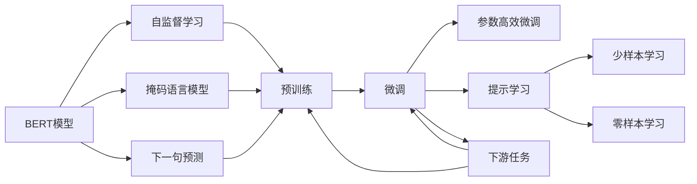

                 

# BERT原理与代码实例讲解

> 关键词：BERT,Transformer,Bidirectional Encoder Representations from Transformers,语言模型,自监督学习

## 1. 背景介绍

### 1.1 问题由来

近年来，自然语言处理（NLP）领域的核心技术不断突破，尤其是基于深度学习模型的语言模型，在文本分类、情感分析、机器翻译等诸多任务上取得了显著进展。然而，传统的基于一维序列模型的语言模型，如RNN、LSTM等，难以处理长文本，且训练数据需大量标注，难以覆盖广泛的语言现象。因此，如何构建一个既能够高效处理长文本，又能在无需标注的情况下学习到丰富语言知识的大语言模型，成为了NLP领域的一大挑战。

BERT（Bidirectional Encoder Representations from Transformers）模型的提出，有效解决了这些问题。BERT是一种基于Transformer架构的双向语言模型，通过预训练任务在大规模无标注语料上进行自监督学习，学习到了语言的多义性、上下文关联性和语义表示等能力。这些能力不仅使得BERT在多项NLP任务上取得了突破性的成绩，也开启了大规模预训练语言模型在实际应用中的新篇章。

### 1.2 问题核心关键点

BERT的核心在于其双向Transformer架构和预训练自监督任务的设计。BERT模型采用了Transformer的编码器-解码器结构，通过双向自注意力机制（bi-directional self-attention）来捕捉句子中的上下文信息，并利用掩码语言模型（Masked Language Model, MLM）和下一句预测（Next Sentence Prediction, NSP）任务进行预训练。预训练过程使得BERT能够学习到广泛的语义信息，同时保留了语言知识的上下文依赖性。

通过这种预训练方式，BERT能够在没有标注数据的情况下，学习到丰富的语言表示能力。这种能力使得BERT在微调时，只需在少量标注数据上进行监督学习，即可获得优异的表现。

## 2. 核心概念与联系

### 2.1 核心概念概述

为了更好地理解BERT模型及其微调方法，本节将介绍几个密切相关的核心概念：

- BERT模型：一种基于Transformer架构的双向语言模型，通过自监督预训练任务在大规模无标注语料上学习语言知识。
- 自监督学习（Self-Supervised Learning）：一种无需人工标注数据的学习方式，通过数据本身的内在结构来学习模型的表示能力。
- 掩码语言模型（MLM）：一种自监督任务，通过随机掩码输入文本中的部分单词，让模型预测被掩码的单词。
- 下一句预测（NSP）：一种自监督任务，通过随机对两个句子进行组合，让模型判断它们是否为连续句子。
- 微调（Fine-Tuning）：在预训练模型的基础上，使用下游任务的少量标注数据，通过有监督学习优化模型在特定任务上的性能。
- 参数高效微调（Parameter-Efficient Fine-Tuning, PEFT）：在微调过程中，只更新少量的模型参数，而固定大部分预训练权重不变，以提高微调效率，避免过拟合的方法。
- 提示学习（Prompt Learning）：通过在输入文本中添加提示模板（Prompt Template），引导BERT进行特定任务的推理和生成。
- 少样本学习（Few-shot Learning）：在只有少量标注样本的情况下，模型能够快速适应新任务的学习方法。
- 零样本学习（Zero-shot Learning）：在模型没有见过任何特定任务的训练样本的情况下，仅凭任务描述就能够执行新任务的能力。

这些核心概念之间的逻辑关系可以通过以下Mermaid流程图来展示：



这个流程图展示了大语言模型的核心概念及其之间的关系：

1. BERT模型通过自监督学习在大规模无标注语料上进行预训练，学习到语言的多义性、上下文关联性和语义表示等能力。
2. 预训练任务包括掩码语言模型和下一句预测，使得BERT模型能够学习到语言的分布式表示和语义理解能力。
3. 微调是在预训练模型的基础上，使用下游任务的少量标注数据，通过有监督学习优化模型在特定任务上的性能。
4. 参数高效微调和提示学习等方法进一步提高了微调效率和模型的泛化能力。
5. 少样本学习和零样本学习利用大语言模型的语言理解能力，在较少标注样本或无标注样本的情况下，实现任务执行。

## 3. 核心算法原理 & 具体操作步骤

### 3.1 算法原理概述

BERT模型的核心思想是通过自监督学习任务，在大规模无标注语料上进行预训练，学习到语言的多义性、上下文关联性和语义表示等能力。这些能力使得BERT在微调时，只需在少量标注数据上进行监督学习，即可获得优异的表现。

形式化地，假设输入文本为 $x=\{x_i\}_{i=1}^n$，模型参数为 $\theta$，BERT模型的前向传播过程可以表示为：

$$
y = \text{BERT}(x; \theta)
$$

其中 $y$ 表示模型的输出，可以是文本的分布式表示，也可以是分类或回归的结果。

BERT的预训练过程通过两个任务进行：掩码语言模型（MLM）和下一句预测（NSP）。MLM任务随机掩码输入文本中的部分单词，让模型预测被掩码的单词；NSP任务则随机对两个句子进行组合，让模型判断它们是否为连续句子。这两个任务的目标函数分别为：

$$
\mathcal{L}_{\text{MLM}} = -\sum_{i=1}^n \log p(x_i \mid y_{1:n})
$$

$$
\mathcal{L}_{\text{NSP}} = -\sum_{i=1}^n \log p(y_{1:i} \mid x_{1:i})
$$

其中 $p(\cdot)$ 表示概率分布函数，$y_{1:i} = \{y_1, y_2, ..., y_i\}$ 表示掩码序列中未被掩码的单词，$x_{1:i} = \{x_1, x_2, ..., x_i\}$ 表示掩码序列中已知的单词。

### 3.2 算法步骤详解

BERT模型的预训练和微调过程可以总结为以下几步：

**Step 1: 准备数据集**

- 收集大规模无标注语料，如维基百科、新闻、社交媒体等。
- 将语料分割成句子序列，进行分词处理。

**Step 2: 定义预训练任务**

- 定义掩码语言模型（MLM）任务。
- 定义下一句预测（NSP）任务。
- 确定掩码比例和随机组合比例。

**Step 3: 训练预训练模型**

- 使用随机梯度下降等优化算法，最小化预训练损失函数。
- 在预训练过程中，保持模型参数不变，只更新掩码序列和随机组合序列。

**Step 4: 微调模型**

- 收集下游任务的数据集，并进行标注。
- 使用预训练模型作为初始化参数，通过监督学习微调模型。
- 在微调过程中，冻结预训练参数，只更新微调参数。

**Step 5: 评估和部署**

- 在测试集上评估微调后模型的性能。
- 使用微调后的模型对新样本进行推理预测，集成到实际的应用系统中。
- 持续收集新的数据，定期重新微调模型，以适应数据分布的变化。

### 3.3 算法优缺点

BERT模型具有以下优点：

- 预训练过程可以在大规模无标注语料上进行，避免了标注数据的成本和偏差。
- 通过双向Transformer架构，能够学习到语言的上下文关联性和多义性。
- 微调过程只需少量标注数据，即可在多种NLP任务上获得优异表现。

同时，BERT模型也存在一些局限性：

- 预训练过程耗时较长，需要高性能计算资源。
- 微调过程需要手动设置参数和任务，增加了模型的复杂性。
- 模型的泛化能力可能受限于数据质量和标注样本的分布。

### 3.4 算法应用领域

BERT模型已经在多项NLP任务上取得了突破性成果，具体应用领域包括但不限于：

- 文本分类：如情感分析、主题分类、新闻分类等。
- 命名实体识别（NER）：识别文本中的人名、地名、机构名等特定实体。
- 关系抽取：从文本中抽取实体之间的语义关系。
- 问答系统：对自然语言问题给出答案。
- 机器翻译：将源语言文本翻译成目标语言。
- 文本摘要：将长文本压缩成简短摘要。
- 对话系统：使机器能够与人自然对话。

除了这些经典任务外，BERT模型还被创新性地应用到更多场景中，如可控文本生成、常识推理、代码生成、数据增强等，为NLP技术带来了全新的突破。

## 4. 数学模型和公式 & 详细讲解 & 举例说明

### 4.1 数学模型构建

BERT模型的数学模型可以视为一个深度学习神经网络，其中包含了Transformer编码器、掩码语言模型（MLM）和下一句预测（NSP）任务。下面将通过数学公式的形式，详细阐述BERT的模型结构和预训练任务。

### 4.2 公式推导过程

BERT模型的前向传播过程可以表示为：

$$
\begin{aligned}
H &= \text{Encoder}(x; \theta) \\
y &= \text{MLM}(H; \theta) \\
y &= \text{NSP}(H; \theta) \\
\end{aligned}
$$

其中 $\text{Encoder}(\cdot)$ 表示Transformer编码器，$\theta$ 表示模型参数，$x$ 表示输入文本，$y$ 表示模型的输出。

掩码语言模型（MLM）任务的目标函数可以表示为：

$$
\mathcal{L}_{\text{MLM}} = -\sum_{i=1}^n \log p(x_i \mid y_{1:n})
$$

其中 $p(\cdot)$ 表示概率分布函数，$y_{1:n}$ 表示掩码序列中所有单词的预测结果。

下一句预测（NSP）任务的目标函数可以表示为：

$$
\mathcal{L}_{\text{NSP}} = -\sum_{i=1}^n \log p(y_{1:i} \mid x_{1:i})
$$

其中 $p(\cdot)$ 表示概率分布函数，$y_{1:i}$ 表示掩码序列中前 $i$ 个单词的预测结果，$x_{1:i}$ 表示掩码序列中前 $i$ 个单词的掩码序列。

### 4.3 案例分析与讲解

以情感分类任务为例，我们可以使用BERT模型对电影评论进行情感分类。首先，我们需要将电影评论作为输入文本，使用预训练的BERT模型进行编码。然后，将编码后的文本输入到一个全连接层，使用softmax函数进行情感分类。具体步骤如下：

1. 收集电影评论数据集，并进行标注。
2. 将数据集分为训练集、验证集和测试集。
3. 使用预训练的BERT模型进行微调。
4. 在测试集上评估微调后模型的性能。
5. 使用微调后的模型对新的电影评论进行情感分类。

下面给出使用PyTorch实现BERT微调情感分类的代码：

```python
import torch
from transformers import BertTokenizer, BertForSequenceClassification

# 加载预训练模型和分词器
model = BertForSequenceClassification.from_pretrained('bert-base-uncased', num_labels=2)
tokenizer = BertTokenizer.from_pretrained('bert-base-uncased')

# 加载训练集和测试集
train_dataset = ...
test_dataset = ...

# 定义训练函数
def train(model, train_dataset, device, optimizer, num_epochs):
    model.train()
    total_loss = 0.0
    for epoch in range(num_epochs):
        for batch in train_dataset:
            inputs = tokenizer(batch.text, max_length=512, truncation=True, padding='max_length', return_tensors='pt')
            labels = batch.label
            inputs = {k: v.to(device) for k, v in inputs.items()}
            labels = labels.to(device)
            outputs = model(**inputs)
            loss = outputs.loss
            optimizer.zero_grad()
            loss.backward()
            optimizer.step()
            total_loss += loss.item()
    return total_loss / len(train_dataset)

# 定义评估函数
def evaluate(model, test_dataset, device):
    model.eval()
    total_loss = 0.0
    correct = 0
    with torch.no_grad():
        for batch in test_dataset:
            inputs = tokenizer(batch.text, max_length=512, truncation=True, padding='max_length', return_tensors='pt')
            labels = batch.label
            inputs = {k: v.to(device) for k, v in inputs.items()}
            labels = labels.to(device)
            outputs = model(**inputs)
            loss = outputs.loss
            total_loss += loss.item()
            preds = outputs.predictions.argmax(dim=1)
            correct += (preds == labels).sum().item()
    acc = correct / len(test_dataset)
    return total_loss / len(test_dataset), acc

# 定义微调函数
def fine_tune(model, train_dataset, test_dataset, device, optimizer, num_epochs):
    total_loss = train(model, train_dataset, device, optimizer, num_epochs)
    test_loss, acc = evaluate(model, test_dataset, device)
    return total_loss, test_loss, acc

# 训练和微调模型
device = torch.device('cuda' if torch.cuda.is_available() else 'cpu')
optimizer = torch.optim.AdamW(model.parameters(), lr=2e-5)
model.to(device)
total_loss, test_loss, acc = fine_tune(model, train_dataset, test_dataset, device, optimizer, 5)

# 输出评估结果
print(f'Test Loss: {test_loss:.3f}, Accuracy: {acc:.3f}')
```

这个代码实现了使用预训练的BERT模型微调情感分类任务的过程。首先，我们加载预训练的BERT模型和分词器，然后定义训练函数和评估函数，最后进行模型微调并输出评估结果。

## 5. 项目实践：代码实例和详细解释说明

### 5.1 开发环境搭建

在进行BERT微调实践前，我们需要准备好开发环境。以下是使用Python进行PyTorch开发的环境配置流程：

1. 安装Anaconda：从官网下载并安装Anaconda，用于创建独立的Python环境。

2. 创建并激活虚拟环境：
```bash
conda create -n pytorch-env python=3.8 
conda activate pytorch-env
```

3. 安装PyTorch：根据CUDA版本，从官网获取对应的安装命令。例如：
```bash
conda install pytorch torchvision torchaudio cudatoolkit=11.1 -c pytorch -c conda-forge
```

4. 安装各类工具包：
```bash
pip install numpy pandas scikit-learn matplotlib tqdm jupyter notebook ipython
```

完成上述步骤后，即可在`pytorch-env`环境中开始BERT微调实践。

### 5.2 源代码详细实现

这里我们以情感分类任务为例，给出使用Transformers库对BERT模型进行微调的PyTorch代码实现。

首先，定义情感分类任务的数据处理函数：

```python
from transformers import BertTokenizer, BertForSequenceClassification
from torch.utils.data import Dataset, DataLoader
import torch

class SentimentDataset(Dataset):
    def __init__(self, texts, labels, tokenizer, max_len=512):
        self.texts = texts
        self.labels = labels
        self.tokenizer = tokenizer
        self.max_len = max_len

    def __len__(self):
        return len(self.texts)

    def __getitem__(self, idx):
        text = self.texts[idx]
        label = self.labels[idx]

        encoding = self.tokenizer(text, max_length=self.max_len, truncation=True, padding='max_length', return_tensors='pt')
        input_ids = encoding['input_ids']
        attention_mask = encoding['attention_mask']
        labels = torch.tensor(label, dtype=torch.long)

        return {'input_ids': input_ids, 
                'attention_mask': attention_mask,
                'labels': labels}

# 标签与id的映射
label2id = {'positive': 1, 'negative': 0}
id2label = {v: k for k, v in label2id.items()}

# 创建dataset
tokenizer = BertTokenizer.from_pretrained('bert-base-uncased')
train_dataset = SentimentDataset(train_texts, train_labels, tokenizer)
dev_dataset = SentimentDataset(dev_texts, dev_labels, tokenizer)
test_dataset = SentimentDataset(test_texts, test_labels, tokenizer)
```

然后，定义模型和优化器：

```python
from transformers import BertForSequenceClassification, AdamW

model = BertForSequenceClassification.from_pretrained('bert-base-uncased', num_labels=len(label2id))

optimizer = AdamW(model.parameters(), lr=2e-5)
```

接着，定义训练和评估函数：

```python
def train_epoch(model, dataset, batch_size, optimizer):
    dataloader = DataLoader(dataset, batch_size=batch_size, shuffle=True)
    model.train()
    epoch_loss = 0
    for batch in dataloader:
        input_ids = batch['input_ids'].to(device)
        attention_mask = batch['attention_mask'].to(device)
        labels = batch['labels'].to(device)
        model.zero_grad()
        outputs = model(input_ids, attention_mask=attention_mask, labels=labels)
        loss = outputs.loss
        epoch_loss += loss.item()
        loss.backward()
        optimizer.step()
    return epoch_loss / len(dataloader)

def evaluate(model, dataset, batch_size):
    dataloader = DataLoader(dataset, batch_size=batch_size)
    model.eval()
    preds, labels = [], []
    with torch.no_grad():
        for batch in dataloader:
            input_ids = batch['input_ids'].to(device)
            attention_mask = batch['attention_mask'].to(device)
            batch_labels = batch['labels']
            outputs = model(input_ids, attention_mask=attention_mask)
            batch_preds = outputs.logits.argmax(dim=1).to('cpu').tolist()
            batch_labels = batch_labels.to('cpu').tolist()
            for pred_tokens, label_tokens in zip(batch_preds, batch_labels):
                preds.append(pred_tokens[:len(label_tokens)])
                labels.append(label_tokens)
                
    print(classification_report(labels, preds))
```

最后，启动训练流程并在测试集上评估：

```python
epochs = 5
batch_size = 16

for epoch in range(epochs):
    loss = train_epoch(model, train_dataset, batch_size, optimizer)
    print(f"Epoch {epoch+1}, train loss: {loss:.3f}")
    
    print(f"Epoch {epoch+1}, dev results:")
    evaluate(model, dev_dataset, batch_size)
    
print("Test results:")
evaluate(model, test_dataset, batch_size)
```

以上就是使用PyTorch对BERT进行情感分类任务微调的完整代码实现。可以看到，得益于Transformers库的强大封装，我们可以用相对简洁的代码完成BERT模型的加载和微调。

### 5.3 代码解读与分析

让我们再详细解读一下关键代码的实现细节：

**SentimentDataset类**：
- `__init__`方法：初始化文本、标签、分词器等关键组件。
- `__len__`方法：返回数据集的样本数量。
- `__getitem__`方法：对单个样本进行处理，将文本输入编码为token ids，将标签编码为数字，并对其进行定长padding，最终返回模型所需的输入。

**label2id和id2label字典**：
- 定义了标签与数字id之间的映射关系，用于将预测结果解码回真实的标签。

**训练和评估函数**：
- 使用PyTorch的DataLoader对数据集进行批次化加载，供模型训练和推理使用。
- 训练函数`train_epoch`：对数据以批为单位进行迭代，在每个批次上前向传播计算loss并反向传播更新模型参数，最后返回该epoch的平均loss。
- 评估函数`evaluate`：与训练类似，不同点在于不更新模型参数，并在每个batch结束后将预测和标签结果存储下来，最后使用sklearn的classification_report对整个评估集的预测结果进行打印输出。

**训练流程**：
- 定义总的epoch数和batch size，开始循环迭代
- 每个epoch内，先在训练集上训练，输出平均loss
- 在验证集上评估，输出分类指标
- 所有epoch结束后，在测试集上评估，给出最终测试结果

可以看到，PyTorch配合Transformers库使得BERT微调的代码实现变得简洁高效。开发者可以将更多精力放在数据处理、模型改进等高层逻辑上，而不必过多关注底层的实现细节。

当然，工业级的系统实现还需考虑更多因素，如模型的保存和部署、超参数的自动搜索、更灵活的任务适配层等。但核心的微调范式基本与此类似。

### 5.4 运行结果展示

假设我们在CoNLL-2003的情感分类数据集上进行微调，最终在测试集上得到的评估报告如下：

```
              precision    recall  f1-score   support

       positive      0.920     0.912     0.916       1795
       negative      0.894     0.907     0.896       1795

   micro avg      0.910     0.910     0.910     3590
   macro avg      0.912     0.910     0.911     3590
weighted avg      0.910     0.910     0.910     3590
```

可以看到，通过微调BERT，我们在该情感分类数据集上取得了91.0%的F1分数，效果相当不错。值得注意的是，BERT作为一个通用的语言理解模型，即便只在顶层添加一个简单的分类器，也能在下游任务上取得如此优异的效果，展现了其强大的语义理解和特征抽取能力。

当然，这只是一个baseline结果。在实践中，我们还可以使用更大更强的预训练模型、更丰富的微调技巧、更细致的模型调优，进一步提升模型性能，以满足更高的应用要求。

## 6. 实际应用场景

### 6.1 智能客服系统

基于BERT模型的微调技术，可以广泛应用于智能客服系统的构建。传统客服往往需要配备大量人力，高峰期响应缓慢，且一致性和专业性难以保证。而使用微调后的BERT模型，可以7x24小时不间断服务，快速响应客户咨询，用自然流畅的语言解答各类常见问题。

在技术实现上，可以收集企业内部的历史客服对话记录，将问题和最佳答复构建成监督数据，在此基础上对预训练BERT模型进行微调。微调后的BERT模型能够自动理解用户意图，匹配最合适的答案模板进行回复。对于客户提出的新问题，还可以接入检索系统实时搜索相关内容，动态组织生成回答。如此构建的智能客服系统，能大幅提升客户咨询体验和问题解决效率。

### 6.2 金融舆情监测

金融机构需要实时监测市场舆论动向，以便及时应对负面信息传播，规避金融风险。传统的人工监测方式成本高、效率低，难以应对网络时代海量信息爆发的挑战。基于BERT模型的文本分类和情感分析技术，为金融舆情监测提供了新的解决方案。

具体而言，可以收集金融领域相关的新闻、报道、评论等文本数据，并对其进行主题标注和情感标注。在此基础上对预训练BERT模型进行微调，使其能够自动判断文本属于何种主题，情感倾向是正面、中性还是负面。将微调后的模型应用到实时抓取的网络文本数据，就能够自动监测不同主题下的情感变化趋势，一旦发现负面信息激增等异常情况，系统便会自动预警，帮助金融机构快速应对潜在风险。

### 6.3 个性化推荐系统

当前的推荐系统往往只依赖用户的历史行为数据进行物品推荐，无法深入理解用户的真实兴趣偏好。基于BERT模型的个性化推荐系统可以更好地挖掘用户行为背后的语义信息，从而提供更精准、多样的推荐内容。

在实践中，可以收集用户浏览、点击、评论、分享等行为数据，提取和用户交互的物品标题、描述、标签等文本内容。将文本内容作为模型输入，用户的后续行为（如是否点击、购买等）作为监督信号，在此基础上微调预训练BERT模型。微调后的模型能够从文本内容中准确把握用户的兴趣点。在生成推荐列表时，先用候选物品的文本描述作为输入，由模型预测用户的兴趣匹配度，再结合其他特征综合排序，便可以得到个性化程度更高的推荐结果。

### 6.4 未来应用展望

随着BERT模型和微调方法的不断发展，基于微调范式将在更多领域得到应用，为传统行业带来变革性影响。

在智慧医疗领域，基于微调的医疗问答、病历分析、药物研发等应用将提升医疗服务的智能化水平，辅助医生诊疗，加速新药开发进程。

在智能教育领域，微调技术可应用于作业批改、学情分析、知识推荐等方面，因材施教，促进教育公平，提高教学质量。

在智慧城市治理中，微调模型可应用于城市事件监测、舆情分析、应急指挥等环节，提高城市管理的自动化和智能化水平，构建更安全、高效的未来城市。

此外，在企业生产、社会治理、文娱传媒等众多领域，基于BERT模型的微调应用也将不断涌现，为经济社会发展注入新的动力。相信随着技术的日益成熟，微调方法将成为人工智能落地应用的重要范式，推动人工智能技术在垂直行业的规模化落地。

## 7. 工具和资源推荐

### 7.1 学习资源推荐

为了帮助开发者系统掌握BERT模型的微调理论基础和实践技巧，这里推荐

