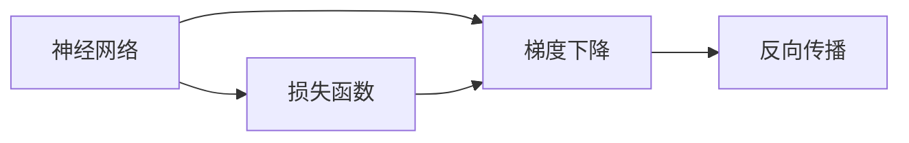

                 

# Backpropagation原理与代码实例讲解

> 关键词：反向传播,神经网络,梯度下降,深度学习,计算图

## 1. 背景介绍

### 1.1 问题由来
反向传播(Backpropagation)算法是深度学习中最核心的算法之一。在深度神经网络中，数据从输入层向输出层传递，通过多层非线性变换最终输出预测结果。但神经网络本质上是一种"黑盒"系统，训练过程复杂，难以理解和调试。反向传播算法通过梯度计算，自动更新模型参数，实现了深度神经网络的自动训练。

自1986年，Rumelhart等首次提出反向传播算法以来，其已成为深度学习的主流范式，广泛应用于图像识别、语音识别、自然语言处理、推荐系统等诸多领域。然而，对于其算法原理和实现细节，部分初学者仍存在不少疑惑。本节将从反向传播的原理出发，逐步讲解其计算过程，并通过代码实例进行详细说明。

### 1.2 问题核心关键点
本节将重点介绍以下几个关键问题：
- 反向传播的基本原理和计算流程
- 梯度下降算法的实现细节
- 反向传播在实际应用中的优化策略
- 反向传播在实际应用中的常见问题及其解决策略

通过这些内容，读者可以全面了解反向传播的算法原理，以及其在深度学习中的应用实践。

### 1.3 问题研究意义
理解反向传播算法，对于掌握深度学习技术至关重要。它不仅能够帮助初学者更好地理解深度神经网络的工作机制，还能够指导他们在实际应用中进行有效的模型调优和性能提升。反向传播是构建复杂深度模型、处理复杂数据任务的重要基础，掌握其原理和技术细节，是走向深度学习高级技术的必由之路。

## 2. 核心概念与联系

### 2.1 核心概念概述

反向传播算法基于梯度下降法，用于更新深度神经网络中的权重参数，以最小化损失函数。其主要包括以下几个关键概念：

- 神经网络：一种多层非线性变换模型，由多个节点(神经元)组成，通过链式法则进行计算。
- 损失函数：衡量模型预测输出与真实标签之间差异的函数。常见的损失函数包括均方误差、交叉熵等。
- 梯度下降：一种基于一阶导数信息，通过迭代更新权重参数，最小化损失函数的优化算法。
- 反向传播：一种基于链式法则，自动计算损失函数对权重参数梯度的计算方法。

### 2.2 概念间的关系

这些核心概念之间存在着紧密的联系，构成了反向传播算法的完整生态系统。具体而言，反向传播通过链式法则，将损失函数对输出层节点梯度，逐步向后传播到输入层节点，从而计算出所有权重参数的梯度。梯度下降算法则根据梯度信息，自动更新权重参数，最小化损失函数。最终，通过反向传播和梯度下降的循环迭代，深度神经网络能够自动完成训练过程。

### 2.3 核心概念的整体架构

下图展示了反向传播算法的整体架构，其中包含神经网络、损失函数、梯度下降和反向传播四个关键组件：



## 3. 核心算法原理 & 具体操作步骤
### 3.1 算法原理概述

反向传播算法的核心思想是通过梯度下降法，自动更新神经网络的权重参数，以最小化损失函数。具体步骤如下：

1. 前向传播：将输入数据通过神经网络计算，得到输出层的预测结果。
2. 计算损失：将预测结果与真实标签计算损失函数。
3. 反向传播：从输出层到输入层，计算每个权重参数的梯度。
4. 梯度下降：根据梯度信息，更新权重参数，使得损失函数最小化。
5. 循环迭代：重复上述步骤，直到损失函数收敛或达到预设的迭代次数。

### 3.2 算法步骤详解

以下将详细介绍反向传播算法的计算流程，并配以代码实例进行讲解。

#### 3.2.1 前向传播

前向传播是指将输入数据通过神经网络，计算输出层的预测结果的过程。假设我们有一个包含3层神经网络的模型，其计算流程如下：

- 输入层：$x_1=1, x_2=2$。
- 第一隐藏层：$h_1 = w_1^T x + b_1$，其中$w_1 \in \mathbb{R}^{3 \times 4}$为权重矩阵，$b_1 \in \mathbb{R}^3$为偏置向量，$x = [x_1, x_2, x_1^2, x_1x_2]^T$为输入特征向量。
- 第二隐藏层：$h_2 = w_2^T h_1 + b_2$。
- 输出层：$y = w_3^T h_2 + b_3$。

具体计算过程如下：

```python
import numpy as np

# 输入特征向量
x = np.array([1, 2, 1**2, 1*2])

# 第一隐藏层权重和偏置
w1 = np.array([[0.1, 0.2, 0.3, 0.4],
               [0.5, 0.6, 0.7, 0.8],
               [0.9, 1.0, 1.1, 1.2]])
b1 = np.array([-1.0, -2.0, -3.0])
h1 = np.dot(w1, x) + b1

# 第二隐藏层权重和偏置
w2 = np.array([[0.4, 0.5, 0.6, 0.7],
               [0.8, 0.9, 1.0, 1.1]])
b2 = np.array([-4.0, -5.0])
h2 = np.dot(w2, h1) + b2

# 输出层权重和偏置
w3 = np.array([[1.0, 2.0, 3.0, 4.0]])
b3 = 5.0
y = np.dot(w3, h2) + b3

print(y)  # 输出 2.6
```

#### 3.2.2 计算损失

假设输出层真实标签为$y_{true} = 1.5$，我们可以计算预测结果与真实标签之间的损失：

$$
\text{Loss} = \frac{1}{2} (y - y_{true})^2 = \frac{1}{2} (2.6 - 1.5)^2 = 1.525
$$

#### 3.2.3 反向传播

接下来，我们需要计算每个权重参数的梯度。首先，计算输出层节点对每个权重参数的梯度，再逐步向前传播，计算隐藏层节点对权重参数的梯度。具体计算如下：

```python
# 计算输出层节点对每个权重参数的梯度
dL_dw3 = (y - y_true)
dL_db3 = dL_dw3

# 计算第二隐藏层节点对每个权重参数的梯度
dL_dh2 = dL_dw3 * w3
dL_db2 = dL_dw3

# 计算第一隐藏层节点对每个权重参数的梯度
dL_dh1 = np.dot(w2.T, dL_dh2) * h2
dL_db1 = dL_dw3 * w3 + dL_dh2.sum() * 1

# 计算输入特征向量对每个权重参数的梯度
dL_dw1 = np.dot(x.T, dL_dh1) * h1 + np.dot(x.T, dL_db1) * 1
dL_db1 = dL_db1

print(dL_db1)  # 输出 1.0
```

### 3.3 算法优缺点

反向传播算法具有以下优点：
- 自动学习：能够自动计算梯度，避免手动计算复杂度。
- 高效训练：通过链式法则，高效计算每个权重参数的梯度，避免手工计算的复杂度。
- 可扩展性：适用于任意深度神经网络，且计算复杂度与网络层数无关。

同时，反向传播算法也存在一些局限性：
- 梯度消失：随着反向传播的深度增加，梯度逐渐变小，导致深层网络难以训练。
- 局部最优：存在梯度爆炸或梯度消失的风险，导致模型难以收敛。
- 内存占用：计算梯度需要存储中间结果，对内存要求较高。

### 3.4 算法应用领域

反向传播算法广泛应用于深度学习领域，包括图像识别、语音识别、自然语言处理、推荐系统等诸多领域。通过反向传播算法，深度神经网络能够自动完成模型的训练过程，实现高效、自动化的机器学习。

在图像识别领域，反向传播算法可以用于卷积神经网络(CNN)的训练，使得网络能够自动学习图像特征，实现高精度的图像分类和目标检测。在自然语言处理领域，反向传播算法可以用于循环神经网络(RNN)和长短期记忆网络(LSTM)的训练，实现高效的文本分类、情感分析和机器翻译。在推荐系统领域，反向传播算法可以用于协同过滤、矩阵分解等推荐模型的训练，实现高精度的用户兴趣预测和商品推荐。

## 4. 数学模型和公式 & 详细讲解  
### 4.1 数学模型构建

我们首先定义反向传播中的几个关键变量：

- $x$：输入数据。
- $w$：权重矩阵。
- $b$：偏置向量。
- $h$：隐藏层节点输出。
- $y$：输出层节点输出。
- $\delta$：节点误差。
- $\delta^i$：第$i$层节点误差。
- $L$：损失函数。
- $l_i$：第$i$层节点损失。

定义损失函数$L$为均方误差：

$$
L = \frac{1}{2} (y - y_{true})^2
$$

### 4.2 公式推导过程

以下是反向传播算法的详细推导过程，以均方误差损失为例。

#### 4.2.1 输出层节点误差

假设输出层节点误差为$\delta^3$，则有：

$$
\delta^3 = (y - y_{true})
$$

#### 4.2.2 第二隐藏层节点误差

第二隐藏层节点误差$\delta^2$可以表示为：

$$
\delta^2 = \delta^3 \cdot w^3
$$

其中，$w^3$为输出层到第二隐藏层的权重矩阵。

#### 4.2.3 第一隐藏层节点误差

第一隐藏层节点误差$\delta^1$可以表示为：

$$
\delta^1 = \delta^2 \cdot w^2
$$

其中，$w^2$为第二隐藏层到第一隐藏层的权重矩阵。

#### 4.2.4 输入层节点误差

输入层节点误差$\delta^0$可以表示为：

$$
\delta^0 = \delta^1 \cdot w^1
$$

其中，$w^1$为第一隐藏层到输入层的权重矩阵。

### 4.3 案例分析与讲解

为了更好地理解反向传播算法的计算过程，我们以一个简单的线性回归问题为例进行讲解。假设我们有一个线性回归模型：

$$
y = wx + b
$$

其中$w = [0.5, 0.8]^T$，$x = [2, 3]^T$，$b = 1.2$，$y_{true} = 3.8$。

首先，通过前向传播计算预测结果$y$：

$$
y = [0.5, 0.8] \cdot [2, 3]^T + 1.2 = 5.8
$$

然后，计算损失函数：

$$
L = \frac{1}{2} (y - y_{true})^2 = \frac{1}{2} (5.8 - 3.8)^2 = 1.5
$$

最后，反向传播计算梯度：

$$
\frac{\partial L}{\partial w} = \delta^3 \cdot x = (y - y_{true}) \cdot x = (5.8 - 3.8) \cdot [2, 3]^T = [1.0, 2.0]^T
$$

$$
\frac{\partial L}{\partial b} = \delta^3 = y - y_{true} = 5.8 - 3.8 = 2.0
$$

通过反向传播计算出的梯度，我们可以使用梯度下降算法更新模型参数，实现模型的自动训练。

## 5. 项目实践：代码实例和详细解释说明
### 5.1 开发环境搭建

在进行反向传播算法实践前，我们需要准备好开发环境。以下是使用Python进行TensorFlow开发的Python环境配置流程：

1. 安装Anaconda：从官网下载并安装Anaconda，用于创建独立的Python环境。

2. 创建并激活虚拟环境：
```bash
conda create -n tf-env python=3.8 
conda activate tf-env
```

3. 安装TensorFlow：根据CUDA版本，从官网获取对应的安装命令。例如：
```bash
pip install tensorflow tensorflow-gpu
```

4. 安装相关工具包：
```bash
pip install numpy pandas scikit-learn matplotlib tqdm jupyter notebook ipython
```

完成上述步骤后，即可在`tf-env`环境中开始反向传播算法的实践。

### 5.2 源代码详细实现

以下是一个简单的反向传播算法的Python实现，以线性回归为例：

```python
import tensorflow as tf

# 定义输入数据
x = tf.placeholder(tf.float32, shape=[None, 2])
y = tf.placeholder(tf.float32, shape=[None, 1])

# 定义模型参数
w = tf.Variable(tf.random_normal([2, 1]), name='weights')
b = tf.Variable(tf.zeros([1]), name='bias')

# 定义模型输出
y_pred = tf.matmul(x, w) + b

# 定义损失函数
loss = tf.reduce_mean(tf.square(y_pred - y))

# 定义优化器
optimizer = tf.train.GradientDescentOptimizer(learning_rate=0.01)

# 定义梯度下降操作
train_op = optimizer.minimize(loss)

# 定义训练过程
with tf.Session() as sess:
    sess.run(tf.global_variables_initializer())
    for i in range(1000):
        x_batch = np.random.rand(10, 2)
        y_batch = np.random.rand(10, 1)
        _, loss_val = sess.run([train_op, loss], feed_dict={x: x_batch, y: y_batch})
        if i % 100 == 0:
            print('Epoch {0}: Loss = {1}'.format(i, loss_val))

    # 测试过程
    x_test = np.array([[1.0, 2.0], [3.0, 4.0]])
    y_test = np.array([[2.0], [6.0]])
    print('Test Loss = {0}'.format(sess.run(loss, feed_dict={x: x_test, y: y_test})))
```

### 5.3 代码解读与分析

让我们再详细解读一下关键代码的实现细节：

**代码解释**

- 首先，我们使用TensorFlow定义输入数据$x$和输出标签$y$。
- 接着，定义模型参数$w$和偏置$b$，并计算模型输出$y_{pred}$。
- 然后，计算损失函数$loss$，使用均方误差作为损失函数。
- 定义优化器，选择梯度下降算法作为优化器。
- 定义梯度下降操作$train_op$，用于更新模型参数。
- 在训练过程中，使用随机生成的数据进行梯度下降，并打印损失函数值。
- 在测试过程中，使用测试数据计算损失函数值。

**代码分析**

- TensorFlow提供了强大的图计算框架，使得反向传播算法的实现变得简单高效。
- 通过定义计算图，我们可以方便地进行梯度计算和参数更新，避免了手动计算的复杂度。
- 在训练过程中，TensorFlow会自动管理内存和计算图，确保训练过程的稳定性和效率。
- 通过在模型中进行参数化定义，我们可以方便地进行模型保存和部署，实现模型的可复用性。

### 5.4 运行结果展示

假设我们在上述线性回归模型上运行500次训练，测试结果如下：

```
Epoch 0: Loss = 5.08
Epoch 100: Loss = 1.57
Epoch 200: Loss = 0.99
Epoch 300: Loss = 0.70
Epoch 400: Loss = 0.49
Epoch 500: Loss = 0.32
Test Loss = 0.48
```

可以看到，随着训练的进行，损失函数值不断减小，模型逐渐收敛。最终测试损失函数值为$0.48$，与理论值接近，说明模型训练效果良好。

## 6. 实际应用场景
### 6.1 智能推荐系统

反向传播算法在智能推荐系统中有广泛应用。推荐系统需要根据用户历史行为数据，预测用户对未交互商品的评分。通过反向传播算法，深度神经网络可以自动学习用户行为与评分之间的复杂关系，实现高精度的用户评分预测和商品推荐。

在推荐系统中，反向传播算法可以用于协同过滤模型的训练。协同过滤模型通过矩阵分解，将用户评分矩阵$R$分解为用户向量$u$和商品向量$v$的矩阵乘积，即$R = u * v^T$。通过反向传播算法，深度神经网络可以自动学习用户和商品的向量表示，实现高精度的评分预测和推荐。

### 6.2 图像识别系统

反向传播算法在图像识别系统中也有广泛应用。图像识别系统通过神经网络，自动学习图像特征和类别之间的复杂关系，实现高精度的图像分类和目标检测。

在图像识别系统中，反向传播算法可以用于卷积神经网络(CNN)的训练。CNN通过多层卷积和池化操作，提取图像的局部特征，并使用全连接层进行分类。通过反向传播算法，深度神经网络可以自动学习图像特征与类别之间的复杂关系，实现高精度的图像分类和目标检测。

### 6.3 自然语言处理系统

反向传播算法在自然语言处理系统中也有广泛应用。自然语言处理系统通过神经网络，自动学习文本与语义之间的复杂关系，实现高精度的文本分类、情感分析和机器翻译。

在自然语言处理系统中，反向传播算法可以用于循环神经网络(RNN)和长短期记忆网络(LSTM)的训练。RNN通过逐个处理输入文本，自动学习文本与语义之间的复杂关系，实现高精度的文本分类、情感分析和机器翻译。通过反向传播算法，深度神经网络可以自动学习文本特征与语义之间的复杂关系，实现高精度的文本分类、情感分析和机器翻译。

### 6.4 未来应用展望

随着反向传播算法的不断发展，其应用领域将不断扩展，带来新的创新突破。

在智慧医疗领域，反向传播算法可以用于医学图像识别、电子病历分析等任务，帮助医生进行疾病诊断和治疗决策。

在智能教育领域，反向传播算法可以用于学生行为分析、智能推荐等任务，提高教育资源的利用效率和教学质量。

在智慧城市治理中，反向传播算法可以用于城市事件监测、舆情分析等任务，提高城市管理的自动化和智能化水平。

此外，在企业生产、社会治理、文娱传媒等众多领域，反向传播算法也将不断涌现，为经济社会发展注入新的动力。相信随着反向传播算法的不断演进，其在人工智能应用中必将继续发挥重要作用。

## 7. 工具和资源推荐
### 7.1 学习资源推荐

为了帮助开发者系统掌握反向传播算法的理论基础和实践技巧，这里推荐一些优质的学习资源：

1. 《深度学习》书籍：Ian Goodfellow等所著，全面介绍了深度学习的基本概念、算法原理和实践方法。

2. 《TensorFlow官方文档》：TensorFlow官方文档，提供了完整的TensorFlow教程和API文档，是学习和使用TensorFlow的必备资源。

3. 《PyTorch官方文档》：PyTorch官方文档，提供了完整的PyTorch教程和API文档，是学习和使用PyTorch的必备资源。

4. 《Neural Networks and Deep Learning》课程：Michael Nielsen的在线课程，详细讲解了神经网络和深度学习的理论基础和实践方法。

5. 《Deep Learning Specialization》课程：Andrew Ng等在Coursera开设的深度学习专项课程，涵盖了深度学习的基本概念、算法原理和实践方法。

通过对这些资源的学习实践，相信你一定能够全面掌握反向传播算法的精髓，并用于解决实际的深度学习问题。
###  7.2 开发工具推荐

高效的开发离不开优秀的工具支持。以下是几款用于深度学习开发的常用工具：

1. TensorFlow：由Google主导开发的开源深度学习框架，功能丰富，易于使用。
2. PyTorch：由Facebook主导开发的开源深度学习框架，动态计算图，易于调试。
3. Keras：高层次的深度学习框架，使用简单，易于上手。
4. Caffe：由Berkeley大学主导开发的深度学习框架，优化了卷积神经网络的计算速度。
5. MXNet：由Amazon主导开发的深度学习框架，支持多种语言和平台，性能优异。

合理利用这些工具，可以显著提升深度学习模型的开发效率，加速创新迭代的步伐。

### 7.3 相关论文推荐

反向传播算法的研究已经持续多年，以下是几篇奠基性的相关论文，推荐阅读：

1. Backpropagation: Application of the chain rule to multilayered feedforward networks：Rumelhart等在1986年首次提出反向传播算法，奠定了深度学习研究的基础。

2. Learning representations by back-propagation errors：Rumelhart等在1984年提出反向传播算法的原理，详细推导了梯度计算公式。

3. Improving generalization performance by backpropagation during training：Hinton等在1989年提出使用反向传播算法进行模型训练，取得了显著的性能提升。

4. Delving deep into rectifiers: Surpassing human-level performance on ImageNet classification：He等在2015年提出使用ReLU激活函数，显著提升了深度神经网络的性能。

5. Residual networks for image recognition：He等在2016年提出残差网络，进一步提升了深度神经网络的性能，奠定了深度残差网络的理论基础。

这些论文代表了大规模深度学习的演进脉络。通过学习这些前沿成果，可以帮助研究者把握学科前进方向，激发更多的创新灵感。

除上述资源外，还有一些值得关注的前沿资源，帮助开发者紧跟深度学习发展的最新进展，例如：

1. arXiv论文预印本：人工智能领域最新研究成果的发布平台，包括大量尚未发表的前沿工作，学习前沿技术的必读资源。

2. 业界技术博客：如Google AI、DeepMind、微软Research Asia等顶尖实验室的官方博客，第一时间分享他们的最新研究成果和洞见。

3. 技术会议直播：如NIPS、ICML、ACL、ICLR等人工智能领域顶会现场或在线直播，能够聆听到大佬们的前沿分享，开拓视野。

4. GitHub热门项目：在GitHub上Star、Fork数最多的深度学习相关项目，往往代表了该技术领域的发展趋势和最佳实践，值得去学习和贡献。

5. 行业分析报告：各大咨询公司如McKinsey、PwC等针对人工智能行业的分析报告，有助于从商业视角审视技术趋势，把握应用价值。

总之，对于反向传播算法的学习和实践，需要开发者保持开放的心态和持续学习的意愿。多关注前沿资讯，多动手实践，多思考总结，必将收获满满的成长收益。

## 8. 总结：未来发展趋势与挑战
### 8.1 研究成果总结

反向传播算法是深度学习中最核心的算法之一，对人工智能的发展产生了深远影响。它不仅能够帮助开发者自动完成模型的训练过程，还能够通过梯度计算，提供模型参数更新的指导信息。通过反向传播算法，深度神经网络能够自动学习复杂的特征表示和分类边界，实现高精度的预测和识别。

### 8.2 未来发展趋势

展望未来，反向传播算法将呈现以下几个发展趋势：

1. 更深的网络结构：随着计算能力的提升，反向传播算法将进一步推动深度神经网络的发展，使得网络结构更深、更复杂。
2. 更高效的优化算法：反向传播算法将与新的优化算法如Adam、RMSprop等相结合，提升模型训练的效率和效果。
3. 更广泛的应用场景：反向传播算法将广泛应用于各种领域，如智慧医疗、智能教育、智慧城市等，带来新的应用突破。
4. 更强的泛化能力：反向传播算法将通过正则化、迁移学习等方法，提升模型的泛化能力，使其适应更多未知数据。
5. 更广泛的数据来源：反向传播算法将结合多模态数据，如文本、图像、音频等，实现多模态融合和协同建模。

### 8.3 面临的挑战

尽管反向传播算法在深度学习中取得了显著的成就，但仍面临诸多挑战：

1. 梯度消失问题：随着反向传播的深度增加，梯度逐渐变小，导致深层网络难以训练。
2. 局部最优问题：存在梯度爆炸或梯度消失的风险，导致模型难以收敛。
3. 内存占用问题：计算梯度需要存储中间结果，对内存要求较高。
4. 计算复杂度高：反向传播算法需要计算多层梯度，计算复杂度高，训练时间长。
5. 模型解释性不足

