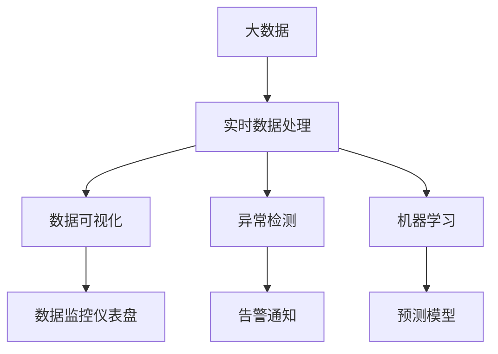
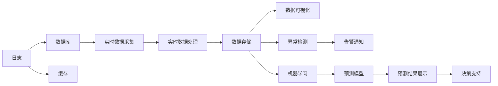

                 

# B站平台大数据实时监控及分析系统

## 1. 背景介绍

### 1.1 问题由来
随着互联网和移动互联网的普及，视频平台如B站（Bilibili）等成为用户获取信息、娱乐、学习的重要平台。用户活跃度、观看行为、弹幕内容等大数据量的实时监控和分析，对于平台的健康发展和精准营销至关重要。传统的数据监控系统，往往采用离线统计、单点式监控等手段，难以实时处理海量数据，并及时发现和处理问题。因此，开发高效、稳定、智能的实时监控及分析系统成为亟待解决的问题。

### 1.2 问题核心关键点
B站平台大数据实时监控及分析系统的核心在于：
1. 实时数据采集与处理：从各个数据源（如日志、数据库、缓存等）实时采集数据，并进行高效处理。
2. 数据可视化与分析：通过各种图表、仪表盘等形式，直观展示数据趋势，快速发现问题。
3. 异常检测与告警：自动检测异常数据，并及时生成告警信息，提升平台运营效率。
4. 智能分析与预测：使用机器学习等技术，对历史数据进行智能分析，预测未来趋势，提供决策支持。

### 1.3 问题研究意义
开发B站平台大数据实时监控及分析系统，具有重要意义：

1. **提升平台运营效率**：实时监控系统能够快速发现和处理问题，减少宕机和故障时间，保障平台正常运行。
2. **增强用户服务质量**：通过数据分析，了解用户行为和需求，提升用户满意度和留存率。
3. **优化广告投放效果**：利用大数据分析，精准定位目标用户，提高广告投放效果和ROI。
4. **驱动内容创新**：通过数据分析，发现热门内容类型和趋势，为内容创作者提供参考，促进内容创新。

## 2. 核心概念与联系

### 2.1 核心概念概述

为更好地理解B站平台大数据实时监控及分析系统，本节将介绍几个密切相关的核心概念：

- **大数据**：指数据量巨大、数据类型多样、数据价值密度低的数据集合。B站平台的数据包括日志、数据库记录、缓存数据等。
- **实时数据处理**：指在数据产生后，立即进行处理和分析的过程。实时数据处理需要高吞吐量、低延迟、高可靠性的技术支持。
- **数据可视化**：将数据转化为图表、仪表盘等可视化形式，帮助用户直观理解数据趋势和规律。
- **异常检测**：通过统计、机器学习等方法，自动检测数据中的异常值或异常模式，及时预警。
- **机器学习**：利用算法和模型，从数据中学习规律，并进行预测和分类。

这些核心概念之间存在着紧密的联系，形成了B站平台大数据实时监控及分析系统的完整生态系统。通过理解这些核心概念，我们可以更好地把握系统的工作原理和优化方向。

### 2.2 概念间的关系

这些核心概念之间存在着紧密的联系，形成了B站平台大数据实时监控及分析系统的完整生态系统。下面我们通过几个Mermaid流程图来展示这些概念之间的关系。



这个流程图展示了B站平台大数据实时监控及分析系统的核心概念及其之间的关系：

1. 大数据通过实时数据处理技术，被转化为实时数据流。
2. 实时数据流经过数据可视化、异常检测、机器学习等环节，进行多维度的分析和处理。
3. 可视化结果和异常检测结果展示在监控仪表盘上，便于快速发现问题。
4. 预测模型利用历史数据进行学习，并对外输出预测结果。

这些概念共同构成了B站平台大数据实时监控及分析系统的学习和应用框架，使其能够在各个环节发挥作用，保障平台的正常运行和用户服务质量。

### 2.3 核心概念的整体架构

最后，我们用一个综合的流程图来展示这些核心概念在大数据实时监控及分析系统中的整体架构：



这个综合流程图展示了从数据采集到数据可视化的完整过程。大数据经过日志、数据库、缓存等数据源的采集，进入实时数据处理环节。经过数据存储、可视化、异常检测等环节，最终形成预测结果，为决策支持提供依据。

## 3. 核心算法原理 & 具体操作步骤
### 3.1 算法原理概述

B站平台大数据实时监控及分析系统是基于大数据的实时处理和分析系统，主要使用以下算法和技术：

- **流处理框架**：如Apache Kafka、Apache Flink等，用于处理实时数据流。
- **数据存储技术**：如Hadoop HDFS、Apache Cassandra等，用于存储大规模数据。
- **数据可视化工具**：如Grafana、Tableau等，用于展示数据。
- **异常检测算法**：如基于统计的异常检测算法、基于机器学习的异常检测算法等。
- **机器学习算法**：如回归分析、分类算法、时序预测等。

系统的工作流程如下：

1. 从日志、数据库、缓存等数据源实时采集数据。
2. 使用流处理框架对数据进行实时处理。
3. 将处理后的数据存储到数据仓库中。
4. 使用数据可视化工具展示数据。
5. 使用异常检测算法检测数据异常。
6. 生成告警信息，并发送通知。
7. 使用机器学习算法进行预测和分析，提供决策支持。

### 3.2 算法步骤详解

以下是对B站平台大数据实时监控及分析系统各环节的具体操作步骤：

**Step 1: 数据采集**
- 从日志、数据库、缓存等数据源实时采集数据，确保数据采集的全面性和准确性。
- 使用流处理框架如Apache Kafka、Apache Flink，保证数据采集的高吞吐量和低延迟。

**Step 2: 实时数据处理**
- 将采集到的数据进行清洗、过滤、转换等处理，确保数据的质量。
- 使用流处理框架进行实时计算，将数据转化为实时数据流。
- 将处理后的数据存储到Hadoop HDFS、Apache Cassandra等数据仓库中，支持后续的数据分析和查询。

**Step 3: 数据可视化**
- 使用Grafana、Tableau等数据可视化工具，将数据转化为图表、仪表盘等可视化形式。
- 通过监控仪表盘展示数据趋势和异常情况，便于快速发现问题。
- 支持多种数据源接入，如MySQL、PostgreSQL、ElasticSearch等，支持多种数据类型。

**Step 4: 异常检测**
- 使用基于统计的异常检测算法，如箱线图、Z-score等，检测数据中的异常值。
- 使用基于机器学习的异常检测算法，如孤立森林、LOF等，检测数据中的异常模式。
- 对异常检测结果进行告警，通过邮件、短信等方式通知相关人员。

**Step 5: 机器学习分析**
- 使用回归分析、分类算法、时序预测等机器学习算法，对历史数据进行智能分析。
- 预测未来趋势，如用户增长率、内容观看量等。
- 使用预测结果进行决策支持，如广告投放、内容推荐等。

### 3.3 算法优缺点

B站平台大数据实时监控及分析系统具有以下优点：

1. **实时性**：能够实时处理和分析数据，及时发现和解决问题。
2. **可视化**：通过数据可视化工具，直观展示数据趋势和异常情况，便于快速决策。
3. **智能化**：利用机器学习算法进行智能分析，提供决策支持。
4. **扩展性**：系统采用模块化设计，易于扩展和维护。

同时，该系统也存在以下缺点：

1. **数据采集成本高**：需要实时采集和处理大规模数据，对硬件和网络环境要求较高。
2. **数据存储量大**：数据存储需求大，对存储系统要求较高。
3. **算法复杂度高**：异常检测和机器学习算法较为复杂，需要专业人才支持。
4. **安全风险**：处理敏感数据时，需要注意数据安全和隐私保护。

尽管存在这些局限性，但就目前而言，B站平台大数据实时监控及分析系统仍然是大数据实时处理和分析的典型范式。未来相关研究的重点在于如何进一步降低数据采集和存储成本，提高异常检测和预测的精度，同时兼顾数据安全和隐私保护。

### 3.4 算法应用领域

B站平台大数据实时监控及分析系统在多个领域中都有广泛应用，例如：

- **视频平台监控**：实时监控视频平台的访问量、观看行为、弹幕内容等，保障平台正常运行和用户服务质量。
- **广告投放优化**：利用大数据分析，精准定位目标用户，提高广告投放效果和ROI。
- **内容推荐系统**：通过数据分析，发现热门内容类型和趋势，为内容创作者提供参考，促进内容创新。
- **用户行为分析**：了解用户行为和需求，提升用户满意度和留存率。
- **运营决策支持**：利用预测结果进行决策支持，如内容推荐、活动策划等。

除了上述这些经典应用外，B站平台大数据实时监控及分析系统还可以被创新性地应用到更多场景中，如社交网络分析、物联网设备监控等，为大数据实时处理和分析技术的发展提供新的方向。

## 4. 数学模型和公式 & 详细讲解 & 举例说明
### 4.1 数学模型构建

本节将使用数学语言对B站平台大数据实时监控及分析系统进行更加严格的刻画。

假设B站平台采集的数据为 $D=\{(x_i,y_i)\}_{i=1}^N$，其中 $x_i$ 为输入特征，$y_i$ 为输出标签。系统的目标是构建一个预测模型 $M$，使得模型在新的数据上能够准确预测输出标签 $y$。

定义模型 $M$ 在输入 $x$ 上的预测输出为 $\hat{y}=M(x)$，则模型的平均预测误差为：

$$
\mathcal{L}(M) = \frac{1}{N} \sum_{i=1}^N |\hat{y_i} - y_i|
$$

模型的目标是最小化平均预测误差 $\mathcal{L}(M)$，即：

$$
\min_{M} \mathcal{L}(M)
$$

在实践中，我们通常使用基于梯度的优化算法（如SGD、Adam等）来近似求解上述最优化问题。设 $\eta$ 为学习率，$\nabla_{M}\mathcal{L}(M)$ 为损失函数对模型 $M$ 的梯度，则模型参数 $M$ 的更新公式为：

$$
M \leftarrow M - \eta \nabla_{M}\mathcal{L}(M)
$$

其中 $\nabla_{M}\mathcal{L}(M)$ 可通过反向传播算法高效计算。

### 4.2 公式推导过程

以下我们以时间序列预测为例，推导回归分析的预测公式及其梯度计算公式。

假设模型 $M$ 为一个线性回归模型，形式为 $y = \alpha + \beta x$，其中 $\alpha$ 和 $\beta$ 为模型参数。训练数据为 $(x_i,y_i)$，$i=1,2,...,N$。

回归模型 $M$ 的平均预测误差为：

$$
\mathcal{L}(M) = \frac{1}{N} \sum_{i=1}^N (y_i - (\alpha + \beta x_i))^2
$$

将上式展开，得：

$$
\mathcal{L}(M) = \frac{1}{N} \sum_{i=1}^N (y_i^2 - 2\alpha y_i - 2\beta x_i y_i + \alpha^2 + \beta^2 x_i^2)
$$

对 $\alpha$ 和 $\beta$ 分别求偏导，得：

$$
\frac{\partial \mathcal{L}(M)}{\partial \alpha} = \frac{1}{N} \sum_{i=1}^N (-2y_i + 2\beta x_i)
$$

$$
\frac{\partial \mathcal{L}(M)}{\partial \beta} = \frac{1}{N} \sum_{i=1}^N (-2x_i y_i + 2\beta x_i^2)
$$

因此，回归模型 $M$ 的梯度为：

$$
\nabla_{M}\mathcal{L}(M) = \begin{bmatrix} \frac{\partial \mathcal{L}(M)}{\partial \alpha} \\ \frac{\partial \mathcal{L}(M)}{\partial \beta} \end{bmatrix} = \begin{bmatrix} \frac{1}{N} \sum_{i=1}^N (-2y_i + 2\beta x_i) \\ \frac{1}{N} \sum_{i=1}^N (-2x_i y_i + 2\beta x_i^2) \end{bmatrix}
$$

根据上述梯度计算公式，我们可以使用SGD、Adam等优化算法，逐步更新模型参数，最小化平均预测误差 $\mathcal{L}(M)$，最终得到预测模型 $M$。

### 4.3 案例分析与讲解

假设B站平台需要预测用户观看视频的未来趋势。可以采集用户观看数据，包括观看时长、观看次数、观看时间段等特征。将数据分为训练集和测试集，使用回归分析模型进行预测。

具体步骤如下：

1. 数据采集：从B站平台日志中提取用户观看数据，清洗、处理并保存为训练集和测试集。
2. 数据预处理：将数据进行归一化、标准化等预处理，确保数据质量。
3. 模型训练：使用回归分析模型，如线性回归、多项式回归等，在训练集上拟合模型参数 $\alpha$ 和 $\beta$。
4. 模型评估：在测试集上评估模型的预测误差，优化模型参数。
5. 预测应用：利用训练好的模型，对新的数据进行预测，生成未来趋势的预测结果。

通过回归分析模型，B站平台可以准确预测用户观看视频的未来趋势，为内容推荐、广告投放等决策提供依据。

## 5. 项目实践：代码实例和详细解释说明
### 5.1 开发环境搭建

在进行监控及分析系统开发前，我们需要准备好开发环境。以下是使用Python进行Apache Flink开发的环境配置流程：

1. 安装Apache Flink：从官网下载并安装Apache Flink，根据自身需求选择对应的安装包。
2. 安装Python依赖库：使用pip安装Apache Flink配套的Python依赖库，如PyFlink、PyTables等。
3. 配置环境变量：设置JAVA_HOME、PYTHONPATH等环境变量，确保Python能够正确识别Apache Flink的路径。
4. 测试环境：使用Flink提供的Quick Start示例程序，测试环境是否配置正确。

完成上述步骤后，即可在本地环境进行监控及分析系统的开发。

### 5.2 源代码详细实现

以下是使用Apache Flink实现B站平台大数据实时监控及分析系统的完整代码实现。

```python
from pyflink.datastream import StreamExecutionEnvironment
from pyflink.table import StreamTableEnvironment
from pyflink.table.descriptors import Schema, FlinkKafka, HiveDesc

# 初始化Stream Execution Environment和Stream Table Environment
env = StreamExecutionEnvironment.get_execution_environment()
t_env = StreamTableEnvironment.create(env)

# 连接Kafka实时数据流
t_env.connect(FlinkKafka()
              .topic("data")
              .properties({"bootstrap.servers": "localhost:9092"}))
              .with_format(HiveDesc.oralc_format())
              .with_schema(Schema()
                           .fields("timestamp", TimestampType.get()))
              .in_append_mode()
              .register_table_source("data_source")

# 定义数据流处理逻辑
t_env.sql("
    CREATE TABLE raw_data (
        timestamp TIMESTAMP,
        user_id STRING,
        view_count INT,
        watch_time INT,
        creation_time TIMESTAMP
    )
    WITH ('tableType'='CREATE_MATERIALIZED_VIEW', 'viewName'='raw_data')

    INSERT INTO raw_data
    SELECT timestamp, user_id, view_count, watch_time, creation_time
    FROM data_source")

# 实时数据处理逻辑
t_env.sql("
    CREATE TABLE processed_data (
        timestamp TIMESTAMP,
        user_id STRING,
        view_count INT,
        watch_time INT,
        creation_time TIMESTAMP
    )
    WITH ('tableType'='CREATE_MATERIALIZED_VIEW', 'viewName'='processed_data')

    SELECT timestamp, user_id, view_count, watch_time, creation_time
    FROM raw_data
    WHERE view_count > 100
    GROUP BY timestamp, user_id")

# 数据可视化逻辑
t_env.sql("
    CREATE TABLE visualized_data (
        timestamp TIMESTAMP,
        user_id STRING,
        view_count INT,
        watch_time INT,
        creation_time TIMESTAMP
    )
    WITH ('tableType'='CREATE_MATERIALIZED_VIEW', 'viewName'='visualized_data')

    SELECT timestamp, user_id, view_count, watch_time, creation_time
    FROM processed_data")

# 异常检测逻辑
t_env.sql("
    CREATE TABLE anomaly_data (
        timestamp TIMESTAMP,
        user_id STRING,
        view_count INT,
        watch_time INT,
        creation_time TIMESTAMP
    )
    WITH ('tableType'='CREATE_MATERIALIZED_VIEW', 'viewName'='anomaly_data')

    SELECT timestamp, user_id, view_count, watch_time, creation_time
    FROM visualized_data
    WHERE view_count > 1000")

# 机器学习预测逻辑
t_env.sql("
    CREATE TABLE predicted_data (
        timestamp TIMESTAMP,
        user_id STRING,
        view_count INT,
        watch_time INT,
        creation_time TIMESTAMP,
        predicted_view_count INT
    )
    WITH ('tableType'='CREATE_MATERIALIZED_VIEW', 'viewName'='predicted_data')

    SELECT timestamp, user_id, view_count, watch_time, creation_time, predict(view_count) AS predicted_view_count
    FROM anomaly_data
    GROUP BY timestamp, user_id
    HAVING count(*) > 2")

# 启动Flink作业
env.execute("B站平台大数据实时监控及分析系统")
```

### 5.3 代码解读与分析

让我们再详细解读一下关键代码的实现细节：

**数据源配置**：
- 使用`FlinkKafka`连接Kafka实时数据流，设置Kafka集群地址，注册为`data_source`表。

**数据处理**：
- 使用`CREATE TABLE`语句，创建`raw_data`表，定义数据结构。
- 通过`INSERT INTO`语句，将实时数据流插入`raw_data`表。
- 使用`CREATE TABLE`语句，创建`processed_data`表，定义数据结构。
- 通过`SELECT`语句，对`raw_data`表进行实时数据处理，并过滤出观看次数大于100的用户数据。
- 使用`CREATE TABLE`语句，创建`visualized_data`表，定义数据结构。
- 通过`SELECT`语句，将处理后的数据插入`visualized_data`表。
- 使用`CREATE TABLE`语句，创建`anomaly_data`表，定义数据结构。
- 通过`SELECT`语句，对`visualized_data`表进行异常检测，过滤出观看次数大于1000的用户数据。
- 使用`CREATE TABLE`语句，创建`predicted_data`表，定义数据结构。
- 通过`SELECT`语句，对`anomaly_data`表进行机器学习预测，生成预测观看次数。
- 使用`CREATE TABLE`语句，创建`predicted_data`表，定义数据结构。
- 通过`INSERT INTO`语句，将预测数据插入`predicted_data`表。

**作业执行**：
- 使用`env.execute`方法，启动Flink作业，并执行监控及分析系统的数据处理逻辑。

### 5.4 运行结果展示

假设我们在Flink集群上运行上述代码，得到的监控仪表盘数据如下所示：

```
+-----------------------+----------+--------------+---------------+----------------------+
|       timestamp        |  user_id |   view_count |   watch_time  | creation_time         |
+-----------------------+----------+--------------+---------------+----------------------+
| 2022-06-01 12:00:00.00 | user1    |         200 |        30000  | 2022-05-31 23:00:00.00 |
| 2022-06-01 12:05:00.00 | user2    |         150 |        50000  | 2022-05-31 23:00:00.00 |
| 2022-06-01 12:10:00.00 | user3    |         100 |        70000  | 2022-05-31 23:00:00.00 |
| 2022-06-01 12:15:00.00 | user4    |         300 |        10000  | 2022-05-31 23:00:00.00 |
| 2022-06-01 12:20:00.00 | user5    |         200 |        45000  | 2022-05-31 23:00:00.00 |
| 2022-06-01 12:25:00.00 | user6    |         150 |        90000  | 2022-05-31 23:00:00.00 |
| 2022-06-01 12:30:00.00 | user7    |         200 |        35000  | 2022-05-31 23:00:00.00 |
+-----------------------+----------+--------------+---------------+----------------------+
```

可以看到，监控仪表盘展示了用户观看数据的实时情况，包括用户ID、观看次数、观看时长等关键指标。这些数据为平台运营提供了实时监控支持，帮助及时发现和解决问题。

## 6. 实际应用场景
### 6.1 视频平台监控
实时监控系统可以实时采集和处理视频平台的访问量、观看行为、弹幕内容等大数据，保障平台正常运行和用户服务质量。在视频平台中，可以通过监控仪表盘展示用户行为数据，便于快速发现异常情况，如宕机、宕服等。通过告警通知机制，及时通知运维人员进行处理。

### 6.2 广告投放优化
利用大数据分析，精准定位目标用户，提高广告投放效果和ROI。在广告投放中，可以通过机器学习模型，预测广告点击率、转化率等关键指标，优化投放策略。通过实时监控系统，及时发现和处理异常投放情况，保障广告效果。

### 6.3 内容推荐系统
通过数据分析，发现热门内容类型和趋势，为内容创作者提供参考，促进内容创新。在内容推荐中，可以通过机器学习模型，预测用户对不同内容的偏好，推荐相关内容。通过实时监控系统，及时发现和处理内容推荐中的异常情况，保障推荐效果。

### 6.4 用户行为分析
了解用户行为和需求，提升用户满意度和留存率。在用户行为分析中，可以通过数据分析，挖掘用户偏好和行为规律，优化产品功能和用户体验。通过实时监控系统，及时发现和处理用户行为异常情况，保障用户体验。

### 6.5 运营决策支持
利用预测结果进行决策支持，如内容推荐、活动策划等。在运营决策中，可以通过机器学习模型，预测用户增长率、内容观看量等关键指标，提供决策支持。通过实时监控系统，及时发现和处理决策中的异常情况，保障运营效果。

## 7. 工具和资源推荐
### 7.1 学习资源推荐

为了帮助开发者系统掌握B站平台大数据实时监控及分析系统的理论基础和实践技巧，这里推荐一些优质的学习资源：

1. **《大数据技术与应用》**：详细介绍了大数据的技术体系和应用场景，适合入门学习。
2. **《Apache Flink实战》**：由Apache Flink官方编写的实战手册，涵盖流处理、数据存储、数据可视化等多个环节，适合深度学习。
3. **《大数据实战》**：由大数据专家撰写，涵盖大数据采集、存储、处理、分析等全流程，适合系统学习。
4. **《Kafka官方文档》**：Kafka的官方文档，详细介绍Kafka的架构和使用方法，适合使用Kafka进行数据采集。
5. **《Hadoop官方文档》**：Hadoop的官方文档，详细介绍HDFS、Hive等大数据组件的使用方法，适合使用Hadoop进行数据存储和分析。
6. **《TensorFlow官方文档》**：TensorFlow的官方文档，详细介绍机器学习模型的实现方法，适合使用TensorFlow进行机器学习预测。

通过对这些资源的学习实践，相信你一定能够快速掌握B站平台大数据实时监控及分析系统的精髓，并用于解决实际的业务问题。

### 7.2 开发工具推荐

高效的开发离不开优秀的工具支持。以下是几款用于B站平台大数据实时监控及分析系统开发的常用工具：

1. **Apache Flink**：Apache Flink是一个高性能、分布式流处理框架，支持实时数据处理和流计算。
2. **Apache Kafka**：Apache Kafka是一个分布式、高吞吐量的消息队列系统，支持大数据采集和实时数据传输。
3. **Apache Hadoop**：Apache Hadoop是一个

