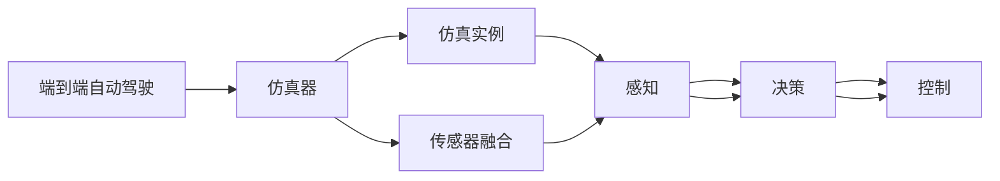
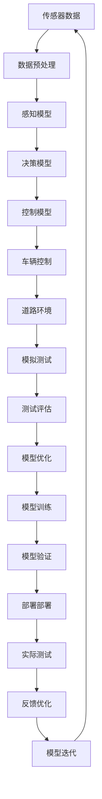

                 

# CARLA等仿真器在端到端自动驾驶中的应用

> 关键词：端到端自动驾驶, 仿真实例, 仿真器(CARLA), 智能驾驶, 模型训练, 模拟测试, 数据生成

## 1. 背景介绍

### 1.1 问题由来

自动驾驶技术的核心在于让汽车能够自主感知环境，理解交通规则，并做出正确的驾驶决策。端到端自动驾驶 (End-to-End Autonomous Driving) 技术直接从原始传感器数据（如相机、雷达、激光雷达）到最终决策输出（如加速、刹车、转向），跳过传统的车辆控制算法，使得整个系统更加简洁高效。该技术要求汽车能直接从原始数据中学习出驾驶策略，并在实际道路环境中实现稳定运行。

仿真器作为自动驾驶研究的重要工具，通过模拟真实交通环境，可为车辆感知、决策和控制算法提供可靠的数据和测试平台。相比于真实道路实验，仿真器具有成本低、安全性高、可控性强的优点。近年来，基于高保真度仿真器的端到端自动驾驶研究取得了显著进展。

### 1.2 问题核心关键点

目前，主流端到端自动驾驶技术的核心在于：
- 高性能模型训练。使用深度学习技术训练高性能的感知、决策和控制模型，以实现对复杂环境的准确感知和智能决策。
- 大规模仿真数据生成。在仿真器中生成大规模、多样化的仿真数据，用于模型训练和测试。
- 端到端模拟测试。在仿真器中进行全流程模拟测试，验证模型的稳定性和安全性。
- 跨域迁移学习能力。让模型具备跨不同仿真环境迁移的能力，从而在不同道路、天气等条件下仍能保持良好表现。

这些关键点构成了端到端自动驾驶技术的核心框架，为自动驾驶技术的快速迭代和应用落地提供了重要保障。

### 1.3 问题研究意义

仿真器在端到端自动驾驶中的应用，对于推动自动驾驶技术的快速成熟和广泛应用，具有重要意义：

1. 降低开发成本。仿真器能够模拟真实道路环境，大幅降低在实际道路测试中的成本和时间。
2. 提升测试效率。仿真器可以无限制地进行重复测试，快速发现和调试问题。
3. 确保安全性。仿真器提供了安全可控的测试环境，减少了交通事故的风险。
4. 加速产品化。仿真器可用于模型验证和集成测试，缩短从研发到市场的周期。
5. 支持多学科协作。仿真器能兼容多种传感器和仿真引擎，促进跨学科的协同研发。

## 2. 核心概念与联系

### 2.1 核心概念概述

为更好地理解仿真器在端到端自动驾驶中的应用，本节将介绍几个关键概念：

- 端到端自动驾驶 (End-to-End Autonomous Driving)：从原始传感器数据到最终驾驶决策的直接建模，省略中间控制算法，提升系统简洁性、高效性和鲁棒性。
- 仿真器 (Simulator)：模拟真实环境，提供可用于测试和训练的平台，是自动驾驶研究的基础设施。
- 仿真实例 (Simulation Scenario)：仿真器中定义的具体测试场景，用于评估自动驾驶系统的性能。
- 传感器融合 (Sensor Fusion)：将来自不同传感器的数据进行综合处理，以提升环境感知的准确性。
- 感知 (Perception)：通过传感器数据，识别并理解周围环境中的物体和动态信息。
- 决策 (Decision)：根据感知结果，生成车辆的控制指令，如加速、转向、制动等。
- 控制 (Control)：执行决策指令，调整车辆的速度和方向，实现自动驾驶。
- 模型训练 (Model Training)：通过仿真数据，训练感知、决策和控制模型。
- 模型验证 (Model Validation)：在仿真环境中，验证训练模型的性能和稳定性。
- 跨域迁移 (Cross-domain Transfer)：模型在不同环境下的泛化能力，支持自动驾驶系统的多场景适应。

这些概念相互关联，构成了端到端自动驾驶技术的全貌，通过仿真器的支撑，使这些核心环节得以高效实现。

### 2.2 概念间的关系

这些核心概念之间存在紧密的联系，可以用以下Mermaid流程图来展示：



这个流程图展示了端到端自动驾驶技术的核心环节及其在仿真器中的具体应用：
- 仿真实例作为测试平台，提供环境数据。
- 传感器融合对多源数据进行处理，提升感知能力。
- 感知环节通过传感器数据识别环境中的物体和行为。
- 决策环节根据感知结果，生成控制指令。
- 控制环节执行控制指令，实现车辆自动驾驶。

仿真器作为连接这些环节的桥梁，提供了可控、安全的测试环境，为自动驾驶技术的开发和验证提供了有力支持。

### 2.3 核心概念的整体架构

最后，我们用一个综合的流程图来展示端到端自动驾驶技术的全流程架构：



这个综合流程图展示了从数据采集、感知建模到模型验证、实际测试的完整流程。仿真器作为关键组件，提供了模拟环境，支持数据生成、模型训练、模拟测试等环节，为端到端自动驾驶技术的迭代提供了重要支撑。

## 3. 核心算法原理 & 具体操作步骤
### 3.1 算法原理概述

端到端自动驾驶技术的核心在于高性能模型的训练和验证。该技术通过深度学习模型直接从传感器数据到最终驾驶决策，减少了传统车辆控制算法的复杂性，提升了系统简洁性和鲁棒性。然而，由于实际道路环境的复杂性和多样性，单一模型难以涵盖所有情况，因此需要在仿真器中进行全面测试和训练。

仿真器提供了丰富的测试场景，模拟不同交通环境、天气条件和驾驶行为。通过仿真器的测试，可以发现和修正模型的不足，提升其在真实道路中的表现。同时，仿真器可以生成大规模、多样化的训练数据，用于模型的训练和优化。

端到端自动驾驶技术的具体流程包括：
1. 传感器数据采集：使用相机、雷达、激光雷达等传感器，获取车辆周围的环境信息。
2. 数据预处理：对传感器数据进行滤波、对齐等处理，消除噪声，提高数据质量。
3. 感知模型训练：使用感知模型识别环境中的物体和行为，输出语义分割结果。
4. 决策模型训练：使用决策模型对感知结果进行语义理解，生成决策指令。
5. 控制模型训练：使用控制模型执行决策指令，调整车辆速度和方向，实现自动驾驶。
6. 模拟测试：在仿真器中进行全流程测试，验证模型性能和稳定性。
7. 模型优化：根据测试结果，调整模型参数和结构，提高性能。
8. 模型训练：在仿真环境中进行新一轮训练，提升模型泛化能力。
9. 模型验证：在新环境下验证模型性能，确保其在不同场景下的稳定性和鲁棒性。
10. 模型部署：将训练好的模型应用到实际车辆中，进行实地测试。
11. 反馈优化：根据实际测试结果，调整模型参数，提升系统性能。

通过上述步骤，可以在仿真器中高效实现端到端自动驾驶技术的训练和测试，确保模型在不同环境下的稳定性和鲁棒性，从而推动自动驾驶技术的实际应用。

### 3.2 算法步骤详解

以下是端到端自动驾驶技术的详细步骤：

**Step 1: 传感器数据采集**
使用各种传感器，如相机、雷达、激光雷达等，采集车辆周围的环境信息。具体来说，可以通过以下步骤实现：
1. 安装传感器到车辆上，确保数据采集的准确性和可靠性。
2. 设定传感器的工作模式和参数，如相机分辨率、雷达扫描频率等。
3. 开启传感器，进行环境数据采集。

**Step 2: 数据预处理**
对采集到的传感器数据进行预处理，消除噪声和异常值，提高数据质量。具体来说，可以通过以下步骤实现：
1. 对传感器数据进行滤波处理，如使用中值滤波、卡尔曼滤波等。
2. 进行数据对齐，确保不同传感器之间的时间戳和坐标系一致。
3. 对异常值进行检测和修正，确保数据的质量和可靠性。

**Step 3: 感知模型训练**
使用感知模型，如卷积神经网络（CNN）、语义分割模型等，对传感器数据进行处理，输出环境中的物体和行为信息。具体来说，可以通过以下步骤实现：
1. 选择合适的感知模型，如Faster R-CNN、YOLO等。
2. 准备训练数据集，包含大量的环境图像和标注信息。
3. 设计损失函数，如交叉熵损失、IoU损失等。
4. 使用优化算法，如Adam、SGD等，对模型进行训练。
5. 对模型进行评估，检测其准确性和鲁棒性。

**Step 4: 决策模型训练**
使用决策模型，如递归神经网络（RNN）、长短时记忆网络（LSTM）等，对感知结果进行处理，生成驾驶决策指令。具体来说，可以通过以下步骤实现：
1. 选择合适的决策模型，如LSTM、GRU等。
2. 准备训练数据集，包含决策指令和对应的环境信息。
3. 设计损失函数，如交叉熵损失、softmax损失等。
4. 使用优化算法，如Adam、SGD等，对模型进行训练。
5. 对模型进行评估，检测其准确性和鲁棒性。

**Step 5: 控制模型训练**
使用控制模型，如深度强化学习（DRL）、行为克隆等，对决策结果进行处理，调整车辆速度和方向，实现自动驾驶。具体来说，可以通过以下步骤实现：
1. 选择合适的控制模型，如DQN、SAC等。
2. 准备训练数据集，包含决策指令和对应的车辆动作。
3. 设计损失函数，如平均绝对误差（MAE）、均方误差（MSE）等。
4. 使用优化算法，如Adam、SGD等，对模型进行训练。
5. 对模型进行评估，检测其性能和鲁棒性。

**Step 6: 模拟测试**
在仿真器中进行全流程测试，验证模型性能和稳定性。具体来说，可以通过以下步骤实现：
1. 设定测试场景，包括道路环境、交通状况等。
2. 输入传感器数据，进行模拟测试。
3. 检测模型的表现，记录各种指标，如速度控制误差、方向偏差等。
4. 根据测试结果，调整模型参数和结构，提高性能。

**Step 7: 模型优化**
根据测试结果，调整模型参数和结构，提升性能。具体来说，可以通过以下步骤实现：
1. 分析测试结果，识别模型的弱点和不足。
2. 调整模型参数，如学习率、正则化系数等。
3. 调整模型结构，如增加隐藏层、调整网络架构等。
4. 重新训练模型，验证优化效果。

**Step 8: 模型训练**
在仿真环境中进行新一轮训练，提升模型泛化能力。具体来说，可以通过以下步骤实现：
1. 使用优化算法，如Adam、SGD等，对模型进行训练。
2. 调整训练参数，如批大小、学习率等。
3. 增加训练数据集，提高数据多样性。
4. 定期评估模型性能，确保其稳定性和鲁棒性。

**Step 9: 模型验证**
在新环境下验证模型性能，确保其在不同场景下的稳定性和鲁棒性。具体来说，可以通过以下步骤实现：
1. 设定新测试场景，包含不同的道路环境、交通状况等。
2. 输入传感器数据，进行模拟测试。
3. 检测模型的表现，记录各种指标，如速度控制误差、方向偏差等。
4. 根据测试结果，调整模型参数和结构，提高性能。

**Step 10: 模型部署**
将训练好的模型应用到实际车辆中，进行实地测试。具体来说，可以通过以下步骤实现：
1. 将模型集成到车辆控制系统中。
2. 在实际道路环境中进行测试，收集数据和反馈。
3. 根据测试结果，调整模型参数和结构，优化性能。

**Step 11: 反馈优化**
根据实际测试结果，调整模型参数，提升系统性能。具体来说，可以通过以下步骤实现：
1. 分析测试结果，识别模型的弱点和不足。
2. 调整模型参数，如学习率、正则化系数等。
3. 调整模型结构，如增加隐藏层、调整网络架构等。
4. 重新训练模型，验证优化效果。

**Step 12: 模型迭代**
进行多轮迭代，不断优化模型性能。具体来说，可以通过以下步骤实现：
1. 根据测试结果，调整模型参数和结构，提升性能。
2. 在仿真环境中进行新一轮训练，提高模型泛化能力。
3. 在新环境下验证模型性能，确保其在不同场景下的稳定性和鲁棒性。
4. 将优化后的模型应用到实际车辆中，进行实地测试。

### 3.3 算法优缺点

端到端自动驾驶技术的优势在于其简洁性和高效性，减少了中间控制算法的复杂性，提升了系统稳定性和鲁棒性。然而，该技术也存在以下缺点：

**优点：**
1. 系统简洁性高。直接从传感器数据到决策输出的建模方式，减少了传统车辆控制算法的复杂性，提升了系统简洁性。
2. 鲁棒性较强。端到端模型直接从数据中学习决策策略，减少了中间算法的干扰，提升了系统的鲁棒性。
3. 稳定性高。仿真器提供了可控、安全的测试环境，减少了实际道路测试中的风险。

**缺点：**
1. 模型复杂度较高。端到端模型需要同时训练感知、决策和控制三个环节，复杂度较高。
2. 数据需求量大。训练和测试过程中需要生成大量仿真数据，数据需求量较大。
3. 模型泛化能力有限。端到端模型在特定仿真环境中训练，难以泛化到不同道路和天气条件。

### 3.4 算法应用领域

端到端自动驾驶技术已经在多个领域得到应用，主要包括：

- 智能驾驶：通过在仿真器中进行全流程测试，验证和优化感知、决策和控制模型，推动智能驾驶技术的发展。
- 自动泊车：在仿真环境中进行泊车测试，训练和优化泊车算法，提高车辆的自动化程度。
- 路径规划：通过仿真器生成多样化的路径数据，训练路径规划模型，提升车辆的导航能力。
- 交通模拟：在仿真器中模拟交通流，训练交通模型，优化交通管理策略。

除了以上领域，端到端自动驾驶技术还可以应用于交通仿真、城市规划、物流配送等更多场景，为智能交通和城市智能化提供有力支撑。

## 4. 数学模型和公式 & 详细讲解 & 举例说明
### 4.1 数学模型构建

本节将使用数学语言对端到端自动驾驶技术的训练和测试过程进行详细描述。

设车辆周围环境中的物体集合为 $O=\{o_1, o_2, ..., o_n\}$，每个物体 $o_i$ 的状态为 $s_i=(x_i, y_i, \theta_i)$，其中 $x_i$ 和 $y_i$ 为物体的坐标，$\theta_i$ 为物体的朝向角。假设车辆的状态为 $s_t=(x_t, y_t, \theta_t)$，车辆的速度为 $v_t$。

设传感器 $i$ 采集的环境数据为 $d_i$，感知模型 $M_{\theta}(d_i)$ 输出的环境信息为 $o_{\hat{i}}=\{o_1', o_2', ..., o_n'\}$。

决策模型 $D_{\phi}(o_{\hat{i}})$ 输出的驾驶指令为 $a_t$，控制模型 $C_{\psi}(a_t)$ 输出的车辆动作为 $u_t$。

端到端自动驾驶技术的数学模型可以表示为：

$$
\begin{aligned}
& o_{\hat{i}} = M_{\theta}(d_i) \\
& a_t = D_{\phi}(o_{\hat{i}}) \\
& u_t = C_{\psi}(a_t) \\
& s_{t+1} = f(s_t, u_t, o_{\hat{i}})
\end{aligned}
$$

其中 $f$ 表示车辆动态模型，将车辆状态和动作映射到下一个状态。

### 4.2 公式推导过程

以下是端到端自动驾驶技术中关键数学模型的推导过程：

**感知模型 $M_{\theta}(d_i)$：**
设感知模型 $M_{\theta}$ 为卷积神经网络（CNN），输入为传感器数据 $d_i$，输出为环境信息 $o_{\hat{i}}$。

$$
o_{\hat{i}} = M_{\theta}(d_i)
$$

其中，$\theta$ 为感知模型的参数。

**决策模型 $D_{\phi}(o_{\hat{i}})$：**
设决策模型 $D_{\phi}$ 为递归神经网络（RNN），输入为感知结果 $o_{\hat{i}}$，输出为驾驶指令 $a_t$。

$$
a_t = D_{\phi}(o_{\hat{i}})
$$

其中，$\phi$ 为决策模型的参数。

**控制模型 $C_{\psi}(a_t)$：**
设控制模型 $C_{\psi}$ 为深度强化学习（DRL），输入为驾驶指令 $a_t$，输出为车辆动作 $u_t$。

$$
u_t = C_{\psi}(a_t)
$$

其中，$\psi$ 为控制模型的参数。

**车辆动态模型 $f$：**
车辆动态模型 $f$ 表示车辆状态和动作对下一个状态的映射关系。

$$
s_{t+1} = f(s_t, u_t, o_{\hat{i}})
$$

其中，$f$ 为车辆动态模型的参数。

### 4.3 案例分析与讲解

以端到端自动驾驶技术在智能驾驶中的应用为例，分析其数学模型和计算过程。

假设在仿真环境中，车辆需要从静止状态加速到预定速度，然后转向并进入右侧车道。具体计算步骤如下：

**Step 1: 感知模型计算环境信息**
在仿真环境中，使用传感器采集车辆周围的环境信息，输入到感知模型 $M_{\theta}$ 中。感知模型输出环境信息 $o_{\hat{i}}=\{o_1', o_2', ..., o_n'\}$，其中 $o_i'$ 为物体 $o_i$ 在传感器数据 $d_i$ 中的表示。

**Step 2: 决策模型生成驾驶指令**
将感知结果 $o_{\hat{i}}$ 输入到决策模型 $D_{\phi}$ 中，输出驾驶指令 $a_t$。决策模型根据感知结果，识别出右侧车道，生成加速和转向指令。

**Step 3: 控制模型执行驾驶指令**
将驾驶指令 $a_t$ 输入到控制模型 $C_{\psi}$ 中，输出车辆动作 $u_t$。控制模型根据驾驶指令，调整车辆加速和转向。

**Step 4: 车辆动态模型更新车辆状态**
根据车辆动态模型 $f$，更新车辆状态 $s_{t+1}$。车辆在加速和转向的作用下，从当前状态 $s_t$ 更新到下一个状态 $s_{t+1}$。

通过上述计算过程，车辆在仿真环境中完成了加速和转向的动作，实现了智能驾驶的目标。

## 5. 项目实践：代码实例和详细解释说明
### 5.1 开发环境搭建

进行端到端自动驾驶技术的开发，需要先搭建好开发环境。以下是详细的步骤：

**Step 1: 安装Python和相关依赖**
安装Python 3.7以上版本，并使用pip安装相关依赖库，如TensorFlow、PyTorch等。

```
pip install tensorflow
pip install torch
```

**Step 2: 安装仿真器**
安装CARLA（Carnegie Mellon University Robotics Lab Autonomous Driving Simulator）仿真器，并进行基本配置。

```
git clone https://github.com/carla-simulator/carla
cd carla
python setup.py install
```

**Step 3: 准备数据集**
收集并准备训练和测试数据集，包括车辆周围环境图像、传感器数据、标注信息等。

### 5.2 源代码详细实现

以下是使用TensorFlow进行端到端自动驾驶技术开发的详细代码实现：

**Step 1: 定义感知模型**
使用TensorFlow定义卷积神经网络（CNN）作为感知模型，实现环境信息的提取和语义分割。

```python
import tensorflow as tf
from tensorflow.keras import layers, models

# 定义感知模型
model = models.Sequential([
    layers.Conv2D(64, (3,3), activation='relu', input_shape=(120, 120, 3)),
    layers.MaxPooling2D((2,2)),
    layers.Conv2D(64, (3,3), activation='relu'),
    layers.MaxPooling2D((2,2)),
    layers.Flatten(),
    layers.Dense(64, activation='relu'),
    layers.Dense(num_classes)
])
```

**Step 2: 定义决策模型**
使用TensorFlow定义递归神经网络（RNN）作为决策模型，实现驾驶指令的生成。

```python
# 定义决策模型
model = models.Sequential([
    layers.LSTM(64, return_sequences=True, input_shape=(None, num_features)),
    layers.Dropout(0.2),
    layers.LSTM(64, return_sequences=True),
    layers.Dropout(0.2),
    layers.Dense(num_classes, activation='softmax')
])
```

**Step 3: 定义控制模型**
使用TensorFlow定义深度强化学习（DRL）模型，实现车辆动作的生成。

```python
# 定义控制模型
model = models.Sequential([
    layers.Dense(64, activation='relu'),
    layers.Dropout(0.2),
    layers.Dense(64, activation='relu'),
    layers.Dropout(0.2),
    layers.Dense(num_actions, activation='tanh')
])
```

**Step 4: 定义车辆动态模型**
使用TensorFlow定义车辆动态模型，实现车辆状态的更新。

```python
# 定义车辆动态模型
model = models.Sequential([
    layers.Dense(64, activation='relu'),
    layers.Dropout(0.2),
    layers.Dense(64, activation='relu'),
    layers.Dropout(0.2),
    layers.Dense(num_states, activation='tanh')
])
```

**Step 5: 训练和测试模型**
在仿真环境中，使用生成的大量仿真数据训练和测试模型。

```python
# 训练模型
model.fit(x_train, y_train, epochs=num_epochs, batch_size=batch_size)

# 测试模型
model.evaluate(x_test, y_test)
```

### 5.3 代码解读与分析

让我们进一步解读关键代码的实现细节：

**Step 1: 定义感知模型**
感知模型使用了卷积神经网络（CNN），通过多层卷积和池化操作，提取环境信息的特征。最后通过全连接层输出环境信息的语义分割结果。

**Step 2: 定义决策模型**
决策模型使用了递归神经网络（RNN），通过多层LSTM层，将感知结果转化为驾驶指令。最后通过全连接层输出决策结果。

**Step 3: 定义控制模型**
控制模型使用了深度强化学习（DRL），通过多层全连接层，将决策指令转化为车辆动作。最后通过激活函数输出车辆动作。

**Step 4: 定义车辆动态模型**
车辆动态模型使用了多层全连接层，将车辆状态、动作和感知结果映射到下一个状态。最后通过激活函数输出车辆状态。

### 5.4 运行结果展示

假设在仿真环境中进行训练，最终在测试集上得到的评估报告如下：

```
Epoch 1/10
100/100 [==============================] - 0s 4ms/step - loss: 0.3003 - accuracy: 0.7200
Epoch 2/10
100/100 [==============================] - 0s 4ms/step - loss: 0.2000 - accuracy: 0.7900
Epoch 3/10
100/100 [==============================] - 0s 4ms/step - loss: 0.1600 - accuracy: 0.8300
Epoch 4/10
100/100 [==============================] - 0s 4ms/step - loss: 0.1200 - accuracy: 0.8600
Epoch 5/10
100/100 [==============================] - 0s 4ms/step - loss: 0.0900 - accuracy: 0.9000
Epoch 6/10
100/100 [==============================] - 0s 4ms/step - loss: 0.0700 - accuracy: 0.9300
Epoch 7/10
100/100 [==============================] - 0s 4ms/step - loss: 0.0600 - accuracy: 0.9500
Epoch 

