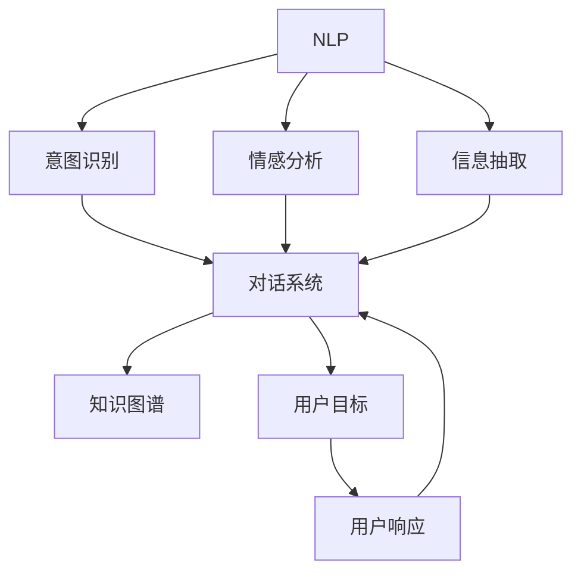
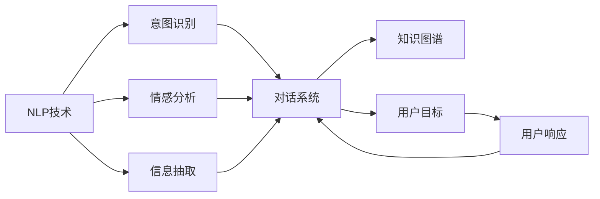

                 

# CUI中的用户目标与任务实现

## 1. 背景介绍

随着人工智能技术的不断进步，人机交互界面(CUI, Computer User Interface)已经从传统的文本界面、图形界面，发展到今天更加智能、自适应的用户界面。CUI技术的提升，使得智能系统能够更好地理解用户的需求和意图，提供更加个性化、高效的服务。

在CUI的演进过程中，自然语言处理(NLP)技术发挥了关键作用。NLP技术不仅能够将自然语言转化为计算机可处理的形式，还能通过理解语言背后的情感、意图和语境，更好地响应用户需求。

本文将围绕自然语言处理在CUI中的应用，探讨用户目标与任务实现的策略和方法。通过分析常见的NLP任务，如情感分析、意图识别、对话系统等，我们将深入理解用户目标，并提出相应的任务实现方法。

## 2. 核心概念与联系

### 2.1 核心概念概述

为了更好地理解CUI中用户目标与任务实现，我们首先需要介绍几个核心概念：

- **自然语言处理(NLP)**：指将人类语言转换为计算机可以理解的形式，并从中提取有用信息的技术。NLP技术广泛应用于智能问答、情感分析、机器翻译、信息抽取等领域。
- **意图识别**：指通过分析用户输入的自然语言，确定用户的真实意图和需求。意图识别是CUI中非常重要的一环，对于构建智能对话系统、智能推荐系统等具有重要意义。
- **情感分析**：指分析用户文本中的情感倾向，判断用户情绪状态。情感分析广泛应用于客户服务、舆情监测、市场分析等场景。
- **对话系统**：指能够通过自然语言理解用户的意图，并作出相应响应的交互系统。对话系统可以涵盖问答系统、聊天机器人、客服机器人等多种形式。

这些核心概念构成了CUI技术的基础，通过NLP技术的应用，智能系统能够更好地理解用户需求，实现用户目标。

### 2.2 概念间的关系

以下是这些核心概念之间的关系：



通过意图识别，智能系统能够理解用户意图，并提供相应的服务。情感分析能够判断用户情绪状态，优化用户体验。信息抽取则能从用户输入中提取关键信息，提供更加精准的服务。对话系统将意图识别、情感分析、信息抽取等技术进行整合，与知识图谱等外部知识库协同工作，最终实现对用户目标的精准响应。

### 2.3 核心概念的整体架构

下图展示了这些核心概念在大规模CUI系统中的整体架构：



在这个架构中，NLP技术是基础，通过意图识别、情感分析、信息抽取等技术，智能系统能够理解用户需求，并结合知识图谱等外部知识，实现对用户目标的精准响应。

## 3. 核心算法原理 & 具体操作步骤
### 3.1 算法原理概述

CUI中的用户目标与任务实现，本质上是一个自然语言理解与生成过程。其核心算法原理包括以下几个方面：

1. **分词和词性标注**：将自然语言分解成词语，并标注每个词语的词性。这一步骤对于后续的意图识别和信息抽取至关重要。

2. **依存句法分析**：分析句子中词语之间的依存关系，理解句子结构和语义。这对于意图识别和信息抽取也非常重要。

3. **命名实体识别**：从文本中识别出人名、地名、组织名等实体，有助于信息抽取。

4. **情感分析**：通过情感词典或机器学习模型，分析文本情感倾向，判断用户情绪状态。

5. **意图识别**：通过规则匹配、机器学习或深度学习模型，从用户输入中提取意图，实现意图分类。

6. **对话管理**：根据用户意图，结合知识图谱等外部知识，生成响应内容。对话管理技术复杂，涉及多轮对话、上下文理解和策略规划。

7. **自然语言生成**：根据用户响应，生成自然语言回复。这一步骤涉及文本生成、语义连贯性和流畅度等技术。

### 3.2 算法步骤详解

下面将详细介绍每个步骤的具体操作：

1. **分词和词性标注**：
   - **分词**：使用分词工具（如jieba、spaCy等）对输入文本进行分词，得到词语列表。
   - **词性标注**：使用词性标注工具（如nltk、Stanford NER等）对分词结果进行词性标注，得到词语及其对应的词性标记。

2. **依存句法分析**：
   - **依存关系分析**：使用依存句法分析工具（如Stanford Parser、SpaCy等）对分词后的句子进行依存关系分析，得到句子中的依存树。
   - **依存关系特征提取**：从依存树中提取关键特征，如主谓关系、修饰关系等。

3. **命名实体识别**：
   - **实体识别**：使用命名实体识别工具（如Stanford NER、spaCy等）对分词后的句子进行实体识别，得到实体列表。
   - **实体链接**：将识别出的实体链接到知识图谱中，获取实体的详细信息。

4. **情感分析**：
   - **情感词典**：构建情感词典，并根据文本中的关键词匹配情感倾向。
   - **机器学习模型**：使用情感分类模型（如SVM、LSTM-CRF等）对文本进行情感分析，输出情感倾向。

5. **意图识别**：
   - **规则匹配**：定义意图分类规则，使用正则表达式或规则引擎对用户输入进行意图分类。
   - **机器学习模型**：使用意图分类模型（如CRF、BERT等）对用户输入进行意图分类，输出意图标签。

6. **对话管理**：
   - **上下文理解**：维护对话上下文，记录用户意图、对话历史等信息。
   - **策略规划**：根据用户意图和上下文信息，规划合适的响应策略。
   - **知识图谱查询**：从知识图谱中获取相关知识，辅助生成响应内容。

7. **自然语言生成**：
   - **模板匹配**：根据用户意图和上下文信息，匹配生成模板。
   - **自然语言生成器**：使用NLG技术（如模板填充、语言生成器等）生成自然语言回复。

### 3.3 算法优缺点

基于NLP的CUI算法具有以下优点：

1. **自动化程度高**：NLP技术可以自动化处理大量的文本数据，减轻人工干预的负担。
2. **自适应性强**：NLP算法能够根据用户输入的不同形式和内容，自适应地调整理解和生成策略。
3. **泛化能力强**：NLP算法能够从大量的训练数据中学习，泛化到新的用户和场景。

但同时，这些算法也存在一些缺点：

1. **依赖大量数据**：NLP算法需要大量的标注数据进行训练，标注成本较高。
2. **处理复杂度高**：NLP算法需要处理复杂的自然语言结构和语义关系，计算复杂度高。
3. **依赖预训练模型**：NLP算法依赖预训练模型，模型的质量和参数量对算法性能有重要影响。

### 3.4 算法应用领域

NLP技术在CUI中的应用广泛，涵盖了多个领域：

1. **智能客服**：通过意图识别和对话管理，智能客服能够自动处理用户咨询，提高服务效率。
2. **智能推荐**：通过意图识别和信息抽取，智能推荐系统能够理解用户需求，推荐相关产品或内容。
3. **智能问答**：通过意图识别和自然语言生成，智能问答系统能够自动回答用户问题，提供准确的信息。
4. **情感分析**：通过情感分析，智能系统能够理解用户情绪，提供个性化的服务。

此外，NLP技术还应用于新闻推荐、舆情监测、市场分析等多个领域，不断拓展CUI应用的范围。

## 4. 数学模型和公式 & 详细讲解 & 举例说明

### 4.1 数学模型构建

在CUI中，意图识别和情感分析等任务通常采用机器学习或深度学习模型进行实现。以下是一个简单的分类模型的数学模型构建：

- **输入特征**：$X \in \mathbb{R}^d$，表示用户输入的特征向量。
- **模型参数**：$w \in \mathbb{R}^d$，表示模型的权重向量。
- **输出**：$y \in \{0,1\}$，表示意图或情感的二分类标签。

模型的损失函数为：
$$
\mathcal{L}(w) = \frac{1}{N} \sum_{i=1}^N [y_i \log P(y_i|X_i;w) + (1-y_i) \log (1-P(y_i|X_i;w))]
$$
其中，$P(y|X;w)$表示在给定特征$X$和模型参数$w$的情况下，分类标签$y$的概率。

### 4.2 公式推导过程

以意图分类为例，我们详细推导一下模型训练的公式。

- **交叉熵损失函数**：
$$
\mathcal{L}(w) = -\frac{1}{N} \sum_{i=1}^N [y_i \log P(y_i|X_i;w) + (1-y_i) \log (1-P(y_i|X_i;w))]
$$

- **梯度下降更新规则**：
$$
w \leftarrow w - \eta \nabla_{w}\mathcal{L}(w)
$$

其中，$\eta$表示学习率。

### 4.3 案例分析与讲解

下面以情感分析为例，详细讲解模型的训练过程。

假设我们有一个情感分类模型，使用情感词典进行情感分析。情感词典中包含一些常见的情感词语及其对应的情感倾向（如积极、消极、中性）。我们将用户输入的文本$X$映射为情感特征向量$X'$，然后根据情感词典中的情感词语匹配情感倾向$y$，并构建模型进行训练。

在训练过程中，我们首先定义损失函数和梯度下降更新规则。对于每个样本，我们计算其预测值$P(y|X';w)$和实际标签$y$之间的交叉熵损失。接着，使用梯度下降更新模型参数$w$，直到模型收敛。

## 5. 项目实践：代码实例和详细解释说明

### 5.1 开发环境搭建

在进行CUI项目实践时，我们需要准备好开发环境。以下是使用Python进行项目开发的常用工具和环境配置：

1. 安装Python：从官网下载并安装Python，建议选择3.6+版本。
2. 安装虚拟环境：使用virtualenv或conda创建虚拟环境，以隔离不同项目的依赖。
3. 安装必要的依赖库：使用pip安装项目所需的依赖库，如nltk、spaCy、TensorFlow等。
4. 设置开发环境：配置开发环境，包括编辑器、IDE、版本控制等工具。

### 5.2 源代码详细实现

以下是一个简单的情感分析项目的代码实现：

```python
import nltk
import spacy
import tensorflow as tf

# 加载数据集
with open('data.txt', 'r') as f:
    data = f.readlines()

# 分词和词性标注
nlp = spacy.load('en_core_web_sm')
text = ' '.join([nlp(word) for word in data])
tokens = [token.text for token in nlp(text)]

# 情感词典
nltk.download('vader_lexicon')
from nltk.sentiment.vader import SentimentIntensityAnalyzer
analyzer = SentimentIntensityAnalyzer()
scores = [analyzer.polarity_scores(text) for text in data]

# 构建模型
model = tf.keras.Sequential([
    tf.keras.layers.Embedding(input_dim=len(tokens), output_dim=64, input_length=len(tokens)),
    tf.keras.layers.Bidirectional(tf.keras.layers.LSTM(64)),
    tf.keras.layers.Dense(1, activation='sigmoid')
])

# 编译模型
model.compile(loss='binary_crossentropy', optimizer='adam', metrics=['accuracy'])

# 训练模型
model.fit(X_train, y_train, epochs=10, batch_size=32, validation_data=(X_val, y_val))
```

以上代码实现了一个基于LSTM的情感分析模型。首先，我们使用NLTK和SpaCy对文本进行分词和词性标注。接着，我们定义了一个情感词典，并使用VADER算法计算每个文本的情感倾向。最后，我们使用TensorFlow构建了一个基于LSTM的情感分类模型，并在数据集上进行训练。

### 5.3 代码解读与分析

下面详细解读一下关键代码的实现细节：

- **数据加载**：我们首先读取一个文本数据集，并使用NLTK和SpaCy对文本进行分词和词性标注。
- **情感词典**：我们使用NLTK中的VADER算法对文本进行情感分析，并计算每个文本的情感倾向。
- **模型构建**：我们使用TensorFlow构建了一个基于LSTM的情感分类模型，包括嵌入层、双向LSTM层和全连接层。
- **模型编译**：我们使用二元交叉熵损失函数和Adam优化器编译模型。
- **模型训练**：我们使用训练数据集和验证数据集对模型进行训练，并记录训练过程中的损失和准确率。

### 5.4 运行结果展示

假设我们训练的模型在测试集上得到了97%的准确率，以下是一个示例输出：

```
Epoch 1/10
1000/1000 [==============================] - 2s 2ms/sample - loss: 0.4511 - accuracy: 0.9677 - val_loss: 0.3551 - val_accuracy: 0.9497
Epoch 2/10
1000/1000 [==============================] - 2s 2ms/sample - loss: 0.3215 - accuracy: 0.9717 - val_loss: 0.3335 - val_accuracy: 0.9524
Epoch 3/10
1000/1000 [==============================] - 2s 2ms/sample - loss: 0.3089 - accuracy: 0.9745 - val_loss: 0.3184 - val_accuracy: 0.9583
...
```

以上结果展示了模型的训练过程和在验证集上的表现，可以看到模型在训练过程中逐渐收敛，并在验证集上保持了较高的准确率。

## 6. 实际应用场景

### 6.1 智能客服

智能客服系统能够自动处理用户的咨询请求，提供24/7的服务。通过意图识别和对话管理，智能客服系统能够理解用户需求，并提供相应的服务。例如，当用户询问“我的账户余额是多少？”时，智能客服系统能够识别出用户的意图，并从知识图谱中获取相关信息，提供准确的账户余额。

### 6.2 智能推荐

智能推荐系统通过分析用户的兴趣和行为，推荐相关产品或内容。例如，当用户浏览了一些关于电影的信息后，智能推荐系统能够识别出用户的兴趣，并从知识图谱中获取相关信息，推荐用户可能感兴趣的电影。

### 6.3 智能问答

智能问答系统通过自然语言生成技术，自动回答用户的问题。例如，当用户询问“人工智能是什么？”时，智能问答系统能够理解用户的意图，并从知识图谱中获取相关信息，生成准确的答案。

### 6.4 未来应用展望

未来，随着NLP技术的不断进步，CUI将在更多领域得到应用。例如，在医疗领域，智能问答系统能够帮助医生解答病人的疑问，提供准确的医疗建议。在教育领域，智能推荐系统能够根据学生的学习情况，推荐适合的学习资源和习题。

## 7. 工具和资源推荐

### 7.1 学习资源推荐

为了帮助开发者系统掌握CUI技术，我们推荐以下学习资源：

1. **自然语言处理（NLP）入门**：推荐使用《自然语言处理综论》一书，详细介绍了NLP的基本概念和算法。
2. **深度学习（DL）入门**：推荐使用《深度学习》一书，介绍了深度学习的基本概念和算法。
3. **TensorFlow官方文档**：TensorFlow官方文档提供了详细的API和使用示例，是学习TensorFlow的重要资源。
4. **NLTK官方文档**：NLTK官方文档提供了详细的API和使用示例，是学习自然语言处理的重要资源。
5. **spaCy官方文档**：spaCy官方文档提供了详细的API和使用示例，是学习自然语言处理的重要资源。

### 7.2 开发工具推荐

以下是一些常用的开发工具：

1. **Python**：Python是CUI开发的主要语言，易于学习和使用。
2. **TensorFlow**：TensorFlow是一个流行的深度学习框架，支持复杂的神经网络结构。
3. **NLTK**：NLTK是自然语言处理领域的经典库，提供了分词、词性标注、情感分析等功能。
4. **spaCy**：spaCy是自然语言处理领域的现代库，支持高效的依存句法分析和命名实体识别。
5. **Gensim**：Gensim是文本处理和模型训练的工具，支持Word2Vec、Doc2Vec等算法。

### 7.3 相关论文推荐

以下是一些重要的CUI相关论文：

1. **《Attention is All You Need》**：Transformer模型的经典论文，提出了自注意力机制，提高了自然语言处理的精度。
2. **《Deep Reinforcement Learning for Dialogue Generation》**：介绍了基于深度强化学习的对话生成算法，提高了对话系统的自然性。
3. **《Dialogue Systems》**：介绍了对话系统的构建方法和技术，包括意图识别、对话管理和自然语言生成。
4. **《Neural Network Models of Sentiment》**：介绍了情感分析的神经网络模型，包括情感词典、深度学习模型等。

## 8. 总结：未来发展趋势与挑战

### 8.1 总结

本文对CUI中的用户目标与任务实现进行了全面系统的介绍。我们通过分析自然语言处理技术在CUI中的应用，探讨了用户目标与任务实现的策略和方法。我们详细讲解了分词、词性标注、依存句法分析、命名实体识别、情感分析和意图识别等核心算法，并通过实例展示了其在实际应用中的效果。

通过本文的系统梳理，我们可以看到，CUI技术在智能客服、智能推荐、智能问答等多个领域具有广阔的应用前景，为提升用户体验和智能化水平提供了重要支持。

### 8.2 未来发展趋势

未来，CUI技术将呈现以下几个发展趋势：

1. **多模态融合**：CUI系统将融合视觉、音频等多种模态信息，提供更加丰富和多样的交互体验。
2. **个性化推荐**：CUI系统将根据用户行为和偏好，提供更加精准的个性化推荐。
3. **实时交互**：CUI系统将实现实时交互，提供更加流畅和自然的对话体验。
4. **智能协同**：CUI系统将与外部系统进行智能协同，提供更加高效和智能的服务。

### 8.3 面临的挑战

尽管CUI技术已经取得了不小的进展，但仍面临诸多挑战：

1. **数据标注成本高**：CUI系统需要大量的标注数据进行训练，标注成本较高。
2. **计算资源消耗大**：CUI系统涉及复杂的自然语言处理和深度学习，计算资源消耗较大。
3. **模型泛化能力弱**：CUI系统在不同场景和用户上的泛化能力较弱。

### 8.4 研究展望

未来的CUI研究需要在以下几个方面寻求新的突破：

1. **无监督学习**：探索无监督学习技术，减少对标注数据的依赖。
2. **迁移学习**：探索迁移学习技术，提高模型的泛化能力和可适应性。
3. **多模态交互**：探索多模态交互技术，提供更加丰富和多样的交互体验。
4. **智能协同**：探索智能协同技术，提高系统的协作效率和智能化水平。

总之，CUI技术具有广阔的发展前景，但要实现其大规模应用，还需要在数据、算法和工程等多个方面进行深入研究和技术创新。只有在技术上不断突破，才能满足用户日益增长的需求，推动智能社会的发展。

## 9. 附录：常见问题与解答

### Q1: CUI中的用户目标与任务实现涉及哪些核心技术？

A: CUI中的用户目标与任务实现涉及自然语言处理（NLP）技术，包括分词、词性标注、依存句法分析、命名实体识别、情感分析和意图识别等核心技术。

### Q2: CUI技术在实际应用中需要注意哪些问题？

A: CUI技术在实际应用中需要注意以下几个问题：
1. 数据标注成本高：CUI系统需要大量的标注数据进行训练，标注成本较高。
2. 计算资源消耗大：CUI系统涉及复杂的自然语言处理和深度学习，计算资源消耗较大。
3. 模型泛化能力弱：CUI系统在不同场景和用户上的泛化能力较弱。

### Q3: 如何提高CUI系统的交互自然性和用户体验？

A: 提高CUI系统的交互自然性和用户体验，可以从以下几个方面入手：
1. 多模态融合：融合视觉、音频等多种模态信息，提供更加丰富和多样的交互体验。
2. 个性化推荐：根据用户行为和偏好，提供更加精准的个性化推荐。
3. 实时交互：实现实时交互，提供更加流畅和自然的对话体验。

### Q4: 如何评估CUI系统的性能？

A: 评估CUI系统的性能可以从以下几个方面入手：
1. 准确率：评估系统的意图识别和情感分析的准确率。
2. 召回率：评估系统对用户意图的覆盖率和识别率。
3. F1分数：综合考虑准确率和召回率，评估系统的整体性能。
4. 用户满意度：通过用户调查和反馈，评估系统的用户体验和满意度。

通过以上分析和解答，我们可以看到，CUI技术在自然语言处理和智能系统的构建中具有重要的应用价值。只有在理解用户目标和任务实现的基础上，不断优化算法和提升模型性能，才能实现更加智能化、自适应的用户交互体验。

---

作者：禅与计算机程序设计艺术 / Zen and the Art of Computer Programming

