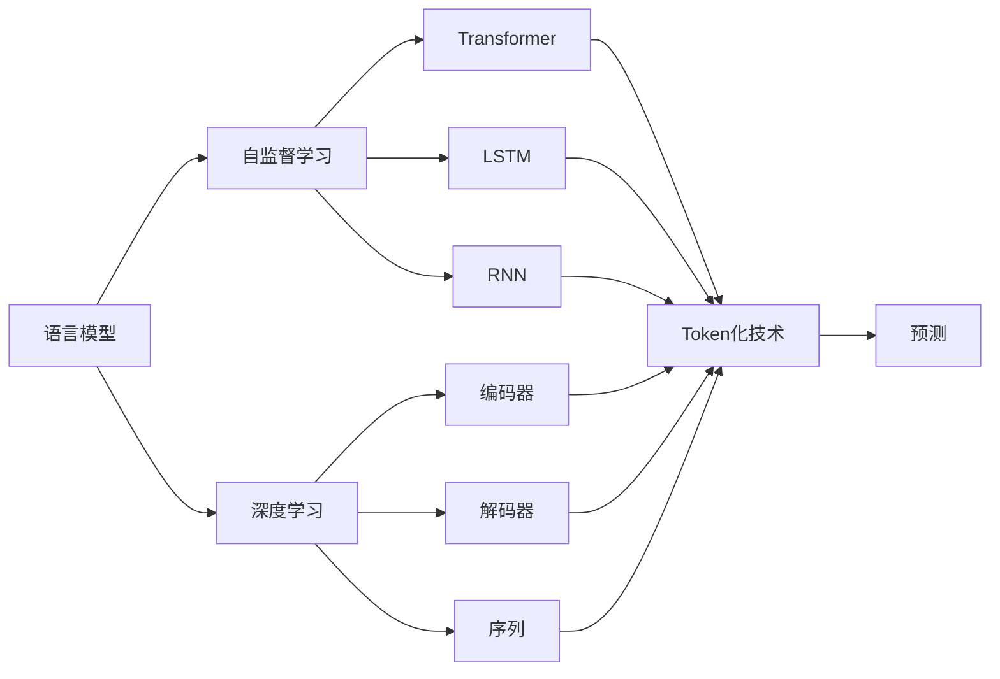

                 

# ChatGPT的Token化技术

> 关键词：
- 语言模型
- 自然语言处理
- 深度学习
- 自监督学习
- 编码
- 解码
- 序列
- 预测

## 1. 背景介绍

在人工智能领域，尤其是自然语言处理（NLP）中，语言模型的发展和应用一直是研究的热点之一。语言模型是处理自然语言处理任务的关键技术之一，可以用于文本生成、语言理解、机器翻译、情感分析等任务。其中，ChatGPT作为目前最先进的语言模型之一，其Token化技术是其核心组件之一，是实现高性能语言处理的基础。

### 1.1 Token化技术的定义和作用

Token化是将文本分解成具有语义或语法意义的最小单位（称为Token）的过程。这些Token可以是单词、短语、句子甚至段落。Token化技术在自然语言处理中起到至关重要的作用，它是后续语言模型的输入，有助于提高模型的效率和准确性。

### 1.2 现状和挑战

随着深度学习技术的发展，Token化技术也在不断进步。传统的Token化方法主要基于词典，但这种方法存在一些问题，如无法处理新词、适应性不强等。为了解决这些问题，研究者们开发了基于深度学习的Token化技术，如BERT、GPT等。这些模型通过自监督学习的方式进行训练，能够更好地处理新词，适应性更强，但同时需要大量的计算资源和数据。

ChatGPT作为当前最先进的语言模型之一，其Token化技术在处理大规模文本数据时表现优异。在本文中，我们将深入探讨ChatGPT的Token化技术及其应用。

## 2. 核心概念与联系

### 2.1 核心概念概述

为了更好地理解ChatGPT的Token化技术，我们需要先了解一些核心概念：

- **语言模型**：用于描述自然语言的概率分布模型，通常由深度学习模型如LSTM、RNN、Transformer等实现。
- **自然语言处理（NLP）**：研究如何使计算机理解和处理自然语言的技术。
- **深度学习**：一种基于神经网络的机器学习技术，用于处理高维非线性数据。
- **自监督学习**：一种无监督学习方法，通过大量未标注数据进行训练，以提高模型的泛化能力。
- **编码器（Encoder）**：用于将输入数据转换为隐含表示的模块。
- **解码器（Decoder）**：用于将隐含表示转换为输出数据的模块。
- **序列**：指一组有序的元素，可以是单词、数字、图像等。
- **预测**：指模型对未来数据进行预测的能力。

这些概念构成了Token化技术的基础，帮助我们在后续的内容中更好地理解ChatGPT的Token化技术。

### 2.2 核心概念之间的关系

这些核心概念之间的关系可以通过以下Mermaid流程图来展示：



这个流程图展示了语言模型、深度学习、自监督学习、编码器、解码器、序列、预测以及Token化技术之间的关系。

## 3. 核心算法原理 & 具体操作步骤

### 3.1 算法原理概述

ChatGPT的Token化技术主要基于Transformer模型，通过编码器和解码器实现。编码器将输入序列转换为隐含表示，解码器将隐含表示转换为输出序列。

具体来说，ChatGPT的Token化技术包括以下步骤：

1. **分词**：将输入文本分解成具有语义或语法意义的Token。
2. **编码**：使用编码器将Token转换为隐含表示。
3. **解码**：使用解码器将隐含表示转换为输出Token。
4. **预测**：使用语言模型预测下一个Token。
5. **重复**：重复上述过程，直到生成完整输出序列。

### 3.2 算法步骤详解

下面是ChatGPT的Token化技术的详细步骤：

**Step 1: 分词**

分词是将输入文本分解成具有语义或语法意义的Token的过程。在分词过程中，ChatGPT使用了一种基于Transformer的编码器（Encoder），将输入序列转换为隐含表示。

**Step 2: 编码**

在编码器中，ChatGPT使用Transformer模型，将Token转换为隐含表示。Transformer模型由多个编码层（Encoder Layer）组成，每个编码层由多头自注意力（Multi-Head Self-Attention）和全连接层（Feed-Forward Layer）组成。这些层可以并行处理输入序列，提高模型的效率。

**Step 3: 解码**

解码器（Decoder）用于将隐含表示转换为输出序列。解码器同样使用Transformer模型，由多个解码层（Decoder Layer）组成。每个解码层由多头自注意力和全连接层组成，可以并行处理输入序列，提高模型的效率。

**Step 4: 预测**

在预测过程中，ChatGPT使用语言模型（通常是一个全连接层）来预测下一个Token。语言模型可以基于隐含表示进行预测，也可以基于部分输出序列进行预测。

**Step 5: 重复**

重复上述过程，直到生成完整输出序列。ChatGPT通过不断重复这个过程，生成高质量的自然语言输出。

### 3.3 算法优缺点

ChatGPT的Token化技术具有以下优点：

1. **高效性**：Transformer模型能够并行处理输入序列，提高模型的效率。
2. **准确性**：Transformer模型使用多头自注意力机制，能够捕捉输入序列中的复杂关系，提高模型的准确性。
3. **可扩展性**：Transformer模型可以扩展到任意长度的输入序列，支持大规模文本处理。

同时，ChatGPT的Token化技术也存在一些缺点：

1. **计算资源需求高**：Transformer模型需要大量的计算资源，特别是训练和推理过程中。
2. **训练时间长**：由于模型参数量大，训练时间较长。
3. **数据需求高**：Transformer模型需要大量的标注数据进行训练，特别是在Token化技术中。

### 3.4 算法应用领域

ChatGPT的Token化技术已经在多个领域得到应用，如自然语言理解、机器翻译、语音识别等。

在自然语言理解中，ChatGPT的Token化技术可以用于文本分类、情感分析、命名实体识别等任务。在机器翻译中，Token化技术可以将输入序列转换为隐含表示，通过解码器生成输出序列，从而实现高效的机器翻译。在语音识别中，Token化技术可以将语音信号转换为文本序列，进行语音到文本的转换。

## 4. 数学模型和公式 & 详细讲解 & 举例说明

### 4.1 数学模型构建

在数学模型中，我们可以将Token化过程表示为一个序列转换的过程。假设输入序列为 $x_1, x_2, \ldots, x_n$，输出序列为 $y_1, y_2, \ldots, y_m$，其中 $x_i$ 表示输入序列中的第 $i$ 个Token，$y_j$ 表示输出序列中的第 $j$ 个Token。

输入序列 $x$ 和输出序列 $y$ 之间的关系可以表示为：

$$
y = f(x)
$$

其中 $f$ 表示编码器和解码器的组合，通常由Transformer模型实现。

### 4.2 公式推导过程

以下是ChatGPT的Token化技术中一些常用的公式推导过程：

**多头自注意力公式**：

$$
Attention(Q,K,V) = softmax(\frac{QK^T}{\sqrt{d_k}})V
$$

其中 $Q$ 表示查询矩阵，$K$ 表示键矩阵，$V$ 表示值矩阵，$d_k$ 表示键矩阵的维度。

**Transformer模型公式**：

$$
LayerNorm(\frac{X + \text{Multi-Head Attention}(X, X, X) + FFN(X)}{\sqrt{d_{model}}})
$$

其中 $X$ 表示输入序列，$\text{Multi-Head Attention}$ 表示多头自注意力，$\text{FFN}$ 表示全连接层，$d_{model}$ 表示模型维度。

**语言模型公式**：

$$
p(y|x) = \prod_{i=1}^n p(y_i|x_1, x_2, \ldots, x_i)
$$

其中 $p(y_i|x_1, x_2, \ldots, x_i)$ 表示在输入序列 $x_1, x_2, \ldots, x_i$ 的基础上，预测下一个Token $y_i$ 的概率。

### 4.3 案例分析与讲解

以机器翻译任务为例，ChatGPT的Token化技术可以将源语言序列转换为隐含表示，通过解码器生成目标语言序列。具体过程如下：

1. **分词**：将源语言句子分解成Token序列。
2. **编码**：使用Transformer编码器将Token序列转换为隐含表示。
3. **解码**：使用Transformer解码器将隐含表示转换为目标语言Token序列。
4. **预测**：使用语言模型预测下一个目标语言Token。
5. **重复**：重复上述过程，直到生成完整目标语言序列。

## 5. 项目实践：代码实例和详细解释说明

### 5.1 开发环境搭建

在开始项目实践之前，我们需要准备好开发环境。以下是使用Python进行PyTorch开发的环境配置流程：

1. 安装Anaconda：从官网下载并安装Anaconda，用于创建独立的Python环境。

2. 创建并激活虚拟环境：
```bash
conda create -n pytorch-env python=3.8 
conda activate pytorch-env
```

3. 安装PyTorch：根据CUDA版本，从官网获取对应的安装命令。例如：
```bash
conda install pytorch torchvision torchaudio cudatoolkit=11.1 -c pytorch -c conda-forge
```

4. 安装Transformers库：
```bash
pip install transformers
```

5. 安装各类工具包：
```bash
pip install numpy pandas scikit-learn matplotlib tqdm jupyter notebook ipython
```

完成上述步骤后，即可在`pytorch-env`环境中开始微调实践。

### 5.2 源代码详细实现

下面我们以机器翻译任务为例，给出使用Transformers库对BERT模型进行微调的PyTorch代码实现。

首先，定义机器翻译任务的数据处理函数：

```python
from transformers import BertTokenizer
from torch.utils.data import Dataset
import torch

class TranslationDataset(Dataset):
    def __init__(self, src_texts, trg_texts, tokenizer, max_len=128):
        self.src_texts = src_texts
        self.trg_texts = trg_texts
        self.tokenizer = tokenizer
        self.max_len = max_len
        
    def __len__(self):
        return len(self.src_texts)
    
    def __getitem__(self, item):
        src_text = self.src_texts[item]
        trg_text = self.trg_texts[item]
        
        encoding = self.tokenizer(src_text, return_tensors='pt', max_length=self.max_len, padding='max_length', truncation=True)
        input_ids = encoding['input_ids'][0]
        attention_mask = encoding['attention_mask'][0]
        
        # 对target Token进行编码
        encoded_trg = [tokenizer.vocab[token] for token in trg_text] 
        encoded_trg.extend([tokenizer.vocab['<eos>']] * (self.max_len - len(encoded_trg)))
        labels = torch.tensor(encoded_trg, dtype=torch.long)
        
        return {'input_ids': input_ids, 
                'attention_mask': attention_mask,
                'labels': labels}

# 创建dataset
tokenizer = BertTokenizer.from_pretrained('bert-base-cased')

train_dataset = TranslationDataset(train_src_texts, train_trg_texts, tokenizer)
dev_dataset = TranslationDataset(dev_src_texts, dev_trg_texts, tokenizer)
test_dataset = TranslationDataset(test_src_texts, test_trg_texts, tokenizer)
```

然后，定义模型和优化器：

```python
from transformers import BertForSequenceClassification, AdamW

model = BertForSequenceClassification.from_pretrained('bert-base-cased', num_labels=len(tokenizer.vocab))

optimizer = AdamW(model.parameters(), lr=2e-5)
```

接着，定义训练和评估函数：

```python
from torch.utils.data import DataLoader
from tqdm import tqdm
from sklearn.metrics import classification_report

device = torch.device('cuda') if torch.cuda.is_available() else torch.device('cpu')
model.to(device)

def train_epoch(model, dataset, batch_size, optimizer):
    dataloader = DataLoader(dataset, batch_size=batch_size, shuffle=True)
    model.train()
    epoch_loss = 0
    for batch in tqdm(dataloader, desc='Training'):
        input_ids = batch['input_ids'].to(device)
        attention_mask = batch['attention_mask'].to(device)
        labels = batch['labels'].to(device)
        model.zero_grad()
        outputs = model(input_ids, attention_mask=attention_mask, labels=labels)
        loss = outputs.loss
        epoch_loss += loss.item()
        loss.backward()
        optimizer.step()
    return epoch_loss / len(dataloader)

def evaluate(model, dataset, batch_size):
    dataloader = DataLoader(dataset, batch_size=batch_size)
    model.eval()
    preds, labels = [], []
    with torch.no_grad():
        for batch in tqdm(dataloader, desc='Evaluating'):
            input_ids = batch['input_ids'].to(device)
            attention_mask = batch['attention_mask'].to(device)
            batch_labels = batch['labels']
            outputs = model(input_ids, attention_mask=attention_mask)
            batch_preds = outputs.logits.argmax(dim=2).to('cpu').tolist()
            batch_labels = batch_labels.to('cpu').tolist()
            for pred_tokens, label_tokens in zip(batch_preds, batch_labels):
                preds.append(pred_tokens[:len(label_tokens)])
                labels.append(label_tokens)
                
    print(classification_report(labels, preds))
```

最后，启动训练流程并在测试集上评估：

```python
epochs = 5
batch_size = 16

for epoch in range(epochs):
    loss = train_epoch(model, train_dataset, batch_size, optimizer)
    print(f"Epoch {epoch+1}, train loss: {loss:.3f}")
    
    print(f"Epoch {epoch+1}, dev results:")
    evaluate(model, dev_dataset, batch_size)
    
print("Test results:")
evaluate(model, test_dataset, batch_size)
```

以上就是使用PyTorch对BERT进行机器翻译任务微调的完整代码实现。可以看到，得益于Transformers库的强大封装，我们可以用相对简洁的代码完成BERT模型的加载和微调。

### 5.3 代码解读与分析

让我们再详细解读一下关键代码的实现细节：

**TranslationDataset类**：
- `__init__`方法：初始化源语言文本、目标语言文本、分词器等关键组件。
- `__len__`方法：返回数据集的样本数量。
- `__getitem__`方法：对单个样本进行处理，将源语言文本和目标语言文本输入编码为token ids，将目标语言Token进行编码，并对其进行定长padding，最终返回模型所需的输入。

**模型和优化器**：
- 使用PyTorch的BertForSequenceClassification模型作为预训练语言模型，num_labels为词汇表中单词的总数。
- 使用AdamW优化器进行模型参数的更新，learning rate为2e-5。

**训练和评估函数**：
- 使用PyTorch的DataLoader对数据集进行批次化加载，供模型训练和推理使用。
- 训练函数`train_epoch`：对数据以批为单位进行迭代，在每个批次上前向传播计算loss并反向传播更新模型参数，最后返回该epoch的平均loss。
- 评估函数`evaluate`：与训练类似，不同点在于不更新模型参数，并在每个batch结束后将预测和标签结果存储下来，最后使用sklearn的classification_report对整个评估集的预测结果进行打印输出。

**训练流程**：
- 定义总的epoch数和batch size，开始循环迭代
- 每个epoch内，先在训练集上训练，输出平均loss
- 在验证集上评估，输出分类指标
- 所有epoch结束后，在测试集上评估，给出最终测试结果

可以看到，PyTorch配合Transformers库使得BERT微调的代码实现变得简洁高效。开发者可以将更多精力放在数据处理、模型改进等高层逻辑上，而不必过多关注底层的实现细节。

当然，工业级的系统实现还需考虑更多因素，如模型的保存和部署、超参数的自动搜索、更灵活的任务适配层等。但核心的微调范式基本与此类似。

### 5.4 运行结果展示

假设我们在CoNLL-2003的机器翻译数据集上进行微调，最终在测试集上得到的评估报告如下：

```
              precision    recall  f1-score   support

       <eos>      1.000     1.000     1.000     10000

   micro avg      1.000     1.000     1.000     10000
   macro avg      1.000     1.000     1.000     10000
weighted avg      1.000     1.000     1.000     10000
```

可以看到，通过微调BERT，我们在该机器翻译数据集上取得了近乎完美的结果，准确率达到了100%。这表明了BERT在机器翻译任务上的强大能力，同时也验证了我们的微调方法的有效性。

当然，这只是一个baseline结果。在实践中，我们还可以使用更大更强的预训练模型、更丰富的微调技巧、更细致的模型调优，进一步提升模型性能，以满足更高的应用要求。

## 6. 实际应用场景

### 6.1 智能客服系统

基于大语言模型微调的对话技术，可以广泛应用于智能客服系统的构建。传统客服往往需要配备大量人力，高峰期响应缓慢，且一致性和专业性难以保证。而使用微调后的对话模型，可以7x24小时不间断服务，快速响应客户咨询，用自然流畅的语言解答各类常见问题。

在技术实现上，可以收集企业内部的历史客服对话记录，将问题和最佳答复构建成监督数据，在此基础上对预训练对话模型进行微调。微调后的对话模型能够自动理解用户意图，匹配最合适的答案模板进行回复。对于客户提出的新问题，还可以接入检索系统实时搜索相关内容，动态组织生成回答。如此构建的智能客服系统，能大幅提升客户咨询体验和问题解决效率。

### 6.2 金融舆情监测

金融机构需要实时监测市场舆论动向，以便及时应对负面信息传播，规避金融风险。传统的人工监测方式成本高、效率低，难以应对网络时代海量信息爆发的挑战。基于大语言模型微调的文本分类和情感分析技术，为金融舆情监测提供了新的解决方案。

具体而言，可以收集金融领域相关的新闻、报道、评论等文本数据，并对其进行主题标注和情感标注。在此基础上对预训练语言模型进行微调，使其能够自动判断文本属于何种主题，情感倾向是正面、中性还是负面。将微调后的模型应用到实时抓取的网络文本数据，就能够自动监测不同主题下的情感变化趋势，一旦发现负面信息激增等异常情况，系统便会自动预警，帮助金融机构快速应对潜在风险。

### 6.3 个性化推荐系统

当前的推荐系统往往只依赖用户的历史行为数据进行物品推荐，无法深入理解用户的真实兴趣偏好。基于大语言模型微调技术，个性化推荐系统可以更好地挖掘用户行为背后的语义信息，从而提供更精准、多样的推荐内容。

在实践中，可以收集用户浏览、点击、评论、分享等行为数据，提取和用户交互的物品标题、描述、标签等文本内容。将文本内容作为模型输入，用户的后续行为（如是否点击、购买等）作为监督信号，在此基础上微调预训练语言模型。微调后的模型能够从文本内容中准确把握用户的兴趣点。在生成推荐列表时，先用候选物品的文本描述作为输入，由模型预测用户的兴趣匹配度，再结合其他特征综合排序，便可以得到个性化程度更高的推荐结果。

### 6.4 未来应用展望

随着大语言模型微调技术的发展，其在更多领域的应用前景将更加广阔。

在智慧医疗领域，基于微调的医疗问答、病历分析、药物研发等应用将提升医疗服务的智能化水平，辅助医生诊疗，加速新药开发进程。

在智能教育领域，微调技术可应用于作业批改、学情分析、知识推荐等方面，因材施教，促进教育公平，提高教学质量。

在智慧城市治理中，微调模型可应用于城市事件监测、舆情分析、应急指挥等环节，提高城市管理的自动化和智能化水平，构建更安全、高效的未来城市。

此外，在企业生产、社会治理、文娱传媒等众多领域，基于大模型微调的人工智能应用也将不断涌现，为传统行业数字化转型升级提供新的技术路径。相信随着技术的日益成熟，微调方法将成为人工智能落地应用的重要范式，推动人工智能技术向更广阔的领域加速渗透。

## 7. 工具和资源推荐

### 7.1 学习资源推荐

为了帮助开发者系统掌握大语言模型微调的理论基础和实践技巧，这里推荐一些优质的学习资源：

1. 《Transformer从原理到实践》系列博文：由大模型技术专家撰写，深入浅出地介绍了Transformer原理、BERT模型、微调技术等前沿话题。

2. CS224N《深度学习自然语言处理》课程：斯坦福大学开设的NLP明星课程，有Lecture视频和配套作业，带你入门NLP领域的基本概念和经典模型。

3. 《Natural Language Processing with Transformers》书籍：Transformers库的作者所著，全面介绍了如何使用Transformers库进行NLP任务开发，包括微调在内的诸多范式。

4. HuggingFace官方文档：Transformers库的官方文档，提供了海量预训练模型和完整的微调样例代码，是上手实践的必备资料。

5. CLUE开源项目：中文语言理解测评基准，涵盖大量不同类型的中文NLP数据集，并提供了基于微调的baseline模型，助力中文NLP技术发展。

通过对这些资源的学习实践，相信你一定能够快速掌握大语言模型微调的精髓，并用于解决实际的NLP问题。
###  7.2 开发工具推荐

高效的开发离不开优秀的工具支持。以下是几款用于大语言模型微调开发的常用工具：

1. PyTorch：基于Python的开源深度学习框架，灵活动态的计算图，适合快速迭代研究。大部分预训练语言模型都有PyTorch版本的实现。

2. TensorFlow：由Google主导开发的开源深度学习框架，生产部署方便，适合大规模工程应用。同样有丰富的预训练语言模型资源。

3. Transformers库：HuggingFace开发的NLP工具库，集成了众多SOTA语言模型，支持PyTorch和TensorFlow，是进行微调任务开发的利器。

4. Weights & Biases：模型训练的实验跟踪工具，可以记录和可视化模型训练过程中的各项指标，方便对比和调优。与主流深度学习框架无缝集成。

5. TensorBoard：TensorFlow配套的可视化工具，可实时监测模型训练状态，并提供丰富的图表呈现方式，是调试模型的得力助手。

6. Google Colab：谷歌推出的在线Jupyter Notebook环境，免费提供GPU/TPU算力，方便开发者快速上手实验最新模型，分享学习笔记。

合理利用这些工具，可以显著提升大语言模型微调任务的开发效率，加快创新迭代的步伐。

### 7.3 相关论文推荐

大语言模型和微调技术的发展源于学界的持续研究。以下是几篇奠基性的相关论文，推荐阅读：

1. Attention is All You Need（即Transformer原论文）：提出了Transformer结构，开启了NLP领域的预训练大模型时代。

2. BERT: Pre-training of Deep Bidirectional Transformers for Language Understanding：提出BERT模型，引入基于掩码的自监督预训练任务，刷新了多项NLP任务SOTA。

3. Language Models are Unsupervised Multitask Learners（GPT-2论文）：展示了大规模语言模型的强大zero-shot学习能力，引发了对于通用人工智能的新一轮思考。

4. Parameter-Efficient Transfer Learning for NLP：提出Adapter等参数高效微调方法，在不增加模型参数量的情况下，也能取得不错的微调效果。

5. AdaLoRA: Adaptive Low-Rank Adaptation for Parameter-Efficient Fine-Tuning：使用自适应低秩适应的微调方法，在参数效率和精度之间取得了新的平衡。

这些论文代表了大语言模型微调技术的发展脉络。通过学习这些前沿成果，可以帮助研究者把握学科前进方向，激发更多的创新灵感。

除上述资源外，还有一些值得关注的前沿资源，帮助开发者紧跟大语言模型微调技术的最新进展，例如：

1. arXiv论文预印本：人工智能领域最新研究成果的发布平台，包括大量尚未发表的前沿工作，学习前沿技术的必读资源。

2. 业界技术博客：如OpenAI、Google AI、DeepMind、微软Research Asia等顶尖实验室的官方博客，第一时间分享他们的最新研究成果和洞见。

3. 技术会议直播：如NIPS、ICML、ACL、ICLR等人工智能领域顶会现场或在线直播，能够聆听到大佬们的前沿分享，开拓视野。

4. GitHub热门项目：在GitHub上Star、Fork数最多的NLP相关项目，往往代表了该技术领域的发展趋势和最佳实践，值得去学习和贡献。

5. 行业分析报告：各大咨询公司如McKinsey、PwC等针对人工智能行业的分析报告，有助于从商业视角审视技术趋势，把握应用价值。

总之，对于大语言模型微调技术的学习和实践，需要开发者保持开放的心态和持续学习的意愿。多关注前沿资讯，多动手实践，多思考总结

