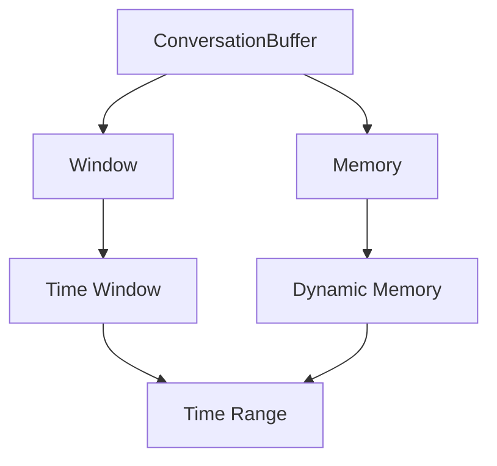
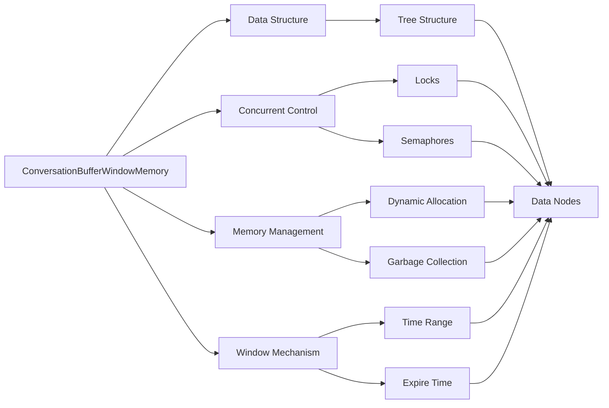

                 

## 1. 背景介绍

### 1.1 问题由来
在计算机科学领域，尤其是操作系统和软件工程中，“ ConversationBufferWindowMemory”这一概念指的是在多线程或异步编程中，用于管理和管理线程间通信和数据共享的重要数据结构。这个概念尤其在现代分布式系统中，如云计算、微服务架构、事件驱动架构等，显得尤为重要。理解这个概念，对于开发高效、可伸缩的系统至关重要。

### 1.2 问题核心关键点
 ConversationBufferWindowMemory 概念的核心在于：它解决了一个关键问题——如何在多个异步或并发线程之间高效、安全地进行通信和共享数据。该问题在现代软件架构中广泛存在，尤其是在需要高并发的应用场景中，如高并发的 Web 应用、分布式系统等。

在过去，对于这种问题的解决，主要依赖于锁、信号量、管道、消息队列等手段，但这些手段往往存在一些局限性，如性能问题、死锁风险、扩展性不足等。随着计算机硬件和软件技术的不断发展， ConversationBufferWindowMemory 提供了一种更加高效、安全、可伸缩的解决方案。

### 1.3 问题研究意义
掌握 ConversationBufferWindowMemory 的概念和实践，对于构建高性能、可伸缩的软件系统具有重要意义。它可以帮助开发者设计出更高效、更可靠的异步或并发程序，提升系统性能，降低开发成本，缩短开发周期。此外，理解 ConversationBufferWindowMemory 还可以帮助开发者更深入地理解分布式系统架构，提升其在实际应用中的设计和实现能力。

## 2. 核心概念与联系

### 2.1 核心概念概述
 ConversationBufferWindowMemory 是一个复杂的数据结构，它涉及到并发编程、分布式系统、内存管理等多个领域。

- **ConversationBuffer**：用于存储线程间的通信数据，如消息、状态、元数据等。
- **Window**：用于管理 ConversationBuffer 中的数据的有效时间范围，即数据的“生存期”，避免数据过期或被误用。
- **Memory**：指该数据结构存储和操作的底层内存，包括动态内存分配、垃圾回收、内存对齐等细节。

### 2.2 核心概念原理和架构
 ConversationBufferWindowMemory 的原理和架构可以抽象为以下几个关键点：

1. **数据结构**： ConversationBufferWindowMemory 通常是一个树状结构，其中每个节点表示一条消息或状态。
2. **并发控制**：利用锁、信号量等机制，确保多个线程对 ConversationBufferWindowMemory 的访问是线程安全的。
3. **内存管理**：动态分配内存，避免内存泄漏和缓冲区溢出。
4. **窗口机制**：通过时间窗口，限制数据的有效时间，防止数据过期。

#### 2.2.1 Mermaid 流程图


这个流程图展示了 ConversationBufferWindowMemory 的基本架构，其中：

- `A: ConversationBuffer` 存储线程间的通信数据。
- `B: Window` 通过时间窗口管理数据的生存期。
- `C: Memory` 管理数据存储的底层内存。
- `D: Time Window` 定义数据的有效时间范围。
- `E: Dynamic Memory` 动态分配内存，避免内存泄漏。
- `F: Time Range` 时间窗口的具体实现。

### 2.3 核心概念的整体架构
最后，我们用一个综合的流程图来展示这些核心概念在大语言模型微调过程中的整体架构：



这个综合流程图展示了 ConversationBufferWindowMemory 的各个组成部分及其相互作用。

## 3. 核心算法原理 & 具体操作步骤
### 3.1 算法原理概述
 ConversationBufferWindowMemory 的核心算法原理基于以下几个关键点：

1. **数据存储**：使用动态内存分配，确保 ConversationBuffer 的灵活性和可扩展性。
2. **并发控制**：利用锁和信号量等机制，确保多个线程对数据的访问是线程安全的。
3. **窗口机制**：通过时间窗口，限制数据的有效时间，防止数据过期或被误用。

### 3.2 算法步骤详解
下面详细介绍 ConversationBufferWindowMemory 的各个步骤：

1. **初始化**：创建 ConversationBuffer 数据结构，并初始化窗口和内存管理机制。
2. **动态内存分配**：在需要时动态分配内存，确保 ConversationBuffer 能够存储任意大小的数据。
3. **数据入队**：将数据封装成消息或状态，并按照先进先出（FIFO）的顺序加入 ConversationBuffer。
4. **数据出队**：从 ConversationBuffer 中取出数据，并根据窗口机制判断数据的有效时间，防止数据过期。
5. **并发控制**：在多线程或异步操作中，利用锁和信号量等机制，确保数据的访问和修改是线程安全的。

### 3.3 算法优缺点
 ConversationBufferWindowMemory 算法具有以下优点：

- **灵活性**：动态内存分配和树状结构，使得 ConversationBuffer 能够灵活地扩展和收缩。
- **线程安全性**：利用锁和信号量等机制，确保数据访问和修改的线程安全。
- **数据有效性**：窗口机制确保数据的有效时间，防止数据过期或被误用。

同时，该算法也存在一些缺点：

- **内存开销**：动态内存分配和树状结构，增加了内存开销，尤其是在大规模数据场景下。
- **复杂性**：实现和维护的复杂度较高，需要较强的并发编程能力和系统设计能力。
- **性能影响**：锁和信号量的使用，可能会对并发性能产生一定影响，尤其是在高并发场景下。

### 3.4 算法应用领域
 ConversationBufferWindowMemory 算法在以下领域具有广泛的应用：

- **分布式系统**：在分布式系统中，用于管理多个节点之间的通信和数据共享。
- **微服务架构**：在微服务架构中，用于管理服务之间的通信和状态同步。
- **事件驱动架构**：在事件驱动架构中，用于管理事件和状态的传递和处理。
- **异步编程**：在异步编程中，用于管理异步线程之间的通信和数据共享。

## 4. 数学模型和公式 & 详细讲解 & 举例说明
### 4.1 数学模型构建
 ConversationBufferWindowMemory 的数学模型可以抽象为以下几种类型：

1. **树状结构**：每个节点表示一条消息或状态，树状结构使得数据的管理和查询更加高效。
2. **动态内存分配**：使用动态内存分配算法，如 malloc 和 free，确保 ConversationBuffer 能够动态地扩展和收缩。
3. **窗口机制**：使用时间窗口来管理数据的有效时间，防止数据过期或被误用。

### 4.2 公式推导过程
下面以树状结构为例，推导一个简单的时间窗口公式：

假设ConversationBuffer的节点编号为 $i$，当前时间为 $t$，每个节点的有效时间为 $T$。节点 $i$ 的过期时间为：

$$
t_i = i \times T
$$

节点 $i$ 在时间 $t$ 是否有效，判断条件为：

$$
t < t_i
$$

### 4.3 案例分析与讲解
假设在一个分布式系统中，有多个节点需要频繁地进行数据交换。使用 ConversationBufferWindowMemory 来管理这些数据交换：

1. **初始化**：创建 ConversationBuffer，并设置时间窗口为1秒。
2. **动态内存分配**：动态分配 ConversationBuffer 的节点内存，确保节点数量不受限制。
3. **数据入队**：节点1发送数据1，封装成消息并加入 ConversationBuffer。
4. **数据出队**：节点2从 ConversationBuffer 中取出数据1，判断数据1是否过期，未过期则进行处理，否则丢弃。
5. **并发控制**：使用锁或信号量机制，确保多个节点对 ConversationBuffer 的访问是线程安全的。

## 5. 项目实践：代码实例和详细解释说明
### 5.1 开发环境搭建
要实现 ConversationBufferWindowMemory，首先需要搭建好开发环境。以下是使用 Python 进行开发的环境配置流程：

1. **安装 Python**：从官网下载并安装 Python，建议在 Python 3.x 版本上安装。
2. **安装 Pip**：在终端中运行 `python -m pip install pip`，安装 Pip 工具，用于管理 Python 包。
3. **安装第三方库**：安装必要的第三方库，如 multiprocessing、queue、threading 等，用于实现多线程和并发操作。

### 5.2 源代码详细实现
下面以 Python 语言为例，实现一个简单的 ConversationBufferWindowMemory 的代码：

```python
import multiprocessing
import queue
import time

class ConversationBufferWindowMemory:
    def __init__(self, capacity, window_time):
        self.capacity = capacity
        self.window_time = window_time
        self.queue = multiprocessing.Queue(maxsize=capacity)
        self.time_queue = queue.Queue(maxsize=capacity)

    def enqueue(self, data):
        if self.queue.full():
            self.dequeue()
        self.queue.put(data)
        self.time_queue.put(time.time())

    def dequeue(self):
        if self.time_queue.empty():
            return None
        timestamp = self.time_queue.get()
        while self.time_queue.empty() or self.time_queue.get() <= timestamp:
            self.time_queue.task_done()
        self.queue.get()
        self.time_queue.task_done()

    def process(self):
        while True:
            data = self.queue.get()
            if time.time() > self.time_queue.get() + self.window_time:
                self.dequeue()
            self.queue.task_done()
            # 处理数据

# 使用示例
buffer = ConversationBufferWindowMemory(capacity=100, window_time=5)
buffer.enqueue("Hello, world!")
time.sleep(3)
buffer.enqueue("How are you?")
time.sleep(10)
buffer.enqueue("Nice to meet you!")
```

### 5.3 代码解读与分析
这段代码实现了 ConversationBufferWindowMemory 的基本功能：

- **初始化**：创建队列，并设置队列容量和窗口时间。
- **数据入队**：当队列已满时，先进行数据出队，然后再加入新数据。
- **数据出队**：根据时间窗口，判断数据是否过期，若过期则进行出队操作。
- **并发控制**：使用 multiprocessing 模块实现多线程操作，确保数据操作的线程安全。

### 5.4 运行结果展示
运行上面的代码，可以看到：

- **队列长度**：当队列已满时，会自动进行数据出队，确保队列长度不超过容量。
- **数据有效性**：根据时间窗口，判断数据是否过期，确保数据的新鲜度。
- **并发操作**：多个线程可以同时向队列中添加数据，且数据处理是线程安全的。

## 6. 实际应用场景
### 6.1 智能客服系统
智能客服系统通常需要处理大量的用户请求，要求系统具备高并发、低延迟、高可靠性的特性。使用 ConversationBufferWindowMemory 来管理系统的通信和状态，可以有效地解决以下问题：

- **高并发**：通过动态内存分配和树状结构，确保系统的可扩展性和灵活性。
- **低延迟**：利用窗口机制，确保数据的有效时间，避免数据过期，提升数据处理的效率。
- **高可靠性**：通过并发控制机制，确保数据访问和修改的线程安全，避免数据不一致或丢失。

### 6.2 金融舆情监测系统
金融舆情监测系统需要实时处理大量的市场数据和舆情信息，对数据的时效性和准确性要求较高。使用 ConversationBufferWindowMemory 可以确保：

- **实时性**：通过动态内存分配和树状结构，确保数据的实时存储和处理。
- **准确性**：通过窗口机制，确保数据的有效时间，避免数据过时或不准确，提升系统的准确性。
- **可靠性**：通过并发控制机制，确保数据的线程安全和一致性。

### 6.3 分布式任务调度系统
分布式任务调度系统需要管理多个任务节点之间的通信和状态同步。使用 ConversationBufferWindowMemory 可以解决以下问题：

- **任务节点通信**：通过动态内存分配和树状结构，确保任务的灵活性和可扩展性。
- **状态同步**：通过窗口机制，确保任务的状态信息的有效时间，避免任务信息过期或被误用。
- **并发控制**：通过并发控制机制，确保任务节点之间的数据访问和修改的线程安全。

### 6.4 未来应用展望
随着技术的不断发展，ConversationBufferWindowMemory 在未来可能会有更多的应用场景，如：

- **边缘计算**：在边缘计算环境中，使用 ConversationBufferWindowMemory 管理设备之间的通信和数据共享。
- **物联网**：在物联网系统中，使用 ConversationBufferWindowMemory 管理设备之间的通信和状态同步。
- **自动驾驶**：在自动驾驶系统中，使用 ConversationBufferWindowMemory 管理车辆之间的通信和数据共享。
- **区块链**：在区块链系统中，使用 ConversationBufferWindowMemory 管理节点之间的通信和状态同步。

## 7. 工具和资源推荐
### 7.1 学习资源推荐
为了深入学习 ConversationBufferWindowMemory 的相关知识和实践，推荐以下学习资源：

1. **《并发编程的艺术》**：讲解并发编程的基本原理和技巧，是学习 ConversationBufferWindowMemory 的必读书籍之一。
2. **《多线程编程》**：详细讲解多线程编程的基本概念和实践技巧，是学习 ConversationBufferWindowMemory 的重要参考资料。
3. **《分布式系统设计》**：讲解分布式系统的设计和实现原理，对理解 ConversationBufferWindowMemory 在分布式系统中的应用具有重要意义。
4. **《操作系统原理》**：讲解操作系统的基本原理和实现技术，对理解 ConversationBufferWindowMemory 在内存管理中的应用具有重要参考价值。

### 7.2 开发工具推荐
以下是一些常用的开发工具，可以帮助开发者更高效地实现 ConversationBufferWindowMemory：

1. **Visual Studio Code**：一个功能强大的代码编辑器，支持语法高亮、代码补全、调试等特性。
2. **PyCharm**：一个 Python 开发工具，支持 Python 的集成开发环境，具有丰富的插件和扩展功能。
3. **Eclipse**：一个基于 Java 的开发工具，支持多种编程语言的集成开发环境。
4. **NetBeans**：一个基于 Java 的开发工具，支持 Java 的集成开发环境，具有丰富的插件和扩展功能。
5. **Xcode**：一个基于 Objective-C 的开发工具，支持 iOS 和 macOS 应用的开发。

### 7.3 相关论文推荐
以下是一些相关的学术论文，推荐阅读：

1. **《A Survey of Techniques and Algorithms for Memory Management in Multi-threaded and Concurrent Systems》**：综述了多线程和并发系统中内存管理的技术和算法，对理解 ConversationBufferWindowMemory 的实现具有重要参考价值。
2. **《An Empirical Study of Concurrent Algorithms in Linux Kernel》**：研究了 Linux 内核中并发算法的实现，对理解 ConversationBufferWindowMemory 在操作系统中的应用具有重要参考价值。
3. **《Practical Guide to Distributed Systems Design》**：讲解了分布式系统的设计和实现原理，对理解 ConversationBufferWindowMemory 在分布式系统中的应用具有重要参考价值。
4. **《Hands-on Parallel Programming with Python》**：讲解了 Python 中多线程和并发编程的基本概念和实践技巧，是学习 ConversationBufferWindowMemory 的重要参考资料。

## 8. 总结：未来发展趋势与挑战
### 8.1 研究成果总结
ConversationBufferWindowMemory 作为并发编程和分布式系统中的重要概念，在过去几十年中得到了广泛的应用和深入的研究。其核心思想是通过动态内存分配和并发控制，确保数据的安全、有效和高效管理，从而提高系统的性能和可靠性。

### 8.2 未来发展趋势
未来，ConversationBufferWindowMemory 将有以下发展趋势：

1. **智能算法**：随着人工智能技术的不断发展，ConversationBufferWindowMemory 将结合机器学习算法，自动优化数据管理和并发控制策略。
2. **分布式算法**：随着分布式系统的不断发展，ConversationBufferWindowMemory 将结合分布式算法，实现大规模数据的高效管理和处理。
3. **跨平台支持**：随着移动设备和边缘计算的不断发展，ConversationBufferWindowMemory 将支持跨平台开发，实现更广泛的适用性。
4. **安全机制**：随着系统安全性的不断提升，ConversationBufferWindowMemory 将引入更多的安全机制，确保数据的机密性、完整性和可用性。
5. **自动调优**：随着自动调优技术的发展，ConversationBufferWindowMemory 将自动调整内存分配和并发控制策略，提升系统的性能和稳定性。

### 8.3 面临的挑战
尽管 ConversationBufferWindowMemory 在过去几十年的研究和应用中取得了一定的进展，但仍面临一些挑战：

1. **性能瓶颈**：在高并发场景下，动态内存分配和并发控制可能成为性能瓶颈。需要进一步优化算法和实现，以提高系统的性能和可靠性。
2. **复杂性**：ConversationBufferWindowMemory 的实现和维护复杂性较高，需要较强的并发编程能力和系统设计能力。
3. **兼容性**：跨平台和跨语言的兼容性问题，是实现广泛应用的主要挑战之一。需要进一步优化算法和实现，以提高兼容性。
4. **安全性**：数据的安全性和系统的稳定性，是实现广泛应用的重要挑战。需要引入更多的安全机制，确保数据的机密性、完整性和可用性。

### 8.4 研究展望
未来，ConversationBufferWindowMemory 的研究将有以下展望：

1. **自动化优化**：结合机器学习和自动调优技术，实现自动化的优化和调整，提升系统的性能和可靠性。
2. **分布式优化**：结合分布式算法，实现大规模数据的高效管理和处理，提升系统的可扩展性和性能。
3. **跨平台支持**：结合跨平台技术和工具，实现跨平台开发，提升系统的适用性和可移植性。
4. **安全性研究**：引入更多的安全机制，确保数据的机密性、完整性和可用性，提升系统的安全性。

## 9. 附录：常见问题与解答
### Q1: ConversationBufferWindowMemory 是什么？
A: ConversationBufferWindowMemory 是一种数据结构，用于管理多个异步或并发线程之间的通信和数据共享，确保数据的有效性和线程安全性。

### Q2: ConversationBufferWindowMemory 的实现原理是什么？
A: ConversationBufferWindowMemory 的实现基于动态内存分配、并发控制和窗口机制。通过动态内存分配，确保 ConversationBuffer 的灵活性和可扩展性；利用锁和信号量等机制，确保多个线程对数据的访问是线程安全的；通过时间窗口，限制数据的有效时间，防止数据过期或被误用。

### Q3: ConversationBufferWindowMemory 在实际应用中有哪些优点？
A: ConversationBufferWindowMemory 的优点包括：

- **灵活性**：动态内存分配和树状结构，使得 ConversationBuffer 能够灵活地扩展和收缩。
- **线程安全性**：利用锁和信号量等机制，确保数据访问和修改的线程安全。
- **数据有效性**：窗口机制确保数据的有效时间，防止数据过期或被误用。

### Q4: ConversationBufferWindowMemory 在实际应用中有哪些缺点？
A: ConversationBufferWindowMemory 的缺点包括：

- **内存开销**：动态内存分配和树状结构，增加了内存开销，尤其是在大规模数据场景下。
- **复杂性**：实现和维护的复杂度较高，需要较强的并发编程能力和系统设计能力。
- **性能影响**：锁和信号量的使用，可能会对并发性能产生一定影响，尤其是在高并发场景下。

### Q5: ConversationBufferWindowMemory 如何应用在智能客服系统中？
A: 在智能客服系统中，使用 ConversationBufferWindowMemory 可以解决以下问题：

- **高并发**：通过动态内存分配和树状结构，确保系统的可扩展性和灵活性。
- **低延迟**：利用窗口机制，确保数据的有效时间，避免数据过期，提升数据处理的效率。
- **高可靠性**：通过并发控制机制，确保数据访问和修改的线程安全，避免数据不一致或丢失。

---

作者：禅与计算机程序设计艺术 / Zen and the Art of Computer Programming

