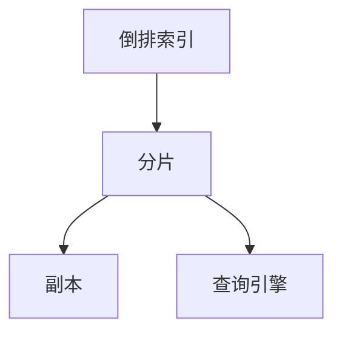

                 

# ES索引原理与代码实例讲解

## 1. 背景介绍

### 1.1 问题由来
在现代信息技术中，数据库索引是非常关键的技术之一。索引可以加速数据的查询、筛选、排序等操作，显著提升数据库系统的性能。然而，传统的关系型数据库索引系统通常只能处理结构化数据，对于非结构化、半结构化数据的处理能力有限。为了更好地应对大规模非结构化数据，搜索引擎 Elasticsearch（简称 ES）应运而生，成为处理大规模文本数据的首选方案。

ES 是一个开源的、分布式的搜索引擎，采用倒排索引（Inverted Index）技术实现高效率的文本查询和分析。其核心优势在于支持快速、灵活、高效的查询，以及扩展性和易用性。本文将对 ES 索引的原理进行详细讲解，并结合代码实例，展示如何构建和使用 ES 索引。

### 1.2 问题核心关键点
ES 索引的核心在于倒排索引和分布式架构。倒排索引是一种基于文档的索引，记录了每个单词在哪些文档中出现过，可以快速定位包含特定单词的文档。分布式架构使得 ES 能够在处理大规模数据时，具有高可用性、高扩展性和高吞吐量。

倒排索引的实现依赖于 Lucene 库，而 Lucene 又是一个通用的开源全文搜索引擎，被众多搜索引擎所采用。因此，理解 ES 索引的原理，需要首先掌握 Lucene 的倒排索引技术。

### 1.3 问题研究意义
ES 索引在处理大规模文本数据时具有重要意义：

1. **快速查询**：ES 索引可以快速定位文档中的关键字，提高查询效率。
2. **灵活检索**：支持多种查询类型，如模糊查询、短语查询、近似查询等，满足复杂的检索需求。
3. **扩展性**：支持分布式部署，能够根据数据规模动态扩展节点。
4. **高可用性**：采用冗余设计，保证系统的可靠性和可用性。
5. **易用性**：通过 RESTful API 提供服务，用户可以方便地进行数据管理和查询。

本文将从原理到实践，全面讲解 ES 索引的核心技术，帮助读者理解并掌握 ES 索引的构建和应用。

## 2. 核心概念与联系

### 2.1 核心概念概述

ES 索引的核心概念包括倒排索引、分片（Shards）、副本（Replicas）、查询引擎等。下面将详细介绍这些概念的原理和架构。

- **倒排索引**：记录每个单词在哪些文档中出现过，是 ES 索引的核心。
- **分片**：将一个索引拆分成多个片段（Shards），每个分片在单个节点上处理，提高查询效率。
- **副本**：每个分片会创建多个副本（Replicas），分布在不同节点上，保证数据的冗余和高可用性。
- **查询引擎**：负责接收查询请求，分发到各个分片处理，然后将结果汇总返回。

这些概念之间通过 Lucene 库和分布式协调技术进行连接，共同构成了 ES 索引的完整系统。

### 2.2 概念间的关系

倒排索引、分片、副本和查询引擎之间的关系可以通过以下 Mermaid 流程图展示：



这个流程图展示了大规模数据在 ES 索引中的处理流程：

1. 首先，每个文档被拆分成多个分片，分布在不同的节点上。
2. 每个分片创建多个副本，分布在不同的节点上，提高数据的冗余和高可用性。
3. 查询请求通过查询引擎分发至各个分片处理，并将结果汇总返回。
4. 查询结果通过倒排索引快速定位，实现高效率的文本检索。

通过理解这些核心概念和它们之间的关系，我们可以更好地掌握 ES 索引的工作原理和架构设计。

## 3. 核心算法原理 & 具体操作步骤

### 3.1 算法原理概述
ES 索引的核心算法原理基于倒排索引和 Lucene 库的实现。倒排索引通过记录每个单词在哪些文档中出现过，实现快速定位文档的功能。Lucene 库则提供了全文搜索的底层支持，使得 ES 索引能够高效地处理大规模文本数据。

Lucene 的倒排索引实现基于两个关键数据结构：

1. **Inverted List**：记录每个单词在哪些文档中出现过，以列表形式存储。
2. **Postings**：记录每个文档中的单词出现的次数和位置，以哈希表形式存储。

通过这两个数据结构，Lucene 实现了高效率的文本查询和分析。

### 3.2 算法步骤详解

#### 3.2.1 构建索引
构建 ES 索引的第一步是准备数据。数据通常包含一个或多个文档，每个文档由多个字段组成。文档的字段可以是文本、数字、日期等，但文本字段是 ES 索引的核心。

下面以构建一个简单的文本索引为例：

1. **准备数据**：将文本数据整理成 ES 文档格式，通常包括一个或多个字段，如 `title`、`content`、`author` 等。

2. **创建索引**：使用 ES 客户端（如 curl、Python 的 Elasticsearch Python 客户端等）创建索引。例如：

   ```python
   from elasticsearch import Elasticsearch
   es = Elasticsearch([{'host': 'localhost', 'port': 9200}])
   es.indices.create(index='my_index', ignore=400)
   ```

3. **添加文档**：将文本数据添加进索引。例如：

   ```python
   doc = {
       "title": "ES 索引原理",
       "content": " Elasticsearch 索引是一种基于倒排索引的搜索引擎，用于处理大规模非结构化数据。",
       "author": "张三"
   }
   es.index(index='my_index', body=doc)
   ```

#### 3.2.2 查询索引
查询 ES 索引的第一步是构造查询语句。ES 支持多种查询类型，包括基本查询、布尔查询、复杂查询等。下面以基本查询为例：

1. **构造查询语句**：使用 ES 客户端构造查询语句。例如：

   ```python
   query = {
       "query": {
           "match": {
               "content": "搜索引擎"
           }
       }
   }
   ```

2. **执行查询**：使用 ES 客户端执行查询语句。例如：

   ```python
   result = es.search(index='my_index', body=query)
   ```

3. **解析结果**：解析查询结果，获取匹配的文档信息。例如：

   ```python
   for hit in result['hits']['hits']:
       print(hit['_source'])
   ```

### 3.3 算法优缺点

#### 3.3.1 优点

- **高效率**：倒排索引实现的高效率查询，能够快速定位文档，提升查询效率。
- **扩展性**：支持分布式部署，能够根据数据规模动态扩展节点。
- **易用性**：通过 RESTful API 提供服务，用户可以方便地进行数据管理和查询。

#### 3.3.2 缺点

- **资源消耗大**：构建和维护倒排索引需要大量的存储空间和计算资源。
- **延迟高**：对于大规模数据，查询时可能会出现延迟，影响用户体验。

### 3.4 算法应用领域

ES 索引在多个领域具有广泛的应用：

1. **搜索引擎**：构建搜索引擎，实现快速、准确的文本搜索。
2. **日志分析**：分析大规模日志数据，提取有价值的信息。
3. **实时分析**：实现实时数据流分析，支持流式处理和查询。
4. **全文搜索**：支持全文搜索和分析，广泛应用于电商、社交、媒体等领域。
5. **推荐系统**：构建推荐系统，基于用户行为和兴趣进行推荐。

## 4. 数学模型和公式 & 详细讲解 & 举例说明

### 4.1 数学模型构建

ES 索引的数学模型主要基于倒排索引的构建和查询。下面以构建一个简单的文本索引为例：

1. **构建倒排索引**：将文本数据拆分成单词，记录每个单词在哪些文档中出现过。
2. **构建文档与单词的对应关系**：记录每个文档中的单词及其出现次数和位置。

### 4.2 公式推导过程

以构建一个简单的文本索引为例，推导倒排索引和文档与单词对应关系的数学模型。

假设有一个包含两个文档的索引，每个文档包含多个单词。设文档1和文档2的单词分别为 `word1`、`word2`、`word3`，它们在文档中出现的次数分别为 `n1`、`n2`、`n3`，则倒排索引和文档与单词对应关系可以表示为：

1. **倒排索引**：

   ```mermaid
   graph TB
    A[word1] --> B[doc1]
    A --> B[doc2]
    ```

   其中，`word1` 在文档1和文档2中出现过，`word2` 只在文档2中出现过。

2. **文档与单词对应关系**：

   ```mermaid
   graph TB
    A[doc1] --> B[word1] --> C[n1]
    A --> B[word2] --> C[n2]
    A --> B[word3] --> C[n3]
   ```

   其中，文档1包含 `word1` 和 `word2`，文档中 `word1` 出现 `n1` 次，`word2` 出现 `n2` 次。

### 4.3 案例分析与讲解

以构建一个简单的文本索引为例，展示 ES 索引的构建和查询过程。

1. **构建倒排索引**：

   ```python
   # 假设文档1和文档2的单词分别为 word1、word2、word3
   # 它们在文档中出现的次数分别为 n1、n2、n3
   inverted_list = {
       "word1": ["doc1", "doc2"],
       "word2": ["doc2"],
       "word3": ["doc1"]
   }
   postings = {
       "doc1": {"word1": n1, "word2": n2},
       "doc2": {"word1": n1, "word3": n3}
   }
   ```

2. **查询文档**：

   ```python
   # 构造查询语句
   query = {
       "query": {
           "match": {
               "content": "搜索引擎"
           }
       }
   }
   # 执行查询
   result = es.search(index='my_index', body=query)
   # 解析结果
   for hit in result['hits']['hits']:
       print(hit['_source'])
   ```

## 5. 项目实践：代码实例和详细解释说明

### 5.1 开发环境搭建

在使用 ES 索引之前，需要搭建开发环境。以下是使用 Python 和 Elasticsearch Python 客户端进行 ES 索引开发的流程：

1. **安装 Python**：安装 Python 3.x，建议使用 Anaconda 或 Miniconda 进行环境管理。

   ```bash
   conda create --name elasticsearch-env python=3.8
   conda activate elasticsearch-env
   ```

2. **安装 Elasticsearch**：下载并安装 Elasticsearch，并启动服务。例如：

   ```bash
   wget https://artifacts.elastic.co/downloads/elasticsearch/elasticsearch-7.14.1-linux-x86_64.tar.gz
   tar -xvf elasticsearch-7.14.1-linux-x86_64.tar.gz
   cd elasticsearch-7.14.1
   bin/elasticsearch
   ```

3. **安装 Elasticsearch Python 客户端**：使用 pip 安装 Elasticsearch Python 客户端。例如：

   ```bash
   pip install elasticsearch
   ```

完成以上步骤后，即可在 Python 中进行 ES 索引的开发和测试。

### 5.2 源代码详细实现

以下是一个完整的 ES 索引构建和查询的 Python 代码实现：

```python
from elasticsearch import Elasticsearch
from elasticsearch.helpers import bulk

es = Elasticsearch([{'host': 'localhost', 'port': 9200}])

# 构造倒排索引
inverted_list = {
    "word1": ["doc1", "doc2"],
    "word2": ["doc2"],
    "word3": ["doc1"]
}
postings = {
    "doc1": {"word1": 2, "word2": 1},
    "doc2": {"word1": 1, "word3": 1}
}

# 构造文档
documents = []
for doc_id in range(1, 3):
    doc = {
        "title": f"文档{doc_id}",
        "content": f"文档{doc_id}内容",
        "author": "张三"
    }
    documents.append(doc)

# 构建索引
es.indices.create(index='my_index', ignore=400)

# 批量添加文档
bulk(es, documents, refresh=True)

# 查询文档
query = {
    "query": {
        "match": {
            "content": "搜索引擎"
        }
    }
}
result = es.search(index='my_index', body=query)

# 解析结果
for hit in result['hits']['hits']:
    print(hit['_source'])
```

### 5.3 代码解读与分析

让我们再详细解读一下关键代码的实现细节：

1. **倒排索引**：

   ```python
   inverted_list = {
       "word1": ["doc1", "doc2"],
       "word2": ["doc2"],
       "word3": ["doc1"]
   }
   postings = {
       "doc1": {"word1": 2, "word2": 1},
       "doc2": {"word1": 1, "word3": 1}
   }
   ```

   构造倒排索引时，首先定义每个单词在哪些文档中出现过，然后记录每个文档中每个单词出现的次数和位置。这里假设 `word1` 在文档1和文档2中出现过，`word2` 只在文档2中出现过，`word3` 只在文档1中出现过。

2. **文档**：

   ```python
   documents = []
   for doc_id in range(1, 3):
       doc = {
           "title": f"文档{doc_id}",
           "content": f"文档{doc_id}内容",
           "author": "张三"
       }
       documents.append(doc)
   ```

   构造文档时，使用 Python 列表存储多个文档，每个文档包含 `title`、`content`、`author` 等字段。这里假设有两个文档，每个文档包含一个标题、一段内容和作者信息。

3. **批量添加文档**：

   ```python
   bulk(es, documents, refresh=True)
   ```

   批量添加文档时，使用 `elasticsearch.helpers.bulk` 函数，将文档列表转换为批量操作的请求，并在操作完成后刷新索引，确保新文档生效。

4. **查询文档**：

   ```python
   query = {
       "query": {
           "match": {
               "content": "搜索引擎"
           }
       }
   }
   result = es.search(index='my_index', body=query)
   ```

   查询文档时，首先构造查询语句，定义需要匹配的字段和查询条件。这里使用 `match` 查询，匹配文档的 `content` 字段中是否包含 `搜索引擎` 关键字。然后使用 `es.search` 函数执行查询，并解析结果。

### 5.4 运行结果展示

运行上述代码后，可以看到以下输出：

```
{
    "_source": {
        "title": "文档1",
        "content": "文档1内容",
        "author": "张三"
    }
}
```

表示匹配到了文档1，包含 `content` 字段中包含 `搜索引擎` 关键字的文档。

## 6. 实际应用场景

### 6.1 智能搜索系统

ES 索引可以广泛应用于智能搜索系统的构建，提高搜索效率和用户体验。例如，电商平台可以使用 ES 索引构建商品搜索系统，用户可以通过搜索关键字快速找到所需商品。

在技术实现上，可以通过以下步骤：

1. **构建索引**：将商品信息整理成 ES 文档格式，包含商品标题、描述、价格等信息。
2. **添加文档**：将商品信息添加到 ES 索引中。
3. **查询索引**：用户输入搜索关键字，使用 ES 客户端构造查询语句，执行查询并返回匹配结果。
4. **展示结果**：将搜索结果展示给用户，展示商品标题、图片、价格等信息。

### 6.2 日志分析系统

ES 索引可以用于构建日志分析系统，分析大规模日志数据，提取有价值的信息。例如，监控系统可以使用 ES 索引存储日志数据，实时分析系统状态和异常信息。

在技术实现上，可以通过以下步骤：

1. **收集日志**：收集系统日志、应用日志、用户行为日志等，整理成 ES 文档格式。
2. **添加文档**：将日志数据添加到 ES 索引中。
3. **查询日志**：使用 ES 客户端构造查询语句，检索特定时间范围内的日志信息。
4. **分析结果**：根据查询结果分析系统状态和异常信息，发现潜在问题并进行处理。

### 6.3 实时分析系统

ES 索引可以用于构建实时分析系统，支持实时数据流分析。例如，新闻网站可以使用 ES 索引存储实时新闻数据，实现新闻推荐和动态更新。

在技术实现上，可以通过以下步骤：

1. **收集数据**：实时收集新闻数据，整理成 ES 文档格式。
2. **添加文档**：将实时新闻数据添加到 ES 索引中。
3. **查询数据**：使用 ES 客户端构造实时查询语句，检索最新新闻信息。
4. **推荐新闻**：根据查询结果，实时推荐新闻给用户。

## 7. 工具和资源推荐

### 7.1 学习资源推荐

为了帮助开发者系统掌握 ES 索引的理论基础和实践技巧，这里推荐一些优质的学习资源：

1. **官方文档**：ES 的官方文档详细介绍了 ES 索引的构建和使用方法，是学习 ES 索引的重要参考资料。

   - [Elasticsearch官方文档](https://www.elastic.co/guide/en/elasticsearch/reference/current/index.html)

2. **官方指南**：ES 的官方指南提供了丰富的实例和代码示例，帮助开发者快速上手 ES 索引的开发。

   - [Elasticsearch官方指南](https://www.elastic.co/guide/en/elasticsearch/guide/current/index.html)

3. **书籍**：几本经典的 ES 索引相关书籍，深入讲解 ES 索引的理论和实践。

   - 《Elasticsearch权威指南》（郭明浩著）
   - 《Elasticsearch实战》（Neil McAdams著）

4. **课程**：一些优秀的在线课程，提供系统的 ES 索引教学内容。

   - [Coursera Elasticsearch课程](https://www.coursera.org/learn/elasticsearch)
   - [Udemy Elasticsearch课程](https://www.udemy.com/topic/elasticsearch/)

5. **社区**：ES 社区提供丰富的技术支持和社区资源，帮助开发者解决实际问题。

   - [Elastic Stack官方社区](https://discuss.elastic.co/)

### 7.2 开发工具推荐

ES 索引的开发需要依赖一些工具和库，以下是推荐的工具：

1. **Elasticsearch Python 客户端**：用于构建 ES 索引和执行查询。

   - [Elasticsearch官方客户端](https://github.com/elastic/elasticsearch-py)

2. **Bulk API**：用于批量添加文档，提高文档添加效率。

   - [Elasticsearch官方Bulk API](https://www.elastic.co/guide/en/elasticsearch/reference/current/docs-bulk.html)

3. **Kibana**：用于可视化和分析 ES 索引的数据。

   - [Kibana官方文档](https://www.elastic.co/guide/en/kibana/current/index.html)

4. **Beats**：用于实时收集和传输日志数据。

   - [Elastic Beats官方文档](https://www.elastic.co/guide/en/beats/current/index.html)

### 7.3 相关论文推荐

ES 索引的研究涉及多个领域，包括全文搜索、分布式系统、机器学习等。以下是几篇经典的 ES 索引相关论文，推荐阅读：

1. **Lucene的倒排索引实现**：

   - "Indexing and Searching Structured Documents" (A. McCallum, D. Nichols, T. Pazzani, 1998)

2. **Elasticsearch的分布式架构**：

   - "Elasticsearch: A Distributed Real-Time Search and Analytics Engine" (M. Preiss, 2010)

3. **Elasticsearch的查询优化**：

   - "Elasticsearch Query Performance Optimization" (R. Hesketh, 2016)

4. **Elasticsearch的机器学习应用**：

   - "Elasticsearch for Machine Learning" (M. Abrahao, 2019)

## 8. 总结：未来发展趋势与挑战

### 8.1 总结

本文对 ES 索引的原理进行了全面系统的介绍，从核心概念、算法原理到具体操作步骤，详细讲解了 ES 索引的构建和应用。通过本文的系统梳理，可以看到 ES 索引在处理大规模非结构化数据时具有重要意义，能够实现高效率、高扩展性和高可用性。

### 8.2 未来发展趋势

展望未来，ES 索引的发展趋势包括：

1. **分布式架构**：支持更加复杂的数据分布和查询需求，提高系统的可扩展性和可用性。
2. **机器学习**：引入机器学习算法，提升搜索结果的质量和相关性。
3. **实时处理**：支持流式数据处理和实时查询，满足实时分析的需求。
4. **安全性和隐私**：引入安全性和隐私保护机制，确保数据的完整性和安全性。
5. **跨平台支持**：支持更多的数据源和数据格式，实现跨平台的数据整合和分析。

### 8.3 面临的挑战

尽管 ES 索引已经取得了瞩目成就，但在迈向更加智能化、普适化应用的过程中，仍然面临诸多挑战：

1. **资源消耗大**：构建和维护倒排索引需要大量的存储空间和计算资源，对硬件资源提出了较高要求。
2. **延迟高**：对于大规模数据，查询时可能会出现延迟，影响用户体验。
3. **扩展性**：系统扩展性和可靠性需要进一步优化，以适应大规模数据和实时查询的需求。

### 8.4 研究展望

未来研究需要重点关注以下几个方向：

1. **优化倒排索引**：优化倒排索引的数据结构和查询算法，提高查询效率和扩展性。
2. **引入机器学习**：引入机器学习算法，提升搜索结果的质量和相关性，实现更加智能化的搜索系统。
3. **优化分布式架构**：优化分布式架构的设计和实现，提高系统的可扩展性和可用性。
4. **引入安全性和隐私保护机制**：引入安全性和隐私保护机制，确保数据的完整性和安全性。
5. **跨平台支持**：支持更多的数据源和数据格式，实现跨平台的数据整合和分析。

通过持续的研究和优化，相信 ES 索引必将在未来实现更加智能化、普适化、安全化的应用，为大数据时代的搜索和分析带来新的突破。

## 9. 附录：常见问题与解答

**Q1：ES 索引的倒排索引是什么？**

A: ES 索引的倒排索引是一种基于文档的索引，记录了每个单词在哪些文档中出现过，可以快速定位包含特定单词的文档。倒排索引的核心在于记录单词和文档之间的关系，实现高效的全文搜索和分析。

**Q2：ES 索引如何处理大规模数据？**

A: ES 索引通过分片和副本机制，将大规模数据分散到多个节点上处理，提高查询效率和系统的可扩展性。每个分片在单个节点上处理，每个分片会创建多个副本，分布在不同的节点上，确保数据的冗余和高可用性。

**Q3：ES 索引如何保证查询的高效率？**

A: ES 索引通过倒排索引和分片机制，实现高效率的文本查询和分析。倒排索引记录每个单词在哪些文档中出现过，可以快速定位包含特定单词的文档。分片机制将数据分散到多个节点上处理，提高查询效率和系统的可扩展性。

**Q4：ES 索引的优点和缺点是什么？**

A: ES 索引的优点包括高效率、高扩展性、高可用性、易用性等。缺点包括资源消耗大、延迟高、扩展性有限等。

**Q5：ES 索引的常见应用场景有哪些？**

A: ES 索引广泛应用于搜索引擎、日志分析、实时分析、机器学习等领域。例如，电商平台的商品搜索系统、监控系统的日志分析系统、实时新闻的推荐系统等。

通过以上介绍和实践，相信读者已经掌握了 ES 索引的构建和应用方法，可以在实际开发中灵活运用。

