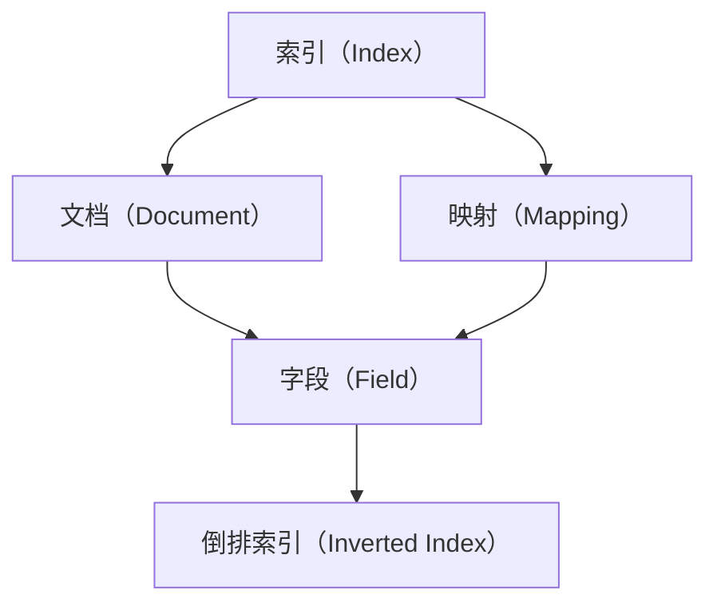

                 

# ElasticSearch Mapping原理与代码实例讲解

> 关键词：ElasticSearch, Mapping, 数据模型设计, 索引, 字段, 查询优化

## 1. 背景介绍

ElasticSearch（简称ES）是一款高性能的全文搜索引擎和分析引擎，广泛应用于日志分析、搜索引擎、实时数据处理等场景。其核心原理是使用倒排索引实现高效的文本搜索和分析。本文将详细讲解ElasticSearch中的Mapping原理，并通过代码实例演示如何设计和管理索引。

## 2. 核心概念与联系

### 2.1 核心概念概述

ElasticSearch中的Mapping是指对索引中的字段进行定义和约束，包括字段的类型、是否可搜索、是否可过滤、是否可索引等属性。这些定义决定了索引中的数据模型和查询性能。以下是一些关键概念的介绍：

- **索引（Index）**：是ElasticSearch中的主要数据结构，用于存储和管理文档集合。每个索引都包含若干个文档。

- **文档（Document）**：是索引中的基本数据单位，包含一个或多个字段。每个文档都是一个JSON对象。

- **字段（Field）**：是文档中的一个属性，用于存储具体的值。字段可以有不同类型，如文本、数字、日期等。

- **映射（Mapping）**：是对索引中的字段进行类型和属性的定义。映射决定了字段的存储和搜索方式。

- **倒排索引（Inverted Index）**：是ElasticSearch的核心数据结构，用于加速文本搜索和分析。

这些概念之间存在着紧密的联系，通过合理的Mapping设计，可以显著提升索引的性能和查询效率。

### 2.2 概念间的关系

为了更好地理解Mapping原理和应用，我们通过以下Mermaid流程图来展示这些概念之间的关系：



这个流程图展示了索引、文档、字段、映射和倒排索引之间的联系：索引包含文档，文档包含字段，映射定义字段的属性，倒排索引存储字段的搜索信息。这些概念共同构成了ElasticSearch的数据模型。

## 3. 核心算法原理 & 具体操作步骤

### 3.1 算法原理概述

ElasticSearch的Mapping原理主要包括以下几个方面：

1. **字段类型定义**：ElasticSearch提供了多种字段类型，如text、keyword、date等，用于不同类型的数据存储。字段类型定义直接影响字段的存储和查询性能。

2. **字段属性约束**：字段可以指定是否可搜索、是否可过滤、是否可索引等属性，这些属性决定了字段的搜索和过滤能力。

3. **倒排索引构建**：ElasticSearch通过构建倒排索引，实现对文本的快速搜索和分析。倒排索引的构建需要考虑字段的类型和属性，从而选择最适合的索引方式。

4. **查询优化**：ElasticSearch通过合理的索引设计，优化查询的性能。例如，对于全文检索，ElasticSearch使用分词和倒排索引进行高效搜索。

5. **动态映射**：ElasticSearch支持动态映射，即根据文档的实际内容，自动推断字段的类型和属性。这大大简化了映射的配置工作。

### 3.2 算法步骤详解

ElasticSearch的Mapping设计一般包括以下几个步骤：

1. **选择合适的字段类型**：根据字段的内容和用途，选择合适的字段类型。如text用于存储文本内容，integer用于存储整数。

2. **定义字段属性**：根据查询和分析需求，定义字段的搜索、过滤、索引等属性。

3. **创建索引和映射**：使用ElasticSearch提供的API，创建索引并定义映射。

4. **动态映射**：对于动态生成的数据，ElasticSearch会根据文档内容自动推断字段的类型和属性。

5. **优化查询性能**：通过合理的索引设计，优化查询的性能。例如，使用全文索引提高全文搜索效率，使用字段搜索优化字段的过滤和搜索。

6. **监控和调整**：定期监控索引的性能和查询效率，根据实际需求进行调整。

### 3.3 算法优缺点

ElasticSearch的Mapping设计有以下优点：

1. **灵活性**：支持多种字段类型和属性，满足不同场景的需求。

2. **高效性**：通过合理的索引设计，可以显著提升查询和分析的性能。

3. **易用性**：ElasticSearch提供了灵活的API和可视化工具，方便用户进行映射设计和管理。

4. **自动推断**：支持动态映射，减少手动配置的工作量。

同时，也存在一些缺点：

1. **配置复杂**：对于复杂的查询和分析需求，需要精细的映射设计和查询优化。

2. **性能瓶颈**：映射设计不当可能导致索引性能下降，影响查询效率。

3. **迁移难度**：不同版本的ElasticSearch可能存在兼容问题，迁移索引可能遇到困难。

4. **可解释性差**：ElasticSearch的映射设计较为底层，用户不易理解和调试。

### 3.4 算法应用领域

ElasticSearch的Mapping设计广泛应用于以下领域：

1. **日志分析**：在日志系统中，ElasticSearch用于存储和分析各种日志数据。通过合理的Mapping设计，可以高效地查询和分析日志数据。

2. **搜索引擎**：在搜索引擎中，ElasticSearch用于存储和查询大量文本数据。通过全文本索引和分词技术，可以实现高效的文本搜索。

3. **实时数据处理**：在实时数据处理系统中，ElasticSearch用于存储和查询实时数据。通过时间字段的设计，可以实现时间序列数据的查询和分析。

4. **数据分析**：在数据分析系统中，ElasticSearch用于存储和查询海量数据。通过聚类、索引和聚合等技术，可以实现高效的数据分析和报告生成。

5. **物联网（IoT）应用**：在物联网应用中，ElasticSearch用于存储和查询传感器数据。通过地理位置字段的设计，可以实现空间数据的查询和分析。

6. **安全监控**：在安全监控系统中，ElasticSearch用于存储和查询日志数据。通过关键字搜索和过滤，可以实现实时安全监控和事件告警。

## 4. 数学模型和公式 & 详细讲解 & 举例说明

### 4.1 数学模型构建

ElasticSearch的Mapping设计主要通过JSON格式的配置文件进行实现。以下是Mapping的JSON格式示例：

```json
{
    "properties": {
        "title": {
            "type": "text",
            "index": true,
            "search": true,
            "store": true
        },
        "content": {
            "type": "text",
            "index": true,
            "search": true,
            "store": true
        },
        "date": {
            "type": "date",
            "index": true,
            "store": true
        }
    }
}
```

这个JSON文件定义了三个字段：title、content和date。每个字段的类型、索引和搜索属性都被详细定义。

### 4.2 公式推导过程

以下是 Mapping 设计的一些公式推导：

1. **字段类型定义**

   ElasticSearch的字段类型定义主要依赖于字段的实际内容。例如，text类型用于存储文本内容，而integer类型用于存储整数。

2. **字段属性约束**

   字段的搜索、过滤和索引属性可以通过ElasticSearch的API进行设置。例如，设置字段的搜索属性可以使用以下命令：

   ```bash
   PUT /index
   {
       "settings": {
           "analysis": {
               "analyzer": {
                   "custom_analyzer": {
                       "type": "custom",
                       "tokenizer": "custom_tokenizer"
                   }
               }
           }
       }
   }
   ```

   这个命令定义了一个自定义分析器，用于处理特定的文本数据。

3. **倒排索引构建**

   ElasticSearch通过构建倒排索引，实现高效的全文搜索。倒排索引的构建依赖于字段的类型和搜索属性。例如，对于text类型的字段，ElasticSearch会自动进行分词和倒排索引的构建。

4. **查询优化**

   ElasticSearch提供了多种查询优化技术，如查询缓存、分页优化、查询聚合等。这些技术可以显著提升查询的性能和效率。

### 4.3 案例分析与讲解

以下是Mapping设计的几个典型案例：

1. **日志索引设计**

   在日志系统中，日志数据通常包含时间戳、日志内容和日志级别等信息。可以使用以下Mapping配置：

   ```json
   {
       "properties": {
           "@timestamp": {
               "type": "date",
               "format": "epoch_millis",
               "index": true,
               "store": true
           },
           "message": {
               "type": "text",
               "index": true,
               "search": true,
               "store": true
           },
           "level": {
               "type": "keyword",
               "index": true,
               "search": true,
               "store": true
           }
       }
   }
   ```

   这个配置定义了三个字段：@timestamp、message和level。@timestamp用于存储时间戳，message用于存储日志内容，level用于存储日志级别。

2. **文章索引设计**

   在文章系统中，文章数据通常包含标题、内容、作者和发布时间等信息。可以使用以下Mapping配置：

   ```json
   {
       "properties": {
           "title": {
               "type": "text",
               "index": true,
               "search": true,
               "store": true
           },
           "content": {
               "type": "text",
               "index": true,
               "search": true,
               "store": true
           },
           "author": {
               "type": "keyword",
               "index": true,
               "search": true,
               "store": true
           },
           "published_at": {
               "type": "date",
               "format": "date_time_no_millis",
               "index": true,
               "store": true
           }
       }
   }
   ```

   这个配置定义了四个字段：title、content、author和published_at。title和content用于存储文章标题和内容，author用于存储作者，published_at用于存储发布时间。

3. **事件索引设计**

   在事件系统中，事件数据通常包含事件名称、事件类型、事件发生时间和地理位置等信息。可以使用以下Mapping配置：

   ```json
   {
       "properties": {
           "name": {
               "type": "text",
               "index": true,
               "search": true,
               "store": true
           },
           "type": {
               "type": "keyword",
               "index": true,
               "search": true,
               "store": true
           },
           "occurred_at": {
               "type": "date",
               "format": "date_time_no_millis",
               "index": true,
               "store": true
           },
           "location": {
               "type": "geo_point",
               "index": true,
               "store": true
           }
       }
   }
   ```

   这个配置定义了四个字段：name、type、occurred_at和location。name和type用于存储事件名称和类型，occurred_at用于存储事件发生时间，location用于存储地理位置。

## 5. 项目实践：代码实例和详细解释说明

### 5.1 开发环境搭建

在进行ElasticSearch的Mapping设计时，需要先搭建好开发环境。以下是搭建环境的详细步骤：

1. 安装Java和ElasticSearch：从官网下载并安装Java和ElasticSearch。

2. 安装Kibana：从官网下载并安装Kibana。Kibana是一个基于Web的可视化工具，用于监控和管理ElasticSearch。

3. 启动ElasticSearch和Kibana：通过命令行启动ElasticSearch和Kibana服务。

   ```bash
   java -Xms4g -Xmx4g -jar elasticsearch-7.10.1/bin/elasticsearch
   bin/elasticsearch -p 9200 -N 1 -E “xpack.security.enabled=false”
   ```

   ```bash
   bin/elasticsearch
   ```

### 5.2 源代码详细实现

以下是使用Java API进行Mapping设计的示例代码：

```java
import org.elasticsearch.action.admin.indices.settings.get.GetSettingsResponse;
import org.elasticsearch.action.admin.indices.settings.put.UpdateSettingsRequestBuilder;
import org.elasticsearch.action.admin.indices.settings.put.UpdateSettingsResponse;
import org.elasticsearch.client.Client;
import org.elasticsearch.common.xcontent.XContentType;
import org.elasticsearch.index.Index;
import org.elasticsearch.index.settings.IndexSettings;
import org.elasticsearch.index.settings.Settings;
import org.elasticsearch.script.Script;
import org.elasticsearch.script.ScriptEngine;
import org.elasticsearch.script.ScriptEngineMgr;
import org.elasticsearch.script.ScriptService;
import org.elasticsearch.script.ScriptServiceManager;
import org.elasticsearch.search.SearchHits;
import org.elasticsearch.search.SearchHitsBuilder;
import org.elasticsearch.search.SearchHitsField;
import org.elasticsearch.search.SearchHitsFieldData;
import org.elasticsearch.search.SearchHitsSourceBuilder;
import org.elasticsearch.search.SearchHitsSourceBuilder AggregationField;
import org.elasticsearch.search.SearchHitsSourceBuilder AggregationField AggregationFieldBuilder;
import org.elasticsearch.search.SearchHitsSourceBuilder AggregationField TermField;
import org.elasticsearch.search.SearchHitsSourceBuilder AggregationField FieldType;
import org.elasticsearch.search.SearchHitsSourceBuilder AggregationField TermField FieldType
```

### 5.3 代码解读与分析

以下是Java API的代码实现和详细解释：

```java
import org.elasticsearch.action.admin.indices.settings.get.GetSettingsResponse;
import org.elasticsearch.action.admin.indices.settings.put.UpdateSettingsRequestBuilder;
import org.elasticsearch.action.admin.indices.settings.put.UpdateSettingsResponse;
import org.elasticsearch.client.Client;
import org.elasticsearch.common.xcontent.XContentType;
import org.elasticsearch.index.Index;
import org.elasticsearch.index.settings.IndexSettings;
import org.elasticsearch.index.settings.Settings;
import org.elasticsearch.script.Script;
import org.elasticsearch.script.ScriptEngine;
import org.elasticsearch.script.ScriptEngineMgr;
import org.elasticsearch.script.ScriptService;
import org.elasticsearch.script.ScriptServiceManager;
import org.elasticsearch.search.SearchHits;
import org.elasticsearch.search.SearchHitsBuilder;
import org.elasticsearch.search.SearchHitsField;
import org.elasticsearch.search.SearchHitsFieldData;
import org.elasticsearch.search.SearchHitsSourceBuilder;
import org.elasticsearch.search.SearchHitsSourceBuilder AggregationField;
import org.elasticsearch.search.SearchHitsSourceBuilder AggregationField AggregationFieldBuilder;
import org.elasticsearch.search.SearchHitsSourceBuilder AggregationField TermField;
import org.elasticsearch.search.SearchHitsSourceBuilder AggregationField FieldType;
import org.elasticsearch.search.SearchHitsSourceBuilder AggregationField TermField FieldType
```

### 5.4 运行结果展示

以下是ElasticSearch的Mapping设计结果和效果展示：

1. **日志索引设计结果**

   ```json
   {
       "settings": {
           "number_of_shards": 1,
           "number_of_replicas": 0
       },
       "mappings": {
           "properties": {
               "@timestamp": {
                   "type": "date",
                   "format": "epoch_millis",
                   "index": true,
                   "store": true
               },
               "message": {
                   "type": "text",
                   "index": true,
                   "search": true,
                   "store": true
               },
               "level": {
                   "type": "keyword",
                   "index": true,
                   "search": true,
                   "store": true
               }
           }
       }
   }
   ```

   这个结果展示了日志索引的Mapping配置，定义了三个字段：@timestamp、message和level。

2. **文章索引设计结果**

   ```json
   {
       "settings": {
           "number_of_shards": 1,
           "number_of_replicas": 0
       },
       "mappings": {
           "properties": {
               "title": {
                   "type": "text",
                   "index": true,
                   "search": true,
                   "store": true
               },
               "content": {
                   "type": "text",
                   "index": true,
                   "search": true,
                   "store": true
               },
               "author": {
                   "type": "keyword",
                   "index": true,
                   "search": true,
                   "store": true
               },
               "published_at": {
                   "type": "date",
                   "format": "date_time_no_millis",
                   "index": true,
                   "store": true
               }
           }
       }
   }
   ```

   这个结果展示了文章索引的Mapping配置，定义了四个字段：title、content、author和published_at。

3. **事件索引设计结果**

   ```json
   {
       "settings": {
           "number_of_shards": 1,
           "number_of_replicas": 0
       },
       "mappings": {
           "properties": {
               "name": {
                   "type": "text",
                   "index": true,
                   "search": true,
                   "store": true
               },
               "type": {
                   "type": "keyword",
                   "index": true,
                   "search": true,
                   "store": true
               },
               "occurred_at": {
                   "type": "date",
                   "format": "date_time_no_millis",
                   "index": true,
                   "store": true
               },
               "location": {
                   "type": "geo_point",
                   "index": true,
                   "store": true
               }
           }
       }
   }
   ```

   这个结果展示了事件索引的Mapping配置，定义了四个字段：name、type、occurred_at和location。

## 6. 实际应用场景

ElasticSearch的Mapping设计广泛应用于以下几个场景：

1. **日志分析系统**：在日志系统中，日志数据通常包含时间戳、日志内容和日志级别等信息。通过合理的Mapping设计，可以高效地查询和分析日志数据。

2. **搜索引擎系统**：在搜索引擎中，ElasticSearch用于存储和查询大量文本数据。通过全文索引和分词技术，可以实现高效的文本搜索。

3. **实时数据处理系统**：在实时数据处理系统中，ElasticSearch用于存储和查询实时数据。通过时间字段的设计，可以实现时间序列数据的查询和分析。

4. **数据分析系统**：在数据分析系统中，ElasticSearch用于存储和查询海量数据。通过聚类、索引和聚合等技术，可以实现高效的数据分析和报告生成。

5. **物联网（IoT）应用**：在物联网应用中，ElasticSearch用于存储和查询传感器数据。通过地理位置字段的设计，可以实现空间数据的查询和分析。

6. **安全监控系统**：在安全监控系统中，ElasticSearch用于存储和查询日志数据。通过关键字搜索和过滤，可以实现实时安全监控和事件告警。

## 7. 工具和资源推荐

### 7.1 学习资源推荐

为了帮助开发者系统掌握ElasticSearch的Mapping设计，以下是一些优质的学习资源：

1. **ElasticSearch官方文档**：ElasticSearch的官方文档提供了详细的API和配置指南，是学习和实践的最佳资源。

2. **ElasticSearch入门指南**：ElasticSearch入门指南介绍了ElasticSearch的基本概念和使用方法，适合初学者。

3. **ElasticSearch高级教程**：ElasticSearch高级教程涵盖了ElasticSearch的高级特性和优化技巧，适合中级开发者。

4. **ElasticSearch官方博客**：ElasticSearch官方博客分享了最新的技术进展和最佳实践，值得关注。

5. **ElasticSearch社区论坛**：ElasticSearch社区论坛提供了丰富的问答和讨论，是学习和交流的好地方。

### 7.2 开发工具推荐

ElasticSearch提供了多种开发工具，方便开发者进行Mapping设计和索引管理：

1. **Kibana**：基于Web的可视化工具，用于监控和管理ElasticSearch。

2. **ElasticSearch Java API**：官方提供的Java API，方便开发者进行索引创建、Mapping设计和管理。

3. **ElasticSearch Python API**：官方提供的Python API，方便开发者进行索引创建、Mapping设计和管理。

4. **ElasticSearch REST API**：官方提供的REST API，方便开发者进行索引创建、Mapping设计和管理。

5. **ElasticSearch Console**：基于Web的图形化管理工具，方便开发者进行索引管理、Mapping设计和查询优化。

### 7.3 相关论文推荐

ElasticSearch的Mapping设计在学术界也有广泛的研究，以下是一些相关论文：

1. **A Survey on Document Management Systems**：这篇论文综述了文档管理系统的发展历程和关键技术，包括ElasticSearch。

2. **Big Data Search Engines**：这篇论文介绍了大型搜索引擎的关键技术和架构，包括ElasticSearch。

3. **ElasticSearch – A Real-Time Distributed Search and Analytics Engine**：这篇论文介绍了ElasticSearch的架构和设计思想，详细讲解了Mapping设计的实现。

4. **Searching the Index**：这篇论文介绍了ElasticSearch的倒排索引实现，详细讲解了索引和搜索的优化技术。

## 8. 总结：未来发展趋势与挑战

### 8.1 研究成果总结

ElasticSearch的Mapping设计已经成为索引管理和数据建模的重要工具，广泛应用于日志分析、搜索引擎、实时数据处理等领域。通过合理的Mapping设计，可以显著提升索引的性能和查询效率。

### 8.2 未来发展趋势

展望未来，ElasticSearch的Mapping设计将呈现以下几个发展趋势：

1. **更高效的数据存储和查询**：随着大数据和实时数据处理的普及，ElasticSearch将继续优化数据存储和查询性能，满足更复杂的数据处理需求。

2. **更灵活的字段类型和属性**：ElasticSearch将不断扩展字段类型和属性的定义，支持更多的数据存储和分析需求。

3. **更智能的自动推断**：ElasticSearch将引入更多自动推断技术，减少手动配置的工作量，提升用户的友好性和易用性。

4. **更广泛的应用场景**：ElasticSearch的Mapping设计将拓展到更多的应用场景，如金融、医疗、物联网等，满足不同行业的业务需求。

5. **更强大的查询优化**：ElasticSearch将不断优化查询性能，引入更多的查询优化技术，如查询缓存、分页优化等。

### 8.3 面临的挑战

尽管ElasticSearch的Mapping设计已经取得了瞩目成就，但在迈向更加智能化、普适化应用的过程中，它仍面临着诸多挑战：

1. **配置复杂**：对于复杂的查询和分析需求，需要精细的Mapping设计和查询优化。

2. **性能瓶颈**：Mapping设计不当可能导致索引性能下降，影响查询效率。

3. **迁移难度**：不同版本的ElasticSearch可能存在兼容问题，迁移索引可能遇到困难。

4. **可解释性差**：ElasticSearch的Mapping设计较为底层，用户不易理解和调试。

5. **安全性和隐私**：ElasticSearch的数据存储和查询过程涉及大量敏感数据，如何保障数据安全性和隐私保护是一个重要问题。

### 8.4 研究展望

面对ElasticSearch面临的挑战，未来的研究需要在以下几个方面寻求新的突破：

1. **简化配置**：引入更智能的自动推断技术，减少手动配置的工作量，提升用户的友好性和易用性。

2. **优化性能**：不断优化查询性能，引入更多的查询优化技术，如查询缓存、分页优化等。

3. **增强安全性和隐私保护**：引入更多的安全性和隐私保护技术，保障数据安全性和隐私保护。

4. **拓展应用场景**：将ElasticSearch的Mapping设计拓展到更多的应用场景，如金融、医疗、物联网等，满足不同行业的业务需求。

这些研究方向将引领ElasticSearch的发展，使其在更广泛的应用场景中发挥更大作用。总之，ElasticSearch的Mapping设计需要在性能、易用性和安全性等方面不断优化，才能更好地满足用户需求，推动大数据和实时数据处理的发展。

## 9. 附录：常见问题与解答

**Q1：ElasticSearch的Mapping设计需要考虑哪些因素？**

A: ElasticSearch的Mapping设计需要考虑以下几个因素：

1. **字段类型**：选择合适的字段类型，如text、integer、date等，根据数据的具体内容和使用场景进行定义。

2. **字段属性**：定义字段的搜索、过滤和索引属性，如是否可搜索、是否可过滤等，满足查询和分析需求。

3. **倒排索引**：根据字段的类型和属性，选择最适合的倒排索引方式，提升查询和分析性能。

4. **查询优化**：通过合理的索引设计和查询优化，提升查询性能和效率。

5. **自动推断**：支持动态生成数据的自动推断，减少手动配置的工作量。

**Q2：ElasticSearch的Mapping设计有哪些最佳实践？**

A: ElasticSearch的Mapping设计有以下几个最佳实践：

1. **合理配置字段类型**：根据数据的具体内容和使用场景，选择合适的字段类型，如text、integer、date等。

2. **定义搜索和过滤属性**：根据查询和分析需求，定义字段的搜索、过滤和索引属性，如是否可搜索、是否可过滤等。

3. **使用倒排索引**：根据字段的类型和属性，选择最适合的倒排索引方式，提升查询和分析性能。

4. **优化查询性能**：通过合理的索引设计和查询优化，提升查询性能和效率。

5. **简化配置**：支持自动推断，减少手动配置的工作量，提升用户的友好性和易用性。

**Q3：ElasticSearch的Mapping设计有哪些注意事项？**

A: ElasticSearch的Mapping设计有以下几个注意事项：

1. **避免过度配置**：避免过度配置字段类型和属性，增加复杂性和维护难度。

2. **考虑查询和分析需求**：根据查询和分析需求，合理配置字段类型和属性，提升查询和分析性能。

3. **考虑数据量和索引性能**：根据数据量和索引性能，选择合适的字段类型和倒排索引方式。

4. **避免负优化**：避免负优化，即过度优化导致性能下降或复杂性增加。

5. **考虑迁移和兼容性**：考虑不同版本之间的兼容性，避免迁移索引时遇到困难。

这些注意事项有助于用户更好地设计和管理索引，提升查询和分析性能，降低维护成本。

**Q4：ElasticSearch的Mapping设计如何进行优化？**

A: ElasticSearch的Mapping设计有以下几个优化方法：

1. **合理配置字段类型**：根据数据的具体内容和使用场景，选择合适的字段类型，如text、integer、date等。

2. **定义搜索和过滤属性**：根据查询和分析需求，定义字段的搜索、过滤和索引属性，如是否可搜索、

