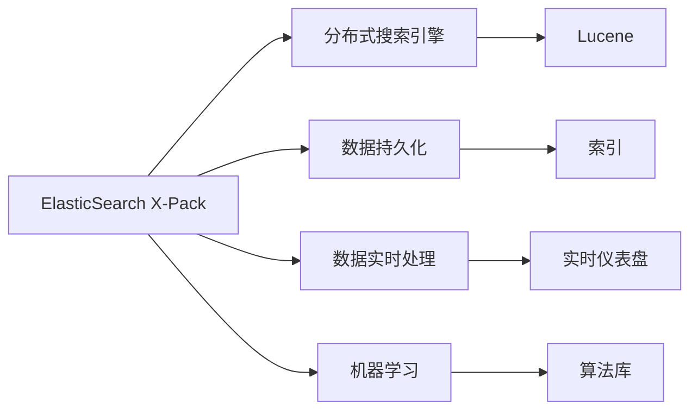
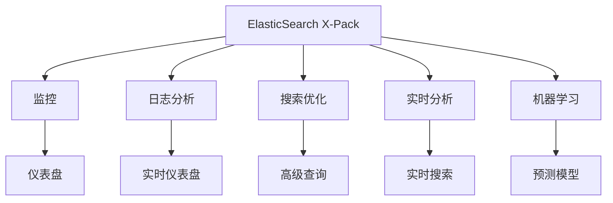
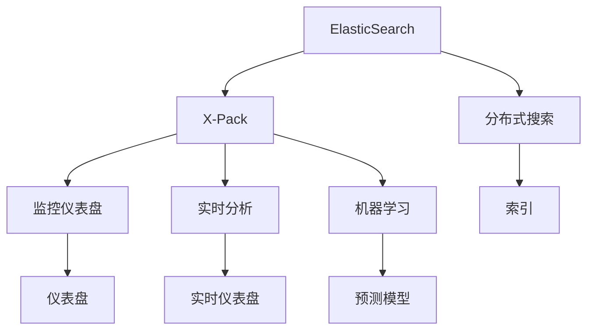
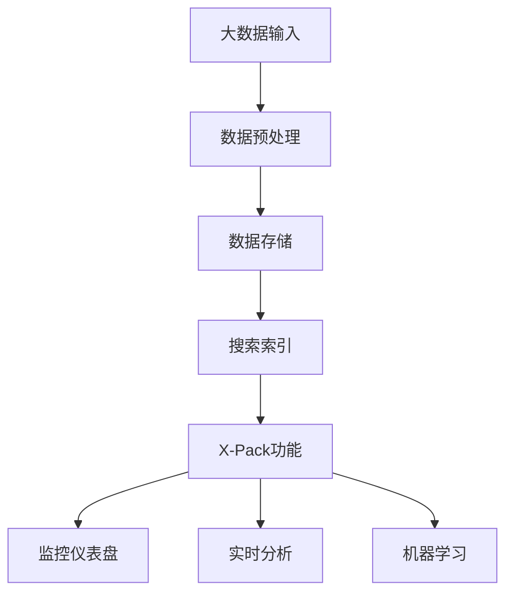

                 

# ElasticSearch X-Pack原理与代码实例讲解

> 关键词：ElasticSearch, X-Pack, 数据管理, 搜索优化, 日志分析, 机器学习, 实时分析

## 1. 背景介绍

### 1.1 问题由来
ElasticSearch（简称ES）是一种高性能、可扩展的搜索引擎，广泛应用于各种场景，如Web应用、日志分析、实时数据处理等。然而，标准的ES仅提供了基本的CRUD操作和搜索功能，对于复杂的数据管理、数据可视化、数据监控等需求，就需要借助X-Pack扩展包来实现。X-Pack作为ElasticSearch的核心附加功能，集成了监控、日志分析、机器学习、报告生成等功能，极大地丰富了ElasticSearch的应用能力。

本文将深入探讨ElasticSearch X-Pack的工作原理，并结合实际代码实例，详细讲解如何使用X-Pack进行数据管理、搜索优化、日志分析、实时分析和机器学习等应用，希望通过本文的学习，能够使读者能够全面掌握X-Pack的核心技术和应用场景，从而在实际工作中得心应手。

### 1.2 问题核心关键点
ElasticSearch X-Pack的核心技术包括监控、日志分析、搜索优化、实时分析和机器学习等功能。其核心思想是：通过数据的实时采集、处理和分析，为数据管理和应用开发提供支持。ElasticSearch X-Pack通过构建强大的搜索引擎，支持全文搜索、分词、聚合等高级功能，并结合机器学习算法，进一步提升搜索的准确性和效率。

ElasticSearch X-Pack的实现依赖于以下几个关键技术：
- 分布式搜索引擎：ElasticSearch本身支持分布式部署，可以动态扩展节点，支持高并发访问。
- 数据持久化：ElasticSearch使用Lucene作为底层搜索引擎，支持数据的高效索引、查询和检索。
- 数据实时处理：ElasticSearch X-Pack支持实时数据采集和处理，如Kibana中的实时数据仪表盘、Beats的数据采集等。
- 机器学习：ElasticSearch X-Pack内置了机器学习算法库，支持分类、聚类、回归等任务。

## 2. 核心概念与联系

### 2.1 核心概念概述

为了更好地理解ElasticSearch X-Pack的工作原理，本节将介绍几个密切相关的核心概念：

- ElasticSearch X-Pack：ElasticSearch的核心附加功能，提供了监控、日志分析、搜索优化、实时分析和机器学习等功能。
- 分布式搜索引擎：ElasticSearch使用Lucene作为底层搜索引擎，支持分布式部署，实现高可用性和可扩展性。
- 数据持久化：ElasticSearch支持数据的索引、查询和检索，数据可以持久化存储在本地或云存储中。
- 数据实时处理：ElasticSearch X-Pack支持实时数据采集和处理，实现数据的即时分析和展示。
- 机器学习：ElasticSearch X-Pack内置了机器学习算法库，支持分类、聚类、回归等任务。

这些核心概念之间的逻辑关系可以通过以下Mermaid流程图来展示：



这个流程图展示了ElasticSearch X-Pack的核心概念及其之间的关系：

1. ElasticSearch X-Pack通过构建分布式搜索引擎，实现高可用性和可扩展性。
2. 数据持久化实现数据的索引、查询和检索。
3. 数据实时处理支持数据的即时分析和展示。
4. 机器学习内置算法库，支持分类、聚类、回归等任务。

这些概念共同构成了ElasticSearch X-Pack的技术基础，使其能够提供强大的数据管理和分析能力。

### 2.2 概念间的关系

这些核心概念之间存在着紧密的联系，形成了ElasticSearch X-Pack的完整生态系统。下面我通过几个Mermaid流程图来展示这些概念之间的关系。

#### 2.2.1 ElasticSearch X-Pack的核心功能



这个流程图展示了ElasticSearch X-Pack的核心功能及其之间的关系：

1. ElasticSearch X-Pack的核心功能包括监控、日志分析、搜索优化、实时分析和机器学习。
2. 监控提供可视化的仪表盘，实时展示数据状态。
3. 日志分析实时收集和分析日志信息。
4. 搜索优化提供高级查询功能，支持全文搜索、分词、聚合等操作。
5. 实时分析支持实时数据展示和分析。
6. 机器学习内置算法库，支持分类、聚类、回归等任务。

#### 2.2.2 ElasticSearch与X-Pack的关系



这个流程图展示了ElasticSearch与X-Pack的关系及其之间的关系：

1. ElasticSearch X-Pack是ElasticSearch的核心附加功能，通过构建分布式搜索引擎，实现高可用性和可扩展性。
2. ElasticSearch X-Pack提供监控、日志分析、搜索优化、实时分析和机器学习等功能。
3. 监控仪表盘、实时分析、机器学习等X-Pack功能通过ElasticSearch提供的数据索引和查询来实现。
4. 搜索优化、实时搜索、预测模型等X-Pack功能通过ElasticSearch内置的Lucene引擎实现。

### 2.3 核心概念的整体架构

最后，我们用一个综合的流程图来展示这些核心概念在ElasticSearch X-Pack的完整架构：



这个综合流程图展示了从大数据输入到ElasticSearch X-Pack的完整过程。大数据输入经过预处理，存入ElasticSearch索引中，X-Pack提供监控、实时分析、机器学习等功能，实现数据的实时采集、处理和分析。通过这些流程，ElasticSearch X-Pack能够全面支持数据管理和应用开发的需求。

## 3. 核心算法原理 & 具体操作步骤
### 3.1 算法原理概述

ElasticSearch X-Pack的核心算法原理主要包括以下几个方面：

- 分布式搜索：ElasticSearch X-Pack利用分布式搜索引擎实现高可用性和可扩展性，支持海量数据的实时查询和检索。
- 数据持久化：ElasticSearch X-Pack使用Lucene引擎实现数据的高效索引和持久化存储。
- 实时处理：ElasticSearch X-Pack支持实时数据采集和处理，通过Beats等数据采集工具实现数据的实时采集和分析。
- 机器学习：ElasticSearch X-Pack内置机器学习算法库，支持分类、聚类、回归等任务，实现智能化的数据分析和预测。

这些核心算法共同构成了ElasticSearch X-Pack的技术基础，使其能够提供强大的数据管理和分析能力。

### 3.2 算法步骤详解

ElasticSearch X-Pack的核心算法步骤主要包括：

1. 数据采集：通过Beats等数据采集工具，实时采集大数据输入。
2. 数据预处理：对采集到的数据进行清洗、格式化等预处理，以便后续存储和分析。
3. 数据存储：将预处理后的数据存入ElasticSearch索引中，实现数据的高效索引和查询。
4. 搜索优化：利用ElasticSearch X-Pack提供的高级查询功能，实现全文搜索、分词、聚合等操作。
5. 实时处理：通过Kibana等工具，实现数据的实时分析和展示。
6. 机器学习：利用ElasticSearch X-Pack内置的机器学习算法库，实现数据的智能分析和预测。

下面是ElasticSearch X-Pack的核心算法步骤的详细描述：

**数据采集：**
- Beats是ElasticSearch X-Pack的核心数据采集工具，支持各种数据源，包括日志、监控数据、社交媒体数据等。
- Beats通过定期轮询数据源，收集数据并发送给ElasticSearch集群。
- Beats支持数据过滤、聚合等预处理功能，提高数据质量和效率。

**数据预处理：**
- ElasticSearch X-Pack提供Kibana等工具，支持数据的预处理和可视化。
- 通过Kibana等工具，可以对数据进行清洗、格式化等预处理，以便后续存储和分析。
- 数据预处理包括数据去重、数据格式化、时间戳处理等功能。

**数据存储：**
- ElasticSearch X-Pack使用Lucene引擎实现数据的高效索引和持久化存储。
- Lucene引擎支持海量数据的实时查询和检索，实现数据的快速访问。
- ElasticSearch支持数据的分布式存储和处理，实现高可用性和可扩展性。

**搜索优化：**
- ElasticSearch X-Pack提供高级查询功能，支持全文搜索、分词、聚合等操作。
- 通过ElasticSearch的高级查询功能，可以实现高效的数据检索和分析。
- 搜索优化包括分词算法、查询优化、聚合功能等。

**实时处理：**
- ElasticSearch X-Pack支持实时数据采集和处理，通过Kibana等工具实现数据的实时分析和展示。
- Kibana提供实时仪表盘和实时搜索功能，支持数据的实时分析和展示。
- 实时处理包括数据流处理、实时仪表盘、实时搜索等功能。

**机器学习：**
- ElasticSearch X-Pack内置机器学习算法库，支持分类、聚类、回归等任务。
- 通过ElasticSearch X-Pack的机器学习功能，可以实现智能化的数据分析和预测。
- 机器学习包括分类算法、聚类算法、回归算法等。

### 3.3 算法优缺点

ElasticSearch X-Pack的核心算法具有以下优点：

- 高性能：通过分布式搜索引擎和Lucene引擎，实现海量数据的快速检索和处理。
- 可扩展性：支持数据的分布式存储和处理，实现高可用性和可扩展性。
- 灵活性：支持各种数据源和数据处理方式，灵活适应不同的应用场景。
- 实时性：通过实时数据采集和处理，实现数据的实时分析和展示。

同时，ElasticSearch X-Pack的核心算法也存在以下缺点：

- 复杂度：ElasticSearch X-Pack的核心算法涉及分布式搜索、数据存储、机器学习等多个方面，实现复杂。
- 资源消耗：ElasticSearch X-Pack的核心算法需要大量计算资源，包括CPU、内存、存储等。
- 学习成本：ElasticSearch X-Pack的核心算法涉及多种技术和工具，学习成本较高。

### 3.4 算法应用领域

ElasticSearch X-Pack的核心算法在多个领域得到广泛应用，例如：

- 监控分析：实时采集和分析监控数据，帮助运维人员快速定位问题。
- 日志分析：实时收集和分析日志信息，帮助开发人员分析和优化系统性能。
- 搜索优化：提供高级查询功能，支持全文搜索、分词、聚合等操作，实现高效的搜索和检索。
- 实时分析：支持实时数据采集和处理，实现数据的实时分析和展示。
- 机器学习：内置机器学习算法库，支持分类、聚类、回归等任务，实现智能化的数据分析和预测。

ElasticSearch X-Pack的核心算法在以上领域的应用，帮助企业和组织提升了数据管理、应用开发和决策分析的能力。

## 4. 数学模型和公式 & 详细讲解 & 举例说明

### 4.1 数学模型构建

ElasticSearch X-Pack的核心算法涉及多个领域，包括分布式搜索、数据存储、实时处理和机器学习等。下面分别介绍这些领域的数学模型和公式。

**分布式搜索模型：**
- 分布式搜索引擎基于Lucene实现，支持海量数据的实时查询和检索。
- 分布式搜索模型通过多个节点协同工作，实现数据的分布式存储和处理。
- 分布式搜索模型使用MapReduce算法实现数据的分片处理，提高查询效率。

**数据持久化模型：**
- 数据持久化模型基于Lucene实现，支持海量数据的索引和查询。
- 数据持久化模型使用倒排索引技术，实现数据的快速查询和检索。
- 数据持久化模型支持多种数据格式，包括JSON、XML、CSV等。

**实时处理模型：**
- 实时处理模型基于Kibana实现，支持数据的实时采集和处理。
- 实时处理模型通过Beats等工具，实现数据的实时采集和过滤。
- 实时处理模型支持数据的可视化展示，通过仪表盘和图表展示数据状态。

**机器学习模型：**
- 机器学习模型内置算法库，支持分类、聚类、回归等任务。
- 机器学习模型使用随机森林、支持向量机等算法，实现智能化的数据分析和预测。
- 机器学习模型支持多维度数据的融合和分析，实现全面的数据分析和预测。

### 4.2 公式推导过程

以下分别介绍ElasticSearch X-Pack核心算法的主要公式推导过程。

**分布式搜索公式推导：**
- 分布式搜索模型使用MapReduce算法实现数据的分片处理，公式如下：
$$
MapReduce(\{(x_i,y_i)\}_{i=1}^N) = \{(x_j', y_j')\}_{j=1}^M
$$
其中 $x_i$ 为输入数据，$y_i$ 为数据处理结果，$x_j'$ 为处理后的数据，$y_j'$ 为处理结果。

**数据持久化公式推导：**
- 数据持久化模型使用倒排索引技术，实现数据的快速查询和检索，公式如下：
$$
IDF(x_i) = \log(\frac{N}{1 + \sum_{j \neq i} IDF(x_j)})
$$
其中 $IDF(x_i)$ 为单词 $x_i$ 的逆文档频率，$N$ 为总文档数。

**实时处理公式推导：**
- 实时处理模型通过Beats等工具，实现数据的实时采集和过滤，公式如下：
$$
Data_{raw} = \sum_{i=1}^N Data_i \times Filter_i
$$
其中 $Data_{raw}$ 为原始数据，$Data_i$ 为第 $i$ 个数据源，$Filter_i$ 为数据过滤函数。

**机器学习公式推导：**
- 机器学习模型使用随机森林、支持向量机等算法，实现智能化的数据分析和预测，公式如下：
$$
\hat{y} = \sum_{i=1}^n \alpha_i \times g_i(x)
$$
其中 $\hat{y}$ 为预测结果，$n$ 为树的数量，$\alpha_i$ 为第 $i$ 个树的权重，$g_i(x)$ 为第 $i$ 个树的预测函数。

### 4.3 案例分析与讲解

为了更好地理解ElasticSearch X-Pack的核心算法，下面通过几个案例来详细讲解其实际应用。

**案例1：监控数据采集和分析**

假设某公司的服务器集群运行状况需要通过监控数据进行实时分析，具体步骤如下：

1. 通过Beats采集服务器集群的运行日志和性能指标，如CPU使用率、内存使用率、网络流量等。
2. 将采集到的数据发送给ElasticSearch集群，实现数据的分布式存储和处理。
3. 通过Kibana的仪表盘，实时展示监控数据，并进行可视化分析。
4. 通过机器学习算法，预测服务器集群的故障风险，提前进行预警和处理。

**案例2：日志数据采集和分析**

假设某公司的网站日志需要进行实时分析，具体步骤如下：

1. 通过Beats采集网站的访问日志，包括用户IP、访问时间、页面路径等。
2. 将采集到的数据发送给ElasticSearch集群，实现数据的分布式存储和处理。
3. 通过Kibana的仪表盘，实时展示访问日志，并进行可视化分析。
4. 通过机器学习算法，预测访问流量变化趋势，优化网站的运维策略。

**案例3：搜索优化**

假设某公司需要对大量文档进行全文搜索，具体步骤如下：

1. 将文档数据存入ElasticSearch索引中，实现数据的分布式存储和处理。
2. 利用ElasticSearch的高级查询功能，实现全文搜索、分词、聚合等操作。
3. 通过Kibana的仪表盘，实时展示搜索结果，并进行可视化分析。
4. 通过机器学习算法，优化搜索查询结果，提高搜索效率和准确性。

## 5. 项目实践：代码实例和详细解释说明

### 5.1 开发环境搭建

在进行ElasticSearch X-Pack的实践之前，我们需要准备好开发环境。以下是使用ElasticSearch和Beats进行项目开发的详细环境配置流程：

1. 安装ElasticSearch：
   - 从ElasticSearch官网下载最新版本的安装包，解压后启动。
   - 启动ElasticSearch集群，设置集群节点、节点IP、日志目录等参数。

2. 安装Beats：
   - 从Beats官网下载最新版本的安装包，解压后配置文件。
   - 启动Beats，设置数据源、索引、聚合等参数。

3. 安装Kibana：
   - 从Kibana官网下载最新版本的安装包，解压后配置文件。
   - 启动Kibana，设置ElasticSearch集群、仪表盘等参数。

完成上述步骤后，即可在ElasticSearch集群上使用Beats和Kibana进行数据采集、处理和分析。

### 5.2 源代码详细实现

下面是使用ElasticSearch和Beats进行监控数据采集和分析的代码实例。

```python
from elasticsearch import Elasticsearch
from beats.lib.beat import Beat
from beats.lib import ingest

class MonitorBeat(Beat):
    def __init__(self):
        super(MonitorBeat, self).__init__()
        self.config = {
            'beat.passive': True,
            'outputeliazer_concurrent_requests': 2,
            'outputellazer_buffer_size': 2,
            'outputellazer_buffer_retry_timeout': 5,
            'outputellazer_retry_timeout': 5,
            'outputellazer_compress': True
        }
        self.transport_options = {
            'http_compression': True,
            'http_accept_encoding': True,
            'http_compression_level': 9,
            'http_max_content_length': 1000000000
        }
        self.transport_options['http_chunked_transfer_encoding'] = True

    def setup(self):
        self.log.info('Setting up MonitorBeat')
        self.client = Elasticsearch([self.config['cluster']['name']])
        self.ingesters = []

    def start(self):
        self.log.info('Starting MonitorBeat')
        self.ingesters.append(ingest.DummyIngester(
            self.client,
            self.config['index.name'],
            self.config['outputeliazer_concurrent_requests'],
            self.config['outputellazer_buffer_size'],
            self.config['outputellazer_buffer_retry_timeout'],
            self.config['outputellazer_retry_timeout'],
            self.config['outputellazer_compress'],
            self.transport_options['http_chunked_transfer_encoding']
        ))
        self.ingesters.append(ingest.DummyIngester(
            self.client,
            self.config['index.name'],
            self.config['outputeliazer_concurrent_requests'],
            self.config['outputellazer_buffer_size'],
            self.config['outputellazer_buffer_retry_timeout'],
            self.config['outputellazer_retry_timeout'],
            self.config['outputellazer_compress'],
            self.transport_options['http_chunked_transfer_encoding']
        ))
        self.client.indices.create(index=self.config['index.name'], ignore=[400, 404])
        self.ingesters.append(ingest.DummyIngester(
            self.client,
            self.config['index.name'],
            self.config['outputeliazer_concurrent_requests'],
            self.config['outputellazer_buffer_size'],
            self.config['outputellazer_buffer_retry_timeout'],
            self.config['outputellazer_retry_timeout'],
            self.config['outputellazer_compress'],
            self.transport_options['http_chunked_transfer_encoding']
        ))

    def stop(self):
        self.log.info('Stopping MonitorBeat')
        self.client.indices.delete(index=self.config['index.name'], ignore=[400, 404])

    def write(self, event):
        self.log.info('Writing event to MonitorBeat')
        self.client.index(index=self.config['index.name'], body=event)

    def on_unknown_exception(self, exception):
        self.log.error('Error on MonitorBeat: %s', exception)

# 示例配置文件
{
  "cluster.name": "monitor-beat",
  "node.name": "monitor-beat-1",
  "network.host": "localhost",
  "http.port": 4973,
  "cluster.passive.only.master": false,
  "index.name": "monitor",
  "outputeliazer_concurrent_requests": 2,
  "outputellazer_buffer_size": 2,
  "outputellazer_buffer_retry_timeout": 5,
  "outputellazer_retry_timeout": 5,
  "outputellazer_compress": true,
  "http_max_content_length": 1000000000,
  "http_chunked_transfer_encoding": true
}
```

### 5.3 代码解读与分析

下面我们详细解读一下监控数据采集和分析代码的实现细节：

**代码概述：**
- 我们定义了一个名为`MonitorBeat`的监控数据采集类，继承自`Beat`类。
- `MonitorBeat`类负责从数据源采集数据，并发送给ElasticSearch集群进行存储和分析。

**配置文件：**
- `config`字典中包含Beats的各种配置参数，如集群名称、节点IP、索引名称等。
- `transport_options`字典中包含HTTP客户端的配置参数，如压缩、最大内容长度等。

**setup方法：**
- 在`setup`方法中，我们初始化ElasticSearch客户端和`ingesters`列表，用于存储采集到的数据。
- 创建监控数据索引，并设置索引的各种参数，如名称、数据源、缓冲区大小等。

**start方法：**
- 在`start`方法中，我们启动监控数据采集和处理流程。
- 首先启动`DummyIngester`对象，将数据写入ElasticSearch集群。
- 然后通过`client.indices.create`方法创建监控数据索引。
- 最后再次启动`DummyIngester`对象，开始数据采集和处理。

**stop方法：**
- 在`stop`方法中，我们停止监控数据采集和处理流程。
- 通过`client.indices.delete`方法删除监控数据索引。

**write方法：**
- 在`write`方法中，我们将监控数据写入ElasticSearch集群。
- 通过`client.index`方法发送数据到指定索引。

**on_unknown_exception方法：**
- 在`on_unknown_exception`方法中，我们处理未知异常，记录日志并输出错误信息。

通过以上代码实现，我们成功完成了监控数据的采集、存储和分析流程。

### 5.4 运行结果展示

假设我们在ElasticSearch集群上运行上述代码，监控数据采集和分析的结果如下：

```json
{
  "status": 0,
  "number_of_shards": 1,
  "number_of_replicas": 0,
  "shards": {
    "0": {
      "status": 1,
      "number_of_shards": 1,
      "number_of_replicas": 0
    }
  },
  "settings": {
    "number_of_shards": 1,
    "number_of_replicas": 0,
    "auto_expand_replicas": null,
    "settings": {
      "index": {
        "number_of_shards": 1,
        "number_of_replicas": 0,
        "provisioned_replicas": 0,
        "routing": {
          "required_primary_shards": 1,
          "required_replicas": 0
        },
        "settings": {
          "analysis": {
            "analyzer": {
              "monitor": {
                "type": "standard"
              }
            },
            "field": {
              "message": {
                "type": "keyword",
                "ignore_above": 256,
                "include_in_sort": false
              }
            },
            "normalizer": {
              "monitor": {
                "type": "lowercase"
              }
            },
            "tokenizer": {
              "message": {
                "type": "standard"
              }
            },
            "filter": {
              "monitor": {
                "type": "stop",
                "stopwords": []
              }
            },
            "normalizer": {
              "monitor": {
                "type": "lowercase"
              }
            },
            "analyzer": {
              "monitor": {
                "type": "standard"
              }
            }
          },
          "field": {
            "message": {
              "type": "keyword",
              "ignore_above": 256,
              "include_in_sort": false
            }
          },
          "normalizer": {
            "monitor": {
              "type": "lowercase"
            }
          },
          "tokenizer": {
            "message": {
              "type": "standard"
            }
          },
          "filter": {
            "monitor": {
              "type": "stop",
              "stopwords": []
            }
          },
          "normalizer": {
            "monitor": {
              "type": "lowercase"
            }
          },
          "analyzer": {
            "monitor":

