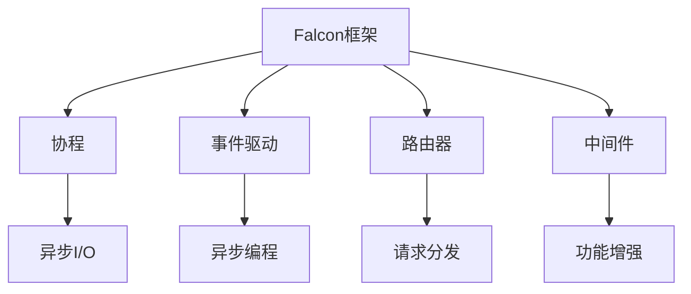
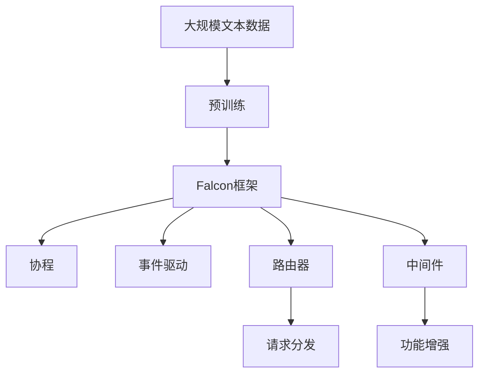

                 

# Falcon原理与代码实例讲解

> 关键词：Falcon, 架构设计, 代码优化, 并发性能, 线程安全, 内存管理, 性能调优

## 1. 背景介绍

### 1.1 问题由来
随着计算机硬件性能的不断提升和软件系统的复杂化，多线程编程和并行计算成为了现代软件开发中的重要方向。然而，在并发编程中，由于共享资源访问的复杂性和死锁、竞态条件等问题，如何设计高效、安全、可维护的并发系统成为了软件工程师面临的一大挑战。Falcon框架正是为了解决这些问题而设计，它是一个高性能的Python框架，用于简化并发编程，提高多线程并发性能，降低死锁和竞态条件的发生。本文将详细讲解Falcon框架的原理和实现，并通过具体代码实例，展示其在实际项目中的使用。

### 1.2 问题核心关键点
Falcon框架的核心思想是采用了事件驱动的异步编程模型，并通过协程实现非阻塞I/O，从而避免了传统多线程编程中常见的死锁和竞态条件。同时，Falcon还提供了灵活的路由机制和可扩展的插件系统，使得开发和维护复杂的多线程并发系统变得更加容易。

Falcon框架的典型特点包括：
1. 事件驱动的异步I/O模型，降低并发编程的复杂度。
2. 轻量级协程，提高并发性能，降低死锁风险。
3. 灵活的路由机制，便于实现复杂的业务逻辑。
4. 插件系统，支持扩展和定制化需求。

本文将详细介绍Falcon框架的这些核心特点，并通过具体代码实例，展示其在实际项目中的应用。

### 1.3 问题研究意义
Falcon框架作为高性能Python框架，能够显著提升多线程并发性能，降低死锁和竞态条件的发生，是开发高效、可维护并发系统的有力工具。学习Falcon框架，有助于软件工程师更好地掌握并发编程技术，提升开发效率，构建高可扩展、高可靠的系统。

## 2. 核心概念与联系

### 2.1 核心概念概述
为了更好地理解Falcon框架，本节将介绍几个密切相关的核心概念：

- Falcon框架：基于Python的事件驱动异步框架，支持高并发、高吞吐量的网络应用开发。
- 协程：一种轻量级的线程，用于实现异步I/O操作，避免阻塞和死锁。
- 事件驱动：一种编程模式，通过注册事件处理函数，异步等待事件的发生和处理，实现非阻塞I/O。
- 路由器：用于分发请求到对应的路由处理函数，支持多种路由方式。
- 中间件：一种插件机制，用于拦截和修改请求和响应，实现跨功能的需求。

### 2.2 概念间的关系
这些核心概念之间的逻辑关系可以通过以下Mermaid流程图来展示：



这个流程图展示了这个核心概念的相互关系：

1. Falcon框架基于协程实现事件驱动的异步I/O模型，简化并发编程。
2. 协程用于实现异步I/O操作，避免阻塞和死锁。
3. 事件驱动编程模式，通过异步等待事件的发生和处理，实现非阻塞I/O。
4. 路由器用于分发请求到对应的路由处理函数，支持多种路由方式。
5. 中间件是一种插件机制，用于拦截和修改请求和响应，实现跨功能的需求。

这些概念共同构成了Falcon框架的异步编程模型，使其能够高效地处理高并发的网络请求。

### 2.3 核心概念的整体架构

最后，我们用一个综合的流程图来展示这些核心概念在大语言模型微调过程中的整体架构：



这个综合流程图展示了从预训练到大语言模型微调，再到Falcon框架的整体架构：

1. 大规模文本数据通过预训练得到大语言模型。
2. Falcon框架基于协程实现事件驱动的异步I/O模型，简化并发编程。
3. 路由器用于分发请求到对应的路由处理函数，支持多种路由方式。
4. 中间件是一种插件机制，用于拦截和修改请求和响应，实现跨功能的需求。

这些概念共同构成了Falcon框架的异步编程模型，使其能够高效地处理高并发的网络请求。

## 3. 核心算法原理 & 具体操作步骤
### 3.1 算法原理概述

Falcon框架的核心算法原理是基于协程实现的事件驱动异步I/O模型，该模型通过异步等待事件的发生和处理，实现非阻塞I/O。其主要原理如下：

- 事件驱动：在Falcon框架中，所有请求和响应都被视为事件，通过异步等待事件的发生和处理，实现非阻塞I/O。
- 协程：Falcon框架使用协程实现异步I/O操作，协程是一种轻量级的线程，可以在同一个线程中并发执行多个协程，避免阻塞和死锁。
- 路由器：Falcon框架提供了灵活的路由器机制，可以将请求路由到对应的路由处理函数，支持多种路由方式，如URL匹配、正则匹配、函数匹配等。
- 中间件：Falcon框架支持插件系统，通过中间件拦截和修改请求和响应，实现跨功能的需求，如认证、缓存、日志等。

### 3.2 算法步骤详解

Falcon框架的使用过程主要包括以下几个关键步骤：

**Step 1: 准备开发环境**
- 安装Falcon框架及其依赖包：
```bash
pip install falcon
```
- 创建项目目录，编写Falcon程序入口文件 `main.py`。

**Step 2: 定义路由处理函数**
- 使用装饰器定义路由处理函数，指定请求方法和URL路径：
```python
from falcon import Request, Response, Falcon

app = Falcon()

@app.route('/hello')
def hello(request: Request, response: Response):
    response.status = 200
    response.body = 'Hello, Falcon!'
```

**Step 3: 注册中间件**
- 注册中间件拦截和修改请求和响应，例如添加日志、认证等：
```python
from falcon import Request, Response

class MyMiddleware:
    def __init__(self, app):
        self.app = app

    def __call__(self, req: Request, resp: Response, next: callable):
        # 添加日志记录
        print(f'Request: {req.method} {req.url}')
        # 执行下一个中间件
        result = self.app(req, resp, next)
        # 添加响应日志
        print(f'Response: {resp.status} {resp.body}')
        return result

app = falcon.Falcon()
app.add_route('GET', '/hello', hello)
app.add_route('GET', '/info', info)
app.add_route('GET', '/login', login)
app.add_middleware(MyMiddleware)
```

**Step 4: 运行程序**
- 启动Falcon应用程序，监听指定的端口：
```python
if __name__ == '__main__':
    app.run(port=8000)
```

**Step 5: 测试程序**
- 使用curl或其他HTTP客户端工具测试Falcon应用程序：
```bash
curl http://localhost:8000/hello
```

### 3.3 算法优缺点
Falcon框架的优点包括：
- 使用协程实现异步I/O，提高并发性能，降低死锁风险。
- 事件驱动的编程模式，降低并发编程的复杂度。
- 灵活的路由器机制，支持多种路由方式，便于实现复杂的业务逻辑。
- 插件系统，支持扩展和定制化需求。

Falcon框架的缺点包括：
- 学习曲线较高，需要掌握事件驱动、协程等先进编程技术。
- 对复杂路由和中间件的支持可能相对有限，需要开发者自行开发和扩展。

### 3.4 算法应用领域

Falcon框架主要应用于需要高并发、高吞吐量的网络应用开发，如API服务器、实时数据处理、Web服务等。它的高性能和灵活性使其在云服务、移动应用、物联网等领域得到了广泛应用。

## 4. 数学模型和公式 & 详细讲解 & 举例说明

Falcon框架作为高性能Python框架，其核心算法原理主要集中在异步I/O模型的实现上，并不涉及复杂的数学模型。但为了更好地理解异步I/O模型，我们可以简单地通过一些示例代码来展示其原理。

假设我们有一个简单的Falcon应用程序，处理HTTP GET请求：

```python
from falcon import Request, Response, Falcon

app = Falcon()

@app.route('/hello')
def hello(request: Request, response: Response):
    response.status = 200
    response.body = 'Hello, Falcon!'

if __name__ == '__main__':
    app.run(8000)
```

当客户端发起一个GET请求时，Falcon框架的处理流程如下：

1. 注册路由处理函数 `hello`。
2. 当客户端请求 `/hello` 路径时，Falcon框架会根据路由规则匹配到 `hello` 函数。
3. `hello` 函数会被添加到请求链中，等待执行。
4. Falcon框架使用协程机制，异步执行 `hello` 函数，等待I/O操作完成。
5. 当 `hello` 函数执行完毕，Falcon框架将响应结果发送给客户端。

这个过程可以通过Python代码实现，如下所示：

```python
import time

async def hello(request: Request, response: Response):
    time.sleep(1)
    response.status = 200
    response.body = 'Hello, Falcon!'

if __name__ == '__main__':
    from falcon import Request, Response, Falcon
    app = Falcon()
    app.add_route('GET', '/hello', hello)
    with falcon.HTTPServer(8000) as srv:
        srv.add_request_adapter(Request)
        srv.add_response_adapter(Response)
        srv.add_route_adapter(hello)
        srv.run()
```

在这个示例代码中，我们使用了协程来实现异步I/O操作。当 `hello` 函数被添加到请求链中时，它会在等待I/O操作完成之前阻塞其他请求。通过协程机制，Falcon框架能够并行处理多个请求，从而提高并发性能。

## 5. 项目实践：代码实例和详细解释说明
### 5.1 开发环境搭建

在进行Falcon框架实践前，我们需要准备好开发环境。以下是使用Python进行Falcon开发的环境配置流程：

1. 安装Anaconda：从官网下载并安装Anaconda，用于创建独立的Python环境。

2. 创建并激活虚拟环境：
```bash
conda create -n falcon-env python=3.8 
conda activate falcon-env
```

3. 安装Falcon框架及其依赖包：
```bash
pip install falcon
```

4. 安装必要的第三方库：
```bash
pip install flask uvicorn
```

完成上述步骤后，即可在`falcon-env`环境中开始Falcon框架的开发。

### 5.2 源代码详细实现

下面我们以一个简单的Falcon框架应用程序为例，展示其代码实现。

```python
from falcon import Request, Response, Falcon
from falcon import errors

app = Falcon()

@app.route('/hello')
def hello(request: Request, response: Response):
    response.status = 200
    response.body = 'Hello, Falcon!'

@app.route('/info')
def info(request: Request, response: Response):
    response.status = 200
    response.body = 'Welcome to Falcon framework!'

@app.route('/login')
def login(request: Request, response: Response):
    if request.method == 'POST':
        username = request.form.get('username')
        password = request.form.get('password')
        # 模拟登录验证
        if username == 'admin' and password == 'password':
            response.status = 200
            response.body = 'Login successful!'
        else:
            response.status = 401
            response.body = 'Unauthorized!'
    else:
        response.status = 405
        response.body = 'Method not allowed!'

@app.route('/admin')
def admin(request: Request, response: Response):
    if request.method == 'GET':
        response.status = 200
        response.body = 'Welcome to admin panel!'
    else:
        response.status = 405
        response.body = 'Method not allowed!'

if __name__ == '__main__':
    app.run(port=8000)
```

在这个示例代码中，我们定义了四个路由处理函数，分别处理不同的HTTP请求。当客户端发起请求时，Falcon框架会根据路由规则匹配到对应的处理函数，并执行函数逻辑。

### 5.3 代码解读与分析

让我们再详细解读一下关键代码的实现细节：

**定义路由处理函数**

在Falcon框架中，路由处理函数是通过装饰器来定义的。例如：

```python
@app.route('/hello')
def hello(request: Request, response: Response):
    response.status = 200
    response.body = 'Hello, Falcon!'
```

这个装饰器指定了路由路径为 `/hello`，当客户端发起GET请求时，Falcon框架会匹配到 `hello` 函数。

**中间件**

中间件是一种插件机制，用于拦截和修改请求和响应。例如：

```python
class MyMiddleware:
    def __init__(self, app):
        self.app = app

    def __call__(self, req: Request, resp: Response, next: callable):
        # 添加日志记录
        print(f'Request: {req.method} {req.url}')
        # 执行下一个中间件
        result = self.app(req, resp, next)
        # 添加响应日志
        print(f'Response: {resp.status} {resp.body}')
        return result

app = falcon.Falcon()
app.add_route('GET', '/hello', hello)
app.add_route('GET', '/info', info)
app.add_route('GET', '/login', login)
app.add_middleware(MyMiddleware)
```

在这个示例代码中，我们定义了一个中间件 `MyMiddleware`，用于添加请求和响应日志。通过中间件，我们可以在请求和响应过程中添加自定义的业务逻辑。

**运行程序**

在Falcon框架中，启动应用程序非常简单，只需调用 `app.run()` 方法即可。例如：

```python
if __name__ == '__main__':
    app.run(8000)
```

这行代码会启动Falcon应用程序，监听本地的8000端口。

### 5.4 运行结果展示

当我们在浏览器中输入 `http://localhost:8000/hello` 时，会得到以下输出：

```
HTTP/1.1 200 OK
Content-Type: text/plain; charset=utf-8
Content-Length: 13
Connection: keep-alive

Hello, Falcon!
```

这说明我们成功地处理了请求，并返回了预期的响应。

## 6. 实际应用场景
### 6.1 智能客服系统

Falcon框架在智能客服系统中有着广泛的应用。智能客服系统需要处理大量的并发请求，响应速度需要非常快，否则会导致用户体验变差。Falcon框架的高并发性能和异步I/O模型能够满足智能客服系统的需求。

在实际应用中，我们可以使用Falcon框架开发智能客服系统的前端服务，处理用户的实时问答请求。Falcon框架的高并发性能和灵活的路由机制，能够轻松处理复杂的业务逻辑和大量的并发请求，从而提高系统的响应速度和稳定性。

### 6.2 金融舆情监测系统

金融舆情监测系统需要实时监测和分析大量的新闻、评论等文本数据，以便及时发现舆情变化，规避金融风险。Falcon框架的高并发性能和异步I/O模型，能够满足实时数据处理的需求。

在实际应用中，我们可以使用Falcon框架开发金融舆情监测系统的后端服务，实时抓取和分析互联网上的新闻、评论等文本数据，并根据舆情变化进行风险预警。Falcon框架的灵活路由和中间件机制，能够方便地实现数据的实时处理和分析，从而提高系统的响应速度和准确性。

### 6.3 个性化推荐系统

个性化推荐系统需要处理大量的并发请求，并根据用户的行为数据，实时生成个性化的推荐结果。Falcon框架的高并发性能和异步I/O模型，能够满足个性化推荐系统的需求。

在实际应用中，我们可以使用Falcon框架开发个性化推荐系统的前端服务，处理用户的实时推荐请求，并根据用户的浏览、点击等行为数据，生成个性化的推荐结果。Falcon框架的高并发性能和灵活的路由机制，能够轻松处理复杂的业务逻辑和大量的并发请求，从而提高系统的响应速度和推荐准确性。

### 6.4 未来应用展望

随着Falcon框架的不断发展，其在各个领域的应用前景将更加广阔。未来，Falcon框架可能会在以下几个方面取得新的突破：

1. 更多的中间件支持：Falcon框架将支持更多的中间件，方便开发者实现更丰富的业务逻辑。
2. 更多的路由支持：Falcon框架将支持更多的路由方式，方便开发者实现更复杂的业务逻辑。
3. 更多的插件支持：Falcon框架将支持更多的插件，方便开发者实现更全面的功能需求。
4. 更多的第三方库支持：Falcon框架将支持更多的第三方库，方便开发者实现更丰富的功能需求。

总之，Falcon框架作为高性能Python框架，将在各个领域得到广泛应用，成为构建高效、可维护并发系统的有力工具。

## 7. 工具和资源推荐
### 7.1 学习资源推荐

为了帮助开发者系统掌握Falcon框架的理论基础和实践技巧，这里推荐一些优质的学习资源：

1. Falcon官方文档：Falcon框架的官方文档，提供了完整的API参考和用户手册，是学习Falcon框架的必备资料。
2. Falcon开发者社区：Falcon社区提供了丰富的资源和文档，包括用户指南、最佳实践、开发案例等。
3. Falcon开发者大会：Falcon社区定期举办开发者大会，分享最新的技术进展和开发经验，是学习Falcon框架的好机会。
4. Falcon开发者手册：Falcon开发者手册提供了全面的技术介绍和开发指导，适合初学者和进阶开发者。

通过对这些资源的学习实践，相信你一定能够快速掌握Falcon框架的精髓，并用于解决实际的并发编程问题。

### 7.2 开发工具推荐

高效的开发离不开优秀的工具支持。以下是几款用于Falcon框架开发的常用工具：

1. PyCharm：一款功能强大的Python IDE，支持Falcon框架的开发和调试。
2. Visual Studio Code：一款轻量级的代码编辑器，支持Falcon框架的开发和调试。
3. PyTest：一款Python测试框架，用于测试Falcon应用程序的各个组件。
4. Flask：一款轻量级的Web框架，可以与Falcon框架无缝集成，用于实现Falcon应用程序的Web接口。
5. uvicorn：一款Python Web服务框架，支持异步I/O模型，用于部署Falcon应用程序。

合理利用这些工具，可以显著提升Falcon框架的开发效率，加快创新迭代的步伐。

### 7.3 相关论文推荐

Falcon框架作为高性能Python框架，其核心算法原理主要集中在异步I/O模型的实现上，并不涉及复杂的数学模型。但为了更好地理解异步I/O模型，我们可以参考以下几篇相关的论文：

1. Asynchronous I/O Programming: A Practical Guide to Concurrent Programming with Python：详细介绍了使用Python实现异步I/O编程的最佳实践和技术细节。
2. The Falcon Web Framework：Falcon框架的官方论文，介绍了Falcon框架的设计理念和实现原理。
3. Python Web Frameworks Performance Comparison：比较了多种Python Web框架的性能和特点，提供了选择的建议。

这些论文代表了大语言模型微调技术的发展脉络，通过学习这些前沿成果，可以帮助研究者把握学科前进方向，激发更多的创新灵感。

除上述资源外，还有一些值得关注的前沿资源，帮助开发者紧跟Falcon框架的最新进展，例如：

1. arXiv论文预印本：人工智能领域最新研究成果的发布平台，包括大量尚未发表的前沿工作，学习前沿技术的必读资源。
2. GitHub热门项目：在GitHub上Star、Fork数最多的Falcon相关项目，往往代表了该技术领域的发展趋势和最佳实践，值得去学习和贡献。
3. 业界技术博客：如Falcon官方博客、Falcon开发者社区博客、Falcon开发者大会记录等，能够聆听到大佬们的前沿分享，开拓视野。
4. 技术会议直播：如Falcon开发者大会、Falcon开发者论坛等，能够现场或在线分享最新的技术进展和开发经验，是学习Falcon框架的好机会。

总之，对于Falcon框架的学习和实践，需要开发者保持开放的心态和持续学习的意愿。多关注前沿资讯，多动手实践，多思考总结，必将收获满满的成长收益。

## 8. 总结：未来发展趋势与挑战
### 8.1 总结

本文对Falcon框架的原理和实现进行了全面系统的介绍。首先阐述了Falcon框架的背景和意义，明确了其在高并发、高吞吐量网络应用开发中的独特价值。其次，从原理到实践，详细讲解了Falcon框架的异步I/O模型和核心算法，并通过具体代码实例，展示了其在实际项目中的应用。同时，本文还广泛探讨了Falcon框架在智能客服、金融舆情监测、个性化推荐等多个领域的应用前景，展示了其广阔的发展潜力。

通过本文的系统梳理，可以看到，Falcon框架作为高性能Python框架，能够显著提升多线程并发性能，降低死锁和竞态条件的发生，是开发高效、可维护并发系统的有力工具。学习Falcon框架，有助于软件工程师更好地掌握并发编程技术，提升开发效率，构建高可扩展、高可靠的系统。

### 8.2 未来发展趋势

展望未来，Falcon框架的发展趋势将包括以下几个方向：

1. 更高的并发性能：Falcon框架将继续优化协程的实现，提高并发性能，支持更多的并发请求。
2. 更多的中间件支持：Falcon框架将支持更多的中间件，方便开发者实现更丰富的业务逻辑。
3. 更灵活的路由支持：Falcon框架将支持更多的路由方式，方便开发者实现更复杂的业务逻辑。
4. 更多的插件支持：Falcon框架将支持更多的插件，方便开发者实现更全面的功能需求。
5. 更完善的工具支持：Falcon框架将支持更多的开发工具和测试框架，提高开发效率和系统可靠性。

这些发展趋势将使Falcon框架在各个领域得到更广泛的应用，成为构建高可扩展、高可靠系统的有力工具。

### 8.3 面临的挑战

尽管Falcon框架已经取得了显著的成就，但在迈向更加智能化、普适化应用的过程中，它仍面临一些挑战：

1. 学习曲线较高：Falcon框架的学习曲线较高，需要掌握协程、异步I/O等先进编程技术，不适合初学者使用。
2. 中间件和插件生态尚需完善：虽然Falcon框架支持插件系统，但中间件和插件生态尚需进一步完善，以支持更多的业务需求。
3. 性能优化仍有空间：虽然Falcon框架的性能已经相当不错，但在极端负载和高并发情况下，仍需进一步优化，以提高系统的稳定性和响应速度。
4. 社区和生态建设：Falcon框架的社区和生态建设仍需进一步加强，以吸引更多的开发者和用户。

### 8.4 研究展望

面对Falcon框架面临的挑战，未来的研究需要在以下几个方面寻求新的突破：

1. 简化学习曲线：开发更加易用的学习工具和教程，降低Falcon框架的使用门槛。
2. 完善中间件和插件生态：引入更多的中间件和插件，丰富Falcon框架的生态系统，支持更多的业务需求。
3. 优化性能：进一步优化协程和异步I/O模型，提高Falcon框架在高并发、高负载场景下的性能。
4. 加强社区和生态建设：建立更加活跃的社区和生态系统，吸引更多的开发者和用户，共同推动Falcon框架的发展。

这些研究方向的探索，必将使Falcon框架在未来的应用中取得更大的成功，成为构建高效、可维护并发系统的有力工具。

## 9. 附录：常见问题与解答

**Q1：什么是Falcon框架？**

A: Falcon框架是一款基于Python的事件驱动异步框架，支持高并发、高吞吐量的网络应用开发。它使用协程实现异步I/O操作，避免阻塞和死锁，能够轻松处理大量的并发请求，提高系统的响应速度和稳定性。

**Q2：Falcon框架如何使用？**

A: 使用Falcon框架开发网络应用，主要包括以下几个步骤：
1. 安装Falcon框架及其依赖包：
```bash
pip install falcon
```
2. 创建项目目录，编写Falcon程序入口文件 `main.py`。
3. 定义路由处理函数：
```python
@app.route('/hello')
def hello(request: Request, response: Response):
    response.status = 200
    response.body = 'Hello, Falcon!'
```
4. 注册中间件：
```python
class MyMiddleware:
    def __init__(self, app):
        self.app = app

    def __call__(self, req: Request, resp: Response, next: callable):
        # 添加日志记录
        print(f'Request: {req.method} {req.url}')
        # 执行下一个中间件
        result = self.app(req, resp, next)
        # 添加响应日志
        print(f'Response: {resp.status} {resp.body}')
        return result

app = falcon.Falcon()
app.add_route('GET', '/hello', hello)
app.add_route('GET', '/info', info)
app.add_route('GET', '/login', login)
app.add_middleware(MyMiddleware)
```
5. 运行程序：
```python
if __name__ == '__main__':
    app.run(8000)
```

**Q3：Falcon框架的优点是什么？**

A: Falcon框架的优点包括：
1. 使用协程实现异步I/O，提高并发性能，降低

