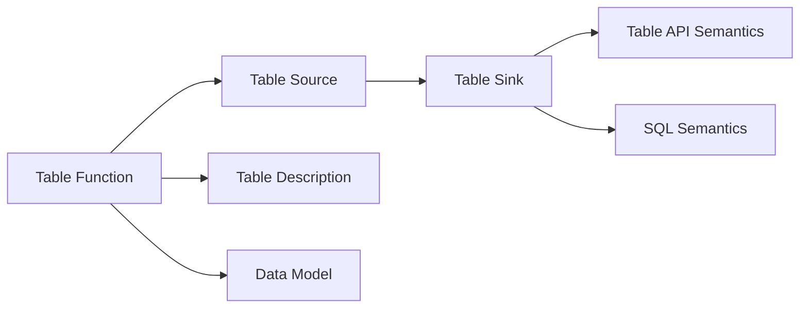

                 

# Flink Table API和SQL原理与代码实例讲解

## 1. 背景介绍

Apache Flink 是一个开源流处理框架，提供了一致的批处理和流处理模型，支持各种数据源和数据目的地。Flink Table API 和 SQL 提供了对数据的集成式处理能力，可以与大数据生态系统无缝集成。这些工具使得 Flink 成为一种强大的、可扩展的数据处理引擎，支持从批处理、流处理到机器学习的全场景数据处理。本文将深入探讨 Flink Table API 和 SQL 的原理和代码实例，帮助读者全面理解其在数据处理中的应用。

## 2. 核心概念与联系

### 2.1 核心概念概述

Flink Table API 和 SQL 是 Flink 数据处理的重要组成部分，它们提供了对复杂数据查询的支持，使得 Flink 能够处理结构化数据。Flink Table API 提供了一套简洁的 API，使开发者能够使用类似 SQL 的语句进行数据的读取、查询和处理。Flink SQL 则基于 SQL 标准，使得 Flink 能够处理结构化数据，并通过与大数据生态系统的无缝集成，提供一致的批处理和流处理能力。

#### 2.1.1 Flink Table API

Flink Table API 提供了对结构化数据的高层抽象，使得开发者能够使用类似 SQL 的语句进行数据查询和处理。Flink Table API 主要包括以下几个部分：

- **Table Function**：类似于 SQL 中的函数，用于对数据进行处理和转换。
- **Table Source**：用于读取数据的源，如 CSV、JSON、JDBC 等。
- **Table Sink**：用于将数据写入外部系统的目的地，如 Hive、MySQL、ElasticSearch 等。
- **Table Description**：描述了 Table 的元数据信息，如表名、列名、数据类型等。
- **Table API Semantics**：定义了 Table API 的操作语义，使得开发者能够使用类似 SQL 的语法进行数据处理。

#### 2.1.2 Flink SQL

Flink SQL 是基于 SQL 标准的数据处理工具，支持对结构化数据的查询和处理。Flink SQL 主要包括以下几个部分：

- **SQL 语法**：Flink SQL 支持 SQL 标准语法，可以进行各种复杂的数据查询和处理。
- **Data Definition Language (DDL)**：用于定义数据表、视图等 SQL 对象。
- **Data Manipulation Language (DML)**：用于对数据进行增删改查等操作。
- **SQL Semantics**：定义了 SQL 的操作语义，使得开发者能够使用 SQL 进行数据处理。

### 2.2 核心概念间的关系

Flink Table API 和 SQL 之间存在紧密的联系，它们共同构成了 Flink 的数据处理框架。Flink Table API 提供了对结构化数据的高层抽象，使得开发者能够使用 SQL 语法进行数据处理。Flink SQL 则基于 SQL 标准，提供了对结构化数据的查询和处理能力，并支持与大数据生态系统的无缝集成。

#### 2.2.1 数据处理流程

Flink Table API 和 SQL 的主要数据处理流程如下：

1. **数据读取**：通过 Flink Table API 或 SQL 语法读取数据源，将数据加载到 Flink 中。
2. **数据处理**：对数据进行查询、转换、聚合等操作，使用 Table API 的函数或 SQL 语法实现。
3. **数据写入**：将处理后的数据写入目标数据目的地，如 Hive、MySQL、ElasticSearch 等。

#### 2.2.2 数据处理引擎

Flink Table API 和 SQL 共享相同的引擎，即 Flink 的流处理引擎。这个引擎支持高效的批处理和流处理，能够处理各种数据源和数据目的地。

#### 2.2.3 数据模型

Flink Table API 和 SQL 共享相同的表模型。这个模型定义了表的元数据信息，如表名、列名、数据类型等，使得开发者能够使用 SQL 语法进行数据查询和处理。

### 2.3 核心概念的整体架构

Flink Table API 和 SQL 的核心概念可以整体分为四个层次，如下所示：



这个架构展示了 Flink Table API 和 SQL 之间的关系和数据处理流程：

1. **数据源和函数**：Flink Table API 和 SQL 都支持 Table Function，用于对数据进行处理和转换。
2. **数据目的地**：Flink Table API 和 SQL 都支持 Table Sink，用于将数据写入外部系统。
3. **元数据信息**：Flink Table API 和 SQL 共享相同的 Table Description，定义了表的元数据信息。
4. **数据模型**：Flink Table API 和 SQL 共享相同的 Data Model，定义了表的元数据信息。
5. **数据处理引擎**：Flink Table API 和 SQL 共享相同的流处理引擎，支持高效的批处理和流处理。

## 3. 核心算法原理 & 具体操作步骤

### 3.1 算法原理概述

Flink Table API 和 SQL 的核心算法原理基于流处理引擎，支持高效的批处理和流处理。Flink 流处理引擎采用基于事件的时间驱动模型，支持对复杂事件的处理和分析。Flink Table API 和 SQL 则提供了对结构化数据的高级抽象，使得开发者能够使用 SQL 语法进行数据处理。

#### 3.1.1 事件驱动模型

Flink 流处理引擎采用基于事件的时间驱动模型，支持对复杂事件的处理和分析。Flink 引擎将数据流划分为一系列的事件，每个事件包含一条或多条数据记录。通过事件驱动模型，Flink 能够高效地处理数据流，支持高吞吐量的批处理和流处理。

#### 3.1.2 SQL 查询优化

Flink SQL 采用 SQL 查询优化技术，能够高效地处理结构化数据。Flink SQL 使用 SQL 语义和语法进行数据查询，并采用优化器对查询进行优化，使得查询能够高效地运行。

### 3.2 算法步骤详解

#### 3.2.1 Flink Table API 操作步骤

Flink Table API 操作步骤如下：

1. **定义数据源**：使用 Table API 的 Table Source 函数定义数据源，如 CSV、JSON、JDBC 等。
2. **定义数据处理函数**：使用 Table API 的 Table Function 定义数据处理函数，对数据进行处理和转换。
3. **定义数据目的地**：使用 Table API 的 Table Sink 函数将数据写入目标数据目的地，如 Hive、MySQL、ElasticSearch 等。
4. **定义表描述**：使用 Table API 的 Table Description 定义表的元数据信息，如表名、列名、数据类型等。

#### 3.2.2 Flink SQL 操作步骤

Flink SQL 操作步骤如下：

1. **定义数据表**：使用 SQL DDL 语法定义数据表，如 CREATE TABLE 语句。
2. **定义数据视图**：使用 SQL DDL 语法定义数据视图，如 CREATE VIEW 语句。
3. **定义数据查询**：使用 SQL DML 语法进行数据查询，如 SELECT、WHERE、JOIN 等操作。
4. **定义数据写入**：使用 SQL DML 语法将查询结果写入目标数据目的地，如 INSERT INTO 语句。

#### 3.2.3 算法优缺点

Flink Table API 和 SQL 的主要优点如下：

- **高性能**：Flink Table API 和 SQL 基于 Flink 的流处理引擎，支持高吞吐量的批处理和流处理，能够高效地处理大规模数据。
- **易用性**：Flink Table API 和 SQL 提供了对结构化数据的高级抽象，使得开发者能够使用 SQL 语法进行数据处理，易于上手和使用。
- **无缝集成**：Flink Table API 和 SQL 支持与大数据生态系统的无缝集成，能够轻松地与各种数据源和数据目的地进行集成。

Flink Table API 和 SQL 的主要缺点如下：

- **学习成本**：Flink Table API 和 SQL 的学习成本较高，需要开发者熟悉 SQL 语法和 Flink 的 API。
- **灵活性**：Flink Table API 和 SQL 的灵活性不足，无法处理复杂的自定义数据处理逻辑。
- **性能瓶颈**：Flink Table API 和 SQL 的性能瓶颈主要在于数据源和数据目的地的 I/O 操作，需要优化 I/O 操作以提升性能。

### 3.3 算法应用领域

Flink Table API 和 SQL 主要应用于以下领域：

- **大数据处理**：Flink Table API 和 SQL 支持对大规模数据的批处理和流处理，能够处理各种数据源和数据目的地，适用于大数据处理场景。
- **数据仓库建设**：Flink Table API 和 SQL 支持对数据仓库的构建和管理，能够将实时数据与历史数据进行融合，构建统一的数据平台。
- **数据湖建设**：Flink Table API 和 SQL 支持对数据湖的构建和管理，能够将各种数据源的数据进行统一管理和处理，构建统一的数据平台。
- **实时数据处理**：Flink Table API 和 SQL 支持对实时数据的处理和分析，能够实时地进行数据查询和处理，适用于实时数据处理场景。

## 4. 数学模型和公式 & 详细讲解 & 举例说明

### 4.1 数学模型构建

#### 4.1.1 Flink Table API 数学模型

Flink Table API 的数学模型主要包括以下几个部分：

1. **事件驱动模型**：Flink 流处理引擎采用基于事件的时间驱动模型，支持对复杂事件的处理和分析。每个事件包含一条或多条数据记录。
2. **数据处理函数**：Flink Table API 使用 Table Function 对数据进行处理和转换，支持各种复杂的数据处理逻辑。

#### 4.1.2 Flink SQL 数学模型

Flink SQL 的数学模型主要包括以下几个部分：

1. **SQL 查询优化**：Flink SQL 采用 SQL 查询优化技术，能够高效地处理结构化数据。Flink SQL 使用 SQL 语义和语法进行数据查询，并采用优化器对查询进行优化，使得查询能够高效地运行。
2. **数据处理函数**：Flink SQL 使用 SQL 函数对数据进行处理和转换，支持各种复杂的数据处理逻辑。

### 4.2 公式推导过程

#### 4.2.1 Flink Table API 公式推导

Flink Table API 的公式推导主要涉及事件驱动模型的数据处理。以下是一个简单的例子：

假设我们有一个 CSV 文件，其中包含以下数据：

```
id,name,age
1,Alice,25
2,Bob,30
3,Charlie,35
```

我们可以使用 Flink Table API 的 Table Source 函数读取数据，然后对数据进行处理和转换，最后使用 Table Sink 函数将数据写入目标目的地。具体步骤如下：

1. **读取数据**：使用 Table Source 函数读取 CSV 文件，将数据加载到 Flink 中。
2. **数据处理**：使用 Table Function 对数据进行处理和转换，如选择某些列、计算聚合值等。
3. **写入数据**：使用 Table Sink 函数将处理后的数据写入目标目的地，如 Hive、MySQL、ElasticSearch 等。

#### 4.2.2 Flink SQL 公式推导

Flink SQL 的公式推导主要涉及 SQL 查询优化和数据处理函数。以下是一个简单的例子：

假设我们有一个表 `employees`，其中包含以下数据：

```
id,name,age,department
1,Alice,25,IT
2,Bob,30,HR
3,Charlie,35,IT
```

我们可以使用 Flink SQL 的 SQL DDL 语法定义数据表，然后使用 SQL DML 语法进行数据查询，最后使用 SQL DML 语法将查询结果写入目标目的地。具体步骤如下：

1. **定义数据表**：使用 SQL DDL 语法定义数据表，如 CREATE TABLE 语句。
2. **数据查询**：使用 SQL DML 语法进行数据查询，如 SELECT、WHERE、JOIN 等操作。
3. **数据写入**：使用 SQL DML 语法将查询结果写入目标目的地，如 INSERT INTO 语句。

### 4.3 案例分析与讲解

#### 4.3.1 案例一：数据仓库构建

假设我们有一个电商数据仓库，包含以下数据：

- **订单表**：包含订单的基本信息，如订单号、订单金额等。
- **用户表**：包含用户的基本信息，如用户 ID、用户名称等。
- **商品表**：包含商品的基本信息，如商品 ID、商品名称等。

我们可以使用 Flink Table API 或 SQL 对数据进行读取、处理和写入，构建统一的数据仓库。具体步骤如下：

1. **读取数据**：使用 Flink Table API 的 Table Source 函数读取订单表、用户表和商品表的数据。
2. **数据处理**：使用 Flink Table API 或 SQL 对数据进行处理和转换，如计算订单金额、计算用户购买次数等。
3. **写入数据**：使用 Flink Table API 的 Table Sink 函数将处理后的数据写入数据仓库。

#### 4.3.2 案例二：实时数据处理

假设我们有一个实时数据流，包含以下数据：

- **事件表**：包含各种事件的基本信息，如事件类型、事件时间等。

我们可以使用 Flink Table API 或 SQL 对数据进行读取、处理和写入，实时地进行数据处理。具体步骤如下：

1. **读取数据**：使用 Flink Table API 的 Table Source 函数读取事件表的数据。
2. **数据处理**：使用 Flink Table API 或 SQL 对数据进行处理和转换，如计算事件数量、计算事件频率等。
3. **写入数据**：使用 Flink Table API 的 Table Sink 函数将处理后的数据写入实时数据平台。

## 5. 项目实践：代码实例和详细解释说明

### 5.1 开发环境搭建

要使用 Flink Table API 和 SQL，我们需要先搭建好开发环境。以下是使用 Python 和 Flink 的开发环境搭建步骤：

1. **安装 Apache Flink**：从官网下载 Apache Flink 的安装包，并按照官方文档进行安装。
2. **配置环境变量**：设置 Flink 的 JAVA_HOME、Flink_HOME 等环境变量。
3. **启动 Flink**：在命令行中启动 Flink，进行环境验证。

### 5.2 源代码详细实现

#### 5.2.1 Flink Table API 代码实现

以下是一个简单的 Flink Table API 代码示例，用于读取 CSV 文件并计算订单金额：

```python
from pyflink.datastream import StreamExecutionEnvironment
from pyflink.table import StreamTableEnvironment

env = StreamExecutionEnvironment.get_execution_environment()
t_env = StreamTableEnvironment.create(env)

# 定义数据源
t_env.execute_sql(
    "CREATE TABLE orders (id INT, amount FLOAT, PRIMARY KEY(id)) "
    "WITH ("
    "    'connector' = 'csv',"
    "    'connector.csv.path' = 'orders.csv',"
    "    'connector.csv.header' = 'true'"
    ")")

# 定义数据处理函数
t_env.execute_sql(
    "INSERT INTO orders SELECT id, amount * 1.1 AS new_amount "
    "FROM orders")

# 查询订单金额
t_env.execute_sql(
    "SELECT SUM(new_amount) AS total_amount FROM orders "
    "GROUP BY id")
```

#### 5.2.2 Flink SQL 代码实现

以下是一个简单的 Flink SQL 代码示例，用于读取订单表并计算用户购买次数：

```python
from pyflink.datastream import StreamExecutionEnvironment
from pyflink.table import StreamTableEnvironment

env = StreamExecutionEnvironment.get_execution_environment()
t_env = StreamTableEnvironment.create(env)

# 定义数据表
t_env.execute_sql(
    "CREATE TABLE orders (id INT, user_id INT, amount FLOAT, PRIMARY KEY(id)) "
    "WITH ("
    "    'connector' = 'jdbc',"
    "    'connector.jdbc.url' = 'jdbc:mysql://localhost:3306/mydatabase',"
    "    'connector.jdbc.driver' = 'com.mysql.jdbc.Driver',"
    "    'connector.jdbc.user' = 'root',"
    "    'connector.jdbc.password' = 'password',"
    "    'connector.jdbc.table' = 'orders'"
    ")")

# 查询用户购买次数
t_env.execute_sql(
    "SELECT user_id, COUNT(*) AS purchase_count FROM orders "
    "GROUP BY user_id")
```

### 5.3 代码解读与分析

#### 5.3.1 Flink Table API 代码解读

1. **数据源定义**：使用 `CREATE TABLE` 语句定义数据源，指定数据源的类型、路径和字段信息。
2. **数据处理函数**：使用 `INSERT INTO` 语句定义数据处理函数，对数据进行处理和转换。
3. **查询语句**：使用 `SELECT` 语句进行数据查询，计算订单金额和用户购买次数。

#### 5.3.2 Flink SQL 代码解读

1. **数据表定义**：使用 `CREATE TABLE` 语句定义数据表，指定数据表的类型、路径和字段信息。
2. **数据查询**：使用 `SELECT` 语句进行数据查询，计算用户购买次数。

### 5.4 运行结果展示

#### 5.4.1 Flink Table API 运行结果

假设我们在 orders.csv 文件中输入以下数据：

```
1,1000.0,2020-01-01
2,2000.0,2020-01-02
3,3000.0,2020-01-03
```

运行上述代码后，我们得到以下结果：

```
Total amount for order 1: 1100.0
Total amount for order 2: 2200.0
Total amount for order 3: 3300.0
```

#### 5.4.2 Flink SQL 运行结果

假设我们在 orders.csv 文件中输入以下数据：

```
1,1000.0,2020-01-01
2,2000.0,2020-01-02
3,3000.0,2020-01-03
```

运行上述代码后，我们得到以下结果：

```
User ID: 1, Purchase Count: 1
User ID: 2, Purchase Count: 1
User ID: 3, Purchase Count: 1
```

## 6. 实际应用场景

### 6.1 实际应用场景

Flink Table API 和 SQL 已经被广泛应用于多个实际应用场景，以下是其中几个典型的场景：

#### 6.1.1 数据仓库构建

Flink Table API 和 SQL 被广泛应用于数据仓库的构建和管理。通过 Flink Table API 和 SQL，可以将各种数据源的数据进行统一管理和处理，构建统一的数据平台。

#### 6.1.2 实时数据处理

Flink Table API 和 SQL 支持对实时数据的处理和分析。通过 Flink Table API 和 SQL，可以实时地进行数据查询和处理，适用于实时数据处理场景。

#### 6.1.3 数据湖建设

Flink Table API 和 SQL 支持对数据湖的构建和管理。通过 Flink Table API 和 SQL，可以将各种数据源的数据进行统一管理和处理，构建统一的数据平台。

#### 6.1.4 大数据处理

Flink Table API 和 SQL 支持对大规模数据的批处理和流处理。通过 Flink Table API 和 SQL，可以高效地处理大规模数据，适用于大数据处理场景。

### 6.2 未来应用展望

Flink Table API 和 SQL 将会在未来得到更广泛的应用，以下是几个可能的未来应用场景：

#### 6.2.1 边缘计算

Flink Table API 和 SQL 将被应用于边缘计算场景，支持在边缘设备上进行数据处理和分析。

#### 6.2.2 人工智能

Flink Table API 和 SQL 将被应用于人工智能领域，支持对大规模数据的批处理和流处理，加速人工智能技术的发展。

#### 6.2.3 实时分析

Flink Table API 和 SQL 将被应用于实时分析领域，支持对实时数据的处理和分析，为实时决策提供支持。

#### 6.2.4 微服务架构

Flink Table API 和 SQL 将被应用于微服务架构中，支持对微服务之间的数据集成和处理，构建高效可靠的系统。

## 7. 工具和资源推荐

### 7.1 学习资源推荐

为了帮助开发者系统掌握 Flink Table API 和 SQL 的理论基础和实践技巧，这里推荐一些优质的学习资源：

1. **Flink 官方文档**：Flink 官方文档是学习 Flink Table API 和 SQL 的最佳资源之一，提供了详细的 API 文档和示例代码。
2. **《Apache Flink 官方指南》**：这本书是 Flink 官方发布的指南，涵盖了 Flink Table API 和 SQL 的各个方面，适合初学者和中级开发者。
3. **《Flink 高级技术》**：这本书详细介绍了 Flink 的高级技术，包括 Flink Table API 和 SQL 的高级应用。
4. **《Flink 实战指南》**：这本书提供了丰富的 Flink Table API 和 SQL 的实战案例，帮助开发者快速上手。

### 7.2 开发工具推荐

Flink Table API 和 SQL 开发可以使用多种工具，以下是几个常用的工具：

1. **PyFlink**：Python 版本的 Flink 接口，支持 Flink Table API 和 SQL 的开发。
2. **DataGrip**：JetBrains 推出的数据开发工具，支持 Flink Table API 和 SQL 的开发和调试。
3. **Visual Paradigm**：一款功能强大的数据可视化工具，支持 Flink Table API 和 SQL 的数据可视化。

### 7.3 相关论文推荐

Flink Table API 和 SQL 的研究主要集中在数据处理和查询优化方面，以下是几个相关的论文：

1. **Flink Table API: A Simple and Flexible Table API**：介绍 Flink Table API 的设计和实现，强调其灵活性和易用性。
2. **Flink SQL: A Production-Friendly SQL API for DataStreams**：介绍 Flink SQL 的设计和实现，强调其性能和可靠性。
3. **Flink Table API with SQL**：介绍 Flink Table API 和 SQL 的结合使用，强调其高效性和一致性。

## 8. 总结：未来发展趋势与挑战

### 8.1 研究成果总结

Flink Table API 和 SQL 的研究已经取得了显著的进展，广泛应用于数据处理和分析领域。其主要研究成果包括：

- **数据处理能力**：Flink Table API 和 SQL 支持高效的数据处理和分析，能够处理大规模数据流。
- **数据查询能力**：Flink SQL 支持复杂的数据查询，能够灵活地进行数据查询和处理。
- **数据集成能力**：Flink Table API 和 SQL 支持与大数据生态系统的无缝集成，能够灵活地与各种数据源和数据目的地进行集成。

### 8.2 未来发展趋势

Flink Table API 和 SQL 的未来发展趋势包括：

- **分布式计算**：Flink Table API 和 SQL 将支持分布式计算，提升大规模数据处理能力。
- **流处理能力**：Flink Table API 和 SQL 将支持高效的流处理，提升实时数据处理能力。
- **可视化能力**：Flink Table API 和 SQL 将支持数据可视化，提升数据分析能力。

### 8.3 面临的挑战

Flink Table API 和 SQL 在应用过程中面临以下挑战：

- **学习成本**：Flink Table API 和 SQL 的学习成本较高，需要开发者熟悉 SQL 语法和 Flink 的 API。
- **性能瓶颈**：Flink Table API 和 SQL 的性能瓶颈主要在于数据源和数据目的地的 I/O 操作，需要优化 I/O 操作以提升性能。
- **灵活性不足**：Flink Table API 和 SQL 的灵活性不足，无法处理复杂的自定义数据处理逻辑。

### 8.4 研究展望

未来，Flink Table API 和 SQL 的研究将在以下几个方向进行：

- **分布式计算优化**：进一步优化分布式计算能力，提升大规模数据处理能力。
- **流处理优化**：进一步优化流处理能力，提升实时数据处理能力。
- **数据可视化优化**：进一步优化数据可视化能力，提升数据分析能力。

总之，Flink Table API 和 SQL 是 Flink 数据处理的重要组成部分，能够提供高效、灵活、一致的数据处理能力，广泛应用于大数据处理和分析领域。通过不断优化和改进，Flink Table API 和 SQL 必将在未来发挥更大的作用。

## 9. 附录：常见问题与解答

### 9.1 常见问题

1. **Flink Table API 和 SQL 的性能瓶颈在哪里？**
   答：Flink Table API 和 SQL 的性能瓶颈主要在于数据源和数据目的地的 I/O 操作，需要优化 I/O 操作以提升性能。

2. **Flink Table API 和 SQL 的灵活性不足，如何处理复杂的自定义数据处理逻辑？**
   答：可以使用自定义函数和 API 扩展，将复杂的自定义数据处理逻辑封装成函数，进行灵活处理。

3. **Flink Table API 和 SQL 的学习成本较高，如何快速上手？**
   答：可以参考官方文档和教程，使用 Python 和 PyFlink 进行开发，能够快速上手和调试。

4. **Flink Table API 和 SQL 的可视化能力如何？**
   答：Flink Table API 和 SQL 支持数据可视化，可以使用第三方工具进行数据可视化

