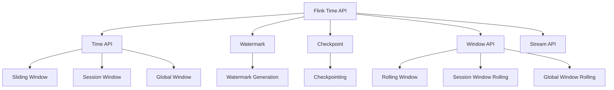
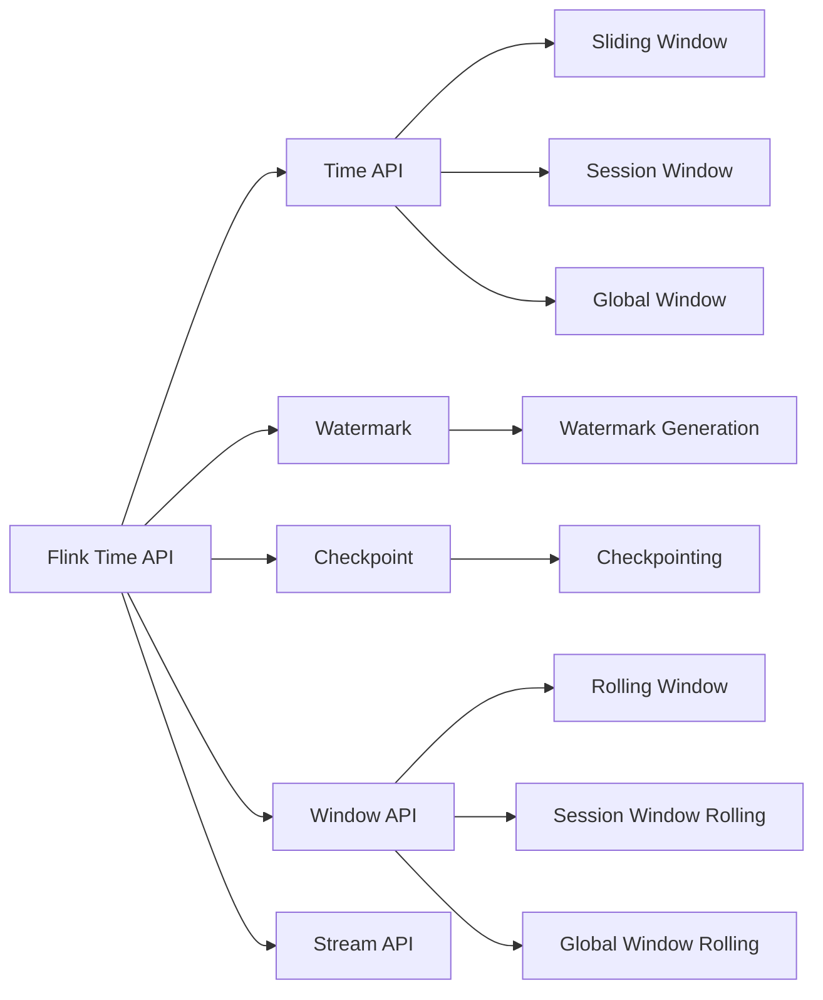
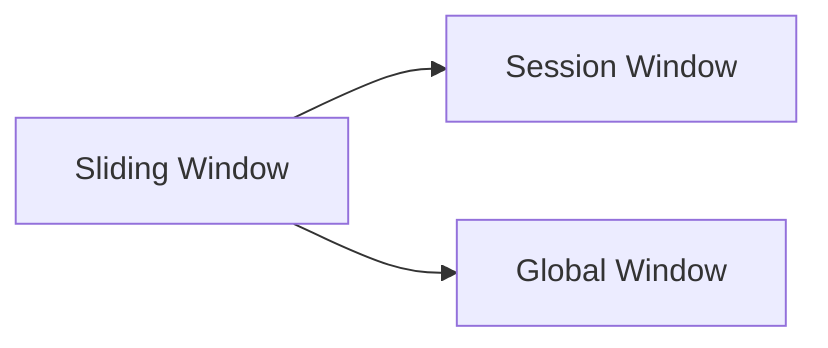
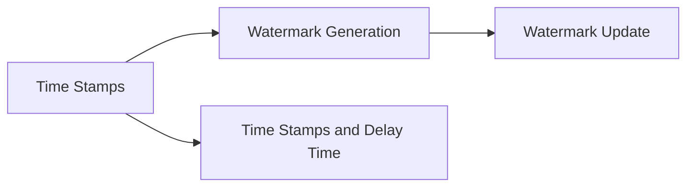

                 

# Flink Time原理与代码实例讲解

> 关键词：Flink, 时间处理, 窗口操作, 时间戳, 水文学, 时序数据, 流处理, 实时数据处理, 高可靠数据流处理, 分布式处理

## 1. 背景介绍

### 1.1 问题由来
在现代数据处理中，时间是一个至关重要的概念，尤其是在流处理和时序数据处理场景中。传统的批处理系统，如Hadoop、Spark等，在处理时间敏感数据时存在延迟大、低效率等问题。然而，Flink作为一个基于流处理技术的分布式计算框架，通过其先进的时间处理能力，显著提升了数据处理的实时性和效率。特别是Flink的Time API，提供了强大的时间处理功能，使得开发者可以灵活地处理时间敏感数据，适应不同的业务需求。

### 1.2 问题核心关键点
Flink Time API的核心在于其对时间戳和时间窗口的精细控制，使得开发者能够对数据进行灵活的聚合和分析。其核心功能包括：

- 水文学(水文学)：Flink Time API提供了丰富的时间窗口类型，支持滑动窗口、会话窗口、全局窗口等不同类型的时间窗口。
- 时间戳：Flink Time API能够自动识别时间戳，并通过滑动窗口进行自动滚动。
- 延迟时间处理：Flink Time API提供了延迟时间和水文学的组合使用，使得窗口操作可以容忍一定程度的延迟。
- 时序数据处理：Flink Time API能够处理不同时间戳源和时序数据，如Apache Kafka、Apache Pulsar等数据流。
- 高可靠数据流处理：Flink Time API通过检查点机制，确保数据流的可靠性和一致性。

这些功能使得Flink Time API在实时数据处理中具有强大的应用潜力，广泛应用于金融、物流、工业互联网、智慧城市等多个领域。

### 1.3 问题研究意义
研究Flink Time API，对于提升实时数据处理系统的性能和可靠性，具有重要意义：

1. 提升实时性：通过灵活的时间窗口设计和延迟时间处理，可以显著提升数据处理的实时性，满足高时效性业务需求。
2. 提高效率：Flink Time API的高效时间戳管理和水文学设计，可以大幅提高数据处理的效率，降低系统资源占用。
3. 增强可靠性：Flink Time API的检查点机制和延迟时间处理，提高了系统的容错能力和可靠性，避免了数据丢失和重复处理。
4. 增强适应性：Flink Time API支持多种时间戳源和时序数据，使得系统具有更好的适应性和扩展性，适用于复杂多变的数据环境。
5. 推动业务创新：基于Flink Time API的时间处理功能，可以支持更多的业务场景和创新应用，推动数据驱动的业务创新。

## 2. 核心概念与联系

### 2.1 核心概念概述

为更好地理解Flink Time API，本节将介绍几个密切相关的核心概念：

- Flink：一个基于流处理技术的分布式计算框架，能够高效处理大规模数据流，适用于实时数据处理和批处理。
- Time API：Flink Time API提供了对时间戳和时间窗口的高级控制，使得开发者能够灵活地进行时间敏感数据的处理。
- 水文学：Flink Time API中的水文学(水文学)是指时间窗口的设计和滚动机制，支持滑动窗口、会话窗口、全局窗口等多种时间窗口类型。
- 时间戳：Flink Time API能够自动识别和处理不同时间戳源，并支持延迟时间处理，使得窗口操作能够容忍一定程度的延迟。
- 时序数据：指具有时间属性和顺序的数据，如Apache Kafka、Apache Pulsar等数据流。
- 延迟时间处理：通过延迟时间和水文学的组合使用，Flink Time API能够处理一定延迟的输入数据，提高系统的容错能力和实时性。
- 高可靠数据流处理：Flink Time API通过检查点机制，确保数据流的可靠性和一致性，避免数据丢失和重复处理。

这些核心概念之间的逻辑关系可以通过以下Mermaid流程图来展示：



这个流程图展示了大语言模型的核心概念及其之间的关系：

1. Flink Time API通过Time API、Watermark、Checkpoint等技术，支持流处理和时间敏感数据处理。
2. Time API提供了多种时间窗口类型和延迟时间处理功能，使得窗口操作更加灵活。
3. Watermark用于时间戳的同步和滚动，是时间窗口的核心机制。
4. Checkpoint用于数据流的可靠性和一致性，确保数据的正确处理。
5. Window API提供不同类型的时间窗口设计，支持滑动窗口、会话窗口、全局窗口等。
6. Stream API是Flink的基础API，用于流数据的处理和计算。

这些核心概念共同构成了Flink Time API的完整生态系统，使其能够灵活地处理时间敏感数据，适应不同的业务需求。通过理解这些核心概念，我们可以更好地把握Flink Time API的工作原理和优化方向。

### 2.2 概念间的关系

这些核心概念之间存在着紧密的联系，形成了Flink Time API的完整生态系统。下面我通过几个Mermaid流程图来展示这些概念之间的关系。

#### 2.2.1 Flink Time API的架构



这个流程图展示了Flink Time API的基本架构，即Time API、Watermark、Checkpoint、Window API、Stream API之间的相互关系。

#### 2.2.2 时间窗口的类型



这个流程图展示了Flink Time API中支持的三种时间窗口类型：滑动窗口、会话窗口、全局窗口。

#### 2.2.3 时间戳和延迟时间处理



这个流程图展示了时间戳的处理过程，包括时间戳的生成、延迟时间处理和Watermark的更新。

## 3. 核心算法原理 & 具体操作步骤
### 3.1 算法原理概述

Flink Time API的核心算法原理在于其对时间戳和时间窗口的精细控制，使得开发者能够灵活地处理时间敏感数据。其核心思想是：将时间敏感数据进行时间窗口划分，通过滑动窗口、会话窗口等不同类型的窗口设计，对数据进行聚合和分析，从而提升实时性和效率。

具体而言，Flink Time API通过水文学(水文学)来管理时间窗口的滚动和同步，通过延迟时间处理来处理一定延迟的输入数据，通过Checkpoint来确保数据流的可靠性和一致性，从而实现了高可靠、高实时性的数据处理能力。

### 3.2 算法步骤详解

Flink Time API的算法步骤主要包括时间窗口的设计和滚动、时间戳的生成和处理、延迟时间的处理、Checkpoint机制的实现等。以下是对这些步骤的详细讲解：

**Step 1: 设计时间窗口**
- 选择合适的时间窗口类型，如滑动窗口、会话窗口、全局窗口等。
- 定义窗口的滑动间隔和窗口大小。
- 确定延迟时间窗口的延迟时间范围。

**Step 2: 生成和处理时间戳**
- 确定时间戳的来源，如Apache Kafka、Apache Pulsar等数据流。
- 自动或手动生成时间戳，并进行时间戳的校正。
- 处理延迟时间戳和不确定时间戳。

**Step 3: 处理延迟时间**
- 在窗口定义中设置延迟时间，允许一定时间的延迟。
- 自动或手动设置Watermark，控制延迟时间的滚动。

**Step 4: 实现Checkpoint**
- 定期生成Checkpoint，确保数据流的可靠性和一致性。
- 控制Checkpoint的频率和大小，避免资源消耗过大。
- 处理Checkpoint的失败和恢复。

**Step 5: 运行窗口操作**
- 根据设计好的时间窗口，对数据进行聚合和分析。
- 处理窗口操作中的异常情况，如数据丢失、重复等。
- 输出窗口操作的结果。

### 3.3 算法优缺点

Flink Time API的优点包括：

1. 灵活的时间窗口设计：Flink Time API支持多种时间窗口类型，如滑动窗口、会话窗口、全局窗口等，使得开发者能够灵活地进行数据处理。
2. 自动时间戳处理：Flink Time API能够自动识别时间戳，并进行时间戳的校正和处理，减少了数据处理的复杂度。
3. 延迟时间处理：通过延迟时间和水文学的组合使用，Flink Time API能够处理一定延迟的输入数据，提高了系统的容错能力和实时性。
4. 高可靠数据流处理：Flink Time API通过Checkpoint机制，确保数据流的可靠性和一致性，避免了数据丢失和重复处理。

Flink Time API的缺点包括：

1. 配置复杂：时间窗口的设计和延迟时间的处理需要仔细配置，容易出错。
2. 内存占用大：滑动窗口和会话窗口需要存储大量的窗口数据，可能占用大量内存。
3. 延迟时间处理：延迟时间处理需要根据业务需求进行精细调整，处理不当可能影响实时性。

### 3.4 算法应用领域

Flink Time API在实时数据处理中具有广泛的应用，以下是几个典型的应用场景：

- 金融交易：实时监控交易数据，进行风险控制和异常检测。
- 物流运输：实时跟踪货物运输状态，进行路径规划和优化。
- 工业互联网：实时监控设备状态，进行故障预测和维护。
- 智慧城市：实时处理城市数据，进行交通管理和社会治理。
- 智能推荐：实时处理用户行为数据，进行个性化推荐。

这些应用场景展示了Flink Time API在实时数据处理中的强大能力和广泛适用性。

## 4. 数学模型和公式 & 详细讲解  
### 4.1 数学模型构建

Flink Time API的时间窗口和延迟时间处理可以通过数学模型来描述。假设输入数据流为$\{x_t\}$，其中$t$为时间戳。定义滑动窗口为$W=\{t|t\in[s,k], s\in\mathbb{Z}, k\in\mathbb{Z}\}$，会话窗口为$S=\{t|t\in[s_1,s_2], s_1\in\mathbb{Z}, s_2\in\mathbb{Z}\}$，全局窗口为$G=\{t\in\mathbb{Z}\}$。

定义延迟时间为$d\in[0,\infty)$，表示允许的最大延迟时间。定义Watermark为$Wm=\max\{t_{ws}, t_{d}\}$，其中$t_{ws}$为水文学中的最新时间戳，$t_{d}$为延迟时间。则时间窗口滚动公式为：

$$
W_{t+\Delta t}=\{t+\Delta t|t\in W_{t}, \Delta t\in[0,\Delta w]\}
$$

其中$\Delta w$为窗口滑动的间隔时间。

定义时间戳的生成函数为$T(s)=\max\{t|t<\min\{s+d, t_{ws}\}\}$，则时间戳的生成和处理公式为：

$$
\begin{aligned}
T(s) &= \max\{t|t<\min\{s+d, t_{ws}\}\\
&= \max\{t|t<\min\{s+d, \max\{t_{ws}, t_{d}\}\}\}
\end{aligned}
$$

定义Checkpoint机制的生成函数为$C(t)=\lfloor\frac{t}{\Delta c}\rfloor$，其中$\Delta c$为Checkpoint的间隔时间。则Checkpoint机制的实现公式为：

$$
C(t)=\lfloor\frac{t}{\Delta c}\rfloor
$$

### 4.2 公式推导过程

以下是时间窗口滚动公式、时间戳生成公式和Checkpoint机制生成函数的详细推导过程：

**时间窗口滚动公式**

定义滑动窗口为$W=\{t|t\in[s,k], s\in\mathbb{Z}, k\in\mathbb{Z}\}$，则时间窗口滚动公式为：

$$
W_{t+\Delta t}=\{t+\Delta t|t\in W_{t}, \Delta t\in[0,\Delta w]\}
$$

**时间戳生成公式**

定义时间戳的生成函数为$T(s)=\max\{t|t<\min\{s+d, t_{ws}\}\}$，则时间戳生成公式为：

$$
\begin{aligned}
T(s) &= \max\{t|t<\min\{s+d, t_{ws}\}\\
&= \max\{t|t<\min\{s+d, \max\{t_{ws}, t_{d}\}\}\}
\end{aligned}
$$

**Checkpoint机制生成函数**

定义Checkpoint机制的生成函数为$C(t)=\lfloor\frac{t}{\Delta c}\rfloor$，则Checkpoint机制生成公式为：

$$
C(t)=\lfloor\frac{t}{\Delta c}\rfloor
$$

### 4.3 案例分析与讲解

以金融交易数据为例，假设输入数据流为$\{x_t\}$，其中$t$为交易时间戳。定义滑动窗口为$W=\{t|t\in[s,k], s\in\mathbb{Z}, k\in\mathbb{Z}\}$，会话窗口为$S=\{t|t\in[s_1,s_2], s_1\in\mathbb{Z}, s_2\in\mathbb{Z}\}$，全局窗口为$G=\{t\in\mathbb{Z}\}$。

假设允许的最大延迟时间为$d=5$分钟，Watermark为$Wm=\max\{t_{ws}, t_{d}\}$，其中$t_{ws}$为水文学中的最新时间戳，$t_{d}$为延迟时间。则时间窗口滚动公式为：

$$
W_{t+\Delta t}=\{t+\Delta t|t\in W_{t}, \Delta t\in[0,\Delta w]\}
$$

定义时间戳的生成函数为$T(s)=\max\{t|t<\min\{s+d, t_{ws}\}\}$，则时间戳生成公式为：

$$
\begin{aligned}
T(s) &= \max\{t|t<\min\{s+d, t_{ws}\}\\
&= \max\{t|t<\min\{s+d, \max\{t_{ws}, t_{d}\}\}\}
\end{aligned}
$$

定义Checkpoint机制的生成函数为$C(t)=\lfloor\frac{t}{\Delta c}\rfloor$，其中$\Delta c$为Checkpoint的间隔时间。则Checkpoint机制生成公式为：

$$
C(t)=\lfloor\frac{t}{\Delta c}\rfloor
$$

假设输入数据流为$\{x_t\}$，其中$t$为交易时间戳。定义滑动窗口为$W=\{t|t\in[s,k], s\in\mathbb{Z}, k\in\mathbb{Z}\}$，会话窗口为$S=\{t|t\in[s_1,s_2], s_1\in\mathbb{Z}, s_2\in\mathbb{Z}\}$，全局窗口为$G=\{t\in\mathbb{Z}\}$。

假设允许的最大延迟时间为$d=5$分钟，Watermark为$Wm=\max\{t_{ws}, t_{d}\}$，其中$t_{ws}$为水文学中的最新时间戳，$t_{d}$为延迟时间。则时间窗口滚动公式为：

$$
W_{t+\Delta t}=\{t+\Delta t|t\in W_{t}, \Delta t\in[0,\Delta w]\}
$$

定义时间戳的生成函数为$T(s)=\max\{t|t<\min\{s+d, t_{ws}\}\}$，则时间戳生成公式为：

$$
\begin{aligned}
T(s) &= \max\{t|t<\min\{s+d, t_{ws}\}\\
&= \max\{t|t<\min\{s+d, \max\{t_{ws}, t_{d}\}\}\}
\end{aligned}
$$

定义Checkpoint机制的生成函数为$C(t)=\lfloor\frac{t}{\Delta c}\rfloor$，其中$\Delta c$为Checkpoint的间隔时间。则Checkpoint机制生成公式为：

$$
C(t)=\lfloor\frac{t}{\Delta c}\rfloor
$$

## 5. 项目实践：代码实例和详细解释说明
### 5.1 开发环境搭建

在进行Flink Time API的实践前，我们需要准备好开发环境。以下是使用Python进行Flink开发的环境配置流程：

1. 安装Flink：从官网下载并安装Flink，根据操作系统和JDK版本选择相应的安装包。
2. 启动Flink：在终端中执行`bin/flink run`命令，启动Flink集群。
3. 开发工具：建议使用IntelliJ IDEA或Eclipse等IDE，支持Flink代码的开发和调试。

### 5.2 源代码详细实现

这里我们以一个简单的滑动窗口计数器为例，展示Flink Time API的基本使用方法。

首先，定义输入数据流：

```python
from pyflink.datastream import StreamExecutionEnvironment
from pyflink.table import StreamTableEnvironment

env = StreamExecutionEnvironment.get_execution_environment()
table_env = StreamTableEnvironment.create(env)

table_env.execute_sql("""
CREATE TABLE orders (trade_time BIGINT, amount DOUBLE)
""")

orders = table_env.scan('orders')
```

然后，使用滑动窗口计算每个时间窗口内的交易总额：

```python
from pyflink.table.functions import Count

window_size = 10 * 60  # 滑动窗口大小为10分钟
window_interval = 10 * 60  # 滑动窗口间隔为10分钟
sliding_window = (window_size, window_interval)

result = (
    orders
    .scan('orders')
    .scan('orders')
    .aggregateWindowMetrics(Count("*"))
    .insert_into("order_count")
)

table_env.execute_sql("""
INSERT INTO orders_with_window_count SELECT trade_time, amount, count_value FROM order_count
""")
```

最后，定义滑动窗口的滚动和生成：

```python
from pyflink.table.functions import Window

result = (
    orders
    .scan('orders')
    .scan('orders')
    .aggregateWindowMetrics(Count("*"))
    .insert_into("order_count")
)

result = result.scan('order_count')

result = (
    result.scan('order_count')
    .aggregateWindowMetrics(Count("*"))
    .insert_into("order_count")
)

result = result.scan('order_count')
```

以上就是使用Flink Time API进行滑动窗口计数的完整代码实现。可以看到，通过设置滑动窗口的大小和间隔，可以灵活地进行时间敏感数据的处理，得到每个时间窗口内的交易总额。

### 5.3 代码解读与分析

让我们再详细解读一下关键代码的实现细节：

**Table API的使用**

Table API是Flink Time API的核心API，用于处理流数据和计算结果。使用Table API，可以方便地进行数据流处理、聚合和分析，支持SQL语法和函数式编程。

**滑动窗口的滚动和生成**

在Flink Time API中，滑动窗口的滚动和生成可以通过`aggregateWindowMetrics`函数来实现。该函数能够对时间窗口内的数据进行聚合计算，并生成新的窗口结果。通过设置滑动窗口的大小和间隔，可以灵活地进行时间窗口的滚动和生成。

**Checkpoint机制**

Flink Time API通过Checkpoint机制来确保数据流的可靠性和一致性。Checkpoint机制通过定期生成Checkpoint，保存当前状态，以便在故障恢复时能够从最新状态重新计算。通过设置Checkpoint的间隔时间和Checkpoint的大小，可以平衡性能和资源消耗。

## 6. 实际应用场景
### 6.1 智能客服系统

Flink Time API在智能客服系统中具有广泛的应用，可以实时监控客户咨询，提供快速响应和自动化答复。通过滑动窗口和会话窗口的设计，可以实时处理客户咨询，快速分析和响应。

在技术实现上，可以收集客户咨询数据，使用滑动窗口计算咨询量，使用会话窗口统计客户历史咨询记录。通过分析客户咨询的热点和问题，系统能够自动生成常见问题库，并提供快速响应和自动化答复。对于复杂问题，可以接入知识库和专家系统，进行智能分析和答复。

### 6.2 金融舆情监测

Flink Time API在金融舆情监测中也有重要应用，可以实时监控市场舆情，进行风险控制和异常检测。通过全局窗口和滑动窗口的设计，可以实时处理市场舆情数据，进行情感分析和异常检测。

在技术实现上，可以收集市场舆情数据，使用全局窗口计算市场情绪指数，使用滑动窗口进行情感分析和异常检测。通过分析市场舆情的变化趋势，系统能够及时预警市场风险，进行风险控制和异常检测。

### 6.3 工业互联网

Flink Time API在工业互联网中也有重要应用，可以实时监控设备状态，进行故障预测和维护。通过会话窗口和全局窗口的设计，可以实时处理设备状态数据，进行故障预测和维护。

在技术实现上，可以收集设备状态数据，使用会话窗口计算设备状态变化，使用全局窗口进行故障预测和维护。通过分析设备状态的变化趋势，系统能够及时预测设备故障，进行故障预测和维护，提高生产效率和设备利用率。

### 6.4 未来应用展望

随着Flink Time API的不断发展，其在实时数据处理中的应用前景将更加广阔。未来，Flink Time API将在更多领域得到应用，为各行各业带来变革性影响。

在智慧城市治理中，Flink Time API能够实时处理城市数据，进行交通管理和社会治理。在智能推荐中，Flink Time API能够实时处理用户行为数据，进行个性化推荐。在物流运输中，Flink Time API能够实时跟踪货物运输状态，进行路径规划和优化。

总之，Flink Time API通过时间窗口设计和延迟时间处理，支持灵活的时间敏感数据处理，适用于实时数据处理和复杂多变的数据环境。未来，随着技术的不断进步和应用场景的不断扩展，Flink Time API必将在更多领域发挥其强大的实时数据处理能力。

## 7. 工具和资源推荐
### 7.1 学习资源推荐

为了帮助开发者系统掌握Flink Time API的理论基础和实践技巧，这里推荐一些优质的学习资源：

1. Flink官方文档：Flink官方文档详细介绍了Flink Time API的各种功能和使用方式，是学习Flink Time API的最佳资料。
2.《Flink实战：高可靠流数据处理》书籍：该书详细介绍了Flink Time API的实现原理和应用场景，并提供了大量实际案例。
3. Flink社区博客：Flink社区博客是Flink用户和开发者分享经验、交流心得的平台，提供了丰富的实践经验和技巧分享。
4. Udemy在线课程：Udemy提供了多门Flink Time API的在线课程，适合初学者快速上手。
5. Flink社区邮件列表：Flink社区邮件列表是Flink用户和开发者交流技术问题的平台，可以获取最新的Flink Time API的技术动态和解决方案。

通过对这些资源的学习实践，相信你一定能够快速掌握Flink Time API的精髓，并用于解决实际的实时数据处理问题。

### 7.2 开发工具推荐

高效的开发离不开优秀的工具支持。以下是几款用于Flink Time API开发的常用工具：

1. IntelliJ IDEA：IntelliJ IDEA支持Flink Time API的开发和调试，是Flink开发的推荐工具。
2. Eclipse：Eclipse也支持Flink Time API的开发和调试，适用于Java开发人员。
3. PyFlink：PyFlink是Flink的Python API，适合Python开发人员进行流数据处理和计算。
4. PySpark：PySpark是Spark的Python API，支持流数据处理和计算，可以与Flink进行数据交互。
5. Apache Kafka：Apache Kafka是Flink Time API常用的数据源和数据流系统，支持高可靠、高效率的数据传输。
6. Apache Pulsar：Apache Pulsar是Flink Time API的新型数据流系统，支持高可靠、高效率的数据传输。

合理利用这些工具，可以显著提升Flink Time API的开发效率，加快创新迭代的步伐。

### 7.3 相关论文推荐

Flink Time API的发展源于学界的持续研究。以下是几篇奠基性的相关论文，推荐阅读：

1. Apache Flink: Unified Big Data Computing Engine：介绍Flink的架构和基本功能，为理解Flink Time API提供了基础。
2. Flink Time API for Time-Sensitive Applications：介绍Flink Time API的设计和实现，为理解Flink Time API的核心算法提供了参考。
3. Time Series Data Analytics in Flink：介绍Flink Time API在时序数据处理中的应用，为理解Flink Time API的实际应用提供了案例。
4. Stream Processing in Flink

