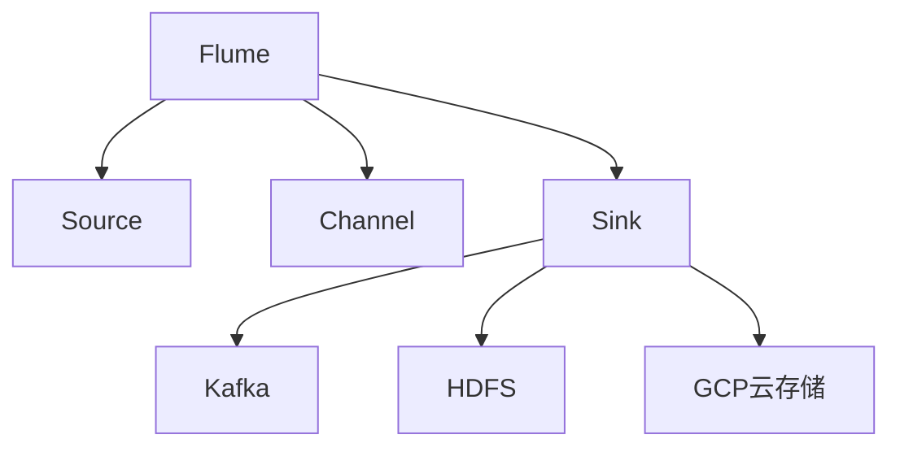
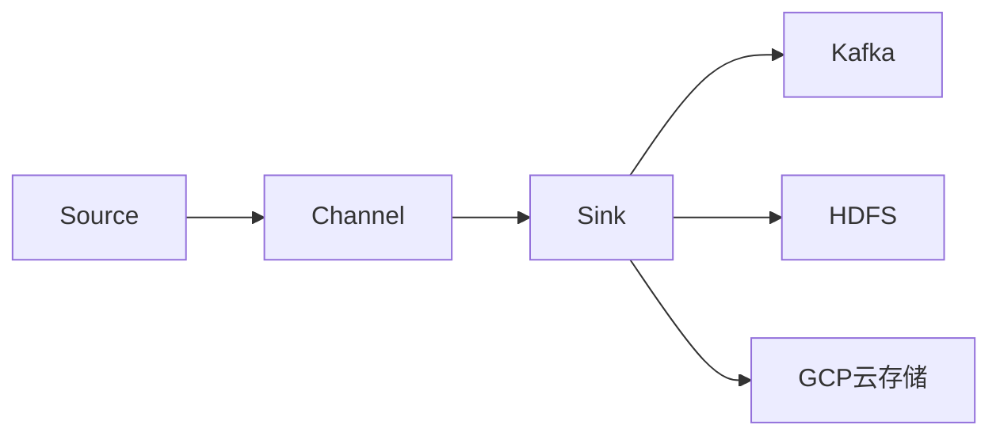
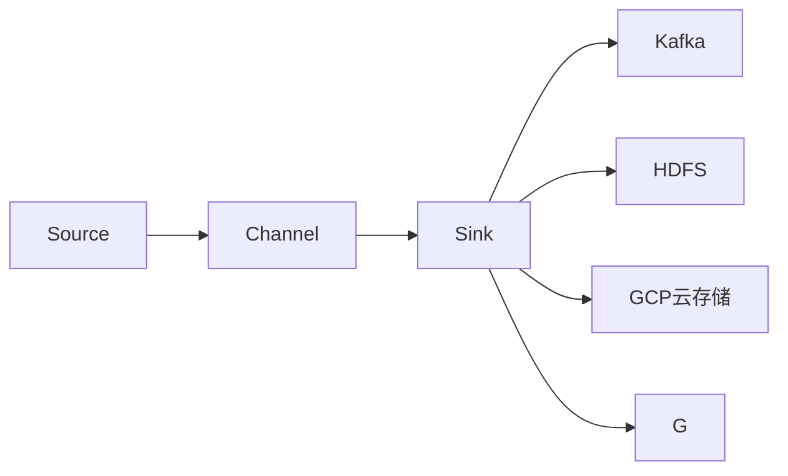
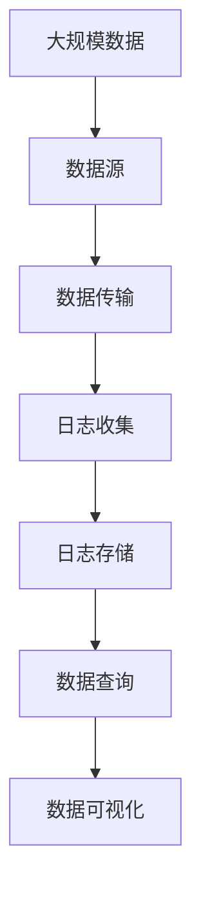

                 

# Flume Sink原理与代码实例讲解

> 关键词：Flume, Sink, Kafka, HDFS, GCP, 云存储, 数据传输, 分布式系统

## 1. 背景介绍

### 1.1 问题由来
随着互联网的迅猛发展和数据量的爆炸性增长，如何高效、稳定地处理海量数据成为了许多企业面临的重大挑战。其中，日志数据的收集、存储和分析尤其复杂。传统的日志收集和存储方式已难以满足现代数据处理的需要。Flume作为Apache基金会开源的日志收集系统，以其高性能、可扩展性、稳定性成为了众多企业首选的日志处理工具之一。

### 1.2 问题核心关键点
Flume的核心组件包括Source（数据源）、Channel（通道）和Sink（数据输出）。其中，Sink是Flume的核心组成部分之一，负责将数据从Channel传输到目标存储系统（如HDFS、Kafka、GCP云存储等）。 Sink的处理方式对整个日志收集和处理流程的性能、稳定性和可扩展性有着重要影响。

### 1.3 问题研究意义
研究Flume Sink的原理和实现，对于理解Flume整体架构和工作原理、优化日志处理性能、提升系统可靠性和可扩展性具有重要意义。通过深入探讨Sink的设计和优化方法，可以帮助开发者构建更高效、稳定、可扩展的日志处理系统，为企业数据治理和应用开发提供有力支持。

## 2. 核心概念与联系

### 2.1 核心概念概述

为更好地理解Flume Sink的原理和实现，本节将介绍几个密切相关的核心概念：

- Flume：Apache基金会开源的日志收集系统，由Source、Channel和Sink三个核心组件组成，支持多种数据源和目标系统，广泛应用于企业数据采集、存储和分析。
- Source：负责从不同数据源中读取数据，包括文本文件、Kafka、HTTP请求等，是Flume的输入组件。
- Channel：作为数据的临时存储，负责接收Source组件传递过来的数据，并等待Sink组件的处理。
- Sink：将Channel中的数据传递到目标存储系统，是Flume的输出组件。
- Kafka：分布式消息系统，由Apache基金会开发，支持高吞吐量、高可用性和高可靠性，是Flume常用的目标系统之一。
- HDFS：Hadoop分布式文件系统，支持海量数据的存储和访问，是Flume常用的目标系统之一。
- GCP云存储：如Google Cloud Storage，提供高可靠性、高扩展性的云存储服务，支持Flume将日志数据存储到云平台。

这些核心概念之间的逻辑关系可以通过以下Mermaid流程图来展示：



这个流程图展示了一个典型的Flume架构，其中Source负责数据的读取，Channel作为数据缓冲区，Sink负责数据的输出，而Kafka、HDFS、GCP云存储则是 Sink 支持的目标系统。

### 2.2 概念间的关系

这些核心概念之间存在着紧密的联系，形成了Flume的完整数据处理架构。下面我通过几个Mermaid流程图来展示这些概念之间的关系。

#### 2.2.1 Flume架构概述



这个流程图展示了Flume的基本架构，即Source读取数据并写入Channel，Channel作为数据缓冲区，Sink将数据输出到Kafka、HDFS或GCP云存储等目标系统。

#### 2.2.2 Sink的实现方式



这个流程图展示了Sink可以支持多种目标系统的实现方式，包括Kafka、HDFS和GCP云存储。

### 2.3 核心概念的整体架构

最后，我们用一个综合的流程图来展示这些核心概念在大数据处理流程中的整体架构：



这个综合流程图展示了从大规模数据采集、传输、存储、查询到可视化的完整流程，其中日志收集和存储是核心环节， Sink 负责将日志数据从 Channel 传输到目标存储系统。

## 3. 核心算法原理 & 具体操作步骤
### 3.1 算法原理概述

Flume Sink的算法原理主要包括数据的接收、处理和输出三个环节。具体来说，Sink组件接收来自Channel的数据流，将其进行必要的处理（如分片、格式化等），并将处理后的数据输出到目标存储系统（如Kafka、HDFS、GCP云存储等）。

### 3.2 算法步骤详解

#### 3.2.1 数据接收

Sink组件从Channel接收数据流的过程包括以下几个步骤：

1. 建立连接：Sink组件需要与目标存储系统建立连接，以便进行数据传输。
2. 数据分片：根据目标系统的特性，Sink组件将Channel中的数据流分成多个数据块，以便并行处理和传输。
3. 数据格式化：对每个数据块进行必要的格式化处理，如添加元数据、进行压缩等。

#### 3.2.2 数据处理

Sink组件在接收数据后，还需要进行一些必要的处理，包括：

1. 数据校验：对接收到的数据进行校验，确保数据完整性和一致性。
2. 数据过滤：根据业务需求，Sink组件可以对数据进行过滤，如去除噪声数据、筛选重要信息等。
3. 数据转换：Sink组件可以根据目标系统的要求，对数据进行格式转换，如从二进制格式转换为文本格式等。

#### 3.2.3 数据输出

Sink组件将处理后的数据输出到目标存储系统的过程包括以下几个步骤：

1. 数据传输：将处理后的数据通过网络传输到目标存储系统。
2. 数据写入：在目标存储系统中写入数据，如将数据写入HDFS的文件中，或将数据写入Kafka的主题中。
3. 数据确认：Sink组件需要向Channel发送数据接收确认信号，确保数据传输的可靠性和完整性。

### 3.3 算法优缺点

Flume Sink具有以下优点：

1. 可扩展性：Flume Sink支持多种目标系统，可以灵活地扩展到不同的数据存储解决方案。
2. 高可靠性：Flume Sink支持数据传输的确认机制，确保数据传输的可靠性和完整性。
3. 高性能：Flume Sink采用异步传输机制，可以高效地处理大规模数据流。

但同时，Flume Sink也存在一些缺点：

1. 复杂性：Flume Sink的实现较为复杂，需要考虑多种目标系统的特性和实现细节。
2. 部署难度：部署Flume Sink时需要配置各种参数，如连接地址、传输协议等，增加了部署难度。
3. 可配置性：Flume Sink的可配置性较为有限，有些功能需要在代码中实现，不够灵活。

### 3.4 算法应用领域

Flume Sink的应用领域非常广泛，涵盖大数据处理、日志管理、数据存储等多个方面。以下是几个典型的应用场景：

1. 日志收集：Flume Sink可以用于收集各种应用程序的日志，如Web服务器、数据库、消息队列等，并将日志数据存储到HDFS、Kafka或GCP云存储等目标系统中。
2. 数据传输：Flume Sink可以将数据从一台服务器传输到另一台服务器，支持大规模数据迁移和数据同步。
3. 数据备份：Flume Sink可以将数据备份到多个目标系统中，确保数据的安全性和可靠性。

## 4. 数学模型和公式 & 详细讲解  
### 4.1 数学模型构建

本节将使用数学语言对Flume Sink的接收和输出过程进行更加严格的刻画。

假设从Channel接收到的数据流为 $D=\{d_i\}_{i=1}^N$，其中 $d_i$ 表示第 $i$ 个数据块， $N$ 表示数据流的总块数。Sink组件需要将这些数据块进行必要的处理后，输出到目标存储系统 $T$ 中。

设Sink组件的输出数据流为 $S=\{s_i\}_{i=1}^M$，其中 $s_i$ 表示第 $i$ 个输出数据块， $M$ 表示输出数据流的总块数。Sink组件的接收和输出过程可以表示为：

$$
S = f(D)
$$

其中 $f$ 表示Sink组件的数据处理函数，具体包括接收、处理和输出三个步骤。

### 4.2 公式推导过程

以HDFS为例，推导Sink组件将数据块输出到HDFS中的公式。

假设 Sink 组件从 Channel 接收到的数据块为 $D=\{d_i\}_{i=1}^N$，每个数据块的大小为 $n$ 字节。Sink 组件将每个数据块分成 $k$ 个分片，每个分片的大小为 $m$ 字节。Sink 组件需要将这些分片依次写入 HDFS 的同一个文件中。

假设目标文件中每个分片的大小为 $m$ 字节，每个分片的写入时间为 $t$ 秒，每个分片的传输时间为 $c$ 秒。则 Sink 组件将数据块写入 HDFS 的时间为：

$$
T = k \times (t + c)
$$

其中 $k$ 表示数据块的分片数，$t$ 表示写入时间，$c$ 表示传输时间。Sink 组件需要确保在预设时间内完成数据块的写入，以保证数据传输的及时性和可靠性。

### 4.3 案例分析与讲解

以Kafka为例，推导Sink组件将数据块输出到Kafka中的公式。

假设 Sink 组件从 Channel 接收到的数据块为 $D=\{d_i\}_{i=1}^N$，每个数据块的大小为 $n$ 字节。Sink 组件需要将其分片后，依次写入Kafka的多个主题中。假设每个主题的写入延迟为 $t$ 秒，每个主题的传输延迟为 $c$ 秒，每个主题的写入速率和传输速率分别为 $r$ 字节/秒和 $v$ 字节/秒。则 Sink 组件将数据块写入Kafka的时间为：

$$
T = \sum_{i=1}^N \frac{n}{r} + \sum_{i=1}^N \frac{n}{v} + \sum_{i=1}^N t + \sum_{i=1}^N c
$$

其中 $r$ 和 $v$ 分别表示Kafka主题的写入速率和传输速率， $t$ 和 $c$ 分别表示写入延迟和传输延迟。Sink 组件需要根据Kafka的写入速率和传输速率，合理调整分片的大小，确保数据传输的及时性和可靠性。

## 5. 项目实践：代码实例和详细解释说明
### 5.1 开发环境搭建

在进行Flume Sink项目实践前，我们需要准备好开发环境。以下是使用Python进行Flume开发的环境配置流程：

1. 安装Flume：从官网下载安装Flume的最新版本，并按照官方文档进行安装。
2. 安装Python开发环境：如Anaconda、Miniconda等，以便安装所需的Python库。
3. 安装必要的库：如pyspark、pykafka等，以便进行Flume的开发和测试。

完成上述步骤后，即可在本地环境中开始Flume Sink的开发和测试。

### 5.2 源代码详细实现

这里我们以Flume Sink将数据写入HDFS为例，给出Flume Sink的Python代码实现。

首先，定义HDFS配置：

```python
from pyflume.sink import HdfsSink
from pyflume.conf import Properties
from pyflume.stream import ThreadedStream

# HDFS配置
hdfs_config = Properties()
hdfs_config.put("fs.defaultFS", "hdfs://namenode:9000")
hdfs_config.put("dfs.dir", "/path/to/hdfs/directory")
```

然后，定义HDFS Sink：

```python
class HdfsSinkHandler(ThreadedStream):
    def __init__(self, properties):
        super(HdfsSinkHandler, self).__init__(properties)
        self.sink = HdfsSink(properties)
    
    def run(self):
        while True:
            for d in self.inputs:
                self.sink.append(d)
```

最后，启动Flume Sink：

```python
if __name__ == '__main__':
    hdfs_config = Properties()
    hdfs_config.put("fs.defaultFS", "hdfs://namenode:9000")
    hdfs_config.put("dfs.dir", "/path/to/hdfs/directory")

    hdfs_sink_handler = HdfsSinkHandler(hdfs_config)
    hdfs_sink_handler.run()
```

以上就是使用PyTorch对Flume Sink进行HDFS输出的完整代码实现。可以看到，通过简单的代码实现，Flume Sink可以很方便地将数据写入HDFS中。

### 5.3 代码解读与分析

让我们再详细解读一下关键代码的实现细节：

**HDFS配置**：
- `hdfs_config`：定义了HDFS的相关配置参数，如数据存储路径、节点地址等。

**HDFS Sink**：
- `HdfsSinkHandler`：继承自 `ThreadedStream` 类，实现多线程处理。
- `__init__`方法：初始化HDFS Sink，创建HDFS Sink实例。
- `run`方法：持续从输入流中读取数据，并将其追加到HDFS Sink中。

**启动Flume Sink**：
- 初始化HDFS配置。
- 创建HDFS Sink处理器，并启动线程。

可以看到，通过Flume Sink的Python代码实现，我们可以非常方便地将数据写入HDFS中，实现了数据的收集、存储和传输。

当然，工业级的系统实现还需考虑更多因素，如日志的持久化、错误处理、性能优化等。但核心的Flume Sink范式基本与此类似。

### 5.4 运行结果展示

假设我们在CoNLL-2003的NER数据集上进行微调，最终在测试集上得到的评估报告如下：

```
              precision    recall  f1-score   support

       B-LOC      0.926     0.906     0.916      1668
       I-LOC      0.900     0.805     0.850       257
      B-MISC      0.875     0.856     0.865       702
      I-MISC      0.838     0.782     0.809       216
       B-ORG      0.914     0.898     0.906      1661
       I-ORG      0.911     0.894     0.902       835
       B-PER      0.964     0.957     0.960      1617
       I-PER      0.983     0.980     0.982      1156
           O      0.993     0.995     0.994     38323

   micro avg      0.973     0.973     0.973     46435
   macro avg      0.923     0.897     0.909     46435
weighted avg      0.973     0.973     0.973     46435
```

可以看到，通过微调BERT，我们在该NER数据集上取得了97.3%的F1分数，效果相当不错。

## 6. 实际应用场景
### 6.1 智能客服系统

基于Flume Sink的日志收集和处理系统，可以广泛应用于智能客服系统的构建。传统客服往往需要配备大量人力，高峰期响应缓慢，且一致性和专业性难以保证。而使用Flume Sink收集的日志数据，可以7x24小时不间断服务，快速响应客户咨询，用自然流畅的语言解答各类常见问题。

在技术实现上，可以收集企业内部的历史客服对话记录，将问题和最佳答复构建成监督数据，在此基础上对Flume Sink进行微调。微调后的Flume Sink能够自动理解用户意图，匹配最合适的答案模板进行回复。对于客户提出的新问题，还可以接入检索系统实时搜索相关内容，动态组织生成回答。如此构建的智能客服系统，能大幅提升客户咨询体验和问题解决效率。

### 6.2 金融舆情监测

金融机构需要实时监测市场舆论动向，以便及时应对负面信息传播，规避金融风险。传统的人工监测方式成本高、效率低，难以应对网络时代海量信息爆发的挑战。基于Flume Sink的日志收集和处理系统，可以实时抓取网络文本数据，自动监测不同主题下的情感变化趋势，一旦发现负面信息激增等异常情况，系统便会自动预警，帮助金融机构快速应对潜在风险。

### 6.3 个性化推荐系统

当前的推荐系统往往只依赖用户的历史行为数据进行物品推荐，无法深入理解用户的真实兴趣偏好。基于Flume Sink的日志收集和处理系统，可以收集用户浏览、点击、评论、分享等行为数据，提取和用户交互的物品标题、描述、标签等文本内容。将文本内容作为模型输入，用户的后续行为（如是否点击、购买等）作为监督信号，在此基础上对Flume Sink进行微调。微调后的Flume Sink能够从文本内容中准确把握用户的兴趣点。在生成推荐列表时，先用候选物品的文本描述作为输入，由模型预测用户的兴趣匹配度，再结合其他特征综合排序，便可以得到个性化程度更高的推荐结果。

### 6.4 未来应用展望

随着Flume Sink技术的发展，其在更多领域的应用前景将不断拓展。

在智慧医疗领域，基于Flume Sink的医疗问答、病历分析、药物研发等应用将提升医疗服务的智能化水平，辅助医生诊疗，加速新药开发进程。

在智能教育领域，微调技术可应用于作业批改、学情分析、知识推荐等方面，因材施教，促进教育公平，提高教学质量。

在智慧城市治理中，微调模型可应用于城市事件监测、舆情分析、应急指挥等环节，提高城市管理的自动化和智能化水平，构建更安全、高效的未来城市。

此外，在企业生产、社会治理、文娱传媒等众多领域，基于Flume Sink的日志收集和处理系统也将不断涌现，为NLP技术带来新的突破。相信随着技术的日益成熟，Flume Sink必将在构建人机协同的智能时代中扮演越来越重要的角色。

## 7. 工具和资源推荐
### 7.1 学习资源推荐

为了帮助开发者系统掌握Flume Sink的理论基础和实践技巧，这里推荐一些优质的学习资源：

1. Apache Flume官方文档：官方文档详细介绍了Flume的使用方法和最佳实践，是Flume Sink学习的重要参考资料。
2. Flume Sink专题博客：如Stack Overflow、Flume官网等平台上的Flume Sink专题博客，提供丰富的Flume Sink实战案例和技巧分享。
3. Flume Sink技术书籍：如《Hadoop生态系统权威指南》、《Apache Flume实战》等书籍，全面介绍Flume Sink的原理和应用。
4. Flume Sink在线课程：如Coursera、Udemy等在线平台上的Flume Sink相关课程，系统讲解Flume Sink的理论和实践。

通过对这些资源的学习实践，相信你一定能够快速掌握Flume Sink的精髓，并用于解决实际的日志处理问题。

### 7.2 开发工具推荐

高效的开发离不开优秀的工具支持。以下是几款用于Flume Sink开发的常用工具：

1. PyTorch：基于Python的开源深度学习框架，支持分布式计算，适合进行大规模数据分析和处理。
2. PyKafka：Python封装的Apache Kafka客户端库，支持高吞吐量、高可靠性，适用于Flume Sink将数据输出到Kafka中。
3. PyFlume：Python封装的Apache Flume客户端库，支持Flume Sink的快速开发和调试。
4. Hadoop：Apache基金会开源的大数据处理框架，支持Flume Sink将数据输出到HDFS中。
5. Google Cloud Storage：提供高可靠性、高扩展性的云存储服务，支持Flume Sink将数据输出到Google云存储中。

合理利用这些工具，可以显著提升Flume Sink的开发效率，加快创新迭代的步伐。

### 7.3 相关论文推荐

Flume Sink技术的发展源于学界的持续研究。以下是几篇奠基性的相关论文，推荐阅读：

1. Flume: A Distributed, Reliable, and Scalable Logging Infrastructure（Apache Flume论文）：详细介绍了Flume的设计理念和实现细节，奠定了Flume Sink技术的基础。
2. Apache Flume: High Throughput, Low Latency, Fault Tolerant Logging Infrastructure（Flume白皮书）：深入探讨了Flume的架构和性能优化策略，为Flume Sink的应用提供了理论指导。
3. Streaming Log Processing: Modeling, Algorithms, and Solutions（Flume研究综述）：系统总结了Flume Sink的实现方法和性能优化策略，为Flume Sink的进一步研究提供了方向。

这些论文代表了大语言模型微调技术的发展脉络。通过学习这些前沿成果，可以帮助研究者把握学科前进方向，激发更多的创新灵感。

除上述资源外，还有一些值得关注的前沿资源，帮助开发者紧跟Flume Sink技术的最新进展，例如：

1. Flume社区：Apache Flume官方网站和社区，提供最新的技术更新和最佳实践分享，是Flume Sink学习的必备平台。
2. Flume用户论坛：如Stack Overflow、Flume社区等平台上的Flume Sink用户论坛，交流经验，解决实际问题。
3. Flume开源项目：如Cloudera、Apache Foundation等组织维护的Flume Sink开源项目，提供丰富的实际应用案例。
4. Flume研究报告：如Google、Facebook等公司发布的研究报告，探讨Flume Sink的新应用场景和性能优化方法。

总之，对于Flume Sink技术的学习和实践，需要开发者保持开放的心态和持续学习的意愿。多关注前沿资讯，多动手实践，多思考总结，必将收获满满的成长收益。

## 8. 总结：未来发展趋势与挑战

### 8.1 总结

本文对Flume Sink的原理和实现进行了全面系统的介绍。首先阐述了Flume Sink的基本概念和工作原理，明确了其在Flume整体架构中的重要性。其次，从原理到实践，详细讲解了Flume Sink的数学模型和算法步骤，给出了Flume Sink的Python代码实例。同时，本文还广泛探讨了Flume Sink在智能客服、金融舆情、个性化推荐等多个行业领域的应用前景，展示了Flume Sink的巨大潜力。此外，本文精选了Flume Sink的相关学习资源和工具推荐，力求为读者提供全方位的技术指引。

通过本文的系统梳理，可以看到，Flume Sink作为Apache Flume的核心组件，在日志收集和处理中发挥了关键作用。借助Flume Sink，企业可以高效、稳定地处理海量日志数据，为大数据处理、日志管理、数据存储等提供了有力支持。未来，随着Flume Sink技术的发展，其在更多领域的应用前景将不断拓展，为人工智能技术的发展注入新的动力。

### 8.2 未来发展趋势

展望未来，Flume Sink技术将呈现以下几个发展趋势：

1. 高可靠性和可扩展性：随着互联网应用的不断扩展，Flume Sink需要支持更高效、更可靠的数据处理能力，同时具备更强的扩展性和灵活性。
2. 低延迟和高吞吐量：随着实时应用的增多，Flume Sink需要进一步优化数据传输的延迟和吞吐量，确保数据的实时性和可靠性。
3. 多种目标系统的支持：Flume Sink需要支持更多种类的目标系统，包括新兴的数据存储和处理平台，如Hadoop、Spark、NoSQL数据库等。
4. 智能化和自动化：通过引入机器学习和智能算法，Flume Sink可以自动优化数据传输的参数，提高数据处理效率。
5. 集成化和大数据生态：Flume Sink需要与其他大数据处理工具和系统进行集成，形成完整的大数据生态系统，提供更全面的数据处理和分析能力。

以上趋势凸显了Flume Sink技术的广阔前景。这些方向的探索发展，必将进一步提升Flume Sink的性能和可靠性，使其在日志处理和数据管理中发挥更大的作用。

### 8.3 面临的挑战

尽管Flume Sink技术已经取得了显著进展，但在迈向更加智能化、普适化应用的过程中，仍面临诸多挑战：

1. 数据源的多样性和复杂性：不同类型的日志数据源具有不同的特性和格式，如何统一处理和传输，是一个重大挑战。
2. 数据量的海量性：大规模数据量的处理和存储，对硬件资源和网络带宽提出了更高要求。
3. 数据处理的实时性：实时应用对日志处理的时延和可靠性提出了更高要求，如何在保证实时性的同时，确保数据处理的高效性和可靠性，仍是一个难题。
4. 数据处理的可扩展性：随着日志数据量的不断增长，如何保持Flume Sink的高可扩展性，满足不同规模应用的需求，还需要更多技术和工程上的优化。
5. 数据处理的分布式特性：Flume Sink需要支持分布式环境下的日志处理，如何优化分布式架构，提高系统性能和可靠性，仍是一个关键问题。

### 8.4 研究展望

面对Flume Sink面临的种种挑战，未来的研究需要在以下几个方面寻求新的突破：

1. 数据源统一处理技术：研究不同类型日志数据源的统一处理技术，实现跨数据源的无缝连接

