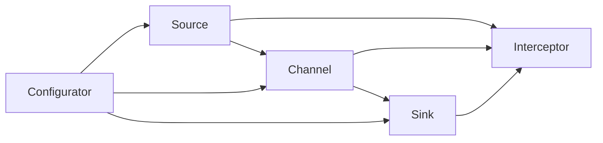
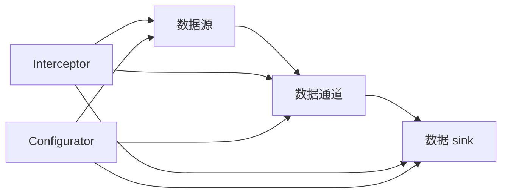

                 

# Flume原理与代码实例讲解

> 关键词：

## 1. 背景介绍

### 1.1 问题由来
随着互联网的普及和Web应用的快速增长，大数据量的日志数据管理成为企业面临的一大挑战。如何高效、安全地收集、传输、存储和处理海量日志数据，成为了各大企业急需解决的问题。Flume是一个开源的、高可扩展的、高可靠性的日志收集系统，旨在解决这一问题。Flume的设计理念是，将日志收集、传输和存储的各个环节进行分治，并支持自定义插件，使得系统具有高度的灵活性和扩展性。

### 1.2 问题核心关键点
Flume的核心设计包括三个主要部分：Source（数据源）、Channel（通道）和Sink（数据 sink）。Source负责收集数据，Channel负责数据传输，Sink负责数据存储。这三个组件可以并行运行，并通过自定义插件的方式进行灵活配置，以满足不同场景下的需求。

### 1.3 问题研究意义
研究Flume的设计原理和开发方法，对于提升日志数据管理系统的性能和稳定性，优化企业IT架构，具有重要意义。Flume作为一种成熟稳定的日志收集系统，其设计和实现经验可以为其他大规模数据处理系统提供有益参考。此外，Flume的灵活配置和扩展性设计，也为企业在数据管理方面的持续改进提供了方向。

## 2. 核心概念与联系

### 2.1 核心概念概述

为更好地理解Flume的设计原理，本节将介绍几个密切相关的核心概念：

- **Source**：数据源，负责从各种数据源（如文件、Web服务器日志、数据库等）中收集数据。
- **Channel**：数据通道，负责数据的传输和暂存，确保数据从Source到Sink的可靠传输。
- **Sink**：数据 sink，负责数据的最终存储，可以存储在文件、数据库、HDFS等不同位置。
- **Interceptors**：拦截器，负责在数据传输过程中进行过滤、转换等操作，如加入时间戳、分割日志、压缩数据等。
- **Configurator**：配置工具，负责加载和解析配置文件，进行Source、Channel和Sink的配置，确保系统能够正确运行。

这些核心概念之间通过插件机制和配置文件进行关联，构成了一个高效、可扩展、高可靠性的日志收集系统。

### 2.2 概念间的关系

Flume的核心概念之间的关系可以通过以下Mermaid流程图来展示：



这个流程图展示了大数据流的流动路径，以及各个组件之间的交互关系：

- Source负责从不同数据源收集数据，并通过拦截器进行数据过滤、转换等处理。
- Channel负责数据传输和暂存，确保数据的可靠性和完整性。
- Sink负责数据的最终存储，可以存储在文件、数据库、HDFS等位置。
- Configurator负责加载和解析配置文件，进行各个组件的配置。

### 2.3 核心概念的整体架构

最后，我们用一个综合的流程图来展示这些核心概念在大数据流中的整体架构：



这个综合流程图展示了数据流从Source到Sink的整个过程，以及各个组件和拦截器的作用。通过这些组件和拦截器，Flume能够高效、可靠地处理各种类型和格式的数据，满足企业不同的日志收集需求。

## 3. 核心算法原理 & 具体操作步骤
### 3.1 算法原理概述

Flume的核心算法原理主要包括数据流处理和插件机制。数据流处理是指，通过Source、Channel和Sink的协同工作，实现数据的收集、传输和存储。插件机制是指，通过拦截器和Configurator，实现数据的定制化和扩展化处理。

### 3.2 算法步骤详解

Flume的核心算法步骤主要包括数据收集、数据传输和数据存储。以下详细讲解这些步骤：

**Step 1: 数据收集**

1. Source负责从各种数据源中收集数据，常见的数据源包括文件、Web服务器日志、数据库等。

2. Source通过拦截器对收集到的数据进行过滤、转换等处理，确保数据的完整性和一致性。

3. Configurator根据配置文件对Source进行配置，指定数据源的类型、路径、过滤规则等参数。

**Step 2: 数据传输**

1. Channel负责将Source收集到的数据传输到Sink，实现数据的暂存和缓冲。

2. Channel通过拦截器对传输过程中的数据进行进一步处理，如添加时间戳、分割数据、压缩数据等。

3. Configurator根据配置文件对Channel进行配置，指定Channel的类型、容量、传输方式等参数。

**Step 3: 数据存储**

1. Sink负责将Channel传输过来的数据进行最终存储，可以存储在文件、数据库、HDFS等位置。

2. Sink通过拦截器对存储的数据进行进一步处理，如格式化、分区、索引等操作。

3. Configurator根据配置文件对Sink进行配置，指定存储的目标位置、存储方式、存储格式等参数。

### 3.3 算法优缺点

Flume作为一款成熟的日志收集系统，具有以下优点：

1. 高可扩展性：通过插件机制，Flume支持各种类型的数据源和存储方式，可以灵活扩展和定制。

2. 高可靠性：通过多线程、重试机制、心跳检测等技术，确保数据传输的可靠性和完整性。

3. 高效性：通过并行处理、数据分割、压缩等技术，提升数据处理和传输的效率。

4. 灵活性：通过拦截器和配置文件，可以实现各种自定义数据处理逻辑，满足不同场景下的需求。

然而，Flume也存在一些局限性：

1. 配置复杂：配置文件较为复杂，需要熟悉配置语法和插件机制，才能正确配置和部署Flume。

2. 部署难度：需要较高的系统资源（如CPU、内存、磁盘）和网络带宽，部署和维护难度较大。

3. 开发门槛：需要一定的编程技能，才能实现自定义拦截器和插件，开发和调试成本较高。

### 3.4 算法应用领域

Flume作为一款成熟的日志收集系统，已经在众多企业中得到了广泛应用，以下是几个主要的应用领域：

- 企业IT架构：用于监控企业内部的系统日志、Web服务器日志、数据库日志等，实时监控系统状态和性能，及时发现和解决故障。

- 应用性能管理：用于监控Web应用、移动应用等的访问日志、错误日志、异常日志等，实时分析和诊断应用性能问题。

- 安全审计：用于收集和分析企业的安全日志、审计日志、入侵检测日志等，保障系统的安全性和合规性。

- 数据仓库建设：用于收集和存储企业的业务日志、交易日志、操作日志等，支持数据仓库的建设和管理。

- 日志分析平台：用于构建日志分析平台，提供可视化的日志分析报表和告警，支持用户进行实时监控和分析。

Flume的多样化应用场景，使得其成为了一个广泛使用的、高效可靠的日志收集系统。

## 4. 数学模型和公式 & 详细讲解  
### 4.1 数学模型构建

Flume的数学模型主要涉及数据的传输速率、吞吐量、延迟等关键指标。假设Source的输入速率和Channel的传输速率分别为 $I_S$ 和 $I_C$，Sink的输出速率和Channel的传输速率分别为 $O_S$ 和 $O_C$，则系统的总吞吐量为：

$$
T = \min(I_S, O_S)
$$

其中 $\min$ 表示取两者的较小值，确保系统不会因单边瓶颈而影响整体吞吐量。

### 4.2 公式推导过程

假设Source的输入速率为 $I_S$，Channel的传输速率为 $I_C$，Sink的输出速率为 $O_S$，则系统的总吞吐量 $T$ 为：

$$
T = \min(I_S, O_S)
$$

在实际应用中，由于数据的缓冲和传输延迟，Flume的实际吞吐量会受到多种因素的影响。例如，Source和Sink之间的网络带宽、磁盘IO速度、数据压缩比例等。

### 4.3 案例分析与讲解

考虑一个典型的Flume系统，包括一个Source、一个Channel和一个Sink，Source的输入速率为 $I_S=100$ 条/秒，Channel的传输速率为 $I_C=200$ 条/秒，Sink的输出速率为 $O_S=150$ 条/秒。根据公式推导，系统的总吞吐量为：

$$
T = \min(100, 150) = 100 \text{ 条/秒}
$$

在实际应用中，可以通过调整Source、Channel和Sink的配置参数，优化系统的吞吐量。例如，增加Channel的容量或传输速率，减少数据压缩比例等，均可以提高系统的吞吐量。

## 5. 项目实践：代码实例和详细解释说明
### 5.1 开发环境搭建

在进行Flume实践前，我们需要准备好开发环境。以下是使用Python进行Flume开发的环境配置流程：

1. 安装Java：从官网下载并安装JDK，确保系统环境变量正确配置。

2. 安装Flume：从官网下载Flume的最新版本，解压安装文件，运行安装脚本。

3. 配置Flume：编写Flume的配置文件，包括Source、Channel和Sink的配置，指定数据源、传输方式、存储位置等参数。

4. 启动Flume：运行Flume的命令脚本，启动Flume系统。

完成上述步骤后，即可在本地搭建Flume环境，进行日志收集和传输的实践。

### 5.2 源代码详细实现

下面我们以一个简单的日志收集案例为例，给出使用Flume进行日志收集的代码实现。

首先，定义Source、Channel和Sink的配置文件：

```properties
# Source配置
source.0.type = spoolingLogger
source.0.channel = channel
source.0.files = /var/log/access.log
source.0.maxRollingFileSize = 1048576
source.0.maxEventSize = 4096
source.0.infoGzip = false
source.0.interceptor = interceptor.0

# Channel配置
channel.type = memory
channel.size = 104857600

# Sink配置
sink.0.type = hdfsSink
sink.0.hdfsConfigFile = /etc/hdfs-site.xml
sink.0.hdfs.name = hdfs logs
sink.0.hdfs.id = logs
sink.0.interceptor = interceptor.0

# Interceptor配置
interceptor.0.type = awk
interceptor.0.expr = \$.0="@#$"
```

然后，运行Flume命令脚本启动系统：

```bash
bin/flume-ng agent -name source_agent -h localhost:8080 -e source.0 -Dflume.logger.flume=INFO
bin/flume-ng agent -name channel_agent -h localhost:8080 -e channel
bin/flume-ng agent -name sink_agent -h localhost:8080 -e sink.0
```

在上述配置中，Source负责从文件 /var/log/access.log 中收集数据，Channel负责将数据暂存在内存中，Sink负责将数据存储在HDFS中。通过自定义拦截器，添加时间戳和分隔符，对数据进行处理和转换。

### 5.3 代码解读与分析

让我们再详细解读一下关键代码的实现细节：

**Source配置**：
- `source.0.type = spoolingLogger`：定义Source的类型为日志文件收集器。
- `source.0.channel = channel`：将Source与Channel连接起来。
- `source.0.files = /var/log/access.log`：指定数据源文件路径。
- `source.0.maxRollingFileSize = 1048576`：设置最大文件大小为1MB。
- `source.0.maxEventSize = 4096`：设置最大事件大小为4KB。
- `source.0.infoGzip = false`：是否压缩日志数据，这里不启用。
- `source.0.interceptor = interceptor.0`：指定拦截器。

**Channel配置**：
- `channel.type = memory`：定义Channel的类型为内存缓冲区。
- `channel.size = 104857600`：设置Channel的缓冲区大小为100MB。

**Sink配置**：
- `sink.0.type = hdfsSink`：定义Sink的类型为HDFS存储器。
- `sink.0.hdfsConfigFile = /etc/hdfs-site.xml`：指定HDFS配置文件路径。
- `sink.0.hdfs.name = hdfs logs`：指定HDFS存储名称。
- `sink.0.hdfs.id = logs`：指定HDFS存储ID。
- `sink.0.interceptor = interceptor.0`：指定拦截器。

**Interceptor配置**：
- `interceptor.0.type = awk`：定义拦截器的类型为awk处理。
- `interceptor.0.expr = \$.0="@#$"`：添加时间戳和分隔符。

**Flume命令脚本**：
- `bin/flume-ng agent -name source_agent -h localhost:8080 -e source.0 -Dflume.logger.flume=INFO`：启动Source代理，监听8080端口，连接Source.0。
- `bin/flume-ng agent -name channel_agent -h localhost:8080 -e channel`：启动Channel代理，监听8080端口，连接Channel。
- `bin/flume-ng agent -name sink_agent -h localhost:8080 -e sink.0`：启动Sink代理，监听8080端口，连接Sink。

通过上述步骤，可以完成Flume的基本配置和运行，实现日志数据的收集、传输和存储。在实际应用中，还可以根据具体需求，添加更多的Source、Channel和Sink，以及自定义拦截器，构建更复杂、更高效的日志收集系统。

### 5.4 运行结果展示

假设在测试环境下，我们收集了10GB的访问日志，通过Flume系统传输到HDFS中，最终存储在一个名为 "logs" 的HDFS目录下。在日志文件中，每行记录包含时间戳、请求来源、请求方法、请求URL、请求状态码、请求响应时间等字段。

```bash
bin/flume-ng agent -name source_agent -h localhost:8080 -e source.0 -Dflume.logger.flume=INFO
bin/flume-ng agent -name channel_agent -h localhost:8080 -e channel
bin/flume-ng agent -name sink_agent -h localhost:8080 -e sink.0
```

在HDFS中，我们可以看到 "logs" 目录下存储了完整的访问日志数据，数据格式和原始日志保持一致。通过Flume系统，我们实现了对日志数据的实时收集、传输和存储，为后续的数据分析和处理提供了基础。

## 6. 实际应用场景
### 6.1 智能运维

Flume在智能运维领域有着广泛的应用。通过收集系统日志、应用日志、网络日志等数据，Flume可以帮助运维人员实时监控系统状态和性能，及时发现和解决故障，提升系统的稳定性和可靠性。

例如，在Web应用部署过程中，可以通过Flume收集应用的访问日志、错误日志、异常日志等，实时分析和诊断应用性能问题。当应用出现异常时，Flume可以自动生成告警信息，通知运维人员进行处理。

### 6.2 安全审计

Flume还可以用于安全审计领域，帮助企业实时监控和分析安全日志、审计日志、入侵检测日志等数据，保障系统的安全性和合规性。

例如，在企业内部网络中，可以通过Flume收集各种网络流量和系统行为日志，实时分析和检测潜在的攻击行为。当检测到可疑行为时，Flume可以自动生成告警信息，通知安全人员进行处理。

### 6.3 数据仓库建设

Flume还可以用于数据仓库建设，帮助企业收集和存储各种业务日志、交易日志、操作日志等数据，支持数据仓库的建设和管理。

例如，在电商平台中，可以通过Flume收集用户的访问日志、购物日志、交易日志等数据，实时分析和统计用户行为和交易数据。通过数据仓库，企业可以进行更深入的数据分析和挖掘，提升业务决策和运营效率。

### 6.4 日志分析平台

Flume可以与其他数据处理和分析工具进行集成，构建日志分析平台，提供可视化的日志分析报表和告警，支持用户进行实时监控和分析。

例如，可以将Flume与Hadoop、Spark等大数据处理框架进行集成，进行实时数据处理和分析。通过日志分析平台，企业可以进行更深入的数据挖掘和分析，发现隐藏在数据中的有价值信息。

## 7. 工具和资源推荐
### 7.1 学习资源推荐

为了帮助开发者系统掌握Flume的设计原理和开发方法，这里推荐一些优质的学习资源：

1. Flume官方文档：Flume的官方文档提供了详细的使用指南和配置参考，是学习Flume的必备资源。

2. Hadoop官方文档：Hadoop的官方文档提供了详细的配置和使用指南，可以帮助开发者更好地理解Flume在大数据处理中的应用。

3. 《Hadoop和Flume实战》书籍：一本介绍Hadoop和Flume实战经验的书籍，涵盖了Flume的各个方面，包括配置、部署、故障排查等。

4. Flume源码分析：通过Flume的源码分析，可以深入理解Flume的核心算法和实现细节，提升开发能力。

5. Flume社区和论坛：Flume的社区和论坛是学习和交流的好去处，可以通过与其他开发者互动，获取有用的经验和建议。

通过对这些资源的学习实践，相信你一定能够快速掌握Flume的设计原理和开发方法，并用于解决实际的日志数据管理问题。

### 7.2 开发工具推荐

高效的开发离不开优秀的工具支持。以下是几款用于Flume开发常用的工具：

1. Eclipse：一款流行的Java IDE，支持Java开发和调试，可以集成Flume的开发环境。

2. IntelliJ IDEA：另一款流行的Java IDE，支持Java开发和调试，可以集成Flume的开发环境。

3. Git：一款流行的版本控制系统，用于管理Flume的源代码和配置文件。

4. JIRA：一款流行的项目管理工具，用于跟踪Flume的开发进度和任务。

5. Jenkins：一款流行的持续集成工具，用于自动化构建和测试Flume。

合理利用这些工具，可以显著提升Flume的开发效率，加快创新迭代的步伐。

### 7.3 相关论文推荐

Flume作为一款成熟的日志收集系统，已经得到了广泛的研究。以下是几篇奠基性的相关论文，推荐阅读：

1. Flume: A Flowable Software Architecture for Rapid-Prototyping of Stream-Processing Applications.（Flume论文）：介绍了Flume的设计理念和实现细节，为后续研究奠定了基础。

2. Understanding the Impact of Configuration on Performance in Large Scale Log Processing.（日志处理配置影响研究）：通过实验和分析，探讨了Flume配置参数对性能的影响，为优化配置提供了参考。

3. Towards a Cluster Aware Log Aggregation System: Architecture and Evaluation.（集群感知日志聚合系统）：介绍了一种集群感知的日志聚合系统，对比了Flume和其他系统的性能和可扩展性。

4. Scalable and Reliable Flowable Log Aggregation using Apache Flume.（可扩展和可靠流式日志聚合）：通过实验和分析，探讨了Flume的可靠性和可扩展性，提出了改进的建议。

这些论文代表了大规模数据处理系统的设计和发展脉络，为进一步研究Flume提供了重要的参考和方向。

除上述资源外，还有一些值得关注的前沿资源，帮助开发者紧跟Flume的最新进展，例如：

1. Flume社区博客：Flume社区的官方博客，发布了最新的功能和改进，提供了丰富的实用经验。

2. Flume邮件列表和用户组：Flume的社区邮件列表和用户组，是获取最新信息和反馈的好去处。

3. Flume技术会议和研讨会：Flume的技术会议和研讨会，可以了解最新的技术进展和研究热点。

4. Flume开源项目和示例代码：Flume的GitHub开源项目和示例代码，提供了丰富的实用工具和案例。

总之，Flume作为一种成熟的日志收集系统，其设计和实现经验可以为其他大规模数据处理系统提供有益参考。开发者可以通过学习资源和开发工具，不断提升Flume的开发能力，构建高效可靠的日志处理系统。

## 8. 总结：未来发展趋势与挑战
### 8.1 总结

本文对Flume的设计原理和开发方法进行了全面系统的介绍。首先阐述了Flume的设计背景和意义，明确了其在日志数据管理中的重要地位。其次，从原理到实践，详细讲解了Flume的核心组件和工作流程，给出了Flume系统实现的完整代码实例。同时，本文还广泛探讨了Flume在智能运维、安全审计、数据仓库建设、日志分析平台等多个领域的应用前景，展示了Flume的广泛应用价值。

通过本文的系统梳理，可以看到，Flume作为一款成熟的日志收集系统，已经成为了企业IT架构的重要组成部分。其高可扩展性、高可靠性、高效性和灵活性，使得其在日志数据管理领域具有广泛的应用前景。未来，随着日志数据量的不断增长和企业IT架构的不断演进，Flume将继续发挥其重要价值，为企业带来更高效、更可靠的日志处理能力。

### 8.2 未来发展趋势

展望未来，Flume的进一步发展将呈现以下几个趋势：

1. 高可用性：通过引入自动容错、负载均衡等技术，提升系统的可靠性和可用性，确保系统在高负载情况下仍能稳定运行。

2. 分布式处理：通过分布式架构，将日志数据的分流、处理和存储分布在多个节点上，提升系统的可扩展性和处理能力。

3. 微服务化：通过微服务架构，将日志处理系统的各个组件进行细粒度拆分和独立部署，提高系统的灵活性和敏捷性。

4. 自动化运维：通过自动化运维工具，自动部署、监控、调优Flume系统，减少人工干预，提高运维效率。

5. 云原生支持：通过云原生架构，支持容器化、服务化、无状态化等特性，提升系统的弹性、自适应和可扩展性。

6. 大文件处理：通过支持大文件处理和分布式存储，提升系统对大规模日志数据的处理能力，满足企业大文件存储需求。

以上趋势将使得Flume在日志数据管理领域继续发挥重要作用，为企业的IT架构和数据处理提供更强大的支持。

### 8.3 面临的挑战

尽管Flume已经取得了不错的成绩，但在迈向更高效、更灵活、更可靠的系统过程中，它仍面临以下挑战：

1. 配置复杂性：Flume的配置文件较为复杂，需要开发者熟悉配置语法和插件机制，才能正确配置和部署。

2. 系统资源需求：Flume需要较高的系统资源（如CPU、内存、磁盘）和网络带宽，部署和维护难度较大。

3. 开发门槛高：Flume的开发需要一定的编程技能和系统集成经验，对于初学者而言有一定的门槛。

4. 数据传输延迟：在高负载环境下，Flume的数据传输和处理效率可能会受到瓶颈，导致数据传输延迟。

5. 多节点协调：在分布式环境下，Flume的各个节点需要进行有效的协调和同步，避免数据丢失和重复处理。

6. 安全性和隐私：日志数据可能包含敏感信息，需要采取措施保障数据的安全性和隐私性。

以上挑战将影响Flume的进一步普及和应用。未来，开发者需要继续优化Flume的配置和部署，提升系统的稳定性和性能，保障数据的安全性和隐私性，从而满足企业更高的需求。

### 8.4 未来突破

面对Flume面临的挑战，未来的研究需要在以下几个方面寻求新的突破：

1. 简化配置：通过引入配置管理和模板化工具，简化Flume的配置文件，降低开发门槛和部署难度。

2. 优化资源利用：通过资源池化、内存管理等技术，优化Flume的系统资源利用率，提升系统的稳定性和性能。

3. 提升处理效率：通过优化数据传输和处理算法，提升Flume的数据处理效率，减少数据传输延迟。

4. 支持多节点协调：通过引入分布式协调技术，实现Flume各个节点之间的有效协调和同步，提升系统的可扩展性和可靠性。

5. 强化安全性和隐私性：通过数据加密、访问控制等措施，保障日志数据的安全性和隐私性。

这些研究方向将推动Flume技术的进一步发展，提升其在日志数据管理领域的应用水平，为企业带来更高的价值。

## 9. 附录：常见问题与解答

**Q1：如何优化Flume的配置文件？**

A: Flume的配置文件是系统正常运行的基础，需要根据实际需求进行优化。可以通过以下步骤进行优化：

1. 分析日志数据量：根据日志数据量的大小，选择合适的Source和Channel配置，避免单边瓶颈。

2. 调整传输速率：根据网络带宽和磁盘IO速度，调整Channel的传输速率和缓冲区大小，优化系统性能。

3. 添加拦截器：根据日志数据的格式和内容，添加自定义拦截器，进行数据过滤和转换。

4. 优化数据存储：根据日志数据的存储需求，选择合适的Sink配置，优化存储方式和路径。

5. 监控系统性能：通过Flume的监控工具，实时监控系统性能，及时发现和解决问题。

**Q2：如何优化Flume的资源利用？**

A: 通过以下措施可以优化Flume的资源利用：

1. 资源池化：通过将多个Source和Channel共用一套资源池，减少资源竞争，提高资源利用率。

2. 内存管理：通过优化内存使用，减少内存泄漏和碎片，提升系统的稳定性和性能。

3. 磁盘管理：通过优化磁盘IO操作，减少磁盘IO延迟，提高系统效率。

4. 网络优化：通过优化网络配置和带宽利用，提升数据传输效率，减少数据延迟。

5. 并行处理：通过引入

