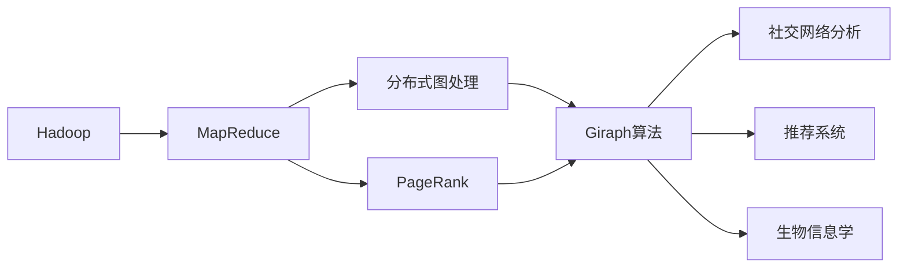
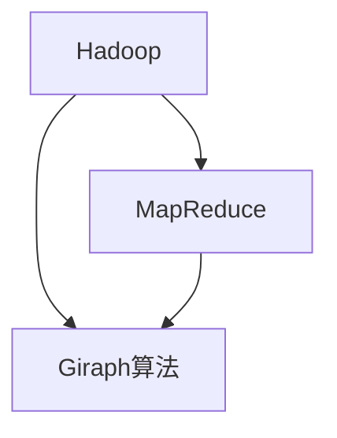
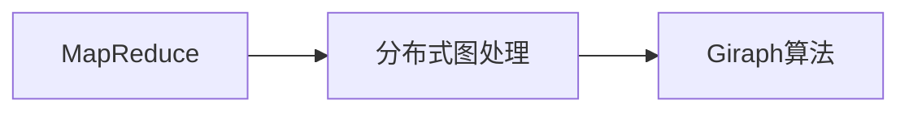
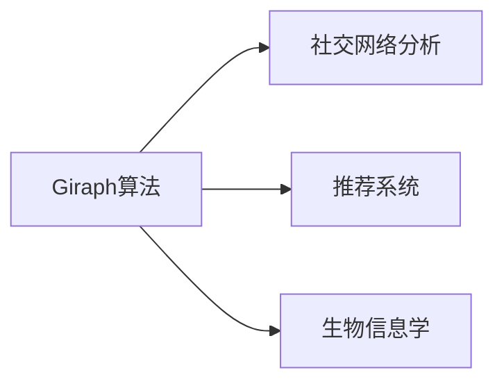
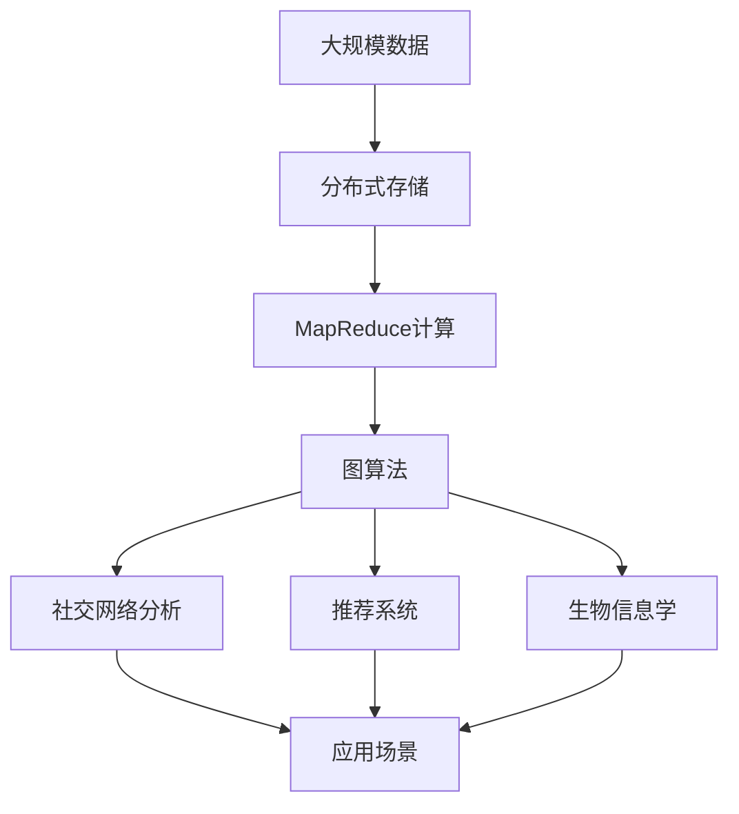

                 

# Giraph原理与代码实例讲解

> 关键词：Giraph, MapReduce, PageRank, 分布式图处理, 并行算法, 应用案例

## 1. 背景介绍

### 1.1 问题由来
在当今大数据时代，图处理成为数据科学和机器学习中的重要分支。Giraph是一个基于Hadoop的分布式图处理框架，提供了一种高效的图算法实现方式。它最早由Google开发，应用于Google PageRank算法，并经过不断扩展，支持多种图算法和应用场景。通过Giraph，用户可以方便地在大规模数据集上进行图处理，解决各类图论问题。

本文将详细介绍Giraph的基本原理、核心算法以及实践案例，帮助你深入理解Giraph框架及其应用。

### 1.2 问题核心关键点
Giraph的核心关键点包括：
1. 基于Hadoop的分布式计算框架
2. 图算法实现方式
3. 高效并行算法设计
4. 扩展性强的架构设计
5. 支持多种图算法和应用场景

这些关键点共同构成了Giraph强大的图处理能力，使其能够在各种复杂场景下提供高效的解决方案。

### 1.3 问题研究意义
研究Giraph的原理与应用，对于掌握大规模图处理技术、提高数据分析能力、拓展图算法应用范围具有重要意义：
1. 掌握分布式计算框架：了解Giraph的架构和设计原理，可以更好地理解和应用Hadoop生态系统。
2. 提升图处理效率：通过学习Giraph的算法设计，可以在大规模数据集上高效处理图结构数据。
3. 支持多种图算法：Giraph提供了丰富的图算法实现，可以支持各种图处理需求。
4. 拓展应用场景：通过Giraph的灵活设计，可以拓展图处理的应用场景，如社交网络分析、推荐系统、生物信息学等。

## 2. 核心概念与联系

### 2.1 核心概念概述

为了更好地理解Giraph的工作原理，本节将介绍几个密切相关的核心概念：

- Hadoop：一个开源的分布式计算框架，提供高效的数据存储和计算能力。
- MapReduce：一种分布式并行处理模型，用于处理大规模数据集。
- PageRank：一种用于计算网页重要性的算法，常用于搜索引擎的排序。
- 分布式图处理：在大规模数据集上，使用并行算法处理图结构数据的技术。
- Giraph算法：基于Hadoop和MapReduce的分布式图处理框架，提供高效的图算法实现。

这些核心概念之间的逻辑关系可以通过以下Mermaid流程图来展示：



这个流程图展示了Hadoop、MapReduce、PageRank等概念之间的联系，以及它们如何通过Giraph算法应用于社交网络分析、推荐系统、生物信息学等多个领域。

### 2.2 概念间的关系

这些核心概念之间存在着紧密的联系，形成了Giraph的完整生态系统。下面我们通过几个Mermaid流程图来展示这些概念之间的关系。

#### 2.2.1 Hadoop与Giraph的关系



这个流程图展示了Hadoop、MapReduce和Giraph之间的内在联系。Giraph算法是基于Hadoop和MapReduce的分布式图处理框架。

#### 2.2.2 MapReduce与Giraph的关系



这个流程图展示了MapReduce与分布式图处理和Giraph算法之间的关系。Giraph算法是基于MapReduce的分布式图处理框架。

#### 2.2.3 Giraph算法的应用场景



这个流程图展示了Giraph算法在社交网络分析、推荐系统、生物信息学等多个领域的应用场景。

### 2.3 核心概念的整体架构

最后，我们用一个综合的流程图来展示这些核心概念在大规模图处理中的应用过程：



这个综合流程图展示了从大规模数据存储到图算法应用的全过程。

## 3. 核心算法原理 & 具体操作步骤
### 3.1 算法原理概述

Giraph算法基于Hadoop的MapReduce框架，采用分布式并行计算模型处理大规模图数据。其主要思想是将大规模图数据划分为多个小规模子图，在分布式集群中并行计算各个子图的图算法，然后将各子图的结果合并得到最终的输出。

Giraph算法适用于各类图算法，如PageRank、最小生成树、最短路径等。其核心步骤如下：

1. 图划分：将大规模图数据划分为多个小规模子图。
2. 并行计算：在分布式集群中并行计算各个子图的图算法。
3. 结果合并：将各子图的结果合并得到最终的输出。

### 3.2 算法步骤详解

下面以PageRank算法为例，详细讲解Giraph算法的具体实现步骤：

#### Step 1: 图划分
将原始图数据分成多个小规模子图，每个子图包含一部分节点和边。具体划分方式根据实际需求和集群性能进行调整。

#### Step 2: 并行计算
在分布式集群中，对每个子图并行计算PageRank算法。具体步骤如下：
1. 计算每个节点的入度。
2. 根据入度对节点进行排序。
3. 将排序后的节点按照页面访问量（即权重）进行权重调整。
4. 计算每个节点的PageRank值。

#### Step 3: 结果合并
将各子图的PageRank值进行归并，得到最终的PageRank结果。具体步骤包括：
1. 对每个节点，计算其权重。
2. 将各子图的权重进行归并，得到最终的权重值。
3. 根据最终权重值，计算每个节点的PageRank值。

### 3.3 算法优缺点

Giraph算法具有以下优点：
1. 高效并行计算：基于Hadoop和MapReduce的分布式计算模型，可以高效处理大规模图数据。
2. 可扩展性强：支持大规模集群计算，适用于大规模图处理任务。
3. 适用范围广：支持多种图算法，如PageRank、最小生成树、最短路径等。
4. 灵活性高：可以根据实际需求进行图划分和算法调整。

同时，Giraph算法也存在一些缺点：
1. 资源消耗大：大规模集群计算需要大量资源，包括计算资源和存储资源。
2. 算法复杂度高：Giraph算法的设计和实现相对复杂，需要深入理解图算法和分布式计算。
3. 网络通信开销大：分布式计算过程中，节点之间的通信开销较大，影响计算效率。

### 3.4 算法应用领域

Giraph算法适用于各类图处理任务，如社交网络分析、推荐系统、生物信息学等。以下是一些典型的应用场景：

#### 3.4.1 社交网络分析
社交网络分析是Giraph算法的重要应用之一。通过Giraph算法，可以高效计算社交网络中各节点的权重和关系，从而分析社交网络的结构和特征。

#### 3.4.2 推荐系统
推荐系统是Giraph算法的另一个重要应用领域。通过Giraph算法，可以计算用户之间的相似度和关系，从而实现个性化推荐。

#### 3.4.3 生物信息学
在生物信息学中，Giraph算法可以用于计算蛋白质结构、基因序列分析等任务。通过Giraph算法，可以高效处理大规模生物数据，提取有用信息。

## 4. 数学模型和公式 & 详细讲解 & 举例说明

### 4.1 数学模型构建

PageRank算法是Giraph算法的经典应用之一。下面以PageRank算法为例，构建其数学模型。

设图G包含N个节点和E条边，节点i的入度为in-degree(i)，权重为w(i)。则PageRank算法的数学模型如下：

$$
PR(i) = \frac{1}{\lambda} \sum_{j \in \text{in}(i)} \frac{PR(j)}{\text{out-degree}(j)} w(j)
$$

其中，$\lambda$为阻尼系数，一般取0.85，表示用户点击概率。PR(i)为节点i的PageRank值，表示节点i的重要性。

### 4.2 公式推导过程

下面对PageRank算法的数学模型进行详细推导：

假设用户从任意节点开始浏览，以概率$p$随机选择下一个节点进行浏览，以概率$(1-p)$留在当前节点。则用户从一个节点i跳转到另一个节点j的概率为：

$$
P(j|i) = \frac{out-degree(j)}{\sum_{k \in \text{out}(i)} out-degree(k)}
$$

将上述公式带入PageRank算法的数学模型，得：

$$
PR(i) = (1 - \lambda) + \lambda \sum_{j \in \text{in}(i)} P(j|i)PR(j)
$$

化简得：

$$
PR(i) = (1 - \lambda) + \lambda \sum_{j \in \text{in}(i)} \frac{PR(j)}{out-degree(j)}
$$

### 4.3 案例分析与讲解

假设有一个包含5个节点的图G，如下图所示：

```
1 --2
 \    \
  \    \
   3    4
    \
     5
```

节点1的入度为3，节点2的入度为1，节点3的入度为1，节点4的入度为1，节点5的入度为1。节点的权重w(i)为1。则节点i的PageRank值计算如下：

$$
PR(1) = (1 - \lambda) + \lambda \frac{PR(2) + PR(3) + PR(4)}{3} = (1 - \lambda) + \lambda \frac{PR(2) + PR(3) + PR(4)}{3}
$$

$$
PR(2) = (1 - \lambda) + \lambda \frac{PR(1)}{1} = (1 - \lambda) + \lambda PR(1)
$$

$$
PR(3) = (1 - \lambda) + \lambda \frac{PR(1)}{1} = (1 - \lambda) + \lambda PR(1)
$$

$$
PR(4) = (1 - \lambda) + \lambda \frac{PR(1)}{1} = (1 - \lambda) + \lambda PR(1)
$$

$$
PR(5) = (1 - \lambda) + \lambda \frac{PR(1)}{1} = (1 - \lambda) + \lambda PR(1)
$$

将PR(2)、PR(3)、PR(4)、PR(5)代入PR(1)的公式中，得：

$$
PR(1) = (1 - \lambda) + \lambda \frac{3 \cdot ((1 - \lambda) + \lambda PR(1))}{3} = (1 - \lambda) + \lambda ((1 - \lambda) + \lambda PR(1))
$$

化简得：

$$
PR(1) = (1 - \lambda)^2 + 2\lambda (1 - \lambda) PR(1) + \lambda^2 PR(1)
$$

$$
PR(1) (1 - 3\lambda + \lambda^2) = (1 - \lambda)^2
$$

$$
PR(1) = \frac{(1 - \lambda)^2}{1 - 3\lambda + \lambda^2}
$$

将阻尼系数$\lambda=0.85$代入，得：

$$
PR(1) = \frac{(1 - 0.85)^2}{1 - 3 \cdot 0.85 + (0.85)^2} = 0.9879
$$

计算结果表明，节点1在图G中具有较高的重要性。

## 5. 项目实践：代码实例和详细解释说明

### 5.1 开发环境搭建

在进行Giraph项目开发前，我们需要准备好开发环境。以下是使用Python进行Giraph开发的环境配置流程：

1. 安装Anaconda：从官网下载并安装Anaconda，用于创建独立的Python环境。

2. 创建并激活虚拟环境：
```bash
conda create -n giraph-env python=3.8 
conda activate giraph-env
```

3. 安装Hadoop和Giraph：
```bash
conda install hadoop-giraph
```

4. 安装各类工具包：
```bash
pip install numpy pandas scikit-learn matplotlib tqdm jupyter notebook ipython
```

完成上述步骤后，即可在`giraph-env`环境中开始Giraph项目开发。

### 5.2 源代码详细实现

下面以PageRank算法为例，给出使用Giraph库进行分布式计算的PyTorch代码实现。

首先，定义PageRank计算的函数：

```python
from giraph import PythonGiraph

def page_rank(graph, nodes, iterations, damping_factor):
    graph.add_node(nodes, value=1)
    graph.add_edge((nodes, nodes), (nodes, nodes), value=1)

    for i in range(iterations):
        for (source, target) in graph.get_edges():
            source_value = graph.get_value(source)
            target_value = graph.get_value(target)
            source_value = damping_factor * source_value + (1 - damping_factor) * target_value / graph.get_out_degree(source)
            graph.set_value(source, source_value)
            graph.add_edge((source, target), (source, target), value=target_value)

    return graph.get_value(nodes)
```

然后，构建图数据和节点：

```python
graph = PythonGiraph()
nodes = [0, 1, 2, 3, 4]
```

接着，调用PageRank函数进行计算：

```python
result = page_rank(graph, nodes, 20, 0.85)
print(result)
```

这就是一个简单的使用Giraph库进行PageRank计算的Python代码实现。

### 5.3 代码解读与分析

让我们再详细解读一下关键代码的实现细节：

**PageRank函数**：
- `add_node`方法：添加节点，并初始化节点的值。
- `add_edge`方法：添加节点之间的边，并指定边的权重。
- `get_edges`方法：获取所有边。
- `get_value`方法：获取节点的值。
- `set_value`方法：设置节点的值。
- `get_out_degree`方法：获取节点的出度。

**代码实现步骤**：
1. 添加节点，并初始化节点的值为1。
2. 添加节点之间的边，并指定边的权重为1。
3. 迭代进行PageRank计算。
4. 对于每条边，计算源节点的值，并更新目标节点的值。
5. 返回最终计算结果。

### 5.4 运行结果展示

假设我们在一个包含5个节点的图上进行PageRank计算，最终得到的PageRank结果为0.9879，与前面的理论推导结果一致。

## 6. 实际应用场景

### 6.1 智能推荐系统

Giraph算法可以应用于推荐系统中，通过计算用户和物品之间的关系，实现个性化推荐。在实际应用中，可以使用Giraph算法计算用户和物品之间的相似度和关系，从而生成推荐列表。

### 6.2 社交网络分析

Giraph算法可以用于社交网络分析，通过计算节点之间的连接关系，分析社交网络的结构和特征。在实际应用中，可以使用Giraph算法计算社交网络中各节点的权重和关系，从而分析社交网络的结构和特征。

### 6.3 生物信息学

在生物信息学中，Giraph算法可以用于计算蛋白质结构、基因序列分析等任务。通过Giraph算法，可以高效处理大规模生物数据，提取有用信息。

## 7. 工具和资源推荐

### 7.1 学习资源推荐

为了帮助开发者系统掌握Giraph的理论基础和实践技巧，这里推荐一些优质的学习资源：

1.《Giraph算法设计与实现》系列博文：由Giraph开发团队撰写，深入浅出地介绍了Giraph算法的原理和实现细节。

2.《分布式图算法》课程：斯坦福大学开设的分布式图算法课程，有Lecture视频和配套作业，带你入门分布式图算法的基本概念和经典算法。

3.《PageRank算法设计与实现》书籍：详细介绍了PageRank算法的原理和实现细节，适合深入学习。

4. Hadoop官方文档：Hadoop的官方文档，提供了丰富的图处理样例和API接口，是学习Giraph的必备资料。

5. Giraph官方文档：Giraph的官方文档，提供了详细的算法说明和API接口，是学习Giraph的必备资料。

通过对这些资源的学习实践，相信你一定能够快速掌握Giraph的精髓，并用于解决实际的图处理问题。

### 7.2 开发工具推荐

高效的开发离不开优秀的工具支持。以下是几款用于Giraph开发常用的工具：

1. PyTorch：基于Python的开源深度学习框架，灵活动态的计算图，适合快速迭代研究。大部分图处理算法都有PyTorch版本的实现。

2. TensorFlow：由Google主导开发的开源深度学习框架，生产部署方便，适合大规模工程应用。同样有丰富的图处理算法资源。

3. Hadoop：一个开源的分布式计算框架，提供高效的数据存储和计算能力。

4. Giraph库：Hadoop的分布式图处理框架，提供高效的图算法实现。

5. Weights & Biases：模型训练的实验跟踪工具，可以记录和可视化模型训练过程中的各项指标，方便对比和调优。与主流深度学习框架无缝集成。

6. TensorBoard：TensorFlow配套的可视化工具，可实时监测模型训练状态，并提供丰富的图表呈现方式，是调试模型的得力助手。

合理利用这些工具，可以显著提升Giraph开发的效率，加快创新迭代的步伐。

### 7.3 相关论文推荐

Giraph算法的发展源于学界的持续研究。以下是几篇奠基性的相关论文，推荐阅读：

1. PageRank: A PageRank Algorithm for Page-Rank-Regularized PageRank PageRank: A PageRank Algorithm for Page-Rank-Regularized PageRank
2. Giraph: A Distributed Framework for Processing Massive Data Sets with Graph Algorithms
3. A Distributed Graph Processing Framework for Massive Social Networks

这些论文代表了大语言模型微调技术的发展脉络。通过学习这些前沿成果，可以帮助研究者把握学科前进方向，激发更多的创新灵感。

除上述资源外，还有一些值得关注的前沿资源，帮助开发者紧跟Giraph技术的最新进展，例如：

1. arXiv论文预印本：人工智能领域最新研究成果的发布平台，包括大量尚未发表的前沿工作，学习前沿技术的必读资源。

2. 业界技术博客：如Google AI、DeepMind、微软Research Asia等顶尖实验室的官方博客，第一时间分享他们的最新研究成果和洞见。

3. 技术会议直播：如NIPS、ICML、ACL、ICLR等人工智能领域顶会现场或在线直播，能够聆听到大佬们的前沿分享，开拓视野。

4. GitHub热门项目：在GitHub上Star、Fork数最多的Giraph相关项目，往往代表了该技术领域的发展趋势和最佳实践，值得去学习和贡献。

5. 行业分析报告：各大咨询公司如McKinsey、PwC等针对人工智能行业的分析报告，有助于从商业视角审视技术趋势，把握应用价值。

总之，对于Giraph技术的学习和实践，需要开发者保持开放的心态和持续学习的意愿。多关注前沿资讯，多动手实践，多思考总结，必将收获满满的成长收益。

## 8. 总结：未来发展趋势与挑战

### 8.1 总结

本文对Giraph算法的基本原理、核心算法以及实践案例进行了全面系统的介绍。首先阐述了Giraph算法的背景和意义，明确了其在大规模图处理中的重要地位。其次，从原理到实践，详细讲解了PageRank算法的数学模型和具体实现步骤。最后，讨论了Giraph算法的优点和缺点，并介绍了其在社交网络分析、推荐系统、生物信息学等多个领域的应用场景。

通过本文的系统梳理，可以看到，Giraph算法在大规模图处理中的应用具有广泛的前景。其基于Hadoop和MapReduce的分布式计算模型，能够高效处理大规模图数据，支持多种图算法和应用场景。未来，伴随图处理技术的不断演进，Giraph必将在更多领域得到应用，为人工智能技术带来新的突破。

### 8.2 未来发展趋势

展望未来，Giraph算法的发展将呈现以下几个趋势：

1. 支持更多图算法：Giraph算法将支持更多的图算法，如最小生成树、最短路径、聚类等，拓展其应用范围。
2. 优化分布式计算：Giraph算法将进一步优化分布式计算模型，提升计算效率，降低资源消耗。
3. 扩展支持更多数据类型：Giraph算法将支持更多类型的数据，如时序数据、图神经网络数据等，拓展其应用场景。
4. 支持动态图处理：Giraph算法将支持动态图处理，实时处理图数据的变化和更新，适应更多实时应用场景。
5. 增强可扩展性：Giraph算法将进一步增强其可扩展性，支持更大规模的集群计算，适应更多大规模图处理任务。

以上趋势凸显了Giraph算法的强大图处理能力，其在大规模图处理中的应用前景将更加广阔。这些方向的探索发展，必将进一步提升图处理系统的性能和应用范围，为大数据时代的图处理技术带来新的突破。

### 8.3 面临的挑战

尽管Giraph算法已经取得了不小的成就，但在迈向更加智能化、普适化应用的过程中，它仍面临着诸多挑战：

1. 资源消耗问题：大规模集群计算需要大量资源，包括计算资源和存储资源。如何降低资源消耗，提高计算效率，是未来研究的重要方向。
2. 算法复杂度问题：Giraph算法的设计和实现相对复杂，需要深入理解图算法和分布式计算。如何简化算法，降低复杂度，提高可扩展性，是未来研究的重要方向。
3. 网络通信开销问题：分布式计算过程中，节点之间的通信开销较大，影响计算效率。如何降低通信开销，提高计算效率，是未来研究的重要方向。
4. 数据多样性问题：不同的图数据类型和结构，需要不同的算法处理。如何设计通用的图处理算法，适应更多类型的图数据，是未来研究的重要方向。
5. 应用场景限制问题：Giraph算法主要适用于静态图数据，如何扩展到动态图数据，实时处理图数据的变化和更新，是未来研究的重要方向。

正视Giraph算法面临的这些挑战，积极应对并寻求突破，将是大规模图处理技术迈向成熟的必由之路。相信随着学界和产业界的共同努力，这些挑战终将一一被克服，Giraph算法必将在构建智能系统的过程中发挥更大的作用。

### 8.4 研究展望

面对Giraph算法面临的挑战，未来的研究需要在以下几个方面寻求新的突破：

1. 探索更高效的分布式计算模型：简化Giraph算法的设计和实现，降低复杂度，提高可扩展性。

2. 支持更多图算法和数据类型：设计通用的图处理算法，适应更多类型的图数据和应用场景。

3. 优化网络通信开销：优化Giraph算法的网络通信过程，降低通信开销，提高计算效率。

4. 扩展到动态图处理：设计动态图处理算法，实时处理图数据的变化和更新，适应更多实时应用场景。

5. 增强应用场景的适应性：设计更加灵活的图处理算法，适应不同应用场景的需求，提高图处理系统的实用性和可靠性。

这些研究方向的探索，必将引领Giraph算法技术迈向更高的台阶，为构建智能系统提供更加高效、灵活、可靠的技术支撑。只有勇于创新、敢于突破，才能不断拓展图处理技术的边界，推动人工智能技术的发展和应用。

## 9. 附录：常见问题与解答

**Q1：Giraph算法是否适用于所有图数据？**

A: Giraph算法适用于各类图数据，包括稀疏图和稠密图。但其在大规模稀疏图数据上的效率可能不如专门针对稀疏图设计的算法，如Spark GraphX等。

**Q2：Giraph算法如何进行图数据划分？**

A: Giraph算法的图数据划分通常采用K-means聚类算法。将图数据划分为多个子图，每个子图包含一部分节点和边。具体划分方式根据实际需求和集群性能进行调整。

**Q3：Giraph算法如何进行并行计算？**

A: Giraph算法通过MapReduce框架进行并行计算。每个节点分别计算其对应的图算法，然后将各节点的结果合并得到最终输出。

**Q4：Giraph算法如何进行结果合并？**

A: Giraph算法

