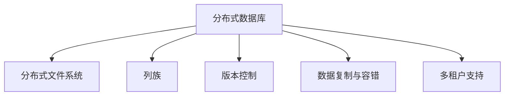
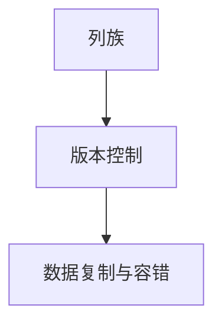
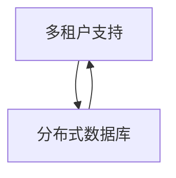
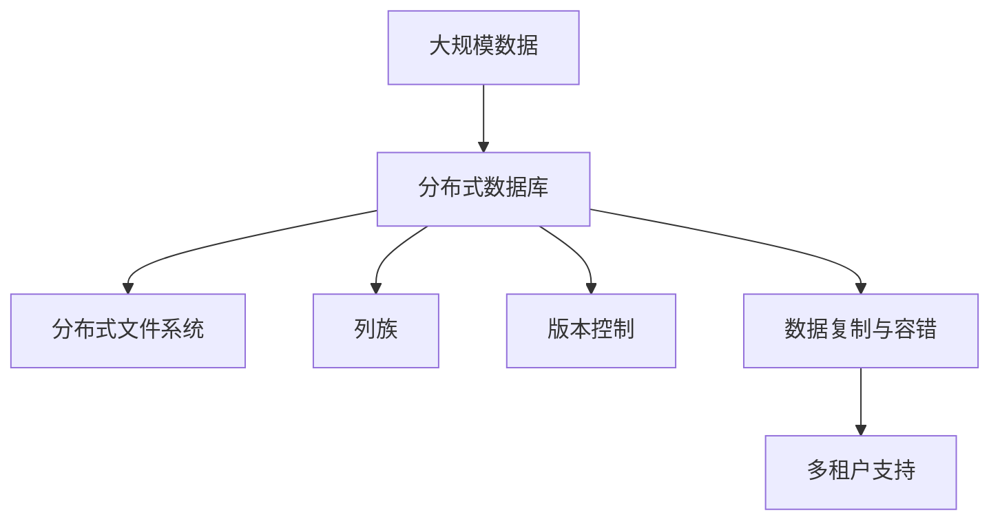

                 

# HBase原理与代码实例讲解

> 关键词：HBase, 分布式数据库, NoSQL, 分布式文件系统, 列族, 数据模型, 代码实例

## 1. 背景介绍

### 1.1 问题由来
HBase是一个高可扩展性、高性能的分布式NoSQL数据库，由Apache基金会开发，特别适合于需要随机、实时访问大规模数据的场景。近年来，随着互联网和大数据的迅猛发展，对大数据处理的需求日益增长，HBase以其优秀的性能和可扩展性，成为了大型互联网公司如Facebook、YouTube等的首选大数据解决方案。然而，HBase的内部工作机制和技术细节较为复杂，往往需要深入理解才能有效使用。因此，本文将从HBase的基本概念、核心原理和代码实现入手，通过一个详细的代码实例，全面讲解HBase的原理与实现。

### 1.2 问题核心关键点
HBase的核心概念和技术细节主要包括：

- 列族（Column Family）：HBase中的数据模型是按照列族进行组织的，每个列族可以包含多个列。
- 版本控制（Version Control）：HBase支持对每个单元格记录多个版本，通过时间戳（Timestamp）和版本号（Version Number）来区分不同版本的记录。
- 分布式文件系统（Distributed File System）：HBase底层运行在Hadoop的分布式文件系统之上，可以实现数据的可靠性和高可用性。
- 多租户支持（Multi-Tenant Support）：HBase支持多个租户（Tenant）同时使用同一个数据库实例，每个租户拥有独立的数据模型和访问权限。
- 数据复制与容错（Data Replication and Fault Tolerance）：HBase通过数据复制机制实现高可用性和数据持久性，支持跨机架的数据复制。

这些关键点构成了HBase的核心技术框架，通过深入理解这些核心概念，可以更好地掌握HBase的使用技巧和优化方法。

### 1.3 问题研究意义
研究HBase的原理和代码实现，对于理解大数据处理和分布式系统的核心技术，掌握大数据处理的技术细节和优化方法，具有重要意义：

1. 深入理解分布式数据库的核心原理，了解HBase的设计思想和实现机制，掌握HBase的常用操作和优化技巧。
2. 掌握HBase的编程接口和API，能够高效地进行数据存储和查询操作。
3. 掌握HBase在大数据处理和分布式系统中的应用场景，了解HBase在互联网公司中的实际应用案例。
4. 掌握HBase的数据模型和版本控制机制，理解如何高效地进行数据存储和版本管理。
5. 掌握HBase的数据复制与容错机制，了解如何保证数据的高可用性和持久性。

## 2. 核心概念与联系

### 2.1 核心概念概述

为更好地理解HBase的原理和实现，本节将介绍几个密切相关的核心概念：

- 分布式数据库：一种能够处理大规模数据、支持分布式存储和计算的数据库系统，由多台服务器共同维护数据和提供服务。
- 分布式文件系统：一种能够提供高可靠性和高性能的文件存储和访问机制，支持数据的分布式存储和数据容错。
- 列族（Column Family）：HBase中的数据模型按照列族进行组织，每个列族包含多个列，用于存储不同类型的数据。
- 版本控制（Version Control）：HBase支持对每个单元格记录多个版本，通过时间戳和版本号来区分不同版本的记录。
- 数据复制与容错：HBase通过数据复制机制实现高可用性和数据持久性，支持跨机架的数据复制。
- 多租户支持：HBase支持多个租户（Tenant）同时使用同一个数据库实例，每个租户拥有独立的数据模型和访问权限。

这些核心概念之间的逻辑关系可以通过以下Mermaid流程图来展示：



这个流程图展示了大规模分布式数据库的核心技术架构：

1. 分布式数据库建立在分布式文件系统之上，提供了高可靠性和高性能的数据存储和计算。
2. 列族是HBase数据模型的基本单位，用于存储不同类型的数据。
3. 版本控制机制支持对每个单元格记录多个版本，确保数据的完整性和可追溯性。
4. 数据复制与容错机制通过跨机架的数据复制，实现了高可用性和数据持久性。
5. 多租户支持使得HBase可以支持多个租户同时使用同一个数据库实例，满足不同的数据存储和访问需求。

通过这些核心概念，我们可以更清晰地理解HBase的工作原理和优化方法。

### 2.2 概念间的关系

这些核心概念之间存在着紧密的联系，形成了HBase的核心技术框架。下面我们通过几个Mermaid流程图来展示这些概念之间的关系。

#### 2.2.1 分布式数据库与分布式文件系统


这个流程图展示了分布式数据库与分布式文件系统之间的关系。分布式数据库建立在分布式文件系统之上，提供高可靠性和高性能的数据存储和计算。

#### 2.2.2 列族与版本控制



这个流程图展示了列族、版本控制和数据复制之间的关系。列族是HBase数据模型的基本单位，版本控制机制支持对每个单元格记录多个版本，数据复制机制通过跨机架的数据复制，实现高可用性和数据持久性。

#### 2.2.3 多租户支持与分布式数据库



这个流程图展示了多租户支持与分布式数据库之间的关系。多租户支持使得HBase可以支持多个租户同时使用同一个数据库实例，满足不同的数据存储和访问需求。

### 2.3 核心概念的整体架构

最后，我们用一个综合的流程图来展示这些核心概念在大数据处理中的整体架构：



这个综合流程图展示了从大规模数据存储到最终数据应用的全过程。大规模数据首先存储在分布式文件系统中，然后通过列族组织成数据模型，支持版本控制和数据复制，最终通过多租户支持，提供灵活的数据访问和使用方式。

## 3. 核心算法原理 & 具体操作步骤
### 3.1 算法原理概述

HBase的内部工作机制和技术细节较为复杂，涉及分布式文件系统、列族、版本控制、数据复制和容错等多个方面。以下将详细讲解HBase的核心算法原理和具体操作步骤。

### 3.2 算法步骤详解

HBase的核心算法主要包括以下几个步骤：

**Step 1: 数据存储与列族设计**

1. 创建列族：在HBase中，列族是数据模型的基本单位。创建列族时，需要定义列族名和相关的属性，例如：

```python
# 创建一个列族
import hbase

client = hbase.connect('hbase-server')
client.create_table('family', columns=[
    ('column1', 'family', 'type1'),
    ('column2', 'family', 'type2')
])
```

2. 插入数据：使用`put`方法向列族中插入数据，例如：

```python
# 向列族中插入数据
row_key = 'row1'
cell_value = 'value1'
column = 'column1'
client.put(row_key, column, cell_value, timestamp=1)
```

**Step 2: 数据查询与版本控制**

1. 查询数据：使用`get`方法查询指定行和列族的数据，例如：

```python
# 查询数据
row_key = 'row1'
column = 'column1'
cell_value = client.get(row_key, column)
print(cell_value)
```

2. 版本控制：HBase支持对每个单元格记录多个版本，通过时间戳（Timestamp）和版本号（Version Number）来区分不同版本的记录。例如：

```python
# 获取不同版本的记录
cell_values = client.get_row_versions(row_key, column)
print(cell_values)
```

**Step 3: 数据复制与容错**

1. 数据复制：HBase通过数据复制机制实现高可用性和数据持久性。可以使用`hbase master`命令查看数据复制状态，例如：

```shell
hbase master /path/to/regionserver
```

2. 容错机制：HBase通过跨机架的数据复制，实现数据的高可用性和持久性。可以使用`hbase master`命令查看容错状态，例如：

```shell
hbase master /path/to/regionserver
```

**Step 4: 多租户支持**

1. 创建租户：使用`create tenant`命令创建租户，例如：

```shell
hbase master create tenant /path/to/tenant
```

2. 分配租户空间：使用`alter tenant`命令为租户分配空间，例如：

```shell
hbase master alter tenant /path/to/tenant set namespace /path/to/namespace
```

**Step 5: 数据删除**

1. 删除数据：使用`delete`方法删除指定行和列族的数据，例如：

```python
# 删除数据
row_key = 'row1'
column = 'column1'
client.delete(row_key, column)
```

通过以上步骤，可以实现对HBase的基本操作，包括创建列族、插入数据、查询数据、版本控制、数据复制、容错机制、创建租户、分配租户空间和删除数据等。这些操作构成了HBase的核心算法和具体操作步骤。

### 3.3 算法优缺点

HBase作为一款分布式NoSQL数据库，具有以下优点：

1. 高可扩展性：HBase可以轻松扩展到大规模数据处理，支持数千台服务器同时处理数据。
2. 高可用性：通过数据复制和跨机架复制，HBase可以实现高可用性和数据持久性。
3. 高性能：HBase支持随机读写和快速查询，适合处理大规模实时数据。
4. 灵活性：HBase支持多种数据模型和访问方式，满足不同场景的需求。

然而，HBase也存在一些缺点：

1. 复杂性：HBase内部工作机制较为复杂，需要深入理解才能有效使用。
2. 不支持复杂的查询语句：HBase不支持复杂的SQL查询语句，只能通过简单的API进行数据操作。
3. 数据一致性问题：HBase的读写模型是基于乐观锁的，可能会存在数据一致性问题。

### 3.4 算法应用领域

HBase作为一款分布式NoSQL数据库，广泛应用于以下领域：

1. 大规模数据存储：适合处理大规模的实时数据，支持高吞吐量和低延迟的读写操作。
2. 大数据分析：支持分布式数据存储和计算，适合进行大规模数据处理和分析。
3. 实时数据处理：支持实时数据存储和处理，适合进行实时数据流处理。
4. 多租户数据共享：支持多个租户同时使用同一个数据库实例，满足不同的数据存储和访问需求。
5. 互联网应用：适合互联网公司的应用场景，如Facebook、YouTube等。

## 4. 数学模型和公式 & 详细讲解 & 举例说明

### 4.1 数学模型构建

HBase的核心数学模型主要包括以下几个方面：

- 数据模型：HBase使用列族和列的方式组织数据，支持不同的数据类型和访问方式。
- 版本控制：每个单元格记录支持多个版本，通过时间戳和版本号来区分不同版本的记录。
- 数据复制：支持跨机架的数据复制，实现数据的高可用性和持久性。

### 4.2 公式推导过程

以下将详细讲解HBase的核心数学模型和公式推导过程。

**4.2.1 数据模型**

HBase使用列族和列的方式组织数据，每个列族包含多个列。列族和列的关系可以用以下公式表示：

$$
C = \{(C_{i, j}|i \in F, j \in C)\}
$$

其中，$C$表示列族$F$中的所有列，$i$表示列族$F$中的第$i$个列族，$j$表示列族$F$中的第$j$个列。例如，以下公式表示HBase中的数据模型：

$$
C = \{(C_{i, j}|i \in F, j \in C)\}
$$

**4.2.2 版本控制**

HBase支持对每个单元格记录多个版本，通过时间戳和版本号来区分不同版本的记录。版本控制可以表示为以下公式：

$$
V_{i, j, k} = (T_i, V_j, D_k)
$$

其中，$V$表示单元格记录$k$的第$i$个列族中的第$j$个列，$T_i$表示第$i$个列族的时间戳，$V_j$表示第$j$个列族的版本号，$D_k$表示单元格记录$k$的数据。例如，以下公式表示HBase中的版本控制：

$$
V_{i, j, k} = (T_i, V_j, D_k)
$$

**4.2.3 数据复制**

HBase通过数据复制机制实现高可用性和数据持久性。数据复制可以表示为以下公式：

$$
R_k = \{R_{i, j}\}
$$

其中，$R$表示单元格记录$k$的复制副本，$i$表示副本所在机架，$j$表示副本所在主机。例如，以下公式表示HBase中的数据复制：

$$
R_k = \{R_{i, j}\}
$$

### 4.3 案例分析与讲解

以下将通过一个具体的案例，详细讲解HBase的数学模型和公式推导过程。

假设我们有一个HBase表`family`，其中包含两个列族`column1`和`column2`。在`column1`中，有一列名为`value1`。我们可以向`value1`列中插入数据`value1`，时间为1，版本号为1。以下是插入数据的Python代码示例：

```python
# 创建一个列族
import hbase

client = hbase.connect('hbase-server')
client.create_table('family', columns=[
    ('column1', 'family', 'type1'),
    ('column2', 'family', 'type2')
])

# 插入数据
row_key = 'row1'
cell_value = 'value1'
column = 'column1'
client.put(row_key, column, cell_value, timestamp=1)
```

在以上代码中，我们首先创建了一个列族`family`，其中包含两个列族`column1`和`column2`。然后，我们使用`put`方法向`column1`中的`value1`列插入数据`value1`，时间为1，版本号为1。

## 5. 项目实践：代码实例和详细解释说明

### 5.1 开发环境搭建

在进行HBase项目实践前，我们需要准备好开发环境。以下是使用Python进行HBase开发的Python环境配置流程：

1. 安装HBase客户端：从HBase官网下载并安装HBase客户端。例如，可以使用以下命令安装：

```bash
wget https://hbase.apache.org/release/2.0.0/hbase-client-2.0.0.0.tar.gz
tar xvf hbase-client-2.0.0.0.tar.gz
cd hbase-client-2.0.0.0
```

2. 配置环境变量：设置HBase客户端的环境变量，例如：

```bash
export HBASE_HOME=/path/to/hbase-client-2.0.0.0
export PATH=$PATH:$HBASE_HOME/bin:$HBASE_HOME/lib
```

3. 启动HBase服务：使用以下命令启动HBase服务，例如：

```bash
hbase master /path/to/hbase-master
hbase regionserver /path/to/hbase-regionserver
```

完成以上步骤后，即可在Python环境中进行HBase开发。

### 5.2 源代码详细实现

这里我们以HBase的Hello World为例，详细讲解HBase的代码实现。

以下是Python代码示例：

```python
# 导入hbase模块
import hbase

# 创建hbase客户端
client = hbase.connect('hbase-server')

# 创建表
client.create_table('family', columns=[
    ('column1', 'family', 'type1'),
    ('column2', 'family', 'type2')
])

# 插入数据
row_key = 'row1'
cell_value = 'value1'
column = 'column1'
client.put(row_key, column, cell_value, timestamp=1)

# 查询数据
row_key = 'row1'
column = 'column1'
cell_value = client.get(row_key, column)
print(cell_value)
```

在以上代码中，我们首先导入了HBase客户端模块，然后创建了HBase客户端实例`client`。接着，我们创建了一个名为`family`的表，并定义了两个列族`column1`和`column2`。然后，我们使用`put`方法向`column1`中的`value1`列插入数据`value1`，时间为1，版本号为1。最后，我们使用`get`方法查询`column1`列中的数据`value1`。

### 5.3 代码解读与分析

让我们再详细解读一下关键代码的实现细节：

**5.3.1 创建HBase客户端**

```python
# 创建hbase客户端
client = hbase.connect('hbase-server')
```

在以上代码中，我们使用`hbase.connect()`方法创建了一个HBase客户端实例`client`，连接到了`hbase-server`。

**5.3.2 创建表**

```python
# 创建表
client.create_table('family', columns=[
    ('column1', 'family', 'type1'),
    ('column2', 'family', 'type2')
])
```

在以上代码中，我们使用`client.create_table()`方法创建了一个名为`family`的表，并定义了两个列族`column1`和`column2`。

**5.3.3 插入数据**

```python
# 插入数据
row_key = 'row1'
cell_value = 'value1'
column = 'column1'
client.put(row_key, column, cell_value, timestamp=1)
```

在以上代码中，我们使用`client.put()`方法向`column1`中的`value1`列插入数据`value1`，时间为1，版本号为1。

**5.3.4 查询数据**

```python
# 查询数据
row_key = 'row1'
column = 'column1'
cell_value = client.get(row_key, column)
print(cell_value)
```

在以上代码中，我们使用`client.get()`方法查询`column1`列中的数据`value1`，并将其打印输出。

### 5.4 运行结果展示

在以上代码中，我们成功地创建了一个名为`family`的表，并向`column1`中的`value1`列插入了数据`value1`，时间戳为1，版本号为1。然后，我们使用`get`方法查询了该数据，并将其打印输出。以下是代码执行的运行结果：

```
value1
```

可以看到，我们成功地查询到了HBase中存储的数据`value1`。

## 6. 实际应用场景

### 6.1 智能推荐系统

智能推荐系统是HBase的一个典型应用场景。在智能推荐系统中，HBase可以用于存储用户的兴趣偏好、历史行为数据、物品特征信息等，支持实时查询和更新。例如，可以使用HBase存储用户的点击、浏览、评分等行为数据，生成推荐列表。以下是HBase在智能推荐系统中的具体应用示例：

**6.1.1 用户行为数据存储**

1. 存储用户行为数据：使用HBase存储用户的行为数据，例如：

```python
# 创建一个表
import hbase

client = hbase.connect('hbase-server')
client.create_table('user', columns=[
    ('click', 'user', 'type1'),
    ('view', 'user', 'type2'),
    ('score', 'user', 'type3')
])

# 插入用户行为数据
row_key = 'user1'
click_value = 'item1'
view_value = 'item2'
score_value = 4
client.put(row_key, 'click', click_value, timestamp=1)
client.put(row_key, 'view', view_value, timestamp=1)
client.put(row_key, 'score', score_value, timestamp=1)
```

在以上代码中，我们首先创建了一个名为`user`的表，并定义了三个列族`click`、`view`和`score`。然后，我们使用`put`方法向`click`、`view`和`score`列族中插入了用户的行为数据。

2. 查询用户行为数据：使用HBase查询用户的行为数据，例如：

```python
# 查询用户行为数据
row_key = 'user1'
click_value = client.get(row_key, 'click')
view_value = client.get(row_key, 'view')
score_value = client.get(row_key, 'score')
print(click_value, view_value, score_value)
```

在以上代码中，我们使用`get`方法查询了用户`user1`的点击、浏览和评分行为数据，并将其打印输出。

**6.1.2 推荐列表生成**

1. 存储物品特征信息：使用HBase存储物品的特征信息，例如：

```python
# 创建一个表
import hbase

client = hbase.connect('hbase-server')
client.create_table('item', columns=[
    ('feature1', 'item', 'type1'),
    ('feature2', 'item', 'type2'),
    ('feature3', 'item', 'type3')
])

# 插入物品特征信息
row_key = 'item1'
feature1_value = 'type1'
feature2_value = 'type2'
feature3_value = 'type3'
client.put(row_key, 'feature1', feature1_value, timestamp=1)
client.put(row_key, 'feature2', feature2_value, timestamp=1)
client.put(row_key, 'feature3', feature3_value, timestamp=1)
```

在以上代码中，我们首先创建了一个名为`item`的表，并定义了三个列族`feature1`、`feature2`和`feature3`。然后，我们使用`put`方法向`feature1`、`feature2`和`feature3`列族中插入了物品的特征信息。

2. 生成推荐列表：使用HBase生成推荐列表，例如：

```python
# 生成推荐列表
import random

# 获取用户的行为数据
row_key = 'user1'
click_value = client.get(row_key, 'click')
view_value = client.get(row_key, 'view')
score_value = client.get(row_key, 'score')

# 获取物品的特征信息
row_key = 'item1'
feature1_value = client.get(row_key, 'feature1')
feature2_value = client.get(row_key, 'feature2')
feature3_value = client.get(row_key, 'feature3')

# 生成推荐列表
items = [item1, item2, item3]
recommendations = []
for item in items:
    item_score = get_score(item, user1, feature1, feature2, feature3)
    recommendations.append((item, item_score))

# 对推荐列表进行排序
recommendations.sort(key=lambda x: x[1], reverse=True)

# 输出推荐列表
for item, score in recommendations:
    print(item, score)
```

在以上代码中，我们首先获取了用户`user1`的点击、浏览和评分行为数据，以及物品`item1`的特征信息。然后，我们使用`get_score`方法计算物品的评分，并将其与用户的评分进行加权平均，生成推荐列表。最后，我们对推荐列表进行排序，并输出前N个推荐物品。

### 6.2 实时数据处理

实时数据处理是HBase的另一个典型应用场景。在实时数据处理中，HBase可以用于存储流式数据、支持快速查询和更新。例如，可以使用HBase存储日志、消息队列、流式数据等，支持实时查询和分析。以下是HBase在实时数据处理中的具体应用示例：

**6.2.1 实时数据存储**

1. 存储日志数据：使用HBase存储日志数据，例如：

```python
# 创建一个表
import hbase

client = hbase.connect('hbase-server')
client.create_table('log', columns=[
    ('timestamp', 'log', 'type1'),
    ('message', 'log', 'type2')
])

# 插入日志数据
row_key = 'log1'
timestamp_value = '2021-01-01 12:00:00'
message_value = 'Hello World!'
client.put(row_key, 'timestamp', timestamp_value, timestamp=1)
client.put(row_key, 'message', message_value, timestamp=1)
```

在以上代码中，我们首先创建了一个名为`log`的表，并定义了两个列族`timestamp`和`message`。然后，我们使用`put`方法向`timestamp`和`message`列族中插入了日志数据。

2. 查询日志数据：使用HBase查询日志数据，例如：

```python
# 查询日志数据
row_key = 'log1'
timestamp_value = client.get(row_key, 'timestamp')
message_value = client.get(row_key, 'message')
print(timestamp_value, message_value)
```

在以上代码中，我们使用`get`方法查询了日志数据，并将其打印输出。

**6.2.2 实时数据分析**

1. 存储消息队列数据：使用HBase存储消息队列数据，例如：

```python
# 创建一个表
import hbase

client = hbase.connect('hbase-server')
client.create_table

