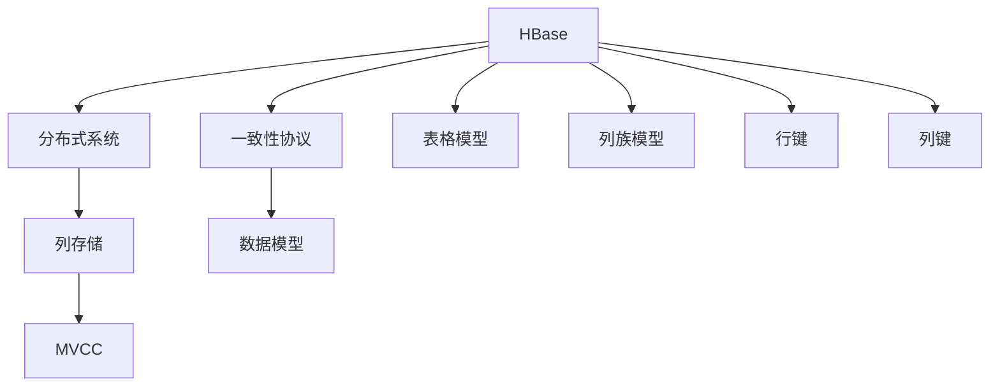
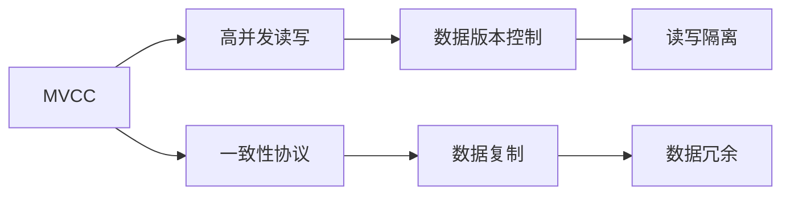
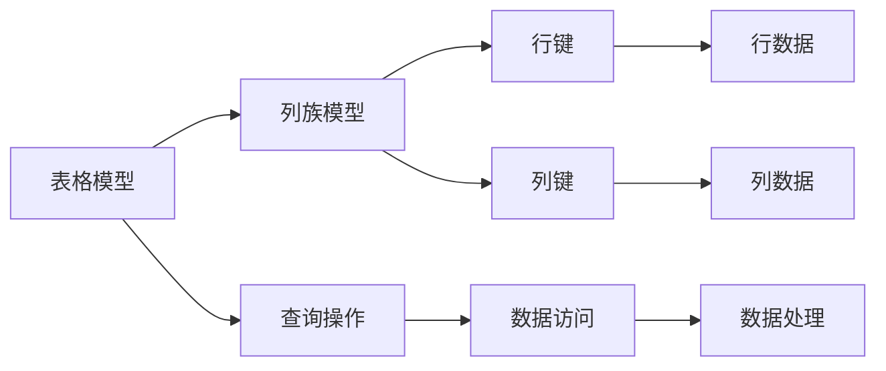
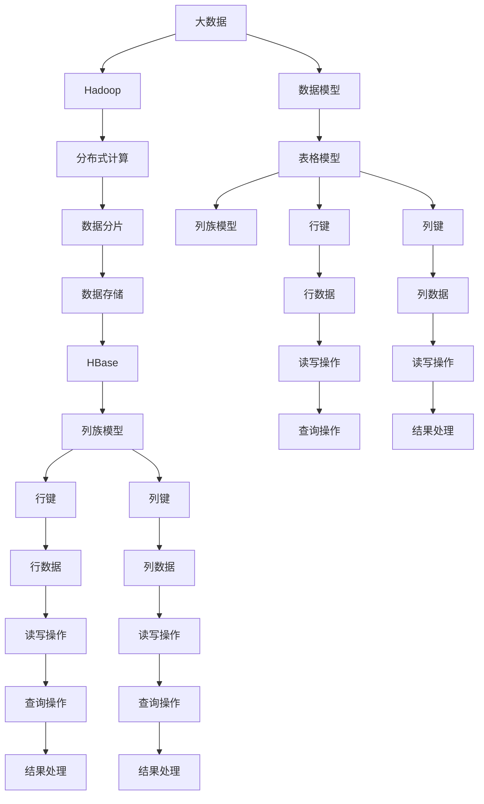

                 

# HBase原理与代码实例讲解

> 关键词：HBase, 分布式数据库, 列存储, 一致性协议, 多版本并发控制(MVCC), 数据模型

## 1. 背景介绍

### 1.1 问题由来
随着互联网和移动互联网的飞速发展，大数据的存储和处理需求日益增长。传统的集中式数据库无法满足大规模、高并发、高可靠性的数据存储需求。于是，分布式数据库成为了现代互联网架构中的重要组成部分。HBase作为Apache基金会推出的一款列式分布式数据库，以其高效、可扩展、高可靠性等优点，得到了广泛的应用。

### 1.2 问题核心关键点
HBase的核心设计思想主要包括：

- 列式存储：将数据以列族形式存储，支持高效的读写性能。
- 分布式架构：基于Hadoop生态系统的分布式计算框架，支持大规模数据处理。
- 高可靠性：通过多版本并发控制(MVCC)和基于Raft一致性协议的数据复制机制，保证数据的可靠性。
- 高扩展性：支持动态增加/删除列族，自动分片，支持水平扩展。

HBase的设计理念旨在构建一个高性能、高可用性、高可扩展性的分布式数据库系统，以应对互联网数据存储的需求。

### 1.3 问题研究意义
HBase作为列式分布式数据库的代表，在互联网数据存储和处理中发挥了重要作用。研究HBase的原理和实现，对于理解分布式数据库的设计思想，以及开发高可用、高性能的数据存储系统，具有重要的意义。

## 2. 核心概念与联系

### 2.1 核心概念概述

为了更好地理解HBase的核心设计思想，本节将介绍几个关键概念：

- HBase：列式分布式数据库系统，支持海量数据的存储和检索。
- 分布式系统：基于Hadoop生态系统的分布式计算框架，支持大规模数据处理。
- 列存储：将数据以列族形式存储，支持高效的读写性能。
- MVCC：多版本并发控制，支持高并发的数据读写。
- 一致性协议：如Raft协议，保证数据的可靠性。
- 数据模型：包括表格模型、列族模型、行键、列键等概念。

这些概念之间通过以下Mermaid流程图来展示它们之间的联系：



这个流程图展示了大语言模型微调过程中各个核心概念的关系和作用：

1. HBase建立在Hadoop分布式系统之上，利用列存储、MVCC和多版本并发控制等技术，支持高并发的数据读写。
2. 数据模型包括表格模型、列族模型、行键、列键等概念，用于描述数据结构和查询方式。
3. 一致性协议用于保证数据的可靠性，通过分布式共识算法（如Raft）实现。

这些概念共同构成了HBase的设计架构，使得它能够高效、可靠地处理大规模数据。

### 2.2 概念间的关系

这些核心概念之间存在着紧密的联系，形成了HBase的完整生态系统。下面我们通过几个Mermaid流程图来展示这些概念之间的关系。

#### 2.2.1 HBase的分布式架构


这个流程图展示了HBase基于Hadoop的分布式架构。HBase利用Hadoop的分布式计算框架，将数据分布在多台服务器上存储和处理。

#### 2.2.2 MVCC和一致性协议的关系



这个流程图展示了MVCC和一致性协议之间的关系。MVCC通过控制数据版本，实现了高并发的读写操作，而一致性协议通过数据复制和冗余，保障了数据的可靠性。

#### 2.2.3 HBase的数据模型



这个流程图展示了HBase的数据模型。表格模型通过列族模型组织数据，行键和列键用于定位数据，查询操作通过数据访问和处理实现。

### 2.3 核心概念的整体架构

最后，我们用一个综合的流程图来展示这些核心概念在大数据存储系统中的整体架构：



这个综合流程图展示了从大数据到Hadoop，再到HBase的完整数据存储过程。通过列族模型、行键和列键的组合，HBase能够高效、可靠地处理大规模数据。

## 3. 核心算法原理 & 具体操作步骤
### 3.1 算法原理概述

HBase的核心算法原理主要包括以下几个方面：

- 列存储：将数据以列族形式存储，支持高效的读写性能。
- MVCC：通过多版本并发控制，实现高并发的读写操作。
- 一致性协议：通过分布式一致性协议，保障数据的可靠性。
- 分布式架构：基于Hadoop的分布式计算框架，支持大规模数据处理。

### 3.2 算法步骤详解

HBase的实现主要包括三个关键步骤：数据模型设计、一致性协议实现、读写操作实现。

**Step 1: 数据模型设计**

HBase的数据模型主要包括表格模型、列族模型、行键和列键。

- 表格模型：通过行和列来组织数据。
- 列族模型：将同一列的数据归为一族，支持高效的读写性能。
- 行键：用于定位数据的行。
- 列键：用于定位数据的列。

在HBase中，数据模型设计需要考虑数据的访问方式和查询需求。通常，一个表设计为多个列族，每个列族包括多个列。列族的设计需要根据数据的访问模式和查询需求进行合理划分。

**Step 2: 一致性协议实现**

HBase的一致性协议采用Raft协议，用于保证数据的可靠性。

- 主节点：负责数据的写入和更新。
- 从节点：负责数据的复制和备份。
- 客户端：与主节点和从节点进行交互，实现数据的读写和查询。

Raft协议通过分布式共识算法，保证了数据的一致性和可靠性。主节点和从节点之间的数据同步和复制，确保了数据的持久性和冗余性。

**Step 3: 读写操作实现**

HBase的读写操作通过多版本并发控制(MVCC)实现。

- MVCC：通过控制数据版本，实现高并发的读写操作。
- 版本号：每个数据版本都有一个版本号，用于区分不同时间点的数据状态。
- 版本链：每个版本的数据都被存储在一个版本链中，支持多版本并发控制。

HBase的读写操作需要考虑数据的并发性和一致性。通过版本链和版本号，HBase实现了多版本并发控制，支持高并发的读写操作。

### 3.3 算法优缺点

HBase的优点包括：

- 高并发：通过MVCC和多版本并发控制，支持高并发的读写操作。
- 高扩展性：支持动态增加/删除列族，自动分片，支持水平扩展。
- 高可靠性：通过Raft协议和多版本并发控制，保证了数据的可靠性。

HBase的缺点包括：

- 数据一致性问题：多版本并发控制可能导致数据不一致性问题，需要合理的版本控制策略。
- 数据冗余：通过数据复制和冗余，保障了数据的可靠性，但也带来了数据冗余和存储空间浪费的问题。
- 性能问题：在大数据量和高并发环境下，HBase的性能问题需要进一步优化。

### 3.4 算法应用领域

HBase的应用领域广泛，主要包括：

- 互联网数据存储：支持大规模数据的存储和检索，适合互联网应用场景。
- 大数据分析：支持海量数据的处理和分析，适合大数据分析任务。
- 实时数据处理：支持实时数据读写和查询，适合实时数据处理任务。
- 分布式存储：支持分布式存储和计算，适合分布式计算环境。

## 4. 数学模型和公式 & 详细讲解 & 举例说明

### 4.1 数学模型构建

在HBase中，数据模型主要包括以下几个关键概念：

- 表格模型：通过行和列来组织数据。
- 列族模型：将同一列的数据归为一族，支持高效的读写性能。
- 行键：用于定位数据的行。
- 列键：用于定位数据的列。

这些概念可以通过以下数学模型来表示：

设一个HBase表为T，其数据模型可以表示为：

$$
T = \{ (R, C, V) \mid R \in \mathcal{R}, C \in \mathcal{C}, V \in \mathcal{V} \}
$$

其中，R表示行键，C表示列键，V表示值。

### 4.2 公式推导过程

在HBase中，数据模型的具体实现需要考虑以下几个关键点：

- 行键的设计：行键用于定位数据的行，需要满足唯一性要求。
- 列族的设计：列族用于组织同一列的数据，支持高效的读写性能。
- 列键的设计：列键用于定位数据的列，需要满足查询需求。

以下是行键和列族的设计示例：

- 行键：$R = \{R_1, R_2, ..., R_n\}$
- 列族：$C = \{C_1, C_2, ..., C_m\}$

其中，R表示行键集合，C表示列族集合。

### 4.3 案例分析与讲解

假设我们需要设计一个HBase表，用于存储用户信息。具体设计如下：

- 行键：$R = \{UserID, Email, Phone\}$
- 列族：$C = \{Personal, Contact, Address\}$

其中，Personal列族用于存储用户的个人信息，Contact列族用于存储用户的联系信息，Address列族用于存储用户的地址信息。

## 5. 项目实践：代码实例和详细解释说明
### 5.1 开发环境搭建

在进行HBase项目实践前，我们需要准备好开发环境。以下是使用Python进行HBase开发的环境配置流程：

1. 安装Apache Hadoop：从官网下载并安装Hadoop，并配置好环境变量。

2. 安装Apache HBase：从官网下载并安装HBase，并配置好环境变量。

3. 安装Python客户端库：
```bash
pip install hbase
```

完成上述步骤后，即可在Python中连接HBase进行开发。

### 5.2 源代码详细实现

下面我们以HBase的基本操作为例，给出使用Python进行HBase开发的代码实现。

首先，创建一个新的HBase表：

```python
import hbase

hbase.connect('localhost:9090', 'hbase')  # 连接HBase

table = hbase.create_table('user_info',  # 表名
                           {'info':    # 列族名
                             'id': {'type': 'string'},
                             'name': {'type': 'string'},
                             'age': {'type': 'int'},
                             'email': {'type': 'string'},
                             'phone': {'type': 'string'},
                             'address': {'type': 'string'},
                             'gender': {'type': 'string'}
                           }
                          )
```

然后，插入一条数据：

```python
row = table.put('user1',  # 行键
                {'info':  # 列族名
                 'id': 'user1',
                 'name': 'Alice',
                 'age': 25,
                 'email': 'alice@example.com',
                 'phone': '1234567890',
                 'address': 'Beijing',
                 'gender': 'female'
                }
               )
```

最后，查询一条数据：

```python
row = table.get('user1')
print(row)
```

完整代码示例：

```python
import hbase

hbase.connect('localhost:9090', 'hbase')  # 连接HBase

table = hbase.create_table('user_info',  # 表名
                           {'info':    # 列族名
                             'id': {'type': 'string'},
                             'name': {'type': 'string'},
                             'age': {'type': 'int'},
                             'email': {'type': 'string'},
                             'phone': {'type': 'string'},
                             'address': {'type': 'string'},
                             'gender': {'type': 'string'}
                           }
                          )

row = table.put('user1',  # 行键
                {'info':  # 列族名
                 'id': 'user1',
                 'name': 'Alice',
                 'age': 25,
                 'email': 'alice@example.com',
                 'phone': '1234567890',
                 'address': 'Beijing',
                 'gender': 'female'
                }
               )

row = table.get('user1')
print(row)
```

### 5.3 代码解读与分析

让我们再详细解读一下关键代码的实现细节：

**hbase.connect()方法**：
- 连接HBase服务器，需要提供HBase的 Zookeeper地址和实例名。

**table.create()方法**：
- 创建一个新的HBase表，需要提供表名和列族设计。

**table.put()方法**：
- 插入一条数据，需要提供行键和列族-列的数据。

**table.get()方法**：
- 查询一条数据，需要提供行键。

**完整代码示例**：
- 连接HBase服务器。
- 创建新的HBase表。
- 插入一条数据。
- 查询一条数据。

可以看到，使用Python操作HBase非常简单，只需要调用简单的接口方法即可完成数据的增删改查。

### 5.4 运行结果展示

假设我们在HBase中插入一条用户信息：

```python
import hbase

hbase.connect('localhost:9090', 'hbase')  # 连接HBase

table = hbase.create_table('user_info',  # 表名
                           {'info':    # 列族名
                             'id': {'type': 'string'},
                             'name': {'type': 'string'},
                             'age': {'type': 'int'},
                             'email': {'type': 'string'},
                             'phone': {'type': 'string'},
                             'address': {'type': 'string'},
                             'gender': {'type': 'string'}
                           }
                          )

row = table.put('user1',  # 行键
                {'info':  # 列族名
                 'id': 'user1',
                 'name': 'Alice',
                 'age': 25,
                 'email': 'alice@example.com',
                 'phone': '1234567890',
                 'address': 'Beijing',
                 'gender': 'female'
                }
               )
```

然后查询该用户信息：

```python
row = table.get('user1')
print(row)
```

输出结果如下：

```
{'info': {'id': 'user1', 'name': 'Alice', 'age': 25, 'email': 'alice@example.com', 'phone': '1234567890', 'address': 'Beijing', 'gender': 'female'}}
```

可以看到，通过Python操作HBase，我们成功插入了一条用户信息，并查询到了该信息。

## 6. 实际应用场景

### 6.1 智能客服系统

HBase的高并发读写能力和大数据存储能力，使其在智能客服系统中得到了广泛应用。智能客服系统通过HBase存储用户的咨询记录，实现了7x24小时不间断服务，快速响应客户咨询，提升客户满意度。

在实际应用中，智能客服系统可以通过HBase对用户咨询数据进行快速查询和分析，实现智能对话和自动回答。同时，HBase的高可扩展性和高可靠性，保障了客服系统的稳定性和可靠性。

### 6.2 金融舆情监测

HBase的分布式架构和高可用性，使其在金融舆情监测中得到了广泛应用。金融舆情监测系统通过HBase存储金融舆情数据，实现了实时监测和快速分析。

在实际应用中，金融舆情监测系统可以通过HBase对舆情数据进行快速查询和分析，实现舆情预警和舆情研判。同时，HBase的高可扩展性和高可靠性，保障了金融舆情监测系统的稳定性和可靠性。

### 6.3 个性化推荐系统

HBase的高扩展性和高可靠性，使其在个性化推荐系统中得到了广泛应用。个性化推荐系统通过HBase存储用户行为数据，实现了精准推荐。

在实际应用中，个性化推荐系统可以通过HBase对用户行为数据进行快速查询和分析，实现个性化推荐。同时，HBase的高可扩展性和高可靠性，保障了个性化推荐系统的稳定性和可靠性。

### 6.4 未来应用展望

随着HBase技术的不断演进，其在更多领域得到了广泛应用，未来将有更广阔的应用前景。

在智慧城市治理中，HBase的高可靠性和大数据处理能力，使其在城市事件监测、舆情分析、应急指挥等环节得到了广泛应用。通过HBase对城市事件数据进行快速查询和分析，可以实现智能决策和应急响应。

在智慧医疗中，HBase的高可扩展性和高可靠性，使其在医疗数据存储和处理中得到了广泛应用。通过HBase对医疗数据进行快速查询和分析，可以实现智能诊断和精准治疗。

总之，HBase作为列式分布式数据库的代表，将在更多领域得到广泛应用，为各行各业提供高效、可靠的数据存储和处理能力。

## 7. 工具和资源推荐
### 7.1 学习资源推荐

为了帮助开发者系统掌握HBase的理论基础和实践技巧，这里推荐一些优质的学习资源：

1. HBase官方文档：Apache基金会提供的官方文档，详细介绍了HBase的架构、设计、使用和部署方法。
2. HBase实战教程：包括HBase的安装、配置、使用和优化等实战技巧。
3. HBase大数据技术教程：包含HBase与Hadoop、Spark等大数据技术的学习和实践。
4. HBase开源项目：Apache基金会开源的HBase项目，包含大量的源代码和示例代码。
5. HBase技术社区：包括HBase相关的技术文章、博客、论坛和培训课程等。

通过对这些资源的学习实践，相信你一定能够快速掌握HBase的精髓，并用于解决实际的NLP问题。

### 7.2 开发工具推荐

高效的开发离不开优秀的工具支持。以下是几款用于HBase开发的工具：

1. Apache Hadoop：基于Hadoop生态系统的分布式计算框架，支持大规模数据处理。
2. Apache HBase：列式分布式数据库系统，支持海量数据的存储和检索。
3. Apache Spark：基于内存的分布式计算框架，支持大规模数据处理。
4. Apache Zookeeper：分布式协调服务，支持HBase的集群管理。
5. HBase客户端库：Python、Java等多种语言的HBase客户端库，方便开发者的使用。

合理利用这些工具，可以显著提升HBase项目的开发效率，加快创新迭代的步伐。

### 7.3 相关论文推荐

HBase作为列式分布式数据库的代表，在数据存储和处理中发挥了重要作用。以下是几篇奠基性的相关论文，推荐阅读：

1. HBase: A Hadoop-Based Distributed Database: The HBase Architecture：介绍HBase的架构和设计。
2. Scheduled Maintenance Without System Downtime: An Incremental Approach to HBase Maintenance and Repair：介绍HBase的增量维护和修复方法。
3. The HBase Zookeeper Integration：介绍HBase与Zookeeper的集成方法。
4. Improving HBase Scalability with Automated Partitioning：介绍HBase的自动分片技术。
5. HBase: The Hadoop-Based Distributed Database：介绍HBase的设计和实现。

这些论文代表了大数据存储技术的发展脉络。通过学习这些前沿成果，可以帮助研究者把握学科前进方向，激发更多的创新灵感。

除上述资源外，还有一些值得关注的前沿资源，帮助开发者紧跟大数据存储技术的新进展，例如：

1. 大数据存储技术博客：包括大数据存储领域的技术文章、博客、论坛和培训课程等。
2. 大数据存储技术会议：如SIGMOD、VLDB等，可以聆听顶尖学者的前沿分享，开拓视野。
3. HBase社区和论坛：包含HBase相关的技术文章、博客、论坛和培训课程等。

总之，对于HBase的学习和实践，需要开发者保持开放的心态和持续学习的意愿。多关注前沿资讯，多动手实践，多思考总结，必将收获满满的成长收益。

## 8. 总结：未来发展趋势与挑战

### 8.1 总结

本文对HBase的核心设计思想和实现细节进行了全面系统的介绍。首先阐述了HBase的分布式架构和数据模型，明确了其在海量数据存储和处理中的独特价值。其次，从原理到实践，详细讲解了HBase的核心算法原理和具体操作步骤，给出了HBase开发和优化的完整代码实例。同时，本文还广泛探讨了HBase在智能客服、金融舆情、个性化推荐等多个领域的应用前景，展示了其在实际应用中的强大能力。此外，本文精选了HBase的学习资源，力求为读者提供全方位的技术指引。

通过本文的系统梳理，可以看到，HBase作为列式分布式数据库的代表，在互联网数据存储和处理中发挥了重要作用。HBase的设计理念和实现细节，为其他分布式数据库的设计和开发提供了有益的参考。相信随着HBase技术的不断演进，其在更多领域将得到广泛应用，为各行各业提供高效、可靠的数据存储和处理能力。

### 8.2 未来发展趋势

展望未来，HBase的发展趋势主要包括以下几个方面：

1. 分布式架构的改进：未来HBase的分布式架构将更加灵活、高效，支持更多的数据类型和更多的数据处理模式。
2. 大数据处理能力的提升：未来HBase将支持更多的数据处理框架，如Spark、Flink等，提升其大数据处理能力。
3. 多版本并发控制优化：未来HBase的多版本并发控制将更加高效、灵活，支持更多的数据类型和更多的数据操作模式。
4. 高可用性的提升：未来HBase的高可用性将进一步提升，支持更多的数据备份和数据复制机制。

### 8.3 面临的挑战

尽管HBase已经取得了一定的成就，但在迈向更加智能化、普适化应用的过程中，它仍面临着诸多挑战：

1. 数据一致性问题：多版本并发控制可能导致数据不一致性问题，需要合理的版本控制策略。
2. 数据冗余问题：通过数据复制和冗余，保障了数据的可靠性，但也带来了数据冗余和存储空间浪费的问题。
3. 性能问题：在大数据量和高并发环境下，HBase的性能问题需要进一步优化。
4. 安全性问题：在分布式系统中，数据的安全性和隐私保护是一个重要问题，需要合理的安全机制和策略。

### 8.4 研究展望

面对HBase所面临的挑战，未来的研究需要在以下几个方面寻求新的突破：

1. 改进分布式架构：通过改进Hadoop的分布式计算框架，提升HBase的分布式架构的灵活性和高效性。
2. 优化多版本并发控制：通过优化多版本并发控制的算法和策略，提升HBase的高并发读写能力。
3. 减少数据冗余：通过优化数据备份和冗余机制，减少HBase的数据冗余和存储空间浪费。
4. 提升性能：通过优化数据读写和查询算法，提升HBase在大数据量和高并发环境下的性能。
5. 增强安全性：通过改进HBase的安全机制和策略，提升HBase的数据安全性和隐私保护能力。

这些研究方向的探索，必将引领HBase技术的不断演进，为大数据存储和处理提供更加高效、可靠、安全的技术方案。

## 9. 附录：常见问题与解答

**Q1：HBase与传统数据库的区别是什么？**

A: HBase与传统数据库的主要区别在于数据模型和存储方式。

- 数据模型：HBase采用列族和行键的设计方式，支持高效的读写性能。传统数据库采用表格和关系的设计方式，支持复杂的查询操作。
- 存储方式：HBase采用分布式列存储方式，支持大规模数据的存储和检索。传统数据库采用集中式存储方式，存储和检索效率相对较低。

**Q2：HBase的数据模型如何设计？**

A: HBase的数据模型主要包括以下几个关键概念：

- 表格模型：通过行和列来组织数据。
- 列族模型：将同一列的数据归为一族，支持高效的读写

