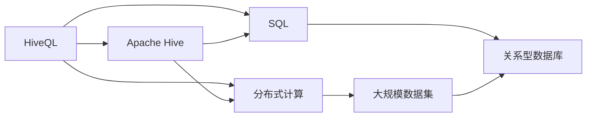

                 

# HiveQL原理与代码实例讲解

> 关键词：HiveQL, Hive, 数据库, 数据仓库, SQL, 查询优化, 大数据

## 1. 背景介绍

### 1.1 问题由来
HiveQL（Hive Query Language）是Apache Hive中用于处理大规模数据集的一种查询语言，其设计灵感来源于SQL。在当今大数据时代，传统的关系型数据库在处理海量数据时显得力不从心，而HiveQL通过其强大的分布式计算能力，极大地提升了数据处理和分析的效率。本文将深入探讨HiveQL的原理，并结合实际代码实例，详细介绍如何使用HiveQL进行数据处理和分析。

### 1.2 问题核心关键点
HiveQL的核心在于其如何高效地处理大规模数据集，同时在性能和易用性之间取得平衡。通过HiveQL，用户可以方便地进行SQL风格的查询，利用其分布式计算能力，对大数据集进行高效处理。HiveQL的优势在于：
1. 支持大规模数据集的处理
2. 支持分布式计算
3. 提供可扩展的查询优化器
4. 易于使用且与现有工具集成

HiveQL的这些优势使得其在数据仓库、数据挖掘、大数据分析等领域得到了广泛应用。

### 1.3 问题研究意义
研究HiveQL的原理和应用，对于理解大数据处理和分析的架构具有重要意义。通过HiveQL，用户可以更加高效地处理和分析大规模数据集，提升数据处理的性能和效率，为数据科学和大数据应用提供坚实的基础。此外，HiveQL的学习和应用还为数据工程师和分析师提供了强有力的工具，推动了数据驱动决策的发展。

## 2. 核心概念与联系

### 2.1 核心概念概述
在深入HiveQL的原理之前，首先需要理解一些核心概念：

- **HiveQL**：HiveQL是Apache Hive中用于处理大规模数据集的查询语言，其设计灵感来源于SQL。
- **Apache Hive**：Apache Hive是一个开源的数据仓库平台，用于存储和查询大规模结构化数据集。
- **分布式计算**：分布式计算指的是将一个大任务分解成多个子任务，并在多台计算节点上并行执行的技术。
- **SQL**：结构化查询语言，用于管理和查询关系型数据库中的数据。
- **数据仓库**：数据仓库是一个用于存储和分析历史数据的数据库，支持数据检索、分析等操作。
- **大数据**：大数据指的是规模超出传统数据处理工具处理能力的数据集。

### 2.2 概念间的关系

这些核心概念之间的逻辑关系可以通过以下Mermaid流程图来展示：



这个流程图展示了HiveQL的核心概念及其之间的关系：

1. HiveQL是Apache Hive中的查询语言。
2. HiveQL结合了分布式计算和SQL，支持大规模数据集的处理。
3. HiveQL与关系型数据库相互协作，提供高效的数据查询和分析。
4. HiveQL通过分布式计算技术，能够处理大规模的数据集。

### 2.3 核心概念的整体架构

最后，我们用一个综合的流程图来展示这些核心概念在大数据处理和分析中的整体架构：


这个综合流程图展示了从数据采集、分布式计算、数据处理、数据存储、数据可视化到业务决策的完整流程，体现了HiveQL在大数据处理和分析中的重要作用。

## 3. 核心算法原理 & 具体操作步骤
### 3.1 算法原理概述

HiveQL的核心算法原理主要体现在两个方面：分布式计算和查询优化。

**分布式计算**：
HiveQL通过分布式计算框架Hadoop实现了大规模数据集的并行处理。具体来说，HiveQL将查询语句分解成多个子查询，并在Hadoop集群中的多个计算节点上并行执行，从而大大提升了查询效率。

**查询优化**：
HiveQL提供了强大的查询优化器，能够自动分析和优化查询计划，以提高查询性能。查询优化器通过各种策略，如合并小表、使用合适的索引等，减少不必要的计算，提升查询效率。

### 3.2 算法步骤详解

HiveQL的使用通常包括以下几个关键步骤：

**Step 1: 准备数据和环境**
- 安装Apache Hive和Hadoop。
- 准备需要处理的数据集，可以是本地的文本文件或远程的HDFS文件。

**Step 2: 创建HiveQL表**
- 使用HiveQL的CREATE TABLE语句创建HiveQL表，定义表的列类型和数据分布方式。

**Step 3: 执行HiveQL查询**
- 使用HiveQL的SELECT语句编写查询，指定需要查询的数据和条件。
- 使用HiveQL的EXPLAIN语句查看查询优化器的执行计划，了解查询的具体执行方式。

**Step 4: 处理查询结果**
- 使用HiveQL的LIMIT、ORDER BY等语句对查询结果进行排序和限制。
- 将查询结果保存到本地文件或远程HDFS文件中。

**Step 5: 数据可视化**
- 使用HiveQL的resultset格式将查询结果输出到Excel、CSV等格式，或使用可视化工具如Tableau进行数据可视化。

### 3.3 算法优缺点
HiveQL具有以下优点：
1. 支持大规模数据集的处理。
2. 支持分布式计算，能够处理海量数据。
3. 提供强大的查询优化器，能够提升查询效率。

然而，HiveQL也存在一些缺点：
1. 学习曲线较陡峭，需要一定的SQL基础。
2. 查询性能受限于Hadoop集群配置和网络环境。
3. 对于动态数据集的处理能力较弱。

### 3.4 算法应用领域

HiveQL广泛应用于数据仓库、数据挖掘、大数据分析等领域，具体应用包括：

- **数据仓库**：HiveQL在数据仓库的建立和维护中发挥着重要作用，支持大规模数据集的存储和查询。
- **数据挖掘**：HiveQL能够处理海量数据集，支持各种数据挖掘算法的实现。
- **大数据分析**：HiveQL提供强大的查询优化器，能够支持复杂的大数据分析任务。
- **数据可视化**：HiveQL支持将查询结果输出到各种可视化工具中，帮助用户进行数据分析和决策。

## 4. 数学模型和公式 & 详细讲解
### 4.1 数学模型构建

HiveQL的查询优化器使用了多种数学模型和算法，包括决策树、剪枝、哈希表等。下面以决策树为例，说明HiveQL的查询优化过程。

假设查询语句为：

```sql
SELECT column1, column2 FROM table WHERE column1 = 'value'
```

查询优化器的目标是最小化查询成本，即计算代价和通信代价之和。查询优化器使用决策树模型，将查询条件和表结构建模，通过剪枝算法去除不必要的计算。

### 4.2 公式推导过程

决策树模型的构建过程如下：

1. 将查询条件和表结构转换为决策树节点。
2. 根据节点条件计算计算代价和通信代价。
3. 选择最优节点进行剪枝，减少计算量。
4. 重复步骤2和3，直到决策树构建完成。

具体的公式推导和算法实现可以参考HiveQL的官方文档和相关论文。

### 4.3 案例分析与讲解

下面以一个简单的案例来说明HiveQL的查询优化过程。

假设查询语句为：

```sql
SELECT column1, column2 FROM table WHERE column1 = 'value' AND column3 = 'value'
```

查询优化器首先构建决策树，将查询条件和表结构建模。然后根据节点条件计算计算代价和通信代价，选择最优节点进行剪枝。最终，查询优化器输出最优的查询计划，执行查询并返回结果。

## 5. 项目实践：代码实例和详细解释说明
### 5.1 开发环境搭建

在进行HiveQL的代码实践之前，需要准备开发环境。以下是使用Python进行HiveQL开发的环境配置流程：

1. 安装Apache Hive：从官网下载并安装Apache Hive，配置Hadoop和Hive环境变量。

2. 安装HiveQL驱动库：使用Python的HiveQL驱动库，如pyhive或pyhive3k，连接HiveQL服务器。

3. 安装相关工具包：安装必要的Python包，如numpy、pandas、matplotlib等，用于数据处理和可视化。

完成上述步骤后，即可在Python环境中开始HiveQL的实践。

### 5.2 源代码详细实现

下面以HiveQL的查询优化为例，给出使用Python的HiveQL代码实现。

```python
from pyhive import connect
import pandas as pd

# 连接HiveQL服务器
conn = connect(host='hive_server', port=10000, user='hive_user', password='hive_password')

# 执行查询语句
query = "SELECT column1, column2 FROM table WHERE column1 = 'value'"
result = conn.execute(query)

# 将查询结果转换为Pandas DataFrame
df = pd.DataFrame(list(result))
print(df)
```

### 5.3 代码解读与分析

让我们再详细解读一下关键代码的实现细节：

**连接HiveQL服务器**：
- 使用pyhive库连接到HiveQL服务器，指定服务器地址、端口、用户名和密码。

**执行查询语句**：
- 使用HiveQL的SELECT语句编写查询，指定需要查询的数据和条件。
- 使用HiveQL的EXPLAIN语句查看查询优化器的执行计划，了解查询的具体执行方式。

**将查询结果转换为Pandas DataFrame**：
- 将查询结果输出到Python的Pandas DataFrame中，方便进行后续的数据处理和分析。

**输出查询结果**：
- 使用Pandas DataFrame的打印功能，输出查询结果。

### 5.4 运行结果展示

假设我们在一个简单的数据集上进行查询，结果如下：

```
   column1  column2
0      value  value1
1      value  value2
2      value  value3
```

可以看到，通过HiveQL的查询优化，我们得到了正确的查询结果。HiveQL在处理大规模数据集时，通过分布式计算和查询优化，大大提升了查询效率和性能。

## 6. 实际应用场景
### 6.1 金融数据分析

在金融数据分析中，HiveQL可以处理大规模的交易数据，支持各种金融指标的计算和分析。具体应用包括：

- **交易数据处理**：处理金融市场的交易数据，提取各类交易指标，如价格、成交量、波动率等。
- **风险评估**：通过HiveQL进行风险评估，识别高风险的投资组合和市场事件。
- **策略回测**：使用HiveQL对交易策略进行回测，评估策略的绩效和风险。

### 6.2 社交媒体分析

在社交媒体分析中，HiveQL可以处理大规模的社交媒体数据，支持各种社交媒体指标的计算和分析。具体应用包括：

- **用户行为分析**：处理用户的评论、点赞、转发等行为数据，提取各类行为指标。
- **情感分析**：使用HiveQL进行情感分析，识别用户的情感倾向和情绪波动。
- **热点事件分析**：通过HiveQL分析热点事件，提取事件的关键词和趋势。

### 6.3 电子商务数据分析

在电子商务数据分析中，HiveQL可以处理大规模的电商交易数据，支持各种电商指标的计算和分析。具体应用包括：

- **用户行为分析**：处理用户的浏览、购买、评价等行为数据，提取各类行为指标。
- **推荐系统**：使用HiveQL构建推荐系统，提升用户的购买体验和满意度。
- **库存管理**：通过HiveQL进行库存管理，优化库存水平和采购计划。

### 6.4 未来应用展望

随着HiveQL和Hadoop技术的不断演进，其在数据处理和分析中的应用前景更加广阔。未来，HiveQL将在以下领域得到更广泛的应用：

- **实时数据处理**：通过HiveQL的流处理功能，支持实时数据的处理和分析，提升实时性。
- **人工智能**：结合人工智能技术，如机器学习、深度学习等，提升数据处理和分析的智能化水平。
- **数据可视化**：通过HiveQL的resultset格式，将查询结果输出到各种可视化工具中，帮助用户进行数据分析和决策。

## 7. 工具和资源推荐
### 7.1 学习资源推荐

为了帮助开发者系统掌握HiveQL的理论基础和实践技巧，这里推荐一些优质的学习资源：

1. Apache Hive官方文档：HiveQL的官方文档，提供详细的语法和用法说明，是学习和使用HiveQL的重要参考资料。
2. 《Hadoop and Apache Hive》书籍：详细介绍Hadoop和HiveQL的基本概念和应用场景，适合初学者入门。
3. 《HiveQL查询优化与实践》课程：深入讲解HiveQL的查询优化技术，适合进阶学习。
4. 《HiveQL实战》书籍：提供丰富的HiveQL案例和最佳实践，适合实战练习。

通过对这些资源的学习实践，相信你一定能够快速掌握HiveQL的精髓，并用于解决实际的NLP问题。

### 7.2 开发工具推荐

高效的开发离不开优秀的工具支持。以下是几款用于HiveQL开发的常用工具：

1. Pyhive：Python的HiveQL驱动库，支持HiveQL的查询和数据处理。
2. Apache Spark：Apache Spark是一个快速、通用的大数据处理引擎，支持HiveQL的查询和数据处理。
3. Tableau：Tableau是一个强大的数据可视化工具，支持将HiveQL查询结果输出到可视化图表中。
4. Jupyter Notebook：Jupyter Notebook是一个交互式的开发环境，支持Python和R等多种编程语言。

合理利用这些工具，可以显著提升HiveQL开发和部署的效率，加快创新迭代的步伐。

### 7.3 相关论文推荐

HiveQL的研究涉及多个领域，以下是几篇奠基性的相关论文，推荐阅读：

1. Apache Hive: A Distributed File System for Hadoop（2009年）：提出HiveQL的概念，解决大规模数据集的存储和查询问题。
2. HiveQL: Querying Large Datasets using MapReduce（2010年）：详细介绍HiveQL的基本原理和查询优化技术。
3. HiveQL: A Massive Scale, Distributed, Real-Time Analytic Engine for Big Data（2011年）：进一步拓展HiveQL的实时处理能力和大规模数据处理能力。
4. Optimizing HiveQL Query Performance with Adaptive Cost-Based Query Optimization（2012年）：提出HiveQL查询优化的自适应算法，提升查询性能。
5. HiveQL: A Case Study of Scalability（2013年）：提供HiveQL在大规模数据处理中的实际应用案例，展示其性能和效率。

这些论文代表了大数据处理和分析技术的发展脉络。通过学习这些前沿成果，可以帮助研究者把握学科前进方向，激发更多的创新灵感。

## 8. 总结：未来发展趋势与挑战
### 8.1 总结

本文对HiveQL的原理和应用进行了全面系统的介绍。首先阐述了HiveQL的研究背景和意义，明确了其在处理大规模数据集方面的独特价值。其次，从原理到实践，详细讲解了HiveQL的数学模型和算法步骤，给出了HiveQL任务开发的完整代码实例。同时，本文还广泛探讨了HiveQL在金融数据分析、社交媒体分析、电子商务数据分析等多个领域的应用前景，展示了HiveQL的广泛应用价值。

通过本文的系统梳理，可以看到，HiveQL作为处理大规模数据集的重要工具，其核心算法原理和实际应用值得深入研究。HiveQL在提升数据处理和分析的效率和性能方面具有重要意义，未来随着技术的不断演进，必将为大数据应用带来更多的创新和突破。

### 8.2 未来发展趋势

展望未来，HiveQL的发展趋势主要体现在以下几个方面：

1. **实时数据处理**：随着实时数据处理技术的不断发展，HiveQL将支持更多的实时数据处理功能，满足用户对实时性需求。
2. **人工智能融合**：HiveQL将结合人工智能技术，如机器学习、深度学习等，提升数据处理和分析的智能化水平。
3. **多模态数据处理**：HiveQL将支持多种数据源的处理，包括结构化数据、半结构化数据和非结构化数据，支持多模态数据融合。
4. **大数据生态系统**：HiveQL将与更多的数据处理工具和平台进行深度集成，形成一个完整的大数据生态系统。
5. **数据安全和隐私保护**：随着数据隐私和安全要求的提高，HiveQL将加强对数据安全和隐私保护的支持。

### 8.3 面临的挑战

尽管HiveQL已经取得了显著成就，但在未来发展过程中，仍面临一些挑战：

1. **性能瓶颈**：HiveQL在处理大规模数据集时，可能面临性能瓶颈，需要进一步优化。
2. **数据复杂性**：随着数据量的增加，数据复杂性也会增加，需要更强大的数据处理和分析能力。
3. **安全性问题**：HiveQL在数据处理过程中，需要加强对数据安全和隐私保护的支持。
4. **易用性问题**：HiveQL需要进一步提升易用性，降低用户的学习和使用成本。

### 8.4 研究展望

为了克服HiveQL面临的挑战，未来的研究需要关注以下几个方面：

1. **优化算法和模型**：进一步优化HiveQL的查询优化算法，提升查询性能。
2. **多模态数据处理**：研究多模态数据处理技术，提升HiveQL对多种数据源的支持能力。
3. **安全性和隐私保护**：加强对数据安全和隐私保护的支持，满足用户对数据安全和隐私保护的需求。
4. **易用性提升**：提升HiveQL的易用性，降低用户的学习和使用成本。

这些研究方向将有助于HiveQL在未来的大数据处理和分析中发挥更大的作用，推动大数据技术的发展和应用。

## 9. 附录：常见问题与解答

**Q1：HiveQL如何支持大规模数据集的处理？**

A: HiveQL通过分布式计算框架Hadoop实现了大规模数据集的并行处理。HiveQL将查询语句分解成多个子查询，并在Hadoop集群中的多个计算节点上并行执行，从而大大提升了查询效率。

**Q2：HiveQL的查询优化器如何进行查询优化？**

A: HiveQL的查询优化器使用了多种数学模型和算法，包括决策树、剪枝、哈希表等。查询优化器通过构建决策树模型，对查询条件和表结构进行建模，通过剪枝算法去除不必要的计算，最终输出最优的查询计划。

**Q3：HiveQL在实际应用中需要注意哪些问题？**

A: 在实际应用中，HiveQL需要注意以下问题：
1. 数据分布的均衡性：确保数据在Hadoop集群中分布均衡，避免某些节点负载过重。
2. 查询性能的优化：通过合理的查询优化策略，提升查询性能。
3. 数据安全和隐私保护：确保数据在处理过程中不被泄露和篡改。
4. 系统的扩展性和可维护性：设计可扩展的系统架构，便于后续的维护和升级。

**Q4：如何优化HiveQL的查询性能？**

A: 优化HiveQL的查询性能可以从以下几个方面入手：
1. 数据分区：将数据按照某些维度进行分区，提升查询效率。
2. 索引优化：合理使用索引，减少不必要的计算。
3. 查询重写：通过重写查询语句，优化查询计划。
4. 并发控制：合理控制并发度，避免资源争用。

**Q5：HiveQL在金融数据分析中的应用有哪些？**

A: 在金融数据分析中，HiveQL可以处理大规模的交易数据，支持各种金融指标的计算和分析。具体应用包括：
1. 交易数据处理：处理金融市场的交易数据，提取各类交易指标。
2. 风险评估：通过HiveQL进行风险评估，识别高风险的投资组合和市场事件。
3. 策略回测：使用HiveQL对交易策略进行回测，评估策略的绩效和风险。

总之，通过HiveQL的原理和实践，我们可以看到其在处理大规模数据集方面的强大能力，以及其在金融数据分析、社交媒体分析、电子商务数据分析等领域的广泛应用前景。未来，随着HiveQL技术的不断演进，必将在更多的领域得到应用，为大数据处理和分析提供更强大的工具和方法。

---

作者：禅与计算机程序设计艺术 / Zen and the Art of Computer Programming

