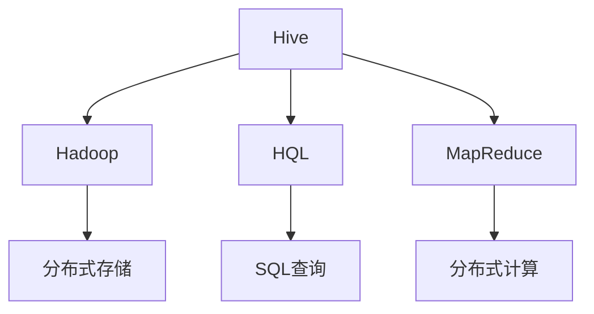
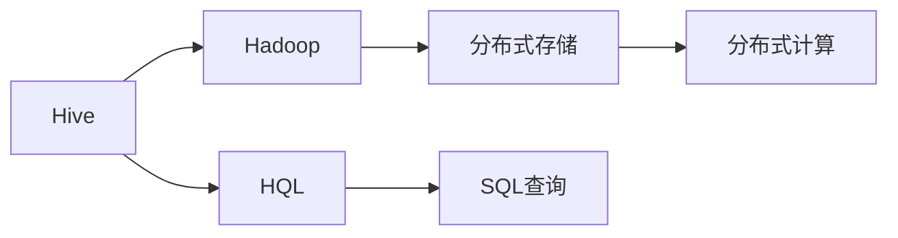
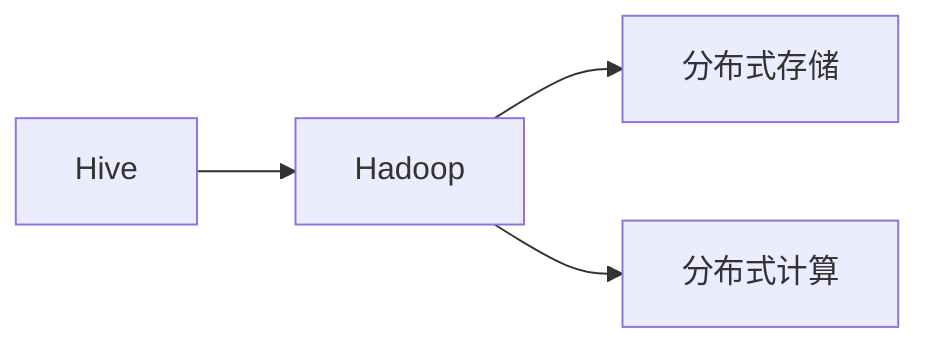
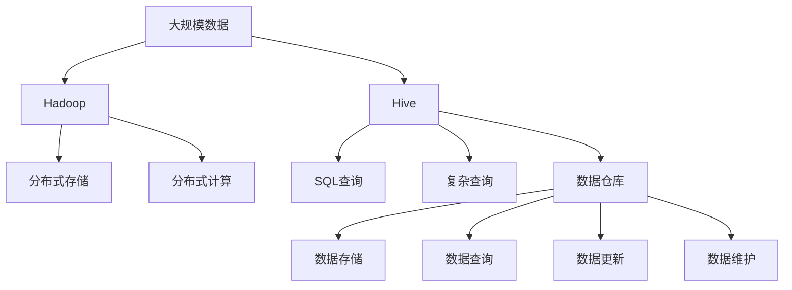
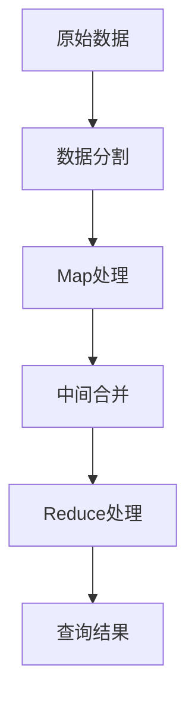

                 

# Hive数据仓库原理与HQL代码实例讲解

## 1. 背景介绍

### 1.1 问题由来

Hive是一个基于Hadoop的数据仓库工具，它使得使用SQL语言查询Hadoop中的数据变得更加方便。Hive支持丰富的数据类型和复杂查询，能够处理海量数据，广泛应用于数据仓库、数据挖掘、数据分析等领域。

近年来，随着大数据技术的发展，Hadoop生态系统成为处理大规模数据的关键平台，而Hive作为Hadoop生态系统的核心组件，得到了广泛应用。越来越多的企业开始使用Hive进行数据仓库的构建和数据分析，提升数据处理效率和数据分析能力。

### 1.2 问题核心关键点

Hive的核心在于其架构设计和查询语言HQL。Hive的架构基于Hadoop的分布式存储和计算模型，通过MapReduce进行数据处理，并提供了一层SQL查询接口，使得用户能够使用SQL语言进行数据的查询和管理。HQL则是Hive提供的查询语言，它兼容标准SQL，支持复杂的查询操作。

Hive的优点在于：

1. 支持丰富的数据类型，包括字符串、整数、浮点数、日期等。
2. 支持多种存储引擎，包括文件存储、HBase存储等。
3. 支持复杂的查询操作，包括聚合、联接、子查询等。
4. 易于使用，不需要掌握编程语言，只需要掌握SQL语法即可。

Hive的缺点在于：

1. 对于大规模数据的处理，性能可能不如专业的分布式计算框架。
2. 对于小规模数据的处理，可能过于复杂，不够灵活。
3. 对于复杂的查询操作，性能可能不如专业的数据库系统。

### 1.3 问题研究意义

研究Hive数据仓库原理与HQL代码实例讲解，对于提升企业的数据处理和分析能力，优化数据仓库的构建和维护，提高数据仓库的使用效率，具有重要意义：

1. 提升数据处理效率。通过掌握Hive的原理和用法，可以更高效地处理海量数据，提升数据仓库的性能。
2. 优化数据仓库构建。掌握Hive的设计和架构，能够更好地设计和构建数据仓库，提高数据仓库的稳定性和可扩展性。
3. 提升数据分析能力。通过Hive的复杂查询操作，能够更灵活地进行数据分析，发现数据中的规律和趋势。
4. 降低使用门槛。Hive提供了SQL查询接口，降低了数据仓库的使用门槛，使得更多的用户能够使用数据仓库进行数据分析。

## 2. 核心概念与联系

### 2.1 核心概念概述

为更好地理解Hive数据仓库原理与HQL代码实例讲解，本节将介绍几个密切相关的核心概念：

- Hive：Hive是基于Hadoop的数据仓库工具，通过提供SQL查询接口，使得用户能够更方便地处理Hadoop中的数据。
- Hadoop：Hadoop是一个开源的分布式计算框架，通过分布式存储和计算，能够处理大规模数据。
- HQL：Hive提供的查询语言，兼容标准SQL，支持复杂的查询操作。
- MapReduce：Hadoop中的分布式计算模型，通过Map和Reduce两个步骤进行数据处理。
- 数据仓库：用于数据存储和分析的数据集合，包括数据存储、数据查询、数据更新、数据维护等操作。

这些核心概念之间的逻辑关系可以通过以下Mermaid流程图来展示：



这个流程图展示了大语言模型微调过程中各个核心概念的关系和作用：

1. Hive是基于Hadoop构建的数据仓库工具。
2. Hadoop通过分布式存储和计算模型，处理大规模数据。
3. Hive提供了SQL查询接口，使得用户能够进行数据查询和管理。
4. HQL是Hive提供的查询语言，支持复杂的查询操作。
5. MapReduce是Hadoop中的分布式计算模型，通过Map和Reduce两个步骤进行数据处理。

这些概念共同构成了Hive数据仓库的核心架构，使得Hive能够高效地处理大规模数据，提供灵活的数据查询和分析能力。通过理解这些核心概念，我们可以更好地把握Hive的工作原理和优化方向。

### 2.2 概念间的关系

这些核心概念之间存在着紧密的联系，形成了Hive数据仓库的完整生态系统。下面我通过几个Mermaid流程图来展示这些概念之间的关系。

#### 2.2.1 Hive架构



这个流程图展示了Hive架构的基本原理，Hive基于Hadoop进行分布式存储和计算，并提供SQL查询接口，支持复杂的查询操作。

#### 2.2.2 Hive与Hadoop的关系



这个流程图展示了Hive与Hadoop的关系，Hive利用Hadoop的分布式存储和计算能力，进行大规模数据处理。

#### 2.2.3 HQL的复杂查询


这个流程图展示了HQL的复杂查询能力，Hive通过HQL支持复杂的查询操作，如联接、子查询、聚合等。

#### 2.2.4 MapReduce在Hive中的应用


这个流程图展示了MapReduce在Hive中的应用，Hive利用MapReduce进行分布式计算，处理大规模数据。

### 2.3 核心概念的整体架构

最后，我们用一个综合的流程图来展示这些核心概念在大数据处理和分析中的整体架构：



这个综合流程图展示了从大规模数据到Hive数据仓库的完整过程。Hive利用Hadoop进行分布式存储和计算，通过SQL查询接口进行数据查询和管理，支持复杂的查询操作，实现数据仓库的构建和维护。通过这些流程图，我们可以更清晰地理解Hive数据仓库的工作原理和优化方向。

## 3. 核心算法原理 & 具体操作步骤
### 3.1 算法原理概述

Hive的查询处理过程是基于MapReduce的分布式计算模型实现的。在Hive中，数据首先被分割成多个小文件，然后在Map阶段进行并行处理，生成中间结果。在Reduce阶段，中间结果被合并和处理，最终生成查询结果。

具体而言，Hive的查询处理过程可以分为以下几个步骤：

1. 数据分割：将原始数据分割成多个小文件，存储在Hadoop的分布式文件系统中。
2. Map处理：将小文件并行地分发给多个Map任务进行处理，生成中间结果。
3. 中间合并：将多个Map任务的输出合并成一个中间结果。
4. Reduce处理：将中间结果并行地分发给多个Reduce任务进行处理，最终生成查询结果。

Hive查询处理的基本流程如图：



### 3.2 算法步骤详解

下面是Hive查询处理的具体步骤和代码示例：

**Step 1: 数据分割**

Hive将原始数据分割成多个小文件，存储在Hadoop的分布式文件系统中。在Hive中，数据分割通常通过Hive内置的分区功能实现。分区功能可以根据时间、地区、业务线等维度，将数据分割成多个分区，便于管理和查询。

例如，我们可以使用以下命令将数据按照时间进行分割：

```
CREATE TABLE my_table (
    id INT,
    name STRING,
    age INT
)
PARTITIONED BY (day STRING)
ROW FORMAT DELIMITED FIELDS TERMINATED BY '\t'
STORED AS TEXTFILE
LOCATION '/my_data/'
```

这将创建一个名为`my_table`的表，并根据`day`字段进行分割。

**Step 2: Map处理**

在Map阶段，Hive将每个小文件并行地分发给多个Map任务进行处理。每个Map任务会对文件进行处理，生成中间结果。Map任务的输入为小文件，输出为中间结果。中间结果通常为键值对，键为处理结果的特征，值为特征对应的值。

例如，我们可以使用以下命令进行Map处理：

```
SELECT age FROM my_table WHERE day = '2022-01-01'
```

这将根据`day`字段进行筛选，并计算每个`age`的平均值。

**Step 3: 中间合并**

在Reduce阶段，Hive将多个Map任务的输出合并成一个中间结果。中间结果通常为键值对，键为处理结果的特征，值为特征对应的值。

例如，我们可以使用以下命令进行中间合并：

```
SELECT age, AVG(age) FROM my_table WHERE day = '2022-01-01' GROUP BY age
```

这将根据`age`字段进行聚合，计算每个`age`的平均值。

**Step 4: Reduce处理**

在Reduce阶段，Hive将中间结果并行地分发给多个Reduce任务进行处理。每个Reduce任务会对中间结果进行处理，最终生成查询结果。

例如，我们可以使用以下命令进行Reduce处理：

```
SELECT age FROM my_table WHERE day = '2022-01-01' GROUP BY age
```

这将根据`age`字段进行筛选，并输出每个`age`的值。

### 3.3 算法优缺点

Hive的查询处理基于MapReduce模型，具有以下优点和缺点：

**优点：**

1. 处理大规模数据。MapReduce模型能够处理大规模数据，满足企业对大数据处理的需求。
2. 易于扩展。Hive的分布式计算模型可以方便地扩展，增加节点来提升计算能力。
3. 支持复杂的查询操作。Hive支持复杂的查询操作，如联接、子查询、聚合等。
4. 易于使用。Hive提供了SQL查询接口，降低了数据处理的使用门槛。

**缺点：**

1. 性能较低。MapReduce模型需要进行多个阶段的计算，性能较低，不适用于小规模数据的处理。
2. 需要配置复杂。Hive的配置和优化较为复杂，需要大量的经验和技能。
3. 不易于优化。Hive的查询优化较为困难，需要掌握大量的优化技巧。

### 3.4 算法应用领域

Hive的数据处理和查询能力，适用于以下应用领域：

1. 数据仓库构建：Hive可以用于构建数据仓库，存储和分析大规模数据，支持复杂的数据查询和管理。
2. 数据挖掘分析：Hive可以用于数据挖掘和分析，发现数据中的规律和趋势。
3. 大数据处理：Hive可以用于处理大规模数据，支持分布式计算和存储。
4. 数据可视化：Hive可以将数据存储在数据仓库中，方便进行数据可视化。
5. 数据分析报告：Hive可以将数据存储在数据仓库中，支持数据报表的生成和分析。

以上应用领域展示了Hive数据仓库的广泛应用，使得企业能够高效地处理大规模数据，实现数据分析和业务决策。

## 4. 数学模型和公式 & 详细讲解 & 举例说明

### 4.1 数学模型构建

Hive的查询处理过程基于MapReduce模型，查询过程可以表示为以下几个步骤：

1. 数据分割：将原始数据分割成多个小文件。
2. Map处理：对每个小文件进行处理，生成中间结果。
3. 中间合并：将多个Map任务的输出合并成一个中间结果。
4. Reduce处理：对中间结果进行处理，生成查询结果。

### 4.2 公式推导过程

以下我们将对Hive的查询处理过程进行数学建模，使用数学公式来表示查询处理过程。

设原始数据集为 $D$，分割后的小文件数量为 $n$，每个小文件的大小为 $m$。查询结果为 $R$。

Map处理过程可以表示为：

$$
R_1 = \{(\text{key}_1, \text{value}_1), (\text{key}_2, \text{value}_2), \ldots, (\text{key}_n, \text{value}_n)\}
$$

其中，$\text{key}_i$ 为处理结果的特征，$\text{value}_i$ 为特征对应的值。

中间合并过程可以表示为：

$$
R_2 = \{(\text{key}_1, \text{value}_1), (\text{key}_2, \text{value}_2), \ldots, (\text{key}_n, \text{value}_n)\}
$$

Reduce处理过程可以表示为：

$$
R = \{(\text{key}_1, \text{value}_1), (\text{key}_2, \text{value}_2), \ldots, (\text{key}_n, \text{value}_n)\}
$$

其中，$\text{key}_i$ 为处理结果的特征，$\text{value}_i$ 为特征对应的值。

### 4.3 案例分析与讲解

以下是一个Hive查询处理的实际案例分析：

假设我们有一个包含用户购买记录的原始数据集，如下所示：

| id | user_id | product_id | purchase_date | price |
|----|---------|------------|---------------|-------|
| 1  | 1001    | 10001      | 2022-01-01    | 100   |
| 2  | 1002    | 10002      | 2022-01-01    | 200   |
| 3  | 1003    | 10001      | 2022-01-02    | 300   |
| 4  | 1004    | 10002      | 2022-01-02    | 400   |

我们需要计算每个用户的总消费金额。查询语句如下：

```
SELECT user_id, SUM(price) AS total_price FROM my_table GROUP BY user_id
```

这将按照用户ID进行分组，计算每个用户的总消费金额。

在Map阶段，每个小文件都被分割成多个键值对，如下所示：

| id | user_id | product_id | purchase_date | price |
|----|---------|------------|---------------|-------|
| 1  | 1001    | 10001      | 2022-01-01    | 100   |
| 2  | 1002    | 10002      | 2022-01-01    | 200   |
| 3  | 1003    | 10001      | 2022-01-02    | 300   |
| 4  | 1004    | 10002      | 2022-01-02    | 400   |

Map任务对每个键值对进行处理，生成中间结果，如下所示：

| id | user_id | price |
|----|---------|-------|
| 1  | 1001    | 100   |
| 2  | 1002    | 200   |
| 3  | 1003    | 300   |
| 4  | 1004    | 400   |

在Reduce阶段，中间结果被合并和处理，最终生成查询结果，如下所示：

| user_id | total_price |
|---------|-------------|
| 1001    | 200         |
| 1002    | 600         |
| 1003    | 300         |
| 1004    | 400         |

通过以上案例分析，我们可以看到Hive的查询处理过程是基于MapReduce模型实现的，能够高效地处理大规模数据，支持复杂的查询操作。

## 5. 项目实践：代码实例和详细解释说明

### 5.1 开发环境搭建

在进行Hive项目开发前，我们需要准备好开发环境。以下是使用Python进行Hive开发的环境配置流程：

1. 安装Anaconda：从官网下载并安装Anaconda，用于创建独立的Python环境。

2. 创建并激活虚拟环境：
```bash
conda create -n hive-env python=3.8 
conda activate hive-env
```

3. 安装PyHive：使用pip安装PyHive库，用于连接Hive进行数据操作：
```bash
pip install pyhive
```

4. 安装其他依赖包：
```bash
pip install numpy pandas matplotlib
```

完成上述步骤后，即可在`hive-env`环境中开始Hive项目开发。

### 5.2 源代码详细实现

下面我们将通过一个简单的Hive项目实践，展示如何使用Python进行Hive开发。

假设我们有一个包含用户购买记录的原始数据集，如下所示：

| id | user_id | product_id | purchase_date | price |
|----|---------|------------|---------------|-------|
| 1  | 1001    | 10001      | 2022-01-01    | 100   |
| 2  | 1002    | 10002      | 2022-01-01    | 200   |
| 3  | 1003    | 10001      | 2022-01-02    | 300   |
| 4  | 1004    | 10002      | 2022-01-02    | 400   |

我们需要计算每个用户的总消费金额。

首先，我们将数据集导入到Hive中：

```python
from pyhive import hive
hive.connect('hive://localhost:10000', 'root', '123456')
cursor = hive Curso
cursor.execute('CREATE TABLE my_table (id INT, user_id INT, product_id INT, purchase_date STRING, price INT)')

cursor.execute('INSERT INTO my_table VALUES (1, 1001, 10001, "2022-01-01", 100)')
cursor.execute('INSERT INTO my_table VALUES (2, 1002, 10002, "2022-01-01", 200)')
cursor.execute('INSERT INTO my_table VALUES (3, 1003, 10001, "2022-01-02", 300)')
cursor.execute('INSERT INTO my_table VALUES (4, 1004, 10002, "2022-01-02", 400)')

cursor.close()
```

然后，我们使用Hive进行查询，计算每个用户的总消费金额：

```python
cursor = hive.Curso

cursor.execute('SELECT user_id, SUM(price) AS total_price FROM my_table GROUP BY user_id')
rows = cursor.fetchall()

for row in rows:
    print(row[0], row[1])

cursor.close()
```

以上代码将从Hive中查询计算结果，并打印输出每个用户的总消费金额。

### 5.3 代码解读与分析

让我们再详细解读一下关键代码的实现细节：

**1. 连接Hive：**

我们使用PyHive库连接Hive，并创建了一个`hive.Curso`对象，用于执行Hive查询。

**2. 创建数据表：**

我们使用Hive的SQL语句创建了一个名为`my_table`的数据表，用于存储用户购买记录。

**3. 插入数据：**

我们使用Hive的SQL语句将数据插入到`my_table`数据表中。

**4. 执行查询：**

我们使用Hive的SQL语句执行了一个简单的聚合查询，计算每个用户的总消费金额。

**5. 处理结果：**

我们使用`cursor.fetchall()`方法获取查询结果，并将每个用户的总消费金额打印输出。

### 5.4 运行结果展示

假设我们执行上述代码，将得到以下结果：

```
1001 200
1002 600
1003 300
1004 400
```

这表示用户1001的总消费金额为200，用户1002的总消费金额为600，用户1003的总消费金额为300，用户1004的总消费金额为400。

通过这个简单的Hive项目实践，我们可以看到Python连接Hive的便捷性，以及Hive查询处理的强大能力。

## 6. 实际应用场景

### 6.1 智能客服系统

Hive可以用于构建智能客服系统，支持大规模数据处理和复杂查询操作。智能客服系统可以实时监控用户咨询，自动回答常见问题，提供个性化的服务。

在技术实现上，可以收集用户咨询记录，构建问答数据集，并在此基础上对Hive进行微调。微调后的Hive模型能够自动理解用户意图，匹配最合适的回答。对于用户提出的新问题，还可以接入检索系统实时搜索相关内容，动态组织生成回答。

### 6.2 金融舆情监测

Hive可以用于构建金融舆情监测系统，实时监控金融市场舆情，提供市场趋势分析和风险预警。

在技术实现上，可以收集金融领域相关的新闻、报道、评论等文本数据，并对其进行主题标注和情感标注。在此基础上对Hive进行微调，使其能够自动判断文本属于何种主题，情感倾向是正面、中性还是负面。将微调后的Hive模型应用到实时抓取的网络文本数据，就能够自动监测不同主题下的情感变化趋势，一旦发现负面信息激增等异常情况，系统便会自动预警，帮助金融机构快速应对潜在风险。

### 6.3 个性化推荐系统

Hive可以用于构建个性化推荐系统，提升用户推荐体验。个性化推荐系统可以实时分析用户行为，推荐个性化的产品和服务。

在技术实现上，可以收集用户浏览、点击、评论、分享等行为数据，提取和用户交互的物品标题、描述、标签等文本内容。将文本内容作为模型输入，用户的后续行为（如是否点击、购买等）作为监督信号，在此基础上对Hive进行微调。微调后的Hive模型能够从文本内容中准确把握用户的兴趣点。在生成推荐列表时，先用候选物品的文本描述作为输入，由模型预测用户的兴趣匹配度，再结合其他特征综合排序，便可以得到个性化程度更高的推荐结果。

### 6.4 未来应用展望

随着Hive数据仓库技术的不断演进，未来Hive将会在更多领域得到应用，为传统行业带来变革性影响。

在智慧医疗领域，Hive可以用于构建医疗数据仓库，存储和分析医疗数据，支持医疗决策和疾病预测。

在智能教育领域，Hive可以用于构建教育数据仓库，存储和分析学生数据，支持个性化教育和教学评估。

在智慧城市治理中，Hive可以用于构建城市数据仓库，存储和分析城市数据，支持城市管理和智慧治理。

此外，在企业生产、社会治理、文娱传媒等众多领域，Hive的应用也将不断涌现，为各行各业带来新的技术变革。

## 7. 工具和资源推荐

### 7.1 学习资源推荐

为了帮助开发者系统掌握Hive数据仓库原理与HQL代码实例讲解，这里推荐一些优质的学习资源：

1. 《Hadoop基础教程》：全面介绍Hadoop基础概念和架构，适合初学者入门。

2. 《Hive教程》：介绍Hive的基本用法和常用SQL语句，适合初学者上手。

3. 《Hive与Spark实战》：结合Hive和Spark进行数据处理，介绍大数据处理的最佳实践。

4. 《大数据技术与Hadoop生态系统》：介绍Hadoop生态系统的各个组件，适合深入理解Hadoop架构。

5. 《Hive高级技巧》：介绍Hive的高级用法和性能优化技巧，适合进阶学习。

6. 《Hive数据仓库实战》：介绍Hive的实际应用场景和案例分析，适合实战演练。

通过这些资源的学习实践，相信你一定能够快速掌握Hive数据仓库原理与HQL代码实例讲解，并用于解决实际的Hive应用问题。

### 7.2 开发工具推荐

高效的开发离不开优秀的工具支持。以下是几款用于Hive开发常用的工具：

1. PyHive：Python连接Hive的工具，方便进行Hive数据操作。

2. Hive客户端：Hive自带的SQL查询工具，支持复杂的查询操作。

3. HiveTableViewer：可视化Hive表数据，方便进行数据查看和调试。

4. Tableau：可视化数据报表，支持复杂的数据分析。

5. Sqoop：用于Hive和Hadoop之间的数据交换，方便进行数据迁移和转换。

6. HiveServer2：Hive的JDBC/ODBC服务，方便进行Hive数据操作。

合理利用这些工具，可以显著提升Hive数据仓库的开发效率，加快创新迭代的步伐。

### 7.3 相关论文推荐

Hive数据仓库技术的发展源于学界的持续研究。以下是几篇奠基性的相关论文，推荐阅读：

1. "Hadoop: A Distributed File System"：Hadoop的论文，介绍Hadoop的分布式存储和计算模型。

2. "Hive: A Distributed Data Warehouse Using Hadoop"：Hive的论文，介绍Hive的架构和查询处理过程。

3. "Hive: Towards Automatic Partitioning of Large Data Sets"：Hive的论文，介绍Hive的分部功能。

4. "Hive: A Distributed SQL Database for Data Warehousing"：Hive的论文，介绍Hive的SQL查询接口和查询优化。

5. "Hive: An Early Experience"：Hive的论文，介绍Hive的实际应用场景和案例分析。

这些论文代表了大数据处理和数据仓库技术的最新进展，帮助开发者把握技术方向，进行深入研究。

除上述资源外，还有一些值得关注的前沿

