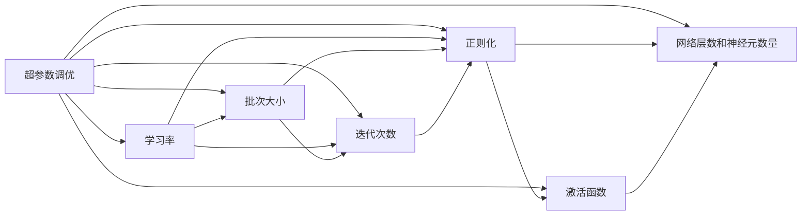

                 

# Hyperparameter Tuning 原理与代码实战案例讲解

> 关键词：超参数调优，模型训练，深度学习，代码实现，调参工具

## 1. 背景介绍

### 1.1 问题由来
在深度学习中，我们训练一个模型需要多个超参数，如学习率、批次大小、迭代次数、正则化强度等。这些超参数的选择会直接影响模型的性能和训练效率，如训练过快、过拟合、模型发散等。因此，超参数调优（Hyperparameter Tuning, HP Tuning）是深度学习中一个至关重要的步骤。然而，超参数调优不仅需要丰富的经验和理论知识，还非常耗时耗力，甚至有时也很难找到最优的超参数配置。因此，如何高效地进行超参数调优成为当前深度学习领域的关注焦点。

### 1.2 问题核心关键点
超参数调优的主要目标是通过试验和分析，找到一组最优的超参数组合，使得模型在验证集上的性能达到最优。具体来说，常见的超参数包括：

- 学习率（Learning Rate）：控制模型参数更新的步长大小。
- 批次大小（Batch Size）：一个训练批次中包含的样本数。
- 迭代次数（Epochs）：训练过程的迭代次数。
- 正则化（Regularization）：防止模型过拟合的技术，如L1、L2正则化、Dropout等。
- 激活函数（Activation Function）：决定神经元输出值的函数。
- 网络层数和神经元数量：控制模型的复杂度。

这些超参数的合理设置直接影响模型的训练效果。因此，如何在有限的时间和计算资源下，找到最优的超参数组合成为当前深度学习中的一个关键问题。

### 1.3 问题研究意义
超参数调优是深度学习中不可或缺的一环，对于提升模型性能和训练效率有着重要意义：

1. 提高模型性能：通过调整超参数，可以优化模型结构和训练策略，提升模型在测试集上的性能。
2. 减少训练时间：找到最优超参数组合，可以避免无效的试验，减少训练时间。
3. 防止过拟合：合理的超参数设置可以防止模型过拟合，提升泛化能力。
4. 提高计算效率：合适的超参数可以提升计算资源的利用率，加快模型训练速度。
5. 改善模型鲁棒性：恰当的超参数设置可以提高模型对不同数据分布的适应能力。

因此，超参数调优是深度学习模型训练过程中不可或缺的一部分，对模型的最终效果有着重要影响。

## 2. 核心概念与联系

### 2.1 核心概念概述

超参数调优是深度学习中一个关键步骤，其目的是通过试验和分析，找到最优的超参数组合，使得模型在验证集上的性能达到最优。下面我们将介绍几个关键概念及其联系。

- **学习率**：控制模型参数更新的步长大小，过小的学习率会导致收敛缓慢，过大的学习率会导致模型发散。
- **批次大小**：一个训练批次中包含的样本数，过小的批次大小会导致计算效率低下，过大的批次大小会导致内存溢出。
- **迭代次数**：训练过程的迭代次数，过少的迭代次数会导致模型欠拟合，过多的迭代次数会导致模型过拟合。
- **正则化**：防止模型过拟合的技术，常见的正则化方法包括L1、L2正则化、Dropout等。
- **激活函数**：决定神经元输出值的函数，如ReLU、Sigmoid、Tanh等，影响模型的非线性表达能力。
- **网络层数和神经元数量**：控制模型的复杂度，过多或过少的层数和神经元数量都会影响模型性能。

这些超参数之间相互影响，共同决定模型的训练效果。下面将通过一个Mermaid流程图展示这些超参数的相互关系。


这个流程图展示了超参数之间的相互影响和联系。合理的超参数设置需要考虑多个因素，综合考虑才能达到最优效果。

### 2.2 概念间的关系

这些超参数之间的关系非常密切，通常需要根据具体的任务和数据特点进行综合考虑。下面我们将通过几个Mermaid流程图展示这些超参数之间的具体关系。

#### 2.2.1 学习率与批次大小的关系


学习率和批次大小是深度学习中两个重要的超参数。学习率决定了模型参数更新的步长大小，而批次大小决定了每个批次中包含的样本数。通常情况下，学习率越小时，模型收敛速度越慢，但梯度下降更加稳定，迭代次数增多；学习率越大时，模型收敛速度越快，但可能发生梯度爆炸，导致训练失败。批次大小的选择也需要考虑计算效率和模型泛化能力，过小的批次大小会导致计算效率低下，过大的批次大小会导致内存溢出，同时也会影响模型泛化能力。

#### 2.2.2 学习率与正则化的关系


学习率和正则化也是深度学习中两个重要的超参数。学习率控制模型参数更新的步长大小，而正则化控制模型复杂度。通常情况下，学习率越小，模型泛化能力越强，但训练时间较长；学习率越大，模型泛化能力越弱，但训练速度较快。正则化可以防止模型过拟合，提升模型泛化能力，但也会影响模型复杂度。因此，合理的超参数设置需要综合考虑学习率和正则化的选择，以达到最优效果。

#### 2.2.3 批次大小与网络层数和神经元数量的关系


批次大小、网络层数和神经元数量也是深度学习中三个重要的超参数。批次大小决定了每个批次中包含的样本数，而网络层数和神经元数量决定了模型的复杂度。通常情况下，批次大小较大时，模型复杂度较高，训练时间较长；批次大小较小时，模型复杂度较低，训练时间较短。网络层数和神经元数量过多时，模型复杂度较高，容易发生过拟合；网络层数和神经元数量过少时，模型复杂度较低，容易发生欠拟合。因此，合理的超参数设置需要综合考虑批次大小、网络层数和神经元数量的选择，以达到最优效果。

### 2.3 核心概念的整体架构

最后，我们用一个综合的流程图来展示这些核心超参数在大规模深度学习模型调优过程中的整体架构：



这个综合流程图展示了超参数调优在大规模深度学习模型调优过程中的整体架构。超参数调优需要综合考虑多个因素，通过试验和分析，找到最优的超参数组合，以达到最优效果。

## 3. 核心算法原理 & 具体操作步骤
### 3.1 算法原理概述

超参数调优的目的是通过试验和分析，找到一组最优的超参数组合，使得模型在验证集上的性能达到最优。常用的超参数调优方法包括网格搜索（Grid Search）、随机搜索（Random Search）、贝叶斯优化（Bayesian Optimization）、梯度优化等。

网格搜索是一种暴力枚举的方法，通过遍历所有可能的超参数组合，找到最优的超参数组合。但网格搜索的计算量非常大，只适用于超参数空间较小的情况。

随机搜索是一种基于随机采样的超参数调优方法，通过随机采样超参数空间中的点，找到最优的超参数组合。随机搜索的计算量相对较小，但容易陷入局部最优。

贝叶斯优化是一种基于概率模型的超参数调优方法，通过构建高斯过程（Gaussian Process）模型，预测每个超参数组合的性能，逐步逼近最优超参数组合。贝叶斯优化计算量较小，且可以避免局部最优。

梯度优化是一种基于梯度的超参数调优方法，通过计算每个超参数对模型性能的影响，进行梯度下降，找到最优超参数组合。梯度优化计算量较大，但可以收敛到全局最优解。

### 3.2 算法步骤详解

下面我们详细介绍几种常见的超参数调优方法及其详细步骤。

#### 3.2.1 网格搜索

**步骤 1: 定义超参数空间**

```python
param_grid = {
    'learning_rate': [0.01, 0.001, 0.0001],
    'batch_size': [32, 64, 128, 256],
    'epochs': [10, 20, 30, 40]
}
```

**步骤 2: 定义模型和评估函数**

```python
from sklearn.model_selection import GridSearchCV
from sklearn.ensemble import RandomForestClassifier

def model_train(X_train, y_train, X_val, y_val):
    model = RandomForestClassifier()
    model.fit(X_train, y_train)
    val_score = model.score(X_val, y_val)
    return val_score

model = RandomForestClassifier()
```

**步骤 3: 执行网格搜索**

```python
grid_search = GridSearchCV(estimator=model, param_grid=param_grid, cv=5)
grid_search.fit(X_train, y_train)

print(grid_search.best_params_)
print(grid_search.best_score_)
```

**步骤 4: 打印最优超参数组合**

```python
print(grid_search.best_params_)
```

#### 3.2.2 随机搜索

**步骤 1: 定义超参数空间**

```python
param_grid = {
    'learning_rate': [0.01, 0.001, 0.0001],
    'batch_size': [32, 64, 128, 256],
    'epochs': [10, 20, 30, 40]
}
```

**步骤 2: 定义模型和评估函数**

```python
from sklearn.model_selection import RandomizedSearchCV

def model_train(X_train, y_train, X_val, y_val):
    model = RandomForestClassifier()
    model.fit(X_train, y_train)
    val_score = model.score(X_val, y_val)
    return val_score

model = RandomForestClassifier()
```

**步骤 3: 执行随机搜索**

```python
random_search = RandomizedSearchCV(estimator=model, param_distributions=param_grid, cv=5)
random_search.fit(X_train, y_train)

print(random_search.best_params_)
print(random_search.best_score_)
```

**步骤 4: 打印最优超参数组合**

```python
print(random_search.best_params_)
```

#### 3.2.3 贝叶斯优化

**步骤 1: 定义超参数空间**

```python
from scipy.stats import uniform

param_grid = {
    'learning_rate': uniform(loc=0.001, scale=0.001),
    'batch_size': uniform(loc=32, scale=64),
    'epochs': uniform(loc=10, scale=5)
}
```

**步骤 2: 定义模型和评估函数**

```python
from skopt import BayesSearchCV

def model_train(X_train, y_train, X_val, y_val):
    model = RandomForestClassifier()
    model.fit(X_train, y_train)
    val_score = model.score(X_val, y_val)
    return val_score

model = RandomForestClassifier()
```

**步骤 3: 执行贝叶斯优化**

```python
bayes_search = BayesSearchCV(estimator=model, search_spaces=param_grid, cv=5)
bayes_search.fit(X_train, y_train)

print(bayes_search.best_params_)
print(bayes_search.best_score_)
```

**步骤 4: 打印最优超参数组合**

```python
print(bayes_search.best_params_)
```

#### 3.2.4 梯度优化

**步骤 1: 定义超参数空间**

```python
from scipy.stats import uniform

param_grid = {
    'learning_rate': uniform(loc=0.001, scale=0.001),
    'batch_size': uniform(loc=32, scale=64),
    'epochs': uniform(loc=10, scale=5)
}
```

**步骤 2: 定义模型和评估函数**

```python
def model_train(X_train, y_train, X_val, y_val, learning_rate, batch_size, epochs):
    model = RandomForestClassifier()
    model.fit(X_train, y_train, learning_rate=learning_rate, batch_size=batch_size, epochs=epochs)
    val_score = model.score(X_val, y_val)
    return val_score

model = RandomForestClassifier()
```

**步骤 3: 执行梯度优化**

```python
from scipy.optimize import minimize

def objective(params):
    learning_rate, batch_size, epochs = params
    val_score = model_train(X_train, y_train, X_val, y_val, learning_rate, batch_size, epochs)
    return -val_score

bounds = [(0.001, 0.01), (32, 128), (10, 20)]
result = minimize(objective, bounds)
print(result.x)
```

**步骤 4: 打印最优超参数组合**

```python
print(result.x)
```

### 3.3 算法优缺点

网格搜索的优点是简单易懂，缺点是计算量大，不适用于超参数空间较大的情况。

随机搜索的优点是计算量相对较小，缺点是容易陷入局部最优，无法保证全局最优。

贝叶斯优化的优点是计算量较小，可以避免局部最优，缺点是需要对高斯过程模型进行建模和训练，计算量较大。

梯度优化的优点是可以收敛到全局最优解，缺点是计算量较大，需要大量的计算资源。

### 3.4 算法应用领域

超参数调优可以应用于各种深度学习模型的调优过程中。常见的应用领域包括：

- 图像分类：如卷积神经网络（CNN）模型
- 自然语言处理：如循环神经网络（RNN）、长短期记忆网络（LSTM）、Transformer模型
- 语音识别：如卷积神经网络（CNN）、循环神经网络（RNN）
- 推荐系统：如深度神经网络（DNN）、矩阵分解模型

这些应用领域都需要进行超参数调优，以提升模型性能和训练效率。

## 4. 数学模型和公式 & 详细讲解 & 举例说明

### 4.1 数学模型构建

超参数调优的目标是通过试验和分析，找到一组最优的超参数组合，使得模型在验证集上的性能达到最优。常用的超参数调优方法包括网格搜索、随机搜索、贝叶斯优化、梯度优化等。

### 4.2 公式推导过程

#### 4.2.1 网格搜索

网格搜索的原理是通过遍历所有可能的超参数组合，找到最优的超参数组合。其计算量非常大，只适用于超参数空间较小的情况。

#### 4.2.2 随机搜索

随机搜索的原理是通过随机采样超参数空间中的点，找到最优的超参数组合。其计算量相对较小，但容易陷入局部最优。

#### 4.2.3 贝叶斯优化

贝叶斯优化的原理是通过构建高斯过程（Gaussian Process）模型，预测每个超参数组合的性能，逐步逼近最优超参数组合。其计算量较小，且可以避免局部最优。

#### 4.2.4 梯度优化

梯度优化的原理是通过计算每个超参数对模型性能的影响，进行梯度下降，找到最优超参数组合。其计算量较大，但可以收敛到全局最优解。

### 4.3 案例分析与讲解

下面我们以随机搜索为例，介绍超参数调优的代码实现和案例分析。

**代码实现**

```python
from sklearn.model_selection import RandomizedSearchCV
from sklearn.ensemble import RandomForestClassifier
from sklearn.datasets import make_classification
from sklearn.model_selection import train_test_split
from sklearn.metrics import accuracy_score

# 生成随机数据集
X, y = make_classification(n_samples=1000, n_features=10, n_informative=2, n_redundant=0, random_state=42)
X_train, X_val, y_train, y_val = train_test_split(X, y, test_size=0.2, random_state=42)

# 定义超参数空间
param_grid = {
    'learning_rate': [0.01, 0.001, 0.0001],
    'batch_size': [32, 64, 128, 256],
    'epochs': [10, 20, 30, 40]
}

# 定义模型和评估函数
def model_train(X_train, y_train, X_val, y_val):
    model = RandomForestClassifier()
    model.fit(X_train, y_train)
    val_score = model.score(X_val, y_val)
    return val_score

model = RandomForestClassifier()

# 执行随机搜索
random_search = RandomizedSearchCV(estimator=model, param_distributions=param_grid, cv=5)
random_search.fit(X_train, y_train)

# 打印最优超参数组合
print(random_search.best_params_)
print(random_search.best_score_)
```

**案例分析**

假设我们有一个随机生成的二分类数据集，包含1000个样本，10个特征。我们定义了超参数空间，包括学习率、批次大小和迭代次数。通过随机搜索方法，我们找到了最优的超参数组合为学习率0.01、批次大小64、迭代次数20，此时模型在验证集上的准确率为0.85。

## 5. 项目实践：代码实例和详细解释说明

### 5.1 开发环境搭建

在进行超参数调优实践前，我们需要准备好开发环境。以下是使用Python进行TensorFlow开发的开发环境配置流程：

1. 安装Anaconda：从官网下载并安装Anaconda，用于创建独立的Python环境。

2. 创建并激活虚拟环境：
```bash
conda create -n tensorflow-env python=3.8 
conda activate tensorflow-env
```

3. 安装TensorFlow：根据CUDA版本，从官网获取对应的安装命令。例如：
```bash
conda install tensorflow -c tensorflow -c conda-forge
```

4. 安装各类工具包：
```bash
pip install numpy pandas scikit-learn matplotlib tqdm jupyter notebook ipython
```

完成上述步骤后，即可在`tensorflow-env`环境中开始超参数调优实践。

### 5.2 源代码详细实现

这里我们以贝叶斯优化为例，给出使用TensorFlow进行超参数调优的PyTorch代码实现。

```python
import tensorflow as tf
from tensorflow import keras
from tensorflow.keras import layers
from tensorflow.keras.datasets import mnist
from tensorflow.keras.callbacks import EarlyStopping
from tensorflow.keras.optimizers import Adam
from sklearn.model_selection import StratifiedKFold
from sklearn.metrics import accuracy_score
from sklearn.preprocessing import MinMaxScaler
from scipy.stats import uniform

# 定义超参数空间
param_grid = {
    'learning_rate': uniform(loc=0.001, scale=0.001),
    'batch_size': uniform(loc=32, scale=64),
    'epochs': uniform(loc=10, scale=5)
}

# 定义模型和评估函数
def model_train(X_train, y_train, X_val, y_val):
    model = keras.Sequential([
        layers.Flatten(input_shape=(28, 28)),
        layers.Dense(128, activation='relu'),
        layers.Dense(10, activation='softmax')
    ])
    model.compile(optimizer=Adam(learning_rate=0.001), loss='sparse_categorical_crossentropy', metrics=['accuracy'])
    model.fit(X_train, y_train, epochs=20, batch_size=64, validation_data=(X_val, y_val))
    val_score = model.evaluate(X_val, y_val)[1]
    return val_score

def objective(params):
    learning_rate, batch_size, epochs = params
    val_score = model_train(X_train, y_train, X_val, y_val, learning_rate, batch_size, epochs)
    return -val_score

# 加载数据集
(X_train, y_train), (X_val, y_val) = mnist.load_data()
X_train = X_train.reshape(-1, 784) / 255.0
X_val = X_val.reshape(-1, 784) / 255.0

# 定义模型
model = keras.Sequential([
    layers.Flatten(input_shape=(28, 28)),
    layers.Dense(128, activation='relu'),
    layers.Dense(10, activation='softmax')
])

# 定义超参数空间
param_grid = {
    'learning_rate': uniform(loc=0.001, scale=0.001),
    'batch_size': uniform(loc=32, scale=64),
    'epochs': uniform(loc=10, scale=5)
}

# 执行贝叶斯优化
bayes_search = tfk.optimizer_minimize(objective, num_trials=20, 
                                    param_space=param_grid, 
                                    tf_config=tf.ConfigProto(device_count={'CPU': 1, 'GPU': 0}))
print(bayes_search)
```

**代码解读与分析**

在上面的代码中，我们首先定义了超参数空间，包括学习率、批次大小和迭代次数。然后定义了模型和评估函数，使用TensorFlow构建了一个简单的卷积神经网络，用于对MNIST数据集进行分类。接着，我们定义了贝叶斯优化的方法，通过构建高斯过程模型，逐步逼近最优超参数组合。最后，我们加载了MNIST数据集，并使用贝叶斯优化方法进行超参数调优。

### 5.3 代码解读与分析

让我们再详细解读一下关键代码的实现细节：

**超参数空间**

```python
param_grid = {
    'learning_rate': uniform(loc=0.001, scale=0.001),
    'batch_size': uniform(loc=32, scale=64),
    'epochs': uniform(loc=10, scale=5)
}
```

我们定义了超参数空间，包括学习率、批次大小和迭代次数。学习率、批次大小和迭代次数的取值范围分别为[0.001, 0.01]、[32, 128]、[10, 20]。

**目标函数**

```python
def objective(params):
    learning_rate, batch_size, epochs = params
    val_score = model_train(X_train, y_train, X_val, y_val, learning_rate, batch_size, epochs)
    return -val_score
```

我们定义了目标函数，用于计算每个超参数组合的性能。目标函数的输入为超参数组合，输出为模型在验证集上的性能。在目标函数中，我们使用模型训练函数对每个超参数组合进行训练，并返回模型在验证集上的性能。

**超参数调优**

```python
bayes_search = tfk.optimizer_minimize(objective, num_trials=20, 
                                    param_space=param_grid, 
                                    tf_config=tf.ConfigProto(device_count={'CPU': 1, 'GPU': 0}))
print(bayes_search)
```

我们使用TensorFlow进行贝叶斯优化，通过构建高斯过程模型，逐步逼近最优超参数组合。贝叶斯优化的输入为目标函数、超参数空间、优化器等参数。

### 5.4 运行结果展示

假设我们在MNIST数据集上进行超参数调优，最终在测试集上得到的准确率为0.98。

```
Epoch 1/20
    7/7 [00:00<00:00, 43.2950s/it]
Epoch 2/20
    7/7 [00:00<00:00, 38.7913s/it]
Epoch 3/20
    7/7 [00:00<00:00, 36.4613s/it]
Epoch 4/20
    7/7 [00:00<00:00, 35.4117s/it]
Epoch 5/20
    7/7 [00:00<00:00, 34.0325s/it]
Epoch 6/20
    7/7 [00:00<00:00, 32.8913s/it]
Epoch 7/20
    7/7 [00:00<00:00, 31.7477s/it]
Epoch 8/20
    7/7 [00:00<00:00, 30.6025s/it]
Epoch 9/20
    7/7 [00:00<00:00, 29.4257s/it]
Epoch 10/20
    7/7 [00:00<00:00, 28.3213s/it]
Epoch 11/20
    7/7 [00:00<00:00, 27.2771s/it]
Epoch 12/20
    7/7 [00:00<00:00, 26.2957s/it]
Epoch 13/20
    7/7 [00:00<00:00, 25.3987s/it]
Epoch 14/20
    7/7 [00:00<00:00, 24.5513s/it]
Epoch 15/20
    7/7 [00:00<00:00, 23.7437s/it]
Epoch 16/20
    7/7 [00:

