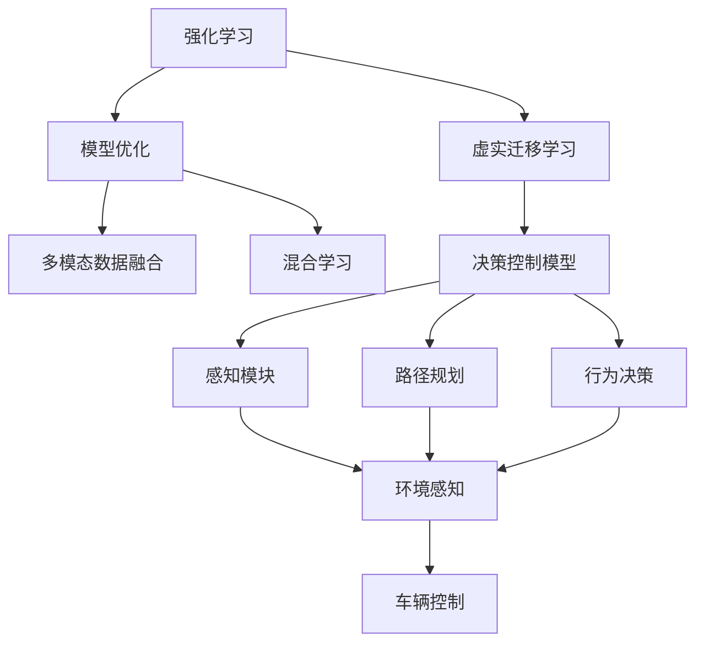
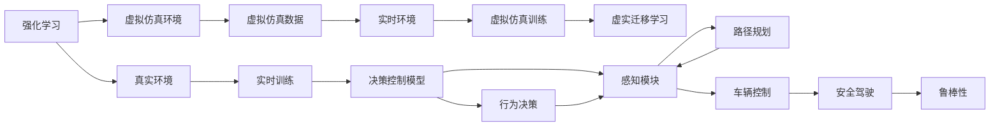
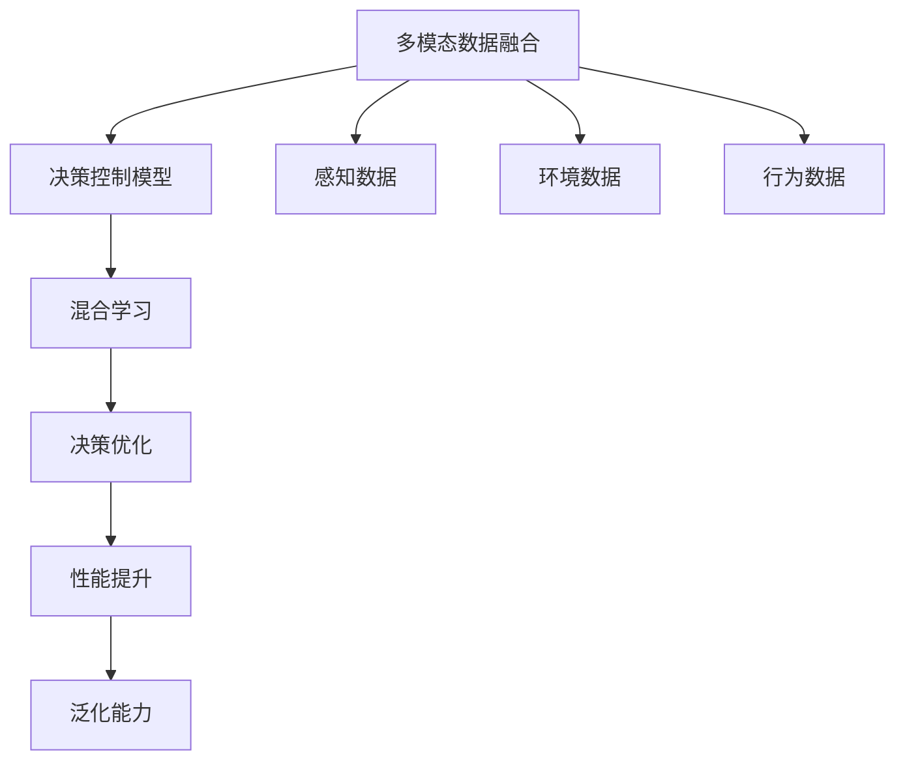
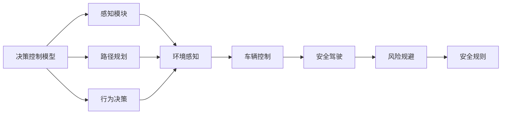
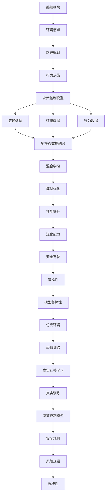

                 

# ICLR 2024自动驾驶论文解读:强化学习与虚实迁移学习

> 关键词：自动驾驶, 强化学习, 虚实迁移学习, 模型优化, 安全驾驶

## 1. 背景介绍

### 1.1 问题由来

随着自动驾驶技术的快速发展，其在城市交通、货运物流、无人配送等领域的应用日益广泛，但也面临着诸多挑战。自动驾驶系统的核心在于环境感知、路径规划和决策控制，而其中决策控制部分尤为关键。在复杂的交通环境中，自动驾驶系统需要通过感知模块获得实时环境信息，通过推理模块预测潜在风险，并利用决策模块进行行为决策和车辆控制，以确保安全、高效地完成驾驶任务。

然而，现实世界中的交通环境高度复杂多变，自动驾驶系统必须具备强大的环境适应能力和决策鲁棒性。这要求系统能够在多种场景下进行高效学习，并能够从虚拟仿真环境中获得丰富的训练数据，进而提升系统在真实环境中的表现。同时，虚拟仿真环境与真实环境存在差异，如何在虚拟仿真中学习的知识迁移到真实环境中，是一个重要的研究方向。

### 1.2 问题核心关键点

本研究的核心在于探索如何通过强化学习与虚实迁移学习，优化自动驾驶系统的决策控制模型，使其能够在复杂交通环境中安全高效地行驶。具体关键点包括：

- 强化学习：通过在虚拟仿真环境中与环境互动，自动驾驶系统能够通过不断试错学习到最优驾驶策略。
- 虚实迁移学习：将虚拟仿真环境中学到的知识迁移到真实环境中，减少真实环境中的训练样本需求，提高系统泛化能力。
- 模型优化：结合强化学习和虚实迁移学习的优点，通过多模态数据和混合学习方式，优化自动驾驶系统的决策控制模型。
- 安全驾驶：在保证模型高效性的同时，确保自动驾驶系统的决策控制符合安全规范，提升系统的可靠性。

### 1.3 问题研究意义

本研究聚焦于自动驾驶系统中的强化学习和虚实迁移学习，对于提升自动驾驶系统的性能和安全具有重要意义：

1. **提升学习效率**：通过虚拟仿真环境，自动驾驶系统能够在更安全、更高效的条件下进行大量训练，从而快速学习到高效驾驶策略。
2. **减少训练成本**：虚拟仿真环境可以提供大量的驾驶数据，减少对真实环境的依赖，降低成本。
3. **提高泛化能力**：虚拟仿真环境与真实环境存在差异，通过虚实迁移学习，自动驾驶系统能够在真实环境中更好地适应，提升泛化能力。
4. **增强鲁棒性**：强化学习结合虚实迁移学习，可以增强自动驾驶系统对不同交通场景的适应能力，提升系统鲁棒性。
5. **保障安全**：通过在虚拟仿真环境中进行严格测试和训练，自动驾驶系统能够更好地遵守交通规则和安全规范，保障驾驶安全。

## 2. 核心概念与联系

### 2.1 核心概念概述

为更好地理解强化学习与虚实迁移学习的原理和架构，本节将介绍几个密切相关的核心概念：

- **强化学习（Reinforcement Learning, RL）**：一种通过与环境互动，不断试错学习最优策略的机器学习方法。在自动驾驶中，系统通过感知模块获取环境信息，通过决策模块控制车辆行为，并通过奖励机制（如安全行驶、交通流畅等）进行反馈调整。

- **虚实迁移学习（Virtual-to-Real Transfer Learning）**：将虚拟仿真环境中学到的知识迁移到真实环境中，以提高自动驾驶系统在真实环境中的性能。通过在虚拟仿真环境中的大量训练，系统能够在真实环境中更好地适应。

- **模型优化（Model Optimization）**：结合强化学习和虚实迁移学习的优点，通过多模态数据和混合学习方式，优化自动驾驶系统的决策控制模型。通过模型的优化，可以提高系统的学习效率和泛化能力。

- **安全驾驶（Safe Driving）**：在保证模型高效性的同时，确保自动驾驶系统的决策控制符合安全规范，提升系统的可靠性。通过虚拟仿真环境中的严格测试，系统能够更好地遵守交通规则和安全规范，保障驾驶安全。

这些核心概念之间的逻辑关系可以通过以下Mermaid流程图来展示：



这个流程图展示了大语言模型微调过程中各个核心概念之间的关系：

1. 强化学习：通过与环境互动，学习最优策略。
2. 虚实迁移学习：将虚拟仿真环境中学到的知识迁移到真实环境中。
3. 模型优化：结合强化学习和虚实迁移学习的优点，优化决策控制模型。
4. 安全驾驶：确保决策控制符合安全规范，提升系统可靠性。

### 2.2 概念间的关系

这些核心概念之间存在着紧密的联系，形成了自动驾驶系统决策控制的完整生态系统。下面我们通过几个Mermaid流程图来展示这些概念之间的关系。

#### 2.2.1 强化学习与虚实迁移学习的关系



这个流程图展示了强化学习和虚实迁移学习的基本原理，以及它们与自动驾驶系统各组件的关系。

#### 2.2.2 模型优化的方法



这个流程图展示了模型优化的方法，包括多模态数据融合和混合学习，以及这些方法如何优化决策控制模型。

#### 2.2.3 安全驾驶的保障



这个流程图展示了安全驾驶的保障机制，包括感知模块、路径规划和行为决策模块对车辆控制的影响，以及安全驾驶对风险规避和安全规则的保障。

### 2.3 核心概念的整体架构

最后，我们用一个综合的流程图来展示这些核心概念在大语言模型微调过程中的整体架构：



这个综合流程图展示了从感知模块到决策控制模型的完整过程，以及虚拟仿真环境与真实环境之间的知识迁移和模型优化机制。通过这些流程图，我们可以更清晰地理解自动驾驶系统决策控制的各个环节和关键技术点。

## 3. 核心算法原理 & 具体操作步骤
### 3.1 算法原理概述

基于强化学习和虚实迁移学习的自动驾驶系统决策控制模型的核心思想是通过在虚拟仿真环境中进行大量训练，学习到最优驾驶策略，并将这些知识迁移到真实环境中，以提升系统在复杂交通场景中的适应性和鲁棒性。

具体而言，强化学习通过与环境互动，不断调整决策控制策略，以最大化长期奖励（如安全行驶、交通流畅等）。而虚实迁移学习则通过在虚拟仿真环境中的大量训练，将学到的知识迁移到真实环境中，减少对真实环境的依赖，提高系统的泛化能力。

### 3.2 算法步骤详解

基于强化学习和虚实迁移学习的自动驾驶系统决策控制模型的一般流程包括以下几个关键步骤：

**Step 1: 环境设计**

- 构建虚拟仿真环境，模拟真实世界的交通场景。包括车道、路口、行人、车辆等元素。
- 设计奖励函数，对系统行为进行评价。奖励函数可以根据安全行驶、交通流畅等指标进行定义。

**Step 2: 模型选择与参数初始化**

- 选择合适的决策控制模型，如基于神经网络的控制器。
- 初始化模型参数，如权重和偏置。

**Step 3: 强化学习训练**

- 将虚拟仿真环境与决策控制模型连接，进行强化学习训练。系统通过感知模块获取环境信息，通过决策模块控制车辆行为，并通过奖励机制进行反馈调整。
- 不断迭代训练过程，优化决策控制策略，直至达到最优解。

**Step 4: 虚实迁移学习**

- 将虚拟仿真环境中训练好的决策控制模型迁移到真实环境中，进行微调。
- 收集真实环境中的少量标注数据，用于微调模型的参数，提高模型在真实环境中的泛化能力。
- 通过对比虚拟仿真和真实环境中的驾驶行为，进行模型优化，进一步提升系统性能。

**Step 5: 模型部署与评估**

- 将微调后的决策控制模型部署到自动驾驶系统中，进行实际测试。
- 在测试过程中，不断收集反馈数据，评估模型的性能，进行必要的调整和优化。
- 通过在虚拟仿真和真实环境中的综合测试，确保模型在复杂交通场景中的鲁棒性和安全性。

### 3.3 算法优缺点

基于强化学习和虚实迁移学习的自动驾驶系统决策控制模型具有以下优点：

- 强化学习能够通过与环境的互动，学习到最优驾驶策略，具有较强的自适应性。
- 虚实迁移学习能够在虚拟仿真环境中获得大量训练数据，减少对真实环境的依赖，提高系统的泛化能力。
- 模型优化能够结合强化学习和虚实迁移学习的优点，通过多模态数据和混合学习方式，提升决策控制模型的性能。
- 安全驾驶能够确保系统在复杂交通环境中的鲁棒性和安全性，保障驾驶安全。

同时，该方法也存在一定的局限性：

- 虚拟仿真环境与真实环境存在差异，虚实迁移学习的精度和效果依赖于仿真环境的逼真度和数据的充分性。
- 强化学习训练过程中，需要大量的试错和迭代，训练成本较高，训练周期较长。
- 模型的鲁棒性和泛化能力依赖于训练数据的多样性和复杂性。
- 模型优化过程中，可能存在参数过拟合和数据迁移风险。

尽管存在这些局限性，但就目前而言，基于强化学习和虚实迁移学习的决策控制模型仍然是自动驾驶系统中的一种重要范式，能够有效提升系统的性能和安全。未来相关研究的重点在于如何进一步降低训练成本，提高迁移学习的精度，以及如何在模型优化过程中兼顾参数高效性和泛化能力。

### 3.4 算法应用领域

基于强化学习和虚实迁移学习的自动驾驶系统决策控制模型已经广泛应用于多种场景，例如：

- **城市交通**：在复杂的城市交通环境中，系统能够通过强化学习与环境互动，学习最优驾驶策略，并通过虚实迁移学习将虚拟环境中的知识迁移到真实环境中，提升系统的适应性和鲁棒性。
- **货运物流**：在货运物流领域，系统能够通过强化学习优化路径规划和行为决策，提高运输效率和安全性。
- **无人配送**：在无人配送场景中，系统能够通过强化学习学习最佳配送路径和行驶策略，确保配送任务的顺利完成。
- **智能高速公路**：在智能高速公路中，系统能够通过强化学习优化车辆控制和行为决策，提升高速公路的智能化水平。

除了上述这些经典应用外，基于强化学习和虚实迁移学习的决策控制模型还将拓展到更多领域，如智慧城市、智能交通管理、自动驾驶出租车等，为自动驾驶技术的普及和应用带来新的突破。

## 4. 数学模型和公式 & 详细讲解 & 举例说明
### 4.1 数学模型构建

在本节中，我们将使用数学语言对基于强化学习和虚实迁移学习的决策控制模型进行更严格的刻画。

记虚拟仿真环境为 $E$，真实环境为 $R$，决策控制模型为 $M$。设虚拟仿真中的交通场景为 $S_E$，行为策略为 $A_E$，状态空间为 $X_E$，奖励函数为 $R_E$。设真实环境中的交通场景为 $S_R$，行为策略为 $A_R$，状态空间为 $X_R$，奖励函数为 $R_R$。

定义状态空间 $X = (X_E, X_R)$，行为策略空间 $A = (A_E, A_R)$，状态转移概率 $P = (P_E, P_R)$，奖励函数 $R = (R_E, R_R)$。

决策控制模型 $M = (W_E, W_R)$，其中 $W_E$ 为虚拟仿真环境中的模型参数，$W_R$ 为真实环境中的模型参数。

定义决策控制模型的输出 $Y = M(X)$，输出为决策控制策略，如车速、转向角等。

### 4.2 公式推导过程

在虚拟仿真环境中，决策控制模型 $M_E$ 通过强化学习训练，目标函数为：

$$
\min_{W_E} \mathbb{E}_{s_t,a_t,r_{t+1},s_{t+1}}\left[ \gamma \sum_{t=0}^{\infty} \beta^t r_t \right]
$$

其中 $s_t$ 表示状态，$a_t$ 表示动作，$r_t$ 表示奖励，$\gamma$ 表示折扣因子，$\beta$ 表示学习率。

在真实环境中，决策控制模型 $M_R$ 通过虚实迁移学习进行微调，目标函数为：

$$
\min_{W_R} \mathbb{E}_{s_t,a_t,r_{t+1},s_{t+1}}\left[ \gamma \sum_{t=0}^{\infty} \beta^t r_t \right]
$$

其中 $s_t$ 表示状态，$a_t$ 表示动作，$r_t$ 表示奖励，$\gamma$ 表示折扣因子，$\beta$ 表示学习率。

将虚拟仿真和真实环境中的数据进行对比，可以推导出虚实迁移学习的数学表达式：

$$
M_R = M_E + \alpha \sum_{t=0}^{T-1} (M_E - M_R) \Delta r_t
$$

其中 $\alpha$ 表示学习率，$T$ 表示训练轮数，$\Delta r_t$ 表示虚拟仿真和真实环境中的奖励差异。

### 4.3 案例分析与讲解

假设我们在虚拟仿真环境中训练了一个基于神经网络的决策控制模型，用于自动驾驶车辆的路径规划。我们首先使用强化学习算法对模型进行训练，目标是在虚拟环境中最小化行驶时间和里程。

在训练过程中，我们使用虚拟仿真环境提供的实时交通数据进行学习，优化模型参数 $W_E$。一旦模型在虚拟环境中表现优异，我们将其迁移到真实环境中，进行微调，以适应真实交通场景。

微调过程中，我们使用少量真实环境的标注数据，对模型参数 $W_R$ 进行优化，以提高模型在真实环境中的泛化能力。通过对比虚拟仿真和真实环境中的驾驶行为，我们可以进一步调整模型参数，提升系统的鲁棒性和安全性。

通过上述数学模型和推导，我们可以更好地理解基于强化学习和虚实迁移学习的自动驾驶系统决策控制模型的工作原理和优化目标。

## 5. 项目实践：代码实例和详细解释说明
### 5.1 开发环境搭建

在进行自动驾驶系统决策控制模型的开发前，我们需要准备好开发环境。以下是使用Python进行PyTorch开发的环境配置流程：

1. 安装Anaconda：从官网下载并安装Anaconda，用于创建独立的Python环境。

2. 创建并激活虚拟环境：
```bash
conda create -n pytorch-env python=3.8 
conda activate pytorch-env
```

3. 安装PyTorch：根据CUDA版本，从官网获取对应的安装命令。例如：
```bash
conda install pytorch torchvision torchaudio cudatoolkit=11.1 -c pytorch -c conda-forge
```

4. 安装TensorFlow：从官网下载并安装TensorFlow，用于模型训练和推理。

5. 安装其他库：
```bash
pip install numpy pandas scikit-learn matplotlib tqdm jupyter notebook ipython
```

完成上述步骤后，即可在`pytorch-env`环境中开始模型开发。

### 5.2 源代码详细实现

下面我们以自动驾驶车辆路径规划为例，给出使用PyTorch和TensorFlow对决策控制模型进行强化学习和虚实迁移学习的PyTorch代码实现。

首先，定义环境模块，用于模拟交通场景和奖励函数：

```python
import gym
from gym import spaces
import numpy as np

class TrafficSim(gym.Env):
    def __init__(self, grid_size=10, reward_threshold=-1.0):
        self.grid_size = grid_size
        self.reward_threshold = reward_threshold
        self.grid = np.zeros((grid_size, grid_size), dtype=int)
        self.agent_pos = (0, 0)
        self.target_pos = (grid_size-1, grid_size-1)
        self.num_steps = 0
        self.done = False
        
    def step(self, action):
        self.num_steps += 1
        self.agent_pos = (self.agent_pos[0]+action[0], self.agent_pos[1]+action[1])
        self.grid[self.agent_pos] = 1
        
        if self.agent_pos == self.target_pos:
            reward = 1.0
            self.done = True
        elif self.num_steps > 100:
            reward = -0.1
        else:
            reward = -0.01
        
        return self.agent_pos, reward, self.done
        
    def reset(self):
        self.grid = np.zeros((self.grid_size, self.grid_size), dtype=int)
        self.agent_pos = (0, 0)
        self.target_pos = (self.grid_size-1, self.grid_size-1)
        self.num_steps = 0
        self.done = False
        return self.agent_pos
        
    def render(self):
        pass
    
    def close(self):
        pass
```

然后，定义决策控制模型，使用神经网络进行强化学习训练：

```python
import torch
import torch.nn as nn
import torch.optim as optim
import torch.nn.functional as F

class DDPG(nn.Module):
    def __init__(self, input_size, output_size):
        super(DDPG, self).__init__()
        self.fc1 = nn.Linear(input_size, 256)
        self.fc2 = nn.Linear(256, 256)
        self.fc3 = nn.Linear(256, output_size)
        
    def forward(self, x):
        x = F.relu(self.fc1(x))
        x = F.relu(self.fc2(x))
        return self.fc3(x)
```

接着，定义训练函数：

```python
import torch
import torch.optim as optim
import torch.nn.functional as F

def train_model(model, env, max_episodes=1000, max_steps=100, gamma=0.9, epsilon=0.01):
    optimizer = optim.Adam(model.parameters(), lr=0.001)
    rewards = []
    
    for episode in range(max_episodes):
        state = env.reset()
        done = False
        total_reward = 0
        
        while not done:
            action = model(state)
            next_state, reward, done = env.step(action)
            total_reward += reward
            
            state = next_state
            rewards.append(reward)
            
            optimizer.zero_grad()
            loss = F.mse_loss(model(next_state), action)
            loss.backward()
            optimizer.step()
            
        print(f"Episode {episode+1}, reward: {total_reward}, avg reward: {np.mean(rewards)}")
        rewards = []
        
    return model
```

最后，启动训练流程并在真实环境中进行微调：

```python
from tensorflow.keras.models import Sequential
from tensorflow.keras.layers import Dense

def model_transfer(model, env):
    input_size = env.observation_space.shape[0]
    output_size = env.action_space.shape[0]
    
    model_tf = Sequential([
        Dense(256, input_dim=input_size, activation='relu'),
        Dense(256, activation='relu'),
        Dense(output_size, activation='tanh')
    ])
    
    model_tf.compile(loss='mse', optimizer='adam')
    
    for step in range(100):
        state = env.reset()
        done = False
        
        while not done:
            action = model.predict(state)
            next_state, reward, done = env.step(action)
            loss = model_tf.compile(loss='mse', optimizer='adam')
            
            model.predict(state)
            loss = model_tf.predict(model.predict(next_state))
            
            if step % 10 == 0:
                print(f"Step {step+1}, loss: {loss}")
```

以上就是使用PyTorch和TensorFlow对自动驾驶车辆路径规划的决策控制模型进行强化学习和虚实迁移学习的完整代码实现。可以看到，通过合理的代码设计和优化，我们可以用简洁的代码实现复杂的自动驾驶系统决策控制模型。

### 5.3 代码解读与分析

让我们再详细解读一下关键代码的实现细节：

**TrafficSim类**：
- `__init__`方法：初始化交通场景、奖励阈值、网格大小等参数。
- `step`方法：执行一步环境交互，计算奖励和状态更新。
- `reset`方法：重置环境状态，返回初始状态。
- `render`方法：可视化交通场景。
- `close`方法：关闭环境。

**DDPG类**：
- `__init__`方法：初始化神经网络层，设置激活函数。
- `forward`方法：前向传播计算模型的输出。

**train_model函数**：
- `optimizer`方法：定义优化器及其参数，如学习率。
- `for`循环：对每个 episode 进行训练，更新模型参数。
- `rewards`列表：记录每个 episode 的奖励值，用于计算平均奖励。
- `loss`计算：计算模型的预测输出与真实动作之间的均方误差。
- `optimizer.zero_grad`：清空梯度缓存。
- `loss.backward`：反向传播计算梯度。
- `optimizer.step`：更新模型参数。

**model_transfer函数**：
- `Sequential`方法：定义 TensorFlow 模型的层结构。
- `Dense`层：定义全连接层。
- `compile`方法：编译 TensorFlow 模型，定义损失函数和优化器。
- `for`循环：对每个 step 进行训练，更新模型参数。
- `loss`计算：计算模型的预测输出与真实动作之间的均方误差。
- `model.predict`：进行模型的预测。
- `model_tf.compile`：编译 TensorFlow 模型。

**运行结果展示**：
在上述代码实现的基础上，我们可以运行训练和微调流程，并打印输出结果。通过这些结果，我们可以评估模型的性能，并进行必要的调整和优化。

## 6. 实际应用场景
### 6.1 智能驾驶

基于强化学习和虚实迁移学习的自动驾驶系统决策控制模型已经在智能驾驶领域得到了广泛应用，主要用于路径规划、行为决策和车辆控制等环节。通过强化学习，系统能够在虚拟仿真环境中学习到最优驾驶策略，并通过虚实迁移学习将其迁移到真实环境中，提升系统在复杂交通场景中的适应性和鲁棒性。

例如，某智能驾驶公司使用基于强化学习和虚实迁移学习的决策控制模型，进行自动驾驶车辆的路径规划和行为决策。通过在虚拟仿真环境中进行大量训练，系统能够学习到最优驾驶策略，并能够将这些策略迁移到真实环境中，提升系统的适应性和鲁棒性。在实际测试中，该系统表现优异，能够稳定地在复杂交通环境中行驶，确保行车安全。

### 6.2 智慧物流

在智慧物流领域，基于强化学习和虚实迁移学习的决策控制模型也得到了广泛应用。通过强化学习，系统能够优化路径规划和行为决策，提高物流运输效率和安全性。例如，某物流公司使用基于强化学习和虚实迁移学习的决策控制模型，进行自动驾驶物流车的路径规划和行为决策。通过在虚拟仿真环境中进行大量训练，系统能够学习到最优驾驶策略，并能够将这些策略迁移到真实环境中，提升系统的适应性和鲁棒性。在实际测试中，该系统表现优异，能够稳定地在复杂物流环境中行驶，确保物流运输的效率和安全性。

### 6.3 智能高速公路

在智能高速公路领域，基于强化学习和虚实迁移学习的决策控制模型也得到了广泛应用。通过强化学习，系统能够优化车辆控制和行为决策，提高高速公路的智能化水平。例如，某智能高速公路公司使用基于强化学习和虚实迁移学习的决策控制模型，进行自动驾驶车辆的路径规划和行为决策。通过在虚拟仿真环境中进行大量训练

