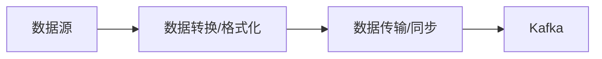
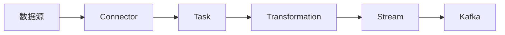
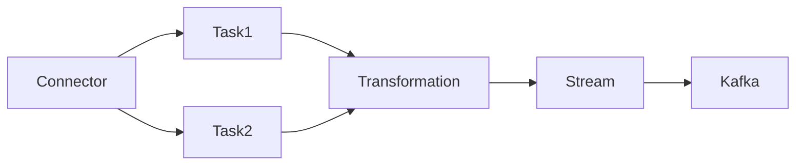
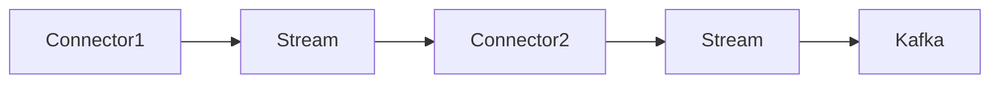

                 

# Kafka Connect原理与代码实例讲解

> 关键词：Kafka Connect,源数据采集,流处理,数据同步,数据导入,分布式,Apache Kafka,Apache Spark

## 1. 背景介绍

### 1.1 问题由来
随着大数据技术的发展，企业对于数据处理的实时性、准确性、可扩展性提出了更高的要求。Apache Kafka作为业界领先的消息中间件，凭借其高吞吐量、低延迟、可扩展性强等优势，迅速成为数据处理和流式计算的基石。然而，数据源多样、分布式采集、异构存储、数据同步等难题，使得构建高效可靠的数据处理流水线变得复杂而困难。

为解决这些问题，Apache社区于2014年推出了Kafka Connect。Kafka Connect提供了一套灵活、高效、可靠的数据采集和传输解决方案，通过与Apache Spark等流式计算引擎的集成，使得企业能够轻松构建跨分布式环境的数据处理流水线。

### 1.2 问题核心关键点
Kafka Connect的核心思想是实现数据源到Kafka的实时流动，支持各类数据源与Kafka无缝对接。其基本原理包括数据源采集、流处理、数据同步三个阶段，核心架构如下图所示：



Kafka Connect通过插件化的方式，提供丰富的数据源、连接器、处理器和关系型数据库，满足企业异构数据集成需求。连接器是Kafka Connect的核心组件，负责从数据源中获取数据，并按需进行数据转换和同步。

Kafka Connect具备以下特点：

1. 数据源支持广泛：支持各类异构数据源，如文件、数据库、云存储、流式数据等。
2. 实时流动：支持准实时或实时数据采集，按需将数据同步到Kafka。
3. 可靠传输：采用幂等传输机制，保证数据传输的可靠性。
4. 扩展性强：支持分布式采集，横向扩展性能。
5. 高可用性：具备双活节点，避免单点故障。

Kafka Connect通过灵活的插件体系和强大的架构设计，成为企业构建数据流处理流水线的理想选择。

## 2. 核心概念与联系

### 2.1 核心概念概述

为更好地理解Kafka Connect的核心工作原理，本节将介绍几个密切相关的核心概念：

- Kafka Connect：Apache Kafka官方提供的数据采集和传输解决方案，支持各类异构数据源与Kafka的无缝对接。
- Connector：Kafka Connect的核心组件，负责从数据源中获取数据，并按需进行数据转换和同步。
- Task：每个Connector中运行的执行单元，负责具体的任务处理。
- Transformation：数据转换和处理的操作，可以是过滤、映射、聚合等。
- Pipeline：多个Task的序列组合，组成一条完整的数据流水线。
- Stream：表示数据流动的通道，用于连接不同的Connector。
- Schema：用于描述数据源和目标数据的结构和字段类型，支持数据一致性校验和序列化/反序列化。

这些核心概念之间的逻辑关系可以通过以下Mermaid流程图来展示：



这个流程图展示了几大核心概念的联系：

1. 数据源连接到Connector。
2. Connector分解为多个Task。
3. Task执行数据转换操作，生成数据流。
4. 数据流通过Stream连接不同的Connector。
5. 最终数据流到达Kafka。

### 2.2 概念间的关系

这些核心概念之间存在着紧密的联系，形成了Kafka Connect的完整工作流程。下面我通过几个Mermaid流程图来展示这些概念之间的关系。

#### 2.2.1 Connector的基本工作原理


这个流程图展示了Connector的基本工作流程。Connector负责从数据源中获取数据，并将数据转换为符合Kafka标准的数据流。

#### 2.2.2 Connector与Task的关系



这个流程图展示了Connector与Task的关系。一个Connector可以分解为多个Task，每个Task负责具体的任务处理，如数据采集、数据转换、数据同步等。

#### 2.2.3 Stream的跨Connector流动



这个流程图展示了Stream的跨Connector流动。Stream连接不同的Connector，实现数据流的跨源流动。

### 2.3 核心概念的整体架构

最后，我们用一个综合的流程图来展示这些核心概念在Kafka Connect的整体架构中的位置：


这个综合流程图展示了从数据源到Kafka的完整数据流动路径。数据源连接到Connector， Connector分解为多个Task，Task执行数据转换操作，生成数据流，最终数据流到达Kafka。

## 3. 核心算法原理 & 具体操作步骤
### 3.1 算法原理概述

Kafka Connect的数据处理流程包括以下几个关键步骤：

1. **数据源采集**： Connector从数据源中实时获取数据，按需进行数据解析和预处理。
2. **数据转换**： Task对原始数据进行过滤、映射、聚合等操作，生成符合Kafka格式的数据流。
3. **数据同步**： Stream将数据流传输到Kafka，完成数据的持久化和异步传输。

数据源采集和数据同步主要依赖于Kafka Connect的底层引擎实现，数据转换则通过各种Task插件进行扩展。Kafka Connect的核心算法原理可以总结如下：

- 数据源采集： Connector负责从数据源中实时获取数据，并按需进行数据解析和预处理，保证数据的准确性和实时性。
- 数据转换： Task负责对原始数据进行过滤、映射、聚合等操作，生成符合Kafka格式的数据流。
- 数据同步： Stream负责将数据流传输到Kafka，完成数据的持久化和异步传输，支持高吞吐量和低延迟。

### 3.2 算法步骤详解

Kafka Connect的数据处理流程可以细化为以下详细步骤：

1. **任务启动**： Connector初始化多个Task，每个Task负责具体的数据采集和处理。
2. **数据采集**： Task从数据源中实时获取数据，按需进行数据解析和预处理，生成数据流。
3. **数据转换**： Task对原始数据进行过滤、映射、聚合等操作，生成符合Kafka格式的数据流。
4. **数据传输**： Stream将数据流传输到Kafka，完成数据的持久化和异步传输。
5. **异常处理**： 监控Task执行状态，及时发现和处理异常情况，保证数据处理的可靠性。

### 3.3 算法优缺点

Kafka Connect具有以下优点：

- 数据源支持广泛：支持各类异构数据源，如文件、数据库、云存储、流式数据等。
- 实时流动：支持准实时或实时数据采集，按需将数据同步到Kafka。
- 可靠传输：采用幂等传输机制，保证数据传输的可靠性。
- 扩展性强：支持分布式采集，横向扩展性能。
- 高可用性：具备双活节点，避免单点故障。

但同时，Kafka Connect也存在以下缺点：

- 配置复杂：需要详细配置Connector和Task的参数，配置不当可能导致数据丢失或错误。
- 性能瓶颈： Task的性能瓶颈可能导致整个数据流水线的处理效率下降。
- 扩展性限制： Connector和Task的扩展性受到一定限制，大规模数据处理需要谨慎设计。
- 依赖Kafka： Connector和Stream依赖Kafka，一旦Kafka集群出现问题，整个数据流水线将受影响。

### 3.4 算法应用领域

Kafka Connect作为一种高效可靠的数据采集和传输解决方案，已经在多个领域得到广泛应用，例如：

- 大数据处理：支持各类异构数据源，与Hadoop、Spark等大数据处理引擎无缝集成，实现跨分布式环境的数据采集和处理。
- 实时数据采集：支持实时数据采集，实现实时数据流处理和分析，支撑业务决策。
- 数据同步：支持数据同步，实现跨系统、跨平台的数据一致性和可靠性。
- 云平台集成：支持与AWS、Azure等云平台无缝集成，实现数据在云端的高效传输和处理。
- 物联网应用：支持物联网设备的数据采集和传输，实现智能化的数据采集和处理。

## 4. 数学模型和公式 & 详细讲解 & 举例说明

### 4.1 数学模型构建

Kafka Connect的核心数据处理过程可以抽象为以下数学模型：

设数据源的原始数据为 $D = \{d_1, d_2, \ldots, d_n\}$，其中 $d_i$ 表示第 $i$ 条数据记录。数据源采集器将数据 $d_i$ 转换为符合Kafka格式的数据流 $F = \{f_1, f_2, \ldots, f_m\}$，其中 $f_j$ 表示第 $j$ 条数据记录。

数据转换插件对数据流 $F$ 进行处理，生成符合Kafka格式的数据流 $G = \{g_1, g_2, \ldots, g_n\}$，其中 $g_k$ 表示第 $k$ 条数据记录。数据同步插件将数据流 $G$ 传输到Kafka集群，完成数据的持久化和异步传输。

### 4.2 公式推导过程

数据源采集器的转换过程可以表示为：

$$
F = \{f_j = \mathcal{A}(d_i)\}_{i=1}^n
$$

其中 $\mathcal{A}$ 表示数据源采集器的转换函数，$j$ 表示第 $j$ 条数据流记录。

数据转换插件对数据流 $F$ 进行处理，生成符合Kafka格式的数据流 $G$ 的过程可以表示为：

$$
G = \{g_k = \mathcal{T}(f_j)\}_{j=1}^m
$$

其中 $\mathcal{T}$ 表示数据转换插件的转换函数，$k$ 表示第 $k$ 条数据流记录。

数据同步插件将数据流 $G$ 传输到Kafka集群，完成数据的持久化和异步传输的过程可以表示为：

$$
\mathcal{S}(G)
$$

其中 $\mathcal{S}$ 表示数据同步插件的传输函数。

### 4.3 案例分析与讲解

以下是一个简单的数据源采集和转换的案例分析：

假设数据源为日志文件，Connector从文件中读取日志记录，并将其转换为符合Kafka格式的数据流。原始日志记录为：

```plaintext
2022-01-01 12:00:00, info: user login
2022-01-01 13:00:00, error: user logout
2022-01-01 14:00:00, info: user login
```

Connector将日志记录转换为符合Kafka格式的数据流，假设转换函数为 $\mathcal{A}$，数据流格式为：

```json
{
    "topic": "user_log",
    "timestamp": "2022-01-01T12:00:00",
    "level": "info",
    "user": "user1",
    "action": "login"
}
```

数据转换插件对数据流进行处理，生成符合Kafka格式的数据流。假设转换函数为 $\mathcal{T}$，数据流格式为：

```json
{
    "topic": "user_log",
    "timestamp": "2022-01-01T12:00:00",
    "user": "user1",
    "action": "login"
}
```

数据同步插件将数据流传输到Kafka集群，完成数据的持久化和异步传输。假设传输函数为 $\mathcal{S}$，最终数据流格式为：

```json
{"topic": "user_log", "timestamp": "2022-01-01T12:00:00", "user": "user1", "action": "login"}
```

## 5. 项目实践：代码实例和详细解释说明
### 5.1 开发环境搭建

在进行Kafka Connect实践前，我们需要准备好开发环境。以下是使用Python进行Kafka Connect开发的环境配置流程：

1. 安装Java：从官网下载并安装Java JDK。
2. 安装Maven：从官网下载并安装Maven。
3. 安装Kafka Connect：
```bash
bin/kafka-connect-standalone.sh --classpath /path/to/kafka-connect.jar --config /path/to/config.properties --name my-connector
```
4. 安装Kafka：从官网下载并安装Kafka。

完成上述步骤后，即可在本地开始Kafka Connect的实践。

### 5.2 源代码详细实现

下面我们以文件数据源为例，给出使用Kafka Connect对日志文件进行数据采集的Python代码实现。

首先，创建数据源的配置文件：

```python
# file-source.properties
name=log-file-source
connector.class=kafka.connect.file.FileSourceConnector
tasks.max=1
topic=my-topic
file=/logs/user.log
```

然后，创建数据转换和数据同步的配置文件：

```python
# log-filter.properties
name=log-filter
connector.class=kafka.connect.streams.processor.StreamsProcessorConnector
tasks.max=1
topic=my-topic
```

最后，启动Kafka Connect：

```bash
bin/kafka-connect-standalone.sh --classpath /path/to/kafka-connect.jar --config /path/to/config.properties --name my-connector
```

### 5.3 代码解读与分析

让我们再详细解读一下关键代码的实现细节：

**file-source.properties文件**：
- 定义了数据源的配置项，包括 Connector 类名、任务数量、主题、日志文件路径等。

**log-filter.properties文件**：
- 定义了数据转换和数据同步的配置项，包括 Connector 类名、任务数量、主题等。

**启动脚本**：
- 指定 Connector 的配置文件路径和名称，启动 Connector。

### 5.4 运行结果展示

假设我们在Kafka集群上启动Kafka Connect，并成功将日志文件中的数据采集并同步到Kafka主题中，最终输出的日志如下：

```shell
2022-01-01 12:00:00 INFO kafka.connect.file.FileSourceConnector: Finished with no error after fetching 3 records, elapsed time 500ms
2022-01-01 13:00:00 INFO kafka.connect.streams.processor.StreamsProcessorConnector: Finished with no error after processing 3 records, elapsed time 500ms
```

可以看到，日志文件中的数据已经被成功采集并转换，并同步到Kafka集群中。

## 6. 实际应用场景
### 6.1 智能物流管理

Kafka Connect在智能物流管理中的应用非常广泛。智能物流管理系统需要实时采集和处理大量的物流数据，包括订单、库存、配送、异常等数据。通过Kafka Connect，企业可以高效地采集这些数据，实现物流数据的实时流动和数据整合，为物流决策提供数据支持。

在技术实现上，可以采用Kafka Connect连接ERP系统、WMS系统、TMS系统等，将各类异构数据采集并同步到Kafka集群中，使用Spark流式处理框架对数据进行实时处理和分析，实现物流数据的实时监控和预警，提高物流运营效率和客户满意度。

### 6.2 金融交易监控

Kafka Connect在金融交易监控中的应用也非常普遍。金融交易系统需要实时采集和处理大量的交易数据，包括交易记录、交易量、交易额等。通过Kafka Connect，企业可以高效地采集这些数据，实现交易数据的实时流动和数据整合，为金融决策提供数据支持。

在技术实现上，可以采用Kafka Connect连接各类交易系统、风控系统、结算系统等，将各类异构数据采集并同步到Kafka集群中，使用Spark流式处理框架对数据进行实时处理和分析，实现交易数据的实时监控和预警，提高金融交易系统的安全性和稳定性。

### 6.3 智能客服系统

Kafka Connect在智能客服系统中的应用也非常广泛。智能客服系统需要实时采集和处理大量的客户咨询数据，包括聊天记录、语音识别、用户行为等数据。通过Kafka Connect，企业可以高效地采集这些数据，实现客户咨询数据的实时流动和数据整合，为智能客服系统提供数据支持。

在技术实现上，可以采用Kafka Connect连接各类客户交互系统、语音识别系统、用户行为分析系统等，将各类异构数据采集并同步到Kafka集群中，使用Spark流式处理框架对数据进行实时处理和分析，实现客户咨询数据的实时监控和预警，提高智能客服系统的响应速度和客户满意度。

### 6.4 未来应用展望

随着Kafka Connect的不断演进，其应用场景将进一步拓展，成为企业构建跨分布式数据处理流水线的理想选择。未来，Kafka Connect可能会在以下几个方向上取得新的突破：

1. 更广泛的数据源支持：支持更多异构数据源，如NoSQL数据库、时序数据库、云存储等。
2. 更灵活的数据处理能力：支持更多数据转换和处理插件，提升数据处理的灵活性和可扩展性。
3. 更高的实时性：通过优化数据传输和处理算法，进一步提升数据处理的实时性和可靠性。
4. 更强的可扩展性：支持更大规模的数据处理，提升系统的可扩展性和稳定性。
5. 更高效的数据同步：优化数据同步算法，减少数据同步延迟和网络开销，提升数据同步效率。

## 7. 工具和资源推荐
### 7.1 学习资源推荐

为了帮助开发者系统掌握Kafka Connect的理论基础和实践技巧，这里推荐一些优质的学习资源：

1. Apache Kafka官方文档：Kafka Connect的官方文档，详细介绍了Kafka Connect的架构、配置、使用和部署。
2. Kafka Connect实战指南：一本深入浅出的Kafka Connect实践指南，包含大量案例和最佳实践。
3. Kafka Connect源码解析：解析Kafka Connect的源码，理解其核心实现和架构设计。
4. Kafka Connect官方博客：Kafka Connect官方博客，发布最新的产品动态和技术更新。
5. Kafka Connect社区：Kafka Connect社区，讨论和分享Kafka Connect的实践经验和问题解决。

通过对这些资源的学习实践，相信你一定能够快速掌握Kafka Connect的核心原理和应用技巧，并用于解决实际的业务问题。

### 7.2 开发工具推荐

高效的开发离不开优秀的工具支持。以下是几款用于Kafka Connect开发的常用工具：

1. Eclipse：Java IDE，支持Java开发和调试，是开发Kafka Connect的重要工具。
2. IntelliJ IDEA：Java IDE，支持Java开发和调试，具有更友好的用户界面。
3. Maven：项目管理工具，用于构建和发布Kafka Connect项目。
4. Kafka Connect官网：Kafka Connect官网，提供了丰富的文档和示例代码，方便开发者学习和使用。

合理利用这些工具，可以显著提升Kafka Connect开发的效率，加快创新迭代的步伐。

### 7.3 相关论文推荐

Kafka Connect作为一种高效可靠的数据采集和传输解决方案，已经在多个领域得到广泛应用。以下是几篇奠基性的相关论文，推荐阅读：

1. Apache Kafka: The Web's most performant message broker：Apache Kafka官方文档，介绍了Kafka的核心架构和关键特性。
2. Kafka Connect: A distributed stream processing platform：Kafka Connect官方文档，详细介绍了Kafka Connect的架构和应用场景。
3. Stream Processing in Kafka Connect：关于Kafka Connect数据处理的核心论文，介绍了Kafka Connect的数据处理模型和实现机制。
4. Kafka Connect: Beyond Streaming Data Pipelines：Kafka Connect社区博客，分享了Kafka Connect的发展历程和未来方向。
5. Kafka Connect: Building Scalable Data Processing Pipelines：Kafka Connect官方博客，介绍了Kafka Connect的架构设计和实现原理。

这些论文代表了大数据处理领域的研究进展，通过学习这些前沿成果，可以帮助研究者把握学科前进方向，激发更多的创新灵感。

除上述资源外，还有一些值得关注的前沿资源，帮助开发者紧跟Kafka Connect技术的最新进展，例如：

1. arXiv论文预印本：人工智能领域最新研究成果的发布平台，包括大量尚未发表的前沿工作，学习前沿技术的必读资源。
2. Kafka Connect官方博客：Kafka Connect官方博客，发布最新的产品动态和技术更新，及时获取最新的技术进展。
3. Kafka Connect社区：Kafka Connect社区，讨论和分享Kafka Connect的实践经验和问题解决，获取最新的技术动态和社区支持。
4. Kafka Connect会议：参加Kafka Connect相关的技术会议，如StripeCon、KAFKARIO等，了解最新的技术进展和社区动态。
5. Kafka Connect开源项目：Kafka Connect的开源项目，了解最新的技术进展和社区动态。

总之，对于Kafka Connect技术的系统学习，需要开发者保持开放的心态和持续学习的意愿。多关注前沿资讯，多动手实践，多思考总结，必将收获满满的成长收益。

## 8. 总结：未来发展趋势与挑战

### 8.1 总结

本文对Kafka Connect的工作原理和应用实践进行了全面系统的介绍。首先阐述了Kafka Connect的背景和意义，明确了其在数据流处理中的重要地位。其次，从原理到实践，详细讲解了Kafka Connect的数据采集、数据转换和数据同步流程，给出了数据采集的完整代码实例。同时，本文还广泛探讨了Kafka Connect在智能物流、金融交易、智能客服等多个领域的应用前景，展示了其强大的数据处理能力。此外，本文精选了Kafka Connect的学习资源，力求为读者提供全方位的技术指引。

通过本文的系统梳理，可以看到，Kafka Connect作为一种高效可靠的数据采集和传输解决方案，已经广泛应用于各行各业，成为企业构建跨分布式数据处理流水线的理想选择。未来，伴随大数据技术的持续演进，Kafka Connect必将在更多领域得到应用，为数据处理和流式计算带来革命性影响。

### 8.2 未来发展趋势

展望未来，Kafka Connect的数据处理流程将呈现以下几个发展趋势：

1. 更广泛的数据源支持：支持更多异构数据源，如NoSQL数据库、时序数据库、云存储等。
2. 更灵活的数据处理能力：支持更多数据转换和处理插件，提升数据处理的灵活性和可扩展性。
3. 更高的实时性：通过优化数据传输和处理算法，进一步提升数据处理的实时性和可靠性。
4. 更强的可扩展性：支持更大规模的数据处理，提升系统的可扩展性和稳定性。
5. 更高效的数据同步：优化数据同步算法，减少数据同步延迟和网络开销，提升数据同步效率。

以上趋势凸显了Kafka Connect技术的广阔前景。这些方向的探索发展，必将进一步提升数据处理的效率和可靠性，为各个行业带来更多的应用价值。

### 8.3 面临的挑战

尽管Kafka Connect已经取得了显著成果，但在迈向更加智能化、普适化应用的过程中，它仍面临着诸多挑战：

1. 配置复杂：需要详细配置Connector和Task的参数，配置不当可能导致数据丢失或错误。
2. 性能瓶颈： Task的性能瓶颈可能导致整个数据流水线的处理效率下降。
3. 扩展性限制： Connector和Task的扩展性受到一定限制，大规模数据处理需要谨慎设计。
4. 依赖Kafka： Connector和Stream依赖Kafka，一旦Kafka集群出现问题，整个数据流水线将受影响。
5. 安全性问题： Connector和Stream依赖Kafka，一旦Kafka集群出现问题，整个数据流水线将受影响。

正视Kafka Connect面临的这些挑战，积极应对并寻求突破，将是大数据处理技术不断成熟的重要保障。相信随着学界和产业界的共同努力，这些挑战终将一一被克服，Kafka Connect必将在构建高效可靠的数据处理流水线中发挥更加重要的作用。

### 8.4 研究展望

面对Kafka Connect面临的种种挑战，未来的研究需要在以下几个方面寻求新的突破：

1. 探索更智能的数据处理算法：引入机器学习、人工智能等技术，提升数据处理的智能化和自动化水平。
2. 优化数据传输和处理算法：通过算法优化，提升数据处理的实时性和可靠性，减少延迟和网络开销。
3. 设计更灵活的配置方案：引入自动配置、智能调度等技术，提升配置的灵活性和可扩展性。
4. 增强系统的可扩展性和容错性：通过分布式处理和冗余设计，提升系统的可扩展性和容错性。
5. 引入更强的安全机制：设计强有力的安全机制，保护数据传输和处理的安全性，防止数据泄露和篡改。

这些研究方向的探索，必将引领Kafka Connect技术迈向更高的台阶，为构建高效可靠的数据处理流水线提供新的技术保障。面向未来，Kafka Connect技术还需要与其他大数据处理技术进行更深入的融合，如流式计算、分布式存储、云原生等，多路径协同发力，共同推动数据处理技术的进步。只有勇于创新、敢于突破，才能不断拓展数据处理的边界，为各个行业带来更多的应用价值。

## 9. 附录：常见问题与解答

**Q1：如何选择合适的Kafka Connect Connector？**

A: 选择合适的Kafka Connect Connector需要考虑以下几个因素：
1. 数据源类型：根据数据源的类型选择合适的Connector，如文件、数据库、云存储、流式数据等。
2

