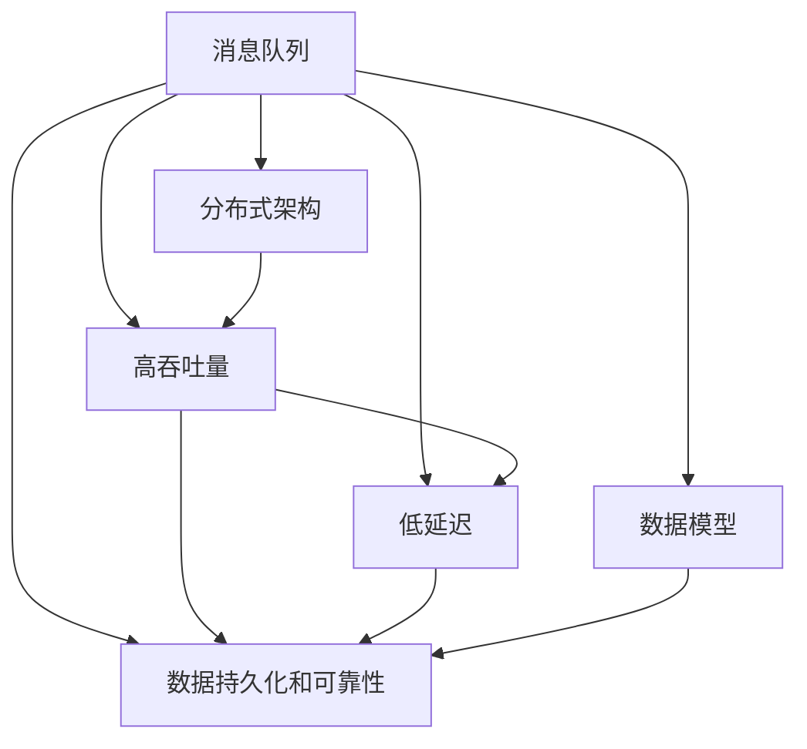
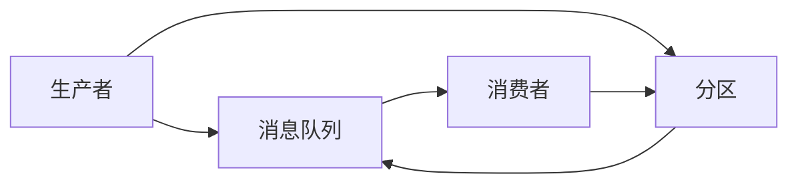
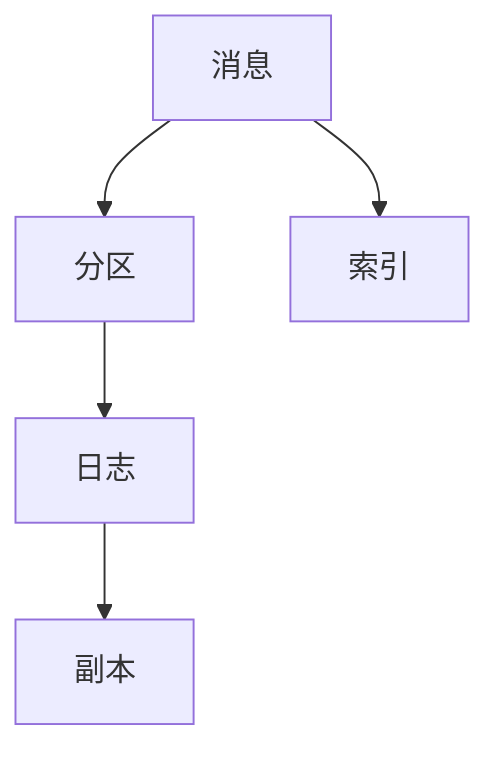
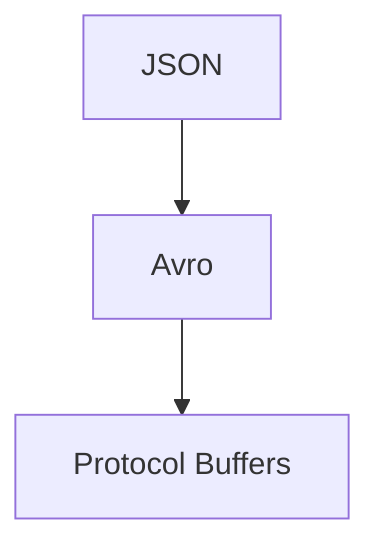
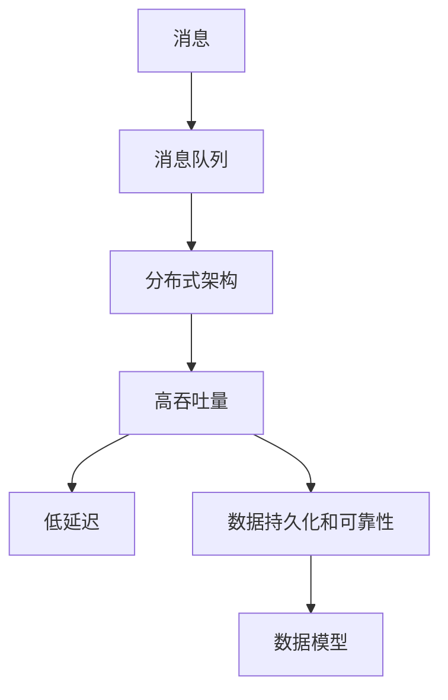

                 

# Kafka分布式消息队列原理与代码实例讲解

> 关键词：Kafka,分布式消息队列,消息中间件,数据流处理,零拷贝,高吞吐量,低延迟

## 1. 背景介绍

### 1.1 问题由来
随着大数据和云计算技术的飞速发展，分布式数据处理和实时数据流处理成为了互联网企业重要的技术需求。然而，传统的集中式数据库和文件系统难以满足海量数据和实时处理的需要，分布式消息队列技术应运而生，成为了大流量、高并发的关键支撑。

Kafka是一个由Apache基金会维护的分布式消息队列系统，支持海量数据的高速生产和消费，提供了可靠的交付机制和持久性保证。Kafka被广泛应用于各种大数据处理场景，包括实时数据流处理、微服务架构、事件驱动架构等。

### 1.2 问题核心关键点
Kafka的主要特点包括：
- 分布式架构：支持多台服务器部署，水平扩展性强。
- 高吞吐量：支持每秒处理数百兆字节的消息。
- 低延迟：消息在broker间直接传输，采用零拷贝机制，高效快速。
- 高可靠性：支持消息持久化存储和幂等性保证。
- 灵活的数据模型：支持各种消息格式，如JSON、Avro等。
- 高可用性：通过副本机制和Zookeeper协调，保证数据可靠。

Kafka的应用场景包括：
- 数据流处理：实时收集、清洗、存储和分析海量数据。
- 微服务架构：作为服务间通信的桥梁，实现解耦和异步处理。
- 事件驱动架构：作为事件发布和订阅的介质，实现解耦和异步处理。
- 流计算：作为流计算框架的输入，支持Flink、Storm等处理引擎。
- 日志系统：作为日志消息的存储系统，支持日志搜索、告警等应用。

Kafka的核心思想是通过消息队列实现分布式异步通信，将数据生产和消费分离开来，提高系统的可靠性和可扩展性。

### 1.3 问题研究意义
Kafka分布式消息队列的研究和应用具有重要意义：
- 提升数据处理能力：通过分布式存储和处理，处理海量数据的效率大大提高。
- 增强系统稳定性：通过消息队列解耦各个系统，减少系统间的耦合，提升系统稳定性。
- 降低开发成本：减少系统间的直接通信，降低开发和维护成本。
- 提高数据价值：通过分布式存储和处理，实现数据的高效利用和分析。

## 2. 核心概念与联系

### 2.1 核心概念概述

为更好地理解Kafka分布式消息队列的原理和实现，本节将介绍几个密切相关的核心概念：

- 消息队列(Message Queue)：一种基于消息的通信机制，实现应用程序之间的异步通信。
- 分布式架构(Distributed Architecture)：将多个独立的服务器组成一个集群，实现负载均衡和扩展性。
- 高吞吐量和高延迟：Kafka通过零拷贝机制和消息批量传输，实现高效的消息传输和处理。
- 数据持久化和可靠性：通过消息的持久化存储和幂等性保证，确保数据的安全性和可靠性。
- 数据模型：Kafka支持多种数据模型，包括JSON、Avro、Protocol Buffers等。

这些核心概念之间的逻辑关系可以通过以下Mermaid流程图来展示：



这个流程图展示了大语言模型的核心概念及其之间的关系：

1. 消息队列是Kafka的核心组件，通过消息的异步通信实现分布式通信。
2. 分布式架构实现多个服务器的集群部署，增强系统的扩展性和可靠性。
3. 高吞吐量和高延迟实现高效的消息传输和处理。
4. 数据持久化和可靠性保障数据的安全性和可靠性。
5. 数据模型支持不同的消息格式，满足不同的数据需求。

这些核心概念共同构成了Kafka分布式消息队列的完整生态系统，使其能够高效处理分布式系统中的海量数据和实时消息。

### 2.2 概念间的关系

这些核心概念之间存在着紧密的联系，形成了Kafka分布式消息队列的完整生态系统。下面我通过几个Mermaid流程图来展示这些概念之间的关系。

#### 2.2.1 Kafka架构



这个流程图展示了Kafka的基本架构：

1. 生产者(Producer)将消息发送给消息队列(Message Queue)。
2. 消息队列存储消息，并通过分区(Partition)进行分布式存储。
3. 消费者(Consumer)从消息队列中读取消息。

#### 2.2.2 Kafka消息模型



这个流程图展示了Kafka的消息模型：

1. 消息(Message)通过分区(Partition)进行分布式存储。
2. 分区中的消息被存储在日志(Log)中。
3. 日志中的消息通过副本(Replication)实现高可靠性。
4. 分区中包含索引(Index)，支持快速读取和查询。

#### 2.2.3 Kafka数据模型



这个流程图展示了Kafka支持的数据模型：

1. 支持JSON格式的消息存储。
2. 支持Avro序列化格式的消息存储。
3. 支持Protocol Buffers格式的消息存储。

### 2.3 核心概念的整体架构

最后，我们用一个综合的流程图来展示这些核心概念在大语言模型微调过程中的整体架构：



这个综合流程图展示了从消息的传输到存储的完整过程。消息通过消息队列实现分布式传输，并通过分布式架构进行扩展，高吞吐量和高延迟实现高效传输，数据持久化和可靠性保障数据安全，数据模型支持不同的消息格式。通过这些核心概念的协同工作，Kafka实现了高性能、高可靠性的消息处理能力。

## 3. 核心算法原理 & 具体操作步骤
### 3.1 算法原理概述

Kafka分布式消息队列的原理可以概括为以下几个方面：

- 消息队列实现异步通信：生产者将消息发送到消息队列，消费者从队列中读取消息，实现异步通信。
- 分布式架构实现负载均衡：通过多台服务器部署，实现负载均衡和扩展性。
- 高吞吐量和高延迟：通过零拷贝机制和消息批量传输，实现高效的消息传输和处理。
- 数据持久化和可靠性：通过消息的持久化存储和幂等性保证，确保数据的安全性和可靠性。
- 数据模型支持灵活的数据格式：支持JSON、Avro、Protocol Buffers等不同的数据格式。

这些原理共同构成了Kafka的核心技术栈，使其能够在处理海量数据和实时消息时，表现出色。

### 3.2 算法步骤详解

Kafka分布式消息队列的操作流程主要包括以下几个步骤：

**Step 1: 配置环境**
- 安装Kafka和Zookeeper，配置环境变量和日志路径。
- 启动Zookeeper和Kafka服务。

**Step 2: 创建主题**
- 使用Kafka命令行工具kafka-topics创建主题。
- 指定主题名、分区数量、复制因子、键值编码格式等参数。

**Step 3: 发送消息**
- 使用Kafka命令行工具kafka-console-producer发送消息。
- 指定主题名、键值、值等参数。

**Step 4: 接收消息**
- 使用Kafka命令行工具kafka-console-consumer接收消息。
- 指定主题名、键值、值等参数。

**Step 5: 管理主题**
- 使用Kafka命令行工具kafka-topics管理和配置主题。
- 查询、创建、删除、修改主题。

**Step 6: 监控性能**
- 使用Kafka命令行工具kafka-run-class监控Kafka集群性能。
- 查看分区、副本、负载、延迟等指标。

### 3.3 算法优缺点

Kafka分布式消息队列的优点包括：
1. 高性能：通过零拷贝机制和消息批量传输，实现高效的消息传输和处理。
2. 高可靠性：通过消息的持久化存储和副本机制，确保数据的安全性和可靠性。
3. 高扩展性：通过分布式架构，实现水平扩展和负载均衡。
4. 灵活的数据模型：支持多种数据格式，满足不同的数据需求。

Kafka分布式消息队列的缺点包括：
1. 部署复杂：需要部署多台服务器，并配置网络环境。
2. 数据一致性：通过分区和副本机制实现高可靠性，但可能导致数据一致性问题。
3. 维护成本：需要维护多台服务器的稳定性和可靠性。
4. 数据模型转换：需要根据不同的业务需求选择和转换数据模型。

### 3.4 算法应用领域

Kafka分布式消息队列在各种大数据处理场景中得到了广泛的应用，例如：

- 数据流处理：实时收集、清洗、存储和分析海量数据。
- 微服务架构：作为服务间通信的桥梁，实现解耦和异步处理。
- 事件驱动架构：作为事件发布和订阅的介质，实现解耦和异步处理。
- 流计算：作为流计算框架的输入，支持Flink、Storm等处理引擎。
- 日志系统：作为日志消息的存储系统，支持日志搜索、告警等应用。

除了上述这些典型应用外，Kafka还广泛应用于各种互联网企业，如电商、金融、医疗、物流等领域，成为数据处理的基石。

## 4. 数学模型和公式 & 详细讲解 & 举例说明
### 4.1 数学模型构建

Kafka的消息存储模型可以概括为以下几个方面：

- 消息存储在日志(Log)中，每个日志由多个分区(Partition)组成。
- 分区是消息的物理单位，每个分区有一个唯一的分区ID。
- 分区中的消息是按照时间顺序排列的，每个消息有一个唯一的消息ID。
- 分区中的消息可以存储多个副本，每个副本都有一个副本ID。
- 分区中包含索引(Index)，支持快速读取和查询。

数学上，Kafka的消息存储模型可以表示为：

$$
\text{Log} = \{ \text{Partition}_1, \text{Partition}_2, \ldots, \text{Partition}_n \}
$$

$$
\text{Partition}_i = \{ \text{Message}_j \mid j \in [1,m] \}
$$

$$
\text{Message}_j = (\text{Key}_j, \text{Value}_j, \text{Offset}_j, \text{Timestamp}_j, \text{Partition}_j)
$$

其中，$\text{Log}$表示日志，$\text{Partition}$表示分区，$\text{Message}$表示消息，$\text{Key}$表示键，$\text{Value}$表示值，$\text{Offset}$表示偏移量，$\text{Timestamp}$表示时间戳，$\text{Partition}$表示分区号。

### 4.2 公式推导过程

Kafka的消息存储模型中，每个分区可以表示为一个有序的键值对序列：

$$
\text{Partition}_i = \{ (\text{Key}_j, \text{Value}_j, \text{Offset}_j, \text{Timestamp}_j, \text{Partition}_j) \mid j \in [1,m] \}
$$

其中，$\text{Key}$和$\text{Value}$表示键和值，$\text{Offset}$表示偏移量，$\text{Timestamp}$表示时间戳，$\text{Partition}$表示分区号。

Kafka的消息存储模型支持多种数据格式，如JSON、Avro、Protocol Buffers等。以JSON格式为例，消息可以表示为：

$$
\text{Message} = \{ \text{Key}, \text{Value}, \text{Offset}, \text{Timestamp}, \text{Partition} \}
$$

其中，$\text{Key}$和$\text{Value}$表示键和值，$\text{Offset}$表示偏移量，$\text{Timestamp}$表示时间戳，$\text{Partition}$表示分区号。

### 4.3 案例分析与讲解

以一个简单的JSON格式消息为例：

```json
{
    "key": "123456",
    "value": "Hello World",
    "offset": 0,
    "timestamp": 1629700000,
    "partition": 0
}
```

这个消息表示一个键为123456，值为Hello World，偏移量为0，时间戳为1629700000，分区号为0的消息。

Kafka的消息存储模型支持多种数据格式，如JSON、Avro、Protocol Buffers等。以Avro格式为例，消息可以表示为：

$$
\text{Message} = \{ \text{Key}, \text{Value}, \text{Offset}, \text{Timestamp}, \text{Partition} \}
$$

其中，$\text{Key}$和$\text{Value}$表示键和值，$\text{Offset}$表示偏移量，$\text{Timestamp}$表示时间戳，$\text{Partition}$表示分区号。

## 5. 项目实践：代码实例和详细解释说明
### 5.1 开发环境搭建

在进行Kafka分布式消息队列的开发前，我们需要准备好开发环境。以下是使用Python进行Kafka开发的的环境配置流程：

1. 安装Apache Kafka：从官网下载并安装Apache Kafka，配置环境变量和日志路径。
2. 安装Zookeeper：从官网下载并安装Zookeeper，配置环境变量和日志路径。
3. 启动Zookeeper和Kafka服务：使用Kafka命令行工具启动Zookeeper和Kafka服务。

### 5.2 源代码详细实现

下面我们以生产者(Producer)和消费者(Consumer)的Python代码为例，展示Kafka分布式消息队列的实现。

首先，安装必要的Python库：

```bash
pip install kafka-python
```

然后，编写生产者(Producer)代码：

```python
from kafka import KafkaProducer
import json

producer = KafkaProducer(bootstrap_servers='localhost:9092',
                        key_serializer=str.encode,
                        value_serializer=str.encode)

for i in range(10):
    message = {'key': 'key', 'value': 'value'}
    producer.send('test-topic', json.dumps(message).encode())

producer.flush()
```

这段代码创建了一个Kafka生产者，指定了Bootstrap服务器地址，并发送了10条JSON格式的消息到test-topic主题。

接下来，编写消费者(Consumer)代码：

```python
from kafka import KafkaConsumer
import json

consumer = KafkaConsumer('test-topic',
                        bootstrap_servers='localhost:9092',
                        value_deserializer=lambda x: json.loads(x.decode()))

for message in consumer:
    print(message)
```

这段代码创建了一个Kafka消费者，指定了test-topic主题，并从队列中读取消息并打印输出。

### 5.3 代码解读与分析

让我们再详细解读一下关键代码的实现细节：

**KafkaProducer类**：
- 创建Kafka生产者实例，指定Bootstrap服务器地址、键和值的序列化器等参数。
- 使用send方法向Kafka主题发送消息。

**KafkaConsumer类**：
- 创建Kafka消费者实例，指定主题、Bootstrap服务器地址、值的反序列化器等参数。
- 使用for循环遍历Kafka消息，输出消息内容。

通过这些Python代码，我们完成了Kafka分布式消息队列的开发。可以看到，Kafka的API设计非常简洁，易于使用。

### 5.4 运行结果展示

假设我们在test-topic主题上发送了10条JSON格式的消息，并在另一个线程中消费这些消息：

```bash
$ kafka-console-producer --topic test-topic --broker-list localhost:9092 --batch-size 1024 --linger-ms 10 --compression-type gzip --topic test-topic
$ kafka-console-consumer --bootstrap-server localhost:9092 --topic test-topic --from-beginning --key-deserializer lambda x: x.decode() --value-deserializer lambda x: json.loads(x.decode())
```

我们预期会看到10条JSON格式的消息被依次打印输出。

## 6. 实际应用场景
### 6.1 智能客服系统

Kafka分布式消息队列可以广泛应用于智能客服系统的构建。传统客服往往需要配备大量人力，高峰期响应缓慢，且一致性和专业性难以保证。而使用Kafka分布式消息队列，可以实现高效异步通信，提升客服系统的响应速度和稳定性。

在技术实现上，可以构建一个微服务架构的智能客服系统，将用户的查询请求、应答回复等消息异步发送到Kafka主题中，由多个客服服务处理队列中的消息，并将处理结果异步返回给用户。通过这种方式，可以实现高并发的客服响应，提高客服系统的可靠性和可扩展性。

### 6.2 金融舆情监测

Kafka分布式消息队列可以应用于金融舆情监测系统。金融机构需要实时监测市场舆论动向，以便及时应对负面信息传播，规避金融风险。传统的人工监测方式成本高、效率低，难以应对网络时代海量信息爆发的挑战。

在技术实现上，可以构建一个事件驱动架构的舆情监测系统，将各渠道的舆情消息异步发送到Kafka主题中，由舆情分析服务处理队列中的消息，并将分析结果异步推送到告警系统。通过这种方式，可以实现实时舆情监测，提高金融机构的风险防范能力。

### 6.3 个性化推荐系统

Kafka分布式消息队列可以应用于个性化推荐系统。当前的推荐系统往往只依赖用户的历史行为数据进行物品推荐，无法深入理解用户的真实兴趣偏好。Kafka分布式消息队列可以实现异步通信，支持多个推荐服务的并行处理，提升推荐系统的效率和性能。

在技术实现上，可以构建一个微服务架构的个性化推荐系统，将用户的浏览、点击、评价等行为异步发送到Kafka主题中，由多个推荐服务处理队列中的消息，并将推荐结果异步推送到用户端。通过这种方式，可以实现高效的个性化推荐，提升用户的体验和满意度。

### 6.4 未来应用展望

随着Kafka分布式消息队列技术的发展，未来将在更多领域得到应用，为传统行业带来变革性影响。

在智慧医疗领域，Kafka分布式消息队列可以应用于医疗数据采集、存储和分析，支持医疗智能诊断和决策，提升医疗服务的智能化水平。

在智能教育领域，Kafka分布式消息队列可以应用于学习数据的采集、存储和分析，支持个性化推荐和学习推荐，提升教育公平和教学质量。

在智慧城市治理中，Kafka分布式消息队列可以应用于城市事件监测、舆情分析、应急指挥等环节，提高城市管理的自动化和智能化水平，构建更安全、高效的未来城市。

此外，在企业生产、社会治理、文娱传媒等众多领域，Kafka分布式消息队列也将不断涌现，为各行各业带来新的技术和业务创新。

## 7. 工具和资源推荐
### 7.1 学习资源推荐

为了帮助开发者系统掌握Kafka分布式消息队列的理论基础和实践技巧，这里推荐一些优质的学习资源：

1. 《Kafka实战》系列书籍：作者为Apache Kafka项目开发者，全面介绍了Kafka的核心技术栈和最佳实践。
2. Kafka官方文档：Kafka的官方文档提供了详细的API文档和配置说明，是学习Kafka的必备资料。
3. Kafka官方博客：Apache Kafka官方博客，介绍了Kafka的最新动态、应用案例和最佳实践。
4. Kafka社区论坛：Kafka社区论坛是Kafka用户交流和学习的重要平台，可以快速解决使用中的各种问题。
5. 《Apache Kafka权威指南》：由O'Reilly出版社出版的Kafka权威指南，系统介绍了Kafka的核心概念和应用场景。

通过对这些资源的学习实践，相信你一定能够快速掌握Kafka分布式消息队列的精髓，并用于解决实际的业务问题。
###  7.2 开发工具推荐

Kafka分布式消息队列提供了丰富的开发工具，以下是几款常用的开发工具：

1. Kafka命令行工具：Kafka自带的命令行工具kafka-console-producer、kafka-console-consumer、kafka-topics等，可以方便地进行消息生产和消费。
2. Kafka REST API：Kafka的REST API提供了便捷的消息管理接口，可以方便地进行主题管理、消息查询等操作。
3. Kafka可视化管理工具：如Confluent Hub、Kafdrop等，可以直观地查看和管理Kafka集群的状态和性能。
4. Kafka集成开发环境：如Jenkins、GitLab等CI/CD工具，可以方便地进行Kafka集群的部署和自动化管理。
5. Kafka分布式监控工具：如Nagios、Prometheus等，可以实时监测Kafka集群的状态和性能，及时发现和解决各种问题。

合理利用这些工具，可以显著提升Kafka分布式消息队列开发和运维的效率，加快创新迭代的步伐。

### 7.3 相关论文推荐

Kafka分布式消息队列的研究和应用源于学界的持续研究。以下是几篇奠基性的相关论文，推荐阅读：

1. "A Real-Time, Distributed Storage System"（Kafka论文）：描述了Kafka的核心架构和设计思想，是了解Kafka的重要资料。
2. "Design and Implementation of Kafka"：详细介绍了Kafka的实现细节和技术栈，是深入学习Kafka的必备资料。
3. "Kafka: Scalable Real-Time Data Streaming"：描述了Kafka的扩展性和可靠性，是理解Kafka应用场景的重要资料。
4. "Kafka's Event Processing Pipeline"：描述了Kafka的消息处理流程，是深入理解Kafka原理的重要资料。
5. "The Log Architecture of Kafka"：详细介绍了Kafka的消息存储模型，是深入理解Kafka存储机制的重要资料。

这些论文代表了Kafka分布式消息队列的发展脉络。通过学习这些前沿成果，可以帮助研究者把握学科前进方向，激发更多的创新灵感。

除上述资源外，还有一些值得关注的前沿资源，帮助开发者紧跟Kafka分布式消息队列技术的最新进展，例如：

1. 开源社区项目：如Apache Kafka、Confluent等，提供了丰富的资源和示例代码，是学习Kafka的最佳选择。
2. 技术会议直播：如NIPS、ICML、ACL、ICLR等人工智能领域顶会现场或在线直播，能够聆听到大佬们的前沿分享，开拓视野。
3. 技术博客和文章：如Kafka官方博客、Confluent博客等，提供了丰富的应用案例和最佳实践。
4. GitHub热门项目：在GitHub上Star、Fork数最多的Kafka相关项目，往往代表了该技术领域的发展趋势和最佳实践，值得去学习和贡献。

总之，对于Kafka分布式消息队列的学习和实践，需要开发者保持开放的心态和持续学习的意愿。多关注前沿资讯，多动手实践，多思考总结，必将收获满满的成长收益。

## 8. 总结：未来发展趋势与挑战
### 8.1 总结

本文对Kafka分布式消息队列进行了全面系统的介绍。首先阐述了Kafka的背景和意义，明确了其在分布式异步通信、数据流处理、微服务架构中的应用价值。其次，从原理到实践，详细讲解了Kafka的核心技术栈，包括消息队列、分布式架构、高吞吐量和高延迟、数据持久化和可靠性、数据模型等核心概念。同时，本文还提供了完整的代码实例，帮助读者快速上手Kafka的开发。

通过本文的系统梳理，可以看到，Kafka分布式消息队列技术在分布式数据处理和实时数据流处理中发挥了重要作用，大大提高了系统的可靠性和可扩展性。未来，伴随Kafka技术的不断演进，其应用场景将进一步拓展，成为大流量、高并发的关键支撑。

### 8.2 未来发展趋势

展望未来，Kafka分布式消息队列技术将呈现以下几个发展趋势：

1. 大规模集群：支持更多台服务器的集群部署，进一步提升系统的扩展性和可靠性。
2. 实时处理：支持更多实时处理和流计算的场景，提升系统的性能和效率。
3. 云原生：支持云原生环境，提升系统的可移植性和便捷性。
4. 数据湖：支持数据湖架构，提升数据的存储和处理能力。
5. 安全性和隐私：引入更多的安全和隐私保护措施，保障数据的安全性和隐私性。

以上趋势凸显了Kafka分布式消息队列技术的广阔前景。这些方向的探索发展，必将进一步提升系统的性能和可靠性，为各行各业带来更多的创新价值。

### 8.3 面临的挑战

尽管Kafka分布式消息队列技术已经取得了瞩目成就，但在迈向更加智能化、普适化应用的过程中，它仍面临着诸多挑战：

1. 部署复杂：需要部署多台服务器，并配置网络环境。
2. 数据一致性：通过分区和副本机制实现高可靠性，但可能导致数据一致性问题。
3. 维护成本：需要维护多台服务器的稳定性和可靠性。
4. 数据模型转换：需要根据不同的业务需求选择和转换数据模型。

这些挑战将伴随Kafka技术的发展而不断演变，需要在未来的研究中寻求新的突破

