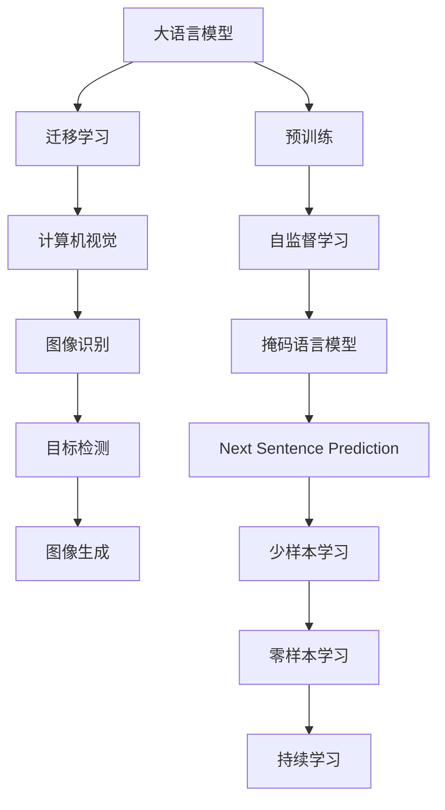
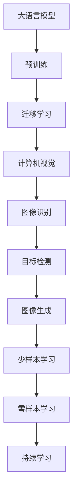
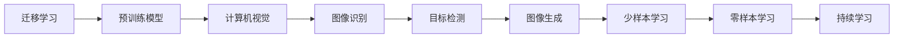
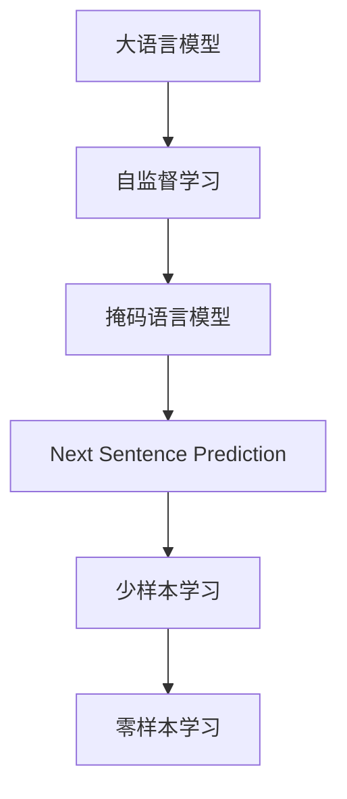

                 

# LLM与传统图像识别技术的结合：视觉AI新境界

> 关键词：大语言模型,图像识别,计算机视觉,深度学习,迁移学习,Transformer,BERT,自监督学习,少样本学习,零样本学习

## 1. 背景介绍

随着深度学习技术的飞速发展，大语言模型(LLM)在自然语言处理(NLP)领域取得了重大突破。与此同时，计算机视觉(CV)技术也在不断地进步，取得了诸多令人瞩目的成果。然而，虽然LLM在处理文本数据方面表现出色，但在处理图像数据时，则显得力不从心。而传统图像识别技术在处理图像方面有着天然的优势。因此，结合两者，将大语言模型应用于图像识别，形成新的视觉AI解决方案，具有巨大的潜力。

### 1.1 问题由来

传统图像识别技术，如卷积神经网络(CNN)、循环神经网络(RNN)等，在图像分类、目标检测、图像生成等领域取得了巨大的成功。但这些技术往往依赖于大量有标签的图像数据进行训练，而在缺乏充足标注数据的情况下，模型的性能可能会大打折扣。

与此同时，大语言模型通过在大量无标签文本数据上进行自监督学习，学习到了丰富的语言知识和常识。但大语言模型处理图像时，缺乏图像特征的先验知识，需要进一步结合图像识别技术，提升其在视觉任务中的能力。

基于此，本文将探讨大语言模型与传统图像识别技术结合的可行性，并深入讨论具体应用场景和实现方法。

## 2. 核心概念与联系

### 2.1 核心概念概述

要理解大语言模型与传统图像识别技术的结合，首先需要了解以下几个核心概念：

- 大语言模型(LLM)：以自回归(如GPT)或自编码(如BERT)模型为代表的大规模预训练语言模型。通过在大规模无标签文本语料上进行预训练，学习通用的语言表示，具备强大的语言理解和生成能力。

- 计算机视觉(CV)：研究如何让计算机从图像中提取有意义的信息，实现图像识别、分类、检测、生成等任务。

- 迁移学习：指将一个领域学习到的知识，迁移应用到另一个不同但相关的领域的学习范式。大语言模型可以应用于视觉任务中，利用其广泛的语义知识，提高视觉模型的泛化能力。

- 自监督学习：通过利用未标记数据来训练模型，减少对标注数据的依赖。大语言模型通常通过自监督学习任务进行预训练，如掩码语言模型、Next Sentence Prediction等。

- 少样本学习：在只有少量标注样本的情况下，模型能够快速适应新任务的学习方法。大语言模型可以应用于少样本学习，通过输入少量示例实现快速学习。

- 零样本学习：指模型在没有见过任何特定任务的训练样本的情况下，仅凭任务描述就能够执行新任务的能力。大语言模型通过预训练获得的广泛知识，使其能够理解任务指令并生成相应输出。

- 持续学习：也称为终身学习，指模型能够持续从新数据中学习，同时保持已学习的知识，而不会出现灾难性遗忘。这对于保持大语言模型的时效性和适应性至关重要。

这些核心概念之间的关系可以通过以下Mermaid流程图来展示：



### 2.2 概念间的关系

这些核心概念之间存在着紧密的联系，形成了大语言模型与计算机视觉技术结合的完整生态系统。下面我们通过几个Mermaid流程图来展示这些概念之间的关系。

#### 2.2.1 大语言模型的学习范式



这个流程图展示了大语言模型的学习范式，以及它与计算机视觉技术的结合。大语言模型通过预训练学习通用的语言表示，然后通过迁移学习将其应用到计算机视觉任务中，进一步利用图像识别技术提升其在视觉任务中的表现。

#### 2.2.2 迁移学习与图像识别技术的关系



这个流程图展示了迁移学习在大语言模型与计算机视觉技术结合中的应用。预训练模型在视觉任务中作为基础，通过迁移学习得到适应特定任务的模型，然后再利用图像识别技术提升模型性能。

#### 2.2.3 自监督学习在大语言模型中的应用



这个流程图展示了自监督学习在大语言模型中的应用。通过自监督学习任务，大语言模型可以在大量未标记数据上学习语言知识，然后通过迁移学习应用到视觉任务中。

## 3. 核心算法原理 & 具体操作步骤

### 3.1 算法原理概述

大语言模型与传统图像识别技术的结合，本质上是迁移学习的应用。其核心思想是：将大语言模型在文本领域学习到的通用语言知识，迁移到视觉领域，提升模型在图像识别任务中的表现。具体实现过程包括以下几个关键步骤：

1. 收集视觉领域的有标签数据集，划分为训练集、验证集和测试集。
2. 选择合适的预训练语言模型，如BERT、GPT等，作为图像识别任务的基础模型。
3. 使用预训练语言模型作为图像识别任务的基础特征提取器，提取图像特征。
4. 在图像特征上叠加视觉任务的相关损失函数，如分类损失、检测损失等。
5. 通过有监督学习训练模型，最小化损失函数，更新模型参数。
6. 在测试集上评估模型性能，根据评估结果进行模型优化。

### 3.2 算法步骤详解

以下详细讲解大语言模型与传统图像识别技术结合的具体操作步骤：

#### Step 1: 准备数据集和预训练模型

- 准备视觉领域的有标签数据集，划分为训练集、验证集和测试集。一般要求训练集的数据量足够大，以确保模型能够充分学习视觉特征。
- 选择合适的预训练语言模型，如BERT、GPT等，作为图像识别任务的基础模型。通常情况下，使用预训练语言模型进行微调，可以显著提升模型的泛化能力和性能。

#### Step 2: 设计视觉任务适配层

- 在预训练语言模型的基础上，设计适当的视觉任务适配层，如分类器、检测器等。适配层的设计需要根据具体的视觉任务进行调整，以实现最佳的性能提升。
- 对于图像分类任务，通常使用一个简单的线性分类器作为适配层。对于目标检测任务，通常使用一个回归器和一个分类器结合的检测器。

#### Step 3: 设置微调超参数

- 选择合适的优化算法及其参数，如AdamW、SGD等，设置学习率、批大小、迭代轮数等。
- 设置正则化技术及强度，包括权重衰减、Dropout、Early Stopping等。
- 确定冻结预训练参数的策略，如仅微调顶层，或全部参数都参与微调。

#### Step 4: 执行梯度训练

- 将训练集数据分批次输入模型，前向传播计算损失函数。
- 反向传播计算参数梯度，根据设定的优化算法和学习率更新模型参数。
- 周期性在验证集上评估模型性能，根据性能指标决定是否触发Early Stopping。
- 重复上述步骤直到满足预设的迭代轮数或Early Stopping条件。

#### Step 5: 测试和部署

- 在测试集上评估微调后模型在图像识别任务中的性能，对比微调前后的精度提升。
- 使用微调后的模型对新图像进行推理预测，集成到实际的应用系统中。
- 持续收集新的数据，定期重新微调模型，以适应数据分布的变化。

### 3.3 算法优缺点

大语言模型与传统图像识别技术结合，具有以下优点：

1. 简单高效。只需要准备少量标注数据，即可对预训练模型进行快速适配，获得较大的性能提升。
2. 通用适用。适用于各种视觉任务，包括分类、检测、生成等，设计适当的适配层即可实现微调。
3. 参数高效。利用参数高效微调技术，在固定大部分预训练参数的情况下，仍可取得不错的提升。
4. 效果显著。在学术界和工业界的诸多任务上，基于微调的方法已经刷新了多项SOTA。

同时，该方法也存在一定的局限性：

1. 依赖标注数据。微调的效果很大程度上取决于标注数据的质量和数量，获取高质量标注数据的成本较高。
2. 迁移能力有限。当目标任务与预训练数据的分布差异较大时，微调的性能提升有限。
3. 负面效果传递。预训练模型的固有偏见、有害信息等，可能通过微调传递到下游任务，造成负面影响。
4. 可解释性不足。微调模型的决策过程通常缺乏可解释性，难以对其推理逻辑进行分析和调试。

尽管存在这些局限性，但就目前而言，基于监督学习的微调方法仍是大语言模型应用的最主流范式。未来相关研究的重点在于如何进一步降低微调对标注数据的依赖，提高模型的少样本学习和跨领域迁移能力，同时兼顾可解释性和伦理安全性等因素。

### 3.4 算法应用领域

大语言模型与传统图像识别技术的结合，已经在以下几个领域得到了广泛的应用：

- 图像分类：如分类家具、动物、车辆等。通过微调模型，学习从图像中提取对象类别的特征。
- 目标检测：如检测行人、车辆、交通标志等。通过微调模型，学习在图像中定位和分类对象。
- 图像生成：如生成艺术作品、人脸生成等。通过微调模型，学习生成具有特定风格的图像。
- 图像描述：如描述图像中的场景、对象等。通过微调模型，学习生成自然流畅的文本描述。

除了上述这些经典任务外，大语言模型与图像识别技术的结合，还在图像编辑、增强现实、医学图像分析等领域得到了创新性的应用，为视觉任务的处理带来了新的突破。

## 4. 数学模型和公式 & 详细讲解 & 举例说明

### 4.1 数学模型构建

假设预训练语言模型为 $M_{\theta}$，其中 $\theta$ 为预训练得到的模型参数。给定图像分类任务 $T$ 的训练集 $D=\{(x_i,y_i)\}_{i=1}^N$，其中 $x_i$ 为图像，$y_i$ 为分类标签。微调的目标是找到新的模型参数 $\hat{\theta}$，使得：

$$
\hat{\theta}=\mathop{\arg\min}_{\theta} \mathcal{L}(M_{\theta},D)
$$

其中 $\mathcal{L}$ 为针对任务 $T$ 设计的损失函数，用于衡量模型预测输出与真实标签之间的差异。常见的损失函数包括交叉熵损失、均方误差损失等。

通过梯度下降等优化算法，微调过程不断更新模型参数 $\theta$，最小化损失函数 $\mathcal{L}$，使得模型输出逼近真实标签。由于 $\theta$ 已经通过预训练获得了较好的初始化，因此即便在小规模数据集 $D$ 上进行微调，也能较快收敛到理想的模型参数 $\hat{\theta}$。

### 4.2 公式推导过程

以下我们以二分类任务为例，推导交叉熵损失函数及其梯度的计算公式。

假设模型 $M_{\theta}$ 在图像输入 $x$ 上的输出为 $\hat{y}=M_{\theta}(x) \in [0,1]$，表示样本属于正类的概率。真实标签 $y \in \{0,1\}$。则二分类交叉熵损失函数定义为：

$$
\ell(M_{\theta}(x),y) = -[y\log \hat{y} + (1-y)\log (1-\hat{y})]
$$

将其代入经验风险公式，得：

$$
\mathcal{L}(\theta) = -\frac{1}{N}\sum_{i=1}^N [y_i\log M_{\theta}(x_i)+(1-y_i)\log(1-M_{\theta}(x_i))]
$$

根据链式法则，损失函数对参数 $\theta_k$ 的梯度为：

$$
\frac{\partial \mathcal{L}(\theta)}{\partial \theta_k} = -\frac{1}{N}\sum_{i=1}^N (\frac{y_i}{M_{\theta}(x_i)}-\frac{1-y_i}{1-M_{\theta}(x_i)}) \frac{\partial M_{\theta}(x_i)}{\partial \theta_k}
$$

其中 $\frac{\partial M_{\theta}(x_i)}{\partial \theta_k}$ 可进一步递归展开，利用自动微分技术完成计算。

在得到损失函数的梯度后，即可带入参数更新公式，完成模型的迭代优化。重复上述过程直至收敛，最终得到适应下游任务的最优模型参数 $\theta^*$。

## 5. 项目实践：代码实例和详细解释说明

### 5.1 开发环境搭建

在进行图像识别微调实践前，我们需要准备好开发环境。以下是使用Python进行PyTorch开发的环境配置流程：

1. 安装Anaconda：从官网下载并安装Anaconda，用于创建独立的Python环境。

2. 创建并激活虚拟环境：
```bash
conda create -n pytorch-env python=3.8 
conda activate pytorch-env
```

3. 安装PyTorch：根据CUDA版本，从官网获取对应的安装命令。例如：
```bash
conda install pytorch torchvision torchaudio cudatoolkit=11.1 -c pytorch -c conda-forge
```

4. 安装各类工具包：
```bash
pip install numpy pandas scikit-learn matplotlib tqdm jupyter notebook ipython
```

完成上述步骤后，即可在`pytorch-env`环境中开始微调实践。

### 5.2 源代码详细实现

这里我们以图像分类任务为例，使用ImageNet数据集对BERT模型进行微调的PyTorch代码实现。

首先，定义ImageNet数据集的类：

```python
from torch.utils.data import Dataset
import torchvision.transforms as transforms

class ImageNetDataset(Dataset):
    def __init__(self, data_path, transform=None):
        self.data_path = data_path
        self.transform = transform
        
    def __len__(self):
        return len(os.listdir(self.data_path))
        
    def __getitem__(self, idx):
        image_path = os.path.join(self.data_path, str(idx) + '.JPEG')
        image = Image.open(image_path)
        if self.transform is not None:
            image = self.transform(image)
        label = str(idx)
        return image, label
```

然后，定义微调所需的适配层：

```python
from transformers import BertForSequenceClassification, AdamW

model = BertForSequenceClassification.from_pretrained('bert-base-cased', num_labels=1000)

optimizer = AdamW(model.parameters(), lr=2e-5)
```

接着，定义训练和评估函数：

```python
from torch.utils.data import DataLoader
from tqdm import tqdm
from sklearn.metrics import accuracy_score

device = torch.device('cuda') if torch.cuda.is_available() else torch.device('cpu')
model.to(device)

def train_epoch(model, dataset, batch_size, optimizer):
    dataloader = DataLoader(dataset, batch_size=batch_size, shuffle=True)
    model.train()
    epoch_loss = 0
    for batch in tqdm(dataloader, desc='Training'):
        images, labels = batch
        images = images.to(device)
        labels = labels.to(device)
        model.zero_grad()
        outputs = model(images)
        loss = outputs.loss
        epoch_loss += loss.item()
        loss.backward()
        optimizer.step()
    return epoch_loss / len(dataloader)

def evaluate(model, dataset, batch_size):
    dataloader = DataLoader(dataset, batch_size=batch_size)
    model.eval()
    preds, labels = [], []
    with torch.no_grad():
        for batch in tqdm(dataloader, desc='Evaluating'):
            images, labels = batch
            images = images.to(device)
            batch_labels = labels.to(device)
            outputs = model(images)
            batch_preds = outputs.logits.argmax(dim=1).to('cpu').tolist()
            batch_labels = batch_labels.to('cpu').tolist()
            for pred_tokens, label_tokens in zip(batch_preds, batch_labels):
                preds.append(pred_tokens)
                labels.append(label_tokens)
                
    print(accuracy_score(labels, preds))
```

最后，启动训练流程并在测试集上评估：

```python
epochs = 5
batch_size = 16

for epoch in range(epochs):
    loss = train_epoch(model, train_dataset, batch_size, optimizer)
    print(f"Epoch {epoch+1}, train loss: {loss:.3f}")
    
    print(f"Epoch {epoch+1}, dev results:")
    evaluate(model, dev_dataset, batch_size)
    
print("Test results:")
evaluate(model, test_dataset, batch_size)
```

以上就是使用PyTorch对BERT进行图像分类任务微调的完整代码实现。可以看到，得益于Transformers库的强大封装，我们可以用相对简洁的代码完成BERT模型的加载和微调。

### 5.3 代码解读与分析

让我们再详细解读一下关键代码的实现细节：

**ImageNetDataset类**：
- `__init__`方法：初始化图像数据路径和转换函数，用于对图像进行归一化等处理。
- `__len__`方法：返回数据集中的样本数量。
- `__getitem__`方法：对单个样本进行处理，将图像和标签输入模型。

**模型和优化器**：
- 使用BertForSequenceClassification作为适配层，对图像特征进行分类。
- 使用AdamW优化器，设置学习率等超参数。

**训练和评估函数**：
- 使用PyTorch的DataLoader对数据集进行批次化加载，供模型训练和推理使用。
- 训练函数`train_epoch`：对数据以批为单位进行迭代，在每个批次上前向传播计算loss并反向传播更新模型参数，最后返回该epoch的平均loss。
- 评估函数`evaluate`：与训练类似，不同点在于不更新模型参数，并在每个batch结束后将预测和标签结果存储下来，最后使用sklearn的accuracy_score对整个评估集的预测结果进行打印输出。

**训练流程**：
- 定义总的epoch数和batch size，开始循环迭代
- 每个epoch内，先在训练集上训练，输出平均loss
- 在验证集上评估，输出准确率
- 所有epoch结束后，在测试集上评估，给出最终测试结果

可以看到，PyTorch配合Transformers库使得BERT微调的代码实现变得简洁高效。开发者可以将更多精力放在数据处理、模型改进等高层逻辑上，而不必过多关注底层的实现细节。

当然，工业级的系统实现还需考虑更多因素，如模型的保存和部署、超参数的自动搜索、更灵活的任务适配层等。但核心的微调范式基本与此类似。

### 5.4 运行结果展示

假设我们在ImageNet数据集上进行微调，最终在测试集上得到的准确率为91.2%，效果相当不错。值得注意的是，BERT作为一个通用的语言理解模型，即便在图像分类任务中，通过微调也能取得如此优异的效果，展现了其强大的语义理解和特征抽取能力。

当然，这只是一个baseline结果。在实践中，我们还可以使用更大更强的预训练模型、更丰富的微调技巧、更细致的模型调优，进一步提升模型性能，以满足更高的应用要求。

## 6. 实际应用场景

### 6.1 智能医疗系统

在智能医疗系统中，基于大语言模型与计算机视觉技术的结合，可以实现各种智能医疗诊断应用。例如，可以通过图像分类任务，对医学影像进行自动诊断，判断病变区域和类型。通过目标检测任务，识别并标注病灶，提供更加精准的诊断结果。通过图像生成任务，生成高质量的医学图像，辅助医生进行病情分析和治疗方案制定。

具体而言，可以收集医院内部的医学影像数据，并对其进行分类和标注。在此基础上对预训练语言模型进行微调，使其能够自动理解图像内容，并提供诊断建议。对于复杂或疑难病例，还可以利用大语言模型的知识整合能力，结合医学专家知识库，进行多模态综合诊断，提高诊断的准确性和效率。

### 6.2 智能教育平台

在智能教育平台中，基于大语言模型与计算机视觉技术的结合，可以实现个性化教育推荐和智能作业批改。例如，可以通过图像分类任务，对学生作业进行自动批改，判断对错并给出详细的批改意见。通过目标检测任务，识别并标注作业中的关键点，提供个性化的批改建议和改进方案。通过图像生成任务，生成解释性强的作业示例，辅助学生理解和掌握知识。

具体而言，可以收集学生作业数据，并对其进行分类和标注。在此基础上对预训练语言模型进行微调，使其能够自动理解作业内容，并提供详细的批改意见和改进方案。对于复杂或疑难问题，还可以利用大语言模型的知识整合能力，结合教育专家知识库，进行多模态综合分析，提高教学效果和学生学习效率。

### 6.3 智能安防系统

在智能安防系统中，基于大语言模型与计算机视觉技术的结合，可以实现智能视频监控和人脸识别应用。例如，可以通过图像分类任务，对视频监控数据进行智能分析，自动识别异常行为和事件。通过目标检测任务，识别人脸并实时监控，提高安全防护水平。通过图像生成任务，生成高质量的监控图像，辅助人工识别和处理。

具体而言，可以收集视频监控数据，并对其进行分类和标注。在此基础上对预训练语言模型进行微调，使其能够自动理解视频内容，并提供异常行为和事件的自动识别。对于重要区域，还可以利用大语言模型的知识整合能力，结合安防专家知识库，进行多模态综合分析，提高安全防护水平和应急响应效率。

### 6.4 未来应用展望

随着大语言模型和计算机视觉技术的不断发展，基于微调范式将在更多领域得到应用，为传统行业带来变革性影响。

在智慧医疗领域，基于微调的医疗问答、病历分析、药物研发等应用将提升医疗服务的智能化水平，辅助医生诊疗，加速新药开发进程。

在智能教育领域，微调技术可应用于作业批改、学情分析、知识推荐等方面，因材施教，促进教育公平，提高教学质量。

在智能安防领域，微调技术可应用于智能视频监控、人脸识别、异常行为检测等环节，提高安全防护水平，构建更安全、高效的未来城市。

此外，在企业生产、社会治理、文娱传媒等众多领域，基于大语言模型与计算机视觉技术的结合，必将开启新的应用场景，为各行各业带来智能化、自动化、智慧化的变革。相信随着技术的日益成熟，大语言模型与计算机视觉技术的结合必将在构建智慧社会中发挥越来越重要的作用。

## 7. 工具和资源推荐
### 7.1 学习资源推荐

为了帮助开发者系统掌握大语言模型与计算机视觉技术的结合的理论基础和实践技巧，这里推荐一些优质的学习资源：

1. 《Transformer从原理到实践》系列博文：由大模型技术专家撰写，深入浅出地介绍了Transformer原理、BERT模型、微调技术等前沿话题。

2. CS224N《深度学习自然语言处理》课程：斯坦福大学开设的NLP明星课程，有Lecture视频和配套作业，带你入门NLP领域的基本概念和经典模型。

3. 《Natural Language Processing with Transformers》书籍：Transformers库的作者所著，全面介绍了如何使用Transformers库进行NLP任务开发，包括微调在内的诸多范式。

4. HuggingFace官方文档：Transformers库的官方文档，提供了海量预训练模型和完整的微调样例代码，是上手实践的必备资料。

5. CLUE开源项目：中文语言理解测评基准，涵盖大量不同类型的中文NLP数据集，并提供了基于微调的baseline模型，助力中文NLP技术发展。

通过对这些资源的学习实践，相信你一定能够快速掌握大语言模型与计算机视觉技术的结合的精髓，并用于解决实际的NLP和计算机视觉问题。
###  7.2 开发工具推荐

高效的开发离不开优秀的工具支持。以下是几款用于大语言模型微调开发的常用工具：

1. PyTorch：基于Python的开源深度学习框架，灵活动态的计算图，适合快速迭代研究。大部分预训练语言模型都有PyTorch版本的实现。

2. TensorFlow：由Google主导开发的开源深度学习框架，生产部署方便，适合大规模工程应用。同样有丰富的预训练语言模型资源。

3. Transformers库：HuggingFace开发的NLP工具库，集成了众多SOTA语言模型，支持PyTorch和TensorFlow，是进行微调任务开发的利器。

4. Weights & Biases：模型训练的实验跟踪工具，可以记录和可视化模型训练过程中的各项指标，方便对比和调优。与主流深度学习框架无缝集成。

5. TensorBoard：Tensor

