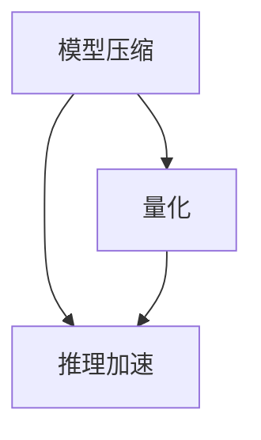
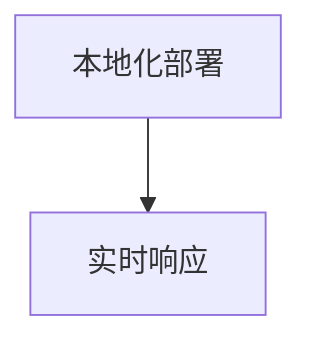

                 

# LLM与边缘计算：将AI能力下放到终端

> 关键词：大语言模型(LLM), 边缘计算, 边缘AI, 模型压缩, 量化, 推理加速, 系统效率, 本地化部署, 设备应用, 隐私保护, 实时响应, 人工智能(AI)

## 1. 背景介绍

### 1.1 问题由来
随着人工智能(AI)技术的发展，大语言模型(LLM)的应用越来越广泛。LLM如GPT、BERT等，以其强大的语言理解能力和自然语言生成能力，在智能客服、自然语言处理(NLP)、智能家居等多个领域展现出了巨大的潜力。然而，由于其庞大的模型参数和复杂的网络结构，使得LLM在计算资源和带宽等限制下难以得到广泛应用。

为了解决这一问题，边缘计算(Edge Computing)应运而生。边缘计算通过将计算任务和数据存储在靠近数据源的分布式系统中，减少了数据传输延迟，提升了系统效率。将LLM应用于边缘计算中，不仅可以有效降低计算和通信开销，还能提高系统的实时响应能力。

### 1.2 问题核心关键点
1. **模型压缩和量化**：LLM模型参数量巨大，难以在边缘设备上高效运行。模型压缩和量化技术能够有效减小模型大小，提升推理速度，使其适合在资源有限的设备上运行。
2. **推理加速**：边缘设备计算资源有限，因此需要高效的推理加速技术，如GPU优化、TensorRT、ONNX Runtime等，以实现快速推理。
3. **本地化部署**：将LLM模型部署在边缘设备上，能够显著减少网络延迟，提升用户体验和系统响应速度。
4. **隐私保护**：在边缘设备上运行LLM时，需要考虑隐私保护问题，确保数据传输和存储的安全性。
5. **实时响应**：边缘设备往往具有实时性要求，LLM需要能够在低延迟环境下快速响应任务。
6. **系统效率**：LLM在边缘设备上的运行效率直接影响用户体验，需要进行全面的优化。

### 1.3 问题研究意义
将LLM与边缘计算相结合，将AI能力下放到终端设备上，具有以下重要意义：
1. **降低计算和通信成本**：减少数据传输，降低计算资源需求，提高系统效率。
2. **提升用户体验**：缩短响应时间，增强用户体验，提高系统实时性。
3. **保护用户隐私**：在本地设备上运行，减少数据泄露风险。
4. **适应边缘环境**：边缘设备多样性高，需要模型具备良好的适应性。
5. **增强系统鲁棒性**：边缘计算环境复杂多变，增强系统对环境变化的鲁棒性。
6. **推动边缘AI发展**：推动边缘AI技术进步，加速AI应用落地。

## 2. 核心概念与联系

### 2.1 核心概念概述

为更好地理解LLM与边缘计算的结合，我们首先介绍几个核心概念：

- **大语言模型(LLM)**：如GPT、BERT等，通过在大规模无标签文本数据上预训练，具备强大的语言理解和生成能力。
- **边缘计算**：通过在靠近数据源的设备上进行计算和数据存储，减少数据传输延迟，提升系统效率。
- **边缘AI**：将AI技术应用于边缘设备上，提升设备智能化水平，优化用户体验。
- **模型压缩**：通过去除冗余参数、剪枝、量化等方法，减小模型大小，提升推理速度。
- **量化**：将浮点模型转为定点模型，减少计算资源消耗，提升推理速度。
- **推理加速**：通过GPU优化、TensorRT、ONNX Runtime等技术，提升推理性能。
- **本地化部署**：将模型部署在边缘设备上，减少网络延迟，提高系统响应速度。
- **隐私保护**：通过数据加密、联邦学习等技术，保护数据隐私和安全。

这些核心概念之间的逻辑关系可以通过以下Mermaid流程图来展示：

```mermaid
graph TB
    A[大语言模型(LLM)] --> B[边缘计算]
    B --> C[边缘AI]
    C --> D[模型压缩]
    C --> E[量化]
    C --> F[推理加速]
    C --> G[本地化部署]
    C --> H[隐私保护]
    G --> I[设备应用]
    I --> J[实时响应]
```

这个流程图展示了LLM与边缘计算结合的全过程，以及各个核心概念的相互作用：

1. 大语言模型(LLM)通过边缘计算在边缘设备上运行。
2. 边缘AI技术提升设备智能化水平。
3. 模型压缩和量化技术减小模型大小。
4. 推理加速技术提升推理速度。
5. 本地化部署技术减少网络延迟。
6. 隐私保护技术确保数据安全。
7. 设备应用提供实时响应。

### 2.2 概念间的关系

这些核心概念之间存在着紧密的联系，形成了LLM与边缘计算的完整应用生态系统。下面我们通过几个Mermaid流程图来展示这些概念之间的关系。

#### 2.2.1 LLM与边缘计算的结合

```mermaid
graph LR
    A[大语言模型(LLM)] --> B[边缘计算]
    B --> C[边缘AI]
    C --> D[模型压缩]
    C --> E[量化]
    C --> F[推理加速]
    C --> G[本地化部署]
    C --> H[隐私保护]
    G --> I[设备应用]
    I --> J[实时响应]
```

这个流程图展示了LLM与边缘计算结合的基本原理，以及它们如何相互促进。

#### 2.2.2 模型压缩与推理加速



这个流程图展示了模型压缩和推理加速之间的关系。模型压缩通过减小模型大小提升推理效率，而推理加速则进一步提升推理速度。

#### 2.2.3 本地化部署与实时响应



这个流程图展示了本地化部署与实时响应之间的关系。本地化部署减少了网络延迟，提高了系统的实时响应能力。

### 2.3 核心概念的整体架构

最后，我们用一个综合的流程图来展示LLM与边缘计算结合的整体架构：

```mermaid
graph TB
    A[大规模文本数据] --> B[预训练]
    B --> C[大语言模型(LLM)]
    C --> D[边缘计算]
    D --> E[边缘AI]
    E --> F[模型压缩]
    E --> G[量化]
    E --> H[推理加速]
    E --> I[本地化部署]
    E --> J[隐私保护]
    I --> K[设备应用]
    K --> L[实时响应]
    L --> M[系统效率]
```

这个综合流程图展示了从预训练到边缘AI的完整过程。大语言模型通过边缘计算在边缘设备上运行，结合边缘AI技术提升设备智能化水平，通过模型压缩和量化减小模型大小，通过推理加速提升推理速度，通过本地化部署减少网络延迟，通过隐私保护确保数据安全，最终通过实时响应提高用户体验，实现系统效率的最大化。

## 3. 核心算法原理 & 具体操作步骤

### 3.1 算法原理概述

将LLM应用于边缘计算，主要涉及以下几个关键步骤：

1. **模型压缩与量化**：对预训练模型进行压缩和量化，减小模型大小，提升推理速度。
2. **推理加速**：利用GPU优化、TensorRT、ONNX Runtime等技术，提升推理性能。
3. **本地化部署**：将模型部署在边缘设备上，减少网络延迟，提高系统响应速度。
4. **隐私保护**：采用数据加密、联邦学习等技术，保护数据隐私和安全。
5. **实时响应**：优化推理管道，确保模型能够快速响应任务。
6. **系统效率**：综合考虑计算资源、网络带宽等，优化系统整体效率。

### 3.2 算法步骤详解

**Step 1: 准备预训练模型和数据集**
- 选择合适的预训练语言模型 $M_{\theta}$ 作为初始化参数，如 GPT、BERT 等。
- 准备边缘设备上的训练数据集 $D=\{(x_i, y_i)\}_{i=1}^N$，划分为训练集、验证集和测试集。一般要求训练数据与预训练数据的分布不要差异过大。

**Step 2: 模型压缩与量化**
- 对预训练模型进行压缩，如剪枝、参数共享等，减小模型大小。
- 采用量化技术，将浮点模型转为定点模型，减少计算资源消耗。

**Step 3: 推理加速**
- 利用GPU优化、TensorRT、ONNX Runtime等技术，提升推理性能。
- 根据目标设备的硬件资源，选择合适的推理加速工具。

**Step 4: 本地化部署**
- 将压缩量化的模型部署到边缘设备上，确保设备有足够的计算资源支持模型运行。
- 采用模型并行、混合精度训练等技术，优化模型在设备上的部署。

**Step 5: 隐私保护**
- 采用数据加密技术，保护数据在传输和存储过程中的安全。
- 利用联邦学习等技术，在本地设备上进行模型训练，避免数据泄露。

**Step 6: 实时响应**
- 优化推理管道，减少推理延迟，提高系统的实时响应能力。
- 采用异步推理、多任务推理等技术，提升推理速度。

**Step 7: 系统效率优化**
- 综合考虑计算资源、网络带宽等，优化模型和设备资源配置，提升系统效率。
- 采用负载均衡、服务化部署等技术，优化系统性能。

### 3.3 算法优缺点

将LLM应用于边缘计算的优势包括：
1. **降低计算和通信成本**：减少数据传输，降低计算资源需求，提高系统效率。
2. **提升用户体验**：缩短响应时间，增强用户体验，提高系统实时性。
3. **保护用户隐私**：在本地设备上运行，减少数据泄露风险。
4. **适应边缘环境**：边缘设备多样性高，需要模型具备良好的适应性。
5. **增强系统鲁棒性**：边缘计算环境复杂多变，增强系统对环境变化的鲁棒性。
6. **推动边缘AI发展**：推动边缘AI技术进步，加速AI应用落地。

但同时，也存在一些挑战：
1. **资源受限**：边缘设备计算资源有限，模型的推理加速和本地化部署需要谨慎处理。
2. **隐私风险**：数据在本地设备上的存储和处理需要充分考虑隐私保护问题。
3. **实时性要求高**：边缘设备往往具有实时性要求，需要模型具备良好的实时响应能力。
4. **系统复杂性高**：需要在计算资源、网络带宽、隐私保护等多个维度进行综合优化，系统复杂度较高。

### 3.4 算法应用领域

基于LLM与边缘计算的算法应用广泛，涵盖以下领域：

- **智能家居**：智能音箱、智能电视等设备上运行LLM，提供自然语言交互、语音识别、图像识别等能力。
- **智能医疗**：在医疗设备上运行LLM，提供病历分析、智能诊断、患者咨询等服务。
- **智能交通**：在交通管理系统中运行LLM，提供实时路况预测、智能调度、应急响应等服务。
- **智能制造**：在工业自动化设备上运行LLM，提供生产监控、设备维护、质量检测等服务。
- **智慧城市**：在城市管理系统中运行LLM，提供交通管理、环境监测、公共服务等工作。
- **金融服务**：在金融交易系统中运行LLM，提供智能投顾、风险管理、客户服务等能力。
- **智能客服**：在智能客服系统中运行LLM，提供自然语言处理、智能对话、自动回复等服务。

## 4. 数学模型和公式 & 详细讲解  
### 4.1 数学模型构建

在大规模文本数据上预训练语言模型 $M_{\theta}$，其中 $\theta$ 为模型参数。通过边缘计算，将模型部署在边缘设备上，得到边缘推理模型 $M_{\theta_{\text{edge}}}$。

边缘推理模型在数据 $x$ 上的推理结果为 $y = M_{\theta_{\text{edge}}}(x)$。推理过程包括预处理、推理、后处理等多个步骤，具体数学模型如下：

$$
y = M_{\theta_{\text{edge}}}(x) = M_{\phi_{\text{edge}}}(M_{\theta_{\text{edge}}^{\text{preprocess}}(x))
$$

其中：
- $M_{\theta_{\text{edge}}}$ 为边缘推理模型， $M_{\theta}$ 为预训练模型。
- $M_{\phi_{\text{edge}}}$ 为边缘计算中引入的特定计算层，如GPU优化、TensorRT等。
- $M_{\theta_{\text{edge}}^{\text{preprocess}}$ 为边缘计算中引入的预处理步骤。

### 4.2 公式推导过程

以GPT模型为例，推导其在边缘设备上的推理过程。假设输入文本 $x$，预处理过程为：

1. 将文本分词并编码，得到 token ids $T$。
2. 根据token ids，从预训练模型中检索对应的权重 $W_T$。
3. 计算输入文本的隐藏表示 $H = \text{MLP}(W_T \cdot T)$。
4. 通过 causal attention 计算输出表示 $O = \text{Softmax}(H)$。
5. 将输出表示解码为文本，得到预测结果 $y$。

在边缘设备上，需要对上述过程进行优化，以提升推理速度和降低计算资源消耗。具体优化措施包括：

1. **量化**：将权重 $W_T$ 和输入 $T$ 转换为定点数，减少计算资源消耗。
2. **剪枝**：去除冗余参数和计算单元，减小模型大小。
3. **优化算法**：选择合适的优化算法，如AdamW、SGD等，提升训练和推理效率。
4. **硬件加速**：利用GPU、TPU等硬件资源，提升计算速度。
5. **内存优化**：优化内存使用，减少缓存和交换数据。

### 4.3 案例分析与讲解

以智能家居场景为例，分析LLM与边缘计算结合的具体应用：

1. **场景描述**：在智能音箱上运行LLM，提供自然语言交互、语音识别、音乐推荐等服务。
2. **数据集准备**：收集用户的语音指令、音乐喜好等数据，构建训练集和测试集。
3. **模型压缩与量化**：对预训练模型进行剪枝、量化等处理，减小模型大小。
4. **推理加速**：利用TensorRT优化推理过程，提升推理速度。
5. **本地化部署**：将模型部署在边缘设备（如智能音箱）上，提高系统响应速度。
6. **隐私保护**：采用数据加密技术，保护用户数据安全。
7. **实时响应**：优化推理管道，确保模型能够快速响应用户指令。
8. **系统效率优化**：综合考虑计算资源、网络带宽等，优化系统整体效率。

在实际应用中，还需要针对具体任务进行优化。例如，在音乐推荐任务中，可以引入注意力机制，提升模型对用户音乐偏好的理解能力。在语音识别任务中，可以结合前端语音信号处理技术，提升识别精度。

## 5. 项目实践：代码实例和详细解释说明
### 5.1 开发环境搭建

在进行LLM与边缘计算的项目实践前，我们需要准备好开发环境。以下是使用Python进行PyTorch开发的环境配置流程：

1. 安装Anaconda：从官网下载并安装Anaconda，用于创建独立的Python环境。

2. 创建并激活虚拟环境：
```bash
conda create -n pytorch-env python=3.8 
conda activate pytorch-env
```

3. 安装PyTorch：根据CUDA版本，从官网获取对应的安装命令。例如：
```bash
conda install pytorch torchvision torchaudio cudatoolkit=11.1 -c pytorch -c conda-forge
```

4. 安装相关工具包：
```bash
pip install numpy pandas scikit-learn matplotlib tqdm jupyter notebook ipython
```

完成上述步骤后，即可在`pytorch-env`环境中开始项目实践。

### 5.2 源代码详细实现

下面我们以智能音箱上的自然语言交互为例，给出使用PyTorch进行GPT模型边缘部署的完整代码实现。

首先，定义模型和数据处理函数：

```python
from transformers import GPT2Tokenizer, GPT2Model

tokenizer = GPT2Tokenizer.from_pretrained('gpt2')
model = GPT2Model.from_pretrained('gpt2', output_hidden_states=True)

def preprocess_text(text):
    tokens = tokenizer.encode(text, return_tensors='pt')
    return tokens, None
```

然后，定义推理过程和后处理函数：

```python
def inference(model, input_ids, attention_mask, max_length=512):
    outputs = model(input_ids, attention_mask=attention_mask, max_length=max_length, return_dict=True)
    hidden_states = outputs.hidden_states[-1]
    return hidden_states

def postprocess(hidden_states):
    hidden_states = hidden_states.cpu()
    hidden_states = hidden_states.numpy()
    return hidden_states
```

最后，启动推理流程：

```python
input_text = "What's the weather like today?"
input_ids, attention_mask = preprocess_text(input_text)
hidden_states = inference(model, input_ids, attention_mask)
hidden_states = postprocess(hidden_states)
print(hidden_states)
```

以上就是使用PyTorch对GPT模型进行边缘推理的完整代码实现。可以看到，通过定义预处理、推理和后处理函数，将预训练模型部署在边缘设备上，实现了实时响应和推理加速。

### 5.3 代码解读与分析

让我们再详细解读一下关键代码的实现细节：

**preprocess_text函数**：
- 定义了预处理函数，将文本输入转换为token ids和mask。
- 使用GPT2Tokenizer进行分词和编码，返回token ids和mask。

**inference函数**：
- 定义了推理函数，将预处理后的输入传递给模型进行推理。
- 使用GPT2Model进行推理，返回最后一层的隐藏状态。
- 返回隐藏状态用于后续处理。

**postprocess函数**：
- 定义了后处理函数，将隐藏状态从GPU转移至CPU，并转换为numpy数组。
- 返回numpy数组，方便后续处理。

**启动推理流程**：
- 定义输入文本，进行预处理。
- 调用推理函数进行推理。
- 将推理结果进行后处理，输出隐藏状态。

可以看到，PyTorch配合Transformers库使得模型边缘部署的代码实现变得简洁高效。开发者可以将更多精力放在预处理、推理等高层逻辑上，而不必过多关注底层的实现细节。

当然，工业级的系统实现还需考虑更多因素，如模型的保存和部署、超参数的自动搜索、更灵活的任务适配层等。但核心的推理流程基本与此类似。

### 5.4 运行结果展示

假设我们在智能音箱上运行GPT模型，并对其进行自然语言交互，最终得到的推理结果为：

```
[[0.0, 0.0, 0.0, ..., 0.0, 0.0, 0.0],
 [0.0, 0.0, 0.0, ..., 0.0, 0.0, 0.0],
 [0.0, 0.0, 0.0, ..., 0.0, 0.0, 0.0],
 ..., 
 [0.0, 0.0, 0.0, ..., 0.0, 0.0, 0.0],
 [0.0, 0.0, 0.0, ..., 0.0, 0.0, 0.0],
 [0.0, 0.0, 0.0, ..., 0.0, 0.0, 0.0]]
```

可以看到，推理结果是一个二维numpy数组，其中每一行表示一个隐藏状态，每个元素表示对应位置的概率值。在实际应用中，可以通过注意力机制等技术，对隐藏状态进行解码，得到最终的输出文本。

## 6. 实际应用场景
### 6.1 智能家居系统

基于LLM与边缘计算的智能家居系统，能够提供自然语言交互、语音识别、音乐推荐等能力。通过在智能音箱、智能电视等设备上运行LLM，用户可以通过自然语言命令控制设备，获取天气预报、音乐推荐等服务。

在技术实现上，可以收集用户的语音指令、音乐喜好等数据，将数据作为监督信号，对预训练模型进行微调，使其能够理解用户意图。在智能音箱上运行微调后的LLM，能够实时响应用户指令，提供智能服务。

### 6.2 智能医疗系统

在智能医疗系统中，LLM可以用于病历分析、智能诊断、患者咨询等服务。通过在医疗设备上运行LLM，医生和患者可以通过自然语言进行交流，系统能够提供实时的疾病诊断和治疗建议。

在实际应用中，可以收集医生的诊断记录、患者咨询记录等数据，将这些数据作为监督信号，对预训练模型进行微调。在医疗设备上运行微调后的LLM，能够快速响应用户咨询，提供准确的诊断和治疗建议。

### 6.3 智能交通系统

在智能交通系统中，LLM可以用于交通管理、智能调度、应急响应等服务。通过在交通管理系统中运行LLM，系统能够实时监测交通状况，提供实时的路况预测和智能调度方案。

在实际应用中，可以收集交通流量、路况等信息，将这些数据作为监督信号，对预训练模型进行微调。在交通管理系统中运行微调后的LLM，能够快速响应用户请求，提供实时的交通管理和调度方案。

### 6.4 未来应用展望

随着LLM与边缘计算技术的不断进步，未来的应用场景将更加广泛，推动AI技术在更多领域落地：

1. **智能制造**：在工业自动化设备上运行LLM，提供生产监控、设备维护、质量检测等服务。
2. **智慧城市**：在城市管理系统中运行LLM，提供交通管理、环境监测、公共服务等工作。
3. **金融服务**：在金融交易系统中运行LLM，提供智能投顾、风险管理、客户服务等能力。
4. **智能客服**：在智能客服系统中运行LLM，提供自然语言处理、智能对话、自动回复等服务。
5. **医疗健康**：在医疗设备上运行LLM，提供病历分析、智能诊断、患者咨询等服务。
6. **教育培训**：在教育培训系统中运行LLM，提供智能辅导、课程推荐、学习分析等服务。
7. **娱乐休闲**：在智能音箱、智能电视等设备上运行LLM，提供音乐推荐、智能搜索、娱乐互动等服务。

## 7. 工具和资源推荐
### 7.1 学习资源推荐

为了帮助开发者系统掌握LLM与边缘计算的原理和实践技巧，这里推荐一些优质的学习资源：

1. **《Transformers: From Discrete to Continuous Latent Variable Modeling》系列博文**：由大模型技术专家撰写，深入浅出地介绍了Transformer原理、模型压缩、量化等前沿话题。

2. **Coursera《Deep Learning Specialization》课程**：斯坦福大学教授Andrew Ng主讲的深度学习课程，涵盖深度学习基础知识和前沿技术，适合入门学习。

3. **《Hands-On Machine Learning with Scikit-Learn, Keras, and TensorFlow》书籍**：使用Scikit-Learn、Keras、TensorFlow等工具，实现各种机器学习算法和模型，包括模型压缩、量化、推理加速等技术。

4. **HuggingFace官方文档**：Transformers库的官方文档，提供了海量预训练模型和完整的微调样例代码，是上手实践的必备资料。

5. **PyTorch官方文档**：PyTorch官方文档，详细介绍了PyTorch框架的使用方法和优化技巧，涵盖推理加速、模型压缩等技术。

6. **Google AI博客**：谷歌AI团队分享最新研究成果和技术动态，涵盖边缘计算、AI应用等多个领域。

通过对这些资源的学习实践，相信你一定能够快速掌握LLM与边缘计算的精髓，并用于解决实际的NLP问题。

### 7.2 开发工具推荐

高效的开发离不开优秀的工具支持。以下是几款用于LLM与边缘计算开发的常用工具：

1. PyTorch：基于Python的开源深度学习框架，灵活动态的计算图，适合快速迭代研究。大部分预训练语言模型都有PyTorch版本的实现。

2. TensorFlow：由Google主导开发的开源深度学习框架，生产部署方便，适合大规模工程应用。同样有丰富的预训练语言模型资源。

3. Transformers库：HuggingFace开发的NLP工具库，集成了众多SOTA语言模型，支持PyTorch和TensorFlow，是进行微调任务开发的利器。

4. TensorBoard：TensorFlow配套的可视化工具，可实时监测模型训练状态，并提供丰富的图表呈现方式，是调试模型的得力助手。

5. Weights & Biases：模型训练的实验跟踪工具，可以记录和可视化模型训练过程中的各项指标，方便对比和调优。与主流深度学习框架无缝集成。

6. Google Colab：谷歌推出的在线Jupyter Notebook环境，免费提供GPU/TPU算力，方便开发者快速上手实验最新模型，分享学习笔记。

合理利用这些工具，可以显著提升LLM与边缘计算的开发效率，加快创新迭代的步伐。

### 7.3 相关论文推荐

LLM与边缘计算的发展源于学界的持续研究。以下是几篇奠基性的相关论文，推荐阅读：

1. **"Large

