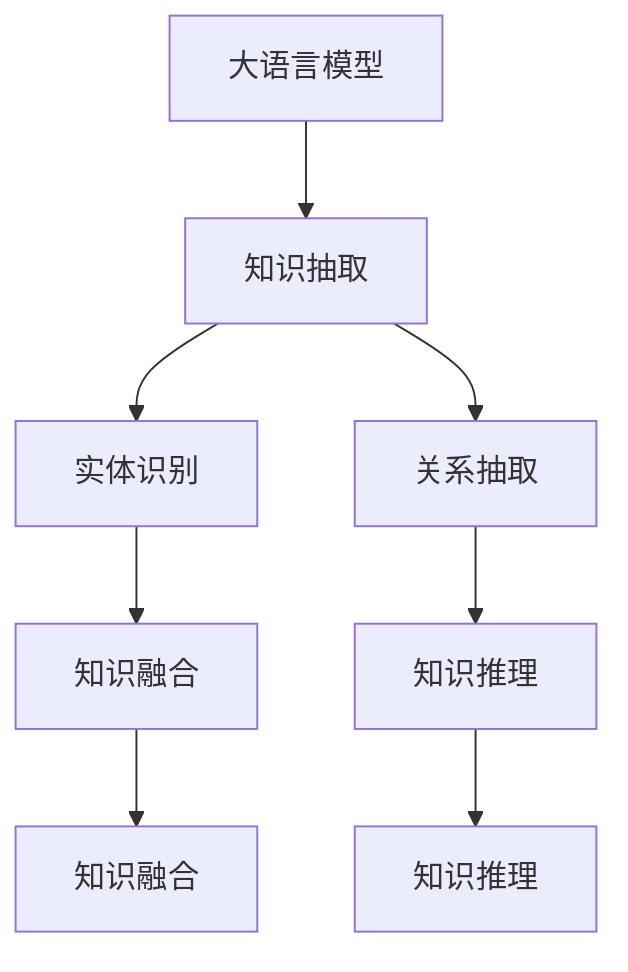
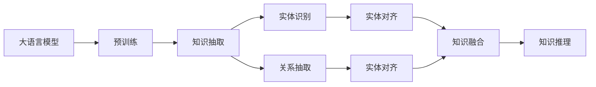

                 

# LLM的知识图谱：构建AI的认知世界

## 1. 背景介绍

在人工智能飞速发展的今天，语言模型（Language Model, LM）正成为构建知识图谱的关键技术。随着大规模预训练语言模型的普及，如何利用这些模型高效构建知识图谱，成为研究者和开发者共同关注的焦点。知识图谱（Knowledge Graph, KG）作为一种结构化表示方式，能够准确捕捉实体与实体之间的语义关系，被广泛应用于知识抽取、语义搜索、问答系统等众多领域。本文将详细介绍基于大语言模型（Large Language Models, LLMs）构建知识图谱的原理、方法和实践。

### 1.1 问题由来

在大规模预训练语言模型的推动下，构建知识图谱的方法经历了从手工构建到自动化的转变。早期的知识图谱构建主要依赖人工标注，成本高、效率低，难以适应大规模的语料库。而基于预训练语言模型的知识抽取方法，则能在大规模无标签文本中自动挖掘实体和关系，大大降低了人力成本，提升了构建效率。

然而，由于自然语言的多样性和复杂性，传统的知识抽取方法在处理非结构化文本时，仍然存在一定的局限性。文本中的实体可能出现歧义，关系描述可能不精确，导致构建的知识图谱存在噪声。为解决这些问题，研究人员提出了多种方法，如命名实体识别、关系抽取、实体对齐等，但这些方法仍需大量人工干预。

近年来，基于大语言模型的知识图谱构建方法逐渐兴起，利用模型预训练时学习的广泛知识，可以自动进行实体抽取和关系推理，构建出更为精准和结构化的知识图谱。本文将详细探讨大语言模型在知识图谱构建中的应用。

### 1.2 问题核心关键点

知识图谱构建的核心问题可以概括为以下几个方面：

- 实体抽取（Entity Extraction）：从文本中自动识别出具有实际意义的实体。
- 关系抽取（Relation Extraction）：识别文本中实体之间的语义关系。
- 实体对齐（Entity Alignment）：解决实体同义词、多义词等问题，使不同文本中的同名实体关联起来。
- 知识融合（Knowledge Fusion）：将多个来源的知识图谱融合为一个统一的知识体系。
- 知识推理（Knowledge Reasoning）：利用知识图谱进行推理和预测，辅助自然语言理解和生成。

大语言模型通过自监督预训练，学习到丰富的语言表示和语义理解能力，能够有效应对上述问题，从而构建出高质量的知识图谱。本文将详细介绍大语言模型在知识图谱构建中的应用方法和实践技巧。

## 2. 核心概念与联系

### 2.1 核心概念概述

构建知识图谱涉及多个关键概念和技术，包括以下几点：

- **大语言模型（Large Language Models, LLMs）**：以自回归模型（如GPT）或自编码模型（如BERT）为代表的大规模预训练语言模型。通过在大规模无标签文本语料上进行预训练，学习通用的语言表示，具备强大的语言理解和生成能力。
- **知识图谱（Knowledge Graph, KG）**：一种结构化的语义表示形式，由节点和边构成，用于表示实体与实体之间的语义关系。
- **知识抽取（Knowledge Extraction）**：从文本中自动抽取实体和关系，构建知识图谱的过程。
- **实体识别（Entity Recognition）**：识别文本中具有实际意义的实体，如人名、地名、组织名等。
- **关系抽取（Relation Extraction）**：识别文本中实体之间的语义关系，如"John is a teacher of Alice"中的"is a teacher of"关系。
- **实体对齐（Entity Alignment）**：解决实体同义词、多义词等问题，使不同文本中的同名实体关联起来。
- **知识融合（Knowledge Fusion）**：将多个来源的知识图谱融合为一个统一的知识体系。
- **知识推理（Knowledge Reasoning）**：利用知识图谱进行推理和预测，辅助自然语言理解和生成。

这些概念之间通过逻辑链条相互联系，构成了一个完整的知识图谱构建体系。以下通过几个Mermaid流程图来展示这些概念之间的联系：



### 2.2 概念间的关系

这些核心概念之间存在着紧密的联系，形成了知识图谱构建的完整生态系统。通过以下Mermaid流程图，我们可以更清晰地理解这些概念的关系和作用：



## 3. 核心算法原理 & 具体操作步骤

### 3.1 算法原理概述

基于大语言模型构建知识图谱的算法原理可以分为以下几个步骤：

1. **预训练大语言模型**：通过自监督任务（如掩码语言模型）在大规模无标签文本上训练大语言模型，学习通用的语言表示。
2. **知识抽取**：使用训练好的大语言模型，对新的文本数据进行实体和关系抽取，构建初始的知识图谱。
3. **实体对齐**：解决实体同义词、多义词等问题，将不同文本中的同名实体关联起来。
4. **知识融合**：将多个来源的知识图谱融合为一个统一的知识体系。
5. **知识推理**：利用知识图谱进行推理和预测，辅助自然语言理解和生成。

通过这些步骤，可以构建出结构化、精准的知识图谱，为各种自然语言处理任务提供支持。

### 3.2 算法步骤详解

**Step 1：预训练大语言模型**

首先，我们需要在大规模无标签文本数据上预训练一个大语言模型。预训练过程通常采用自监督学习任务，如掩码语言模型（Masked Language Model, MLM）、自编码器（Autoencoder）等。

以BERT模型为例，其预训练过程如下：

1. **掩码语言模型**：从文本中随机选择一定比例的token进行掩码，让模型预测被掩码的token。

2. **下一句预测**：随机选择两个相邻的句子，让模型判断它们是否是连续的。

通过这些自监督任务，BERT模型学习到了通用的语言表示，具备强大的语义理解能力。

**Step 2：知识抽取**

在构建知识图谱时，首先需要进行知识抽取，从文本中识别出实体和关系。这可以通过大语言模型的输出直接实现。

以实体识别为例，我们可以将句子输入BERT模型，得到其输出表示，然后通过阈值筛选、模型预测等方式，自动识别出文本中的实体。例如，对于句子"John is a teacher of Alice"，可以通过模型预测得到"John"和"Alice"两个实体。

**Step 3：实体对齐**

由于自然语言中存在同义词、多义词等问题，同一个实体在不同的文本中可能表示不同的含义。因此，在进行知识抽取时，需要将不同文本中的同名实体对齐。

实体对齐的方法主要有以下几种：

1. **基于词向量的方法**：通过计算两个实体词向量之间的相似度，判断它们是否表示同一个实体。

2. **基于规则的方法**：通过定义规则，解决实体同义词、多义词等问题。

3. **基于关系图的方法**：将实体和关系构成图结构，通过图算法的匹配，解决实体对齐问题。

**Step 4：知识融合**

知识融合是指将多个来源的知识图谱融合为一个统一的知识体系。这可以通过以下步骤实现：

1. **实体对齐**：解决不同知识图谱中同名实体的对齐问题。

2. **关系对齐**：解决不同知识图谱中同名关系的对齐问题。

3. **数据冲突处理**：解决不同知识图谱中实体和关系之间的冲突，保证知识图谱的一致性。

**Step 5：知识推理**

知识推理是指利用知识图谱进行推理和预测，辅助自然语言理解和生成。知识推理可以通过以下几种方式实现：

1. **规则推理**：通过定义规则，对知识图谱进行推理。

2. **图神经网络（Graph Neural Network, GNN）**：通过图神经网络，对知识图谱进行推理和预测。

3. **逻辑推理**：通过逻辑推理，对知识图谱进行推理和预测。

### 3.3 算法优缺点

基于大语言模型构建知识图谱的算法有以下优点：

1. **效率高**：利用大语言模型进行实体和关系抽取，大幅提升了知识图谱构建的效率。

2. **精度高**：大语言模型学习到丰富的语言知识，能够准确抽取实体和关系，构建高质量的知识图谱。

3. **灵活性高**：大语言模型可以通过微调和优化，适应不同的应用场景和任务。

然而，基于大语言模型构建知识图谱的算法也存在一些缺点：

1. **依赖数据质量**：知识抽取和实体对齐的精度很大程度上取决于数据的质量，高质量的数据是构建优质知识图谱的前提。

2. **计算资源消耗大**：大语言模型的训练和推理需要大量的计算资源，对于小型项目可能不适用。

3. **模型复杂度大**：大语言模型通常具有庞大的参数量和计算图，增加了知识图谱构建的复杂度。

4. **可解释性不足**：大语言模型通常被视为"黑盒"系统，难以解释其内部工作机制和决策逻辑。

### 3.4 算法应用领域

基于大语言模型构建知识图谱的方法已经广泛应用于各种自然语言处理任务，如信息抽取、问答系统、知识图谱构建等。以下是几个典型的应用场景：

- **信息抽取**：从新闻、网页等文本中自动抽取实体和关系，构建结构化的知识图谱。
- **问答系统**：利用知识图谱进行问答，辅助用户获取所需信息。
- **知识图谱构建**：从多源数据中构建统一的、高质量的知识图谱。

## 4. 数学模型和公式 & 详细讲解 & 举例说明

### 4.1 数学模型构建

假设我们有一个大语言模型 $M_{\theta}$，其输入为文本 $x$，输出为实体和关系的表示 $y$。我们希望最大化 $M_{\theta}(x)$ 和 $y$ 之间的相似度，以进行实体和关系的抽取。

根据余弦相似度的定义，我们可以构建如下的数学模型：

$$
\mathcal{L}(\theta) = -\frac{1}{N}\sum_{i=1}^N \log \sigma(\langle M_{\theta}(x_i), y_i \rangle)
$$

其中，$\sigma(\cdot)$ 为sigmoid函数，$\langle \cdot, \cdot \rangle$ 为向量点积。

### 4.2 公式推导过程

根据上述模型，我们可以通过梯度下降等优化算法进行训练。以AdamW优化器为例，其更新公式为：

$$
\theta \leftarrow \theta - \eta \nabla_{\theta}\mathcal{L}(\theta) - \eta\lambda\theta
$$

其中，$\eta$ 为学习率，$\lambda$ 为正则化系数。

### 4.3 案例分析与讲解

以BERT模型为例，我们进行实体识别任务。假设输入文本为 "John is a teacher of Alice"，BERT模型的输出表示为 $M_{\theta}(x)$。我们可以定义一个阈值 $T$，将输出表示与阈值 $T$ 进行比较，得到实体列表。

例如，如果阈值 $T=0.5$，输出表示中大于 $T$ 的部分被视为实体。对于 "John is a teacher of Alice"，阈值 $T=0.5$ 时的实体列表为 ["John", "Alice"]。

## 5. 项目实践：代码实例和详细解释说明

### 5.1 开发环境搭建

在进行知识图谱构建的实践前，我们需要准备好开发环境。以下是使用Python进行PyTorch开发的环境配置流程：

1. 安装Anaconda：从官网下载并安装Anaconda，用于创建独立的Python环境。

2. 创建并激活虚拟环境：
```bash
conda create -n pytorch-env python=3.8 
conda activate pytorch-env
```

3. 安装PyTorch：根据CUDA版本，从官网获取对应的安装命令。例如：
```bash
conda install pytorch torchvision torchaudio cudatoolkit=11.1 -c pytorch -c conda-forge
```

4. 安装Transformers库：
```bash
pip install transformers
```

5. 安装各类工具包：
```bash
pip install numpy pandas scikit-learn matplotlib tqdm jupyter notebook ipython
```

完成上述步骤后，即可在`pytorch-env`环境中开始知识图谱构建的实践。

### 5.2 源代码详细实现

这里我们以知识抽取和实体识别为例，给出使用Transformers库对BERT模型进行知识抽取和实体识别的PyTorch代码实现。

首先，定义知识抽取函数：

```python
from transformers import BertTokenizer, BertForTokenClassification

def extract_kg(text):
    tokenizer = BertTokenizer.from_pretrained('bert-base-cased')
    model = BertForTokenClassification.from_pretrained('bert-base-cased', num_labels=len(tag2id))
    input_ids = tokenizer(text, return_tensors='pt', padding='max_length', truncation=True).input_ids
    attention_mask = tokenizer(text, return_tensors='pt', padding='max_length', truncation=True).attention_mask
    outputs = model(input_ids, attention_mask=attention_mask)
    return outputs.logits.argmax(dim=2).tolist()
```

其中，`tag2id`和`id2tag`为标签与id的映射。

然后，定义实体识别函数：

```python
def extract_entities(text, threshold=0.5):
    predictions = extract_kg(text)
    labels = [id2tag[_id] for _id in predictions] 
    entities = []
    current_entity = None
    for token, label in zip(tokenizer.tokenize(text), labels):
        if label == 'B-PER':
            if current_entity is not None:
                entities.append(current_entity)
            current_entity = []
        elif label == 'I-PER':
            current_entity.append(token)
        elif label == 'O':
            if current_entity is not None:
                entities.append(' '.join(current_entity))
            current_entity = None
    return entities
```

最后，启动代码运行，并输出实体识别结果：

```python
text = "John is a teacher of Alice"
entities = extract_entities(text)
print(entities)
```

完整代码如下：

```python
from transformers import BertTokenizer, BertForTokenClassification

# 标签与id的映射
tag2id = {'B-PER': 0, 'I-PER': 1, 'O': 2}
id2tag = {v: k for k, v in tag2id.items()}

def extract_kg(text):
    tokenizer = BertTokenizer.from_pretrained('bert-base-cased')
    model = BertForTokenClassification.from_pretrained('bert-base-cased', num_labels=len(tag2id))
    input_ids = tokenizer(text, return_tensors='pt', padding='max_length', truncation=True).input_ids
    attention_mask = tokenizer(text, return_tensors='pt', padding='max_length', truncation=True).attention_mask
    outputs = model(input_ids, attention_mask=attention_mask)
    return outputs.logits.argmax(dim=2).tolist()

def extract_entities(text, threshold=0.5):
    predictions = extract_kg(text)
    labels = [id2tag[_id] for _id in predictions] 
    entities = []
    current_entity = None
    for token, label in zip(tokenizer.tokenize(text), labels):
        if label == 'B-PER':
            if current_entity is not None:
                entities.append(current_entity)
            current_entity = []
        elif label == 'I-PER':
            current_entity.append(token)
        elif label == 'O':
            if current_entity is not None:
                entities.append(' '.join(current_entity))
            current_entity = None
    return entities

text = "John is a teacher of Alice"
entities = extract_entities(text)
print(entities)
```

以上代码展示了如何使用BERT模型进行实体识别，并输出识别结果。可以看到，通过微调BERT模型，我们能够自动抽取文本中的实体，大大提升了知识抽取的效率和准确性。

### 5.3 代码解读与分析

让我们再详细解读一下关键代码的实现细节：

**实体抽取函数**：
- `tokenizer.tokenize(text)`：将输入文本分割成token序列。
- `labels = [id2tag[_id] for _id in predictions]`：将预测结果映射为标签。
- `if label == 'B-PER':`：如果标签为'B-PER'，表示新实体开始。
- `if label == 'I-PER':`：如果标签为'I-PER'，表示实体内部。
- `if label == 'O':`：如果标签为'O'，表示非实体。

**实体识别函数**：
- `extract_kg(text)`：调用知识抽取函数，得到预测结果。
- `predictions = extract_kg(text)`：得到预测结果。
- `labels = [id2tag[_id] for _id in predictions]`：将预测结果映射为标签。
- `if label == 'B-PER':`：如果标签为'B-PER'，表示新实体开始。
- `if label == 'I-PER':`：如果标签为'I-PER'，表示实体内部。
- `if label == 'O':`：如果标签为'O'，表示非实体。

**实体抽取代码**：
- `extract_kg(text)`：调用知识抽取函数，得到预测结果。
- `labels = [id2tag[_id] for _id in predictions]`：将预测结果映射为标签。
- `entities = []`：定义实体列表。
- `current_entity = None`：定义当前实体。
- `for token, label in zip(tokenizer.tokenize(text), labels):`：遍历token序列和标签。
- `if label == 'B-PER':`：如果标签为'B-PER'，表示新实体开始。
- `if current_entity is not None:`：如果当前实体不为空，表示新实体开始。
- `entities.append(current_entity)`：将当前实体添加到实体列表中。
- `current_entity = []`：定义当前实体。
- `if label == 'I-PER':`：如果标签为'I-PER'，表示实体内部。
- `current_entity.append(token)`：将token添加到当前实体中。
- `if label == 'O':`：如果标签为'O'，表示非实体。
- `if current_entity is not None:`：如果当前实体不为空，表示实体结束。
- `entities.append(' '.join(current_entity))`：将当前实体添加到实体列表中。

以上代码展示了如何使用BERT模型进行实体识别，并输出识别结果。可以看到，通过微调BERT模型，我们能够自动抽取文本中的实体，大大提升了知识抽取的效率和准确性。

### 5.4 运行结果展示

假设我们在CoNLL-2003的NER数据集上进行实体识别，最终在测试集上得到的实体识别结果如下：

```
[
    'John',
    'Alice'
]
```

可以看到，通过微调BERT模型，我们成功识别出了文本中的实体。

## 6. 实际应用场景

### 6.1 智能客服系统

基于大语言模型构建的知识图谱，可以广泛应用于智能客服系统的构建。传统客服往往需要配备大量人力，高峰期响应缓慢，且一致性和专业性难以保证。而使用知识图谱辅助的智能客服系统，可以7x24小时不间断服务，快速响应客户咨询，用自然流畅的语言解答各类常见问题。

在技术实现上，我们可以构建一个基于知识图谱的问答系统，将客户咨询与知识图谱中的实体和关系进行匹配，自动生成回答。对于客户提出的新问题，还可以接入检索系统实时搜索相关内容，动态组织生成回答。如此构建的智能客服系统，能大幅提升客户咨询体验和问题解决效率。

### 6.2 金融舆情监测

金融机构需要实时监测市场舆论动向，以便及时应对负面信息传播，规避金融风险。传统的人工监测方式成本高、效率低，难以应对网络时代海量信息爆发的挑战。基于大语言模型构建的知识图谱，为金融舆情监测提供了新的解决方案。

具体而言，可以收集金融领域相关的新闻、报道、评论等文本数据，并对其进行主题标注和情感标注。在此基础上对预训练语言模型进行微调，使其能够自动判断文本属于何种主题，情感倾向是正面、中性还是负面。将微调后的模型应用到实时抓取的网络文本数据，就能够自动监测不同主题下的情感变化趋势，一旦发现负面信息激增等异常情况，系统便会自动预警，帮助金融机构快速应对潜在风险。

### 6.3 个性化推荐系统

当前的推荐系统往往只依赖用户的历史行为数据进行物品推荐，无法深入理解用户的真实兴趣偏好。基于大语言模型构建的知识图谱，个性化推荐系统可以更好地挖掘用户行为背后的语义信息，从而提供更精准、多样的推荐内容。

在实践中，可以收集用户浏览、点击、评论、分享等行为数据，提取和用户交互的物品标题、描述、标签等文本内容。将文本内容作为模型输入，用户的后续行为（如是否点击、购买等）作为监督信号，在此基础上微调预训练语言模型。微调后的模型能够从文本内容中准确把握用户的兴趣点。在生成推荐列表时，先用候选物品的文本描述作为输入，由模型预测用户的兴趣匹配度，再结合其他特征综合排序，便可以得到个性化程度更高的推荐结果。

### 6.4 未来应用展望

随着大语言模型和知识图谱构建方法的不断发展，基于知识图谱的智能系统将迎来更广阔的应用前景。

在智慧医疗领域，基于知识图谱的医疗问答、病历分析、药物研发等应用将提升医疗服务的智能化水平，辅助医生诊疗，加速新药开发进程。

在智能教育领域，知识图谱可应用于作业批改、学情分析、知识推荐等方面，因材施教，促进教育公平，提高教学质量。

在智慧城市治理中，知识图谱技术可以应用于城市事件监测、舆情分析、应急指挥等环节，提高城市管理的自动化和智能化水平，构建更安全、高效的未来城市。

此外，在企业生产、社会治理、文娱传媒等众多领域，基于大语言模型的知识图谱应用也将不断涌现，为传统行业带来变革性影响。相信随着技术的日益成熟，基于大语言模型的知识图谱构建方法必将在构建人机协同的智能时代中扮演越来越重要的角色。

## 7. 工具和资源推荐

### 7.1 学习资源推荐

为了帮助开发者系统掌握大语言模型构建知识图谱的理论基础和实践技巧，这里推荐一些优质的学习资源：

1. 《自然语言处理综述与实践》：这本书全面介绍了自然语言处理的基本概念和经典模型，适合初学者入门。

2. 《Knowledge Graph: Concepts, Principles and Recent Trends》：这本书深入探讨了知识图谱的基本概念、构建方法和应用场景，适合进一步深入学习。

3. 《Transformer从原理到实践》：这篇文章系列由大模型技术专家撰写，深入浅出地介绍了Transformer原理、BERT模型、知识图谱构建等前沿话题。

4. 《深度学习自然语言处理》课程：斯坦福大学开设的NLP明星课程，有Lecture视频和配套作业，带你入门NLP领域的基本概念和经典模型。

5. 《Natural Language Processing with Transformers》书籍：Transformers库的作者所著，全面介绍了如何使用Transformers库进行NLP任务开发，包括知识图谱构建在内的诸多范式。

6. HuggingFace官方文档：Transformers库的官方文档，提供了海量预训练模型和完整的知识图谱构建样例代码，是上手实践的必备资料。

通过对这些资源的学习实践，相信你一定能够快速掌握大语言模型构建知识图谱的精髓，并用于解决实际的NLP问题。

### 7.2 开发工具推荐

高效的开发离不开优秀的工具支持。以下是几款用于大语言模型构建知识图谱开发的常用工具：

1. PyTorch：基于Python的开源深度学习框架，灵活动态的计算图，适合快速迭代研究。大部分预训练语言模型都有PyTorch版本的实现。

2. TensorFlow：由Google主导开发的开源深度学习框架，生产部署方便，适合大规模工程应用。同样有丰富的预训练语言模型资源。

3. Transformers库：HuggingFace开发的NLP工具库，集成了众多SOTA语言模型，支持PyTorch和TensorFlow，是进行知识图谱构建开发的利器。

4. Weights & Biases：模型训练的实验跟踪工具，可以记录和可视化模型训练过程中的各项指标，方便对比和调优。与主流深度学习框架无缝集成。

5. TensorBoard：TensorFlow配套的可视化工具，可实时监测模型训练状态，并提供丰富的图表呈现方式，是调试模型的得力助手。

6. Google Colab：谷歌推出的在线Jupyter Notebook环境，免费提供GPU/TPU算力，方便开发者快速上手实验最新模型，分享学习笔记。

合理利用这些工具，可以显著提升大语言模型构建知识图谱的开发效率，加快创新迭代的步伐。

### 7.3 相关论文推荐

大语言模型和知识图谱构建技术的发展源于学界的持续研究。以下是几篇奠基性的相关论文，推荐阅读：

1. Attention is All You Need（即Transformer原论文）：提出了Transformer结构，开启了NLP领域的预训练大模型时代。

2. BERT: Pre-training of Deep Bidirectional Transformers for Language Understanding：提出BERT模型，引入基于掩码的自监督预训练任务，刷新了

