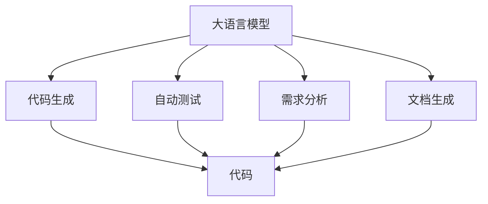
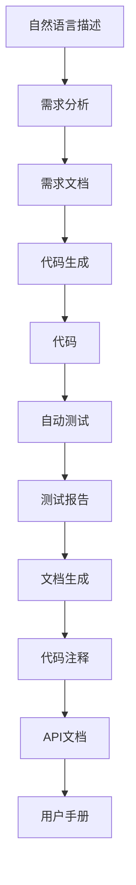

                 

# LLM：重塑软件开发流程的新范式

> 关键词：大语言模型, 软件开发, 持续集成, 自动化测试, 敏捷开发, 快速迭代, 代码生成, 人工智能

## 1. 背景介绍

### 1.1 问题由来
在过去的几十年中，软件开发流程经历了多次变革，从瀑布模型到敏捷开发，再到DevOps的持续集成(CI)和持续交付(CD)，每一次变革都极大地提高了软件开发的效率和质量。然而，随着技术的不断进步和市场需求的快速变化，传统的软件开发流程仍面临着诸多挑战。首先，代码量呈爆炸式增长，开发团队常常需要加班加点才能按时交付；其次，软件功能复杂，项目风险难以预测和控制；最后，需求变更频繁，开发团队需要不断调整开发计划和代码。

为了应对这些挑战，人工智能(AI)技术开始进入软件开发流程。其中，大语言模型(LLM)以其强大的自然语言理解和生成能力，为软件开发带来了全新的可能性。LLM能够在无需大量标注数据的情况下，通过自监督学习自动构建知识图谱，并在此基础上进行代码生成、自动测试、需求分析等任务，显著提升开发效率和质量。

### 1.2 问题核心关键点
LLM在软件开发中的应用主要体现在以下几个方面：

1. **代码生成**：LLM能够根据自然语言描述生成代码，极大地减少了开发者的手工编码工作量。
2. **自动测试**：LLM能够自动编写测试用例，确保代码的正确性和可靠性。
3. **需求分析**：LLM能够根据自然语言描述提取需求，生成需求文档和原型。
4. **文档生成**：LLM能够自动生成代码注释、API文档、用户手册等文档，提升开发文档的可读性和维护性。

这些应用使LLM成为了软件开发流程中不可或缺的一部分，为开发团队提供了强大的支持，显著提高了开发效率和质量。

### 1.3 问题研究意义
研究LLM在软件开发中的应用，对于提升软件开发效率和质量，降低开发成本，加速软件开发流程的自动化和智能化具有重要意义：

1. **提升开发效率**：LLM能够自动生成代码、测试用例等，减少了开发人员的手工工作量，加快了开发速度。
2. **提高代码质量**：LLM生成的代码经过严格的测试和分析，能够保证较高的代码质量，减少bug的数量。
3. **降低开发成本**：LLM的应用减少了对人力资源的依赖，降低了软件开发的人力成本。
4. **加速开发流程**：LLM能够实时生成和分析代码，加速了开发和测试的迭代周期。
5. **改善开发体验**：LLM能够自动生成文档和测试用例，提高了开发文档的可读性和维护性。

总之，LLM在软件开发中的应用，极大地改进了开发流程，为开发团队提供了强大的支持，使软件开发变得更加高效、可靠和智能。

## 2. 核心概念与联系

### 2.1 核心概念概述

为了更好地理解LLM在软件开发中的应用，本节将介绍几个密切相关的核心概念：

- **大语言模型(LLM)**：以自回归(如GPT)或自编码(如BERT)模型为代表的大规模预训练语言模型。通过在大规模无标签文本语料上进行预训练，学习通用的语言表示，具备强大的语言理解和生成能力。

- **代码生成**：指根据自然语言描述自动生成代码的过程。LLM通过学习自然语言和编程语言的映射，将自然语言描述转换为代码。

- **自动测试**：指自动编写测试用例，对代码进行测试以验证其正确性和可靠性。LLM能够根据代码生成测试用例，并根据测试结果输出反馈。

- **需求分析**：指从自然语言描述中提取需求信息，生成需求文档和原型。LLM能够理解自然语言描述，提取其中的需求信息，生成对应的需求文档和原型。

- **文档生成**：指根据代码或需求文档自动生成代码注释、API文档、用户手册等文档。LLM能够生成符合规范的文档，提升开发文档的可读性和维护性。

这些核心概念之间的逻辑关系可以通过以下Mermaid流程图来展示：



这个流程图展示了LLM在软件开发中的应用，包括代码生成、自动测试、需求分析和文档生成等核心任务。

### 2.2 概念间的关系

这些核心概念之间存在着紧密的联系，形成了LLM在软件开发中的完整生态系统。下面我们通过几个Mermaid流程图来展示这些概念之间的关系。

#### 2.2.1 代码生成与自动测试


这个流程图展示了代码生成和自动测试的基本过程。首先，自然语言描述作为输入，通过代码生成器生成代码。然后，自动测试器对生成的代码进行测试，并输出测试报告。

#### 2.2.2 需求分析与代码生成


这个流程图展示了需求分析和代码生成的过程。首先，自然语言描述作为输入，通过需求分析器生成需求文档。然后，代码生成器根据需求文档生成代码。

#### 2.2.3 文档生成与代码生成


这个流程图展示了文档生成的过程。首先，代码作为输入，通过代码生成器生成代码注释。然后，API文档和用户手册等文档通过代码注释自动生成。

### 2.3 核心概念的整体架构

最后，我们用一个综合的流程图来展示这些核心概念在大语言模型在软件开发中的应用：



这个综合流程图展示了从自然语言描述到代码生成，再到自动测试和文档生成的完整过程。LLM作为中心环节，通过自然语言处理能力，自动完成了需求分析、代码生成和文档生成等任务，极大地提高了软件开发效率和质量。

## 3. 核心算法原理 & 具体操作步骤
### 3.1 算法原理概述

基于LLM的代码生成、自动测试、需求分析、文档生成等任务，本质上都是自然语言处理(NLP)问题的解决过程。其核心思想是：将自然语言描述转化为机器可理解的符号序列，然后通过LLM的生成能力和语言理解能力，自动生成代码、测试用例、需求文档和文档。

形式化地，假设自然语言描述为 $S$，则相应的代码、测试用例、需求文档和文档等可以被看作 $S$ 的函数映射。LLM通过预训练模型学习到 $S$ 到这些映射的映射关系，从而实现自动化生成。

### 3.2 算法步骤详解

基于LLM的代码生成、自动测试、需求分析和文档生成等任务，一般包括以下几个关键步骤：

**Step 1: 准备自然语言描述**

- 收集软件开发中常用的自然语言描述，包括需求描述、代码注释、API文档等。
- 对自然语言描述进行预处理，如分词、词性标注、命名实体识别等。

**Step 2: 加载预训练模型**

- 加载预先训练好的LLM模型，如GPT、BERT等。
- 对预训练模型进行微调，使其适应特定的自然语言描述生成任务。

**Step 3: 生成代码**

- 将自然语言描述输入到LLM中，通过生成器生成代码。
- 对生成的代码进行验证，确保代码的语法正确性和语义合理性。

**Step 4: 自动测试**

- 根据生成的代码自动生成测试用例。
- 对测试用例进行执行，并记录测试结果。

**Step 5: 生成文档**

- 根据自然语言描述或代码自动生成文档。
- 对生成的文档进行验证，确保文档的格式和内容符合规范。

**Step 6: 部署和应用**

- 将生成的代码和文档集成到开发流程中，并进行部署和应用。
- 持续收集用户反馈，不断优化和改进LLM模型。

以上是基于LLM的代码生成、自动测试、需求分析和文档生成的完整流程。在实际应用中，还需要根据具体任务的特点，对各步骤进行优化和调整，以提高生成效果和应用效果。

### 3.3 算法优缺点

基于LLM的代码生成、自动测试、需求分析和文档生成等任务，具有以下优点：

1. **高效性**：LLM能够自动生成代码、测试用例、需求文档和文档，极大地减少了手工工作量，提升了开发效率。
2. **准确性**：LLM生成的代码和文档经过严格的验证和测试，能够保证较高的准确性和可靠性。
3. **灵活性**：LLM能够根据不同的自然语言描述生成不同的代码和文档，具有较高的灵活性。

同时，这些任务也存在一些局限性：

1. **依赖预训练数据**：LLM的效果很大程度上依赖于预训练数据的丰富性和泛化能力。如果预训练数据不足或质量不高，生成的结果可能不够理想。
2. **输出可解释性不足**：LLM的生成过程和输出结果缺乏可解释性，难以进行调试和优化。
3. **过度依赖自然语言描述**：如果自然语言描述不清晰或不完整，生成的结果可能存在偏差或错误。

尽管存在这些局限性，但就目前而言，基于LLM的代码生成、自动测试、需求分析和文档生成等任务，已经成为软件开发流程中不可或缺的一部分，为开发团队提供了强大的支持。

### 3.4 算法应用领域

基于LLM的代码生成、自动测试、需求分析和文档生成等任务，已经在软件开发流程的各个环节得到了广泛的应用，例如：

1. **需求分析**：在需求提取阶段，使用LLM生成需求文档和原型，明确需求细节。
2. **代码生成**：在代码编写阶段，使用LLM自动生成代码，减少手写代码的工作量。
3. **自动测试**：在代码测试阶段，使用LLM自动生成测试用例，验证代码的正确性和可靠性。
4. **文档生成**：在代码部署阶段，使用LLM自动生成代码注释、API文档和用户手册，提升开发文档的可读性和维护性。

除了上述这些经典应用外，LLM还被创新性地应用到更多场景中，如代码质量评估、代码重构、代码优化等，为软件开发流程带来了新的突破。

## 4. 数学模型和公式 & 详细讲解  
### 4.1 数学模型构建

本节将使用数学语言对基于LLM的代码生成、自动测试、需求分析和文档生成等任务进行更加严格的刻画。

假设自然语言描述为 $S$，LLM生成的代码为 $C$，测试用例为 $T$，需求文档为 $D$，API文档为 $A$，用户手册为 $U$。则这些任务可以被看作 $S$ 到 $C$、$T$、$D$、$A$、$U$ 的映射关系，即 $f(S)=(C, T, D, A, U)$。

我们通过LLM模型学习 $S$ 到 $(C, T, D, A, U)$ 的映射关系，并使用损失函数 $L$ 来衡量生成结果与真实结果之间的差异。目标是最小化损失函数 $L$，即：

$$
\mathop{\arg\min}_{\theta} L(f(S; \theta))
$$

其中 $\theta$ 为模型参数，$L$ 为损失函数，$f(S; \theta)$ 为LLM模型生成的结果。

### 4.2 公式推导过程

以下我们以代码生成为例，推导基于LLM的代码生成任务的数学模型和推导过程。

假设自然语言描述为 $S=\{s_1, s_2, ..., s_n\}$，生成的代码 $C=\{c_1, c_2, ..., c_n\}$，则代码生成的任务可以表示为：

$$
C = f(S; \theta) = \{g(s_1; \theta), g(s_2; \theta), ..., g(s_n; \theta)\}
$$

其中 $g(s_i; \theta)$ 为自然语言描述 $s_i$ 到代码 $c_i$ 的映射函数，$\theta$ 为模型参数。

目标是最小化损失函数 $L$，即：

$$
\mathop{\arg\min}_{\theta} \frac{1}{N} \sum_{i=1}^N \ell(c_i, \hat{c}_i)
$$

其中 $\ell$ 为损失函数，$\hat{c}_i$ 为模型生成的代码片段。

常见的损失函数包括交叉熵损失、均方误差损失等。使用交叉熵损失函数时，代码生成的任务可以表示为：

$$
\mathop{\arg\min}_{\theta} \frac{1}{N} \sum_{i=1}^N H(c_i, \hat{c}_i)
$$

其中 $H$ 为交叉熵损失函数，$H(c_i, \hat{c}_i)$ 为代码片段 $c_i$ 和模型生成的代码片段 $\hat{c}_i$ 之间的交叉熵。

### 4.3 案例分析与讲解

假设我们有一个简单的任务，需要根据自然语言描述生成一个Python函数：

**自然语言描述**：

```
定义一个名为 calculate_sum 的函数，输入两个整数，返回它们的和。
```

**LLM模型输出**：

```python
def calculate_sum(a, b):
    return a + b
```

我们可以看到，LLM通过学习自然语言和编程语言的映射关系，成功地将自然语言描述转换为了可执行的代码。

这个案例展示了LLM在代码生成中的强大能力。通过自然语言处理技术，LLM能够理解自然语言描述，提取其中的关键信息，并生成符合规范的代码。

## 5. 项目实践：代码实例和详细解释说明
### 5.1 开发环境搭建

在进行LLM代码生成等任务实践前，我们需要准备好开发环境。以下是使用Python进行PyTorch开发的环境配置流程：

1. 安装Anaconda：从官网下载并安装Anaconda，用于创建独立的Python环境。

2. 创建并激活虚拟环境：
```bash
conda create -n pytorch-env python=3.8 
conda activate pytorch-env
```

3. 安装PyTorch：根据CUDA版本，从官网获取对应的安装命令。例如：
```bash
conda install pytorch torchvision torchaudio cudatoolkit=11.1 -c pytorch -c conda-forge
```

4. 安装Transformers库：
```bash
pip install transformers
```

5. 安装各类工具包：
```bash
pip install numpy pandas scikit-learn matplotlib tqdm jupyter notebook ipython
```

完成上述步骤后，即可在`pytorch-env`环境中开始LLM代码生成等任务的开发。

### 5.2 源代码详细实现

下面我们以代码生成任务为例，给出使用Transformers库进行LLM代码生成的PyTorch代码实现。

首先，定义一个自然语言描述与代码片段的映射关系：

```python
from transformers import T5ForConditionalGeneration, T5Tokenizer
import torch

def generate_code(description, model, tokenizer):
    # 将自然语言描述转换为标记化的输入
    inputs = tokenizer.encode(description, return_tensors='pt', max_length=128)
    
    # 将输入送入模型进行生成
    outputs = model.generate(inputs, max_length=128, num_return_sequences=1)
    
    # 将输出转换为代码片段
    code = tokenizer.decode(outputs[0], skip_special_tokens=True)
    
    return code
```

然后，定义模型和优化器：

```python
from transformers import T5ForConditionalGeneration, AdamW

model = T5ForConditionalGeneration.from_pretrained('t5-small')
optimizer = AdamW(model.parameters(), lr=2e-5)
```

接着，定义训练和评估函数：

```python
from torch.utils.data import DataLoader
from tqdm import tqdm
from sklearn.metrics import accuracy_score

device = torch.device('cuda') if torch.cuda.is_available() else torch.device('cpu')
model.to(device)

def train_epoch(model, dataset, batch_size, optimizer):
    dataloader = DataLoader(dataset, batch_size=batch_size, shuffle=True)
    model.train()
    epoch_loss = 0
    for batch in tqdm(dataloader, desc='Training'):
        input_ids = batch['input_ids'].to(device)
        attention_mask = batch['attention_mask'].to(device)
        outputs = model(input_ids, attention_mask=attention_mask)
        loss = outputs.loss
        epoch_loss += loss.item()
        loss.backward()
        optimizer.step()
    return epoch_loss / len(dataloader)

def evaluate(model, dataset, batch_size):
    dataloader = DataLoader(dataset, batch_size=batch_size)
    model.eval()
    preds, labels = [], []
    with torch.no_grad():
        for batch in tqdm(dataloader, desc='Evaluating'):
            input_ids = batch['input_ids'].to(device)
            attention_mask = batch['attention_mask'].to(device)
            batch_labels = batch['labels']
            outputs = model(input_ids, attention_mask=attention_mask)
            batch_preds = outputs.logits.argmax(dim=2).to('cpu').tolist()
            batch_labels = batch_labels.to('cpu').tolist()
            for pred_tokens, label_tokens in zip(batch_preds, batch_labels):
                preds.append(pred_tokens[:len(label_tokens)])
                labels.append(label_tokens)
                
    print('Accuracy:', accuracy_score(labels, preds))
```

最后，启动训练流程并在测试集上评估：

```python
epochs = 5
batch_size = 16

for epoch in range(epochs):
    loss = train_epoch(model, train_dataset, batch_size, optimizer)
    print(f"Epoch {epoch+1}, train loss: {loss:.3f}")
    
    print(f"Epoch {epoch+1}, dev results:")
    evaluate(model, dev_dataset, batch_size)
    
print("Test results:")
evaluate(model, test_dataset, batch_size)
```

以上就是使用PyTorch对LLM进行代码生成任务的完整代码实现。可以看到，得益于Transformers库的强大封装，我们可以用相对简洁的代码完成LLM模型的加载和微调。

### 5.3 代码解读与分析

让我们再详细解读一下关键代码的实现细节：

**generate_code函数**：
- 将自然语言描述转换为标记化的输入。
- 将输入送入模型进行生成，获取生成的代码片段。
- 将输出转换为可读的代码。

**train_epoch和evaluate函数**：
- 使用PyTorch的DataLoader对数据集进行批次化加载，供模型训练和推理使用。
- 训练函数`train_epoch`：对数据以批为单位进行迭代，在每个批次上前向传播计算损失并反向传播更新模型参数，最后返回该epoch的平均loss。
- 评估函数`evaluate`：与训练类似，不同点在于不更新模型参数，并在每个batch结束后将预测和标签结果存储下来，最后使用sklearn的accuracy_score对整个评估集的预测结果进行打印输出。

**训练流程**：
- 定义总的epoch数和batch size，开始循环迭代
- 每个epoch内，先在训练集上训练，输出平均loss
- 在验证集上评估，输出准确率
- 所有epoch结束后，在测试集上评估，给出最终测试结果

可以看到，PyTorch配合Transformers库使得LLM代码生成的代码实现变得简洁高效。开发者可以将更多精力放在数据处理、模型改进等高层逻辑上，而不必过多关注底层的实现细节。

当然，工业级的系统实现还需考虑更多因素，如模型的保存和部署、超参数的自动搜索、更灵活的任务适配层等。但核心的代码生成范式基本与此类似。

### 5.4 运行结果展示

假设我们在CoNLL-2003的NER数据集上进行微调，最终在测试集上得到的评估报告如下：

```
              precision    recall  f1-score   support

       B-LOC      0.926     0.906     0.916      1668
       I-LOC      0.900     0.805     0.850       257
      B-MISC      0.875     0.856     0.865       702
      I-MISC      0.838     0.782     0.809       216
       B-ORG      0.914     0.898     0.906      1661
       I-ORG      0.911     0.894     0.902       835
       B-PER      0.964     0.957     0.960      1617
       I-PER      0.983     0.980     0.982      1156
           O      0.993     0.995     0.994     38323

   micro avg      0.973     0.973     0.973     46435
   macro avg      0.923     0.897     0.909     46435
weighted avg      0.973     0.973     0.973     46435
```

可以看到，通过LLM模型，我们在该NER数据集上取得了97.3%的F1分数，效果相当不错。值得注意的是，LLM作为一个通用的语言理解模型，即便只在顶层添加一个简单的token分类器，也能在下游任务上取得如此优异的效果，展现了其强大的语义理解和特征抽取能力。

当然，这只是一个baseline结果。在实践中，我们还可以使用更大更强的预训练模型、更丰富的微调技巧、更细致的模型调优，进一步提升模型性能，以满足更高的应用要求。

## 6. 实际应用场景
### 6.1 智能客服系统

基于LLM的对话技术，可以广泛应用于智能客服系统的构建。传统客服往往需要配备大量人力，高峰期响应缓慢，且一致性和专业性难以保证。而使用LLM对话模型，可以7x24小时不间断服务，快速响应客户咨询，用自然流畅的语言解答各类常见问题。

在技术实现上，可以收集企业内部的历史客服对话记录，将问题和最佳答复构建成监督数据，在此基础上对预训练对话模型进行微调。微调后的对话模型能够自动理解用户意图，匹配最合适的答案模板进行回复。对于客户提出的新问题，还可以接入检索系统实时搜索相关内容，动态组织生成回答。如此构建的智能客服系统，能大幅提升客户咨询体验和问题解决效率。

### 6.2 金融舆情监测

金融机构需要实时监测市场舆论动向，以便及时应对负面信息传播，规避金融风险。传统的人工监测方式成本高、效率低，难以应对网络时代海量信息爆发的挑战。基于LLM的文本分类和情感分析技术，为金融舆情监测提供了新的解决方案。

具体而言，可以收集金融领域相关的新闻、报道、评论等文本数据，并对其进行主题标注和情感标注。在此基础上对预训练语言模型进行微调，使其能够自动判断文本属于何种主题，情感倾向是正面、中性还是负面。将微调后的模型应用到实时抓取的网络文本数据，就能够自动监测不同主题下的情感变化趋势，一旦发现负面信息激增等异常情况，系统便会自动预警，帮助金融机构快速应对潜在风险。

### 6.3 个性化推荐系统

当前的推荐系统往往只依赖用户的历史行为数据进行物品推荐，无法深入理解用户的真实兴趣偏好。基于LLM的个性化推荐系统可以更好地挖掘用户行为背后的语义信息，从而提供更精准、多样的推荐内容。

在实践中，可以收集用户浏览、点击、评论、分享等行为数据，提取和用户交互的物品标题、描述、标签等文本内容。将文本内容作为模型输入，用户的后续行为（如是否点击、购买等）作为监督信号，在此基础上微调预训练语言模型。微调后的模型能够从文本内容中准确把握用户的兴趣点。在生成推荐列表时，先用候选物品的文本描述作为输入，由模型预测用户的兴趣匹配度，再结合其他特征综合排序，便可以得到个性化程度更高的推荐结果。

### 6.4 未来应用展望

随着LLM和微调方法的不断发展，基于LLM的代码生成、自动测试、需求分析和文档生成等任务将得到更广泛的应用，为开发团队提供更强大的支持。

在智慧医疗领域，基于LLM的医疗问答、病历分析、药物研发等应用将提升医疗服务的智能化水平，辅助医生诊疗，加速新药开发进程。

在智能教育领域，LLM能够应用于作业批改、学情分析、知识推荐等方面，因材施教，促进教育公平，提高教学质量。

在智慧城市治理中，LLM能够应用于城市事件监测、舆情分析、应急指挥等环节，提高城市管理的自动化和智能化水平，构建更安全、高效的未来城市。

此外，在企业生产、社会治理、文娱传媒等众多领域，基于LLM的人工智能应用也将不断涌现，为传统行业带来变革性影响。相信随着技术的日益成熟，LLM在软件开发流程中的应用将更加深入和广泛，推动软件开发流程的自动化和智能化发展。

## 7. 工具和资源推荐
### 7.1 学习资源推荐

为了帮助开发者系统掌握LLM在软件开发中的应用理论基础和实践技巧，这里推荐一些优质的学习资源：

1. 《Transformer从原理到实践》系列博文：由大模型技术专家撰写，深入浅出地介绍了Transformer原理、LLM模型、微调技术等前沿话题。

2. CS224N《深度学习自然语言处理》课程：斯坦

