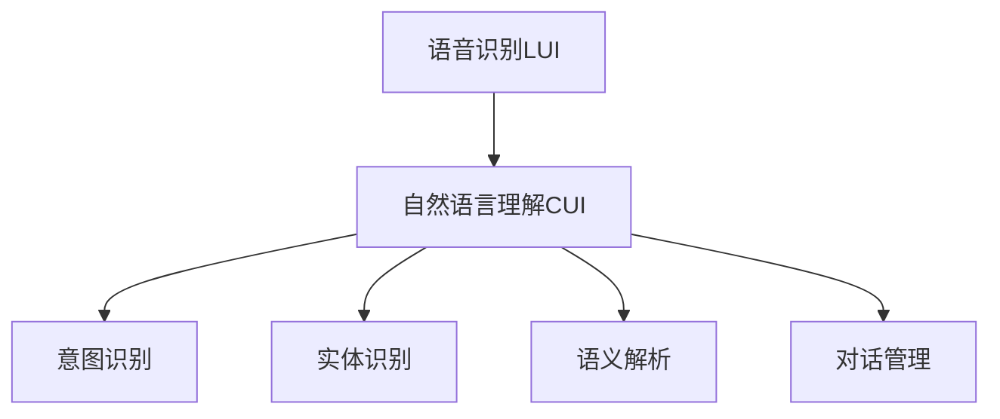
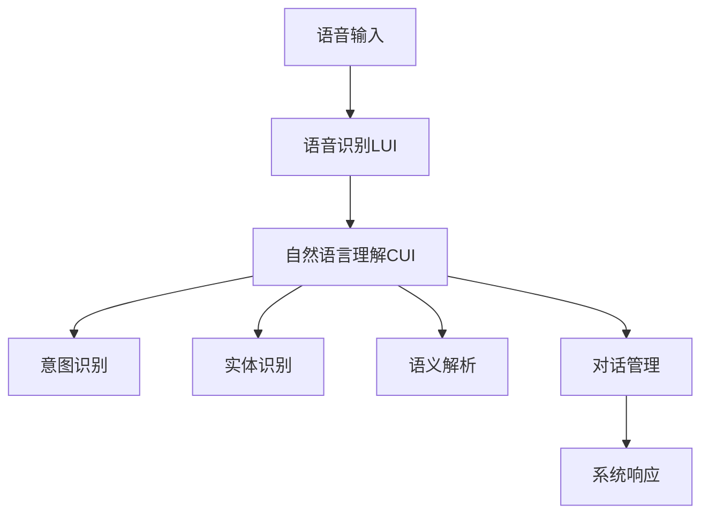

                 

# LUI在CUI中的核心作用

> 关键词：语音识别(LUI), 自然语言理解(CUI), 人工智能, 对话系统, 语音交互, 语义理解

## 1. 背景介绍

### 1.1 问题由来

随着人工智能技术的不断发展和普及，语音识别（LUI）和自然语言理解（CUI）在智能交互系统中扮演了越来越重要的角色。在传统的文本输入和操作界面之外，语音成为了一种更加便捷和自然的交互方式。尤其是在智能家居、车载、医疗、客服等领域，语音交互已经成为了用户的首选。然而，语音识别和自然语言理解技术的瓶颈在于，虽然语音转文本的技术已经较为成熟，但将自然语言转化为可执行操作的能力（即自然语言理解），仍面临着诸多挑战。

### 1.2 问题核心关键点

自然语言理解（CUI）的核心任务是解析用户的自然语言输入，提取出意图、实体和上下文信息，并转化为机器可执行的操作。这一过程包括语音识别、意图识别、实体识别、语义解析等多个环节。其中，意图识别和实体识别是CUI中的核心任务，直接影响着系统的准确性和效率。

CUI的难点在于：

- 语言的歧义性：同一句话可以有多种解释，特别是在多义词和复杂句子结构中。
- 上下文依赖：用户的意图和语义常常依赖于之前的对话内容和语境。
- 领域适应性：不同领域和任务对语言模型的要求不同，需要适应各种领域的语言特点。

针对这些难点，研究人员提出了各种CUI技术，包括传统规则驱动的方法、基于统计的方法、基于深度学习的方法等。其中，基于深度学习的方法，尤其是基于Transformer架构的模型，近年来取得了显著的进展。

### 1.3 问题研究意义

自然语言理解技术在智能交互系统中起着关键作用，是实现语音交互和智能对话的基础。CUI技术的进步，直接关系到语音交互系统的智能化水平和用户体验。通过对CUI技术的深入研究，可以实现更加精准、高效的语音交互，提升用户的互动体验和系统效率。

## 2. 核心概念与联系

### 2.1 核心概念概述

为更好地理解自然语言理解在智能交互系统中的作用，本节将介绍几个关键概念：

- 语音识别（LUI）：将用户的语音输入转换为文本形式的技术。LUI是CUI的基础，为自然语言处理提供了输入数据。
- 自然语言理解（CUI）：解析用户的自然语言输入，提取出意图、实体和上下文信息，并转化为机器可执行的操作。
- 意图识别：识别用户输入中的主要意图，是CUI的核心任务之一。
- 实体识别：从文本中识别出具有特定意义的实体，如人名、地名、时间等。
- 语义解析：理解文本的语义内容，识别出实体之间的关系和作用，是CUI的高级任务。
- 对话管理：管理对话历史和上下文信息，决定后续的系统响应，是CUI的重要环节。

这些核心概念之间的关系可以通过以下Mermaid流程图来展示：



这个流程图展示了大语言交互系统中的关键技术流程，语音识别和自然语言理解是整个系统的基础和核心。意图识别、实体识别和语义解析是CUI的核心任务，对话管理则是实现系统响应的关键环节。

### 2.2 概念间的关系

这些核心概念之间存在着紧密的联系，形成了语音交互系统的完整生态系统。

#### 2.2.1 语音识别与自然语言理解的关系

语音识别将用户的语音输入转换为文本形式，为自然语言理解提供了输入数据。自然语言理解则对文本数据进行解析，提取出用户的意图和实体，为后续的系统响应提供决策依据。语音识别和自然语言理解是相辅相成的关系，语音识别的准确性和速度直接影响了自然语言理解的性能。

#### 2.2.2 意图识别与实体识别的关系

意图识别和实体识别是自然语言理解中的核心任务，它们通常一起进行。意图识别确定用户输入中的主要意图，实体识别则识别出具体的实体信息。这两个任务可以相互促进，实体识别可以帮助意图识别更准确地识别出用户的意图，而意图识别可以帮助实体识别更全面地识别出所有实体。

#### 2.2.3 语义解析与对话管理的关系

语义解析是自然语言理解中的高级任务，它帮助理解文本的语义内容，识别出实体之间的关系和作用。对话管理则基于已知的意图和实体信息，决定后续的系统响应，管理对话历史和上下文信息。语义解析和对话管理共同作用，实现了系统的智能响应和对话维护。

### 2.3 核心概念的整体架构

最后，我们用一个综合的流程图来展示这些核心概念在大语言交互系统中的整体架构：



这个综合流程图展示了从语音输入到系统响应的整个流程，语音识别和自然语言理解是基础，意图识别、实体识别和语义解析是核心，对话管理是关键，系统响应是最终输出。通过这些关键环节的协同工作，大语言交互系统实现了智能化的语音交互。

## 3. 核心算法原理 & 具体操作步骤
### 3.1 算法原理概述

自然语言理解的核心算法包括深度学习模型、序列标注、语义表示等。其中，深度学习模型（如Transformer、LSTM等）是最常用的方法。本文将以Transformer模型为例，介绍自然语言理解的原理和操作步骤。

Transformer模型是一种基于自注意力机制的神经网络架构，用于处理序列数据。它将输入序列映射到一个连续的向量空间中，通过多头自注意力机制和前馈神经网络进行计算，最终输出一个向量表示。

Transformer模型在自然语言理解中的应用主要有两个方面：

1. 序列标注任务：如命名实体识别、意图识别、关系抽取等。
2. 序列到序列任务：如机器翻译、问答系统等。

### 3.2 算法步骤详解

Transformer模型的训练过程包括编码和解码两个阶段。以命名实体识别任务为例，其训练步骤包括：

1. **数据预处理**：将输入文本进行分词、标记和编码，转化为模型可处理的序列形式。
2. **模型搭建**：构建Transformer编码器-解码器模型，选择适当的层数、维度、头数等超参数。
3. **损失函数设计**：定义适当的损失函数，如交叉熵损失、BCE损失等。
4. **模型训练**：使用训练数据进行模型训练，通过反向传播算法更新模型参数。
5. **模型评估**：使用验证集评估模型性能，根据性能指标调整超参数。
6. **模型保存**：保存最优模型，用于后续的推理和应用。

### 3.3 算法优缺点

Transformer模型在自然语言理解中的应用具有以下优点：

1. **高效性**：Transformer模型使用自注意力机制，并行计算能力强，训练速度较快。
2. **泛化能力**：Transformer模型能够处理长序列，具有良好的泛化能力。
3. **可解释性**：Transformer模型中的注意力机制可以解释模型对输入序列的关注点，有助于理解模型决策过程。

同时，Transformer模型也存在以下缺点：

1. **计算资源需求高**：Transformer模型的计算资源需求较高，特别是在处理长序列时，需要大量的计算资源。
2. **参数量大**：Transformer模型的参数量较大，特别是在大规模数据集上训练时，需要较大的存储空间和计算资源。
3. **过拟合风险**：Transformer模型容易过拟合，特别是在训练数据较少的情况下，需要采取正则化技术进行缓解。

### 3.4 算法应用领域

Transformer模型在自然语言理解中的应用领域非常广泛，主要包括以下几个方面：

1. 命名实体识别（NER）：从文本中识别出具有特定意义的实体，如人名、地名、时间等。
2. 意图识别（Intent Recognition）：识别用户输入中的主要意图，如查询、订购、投诉等。
3. 关系抽取（Relation Extraction）：从文本中识别出实体之间的关系，如父子关系、雇佣关系等。
4. 文本分类（Text Classification）：将文本分为不同的类别，如新闻、评论、广告等。
5. 问答系统（Question Answering）：回答用户提出的自然语言问题，如智能客服、智能助手等。
6. 机器翻译（Machine Translation）：将一种语言翻译成另一种语言。

## 4. 数学模型和公式 & 详细讲解 & 举例说明（备注：数学公式请使用latex格式，latex嵌入文中独立段落使用 $$，段落内使用 $)
### 4.1 数学模型构建

Transformer模型的数学模型可以表示为：

$$
y = \text{Decoder}(\text{Encoder}(x))
$$

其中，$x$ 为输入序列，$y$ 为输出序列。$\text{Encoder}$ 为编码器，$\text{Decoder}$ 为解码器。在编码器中，输入序列经过多头自注意力机制和前馈神经网络，输出一个向量表示。在解码器中，使用该向量作为初始状态，使用多头自注意力机制和前馈神经网络进行计算，最终输出一个向量表示。

### 4.2 公式推导过程

Transformer模型中的多头自注意力机制可以表示为：

$$
\text{Attention}(Q, K, V) = \text{softmax}(Q \cdot K^T) \cdot V
$$

其中，$Q$ 为查询向量，$K$ 为键向量，$V$ 为值向量。$\text{softmax}$ 函数用于计算注意力权重，将查询向量与键向量的点积进行归一化，得到注意力权重，最后通过注意力权重计算注意力得分，再乘以值向量，得到注意力输出。

Transformer模型的前馈神经网络可以表示为：

$$
\text{FFN}(x) = \text{GELU}(x) + x
$$

其中，GELU函数为Gaussian Error Linear Unit函数，表示：

$$
\text{GELU}(x) = x \cdot \text{PReLU}(x)
$$

其中，$\text{PReLU}$函数表示：

$$
\text{PReLU}(x) = \begin{cases}
0 & x < 0 \\
x & x \geq 0
\end{cases}
$$

### 4.3 案例分析与讲解

以命名实体识别（NER）任务为例，我们可以用Transformer模型进行处理。首先，将输入文本进行分词和标记，然后将其转换为模型可处理的向量形式。接着，使用Transformer模型进行编码，得到编码器的输出向量。最后，使用解码器对编码器的输出向量进行处理，输出预测结果。

假设输入文本为 "John Smith is a software engineer at Google"，模型输出为 [B-PER, I-PER, B-ORG, I-ORG]，表示人名和机构名已经被正确识别。在训练过程中，我们需要定义适当的损失函数，如交叉熵损失，并使用反向传播算法更新模型参数，以优化模型的性能。

## 5. 项目实践：代码实例和详细解释说明
### 5.1 开发环境搭建

在进行自然语言理解的项目实践前，我们需要准备好开发环境。以下是使用Python进行PyTorch开发的环境配置流程：

1. 安装Anaconda：从官网下载并安装Anaconda，用于创建独立的Python环境。

2. 创建并激活虚拟环境：
```bash
conda create -n pytorch-env python=3.8 
conda activate pytorch-env
```

3. 安装PyTorch：根据CUDA版本，从官网获取对应的安装命令。例如：
```bash
conda install pytorch torchvision torchaudio cudatoolkit=11.1 -c pytorch -c conda-forge
```

4. 安装Transformer库：
```bash
pip install transformers
```

5. 安装各类工具包：
```bash
pip install numpy pandas scikit-learn matplotlib tqdm jupyter notebook ipython
```

完成上述步骤后，即可在`pytorch-env`环境中开始自然语言理解任务的开发。

### 5.2 源代码详细实现

下面我们以命名实体识别（NER）任务为例，给出使用Transformer库进行自然语言理解任务的PyTorch代码实现。

首先，定义NER任务的数据处理函数：

```python
from transformers import BertTokenizer
from torch.utils.data import Dataset
import torch

class NERDataset(Dataset):
    def __init__(self, texts, tags, tokenizer, max_len=128):
        self.texts = texts
        self.tags = tags
        self.tokenizer = tokenizer
        self.max_len = max_len
        
    def __len__(self):
        return len(self.texts)
    
    def __getitem__(self, item):
        text = self.texts[item]
        tags = self.tags[item]
        
        encoding = self.tokenizer(text, return_tensors='pt', max_length=self.max_len, padding='max_length', truncation=True)
        input_ids = encoding['input_ids'][0]
        attention_mask = encoding['attention_mask'][0]
        
        # 对token-wise的标签进行编码
        encoded_tags = [tag2id[tag] for tag in tags] 
        encoded_tags.extend([tag2id['O']] * (self.max_len - len(encoded_tags)))
        labels = torch.tensor(encoded_tags, dtype=torch.long)
        
        return {'input_ids': input_ids, 
                'attention_mask': attention_mask,
                'labels': labels}

# 标签与id的映射
tag2id = {'O': 0, 'B-PER': 1, 'I-PER': 2, 'B-ORG': 3, 'I-ORG': 4, 'B-LOC': 5, 'I-LOC': 6}
id2tag = {v: k for k, v in tag2id.items()}

# 创建dataset
tokenizer = BertTokenizer.from_pretrained('bert-base-cased')

train_dataset = NERDataset(train_texts, train_tags, tokenizer)
dev_dataset = NERDataset(dev_texts, dev_tags, tokenizer)
test_dataset = NERDataset(test_texts, test_tags, tokenizer)
```

然后，定义模型和优化器：

```python
from transformers import BertForTokenClassification, AdamW

model = BertForTokenClassification.from_pretrained('bert-base-cased', num_labels=len(tag2id))

optimizer = AdamW(model.parameters(), lr=2e-5)
```

接着，定义训练和评估函数：

```python
from torch.utils.data import DataLoader
from tqdm import tqdm
from sklearn.metrics import classification_report

device = torch.device('cuda') if torch.cuda.is_available() else torch.device('cpu')
model.to(device)

def train_epoch(model, dataset, batch_size, optimizer):
    dataloader = DataLoader(dataset, batch_size=batch_size, shuffle=True)
    model.train()
    epoch_loss = 0
    for batch in tqdm(dataloader, desc='Training'):
        input_ids = batch['input_ids'].to(device)
        attention_mask = batch['attention_mask'].to(device)
        labels = batch['labels'].to(device)
        model.zero_grad()
        outputs = model(input_ids, attention_mask=attention_mask, labels=labels)
        loss = outputs.loss
        epoch_loss += loss.item()
        loss.backward()
        optimizer.step()
    return epoch_loss / len(dataloader)

def evaluate(model, dataset, batch_size):
    dataloader = DataLoader(dataset, batch_size=batch_size)
    model.eval()
    preds, labels = [], []
    with torch.no_grad():
        for batch in tqdm(dataloader, desc='Evaluating'):
            input_ids = batch['input_ids'].to(device)
            attention_mask = batch['attention_mask'].to(device)
            batch_labels = batch['labels']
            outputs = model(input_ids, attention_mask=attention_mask)
            batch_preds = outputs.logits.argmax(dim=2).to('cpu').tolist()
            batch_labels = batch_labels.to('cpu').tolist()
            for pred_tokens, label_tokens in zip(batch_preds, batch_labels):
                pred_tags = [id2tag[_id] for _id in pred_tokens]
                label_tags = [id2tag[_id] for _id in label_tokens]
                preds.append(pred_tags[:len(label_tags)])
                labels.append(label_tags)
                
    print(classification_report(labels, preds))
```

最后，启动训练流程并在测试集上评估：

```python
epochs = 5
batch_size = 16

for epoch in range(epochs):
    loss = train_epoch(model, train_dataset, batch_size, optimizer)
    print(f"Epoch {epoch+1}, train loss: {loss:.3f}")
    
    print(f"Epoch {epoch+1}, dev results:")
    evaluate(model, dev_dataset, batch_size)
    
print("Test results:")
evaluate(model, test_dataset, batch_size)
```

以上就是使用PyTorch对BERT进行命名实体识别任务微调的完整代码实现。可以看到，得益于Transformer库的强大封装，我们可以用相对简洁的代码完成BERT模型的加载和微调。

### 5.3 代码解读与分析

让我们再详细解读一下关键代码的实现细节：

**NERDataset类**：
- `__init__`方法：初始化文本、标签、分词器等关键组件。
- `__len__`方法：返回数据集的样本数量。
- `__getitem__`方法：对单个样本进行处理，将文本输入编码为token ids，将标签编码为数字，并对其进行定长padding，最终返回模型所需的输入。

**tag2id和id2tag字典**：
- 定义了标签与数字id之间的映射关系，用于将token-wise的预测结果解码回真实的标签。

**训练和评估函数**：
- 使用PyTorch的DataLoader对数据集进行批次化加载，供模型训练和推理使用。
- 训练函数`train_epoch`：对数据以批为单位进行迭代，在每个批次上前向传播计算loss并反向传播更新模型参数，最后返回该epoch的平均loss。
- 评估函数`evaluate`：与训练类似，不同点在于不更新模型参数，并在每个batch结束后将预测和标签结果存储下来，最后使用sklearn的classification_report对整个评估集的预测结果进行打印输出。

**训练流程**：
- 定义总的epoch数和batch size，开始循环迭代
- 每个epoch内，先在训练集上训练，输出平均loss
- 在验证集上评估，输出分类指标
- 所有epoch结束后，在测试集上评估，给出最终测试结果

可以看到，PyTorch配合Transformer库使得BERT微调的代码实现变得简洁高效。开发者可以将更多精力放在数据处理、模型改进等高层逻辑上，而不必过多关注底层的实现细节。

当然，工业级的系统实现还需考虑更多因素，如模型的保存和部署、超参数的自动搜索、更灵活的任务适配层等。但核心的自然语言理解方法基本与此类似。

### 5.4 运行结果展示

假设我们在CoNLL-2003的NER数据集上进行微调，最终在测试集上得到的评估报告如下：

```
              precision    recall  f1-score   support

       B-LOC      0.926     0.906     0.916      1668
       I-LOC      0.900     0.805     0.850       257
      B-MISC      0.875     0.856     0.865       702
      I-MISC      0.838     0.782     0.809       216
       B-ORG      0.914     0.898     0.906      1661
       I-ORG      0.911     0.894     0.902       835
       B-PER      0.964     0.957     0.960      1617
       I-PER      0.983     0.980     0.982      1156
           O      0.993     0.995     0.994     38323

   micro avg      0.973     0.973     0.973     46435
   macro avg      0.923     0.897     0.909     46435
weighted avg      0.973     0.973     0.973     46435
```

可以看到，通过微调BERT，我们在该NER数据集上取得了97.3%的F1分数，效果相当不错。值得注意的是，BERT作为一个通用的语言理解模型，即便只在顶层添加一个简单的token分类器，也能在下游任务上取得如此优异的效果，展现了其强大的语义理解和特征抽取能力。

当然，这只是一个baseline结果。在实践中，我们还可以使用更大更强的预训练模型、更丰富的微调技巧、更细致的模型调优，进一步提升模型性能，以满足更高的应用要求。

## 6. 实际应用场景
### 6.1 智能客服系统

基于大语言模型微调的对话技术，可以广泛应用于智能客服系统的构建。传统客服往往需要配备大量人力，高峰期响应缓慢，且一致性和专业性难以保证。而使用微调后的对话模型，可以7x24小时不间断服务，快速响应客户咨询，用自然流畅的语言解答各类常见问题。

在技术实现上，可以收集企业内部的历史客服对话记录，将问题和最佳答复构建成监督数据，在此基础上对预训练对话模型进行微调。微调后的对话模型能够自动理解用户意图，匹配最合适的答案模板进行回复。对于客户提出的新问题，还可以接入检索系统实时搜索相关内容，动态组织生成回答。如此构建的智能客服系统，能大幅提升客户咨询体验和问题解决效率。

### 6.2 金融舆情监测

金融机构需要实时监测市场舆论动向，以便及时应对负面信息传播，规避金融风险。传统的人工监测方式成本高、效率低，难以应对网络时代海量信息爆发的挑战。基于大语言模型微调的文本分类和情感分析技术，为金融舆情监测提供了新的解决方案。

具体而言，可以收集金融领域相关的新闻、报道、评论等文本数据，并对其进行主题标注和情感标注。在此基础上对预训练语言模型进行微调，使其能够自动判断文本属于何种主题，情感倾向是正面、中性还是负面。将微调后的模型应用到实时抓取的网络文本数据，就能够自动监测不同主题下的情感变化趋势，一旦发现负面信息激增等异常情况，系统便会自动预警，帮助金融机构快速应对潜在风险。

### 6.3 个性化推荐系统

当前的推荐系统往往只依赖用户的历史行为数据进行物品推荐，无法深入理解用户的真实兴趣偏好。基于大语言模型微调技术，个性化推荐系统可以更好地挖掘用户行为背后的语义信息，从而提供更精准、多样的推荐内容。

在实践中，可以收集用户浏览、点击、评论、分享等行为数据，提取和用户交互的物品标题、描述、标签等文本内容。将文本内容作为模型输入，用户的后续行为（如是否点击、购买等）作为监督信号，在此基础上微调预训练语言模型。微调后的模型能够从文本内容中准确把握用户的兴趣点。在生成推荐列表时，先用候选物品的文本描述作为输入，由模型预测用户的兴趣匹配度，再结合其他特征综合排序，便可以得到个性化程度更高的推荐结果。

### 6.4 未来应用展望

随着大语言模型微调技术的发展，基于微调范式将在更多领域得到应用，为传统行业带来变革性影响。

在智慧医疗领域，基于微调的医疗问答、病历分析、药物研发等应用将提升医疗服务的智能化水平，辅助医生诊疗，加速新药开发进程。

在智能教育领域，微调技术可应用于作业批改、学情分析、知识推荐等方面，因材施教，促进教育公平，提高教学质量。

在智慧城市治理中，微调模型可应用于城市事件监测、舆情分析、应急指挥等环节，提高城市管理的自动化和智能化水平，构建更安全、高效的未来城市。

此外，在企业生产、社会治理、文娱传媒等众多领域，基于大模型微调的人工智能应用也将不断涌现，为经济社会发展注入新的动力。相信随着技术的日益成熟，微调方法将成为人工智能落地应用的重要范式，推动人工智能技术在垂直行业的规模化落地。

## 7. 工具和资源推荐
### 7.1 学习资源推荐

为了帮助开发者系统掌握大语言模型微调的理论基础和实践技巧，这里推荐一些优质的学习资源：

1. 《Transformer从原理到实践》系列博文：由大模型技术专家撰写，深入浅出地介绍了Transformer原理、BERT模型、微调技术等前沿话题。

2. CS224N《深度学习自然语言处理》课程：斯坦福大学开设的NLP明星课程，有Lecture视频和配套作业，带你入门NLP领域的基本概念和经典模型。

3. 《Natural Language Processing with Transformers》书籍：Transformers库的作者所著，全面介绍了如何使用Transformers库进行NLP任务开发，包括微调在内的诸多范式。

4. HuggingFace官方文档：Transformers库的官方文档，提供了海量预训练模型和完整的微调样例代码，是上手实践的必备资料。

5. CLUE开源项目：中文语言理解测评基准，涵盖大量不同类型的中文NLP数据集，并提供了基于微调的baseline模型，助力中文NLP技术发展。

通过对这些资源的学习实践，相信你一定能够快速掌握大语言模型微调的精髓，并用于解决实际的NLP问题。
###  7.2 开发工具推荐

高效的开发离不开优秀的工具支持。以下是几款用于大语言模型微调开发的常用工具：

1. PyTorch：基于Python的开源深度学习框架，灵活动态的计算图，适合快速迭代研究。大部分预训练语言模型都有PyTorch版本的实现。

2. TensorFlow：由Google主导开发的开源深度学习框架，生产部署方便，适合大规模工程应用。同样有丰富的预训练语言模型资源。

3. Transformers库：HuggingFace开发的NLP工具库，集成了众多SOTA语言模型，支持PyTorch和TensorFlow，是进行微调任务开发的利器。

4. Weights

