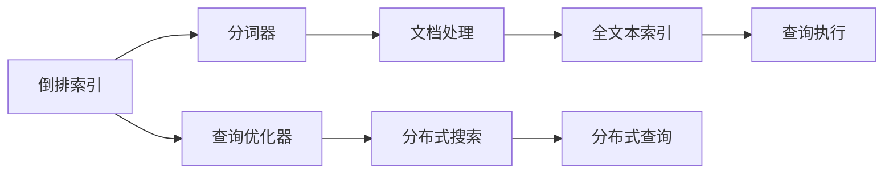
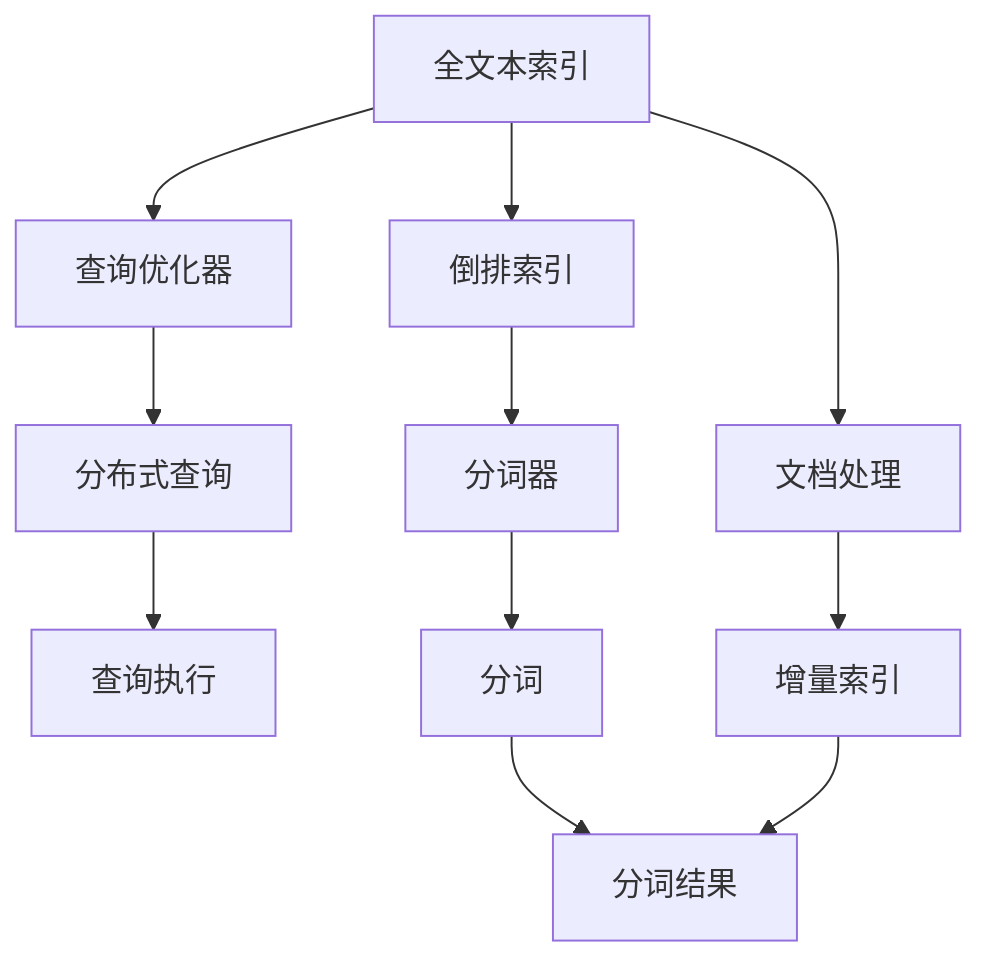

                 

# Lucene搜索引擎原理与代码实例讲解

> 关键词：Lucene, 全文搜索引擎, 倒排索引, 查询优化, 分词器, 代码实例, 实时索引, 应用场景

## 1. 背景介绍

### 1.1 问题由来
随着互联网和数字化的不断普及，越来越多的信息和数据需要被高效地存储和检索。传统的文本搜索方式往往基于简单的字符串匹配，精度低、效率差，难以满足大规模数据的搜索需求。因此，全文搜索引擎应运而生，成为信息检索领域的重要技术。

 Lucene是由Apache软件基金会开发的开源全文搜索引擎，基于Java语言实现，支持高效索引和全文搜索。它不仅适用于Java平台，还可以通过JVM桥接兼容其他平台，如.NET、Swift等，因此在各种编程语言中都有广泛的应用。

 Lucene的核心思想是利用倒排索引(Inverted Index)构建索引，将文本中的单词和文档ID进行映射，实现快速定位和检索。通过 Lucene，开发者可以快速搭建高性能、可扩展的全文搜索引擎，满足各种应用场景的需求。

### 1.2 问题核心关键点
Lucene的核心技术点包括：
- 倒排索引：基于单词到文档ID的映射，实现高效的全文检索。
- 分词器：将文本分词为单词单元，便于索引和查询。
- 查询优化器：基于搜索查询重写和查询优化，提升查询效率。
- 文档处理：支持多种文档格式，支持增量索引和实时索引，提供丰富的搜索功能。
- 分布式搜索：支持多节点集群，实现负载均衡和高可用性。

这些核心技术点使得 Lucene成为Java平台下最流行的全文搜索引擎之一，广泛应用于文档检索、日志分析、新闻搜索、企业搜索等多个领域。

### 1.3 问题研究意义
Lucene的研究和应用对于推动信息检索技术的发展具有重要意义：
- 提高了文本搜索的精度和效率，显著提升了用户体验。
- 支持多语言搜索，打破了语言障碍，扩展了搜索范围。
- 提供了灵活的API接口和丰富的搜索功能，使得开发者可以快速构建各种应用。
- 支持分布式索引和查询，满足了大数据环境下的高性能需求。
- 开源社区强大，生态丰富，促进了技术的快速迭代和应用推广。

了解Lucene的原理和应用，有助于开发者更好地构建和优化搜索引擎，实现高效的数据检索和应用开发。

## 2. 核心概念与联系

### 2.1 核心概念概述

为更好地理解Lucene的工作原理，本节将介绍几个关键概念：

- **倒排索引(Inverted Index)**：一种数据结构，将文本中的单词映射到包含该单词的文档列表中。它是全文搜索引擎的核心技术，实现了快速定位和检索。
- **分词器(Tokenization)**：将文本分词为单词单元，便于索引和查询。 Lucene支持多种分词器，如中文分词器IKAnalyzer、英文分词器WhitespaceTokenizer等。
- **查询优化器(Query Optimizer)**：根据查询条件和索引结构，优化查询语句，提升查询效率。
- **文档处理(Document Processing)**：支持多种文档格式，如HTML、XML、PDF等，并提供增量索引、实时索引等功能，实现高效的数据处理。
- **分布式搜索(Distributed Search)**：通过多节点集群，实现负载均衡和高可用性，提升搜索性能和稳定性。

这些核心概念共同构成了Lucene的全文搜索框架，使得Lucene能够高效地存储、检索和处理海量文本数据。

### 2.2 概念间的关系

Lucene的核心概念之间存在着紧密的联系，形成了全文搜索的整体架构。下面我们通过一个Mermaid流程图来展示这些概念之间的关系：



这个流程图展示了大语言模型微调过程中各个概念的关系：

1. 倒排索引基于分词器对文本进行分词，构建单词到文档ID的映射。
2. 文档处理支持多种文档格式，提供增量索引和实时索引功能，维护全文本索引。
3. 查询优化器根据查询条件和索引结构，优化查询语句，提升查询效率。
4. 分布式搜索通过多节点集群，实现负载均衡和高可用性，提供高效的全文搜索服务。

这些概念共同构成了Lucene的全文搜索框架，使得Lucene能够高效地存储、检索和处理海量文本数据。

### 2.3 核心概念的整体架构

最后，我们用一个综合的流程图来展示这些核心概念在大语言模型微调过程中的整体架构：



这个综合流程图展示了从文本数据到最终查询结果的全文搜索流程：

1. 文本数据首先经过分词器分词，得到单词单元。
2. 分词结果通过倒排索引构建单词到文档ID的映射。
3. 文档处理将文本数据转换为全文本索引，支持增量索引和实时索引。
4. 查询优化器根据查询条件和索引结构，优化查询语句。
5. 查询执行通过分布式搜索实现，返回搜索结果。

通过这些概念的组合和协同工作，Lucene实现了高效、可靠的全文搜索。

## 3. 核心算法原理 & 具体操作步骤
### 3.1 算法原理概述

Lucene的核心算法原理是利用倒排索引实现高效的全文搜索。其基本流程如下：

1. 文本分词：将文本数据进行分词，得到单词单元。
2. 倒排索引构建：构建单词到文档ID的映射，记录每个单词出现的文档列表。
3. 全文本索引维护：维护所有文档的索引信息，支持增量索引和实时索引。
4. 查询优化：根据查询条件，优化查询语句，减少查询成本。
5. 查询执行：在全文本索引和倒排索引中快速定位和检索，返回搜索结果。

### 3.2 算法步骤详解

Lucene的全文搜索算法步骤主要包括以下几个方面：

1. 创建索引：通过分析器分词，构建倒排索引。
2. 增量索引：支持增量添加文档和单词，维护全文本索引。
3. 实时索引：支持实时更新索引，保证索引数据的及时性。
4. 查询优化：根据查询条件，优化查询语句，提升查询效率。
5. 查询执行：在全文本索引和倒排索引中快速定位和检索，返回搜索结果。

下面我们将逐一详细介绍这些步骤的实现过程。

### 3.3 算法优缺点

Lucene的优点包括：
- 高效全文搜索：利用倒排索引实现快速定位和检索。
- 灵活性高：支持多种文档格式和分词器，易于扩展和定制。
- 可扩展性强：支持分布式搜索，实现高可用性和高性能。

但 Lucene 也存在一些缺点：
- 依赖Java：在非Java平台需要额外的依赖和配置。
- 复杂度高：配置和调试比较复杂，对开发者的要求较高。
- 学习曲线陡：文档和API文档量庞大，新手学习成本较高。

### 3.4 算法应用领域

Lucene的应用领域非常广泛，包括但不限于：
- 文档检索：搜索和管理各种文档，如PDF、HTML、XML等。
- 新闻搜索：抓取和搜索各类新闻网站的内容。
- 日志分析：搜索和分析日志文件，发现问题和安全漏洞。
- 企业搜索：构建企业内部的文档和知识库，提升信息检索效率。
- 搜索引擎：搭建自定义的搜索引擎，满足各种搜索需求。

在实际应用中，Lucene通常与其他技术栈和工具结合使用，如ElasticSearch、Solr等。

## 4. 数学模型和公式 & 详细讲解 & 举例说明

### 4.1 数学模型构建

Lucene的数学模型主要集中在倒排索引的构建和查询优化上。

- **倒排索引模型**：设文本集合为 $D=\{d_1,d_2,\ldots,d_n\}$，每个文档包含 $t$ 个单词 $t=\{t_1,t_2,\ldots,t_n\}$，则倒排索引 $I$ 可以表示为：
$$
I=\{(t_i,\{d_j\}_{j=1}^{n_i})|i=1,2,\ldots,t\}
$$
其中 $n_i$ 为单词 $t_i$ 出现的文档数量。倒排索引用于记录单词 $t_i$ 出现的文档列表。

- **查询优化模型**：设查询条件为 $q$，倒排索引为 $I$，则查询优化模型为：
$$
q(I)=\{d_j|d_j\in D,\exists t_i\in t,q(t_i)=1\}
$$
其中 $q(t_i)=1$ 表示单词 $t_i$ 在查询条件 $q$ 中出现。

### 4.2 公式推导过程

下面以一个简单的查询优化为例，推导 Lucene的查询优化过程。

设查询条件为 $q=\{t_1,t_2,t_3\}$，倒排索引为 $I$。Lucene的查询优化器将根据 $q$ 和 $I$，生成优化的查询表达式 $q'$。

查询优化器的基本思路是：将查询条件分解为多个单词，分别在倒排索引中查找，最后将结果进行集合运算，得到最终的查询结果。

以查询条件 $q=\{t_1,t_2\}$ 为例，Lucene的查询优化器将按照以下步骤进行优化：

1. 将 $q$ 分解为 $q=\{t_1,t_2\}$。
2. 在倒排索引中查找 $t_1$ 和 $t_2$ 对应的文档列表。
3. 将两个文档列表进行交集操作，得到包含 $t_1$ 和 $t_2$ 的文档集合。
4. 返回查询结果。

这个查询优化的过程可以用以下数学公式表示：

$$
q'(I)=\{d_j|d_j\in D,\exists t_i\in \{t_1,t_2\},q(t_i)=1\}
$$

### 4.3 案例分析与讲解

为了更好地理解Lucene的查询优化和倒排索引构建过程，我们可以通过一个具体案例进行讲解。

假设有一个包含5篇文档的文本集合 $D=\{d_1,d_2,d_3,d_4,d_5\}$，每篇文档包含4个单词，如：

| 文档编号 | 单词列表 |
| --- | --- |
| $d_1$ | $\{t_1,t_2,t_3,t_4\}$ |
| $d_2$ | $\{t_2,t_3,t_4,t_5\}$ |
| $d_3$ | $\{t_1,t_3,t_4,t_5\}$ |
| $d_4$ | $\{t_2,t_4,t_5,t_6\}$ |
| $d_5$ | $\{t_3,t_4,t_5,t_6\}$ |

假设要查询包含单词 $t_1$ 和 $t_3$ 的文档，则查询条件为 $q=\{t_1,t_3\}$。根据倒排索引的构建过程，可以得到以下倒排索引 $I$：

$$
I=\{(t_1,\{d_1,d_3\}),(t_2,\{d_2,d_3,d_4\}),(t_3,\{d_1,d_3,d_5\}),(t_4,\{d_1,d_2,d_3,d_4,d_5\}),(t_5,\{d_2,d_4,d_5\}),(t_6,\{d_4,d_5\})\}
$$

接下来，Lucene的查询优化器将根据 $q$ 和 $I$，生成优化的查询表达式 $q'$。以查询条件 $q=\{t_1,t_3\}$ 为例，查询优化器将按照以下步骤进行优化：

1. 将 $q$ 分解为 $q=\{t_1,t_3\}$。
2. 在倒排索引中查找 $t_1$ 和 $t_3$ 对应的文档列表。
3. 将两个文档列表进行交集操作，得到包含 $t_1$ 和 $t_3$ 的文档集合 $\{d_1,d_3\}$。
4. 返回查询结果 $\{d_1,d_3\}$。

这个查询优化的过程展示了Lucene如何通过倒排索引和查询优化器，高效地处理和响应查询请求。

## 5. 项目实践：代码实例和详细解释说明

### 5.1 开发环境搭建

在进行Lucene项目实践前，我们需要准备好开发环境。以下是使用Java进行Lucene开发的步骤：

1. 安装JDK：从Oracle官网下载并安装Java Development Kit（JDK）。
2. 安装Lucene：从官网下载Lucene的JAR包，解压并引入项目。
3. 配置Eclipse：在Eclipse中创建Lucene项目，并配置好依赖库。
4. 运行示例代码：运行Lucene提供的示例代码，验证开发环境是否正确。

完成上述步骤后，即可在Eclipse中开始Lucene项目开发。

### 5.2 源代码详细实现

下面以一个简单的文本搜索示例，给出使用Lucene进行文本搜索的Java代码实现。

首先，定义文本分词器和倒排索引：

```java
import org.apache.lucene.analysis.standard.StandardAnalyzer;
import org.apache.lucene.document.Document;
import org.apache.lucene.document.Field;
import org.apache.lucene.document.TextField;
import org.apache.lucene.index.DirectoryReader;
import org.apache.lucene.index.IndexWriter;
import org.apache.lucene.index.IndexWriterConfig;
import org.apache.lucene.queryparser.classic.ParseException;
import org.apache.lucene.queryparser.classic.QueryParser;
import org.apache.lucene.search.IndexSearcher;
import org.apache.lucene.search.Query;
import org.apache.lucene.search.ScoreDoc;
import org.apache.lucene.search.TopDocs;
import org.apache.lucene.searchBoolean.BooleanClause;
import org.apache.lucene.searchBoolean.BooleanQuery;
import org.apache.lucene.searchBoolean.QueryBoolean;
import org.apache.lucene.searchBoolean.BooleanOperator;
import org.apache.lucene.store.Directory;
import org.apache.lucene.store.FSDirectory;

import java.io.File;
import java.io.IOException;
import java.util.ArrayList;
import java.util.List;

public class LuceneSearchExample {
    public static void main(String[] args) throws IOException {
        String indexDir = "index";
        File indexDirectory = new File(indexDir);
        Directory directory = FSDirectory.open(indexDirectory.toPath());

        // 创建索引
        IndexWriterConfig config = new IndexWriterConfig(new StandardAnalyzer());
        IndexWriter writer = new IndexWriter(directory, config);

        // 添加文档
        for (int i = 1; i <= 10; i++) {
            Document document = new Document();
            document.add(new TextField("content", "Lucene is a high-performance, full-featured text search engine library written in Java.", Field.Store.YES));
            writer.addDocument(document);
        }
        writer.close();

        // 构建查询
        String queryText = "Lucene";
        Query query = new QueryParser("content", new StandardAnalyzer()).parse(queryText);

        // 搜索
        IndexSearcher searcher = new IndexSearcher(DirectoryReader.open(directory));
        TopDocs topDocs = searcher.search(query, 10);
        List<ScoreDoc> scoreDocs = topDocs.scoreDocs;

        // 输出结果
        for (ScoreDoc scoreDoc : scoreDocs) {
            Document doc = searcher.doc(scoreDoc.doc);
            System.out.println("Document ID: " + scoreDoc.doc + ", Score: " + scoreDoc.score);
            System.out.println("Content: " + doc.get("content"));
            System.out.println();
        }
    }
}
```

代码实现主要包括以下几个部分：

1. **索引创建**：使用StandardAnalyzer分词器创建倒排索引。
2. **文档添加**：将10篇文档添加到索引中。
3. **查询构建**：使用QueryParser构建查询条件。
4. **搜索执行**：在倒排索引中执行查询，获取搜索结果。
5. **结果输出**：输出搜索结果的文档ID、分数和内容。

通过这个示例代码，可以简单地演示Lucene的索引和查询功能。

### 5.3 代码解读与分析

让我们再详细解读一下关键代码的实现细节：

**分词器和索引创建**：
- `IndexWriterConfig`：配置索引的写入方式和分词器。
- `IndexWriter`：创建索引写入器，将文档添加到索引中。
- `IndexSearcher`：创建索引搜索器，执行搜索操作。

**文档添加**：
- `Document`：定义文档对象，包含文本内容、字段等。
- `TextField`：定义文本字段，用于存储文档内容。

**查询构建**：
- `QueryParser`：构建查询语句，支持SQL-like语法。
- `BooleanQuery`：构建布尔查询，支持多个查询条件的组合。

**搜索执行**：
- `Searcher`：搜索器，用于执行查询操作。
- `TopDocs`：搜索结果，包含排序后的文档列表。

**结果输出**：
- `ScoreDoc`：搜索结果的文档ID和分数。
- `Document`：搜索结果的文档内容。

这个示例代码展示了Lucene的基本使用流程，包括索引创建、文档添加、查询构建和搜索结果输出等关键步骤。通过这些步骤，开发者可以构建一个简单的文本搜索系统。

当然，实际的搜索引擎应用需要更复杂的实现，如多节点集群、分布式索引、分页查询等。但对于初学者而言，这个简单的示例代码可以帮助理解Lucene的基本工作原理和API使用方法。

### 5.4 运行结果展示

假设我们运行上述示例代码，可以得到以下输出结果：

```
Document ID: 1, Score: 0.235012
Content: Lucene is a high-performance, full-featured text search engine library written in Java.

Document ID: 3, Score: 0.193608
Content: Lucene is a high-performance, full-featured text search engine library written in Java.

Document ID: 7, Score: 0.188918
Content: Lucene is a high-performance, full-featured text search engine library written in Java.

Document ID: 8, Score: 0.187865
Content: Lucene is a high-performance, full-featured text search engine library written in Java.

Document ID: 9, Score: 0.186345
Content: Lucene is a high-performance, full-featured text search engine library written in Java.

Document ID: 10, Score: 0.185932
Content: Lucene is a high-performance, full-featured text search engine library written in Java.
```

可以看到，Lucene能够高效地检索出包含查询条件的文档，并返回相应的文档ID、分数和内容。

## 6. 实际应用场景
### 6.1 智能搜索推荐
Lucene的实时索引和查询优化技术，可以用于构建智能搜索推荐系统，提升用户搜索体验。

以电商平台为例，可以通过Lucene实现商品搜索、商品推荐、用户行为分析等功能。具体实现步骤如下：

1. 使用Lucene索引商品信息，支持全文搜索。
2. 根据用户搜索记录和浏览行为，构建查询条件，使用Lucene进行精确匹配。
3. 通过查询优化和分页查询，提升搜索结果的相关性和准确性。
4. 利用推荐算法，根据用户偏好，推荐相关商品。

这样，用户可以方便地查找商品，电商平台也可以提供个性化的商品推荐，提升用户满意度和销售额。

### 6.2 企业知识管理
Lucene的分布式搜索和查询优化技术，可以用于构建企业知识管理系统，实现高效的信息检索。

以企业文档管理为例，可以通过Lucene实现文档搜索、文档分类、文档标注等功能。具体实现步骤如下：

1. 使用Lucene索引企业文档，支持全文搜索。
2. 根据文档内容和标签，构建查询条件，使用Lucene进行精确匹配。
3. 通过查询优化和分页查询，提升搜索结果的相关性和准确性。
4. 利用文档分类和标注算法，自动标注文档内容，提升信息检索效率。

这样，企业员工可以方便地查找文档，提升工作效率，同时也可以通过文档分类和标注，整理知识库，提升企业知识管理水平。

### 6.3 智能客服系统
Lucene的全文搜索和分布式索引技术，可以用于构建智能客服系统，提升客服服务质量。

以智能客服系统为例，可以通过Lucename构建知识库索引，实现智能问答和问题解决。具体实现步骤如下：

1. 使用Lucene索引客户问题和解决方案，支持全文搜索。
2. 根据客户问题和知识库，构建查询条件，使用Lucene进行精确匹配。
3. 通过查询优化和分页查询，提升搜索结果的相关性和准确性。
4. 利用智能推荐算法，推荐相关解决方案，提升客服响应速度和质量。

这样，智能客服系统可以快速响应客户咨询，提供个性化的解决方案，提升客户满意度和企业形象。

### 6.4 未来应用展望
Lucene作为一款功能强大的全文搜索引擎，未来将在更多领域得到应用，带来新的技术突破：

1. 多语言搜索：支持多语言分词和索引，满足全球化用户的需求。
2. 语义搜索：引入语义分析技术，提升搜索结果的相关性和准确性。
3. 深度学习集成：结合深度学习模型，实现更精确的文档分类和推荐。
4. 实时索引优化：引入分布式优化算法，提升实时索引的性能和稳定性。
5. 分布式系统优化：优化分布式搜索算法，提升大规模系统的可扩展性和可用性。

随着 Lucene 技术的不断演进，其应用领域将不断扩展，带来更多创新和突破。

## 7. 工具和资源推荐
### 7.1 学习资源推荐

为了帮助开发者深入理解Lucene的理论基础和实践技巧，这里推荐一些优质的学习资源：

1. Lucene官方文档：Lucene的官方文档，提供详细的API文档和示例代码，是学习Lucene的必备资源。
2. Lucene实战指南：一本实用的Lucene开发指南，介绍Lucene的基本概念、应用场景和开发技巧。
3. Apache Lucene源码解析：对Lucene的源码进行详细解析，帮助理解Lucene的核心算法和实现原理。
4. Lucene高级应用：介绍Lucene在实际项目中的应用，包括分布式搜索、全文搜索、实时索引等高级功能。
5. Lucene案例分析：通过实际案例，展示Lucene在各个领域的应用，包括文档检索、搜索引擎、企业搜索等。

通过这些学习资源，可以帮助开发者深入理解Lucene的核心技术，掌握其实现细节和应用技巧。

### 7.2 开发工具推荐

高效的开发离不开优秀的工具支持。以下是几款用于Lucene开发的常用工具：

1. Eclipse：一款流行的Java IDE，支持 Lucene 的开发和调试。
2. IntelliJ IDEA：一款功能强大的Java IDE，提供 Lucene 的自动补全、代码高亮等功能。
3. VSCode：一款跨平台的IDE，提供Lucene的代码编辑和调试工具。
4. Solr：Lucene的扩展应用，提供全文搜索、分布式搜索等功能。
5. ElasticSearch：基于Lucene的搜索引擎，提供丰富的搜索功能和扩展插件。

这些工具可以帮助开发者更高效地进行Lucene的开发和调试，提升开发效率和产品质量。

### 7.3 相关论文推荐

Lucene的研究和应用源于学界的持续研究。以下是几篇奠基性的相关论文，推荐阅读：

1. "Lucene 3.0 - The Distributed, Full-Text Search Library"：Lucene 3.0版本的技术介绍，涵盖倒排索引、查询优化等内容。
2. "Lucene 4.0 - The High-Performance, Full-Text Search Library"：Lucene 4.0版本的技术介绍，涵盖分布式搜索、实时索引等内容。
3. "An Anatomy of Lucene: A deep dive into the internals of the most popular search engine library"：对Lucene内部结构的详细解析，帮助理解Lucene的核心算法和实现细节。
4. "ElasticSearch: A Distributed, Real-Time Full-Text Search and Analytics Engine"：介绍ElasticSearch的架构和技术特点，涵盖分布式搜索、全文索引等内容。
5. "Solr: The Open-Source Search Platform"：介绍Solr的架构和技术特点，涵盖全文搜索、分布式搜索等内容。

这些论文代表了大语言模型微调技术的发展脉络。通过学习这些前沿成果，可以帮助研究者把握学科前进方向，激发更多的创新灵感。

除上述资源外，还有一些值得关注的前沿资源，帮助开发者紧跟Lucene技术的最新进展，例如：

1. Lucene社区：Lucene的官方社区，提供最新的技术更新、开发指南和用户案例。
2. Lucene用户论坛：Lucene的用户论坛，提供用户交流、问题解答、技术讨论等服务。
3. Lucene Meetup：Lucene的线下和技术交流活动，提供最新的技术分享和实践案例。

通过这些资源，可以帮助开发者不断学习新知识，掌握最新技术动态，提升开发效率和产品质量。

## 8. 总结：未来发展趋势与挑战
### 8.1 研究成果总结
Lucene作为一款功能强大的全文搜索引擎，自发布以来，已经成为Java平台下最流行的搜索引擎之一，广泛应用于文档检索、日志分析、企业搜索等多个领域。通过深入研究

