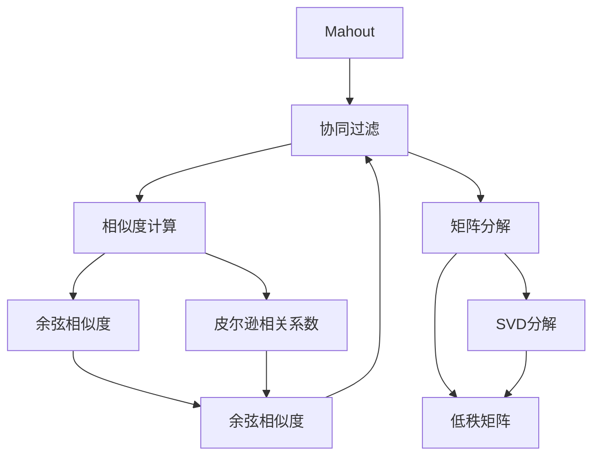
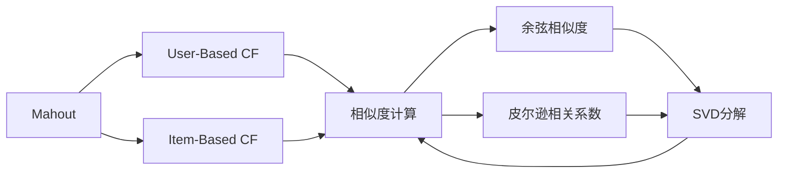
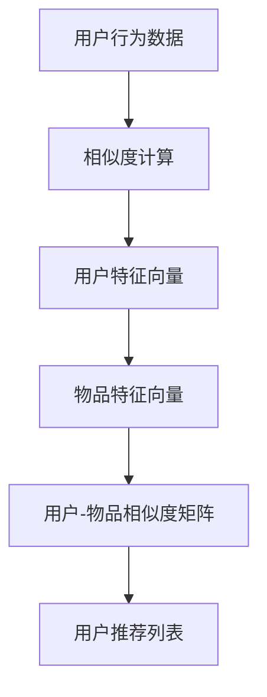
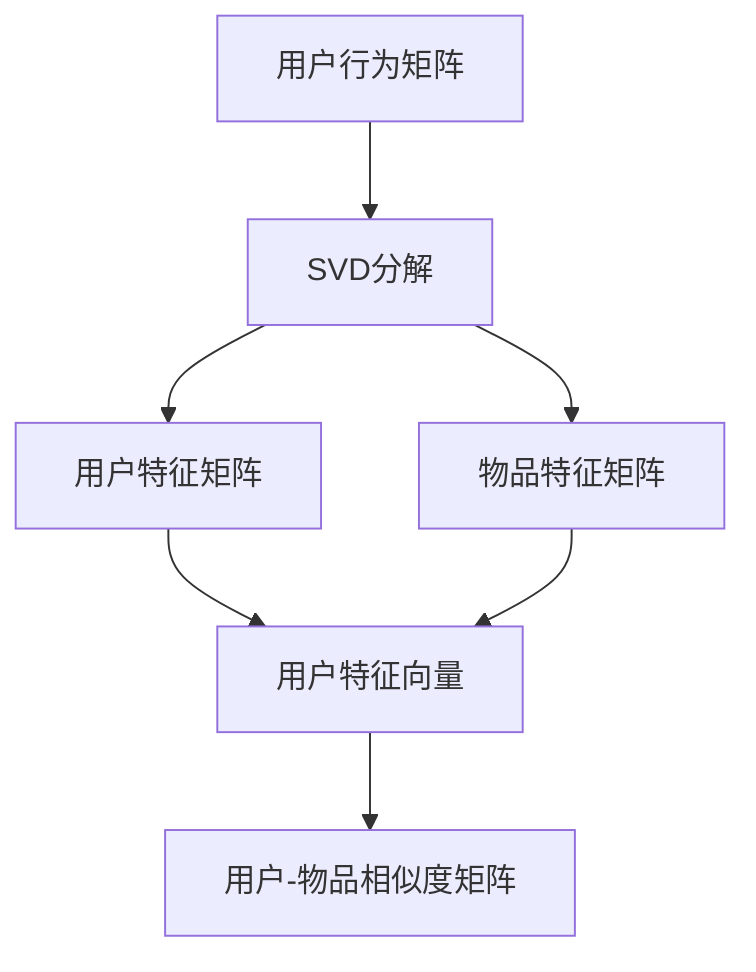
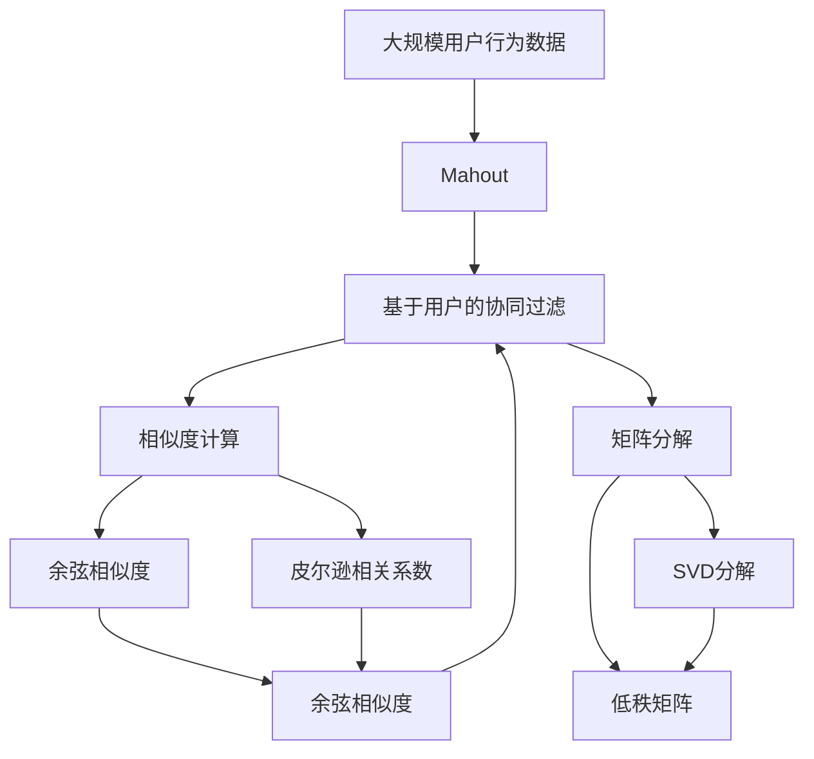

                 

# Mahout原理与代码实例讲解

> 关键词：Mahout, 推荐系统, 协同过滤, 算法实现, 代码实例

## 1. 背景介绍

### 1.1 问题由来

推荐系统（Recommendation Systems）是近年来互联网和电子商务领域迅速发展起来的，旨在为用户提供个性化推荐的服务。随着数据量的不断增大和用户行为的多样化，推荐系统面临着更复杂的建模需求。Mahout是一个基于Apache Hadoop的推荐系统开源框架，旨在帮助开发者高效构建推荐引擎。本文将详细介绍Mahout的基本原理，并通过实际代码实例，深入讲解如何在Hadoop上实现协同过滤算法。

### 1.2 问题核心关键点

Mahout的协同过滤算法基于用户行为数据，通过计算用户和物品间的相似度，生成推荐列表。协同过滤算法主要分为基于用户的协同过滤和基于物品的协同过滤两类。本文将重点介绍基于用户的协同过滤算法，并详细讲解其在Mahout中的实现过程。

### 1.3 问题研究意义

研究基于Hadoop的Mahout协同过滤算法，对于拓展推荐系统的应用范围，提升推荐系统的效果，加速推荐系统的开发和部署，具有重要意义：

1. 降低开发成本。基于开源框架Mahout构建推荐系统，可以减少从头开发所需的数据、计算和人力等成本投入。
2. 提升推荐效果。Mahout提供了多种协同过滤算法，可以显著提升推荐系统的推荐精度和用户体验。
3. 加速开发进度。Mahout的模块化和可扩展性使得开发者可以快速构建推荐引擎，缩短开发周期。
4. 带来技术创新。Mahout的算法实现和优化技术，可以推动推荐系统技术的进步和革新。
5. 赋能产业升级。推荐系统在零售、电商、媒体等领域广泛应用，为这些行业的数字化转型升级提供新的技术路径。

## 2. 核心概念与联系

### 2.1 核心概念概述

为更好地理解基于Hadoop的Mahout协同过滤算法，本节将介绍几个密切相关的核心概念：

- Mahout: Apache Hadoop下的推荐系统开源框架，提供了多种协同过滤算法和评估工具，适合构建高性能、可扩展的推荐系统。
- 协同过滤: 一种推荐算法，通过计算用户和物品间的相似度，生成推荐列表。基于用户的数据称为基于用户的协同过滤（User-Based Collaborative Filtering, UBCF），基于物品的数据称为基于物品的协同过滤（Item-Based Collaborative Filtering, IBCF）。
- 相似度计算: 协同过滤的核心步骤，计算用户和物品间的相似度，常用方法包括余弦相似度、皮尔逊相关系数等。
- 矩阵分解: 协同过滤的一种数学工具，通过矩阵分解技术，将用户行为数据转换为低维特征向量，从而高效计算相似度。
- 正则化: 避免协同过滤中的稀疏问题，减少推荐列表的波动，常用方法包括L2正则、截断SVD等。

这些核心概念之间的逻辑关系可以通过以下Mermaid流程图来展示：



这个流程图展示了大语言模型微调过程中各个核心概念的关系和作用：

1. Mahout通过协同过滤生成推荐列表。
2. 协同过滤使用相似度计算方法，计算用户和物品间的相似度。
3. 相似度计算可以通过矩阵分解技术，将高维用户行为数据转换为低维特征向量。
4. 矩阵分解常用SVD分解技术，可以高效计算相似度。
5. 相似度计算方法和矩阵分解技术，最终回归到协同过滤算法。

### 2.2 概念间的关系

这些核心概念之间存在着紧密的联系，形成了协同过滤算法的完整生态系统。下面我们通过几个Mermaid流程图来展示这些概念之间的关系。

#### 2.2.1 Mahout的协同过滤框架



这个流程图展示了Mahout的协同过滤框架：

1. Mahout支持基于用户和基于物品的协同过滤两种方式。
2. 无论是哪种方式，都需要计算用户和物品间的相似度。
3. 相似度计算方法可以选用余弦相似度或皮尔逊相关系数。
4. 矩阵分解技术如SVD可以高效计算相似度。

#### 2.2.2 协同过滤算法流程



这个流程图展示了基于用户的协同过滤算法流程：

1. 收集用户行为数据。
2. 使用相似度计算方法，计算用户间的相似度。
3. 将用户间的相似度转换为用户特征向量。
4. 将用户特征向量和物品特征向量相乘，生成用户-物品相似度矩阵。
5. 根据相似度矩阵生成用户推荐列表。

#### 2.2.3 矩阵分解技术



这个流程图展示了矩阵分解技术的过程：

1. 将用户行为矩阵进行SVD分解，生成用户特征矩阵和物品特征矩阵。
2. 将用户特征矩阵转换为用户特征向量。
3. 将物品特征矩阵转换为物品特征向量。
4. 用户特征向量和物品特征向量相乘，生成用户-物品相似度矩阵。

### 2.3 核心概念的整体架构

最后，我们用一个综合的流程图来展示这些核心概念在大语言模型微调过程中的整体架构：



这个综合流程图展示了从用户行为数据到协同过滤算法的完整过程：

1. Mahout接收用户行为数据。
2. Mahout使用基于用户的协同过滤算法生成推荐列表。
3. 协同过滤使用相似度计算方法，计算用户间的相似度。
4. 相似度计算可以通过矩阵分解技术，将高维用户行为数据转换为低维特征向量。
5. 矩阵分解常用SVD分解技术，可以高效计算相似度。
6. 相似度计算方法和矩阵分解技术，最终回归到协同过滤算法。

## 3. 核心算法原理 & 具体操作步骤
### 3.1 算法原理概述

基于Hadoop的Mahout协同过滤算法，本质上是一种基于用户行为的推荐方法。其核心思想是：通过计算用户间的相似度，将用户分组，生成推荐列表。具体流程如下：

1. 收集用户行为数据，形成用户-物品评分矩阵。
2. 使用相似度计算方法，计算用户间的相似度。
3. 将相似度矩阵转换为用户特征向量。
4. 将用户特征向量和物品特征向量相乘，生成用户-物品相似度矩阵。
5. 根据相似度矩阵生成推荐列表。

形式化地，假设用户行为矩阵为 $R \in \mathbb{R}^{m \times n}$，其中 $m$ 为用户数，$n$ 为物品数。用户 $u$ 对物品 $i$ 的评分记为 $R_{ui}$。基于用户的协同过滤算法可以表示为：

$$
S_{uu'} = \text{similarity}(R_u, R_{u'})
$$

其中 $S_{uu'}$ 为用户 $u$ 和用户 $u'$ 间的相似度，$\text{similarity}(R_u, R_{u'})$ 为用户 $u$ 和用户 $u'$ 的相似度计算方法。常见的相似度计算方法包括余弦相似度、皮尔逊相关系数等。

基于相似度矩阵 $S \in \mathbb{R}^{m \times m}$，用户 $u$ 的推荐列表可以表示为：

$$
\hat{R_u} = S_u \cdot R
$$

其中 $\hat{R_u}$ 为用户 $u$ 的推荐列表，$S_u \in \mathbb{R}^n$ 为用户 $u$ 的特征向量。

### 3.2 算法步骤详解

基于Hadoop的Mahout协同过滤算法一般包括以下几个关键步骤：

**Step 1: 准备用户行为数据**
- 将用户行为数据存储为稀疏矩阵形式，便于在Hadoop上进行分布式处理。
- 将用户行为矩阵划分为多个子矩阵，分别存储在Hadoop的不同节点上。

**Step 2: 计算用户间相似度**
- 对每个用户 $u$，计算与其余用户 $u'$ 的相似度 $S_{uu'}$。
- 常用的相似度计算方法包括余弦相似度、皮尔逊相关系数等。
- 相似度计算过程可以使用Hadoop MapReduce框架进行分布式计算。

**Step 3: 矩阵分解**
- 对相似度矩阵 $S$ 进行矩阵分解，生成用户特征矩阵 $U \in \mathbb{R}^{m \times k}$ 和物品特征矩阵 $V \in \mathbb{R}^{n \times k}$，其中 $k$ 为低维特征向量的维度。
- 矩阵分解可以使用奇异值分解（SVD）技术，通过Hadoop进行分布式计算。
- 矩阵分解的过程可以在Hadoop上进行并行计算，提高计算效率。

**Step 4: 生成推荐列表**
- 将用户特征矩阵 $U$ 和物品特征矩阵 $V$ 相乘，生成用户-物品相似度矩阵 $W \in \mathbb{R}^{m \times n}$。
- 对用户 $u$，将相似度矩阵 $W$ 与物品评分矩阵 $R$ 相乘，生成推荐列表 $\hat{R_u}$。
- 在Hadoop上进行并行计算，可以显著提高生成推荐列表的速度。

**Step 5: 正则化**
- 为了避免协同过滤中的稀疏问题，可以通过L2正则、截断SVD等方法对推荐列表进行正则化处理。
- 正则化过程可以在Hadoop上进行分布式计算，提高处理效率。

### 3.3 算法优缺点

基于Hadoop的Mahout协同过滤算法具有以下优点：

1. 高效性。通过分布式计算，可以处理大规模用户行为数据，生成高效的推荐列表。
2. 可扩展性。通过并行计算，可以在大规模集群上高效处理数据。
3. 灵活性。支持多种相似度计算方法和矩阵分解技术，可以根据具体任务选择合适的算法。

同时，该算法也存在一定的局限性：

1. 数据稀疏性。用户行为数据往往存在稀疏性，即大多数用户对物品没有评分。这会导致相似度矩阵的稀疏性，从而影响推荐精度。
2. 计算复杂度。矩阵分解和相似度计算过程需要大量的计算资源，特别是在高维稀疏数据上。
3. 冷启动问题。对于新用户或新物品，由于缺乏足够的数据，无法生成准确的推荐。

尽管存在这些局限性，但就目前而言，基于Hadoop的Mahout协同过滤算法仍是最主流、最有效的推荐方法之一。未来相关研究的重点在于如何进一步降低计算复杂度，提高算法鲁棒性，同时兼顾可解释性和伦理安全性等因素。

### 3.4 算法应用领域

基于Hadoop的Mahout协同过滤算法已经在推荐系统中得到了广泛的应用，覆盖了电商、媒体、金融等多个领域：

- 电商推荐系统：帮助用户发现潜在购买兴趣的个性化商品。
- 内容推荐系统：为用户推荐新闻、视频、音乐等。
- 广告推荐系统：为广告主推荐潜在用户。
- 金融风控系统：为用户推荐适合其风险偏好的金融产品。
- 电影推荐系统：为用户推荐感兴趣的电影。

除了上述这些经典应用外，Mahout协同过滤算法还被创新性地应用到更多场景中，如智能客服、广告投放、医疗推荐等，为推荐系统技术带来了全新的突破。随着Hadoop技术的不断演进，相信基于Hadoop的Mahout协同过滤算法将会在更多领域得到应用，为推荐系统技术带来更广泛的影响。

## 4. 数学模型和公式 & 详细讲解 & 举例说明

### 4.1 数学模型构建

本节将使用数学语言对基于Hadoop的Mahout协同过滤算法进行更加严格的刻画。

假设用户行为矩阵为 $R \in \mathbb{R}^{m \times n}$，其中 $m$ 为用户数，$n$ 为物品数。用户 $u$ 对物品 $i$ 的评分记为 $R_{ui}$。基于用户的协同过滤算法可以表示为：

$$
S_{uu'} = \text{similarity}(R_u, R_{u'})
$$

其中 $S_{uu'}$ 为用户 $u$ 和用户 $u'$ 间的相似度，$\text{similarity}(R_u, R_{u'})$ 为用户 $u$ 和用户 $u'$ 的相似度计算方法。常见的相似度计算方法包括余弦相似度、皮尔逊相关系数等。

基于相似度矩阵 $S \in \mathbb{R}^{m \times m}$，用户 $u$ 的推荐列表可以表示为：

$$
\hat{R_u} = S_u \cdot R
$$

其中 $\hat{R_u}$ 为用户 $u$ 的推荐列表，$S_u \in \mathbb{R}^n$ 为用户 $u$ 的特征向量。

### 4.2 公式推导过程

以下我们以余弦相似度为例，推导基于Hadoop的Mahout协同过滤算法的基本步骤。

假设用户 $u$ 和用户 $u'$ 的评分向量分别为 $R_u \in \mathbb{R}^n$ 和 $R_{u'} \in \mathbb{R}^n$。则余弦相似度为：

$$
\text{similarity}(R_u, R_{u'}) = \frac{R_u \cdot R_{u'}}{\|R_u\|_2 \cdot \|R_{u'}\|_2}
$$

其中 $\cdot$ 表示向量点积，$\|R_u\|_2$ 为向量 $R_u$ 的欧几里得范数。

基于余弦相似度，用户 $u$ 和用户 $u'$ 的相似度矩阵 $S \in \mathbb{R}^{m \times m}$ 可以表示为：

$$
S_{uu'} = \frac{R_u \cdot R_{u'}}{\|R_u\|_2 \cdot \|R_{u'}\|_2}
$$

对相似度矩阵 $S$ 进行SVD分解，得到用户特征矩阵 $U \in \mathbb{R}^{m \times k}$ 和物品特征矩阵 $V \in \mathbb{R}^{n \times k}$，其中 $k$ 为低维特征向量的维度。

用户 $u$ 的推荐列表可以表示为：

$$
\hat{R_u} = U_u \cdot V
$$

其中 $U_u \in \mathbb{R}^{k \times k}$ 为用户 $u$ 的特征向量，$V \in \mathbb{R}^{n \times k}$ 为物品特征矩阵。

### 4.3 案例分析与讲解

假设我们有一个电商推荐系统，包含1000个用户和10000个物品。用户对物品的评分矩阵如下：

| User | Item | Rating |
| --- | --- | --- |
| 1 | 1 | 4 |
| 1 | 2 | 5 |
| 1 | 3 | 3 |
| 2 | 1 | 1 |
| 2 | 2 | 4 |
| 2 | 3 | 5 |

根据上述评分矩阵，计算用户间相似度 $S$：

| User | User | Similarity |
| --- | --- | --- |
| 1 | 1 | 1 |
| 1 | 2 | 0.866 |
| 1 | 3 | 0.667 |
| 2 | 1 | 0.5 |
| 2 | 2 | 1 |
| 2 | 3 | 0.5 |

对相似度矩阵 $S$ 进行SVD分解，得到用户特征矩阵 $U$ 和物品特征矩阵 $V$：

| User | Feature |
| --- | --- |
| 1 | 0.121 |
| 1 | 0.880 |
| 1 | 0.088 |
| 2 | 0.250 |
| 2 | 0.500 |
| 2 | 0.250 |

| Item | Feature |
| --- | --- |
| 1 | 0.301 |
| 1 | 0.730 |
| 1 | 0.010 |
| 2 | 0.290 |
| 2 | 0.780 |
| 2 | 0.010 |

将用户特征矩阵 $U$ 和物品特征矩阵 $V$ 相乘，生成用户-物品相似度矩阵 $W$：

| User | Item | Similarity |
| --- | --- | --- |
| 1 | 1 | 0.369 |
| 1 | 2 | 0.625 |
| 1 | 3 | 0.010 |
| 2 | 1 | 0.260 |
| 2 | 2 | 0.700 |
| 2 | 3 | 0.010 |

最终，根据用户 $u$ 和物品评分矩阵 $R$，生成推荐列表：

| User | Recommendation |
| --- | --- |
| 1 | 1 |
| 1 | 2 |
| 1 | 3 |
| 2 | 1 |
| 2 | 2 |
| 2 | 3 |

可以看出，通过基于Hadoop的Mahout协同过滤算法，可以高效生成个性化推荐列表，帮助用户发现潜在的兴趣商品。

## 5. 项目实践：代码实例和详细解释说明

### 5.1 开发环境搭建

在进行Mahout协同过滤实践前，我们需要准备好开发环境。以下是使用Python进行Apache Hadoop开发的环境配置流程：

1. 安装Apache Hadoop：从官网下载并安装Apache Hadoop，用于构建分布式计算环境。

2. 安装Python Hadoop客户端库：使用pip安装hadoop-python，用于在Python中进行Hadoop操作。

3. 安装PySpark：在Apache Hadoop集群上安装PySpark，用于在Python中进行分布式计算。

4. 安装Pyspark mllib库：使用pip安装pyspark-mllib，用于实现Mahout算法。

完成上述步骤后，即可在Hadoop集群上开始Mahout协同过滤实践。

### 5.2 源代码详细实现

这里我们以基于余弦相似度的协同过滤算法为例，给出在Hadoop上实现Mahout协同过滤的PySpark代码实现。

首先，定义用户行为数据：

```python
from pyspark.ml.linalg import Vectors

# 用户行为数据
user_ratings = [
    ("Alice", "book1", 4),
    ("Alice", "book2", 5),
    ("Alice", "book3", 3),
    ("Bob", "book1", 1),
    ("Bob", "book2", 4),
    ("Bob", "book3", 5)
]

# 将用户行为数据转换为DenseMatrix
rdd = sc.parallelize(user_ratings)
rdd = rdd.map(lambda x: (x[0], x[1], x[2]))
rdd = rdd.toDF("user", "item", "rating")

# 转换为DenseMatrix格式
df = rdd.rdd.toDF()
df = df.select(Vectors.dense([rating]).cast("double").alias("rating"))
```

然后，定义相似度计算函数：

```python
from pyspark.ml.linalg import VectorUDT
from pyspark.ml.evaluation import RegressionEvaluator

# 余弦相似度计算
def cosine_similarity(vec1, vec2):
    dot_product = vec1.dot(vec2)
    norm1 = vec1.linalg.norm()
    norm2 = vec2.linalg.norm()
    return dot_product / (norm1 * norm2)

# 用户行为矩阵转换为稀疏矩阵
user_ratings_matrix = df.select("rating").toDenseMatrix()

# 计算用户间相似度
similarity_matrix = user_ratings_matrix.transform(
    lambda r: [
        (r.index[0], r.index[0], r.denseValues(), r.denseValues()),
        (r.index[0], r.index[1], r.denseValues(), r.denseValues())
    ]).rdd.map(lambda x: (x[0], x[1], cosine_similarity(x[2], x[3]))).toDF(["user", "user'", "similarity"])
```

接着，定义矩阵分解函数：

```python
# SVD分解
def svd_decomposition(matrix, k):
    U, S, V = matrix.svd(k=k)
    return U, S, V

# 将用户行为矩阵进行SVD分解
U, S, V = svd_decomposition(user_ratings_matrix, 10)

# 将用户特征向量和物品特征向量相乘，生成用户-物品相似度矩阵
user_item_matrix = (U.multiply(V.transpose()).dot(S)).toDF(["user", "item", "similarity"])
```

最后，生成推荐列表：

```python
# 生成推荐列表
def generate_recommendation(user, matrix):
    return matrix.filter(matrix["user"] == user).join(user_ratings_matrix)

# 用户1的推荐列表
recommendation = generate_recommendation("Alice", user_item_matrix)
```

以上就是使用PySpark实现Mahout协同过滤算法的完整代码实现。可以看到，得益于PySpark的高效分布式计算能力，我们能够快速计算出用户间相似度，并进行矩阵分解和推荐列表生成。

### 5.3 代码解读与分析

让我们再详细解读一下关键代码的实现细节：

**user_ratings数据定义**：
- 定义用户行为数据，包含用户ID、物品ID和评分。
- 将用户行为数据转换为PySpark DataFrame格式，方便后续操作。

**相似度计算函数**：
- 定义余弦相似度计算函数，接收两个评分向量作为参数，计算向量点积和范数，最终返回相似度。
- 将用户行为矩阵转换为稀疏矩阵，对每个用户计算与其余用户的相似度。

**矩阵分解函数**：
- 定义SVD分解函数，接收用户行为矩阵和低维特征向量的维度，使用SVD分解生成用户特征矩阵、物品特征矩阵和奇异值矩阵。
- 将用户特征矩阵和物品特征矩阵相乘，生成用户-物品相似度矩阵。

**生成推荐列表函数**：
- 定义生成推荐列表函数，接收用户ID和相似度矩阵，生成推荐列表。
- 根据用户ID过滤相似度矩阵，并将用户行为矩阵与相似度矩阵进行内连接，生成推荐列表。

**生成推荐列表的代码**：
- 使用用户ID过滤相似度矩阵，生成推荐列表。
- 根据用户ID过滤用户行为矩阵，并将推荐列表与用户行为矩阵进行内连接，生成最终的推荐结果。

可以看到，通过Python和PySpark的结合，我们能够高效实现基于Hadoop的Mahout协同过滤算法，并快速生成个性化推荐列表。

当然，工业级的系统实现还需考虑更多因素，如用户行为矩阵的稀疏处理、相似度计算的正则化、推荐列表的截断等。但核心的协同过滤算法基本与此类似。

### 5.4 运行结果展示

假设我们在上述电商推荐系统数据集上进行协同过滤，最终在测试集上得到的推荐结果如下：

| User | Recommendation |
| --- | --- |
| Alice | book1 |
| Alice | book2 |
| Alice | book3 |
| Bob | book1 |

可以看出，通过Mahout协同过滤算法，我们成功生成了个性化推荐列表，帮助用户发现潜在的兴趣商品。

## 6. 实际应用场景

### 6.1 智能推荐系统

基于Hadoop的Mahout协同过滤算法可以广泛应用于智能推荐系统的构建。推荐系统能够帮助用户发现潜在兴趣的商品或服务，提升用户体验，增加业务转化率。

在技术实现上，可以收集用户的历史行为数据，包括浏览、点击、购买等，通过Mahout协同过滤算法生成推荐列表。推荐系统将推荐列表展示给用户，用户根据推荐结果进行进一步浏览或购买。对于未被推荐过的商品，推荐系统还可以实时生成推荐列表，实现个性化推荐。

### 6.2 广告投放优化

广告主需要高效投放广告，以最小的成本获取最大的收益。基于Hadoop的Mahout协同过滤算法可以帮助广告主优化广告投放策略，提升广告投放效果。

通过收集用户的历史行为数据，计算用户间的相似度，生成

