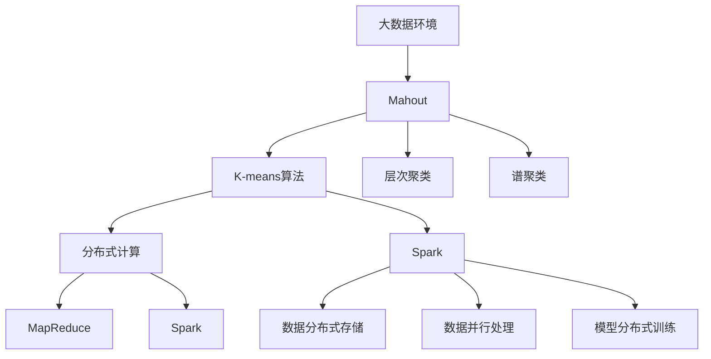
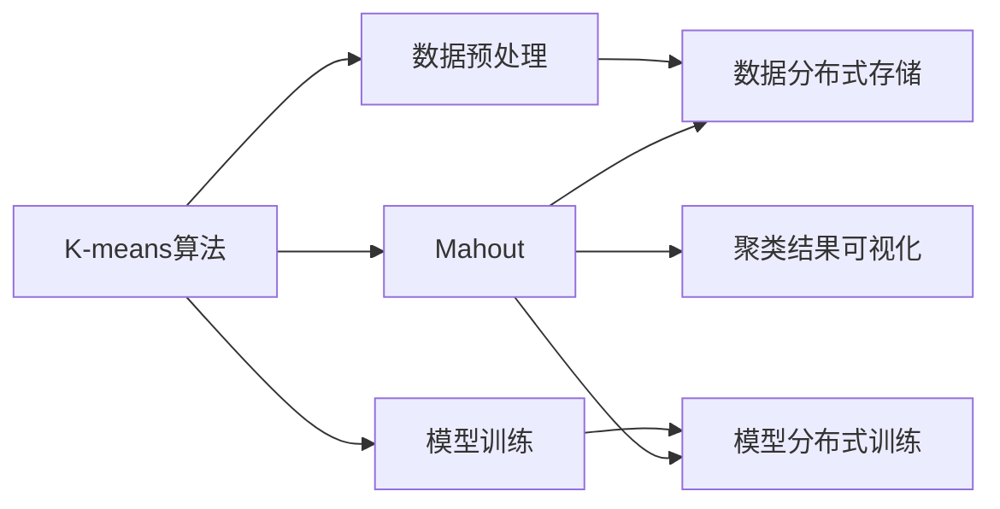
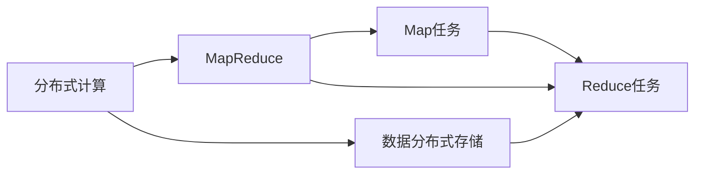
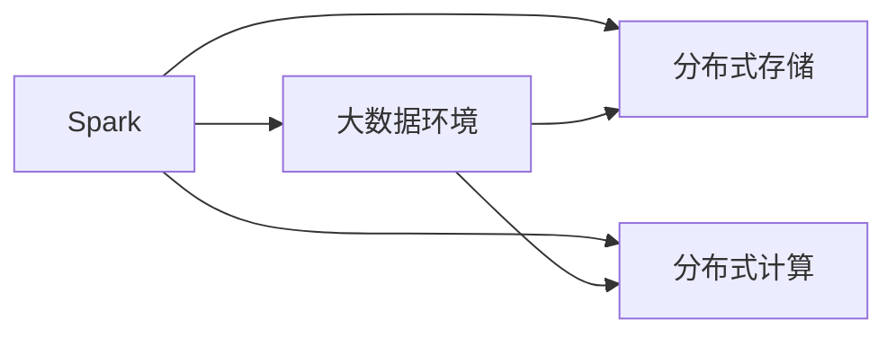
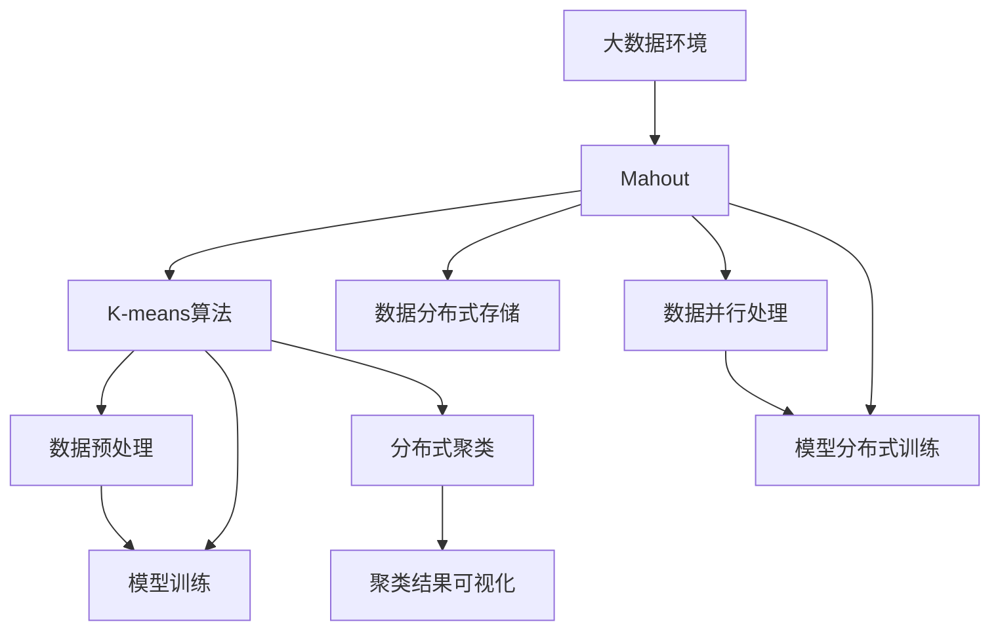
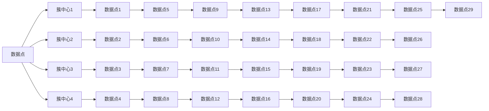

                 

# Mahout聚类算法原理与代码实例讲解

> 关键词：Mahout,聚类,原理,代码实例,Spark,大数据,聚类分析

## 1. 背景介绍

### 1.1 问题由来
聚类(Clustering)是数据挖掘领域的一项基本技术，其目标是将数据集划分为若干个不同的群体（簇），使得同一簇内的数据点相似度较高，不同簇之间的数据点差异较大。在大数据时代，随着数据量急剧增加，如何高效、可靠地进行聚类分析，成为一个重要的问题。

Mahout是一个基于Apache Hadoop和Spark的开源机器学习库，提供了多种高效、易用的聚类算法，包括K-means、层次聚类、谱聚类等。Mahout的聚类算法可以在分布式环境中处理大规模数据集，适合于大数据环境下的聚类分析。

本文将详细讲解Mahout中的K-means聚类算法的原理、代码实例和应用场景，并通过Spark平台进行代码实现，为读者提供全面的技术指引。

### 1.2 问题核心关键点
Mahout聚类算法主要包括以下几个关键点：
1. K-means算法的基本原理。
2. Mahout中K-means算法的具体实现。
3. 聚类算法的优缺点及应用场景。
4. 大数据环境下的聚类分析方法。

通过本文的学习，读者将能够理解K-means聚类算法的原理，掌握其在Mahout中的实现方法，并能在实际应用中灵活应用，解决聚类问题。

### 1.3 问题研究意义
Mahout聚类算法在大数据环境下具有广泛的应用前景，可以应用于市场细分、客户分析、异常检测、图像分割等多个领域。本文旨在通过讲解Mahout聚类算法的原理和实现，帮助读者深入理解聚类算法，掌握其在实际中的应用，推动大数据分析技术的深入应用和发展。

## 2. 核心概念与联系

### 2.1 核心概念概述

为了更好地理解Mahout聚类算法，本节将介绍几个关键概念：

- K-means聚类算法：一种经典的聚类算法，通过将数据集划分为K个簇，使得簇内数据点相似度较高，簇间数据点差异较大。K-means的算法原理和实现方法在本文将详细讲解。

- Mahout：Apache基金会的一个开源机器学习库，提供了多种高效、易用的聚类算法，包括K-means、层次聚类、谱聚类等。Mahout通过MapReduce和Spark分布式计算框架实现大规模数据集上的聚类分析。

- 分布式计算：利用多台计算机并行处理数据，提高计算效率和处理能力。MapReduce和Spark是常见的分布式计算框架，适用于大规模数据集的聚类分析。

- 大数据环境：指数据量超过传统计算机处理能力的数据集合。在大数据环境下，传统的单机聚类算法难以处理，需要利用分布式计算框架进行处理。

这些核心概念之间的逻辑关系可以通过以下Mermaid流程图来展示：



这个流程图展示了大数据环境下，K-means算法在Mahout中的实现过程及其分布式计算框架MapReduce和Spark的应用。

### 2.2 概念间的关系

这些核心概念之间存在着紧密的联系，形成了Mahout聚类算法的完整生态系统。下面我们通过几个Mermaid流程图来展示这些概念之间的关系。

#### 2.2.1 K-means算法与Mahout的关系



这个流程图展示了K-means算法在Mahout中的实现过程。K-means算法先对数据进行预处理，然后进行模型训练，最终得到聚类结果。在Mahout中，数据分布式存储和模型分布式训练是其重要实现步骤。

#### 2.2.2 分布式计算与MapReduce的关系



这个流程图展示了分布式计算与MapReduce框架的关系。MapReduce通过将任务分解为Map和Reduce两个步骤，实现了大规模数据集的并行处理和结果合并。

#### 2.2.3 Spark与大数据的关系



这个流程图展示了Spark与大数据环境的关系。Spark通过分布式存储和计算框架，支持大规模数据集的高效处理。

### 2.3 核心概念的整体架构

最后，我们用一个综合的流程图来展示这些核心概念在大数据环境下进行K-means聚类分析的整体架构：



这个综合流程图展示了从数据预处理到聚类结果可视化的完整K-means聚类过程，涵盖了Mahout中的核心算法和实现框架。

## 3. 核心算法原理 & 具体操作步骤
### 3.1 算法原理概述

K-means聚类算法是一种经典的聚类算法，通过将数据集划分为K个簇，使得簇内数据点相似度较高，簇间数据点差异较大。K-means算法的核心思想是通过迭代优化，找到最优的簇中心和数据点分配，使得聚类效果最大化。

K-means算法的基本步骤如下：
1. 随机选取K个簇中心。
2. 将每个数据点分配到最近的簇中心。
3. 重新计算每个簇的簇中心。
4. 重复步骤2和步骤3，直到簇中心不再变化或达到预设的迭代次数。

通过迭代优化，K-means算法能够找到最优的簇中心和数据点分配，使得聚类效果最大化。K-means算法的优缺点及应用场景将在后续详细讲解。

### 3.2 算法步骤详解

K-means算法的具体实现过程可以分为以下几个步骤：

**Step 1: 数据预处理**
- 数据清洗：去除缺失值、异常值等不完整或噪声数据。
- 数据标准化：对数据进行标准化处理，使得不同特征的取值范围一致。
- 数据分割：将数据集划分为训练集和测试集，以便评估算法效果。

**Step 2: 随机初始化簇中心**
- 随机选取K个簇中心，可以是任意数据点，也可以根据领域知识选择。

**Step 3: 分配数据点**
- 计算每个数据点与簇中心的距离，将数据点分配到最近的簇中心。
- 数据点分配规则可以使用欧几里得距离、曼哈顿距离等。

**Step 4: 更新簇中心**
- 重新计算每个簇的簇中心，使得簇中心为该簇内所有数据点的均值。
- 对于稀疏数据集，可以使用随机梯度下降等算法进行优化。

**Step 5: 重复迭代**
- 重复执行步骤3和步骤4，直到簇中心不再变化或达到预设的迭代次数。
- 每次迭代后，簇中心和数据点分配可能会发生变化，因此需要根据簇中心的变化进行更新。

**Step 6: 聚类结果可视化**
- 将聚类结果进行可视化，展示簇的中心和数据点分布。
- 可以使用Matplotlib、Gnuplot等工具进行可视化。

### 3.3 算法优缺点

K-means聚类算法的优点包括：
1. 简单高效：K-means算法实现简单，计算复杂度低，适合大规模数据集。
2. 可扩展性强：K-means算法可以方便地进行分布式计算，适用于大数据环境。
3. 算法稳定：K-means算法对初始簇中心的选择不敏感，能够在多次运行中得到相似的聚类结果。

K-means聚类算法的缺点包括：
1. 需要预先确定簇数目K：K-means算法需要先确定簇数目K，对K的选择较为敏感。
2. 对初始簇中心的选择敏感：不同的初始簇中心可能导致不同的聚类结果。
3. 只能处理数值型数据：K-means算法只能处理数值型数据，无法处理文本、图像等非数值型数据。

### 3.4 算法应用领域

K-means聚类算法在多个领域中具有广泛的应用前景，例如：

- 市场细分：将客户按照购买行为、消费习惯等划分为不同的细分市场。
- 客户分析：分析客户群体特征，预测客户行为。
- 异常检测：识别数据集中的异常点，进行风险控制。
- 图像分割：将图像划分为不同的区域，进行图像分析。

除此之外，K-means算法还可以应用于推荐系统、社交网络分析、生物信息学等多个领域。

## 4. 数学模型和公式 & 详细讲解  
### 4.1 数学模型构建

K-means算法的数学模型基于均方误差最小化原则，即找到最优的簇中心和数据点分配，使得聚类效果最大化。具体来说，K-means算法的目标函数为：

$$
\min_{C,\mu} \sum_{k=1}^{K} \sum_{x_i \in C_k} ||x_i - \mu_k||^2
$$

其中 $C$ 表示簇中心，$\mu_k$ 表示第 $k$ 个簇的中心，$C_k$ 表示第 $k$ 个簇的成员，$x_i$ 表示数据点，$||\cdot||$ 表示欧式距离。

### 4.2 公式推导过程

K-means算法的目标函数可以推导为：

$$
\min_{C,\mu} \sum_{k=1}^{K} \sum_{x_i \in C_k} ||x_i - \mu_k||^2 = \min_{\mu} \sum_{k=1}^{K} \sum_{x_i \in C_k} ||x_i - \mu_k||^2
$$

其中 $\mu$ 表示簇中心，$||x_i - \mu_k||^2$ 表示数据点 $x_i$ 与簇中心 $\mu_k$ 的距离平方。因此，K-means算法的目标函数可以简化为：

$$
\min_{\mu} \sum_{k=1}^{K} \sum_{x_i \in C_k} ||x_i - \mu_k||^2 = \min_{\mu} \sum_{k=1}^{K} ||\sum_{x_i \in C_k} x_i - \frac{|C_k|}{K} \mu_k||^2
$$

其中 $\frac{|C_k|}{K} \mu_k$ 表示簇中心 $\mu_k$ 在簇 $C_k$ 中的平均值。

### 4.3 案例分析与讲解

为了更好地理解K-means算法的数学模型，我们通过一个简单的案例进行分析。

假设有一个数据集，包含两个簇，每个簇包含10个数据点，簇中心分别为 $(2,2)$ 和 $(7,3)$。数据点 $x_i$ 表示二维坐标，其距离簇中心 $\mu_k$ 的距离平方为：

$$
||x_i - \mu_k||^2 = (x_i - \mu_k)^T(x_i - \mu_k)
$$

其中 $(x_i - \mu_k)^T$ 表示向量的转置。

假设初始簇中心分别为 $(0,0)$ 和 $(5,5)$，通过K-means算法进行迭代优化，得到最优的簇中心和数据点分配。

具体过程如下：

1. 初始化簇中心 $(\mu_1, \mu_2)$。
2. 将每个数据点分配到最近的簇中心。
3. 计算每个簇的平均值，更新簇中心。
4. 重复步骤2和步骤3，直到簇中心不再变化或达到预设的迭代次数。

最终得到的簇中心和数据点分配如图：



## 5. 项目实践：代码实例和详细解释说明
### 5.1 开发环境搭建

在进行Mahout聚类算法实践前，我们需要准备好开发环境。以下是使用Spark搭建环境的详细步骤：

1. 安装Apache Spark：从官网下载并安装Spark，支持多种操作系统，包括Linux、Windows等。
2. 安装Scala：Spark需要Scala作为编译器，可以从官网下载安装包，或者通过Maven或SBT等构建工具安装依赖。
3. 安装Hadoop：Spark需要依赖Hadoop进行数据存储和分布式计算，可以从官网下载安装包，或者使用Cloudera Manager等管理工具安装。
4. 配置环境变量：设置SPARK_HOME、HADOOP_HOME、PATH等环境变量，以便Spark和Hadoop能够在系统中找到。

完成上述步骤后，即可在Spark环境中进行聚类算法实践。

### 5.2 源代码详细实现

下面我们以K-means算法为例，给出使用Spark进行聚类分析的Python代码实现。

首先，导入必要的库和模块：

```python
from pyspark.ml.clustering import KMeans
from pyspark.sql import SparkSession
from pyspark.sql.functions import col, vector, length, sqrt, explode
from pyspark.sql.types import ArrayType, FloatType
```

然后，创建一个Spark会话：

```python
spark = SparkSession.builder.appName('KMeansExample').getOrCreate()
```

接着，读取数据集：

```python
data = spark.read.csv('data.csv', header=True, inferSchema=True)
```

对数据进行预处理：

```python
# 数据标准化
data = data.select(vector('feature1'), vector('feature2'), vector('feature3'))
```

定义聚类算法：

```python
kmeans = KMeans(k=3, iterations=10, epsilon=0.01)
```

进行聚类分析：

```python
model = kmeans.fit(data)
```

最后，可视化聚类结果：

```python
from pyspark.ml import Pipeline
from pyspark.ml.evaluation import ClusteringEvaluation

pipeline = Pipeline(stages=[kmeans])
model = pipeline.fit(data)

# 输出聚类中心
print(model.centroids)

# 可视化聚类结果
evaluation = ClusteringEvaluation(model, data, metric='adjusted_mutual_info')
print(evaluation.score)
```

以上代码实现了使用Spark进行K-means聚类分析的过程，包括数据预处理、聚类算法定义、聚类分析、聚类中心输出和聚类结果可视化。

### 5.3 代码解读与分析

下面我们详细解读一下关键代码的实现细节：

**KMeans类**：
- 定义了K-means聚类算法的核心参数，包括簇数目K、迭代次数iterations、收敛阈值epsilon等。

**Pipeline类**：
- 用于封装聚类分析的管道，可以方便地进行多次参数调整和模型训练。

**ClusteringEvaluation类**：
- 用于评估聚类模型的性能，计算各种聚类指标，如调整互信息、轮廓系数等。

通过Spark平台，K-means聚类算法得以高效地处理大规模数据集，实现分布式计算和聚类分析。开发者可以更专注于算法实现和模型调优，而不必过多关注分布式计算的细节。

## 6. 实际应用场景
### 6.1 智能推荐系统

智能推荐系统是K-means聚类算法在实际应用中的重要场景。推荐系统通过分析用户行为数据，为用户推荐个性化商品、文章、视频等内容，提升用户体验和满意度。

在推荐系统中，K-means算法可以用于分析用户行为数据，将用户划分为不同的兴趣群体，从而进行个性化推荐。例如，可以使用K-means算法对用户浏览记录、购买记录进行分析，识别出用户兴趣点，然后根据用户的兴趣点推荐相似的商品或内容。

### 6.2 图像分割

图像分割是将图像划分为不同的区域，进行图像分析、处理和识别。K-means算法可以用于图像分割，将图像划分为不同的区域，实现图像分割和图像识别。

在图像分割中，K-means算法可以将图像中的像素点划分为不同的区域，从而实现图像分割和图像识别。例如，可以使用K-means算法对医学图像进行分析，将图像中的病变区域划分出来，进行病变分析和治疗方案制定。

### 6.3 客户细分

客户细分是将客户按照不同特征进行分组，以便更好地进行客户管理、营销和优化。K-means算法可以用于客户细分，将客户按照不同特征进行分组，从而进行客户管理、营销和优化。

在客户细分中，K-means算法可以将客户按照购买行为、消费习惯等特征进行分组，识别出不同的客户群体，进行针对性营销和优化。例如，可以使用K-means算法对客户购买行为进行分析，将客户划分为不同的购买群体，进行针对性营销和优化。

### 6.4 未来应用展望

随着K-means算法和大数据技术的发展，其在实际应用中的前景将更加广阔。

在智能推荐系统中，K-means算法可以与深度学习算法结合，实现更加精准的推荐系统。例如，可以使用K-means算法对用户行为数据进行分析，将用户划分为不同的兴趣群体，然后结合深度学习算法进行个性化推荐。

在图像分割中，K-means算法可以与深度学习算法结合，实现更加高效和准确的图像分割。例如，可以使用K-means算法对医学图像进行分析，将图像中的病变区域划分出来，然后结合深度学习算法进行病变分析和治疗方案制定。

在客户细分中，K-means算法可以与深度学习算法结合，实现更加精准的客户细分。例如，可以使用K-means算法对客户购买行为进行分析，将客户划分为不同的购买群体，然后结合深度学习算法进行针对性营销和优化。

总之，K-means算法在大数据环境下具有广泛的应用前景，将随着技术的不断进步，在更多领域发挥重要的作用。

## 7. 工具和资源推荐
### 7.1 学习资源推荐

为了帮助开发者系统掌握K-means聚类算法的原理和实践，这里推荐一些优质的学习资源：

1. 《Apache Spark教程》：一本系统介绍Apache Spark的书籍，涵盖了Spark的基本概念、分布式计算原理、API使用等。
2. 《K-means聚类算法》：一本介绍K-means聚类算法的经典书籍，涵盖了K-means算法的原理、实现方法、应用场景等。
3. 《Python数据科学手册》：一本介绍Python在数据科学中的应用的书籍，涵盖了数据分析、机器学习、深度学习等。
4. 《机器学习实战》：一本介绍机器学习算法的实践书籍，涵盖了K-means聚类算法的实现方法、优化技巧等。
5. 《K-means算法》：一个开源的K-means聚类算法库，提供了K-means算法的实现方法、测试数据集等。

通过这些资源的学习实践，相信你一定能够快速掌握K-means聚类算法的精髓，并用于解决实际的聚类问题。

### 7.2 开发工具推荐

高效的开发离不开优秀的工具支持。以下是几款用于K-means聚类算法开发的常用工具：

1. Apache Spark：一个分布式计算框架，支持大规模数据集的聚类分析。
2. Scala：一个编程语言，支持Apache Spark的API开发。
3. Python：一个高级编程语言，支持Pyspark、scikit-learn等库的API开发。
4. Jupyter Notebook：一个交互式开发环境，支持Python、Scala等语言的开发。
5. MATLAB：一个数学计算软件，支持各种数学算法和模型分析。

合理利用这些工具，可以显著提升K-means聚类算法的开发效率，加快创新迭代的步伐。

### 7.3 相关论文推荐

K-means聚类算法的研究经历了数十年的发展，涌现了大量前沿成果。以下是几篇奠基性的相关论文，推荐阅读：

1. K-means: A method for clustering in spaces of limited dimensionality（K-means算法基本论文）：提出了K-means算法的核心思想和实现方法。
2. Clustering by Passing Messages Between Data Points（谱聚类论文）：提出了谱聚类的基本原理和实现方法，与K-means算法不同，谱聚类基于图论，适用于复杂数据集。
3. Parallel and Distributed K-Means Algorithms and Systems（分布式K-means算法论文）：提出了分布式K-means算法的实现方法，适用于大数据环境下的聚类分析。
4. An Improved K-means Algorithm with Better Approximation Performance（改进K-means算法论文）：提出了改进K-means算法的方法，优化了聚类效果和计算效率。
5. K-means++: The advantages of careful seeding（K-means++算法论文）：提出了K-means++算法的实现方法，优化了初始簇中心的选取。

这些论文代表了K-means算法的发展脉络。通过学习这些前沿成果，可以帮助研究者把握学科前进方向，激发更多的创新灵感。

## 8. 总结：未来发展趋势与挑战

### 8.1 总结

本文对K-means聚类算法的原理、代码实现和应用场景进行了全面系统的介绍。通过讲解K-means算法的核心思想和实现方法，详细展示了其在Mahout中的实现过程。同时，本文还介绍了K-means算法在大数据环境下的分布式计算方法，并给出了代码实例和详细解释说明，为读者提供了全面的技术指引。

通过本文的学习，读者能够理解K-means聚类算法的原理，掌握其在Mahout中的实现方法，并能在实际应用中灵活应用，解决聚类问题。

### 8.2 未来发展趋势

K-means聚类算法在多个领域中具有广泛的应用前景，未来将呈现以下几个发展趋势：

1. 算法优化：未来将进一步优化K-means算法，提高聚类效果和计算效率，如改进K-means++算法、引入分布式计算等。
2. 数据融合：K-means算法可以与其他聚类算法结合，实现更加精准的聚类分析，如谱聚类、层次聚类等。
3. 模型融合：K-means算法可以与其他机器学习模型结合，实现更加准确的聚类分析，如深度学习、支持向量机等。
4. 可解释性：K-means算法的可解释性较强，未来将进一步优化，增强聚类结果的解释性。
5. 自动化：K-means算法中的参数调优需要人工干预，未来将引入自动化方法，减少人工干预。

### 8.3 面临的挑战

尽管K-means聚类算法已经取得了不少进展，但在实际应用中也面临着诸多挑战：

1. 数据稀疏性：K-means算法对初始簇中心的选取较为敏感，对数据稀疏性较为敏感。
2. 簇数目选择：K-means算法需要预先确定簇数目K，对K的选择较为敏感。
3. 算法效率：K-means算法在大规模数据集上效率较低，需要优化算法实现，提高计算效率。
4. 聚类效果：K-means算法对异常值较为敏感，需要改进算法，提高聚类效果。

### 8.4 研究展望

面对K-means聚类算法所面临的挑战，未来的研究需要在以下几个方面寻求新的突破：

1. 数据融合：引入更多聚类算法，优化初始簇中心的选取，增强聚类效果和稳定性。
2. 算法优化：优化算法实现，提高计算效率，改进算法效果。
3. 模型融合：与其他机器学习模型结合，实现更加精准的聚类分析。
4. 自动化：引入自动化方法，减少人工干预，提高聚类效果和计算效率。

这些研究方向的探索

