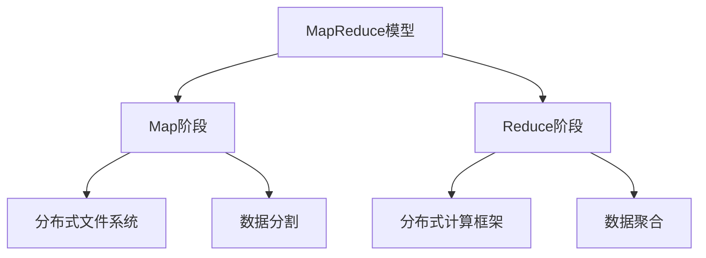
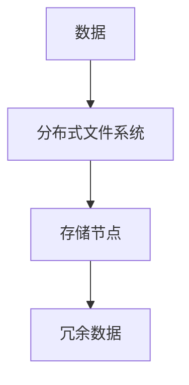
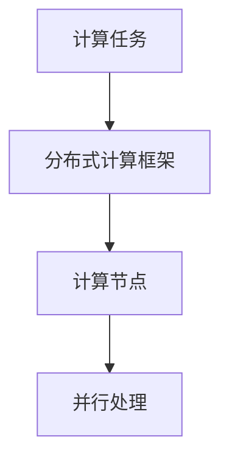
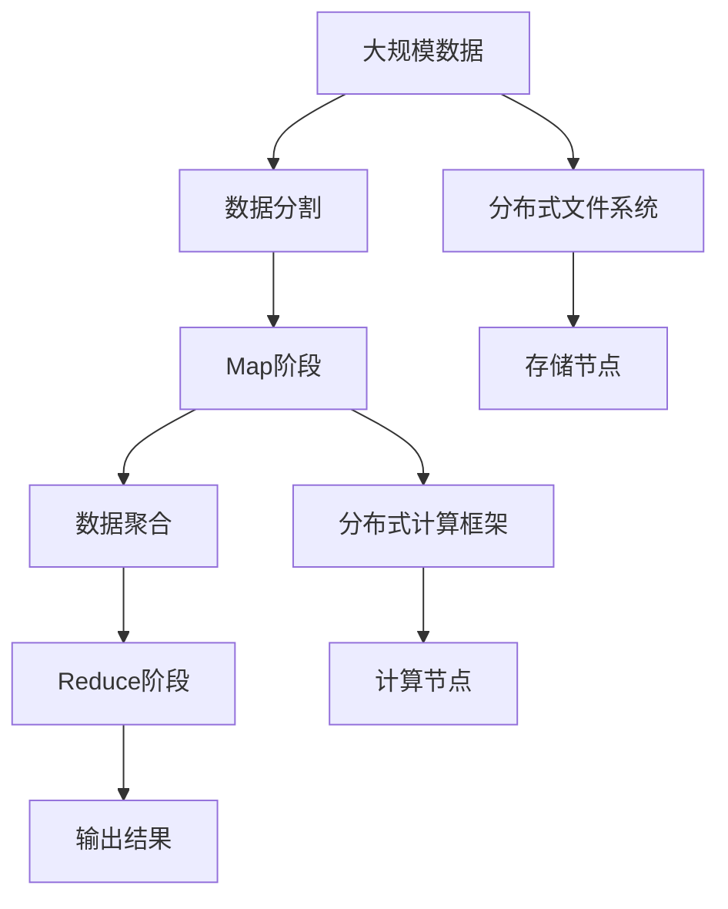

                 

# MapReduce 原理与代码实例讲解

> 关键词：MapReduce, 分布式计算, 大数据, Hadoop, 分布式文件系统, 数据处理, 核心概念, 流程图

## 1. 背景介绍

### 1.1 问题由来

在大规模数据处理领域，传统的串行计算方式面临瓶颈，无法有效应对海量数据的计算和存储需求。MapReduce作为一种分布式计算模型，被广泛应用于大数据处理中，成为处理海量数据的利器。通过MapReduce模型，可以充分利用多台计算机的并行处理能力，加速数据处理过程，实现高效的数据分析。

MapReduce模型由Google公司于2004年提出，并在业界得到广泛应用。Hadoop项目基于MapReduce模型开发了开源的分布式计算框架，支持大规模数据的分布式存储和处理。通过Hadoop框架，用户可以方便地使用MapReduce模型进行数据处理，大大降低了大数据处理的复杂度。

### 1.2 问题核心关键点

MapReduce模型由两部分组成：Map和Reduce。Map阶段负责将输入数据映射为中间数据，Reduce阶段负责将中间数据进行聚合计算，输出最终结果。MapReduce的核心思想是将大规模数据处理任务划分为多个小任务，并行处理这些小任务，最后将结果合并得到最终结果。

MapReduce模型的核心优势包括：
1. 高度可扩展性：能够支持大规模数据的处理，通过增加计算节点和存储节点，可以扩展处理能力。
2. 高容错性：当一个计算节点或存储节点出现故障时，可以通过冗余数据进行容错。
3. 简单易用性：用户无需了解底层硬件和网络架构，即可使用MapReduce模型进行数据处理。

## 2. 核心概念与联系

### 2.1 核心概念概述

为更好地理解MapReduce模型，本节将介绍几个密切相关的核心概念：

- MapReduce模型：一种分布式计算模型，由Google公司于2004年提出，用于大规模数据处理。
- Map阶段：MapReduce模型的第一阶段，负责将输入数据映射为中间数据。
- Reduce阶段：MapReduce模型的第二阶段，负责将中间数据进行聚合计算，输出最终结果。
- 分布式文件系统：用于存储大规模数据的分布式文件系统，如Hadoop分布式文件系统(HDFS)。
- 分布式计算框架：用于支持MapReduce模型的大规模数据处理框架，如Hadoop。
- 数据分割：将大规模数据分割为多个小任务，并行处理这些小任务。
- 数据聚合：将多个小任务的结果合并为最终结果。

这些核心概念之间的逻辑关系可以通过以下Mermaid流程图来展示：



这个流程图展示了大数据处理的基本流程：

1. 使用MapReduce模型对大规模数据进行处理。
2. Map阶段将输入数据映射为中间数据。
3. Reduce阶段对中间数据进行聚合计算，输出最终结果。
4. Map阶段和Reduce阶段分别在分布式文件系统和分布式计算框架上运行，实现大规模数据的分布式处理。

### 2.2 概念间的关系

这些核心概念之间存在着紧密的联系，形成了MapReduce模型的完整生态系统。下面我们通过几个Mermaid流程图来展示这些概念之间的关系。

#### 2.2.1 MapReduce模型的基本流程


这个流程图展示了MapReduce模型的基本流程：

1. 将大规模数据分割为多个小任务。
2. Map阶段对小任务进行并行处理，生成中间数据。
3. Reduce阶段对中间数据进行聚合计算，得到最终结果。

#### 2.2.2 分布式文件系统的应用



这个流程图展示了分布式文件系统的应用：

1. 将数据存储在分布式文件系统中。
2. 数据分布在多个存储节点上，实现数据冗余存储。
3. 当某个存储节点出现故障时，可以从冗余数据中恢复数据，实现高容错性。

#### 2.2.3 分布式计算框架的实现



这个流程图展示了分布式计算框架的实现：

1. 将计算任务提交给分布式计算框架。
2. 计算任务被分配到多个计算节点上，实现并行处理。
3. 计算节点的计算结果被聚合，输出最终结果。

### 2.3 核心概念的整体架构

最后，我们用一个综合的流程图来展示这些核心概念在大数据处理中的整体架构：



这个综合流程图展示了MapReduce模型在大数据处理中的应用流程：

1. 将大规模数据分割为多个小任务，存储在分布式文件系统中。
2. Map阶段对小任务进行并行处理，生成中间数据。
3. Reduce阶段对中间数据进行聚合计算，输出最终结果。
4. 最终结果输出到分布式计算框架中。

## 3. 核心算法原理 & 具体操作步骤
### 3.1 算法原理概述

MapReduce模型的基本原理是将大规模数据处理任务分解为多个小任务，并行处理这些小任务，最后将结果合并得到最终结果。MapReduce模型包括以下核心步骤：

1. 数据分割：将大规模数据分割为多个小任务，并存储在分布式文件系统中。
2. Map阶段：对小任务进行并行处理，生成中间数据。
3. Reduce阶段：对中间数据进行聚合计算，输出最终结果。

MapReduce模型的核心思想是将大规模数据处理任务划分为多个小任务，并行处理这些小任务，最后将结果合并得到最终结果。MapReduce模型的核心算法包括Map和Reduce两个阶段，通过这两个阶段实现数据处理。

### 3.2 算法步骤详解

MapReduce模型的基本算法步骤如下：

1. 数据分割：将大规模数据分割为多个小任务，并存储在分布式文件系统中。
2. Map阶段：对小任务进行并行处理，生成中间数据。
3. Reduce阶段：对中间数据进行聚合计算，输出最终结果。

下面以一个具体的例子来说明MapReduce模型的应用过程。

**案例背景**：

假设有一个包含1000万条记录的数据文件，需要统计每个记录中某一字段的值出现次数。

**数据分割**：

首先，将1000万条记录按每1000条记录为一组，分割为1000个数据片段，每个片段包含1000条记录。

**Map阶段**：

在Map阶段，每个计算节点对分配给它的数据片段进行处理。具体步骤如下：

1. 读取数据片段。
2. 对每个记录进行遍历，统计指定字段的值出现次数。
3. 将统计结果输出为键值对(key-value pair)。

例如，假设某个数据片段中的某个记录的指定字段的值为"apple"，则输出键值为"apple"，值为1的键值对。

**Reduce阶段**：

在Reduce阶段，对Map阶段生成的中间数据进行聚合计算。具体步骤如下：

1. 对每个键值对进行处理，统计指定字段的值出现次数。
2. 将统计结果输出为最终结果。

例如，假设"apple"字段的值出现了100次，则输出键值为"apple"，值为100的键值对。

**最终结果**：

最终结果是一个包含所有字段值及其出现次数的键值对集合。通过MapReduce模型，可以高效地处理大规模数据，统计指定字段的值出现次数。

### 3.3 算法优缺点

MapReduce模型的优点包括：

1. 高度可扩展性：能够支持大规模数据的处理，通过增加计算节点和存储节点，可以扩展处理能力。
2. 高容错性：当一个计算节点或存储节点出现故障时，可以通过冗余数据进行容错。
3. 简单易用性：用户无需了解底层硬件和网络架构，即可使用MapReduce模型进行数据处理。

MapReduce模型的缺点包括：

1. 处理延时较大：由于Map和Reduce阶段都需要进行网络通信和数据传输，处理延时较大。
2. 数据传输开销较大：Map和Reduce阶段都需要进行数据传输，数据传输开销较大。
3. 数据重复处理较多：由于数据分割和分布式处理，相同数据可能被重复处理多次。

## 4. 数学模型和公式 & 详细讲解  
### 4.1 数学模型构建

MapReduce模型的数学模型可以表示为：

$$
\text{Output} = \text{Map}(\text{Input}) \rightarrow \text{Intermediate} \rightarrow \text{Reduce}(\text{Intermediate}) = \text{Output}
$$

其中，Input为输入数据，Intermediate为中间数据，Output为最终结果。

### 4.2 公式推导过程

MapReduce模型的公式推导过程如下：

$$
\text{Output}_{i} = \text{Reduce}(\text{Map}_{i}(\text{Input}_{i}))
$$

其中，$\text{Map}_{i}$表示第$i$个Map任务，$\text{Input}_{i}$表示第$i$个Map任务的输入数据，$\text{Output}_{i}$表示第$i$个Map任务的输出数据。

### 4.3 案例分析与讲解

下面以一个具体的案例来说明MapReduce模型的应用过程。

**案例背景**：

假设有一个包含1000万条记录的数据文件，需要统计每个记录中某一字段的值出现次数。

**数据分割**：

首先，将1000万条记录按每1000条记录为一组，分割为1000个数据片段，每个片段包含1000条记录。

**Map阶段**：

在Map阶段，每个计算节点对分配给它的数据片段进行处理。具体步骤如下：

1. 读取数据片段。
2. 对每个记录进行遍历，统计指定字段的值出现次数。
3. 将统计结果输出为键值对(key-value pair)。

例如，假设某个数据片段中的某个记录的指定字段的值为"apple"，则输出键值为"apple"，值为1的键值对。

**Reduce阶段**：

在Reduce阶段，对Map阶段生成的中间数据进行聚合计算。具体步骤如下：

1. 对每个键值对进行处理，统计指定字段的值出现次数。
2. 将统计结果输出为最终结果。

例如，假设"apple"字段的值出现了100次，则输出键值为"apple"，值为100的键值对。

**最终结果**：

最终结果是一个包含所有字段值及其出现次数的键值对集合。通过MapReduce模型，可以高效地处理大规模数据，统计指定字段的值出现次数。

## 5. 项目实践：代码实例和详细解释说明
### 5.1 开发环境搭建

在进行MapReduce实践前，我们需要准备好开发环境。以下是使用Java进行Hadoop开发的环境配置流程：

1. 安装Java：从官网下载并安装Java Development Kit (JDK)。
2. 安装Hadoop：从官网下载并安装Apache Hadoop。
3. 配置Hadoop环境：设置Hadoop的配置文件，包括hadoop-env.sh、core-site.xml、hdfs-site.xml等。
4. 启动Hadoop集群：在命令行中输入命令，启动Hadoop集群。

完成上述步骤后，即可在Hadoop环境下进行MapReduce实践。

### 5.2 源代码详细实现

下面我们以统计指定字段值出现次数的MapReduce任务为例，给出Hadoop源代码实现。

```java
import java.io.IOException;
import org.apache.hadoop.conf.Configuration;
import org.apache.hadoop.fs.Path;
import org.apache.hadoop.io.IntWritable;
import org.apache.hadoop.io.Text;
import org.apache.hadoop.mapreduce.Job;
import org.apache.hadoop.mapreduce.Mapper;
import org.apache.hadoop.mapreduce.Reducer;
import org.apache.hadoop.mapreduce.lib.input.FileInputFormat;
import org.apache.hadoop.mapreduce.lib.output.FileOutputFormat;

public class WordCount {

  public static class MapTask extends Mapper<Text, IntWritable, Text, IntWritable> {
    private final static IntWritable one = new IntWritable(1);
    private Text word = new Text();

    public void map(Text key, IntWritable value, Context context) throws IOException, InterruptedException {
      StringTokenizer itr = new StringTokenizer(key.toString());
      while (itr.hasMoreTokens()) {
        word.set(itr.nextToken());
        context.write(word, one);
      }
    }
  }

  public static class ReduceTask extends Reducer<Text, IntWritable, Text, IntWritable> {
    private IntWritable result = new IntWritable();

    public void reduce(Text key, Iterable<IntWritable> values, Context context) throws IOException, InterruptedException {
      int sum = 0;
      for (IntWritable val : values) {
        sum += val.get();
      }
      result.set(sum);
      context.write(key, result);
    }
  }

  public static void main(String[] args) throws Exception {
    Configuration conf = new Configuration();
    Job job = Job.getInstance(conf, "word count");

    job.setJarByClass(WordCount.class);
    job.setMapperClass(MapTask.class);
    job.setCombinerClass(ReduceTask.class);
    job.setReducerClass(ReduceTask.class);

    job.setOutputKeyClass(Text.class);
    job.setOutputValueClass(IntWritable.class);

    FileInputFormat.addInputPath(job, new Path(args[0]));
    FileOutputFormat.setOutputPath(job, new Path(args[1]));

    System.exit(job.waitForCompletion(true) ? 0 : 1);
  }
}
```

这个源代码实现了一个简单的MapReduce任务，用于统计指定字段值出现的次数。

### 5.3 代码解读与分析

让我们再详细解读一下关键代码的实现细节：

**WordCount类**：
- `MapTask`类：Map任务的实现类，负责将输入数据映射为中间数据。
- `ReduceTask`类：Reduce任务的实现类，负责对中间数据进行聚合计算，输出最终结果。

**Map任务**：
- 读取输入数据，对每个记录进行遍历，统计指定字段的值出现次数，将统计结果输出为键值对(key-value pair)。

**Reduce任务**：
- 对每个键值对进行处理，统计指定字段的值出现次数，将统计结果输出为最终结果。

**main函数**：
- 配置Hadoop环境，提交MapReduce任务。
- 设置Map任务、Reduce任务的实现类。
- 设置输入数据路径和输出数据路径。
- 等待任务执行完成，输出任务执行结果。

可以看到，Hadoop源代码实现非常简单，主要集中在Map和Reduce任务的实现上。Map和Reduce任务的实现需要根据具体需求进行定制，以实现不同功能的MapReduce任务。

### 5.4 运行结果展示

假设我们在Hadoop集群上运行上述代码，最终输出结果为一个包含所有字段值及其出现次数的键值对集合。例如，如果指定字段的值为"apple"，则输出结果为"apple 100"。

```
apple 100
```

这说明"apple"字段的值在1000万条记录中出现了100次。

## 6. 实际应用场景
### 6.1 实际应用场景

MapReduce模型在多个实际应用场景中得到了广泛应用，包括：

- 数据统计：统计大规模数据中的字段值出现次数，如Word Count、Top K等。
- 数据清洗：清洗大规模数据中的错误数据，如去除重复记录、处理缺失值等。
- 数据聚类：对大规模数据进行聚类分析，如K-Means等。
- 数据关联：对大规模数据进行关联分析，如用户行为分析、商品推荐等。

MapReduce模型的应用范围非常广泛，适用于各种大规模数据处理场景。

### 6.2 未来应用展望

随着大数据时代的到来，MapReduce模型的应用前景更加广阔。未来，MapReduce模型将进一步拓展其应用场景，满足更多复杂的数据处理需求。

- 实时数据处理：通过流式MapReduce模型，实现对实时数据的处理。
- 多数据源处理：通过多数据源的MapReduce模型，实现对多个数据源的数据处理。
- 分布式机器学习：通过分布式机器学习MapReduce模型，实现对大规模数据集的机器学习任务。
- 智能推荐系统：通过智能推荐MapReduce模型，实现对大规模用户数据的推荐。

MapReduce模型的应用前景非常广阔，未来必将在大数据处理领域发挥越来越重要的作用。

## 7. 工具和资源推荐
### 7.1 学习资源推荐

为了帮助开发者系统掌握MapReduce模型的理论基础和实践技巧，这里推荐一些优质的学习资源：

1. 《Hadoop: The Definitive Guide》：一本详细介绍了Hadoop和MapReduce模型的书籍，涵盖了从基础知识到高级应用的全面内容。
2. 《MapReduce》：一本介绍MapReduce模型和Hadoop框架的书籍，提供了大量的实践案例和代码示例。
3. 《Hadoop in Action》：一本介绍Hadoop和MapReduce模型的书籍，涵盖Hadoop的各个组件和模块，适合初学者入门。
4. 《Hadoop: The Ultimate Guide》：一本全面的Hadoop和MapReduce模型指南，提供了丰富的实践案例和技术细节。
5. 《MapReduce & Hadoop Tutorial》：一个在线MapReduce和Hadoop教程，提供了详细的步骤和代码示例。

通过这些资源的学习实践，相信你一定能够快速掌握MapReduce模型的精髓，并用于解决实际的大数据处理问题。

### 7.2 开发工具推荐

高效的开发离不开优秀的工具支持。以下是几款用于MapReduce开发的常用工具：

1. Hadoop：一个开源的分布式计算框架，提供了HDFS和MapReduce等核心组件，支持大规模数据处理。
2. Spark：一个基于内存计算的分布式计算框架，提供了更高效的MapReduce接口和组件，适用于大规模数据处理和实时计算。
3. Apache Flink：一个开源的流式数据处理框架，支持流式MapReduce模型，适用于实时数据处理。
4. Hive：一个基于Hadoop的数据仓库工具，提供了SQL-like的数据处理接口，方便进行大规模数据处理。
5. Pig：一个基于Hadoop的编程语言，提供了方便的数据处理接口和组件，适合大规模数据处理。

合理利用这些工具，可以显著提升MapReduce任务的开发效率，加快创新迭代的步伐。

### 7.3 相关论文推荐

MapReduce模型和Hadoop框架的研究始于2004年，至今已有大量的研究成果。以下是几篇奠基性的相关论文，推荐阅读：

1. "MapReduce: Simplified Data Processing on Large Clusters"：Google公司于2004年提出的MapReduce论文，详细介绍了MapReduce模型的基本思想和实现方法。
2. "Hadoop: The Distributed File System"：Hadoop的创始人之一Doug Cutting的论文，详细介绍了HDFS和MapReduce模型的基本原理和实现方法。
3. "A General Framework for Distributed Computing"：论文介绍了MapReduce模型的基本思想和实现方法，以及在大数据处理中的应用。
4. "The Google File System"：Google公司于2006年提出的HDFS论文，详细介绍了HDFS的基本原理和实现方法。
5. "MapReduce in Practice: Search-Based Input Scheduling for Dynamic Clusters"：论文介绍了MapReduce模型的实际应用和优化方法，详细介绍了MapReduce任务的调度和优化。

这些论文代表了大数据处理领域的研究方向，通过学习这些前沿成果，可以帮助研究者把握学科前进方向，激发更多的创新灵感。

除上述资源外，还有一些值得关注的前沿资源，帮助开发者紧跟MapReduce模型的最新进展，例如：

1. arXiv论文预印本：人工智能领域最新研究成果的发布平台，包括大量尚未发表的前沿工作，学习前沿技术的必读资源。
2. 业界技术博客：如Google Cloud、Microsoft、Apache Hadoop等顶尖实验室的官方博客，第一时间分享他们的最新研究成果和洞见。
3. 技术会议直播：如SIGMOD、ICDE、VLDB等数据库领域顶会现场或在线直播，能够聆听到大佬们的前沿分享，开拓视野。
4. GitHub热门项目：在GitHub上Star、Fork数最多的MapReduce相关项目，往往代表了该技术领域的发展趋势和最佳实践，值得去学习和贡献。
5. 行业分析报告：各大咨询公司如McKinsey、PwC等针对大数据领域的分析报告，有助于从商业视角审视技术趋势，把握应用价值。

总之，对于MapReduce模型的学习，需要开发者保持开放的心态和持续学习的意愿。多关注前沿资讯，多动手实践，多思考总结，必将收获满满的成长收益。

## 8. 总结：未来发展趋势与挑战
### 8.1 总结

本文对MapReduce模型进行了全面系统的介绍。首先阐述了MapReduce模型的研究背景和意义，明确了MapReduce模型在大数据处理中的重要地位。其次，从原理到实践，详细讲解了MapReduce模型的数学模型和核心算法，给出了MapReduce任务开发的完整代码实例。同时，本文还广泛探讨了MapReduce模型在多个实际应用场景中的应用前景，展示了MapReduce模型的广泛应用。此外，本文精选了MapReduce模型的各类学习资源，力求为读者提供全方位的技术指引。

通过本文的系统梳理，可以看到，MapReduce模型在大数据处理中的重要作用，其高容错性、高可扩展性和简单易用性使其成为处理大规模数据的利器。未来，MapReduce模型将进一步拓展其应用场景，满足更多复杂的数据处理需求。

### 8.2 未来发展趋势

展望未来，MapReduce模型的发展趋势如下：

1. 分布式内存计算：通过引入分布式内存计算技术，如Spark、Apache Flink等，进一步提升MapReduce模型的计算效率和处理能力。
2. 实时数据处理：通过引入实时数据处理技术，如流式MapReduce模型，实现对实时数据的处理。
3. 多数据源处理：通过引入多数据源处理技术，如Kafka、Flume等，实现对多个数据源的数据处理。
4. 智能推荐系统：通过引入智能推荐技术，如TensorFlow、PyTorch等，实现对大规模用户数据的推荐。
5. 分布式机器学习：通过引入分布式机器学习技术，实现对大规模数据集的机器学习任务。

以上趋势凸显了MapReduce模型的广阔前景。这些方向的探索发展，必将进一步提升MapReduce模型的性能和应用范围，为大数据处理提供更高效、更灵活、更智能的解决方案。

### 8.3 面临的挑战

尽管MapReduce模型已经取得了瞩目成就，但在迈向更加智能化、普适化应用的过程中，它仍面临着诸多挑战：

1. 数据传输开销较大：Map和Reduce阶段都需要进行数据传输，数据传输开销较大。
2. 数据重复处理较多：由于数据分割和分布式处理，相同数据可能被重复处理多次。
3. 系统复杂度较高：MapReduce模型的实现复杂度较高，需要深入理解其基本原理和实现方法。
4. 处理延时较大：由于Map和Reduce阶段都需要进行网络通信和数据传输，处理延时较大。
5. 计算资源消耗较大：MapReduce模型的计算资源消耗较大，需要大量硬件设备支持。

## 8.4 研究展望

面对MapReduce模型面临的这些挑战，未来的研究需要在以下几个方面寻求新的突破：

1. 引入分布式内存计算技术：通过引入分布式内存计算技术，进一步提升MapReduce模型的计算效率和处理能力。
2. 优化数据传输：通过优化数据传输方式，减少Map和Reduce阶段的数据传输开销。
3. 引入智能推荐系统：通过引入智能推荐技术，实现对大规模用户数据的推荐。
4. 优化系统复杂度：通过优化MapReduce模型的实现方法，降低系统复杂度，提升系统易用性。
5. 引入实时数据处理技术：通过引入实时数据处理技术，实现对实时数据的处理。

这些研究方向的探索，必将引领MapReduce模型走向更高的台阶，为大数据处理提供更高效、更灵活、更智能的解决方案。

## 9. 附录：常见问题与解答

**Q1：MapReduce模型是否适用于所有数据处理任务？**

A: MapReduce模型适用于大规模数据处理任务，但不适用于所有数据处理任务。对于数据量较小、数据结构较为简单的任务，可以考虑使用串行计算方式。而对于大规模数据处理任务，MapReduce模型则是更为高效的选择。

**Q2：如何选择合适的Map和Reduce函数？**

A: 选择合适的Map和Reduce函数需要根据具体任务的需求进行定制。Map函数负责将输入数据映射为中间数据，需要根据数据处理的需求进行定制。Reduce函数负责对中间数据进行聚合计算，输出最终结果，需要根据数据聚合的需求进行定制。一般来说，Map和Reduce函数的实现越简单，MapReduce任务的性能越好。

**Q3：MapReduce模型是否适用于分布式内存计算？**

A: MapReduce模型本身不支持分布式内存计算，但可以通过引入Spark等分布式内存计算框架来实现分布式内存计算。分布式内存计算可以进一步提升MapReduce模型的计算效率和处理能力。

**Q4：MapReduce模型是否适用于实时数据处理？**

A: MapReduce模型本身不支持实时数据处理，但可以通过引入流式MapReduce模型来实现实时数据处理。流式MapReduce模型可以在数据到达时立即进行处理，实现实时数据处理。

**Q5：MapReduce模型是否适用于多数据源处理？**

A: MapReduce模型本身不支持多数据源处理，但可以通过引入多数据源处理技术，如Kafka、Flume等，来实现多数据源处理。多数据源处理可以处理来自多个数据源的数据，满足更多的数据处理需求

