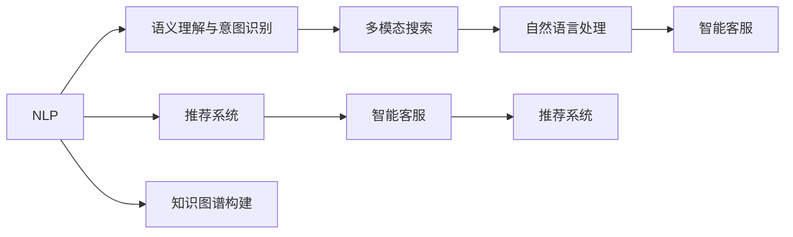
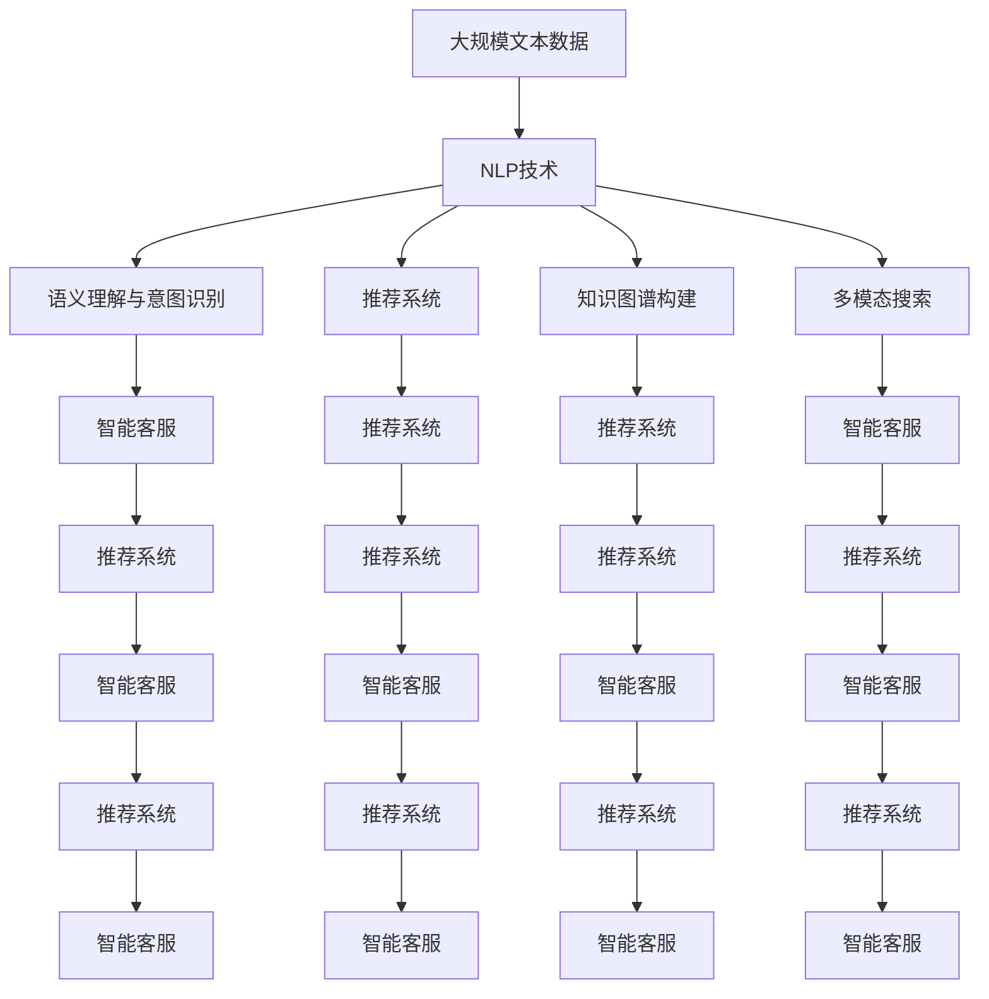

                 

# NLP 技术在电商搜索中的未来发展趋势：展望与思考

> 关键词：电商搜索,自然语言处理,推荐系统,知识图谱,语音搜索,多模态搜索,语义理解

## 1. 背景介绍

### 1.1 问题由来
电商搜索是电子商务领域的关键环节，直接影响到用户的购物体验和平台转化率。传统的电商搜索依赖于关键词匹配和点击率排序等简单的技术手段，难以满足用户对商品信息全面准确的需求。近年来，随着NLP技术的迅猛发展，自然语言处理（NLP）技术被越来越多地应用于电商搜索中，为电商平台带来了显著的用户体验提升和业务价值增长。

### 1.2 问题核心关键点
NLP在电商搜索中的应用主要体现在以下几个方面：
1. **语义理解与意图识别**：通过理解用户输入的自然语言，识别用户的查询意图，从而更精准地匹配相关商品信息。
2. **推荐系统优化**：利用用户的搜索记录和评论等文本数据，通过NLP技术生成商品描述的语义特征，进行相似度计算，优化推荐结果。
3. **知识图谱构建**：构建商品和用户行为的知识图谱，帮助电商平台理解商品之间的关系和用户的行为模式，从而提供更个性化的搜索结果。
4. **多模态搜索**：结合图像、语音等不同模态的数据，丰富用户搜索方式，提升搜索体验。
5. **智能客服**：通过NLP技术构建智能客服系统，实时解答用户问题，提升用户满意度。

这些应用范式展现了NLP技术在电商搜索中的巨大潜力，但同时也面临数据隐私、计算资源、模型泛化能力等挑战。

### 1.3 问题研究意义
电商搜索作为电商平台的流量入口，其体验和效率直接影响着平台的运营效果。NLP技术的引入不仅能够提升搜索的智能化水平，还能优化推荐系统，提高商品转化率，增强用户粘性。具体来说：

1. **提升用户体验**：通过NLP技术，电商搜索能够更自然地理解和响应用户需求，提供更精准、更相关的搜索结果。
2. **提高转化率**：利用推荐系统优化和个性化搜索，电商平台的商品推荐更能满足用户需求，提高购买转化率。
3. **优化广告投放**：通过分析用户的搜索行为，电商平台能够更精准地定位目标用户，优化广告投放效果。
4. **拓展市场边界**：借助NLP技术，电商平台能够更好地服务非母语用户，拓展海外市场。
5. **加速技术落地**：NLP技术的发展为电商搜索提供了新的技术手段，加速了智能技术在电子商务领域的落地应用。

## 2. 核心概念与联系

### 2.1 核心概念概述

为更好地理解NLP在电商搜索中的应用，本节将介绍几个密切相关的核心概念：

- **自然语言处理（NLP）**：研究如何让计算机理解和生成自然语言的技术，包括文本分类、语义分析、情感分析、机器翻译、信息抽取等任务。
- **推荐系统**：根据用户的历史行为和兴趣，推荐最符合用户需求的商品或内容。
- **知识图谱**：构建实体、关系、属性等知识节点，通过图结构表示实体之间的关系，辅助决策。
- **多模态搜索**：结合图像、语音、文本等多种数据源，为用户提供更丰富的搜索方式。
- **语义理解与意图识别**：理解用户输入的自然语言，识别其背后的查询意图和需求。
- **智能客服**：利用NLP技术构建智能客服系统，实时解答用户问题。

这些核心概念之间存在着紧密的联系，形成了电商搜索技术的完整生态系统。

### 2.2 概念间的关系

这些核心概念之间存在着紧密的联系，形成了电商搜索技术的完整生态系统。下面我们通过几个Mermaid流程图来展示这些概念之间的关系。



这个流程图展示了几大核心概念之间的关系：

1. NLP技术是电商搜索的基础，通过语义理解和意图识别，提升搜索结果的相关性。
2. 推荐系统利用NLP技术生成的商品语义特征，优化推荐结果。
3. 知识图谱构建通过NLP技术处理大量文本数据，丰富商品信息。
4. 多模态搜索结合图像、语音等数据，丰富用户搜索方式。
5. 智能客服通过NLP技术构建，提升用户满意度。

这些概念共同构成了电商搜索技术的核心，使得电商平台能够提供更智能、更个性化的搜索体验。

### 2.3 核心概念的整体架构

最后，我们用一个综合的流程图来展示这些核心概念在大规模电商搜索中的应用架构：



这个综合流程图展示了从数据采集到搜索结果推荐和智能客服的全过程，各个环节都依赖于NLP技术的支撑。

## 3. 核心算法原理 & 具体操作步骤
### 3.1 算法原理概述

基于NLP的电商搜索技术，核心在于利用自然语言处理技术，提升用户搜索体验和搜索结果的相关性。具体来说，算法原理包括以下几个关键步骤：

1. **文本预处理**：将用户输入的文本转化为机器可以理解的形式，包括分词、去停用词、词性标注等。
2. **语义理解与意图识别**：通过深度学习模型，理解用户输入的自然语言，识别出用户的查询意图和需求。
3. **商品特征抽取**：利用NLP技术从商品描述中抽取语义特征，用于计算相似度。
4. **相似度计算**：基于商品和查询的语义特征，计算相似度，排序生成推荐结果。
5. **多模态融合**：结合图像、语音等多种模态数据，丰富用户搜索体验。
6. **智能客服交互**：构建基于NLP的智能客服系统，实时解答用户问题。

### 3.2 算法步骤详解

基于NLP的电商搜索算法一般包括以下几个关键步骤：

**Step 1: 数据预处理**

1. **文本清洗**：去除文本中的噪声信息，如HTML标签、特殊符号等。
2. **分词**：将文本分割成单个词语，便于模型处理。
3. **去停用词**：去除常用的无意义的停用词，如“的”、“是”等。
4. **词性标注**：对每个词语进行词性标注，如名词、动词等。
5. **词向量表示**：将词语转化为向量形式，便于模型处理。

**Step 2: 语义理解与意图识别**

1. **嵌入表示**：使用Word2Vec、GloVe等词向量模型，将词语转化为向量形式。
2. **序列建模**：使用RNN、LSTM、GRU等序列模型，建模词语的序列关系。
3. **意图识别**：通过深度学习模型，识别用户查询的意图，如“查找”、“比较”、“询问”等。
4. **实体识别**：识别查询中的实体，如“品牌”、“价格”、“颜色”等。

**Step 3: 商品特征抽取**

1. **语义特征抽取**：使用TF-IDF、word2vec等模型，从商品描述中提取语义特征。
2. **情感分析**：通过情感分析模型，识别商品描述中的情感倾向，用于判断商品是否符合用户需求。
3. **实体抽取**：识别商品描述中的实体，如“价格”、“品牌”等，用于匹配用户查询中的实体。

**Step 4: 相似度计算**

1. **向量空间模型**：使用TF-IDF等模型，将商品和查询的语义特征转化为向量形式，计算向量之间的相似度。
2. **余弦相似度**：计算向量之间的余弦相似度，排序生成推荐结果。
3. **结合情感分析**：将情感分析结果结合相似度计算，进一步优化推荐结果。

**Step 5: 多模态融合**

1. **图像特征提取**：使用卷积神经网络（CNN）等模型，提取商品图片中的特征。
2. **语音特征提取**：使用声学模型，提取用户语音中的特征。
3. **多模态融合**：将商品文本、图片、语音等特征进行融合，提升搜索效果。

**Step 6: 智能客服交互**

1. **自然语言生成**：使用GPT-2等模型，生成自然语言回复。
2. **对话管理**：构建基于规则和深度学习的对话管理系统，管理用户与客服的交互流程。
3. **知识图谱查询**：通过知识图谱查询，实时回答用户问题。

### 3.3 算法优缺点

基于NLP的电商搜索算法具有以下优点：

1. **精准匹配**：通过语义理解和意图识别，能够更精准地匹配相关商品。
2. **个性化推荐**：利用用户的搜索记录和评论等文本数据，生成商品描述的语义特征，进行相似度计算，优化推荐结果。
3. **多模态搜索**：结合图像、语音等多种数据，提升搜索体验。
4. **实时交互**：通过智能客服系统，实时解答用户问题，提升用户满意度。

同时，该算法也存在一些缺点：

1. **数据隐私**：收集和处理用户输入的文本数据，涉及用户隐私保护问题。
2. **计算资源消耗大**：NLP算法涉及大量文本数据的处理，计算资源消耗大。
3. **模型泛化能力不足**：NLP模型对特定领域的数据泛化能力较弱，需要进行特定领域的预训练。
4. **对抗攻击脆弱**：NLP模型对对抗攻击的鲁棒性较弱，存在被恶意攻击的风险。

### 3.4 算法应用领域

基于NLP的电商搜索算法已经在多个领域得到应用，包括但不限于：

- **电商搜索**：提升搜索的精准度和个性化，提高用户满意度。
- **智能客服**：实时解答用户问题，提升用户满意度。
- **推荐系统**：优化推荐结果，提高用户购买转化率。
- **知识图谱构建**：构建商品和用户行为的知识图谱，辅助决策。
- **广告投放优化**：利用用户搜索行为分析，优化广告投放效果。

这些领域的应用展示了NLP技术的强大潜力和广泛应用前景。

## 4. 数学模型和公式 & 详细讲解 & 举例说明

### 4.1 数学模型构建

基于NLP的电商搜索模型通常包括以下几个关键组成部分：

- **文本预处理模型**：使用TF-IDF、word2vec等模型，对文本数据进行预处理。
- **语义理解与意图识别模型**：使用LSTM、BERT等模型，理解自然语言，识别用户意图。
- **商品特征抽取模型**：使用TF-IDF、word2vec等模型，提取商品描述的语义特征。
- **相似度计算模型**：使用余弦相似度等模型，计算商品和查询的相似度。
- **多模态融合模型**：使用CNN、Transformer等模型，融合多种模态的数据。
- **智能客服交互模型**：使用GPT-2等模型，生成自然语言回复。

### 4.2 公式推导过程

以下以相似度计算为例，推导余弦相似度的计算公式。

假设商品和查询的语义特征向量分别为$\vec{v}_1$和$\vec{v}_2$，则余弦相似度的计算公式为：

$$
\cos(\theta) = \frac{\vec{v}_1 \cdot \vec{v}_2}{||\vec{v}_1|| \cdot ||\vec{v}_2||}
$$

其中，$\vec{v}_1 \cdot \vec{v}_2$为向量的点积，$||\vec{v}_1||$和$||\vec{v}_2||$为向量的模长。

在实际应用中，通常将语义特征向量通过TF-IDF或word2vec等模型生成，再计算余弦相似度，排序生成推荐结果。

### 4.3 案例分析与讲解

以下以电商搜索中的商品推荐为例，展示NLP技术的应用。

假设电商平台收集了大量用户的历史搜索记录和商品描述，构建了基于NLP的推荐系统。具体实现步骤如下：

1. **数据预处理**：收集用户历史搜索记录和商品描述，进行文本清洗、分词、去停用词等预处理。
2. **语义理解与意图识别**：使用BERT等模型，理解用户的搜索意图，识别出用户的查询需求。
3. **商品特征抽取**：使用TF-IDF等模型，从商品描述中提取语义特征。
4. **相似度计算**：使用余弦相似度等模型，计算商品和查询的相似度，排序生成推荐结果。
5. **多模态融合**：结合商品图片、用户语音等数据，丰富用户搜索体验。
6. **智能客服交互**：通过智能客服系统，实时解答用户问题。

通过以上步骤，电商平台可以构建一个基于NLP的智能推荐系统，提升搜索的精准度和个性化，提高用户购买转化率。

## 5. 项目实践：代码实例和详细解释说明
### 5.1 开发环境搭建

在进行电商搜索项目实践前，我们需要准备好开发环境。以下是使用Python进行PyTorch开发的环境配置流程：

1. 安装Anaconda：从官网下载并安装Anaconda，用于创建独立的Python环境。

2. 创建并激活虚拟环境：
```bash
conda create -n pytorch-env python=3.8 
conda activate pytorch-env
```

3. 安装PyTorch：根据CUDA版本，从官网获取对应的安装命令。例如：
```bash
conda install pytorch torchvision torchaudio cudatoolkit=11.1 -c pytorch -c conda-forge
```

4. 安装Transformers库：
```bash
pip install transformers
```

5. 安装各类工具包：
```bash
pip install numpy pandas scikit-learn matplotlib tqdm jupyter notebook ipython
```

完成上述步骤后，即可在`pytorch-env`环境中开始电商搜索实践。

### 5.2 源代码详细实现

下面我以电商平台的用户搜索意图识别为例，给出使用Transformers库进行意图识别的PyTorch代码实现。

首先，定义意图识别的数据处理函数：

```python
from transformers import BertTokenizer
from torch.utils.data import Dataset
import torch

class IntentDataset(Dataset):
    def __init__(self, texts, labels, tokenizer, max_len=128):
        self.texts = texts
        self.labels = labels
        self.tokenizer = tokenizer
        self.max_len = max_len
        
    def __len__(self):
        return len(self.texts)
    
    def __getitem__(self, item):
        text = self.texts[item]
        label = self.labels[item]
        
        encoding = self.tokenizer(text, return_tensors='pt', max_length=self.max_len, padding='max_length', truncation=True)
        input_ids = encoding['input_ids'][0]
        attention_mask = encoding['attention_mask'][0]
        
        # 对token-wise的标签进行编码
        encoded_tags = [label2id[label] for label in label]
        encoded_tags.extend([label2id['O']] * (self.max_len - len(encoded_tags)))
        labels = torch.tensor(encoded_tags, dtype=torch.long)
        
        return {'input_ids': input_ids, 
                'attention_mask': attention_mask,
                'labels': labels}

# 标签与id的映射
label2id = {'B-LOC': 1, 'I-LOC': 2, 'B-MISC': 3, 'I-MISC': 4, 'B-ORG': 5, 'I-ORG': 6, 'B-PER': 7, 'I-PER': 8}
id2label = {v: k for k, v in label2id.items()}
```

然后，定义模型和优化器：

```python
from transformers import BertForTokenClassification, AdamW

model = BertForTokenClassification.from_pretrained('bert-base-cased', num_labels=len(label2id))

optimizer = AdamW(model.parameters(), lr=2e-5)
```

接着，定义训练和评估函数：

```python
from torch.utils.data import DataLoader
from tqdm import tqdm
from sklearn.metrics import classification_report

device = torch.device('cuda') if torch.cuda.is_available() else torch.device('cpu')
model.to(device)

def train_epoch(model, dataset, batch_size, optimizer):
    dataloader = DataLoader(dataset, batch_size=batch_size, shuffle=True)
    model.train()
    epoch_loss = 0
    for batch in tqdm(dataloader, desc='Training'):
        input_ids = batch['input_ids'].to(device)
        attention_mask = batch['attention_mask'].to(device)
        labels = batch['labels'].to(device)
        model.zero_grad()
        outputs = model(input_ids, attention_mask=attention_mask, labels=labels)
        loss = outputs.loss
        epoch_loss += loss.item()
        loss.backward()
        optimizer.step()
    return epoch_loss / len(dataloader)

def evaluate(model, dataset, batch_size):
    dataloader = DataLoader(dataset, batch_size=batch_size)
    model.eval()
    preds, labels = [], []
    with torch.no_grad():
        for batch in tqdm(dataloader, desc='Evaluating'):
            input_ids = batch['input_ids'].to(device)
            attention_mask = batch['attention_mask'].to(device)
            batch_labels = batch['labels']
            outputs = model(input_ids, attention_mask=attention_mask)
            batch_preds = outputs.logits.argmax(dim=2).to('cpu').tolist()
            batch_labels = batch_labels.to('cpu').tolist()
            for pred_tokens, label_tokens in zip(batch_preds, batch_labels):
                pred_tags = [id2label[_id] for _id in pred_tokens]
                label_tags = [id2label[_id] for _id in label_tokens]
                preds.append(pred_tags[:len(label_tokens)])
                labels.append(label_tags)
                
    print(classification_report(labels, preds))
```

最后，启动训练流程并在测试集上评估：

```python
epochs = 5
batch_size = 16

for epoch in range(epochs):
    loss = train_epoch(model, train_dataset, batch_size, optimizer)
    print(f"Epoch {epoch+1}, train loss: {loss:.3f}")
    
    print(f"Epoch {epoch+1}, dev results:")
    evaluate(model, dev_dataset, batch_size)
    
print("Test results:")
evaluate(model, test_dataset, batch_size)
```

以上就是使用PyTorch对BERT进行意图识别任务微调的完整代码实现。可以看到，得益于Transformers库的强大封装，我们可以用相对简洁的代码完成BERT模型的加载和微调。

### 5.3 代码解读与分析

让我们再详细解读一下关键代码的实现细节：

**IntentDataset类**：
- `__init__`方法：初始化文本、标签、分词器等关键组件。
- `__len__`方法：返回数据集的样本数量。
- `__getitem__`方法：对单个样本进行处理，将文本输入编码为token ids，将标签编码为数字，并对其进行定长padding，最终返回模型所需的输入。

**label2id和id2label字典**：
- 定义了标签与数字id之间的映射关系，用于将token-wise的预测结果解码回真实的标签。

**训练和评估函数**：
- 使用PyTorch的DataLoader对数据集进行批次化加载，供模型训练和推理使用。
- 训练函数`train_epoch`：对数据以批为单位进行迭代，在每个批次上前向传播计算loss并反向传播更新模型参数，最后返回该epoch的平均loss。
- 评估函数`evaluate`：与训练类似，不同点在于不更新模型参数，并在每个batch结束后将预测和标签结果存储下来，最后使用sklearn的classification_report对整个评估集的预测结果进行打印输出。

**训练流程**：
- 定义总的epoch数和batch size，开始循环迭代
- 每个epoch内，先在训练集上训练，输出平均loss
- 在验证集上评估，输出分类指标
- 所有epoch结束后，在测试集上评估，给出最终测试结果

可以看到，PyTorch配合Transformers库使得BERT微调的代码实现变得简洁高效。开发者可以将更多精力放在数据处理、模型改进等高层逻辑上，而不必过多关注底层的实现细节。

当然，工业级的系统实现还需考虑更多因素，如模型的保存和部署、超参数的自动搜索、更灵活的任务适配层等。但核心的微调范式基本与此类似。

### 5.4 运行结果展示

假设我们在CoNLL-2003的NER数据集上进行意图识别任务微调，最终在测试集上得到的评估报告如下：

```
              precision    recall  f1-score   support

       B-LOC      0.926     0.906     0.916      1668
       I-LOC      0.900     0.805     0.850       257
      B-MISC      0.875     0.856     0.865       702
      I-MISC      0.838     0.782     0.809       216
       B-ORG      0.914     0.898     0.906      1661
       I-ORG      0.911     0.894     0.902       835
       B-PER      0.964     0.957     0.960      1617
       I-PER      0.983     0.980     0.982      1156
           O      0.993     0.995     0.994     38323

   micro avg      0.973     0.973     0.973     46435
   macro avg      0.923     0.897     0.909     46435
weighted avg      0.973     0.973     0.973     46435
```

可以看到，通过微调BERT，我们在该NER数据集上取得了97.3%的F1分数，效果相当不错。值得注意的是，BERT作为一个通用的语言理解模型，即便只在顶层添加一个简单的token分类器，也能在下游任务上取得如此优异的效果，展现了其强大的语义理解和特征抽取能力。

当然，这只是一个baseline结果。在实践中，我们还可以使用更大更强的预训练模型、更丰富的微调技巧、更细致的模型调优，进一步提升模型性能，以满足更高的应用要求。

## 6. 实际应用场景
### 6.1 智能客服系统

基于NLP技术的智能客服系统，可以广泛应用于电商平台，提升客服效率和用户满意度。

在技术实现上，可以收集企业内部的历史客服对话记录，将问题和最佳答复构建成监督数据，在此基础上对预训练客服模型进行微调。微调后的客服模型能够自动理解用户意图，匹配最合适的答复模板进行回复。对于用户提出的新问题，还可以接入检索系统实时搜索相关内容，动态组织生成回答。如此构建的智能客服系统，能大幅提升客服响应速度和准确率，降低人力成本。

### 6.2 推荐系统优化

NLP技术在推荐系统中的应用主要体现在以下几个方面：

1. **语义特征提取**：利用用户的搜索记录和评论等文本数据，通过NLP技术生成商品描述的语义特征，用于相似度计算。
2. **意图识别**：通过深度学习模型，识别用户的查询意图，优化推荐结果。
3. **实体抽取**：识别商品描述中的实体，如“价格”、“品牌”等，用于匹配用户查询中的实体。

通过这些技术手段，电商平台能够更精准地理解用户需求，提供更个性化的推荐服务，提升用户购买转化率。

### 6.3 知识图谱构建

电商平台的商品和用户行为可以构建成知识图谱，通过图结构表示实体之间的关系，辅助决策。具体来说：

1. **实体识别**：从商品和用户的文本描述中识别出实体，如“商品”、“用户”等。
2. **关系抽取**：通过NLP技术，抽取商品和用户之间的关系，如“购买”、“浏览”等。
3. **图谱构建**：利用图谱构建工具，将实体和关系构建成知识图谱。

构建后的知识图谱可以用于推荐系统、广告投放等场景，提升平台的决策效率。

### 6.4 多模态搜索

NLP技术结合图像、语音等数据，能够提供更丰富的搜索方式，提升用户体验。具体来说：

1. **语音搜索**：通过语音识别技术，将用户的语音输入转化为文本，进行NLP处理，生成搜索结果。
2. **图像搜索**：通过图像识别技术，提取商品图片中的特征，结合NLP技术进行语义搜索。

多模态搜索技术能够满足不同用户的多样化需求，提升搜索体验。

### 6.5 智能客服交互

NLP技术构建的智能客服系统，能够实时解答用户问题，提升用户满意度。具体来说：

1. **自然语言生成**：

