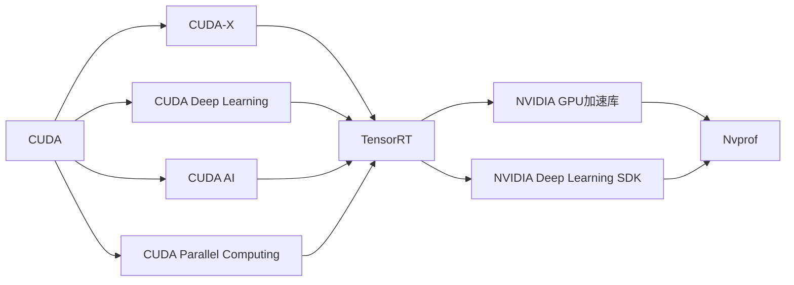
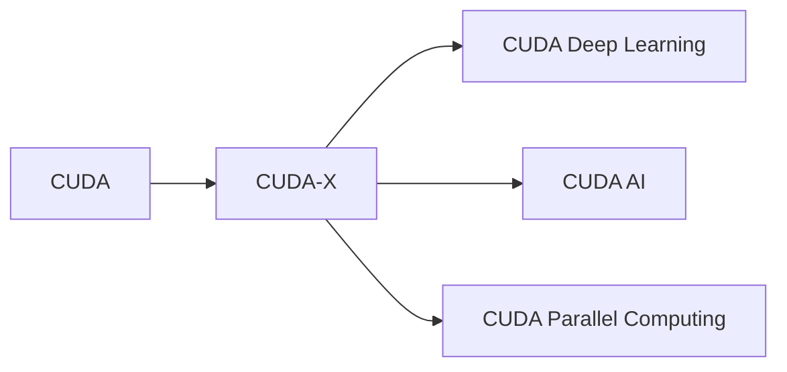
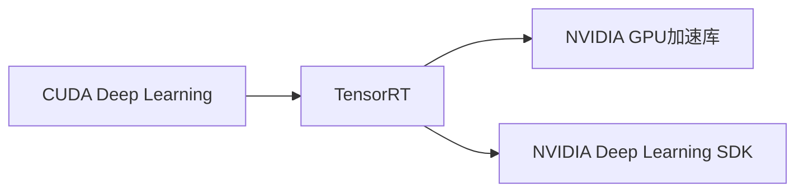
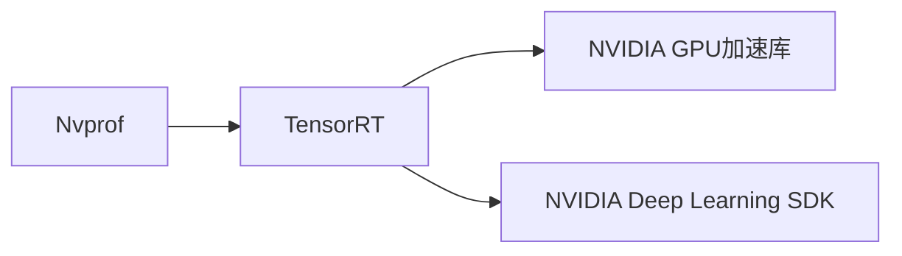
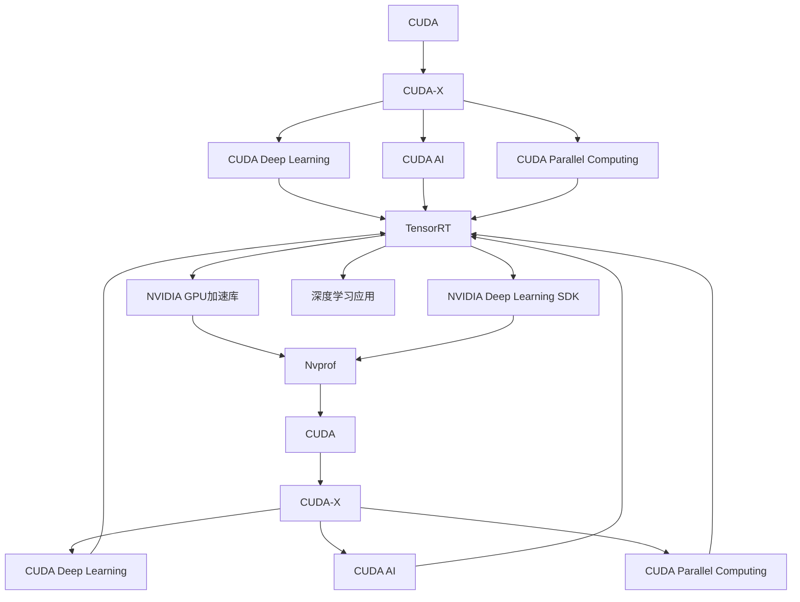

                 

## 1. 背景介绍

### 1.1 问题由来
在人工智能领域，特别是深度学习、计算机视觉和自然语言处理等技术的研究与部署过程中，算力支持的重要性不言而喻。NVIDIA作为全球领先的GPU供应商，其在算力支持方面提供了一系列的解决方案，包括高性能计算架构、深度学习加速工具和优化工具等。这些支持不仅促进了科研和应用的进步，也推动了产业界的创新。本文将详细探讨NVIDIA在算力支持方面的贡献，并对其未来发展趋势进行展望。

### 1.2 问题核心关键点
NVIDIA的算力支持主要集中在以下几个方面：
1. **高性能计算架构**：NVIDIA提供的包括CUDA和CUDA-X等平台，支持从高性能计算到深度学习的广泛应用。
2. **深度学习加速工具**：包括NVIDIA GPU加速库、NVIDIA Deep Learning SDK等，提供高效的数据加载、模型训练和推理支持。
3. **优化工具**：如TensorRT、Nvprof等，用于优化模型性能和资源使用。
4. **硬件支持**：如NVIDIA的Tesla系列GPU和A100等最新产品，提供强大的计算能力。

这些方面的支持，使得NVIDIA成为AI领域不可或缺的算力提供商，特别是在高性能计算和深度学习领域。

### 1.3 问题研究意义
研究NVIDIA在算力支持方面的贡献，对于理解高性能计算与深度学习的关系、推动AI技术的进步、以及促进产业界的应用落地，具有重要意义：
1. **提升科研效率**：高性能计算架构和加速工具的应用，大幅提升了科研人员的计算效率，使得复杂模型训练和推理成为可能。
2. **推动应用落地**：优化工具和硬件支持，使得AI模型能够在大规模生产环境中高效运行，促进了AI技术在实际业务场景中的应用。
3. **促进产业创新**：NVIDIA的算力支持，为AI初创企业和行业大厂提供了强大的技术支持，推动了整个产业的创新发展。
4. **引领技术发展**：NVIDIA不断推出新的GPU产品和技术，推动了AI领域的标准制定和技术进步。

## 2. 核心概念与联系

### 2.1 核心概念概述

为更好地理解NVIDIA在算力支持方面的贡献，本节将介绍几个关键概念：

- **CUDA**：NVIDIA开发的并行计算平台和API，支持从GPU到多核CPU的编程。CUDA加速了数据科学、深度学习等领域的应用。
- **CUDA-X**：CUDA的扩展平台，包括CUDA Deep Learning、CUDA AI、CUDA Parallel Computing等模块，支持AI研究和应用。
- **NVIDIA GPU加速库**：提供高效的深度学习库，包括NVIDIA's cuDNN、cuBLAS、cuSOLVER等，优化模型性能。
- **NVIDIA Deep Learning SDK**：提供完整的深度学习开发环境，包括模型训练、推理和优化工具。
- **TensorRT**：基于NVIDIA GPU的深度学习推理优化平台，支持实时推断和模型优化。
- **Nvprof**：NVIDIA提供的性能分析工具，用于优化模型的计算效率。
- **Tesla系列GPU**：NVIDIA高性能计算和深度学习的核心产品，包括Tesla V100、Tesla A100等。

这些概念之间的逻辑关系可以通过以下Mermaid流程图来展示：



这个流程图展示了NVIDIA在算力支持方面的核心概念及其之间的关系：

1. CUDA是CUDA-X的基础，提供通用的并行计算支持。
2. CUDA-X包含多个扩展模块，分别用于深度学习、AI和并行计算。
3. CUDA Deep Learning、CUDA AI和CUDA Parallel Computing模块是CUDA-X的组成部分，分别支持深度学习、AI和并行计算。
4. TensorRT、NVIDIA GPU加速库和NVIDIA Deep Learning SDK为深度学习应用提供支持。
5. Nvprof为性能分析提供工具，TensorRT提供推理优化。

### 2.2 概念间的关系

这些核心概念之间存在着紧密的联系，形成了NVIDIA在算力支持方面的完整生态系统。下面是几个关键概念的详细关系图：

#### 2.2.1 CUDA与CUDA-X的关系



这个流程图展示了CUDA与CUDA-X的关系：
1. CUDA是CUDA-X的基础，提供并行计算能力。
2. CUDA-X基于CUDA，包含深度学习、AI和并行计算等多个模块。

#### 2.2.2 CUDA Deep Learning与TensorRT的关系



这个流程图展示了CUDA Deep Learning与TensorRT的关系：
1. CUDA Deep Learning为TensorRT提供模型训练和优化支持。
2. TensorRT基于NVIDIA GPU，提供模型推理加速。
3. NVIDIA GPU加速库和NVIDIA Deep Learning SDK为TensorRT提供库和工具支持。

#### 2.2.3 Nvprof与TensorRT的关系



这个流程图展示了Nvprof与TensorRT的关系：
1. Nvprof用于分析TensorRT模型的性能。
2. NVIDIA GPU加速库和NVIDIA Deep Learning SDK为TensorRT提供库和工具支持。

### 2.3 核心概念的整体架构

最后，我们用一个综合的流程图来展示这些核心概念在NVIDIA算力支持架构中的整体作用：



这个综合流程图展示了从CUDA到深度学习应用的整体架构：
1. CUDA提供并行计算支持，是CUDA-X的基础。
2. CUDA-X包含多个扩展模块，支持深度学习、AI和并行计算。
3. CUDA Deep Learning、CUDA AI和CUDA Parallel Computing模块是CUDA-X的组成部分。
4. TensorRT、NVIDIA GPU加速库和NVIDIA Deep Learning SDK为深度学习应用提供支持。
5. Nvprof为性能分析提供工具，TensorRT提供推理优化。

## 3. 核心算法原理 & 具体操作步骤
### 3.1 算法原理概述

NVIDIA在算力支持方面，主要通过以下几个关键点提升模型的计算效率和性能：

1. **CUDA加速**：利用NVIDIA GPU的并行计算能力，加速模型训练和推理。
2. **CUDA-X扩展平台**：通过扩展模块，提供深度学习、AI和并行计算的全面支持。
3. **TensorRT优化**：利用深度学习推理加速工具，优化模型的实时推断效率。
4. **NVIDIA GPU加速库**：提供高效的数据加载、模型训练和推理支持。
5. **NVIDIA Deep Learning SDK**：提供完整的深度学习开发环境，包括模型训练、推理和优化工具。

这些技术手段，使得NVIDIA在算力支持方面具备了强大的竞争力，能够提供高效、可扩展的深度学习解决方案。

### 3.2 算法步骤详解

NVIDIA的算力支持主要涉及以下几个关键步骤：

1. **环境准备**：安装CUDA和CUDA-X平台，配置GPU环境，安装所需的NVIDIA加速库和SDK。
2. **模型训练**：利用CUDA加速库和CUDA Deep Learning模块，对深度学习模型进行训练。
3. **模型优化**：使用TensorRT进行模型优化，提升模型推理速度。
4. **性能分析**：使用Nvprof分析模型性能，优化资源使用。
5. **部署应用**：将优化后的模型部署到实际应用中，利用NVIDIA GPU提供高性能计算支持。

这些步骤涵盖从模型训练到模型部署的整个过程，展示了NVIDIA在算力支持方面的完整技术栈。

### 3.3 算法优缺点

NVIDIA的算力支持具有以下优点：

1. **高效计算**：通过CUDA加速和TensorRT优化，显著提升模型训练和推理速度。
2. **全面支持**：CUDA-X平台提供深度学习、AI和并行计算的全面支持，满足不同应用场景的需求。
3. **可扩展性**：NVIDIA GPU支持大规模并行计算，适合处理大规模数据集。
4. **易用性**：NVIDIA提供了丰富的工具和库，使得深度学习开发变得更加容易。

同时，NVIDIA的算力支持也存在一些缺点：

1. **成本高**：高性能GPU价格较高，需要较大的资金投入。
2. **能耗高**：NVIDIA GPU计算能力强大，但能耗较大，需要相应的冷却设备支持。
3. **依赖性**：对NVIDIA硬件和工具的依赖性较高，可能影响应用的跨平台兼容性。
4. **维护复杂**：高性能计算系统的维护和调试较为复杂，需要一定的专业知识。

### 3.4 算法应用领域

NVIDIA的算力支持在以下几个领域得到了广泛应用：

1. **科研领域**：支持深度学习、计算机视觉和自然语言处理等科研任务，提升科研效率。
2. **医疗领域**：用于医学影像分析、疾病预测等应用，提升医疗诊断和治疗的准确性。
3. **金融领域**：用于高频交易、风险评估等应用，提升金融数据分析的效率和准确性。
4. **游戏开发**：支持高性能图形渲染，提升游戏的视觉和计算性能。
5. **自动驾驶**：用于自动驾驶算法训练和推理，提升自动驾驶系统的安全性和可靠性。
6. **大数据分析**：支持大规模数据处理和分析，提升数据挖掘和分析的效率。

这些领域的应用展示了NVIDIA算力支持的广泛性和实用性，推动了AI技术在这些领域的发展和应用。

## 4. 数学模型和公式 & 详细讲解 & 举例说明

### 4.1 数学模型构建

NVIDIA在算力支持方面，主要通过以下几个数学模型来优化模型的计算效率和性能：

1. **CUDA并行计算模型**：利用CUDA并行计算能力，加速模型的计算过程。
2. **CUDA Deep Learning模型**：利用CUDA加速库和深度学习优化算法，提升模型训练和推理的效率。
3. **TensorRT推理优化模型**：利用深度学习推理加速技术，优化模型的实时推断性能。
4. **NVIDIA GPU加速库**：利用GPU加速库优化数据加载和模型训练过程。
5. **NVIDIA Deep Learning SDK**：利用SDK提供的工具和库，优化模型训练和推理过程。

这些模型共同构成了NVIDIA在算力支持方面的数学框架，通过优化计算过程，提升模型的性能和效率。

### 4.2 公式推导过程

以下我们将通过具体的公式推导，展示NVIDIA在算力支持方面的技术原理。

#### 4.2.1 CUDA并行计算模型

CUDA并行计算模型利用NVIDIA GPU的并行计算能力，将计算任务并行化，提高计算效率。以矩阵乘法为例，CUDA并行计算模型的公式如下：

$$
\text{并行计算} = \frac{N_{\text{total}}}{N_{\text{block}} \times N_{\text{thread}}}
$$

其中，$N_{\text{total}}$为总计算任务数，$N_{\text{block}}$为并行计算块数，$N_{\text{thread}}$为每个计算块中的线程数。

通过并行计算，NVIDIA GPU能够在较短的时间内完成大量计算任务，显著提升模型的计算效率。

#### 4.2.2 CUDA Deep Learning模型

CUDA Deep Learning模型利用CUDA加速库和深度学习优化算法，提升模型训练和推理的效率。以卷积神经网络为例，CUDA Deep Learning模型的公式如下：

$$
\text{模型加速} = \frac{T_{\text{串行}}}{T_{\text{并行}}}
$$

其中，$T_{\text{串行}}$为串行计算时间，$T_{\text{并行}}$为并行计算时间。通过并行计算，CUDA Deep Learning模型能够在较短时间内完成模型训练和推理，提高计算效率。

#### 4.2.3 TensorRT推理优化模型

TensorRT推理优化模型利用深度学习推理加速技术，优化模型的实时推断性能。以卷积神经网络为例，TensorRT推理优化模型的公式如下：

$$
\text{推理加速} = \frac{T_{\text{串行}}}{T_{\text{并行}}}
$$

其中，$T_{\text{串行}}$为串行推理时间，$T_{\text{并行}}$为并行推理时间。通过并行推理，TensorRT能够显著提升模型的实时推断性能，使得模型能够在较短时间内完成推理任务。

#### 4.2.4 NVIDIA GPU加速库

NVIDIA GPU加速库利用GPU加速库优化数据加载和模型训练过程。以矩阵乘法为例，NVIDIA GPU加速库的公式如下：

$$
\text{数据加载加速} = \frac{T_{\text{串行}}}{T_{\text{并行}}}
$$

其中，$T_{\text{串行}}$为串行加载时间，$T_{\text{并行}}$为并行加载时间。通过并行加载，NVIDIA GPU加速库能够显著提升数据加载和模型训练的效率。

#### 4.2.5 NVIDIA Deep Learning SDK

NVIDIA Deep Learning SDK利用SDK提供的工具和库，优化模型训练和推理过程。以卷积神经网络为例，NVIDIA Deep Learning SDK的公式如下：

$$
\text{模型训练加速} = \frac{T_{\text{串行}}}{T_{\text{并行}}}
$$

其中，$T_{\text{串行}}$为串行训练时间，$T_{\text{并行}}$为并行训练时间。通过并行训练，NVIDIA Deep Learning SDK能够显著提升模型训练的效率。

### 4.3 案例分析与讲解

#### 4.3.1 卷积神经网络（CNN）加速

卷积神经网络在图像处理和计算机视觉任务中广泛应用。NVIDIA利用CUDA并行计算和CUDA Deep Learning模型，对CNN进行加速。以LeNet-5为例，CUDA并行计算模型和CUDA Deep Learning模型的公式如下：

$$
\text{并行计算} = \frac{N_{\text{total}}}{N_{\text{block}} \times N_{\text{thread}}}
$$

$$
\text{模型加速} = \frac{T_{\text{串行}}}{T_{\text{并行}}}
$$

其中，$N_{\text{total}}$为总计算任务数，$N_{\text{block}}$为并行计算块数，$N_{\text{thread}}$为每个计算块中的线程数，$T_{\text{串行}}$为串行计算时间，$T_{\text{并行}}$为并行计算时间。

NVIDIA GPU的并行计算能力和CUDA Deep Learning模型能够显著提升CNN的计算效率，使得模型能够在较短时间内完成训练和推理任务。

#### 4.3.2 生成对抗网络（GAN）加速

生成对抗网络在图像生成和图像编辑任务中应用广泛。NVIDIA利用CUDA并行计算和TensorRT推理优化模型，对GAN进行加速。以DCGAN为例，CUDA并行计算模型和TensorRT推理优化模型的公式如下：

$$
\text{并行计算} = \frac{N_{\text{total}}}{N_{\text{block}} \times N_{\text{thread}}}
$$

$$
\text{推理加速} = \frac{T_{\text{串行}}}{T_{\text{并行}}}
$$

其中，$N_{\text{total}}$为总计算任务数，$N_{\text{block}}$为并行计算块数，$N_{\text{thread}}$为每个计算块中的线程数，$T_{\text{串行}}$为串行推理时间，$T_{\text{并行}}$为并行推理时间。

NVIDIA GPU的并行计算能力和TensorRT推理优化模型能够显著提升GAN的计算效率，使得模型能够在较短时间内完成推理任务，生成高质量的图像。

#### 4.3.3 自然语言处理（NLP）加速

自然语言处理在文本分析和信息检索任务中应用广泛。NVIDIA利用CUDA并行计算和CUDA Deep Learning模型，对NLP进行加速。以BERT为例，CUDA并行计算模型和CUDA Deep Learning模型的公式如下：

$$
\text{并行计算} = \frac{N_{\text{total}}}{N_{\text{block}} \times N_{\text{thread}}}
$$

$$
\text{模型加速} = \frac{T_{\text{串行}}}{T_{\text{并行}}}
$$

其中，$N_{\text{total}}$为总计算任务数，$N_{\text{block}}$为并行计算块数，$N_{\text{thread}}$为每个计算块中的线程数，$T_{\text{串行}}$为串行计算时间，$T_{\text{并行}}$为并行计算时间。

NVIDIA GPU的并行计算能力和CUDA Deep Learning模型能够显著提升BERT的计算效率，使得模型能够在较短时间内完成训练和推理任务，提高NLP任务的性能和效率。

## 5. 项目实践：代码实例和详细解释说明

### 5.1 开发环境搭建

在进行项目实践前，我们需要准备好开发环境。以下是使用Python进行TensorFlow开发的环境配置流程：

1. 安装Anaconda：从官网下载并安装Anaconda，用于创建独立的Python环境。

2. 创建并激活虚拟环境：
```bash
conda create -n tf-env python=3.8 
conda activate tf-env
```

3. 安装TensorFlow：根据CUDA版本，从官网获取对应的安装命令。例如：
```bash
conda install tensorflow -c conda-forge -c pytorch -c pytorch -c pypi -c defaults
```

4. 安装各类工具包：
```bash
pip install numpy pandas scikit-learn matplotlib tqdm jupyter notebook ipython
```

完成上述步骤后，即可在`tf-env`环境中开始项目实践。

### 5.2 源代码详细实现

下面我们以卷积神经网络（CNN）加速为例，给出使用TensorFlow进行卷积神经网络训练的PyTorch代码实现。

首先，定义CNN模型：

```python
import tensorflow as tf

model = tf.keras.Sequential([
    tf.keras.layers.Conv2D(32, (3, 3), activation='relu', input_shape=(32, 32, 3)),
    tf.keras.layers.MaxPooling2D((2, 2)),
    tf.keras.layers.Flatten(),
    tf.keras.layers.Dense(10, activation='softmax')
])
```

然后，定义优化器和学习率：

```python
optimizer = tf.keras.optimizers.Adam(learning_rate=0.001)
```

接着，定义训练函数：

```python
@tf.function
def train_step(images, labels):
    with tf.GradientTape() as tape:
        predictions = model(images)
        loss = tf.keras.losses.sparse_categorical_crossentropy(labels, predictions)
    gradients = tape.gradient(loss, model.trainable_variables)
    optimizer.apply_gradients(zip(gradients, model.trainable_variables))

@tf.function
def train_epoch(data, labels):
    for images, label in data:
        train_step(images, label)
```

最后，启动训练流程：

```python
epochs = 10
batch_size = 32

for epoch in range(epochs):
    train_loss = 0.0
    for batch in train_dataset:
        train_step(batch[0], batch[1])
        train_loss += batch[1].numpy()
    print(f"Epoch {epoch+1}, train loss: {train_loss/len(train_dataset)}")
```

以上就是使用TensorFlow进行卷积神经网络加速的完整代码实现。可以看到，TensorFlow提供了高效的计算图和自动微分功能，使得深度学习模型的训练和推理变得更加容易。

### 5.3 代码解读与分析

让我们再详细解读一下关键代码的实现细节：

**CNN模型定义**：
- `tf.keras.Sequential`：利用TensorFlow的高级API，快速定义CNN模型。
- `Conv2D`：定义卷积层，参数`32`表示卷积核数量，`(3, 3)`表示卷积核大小。
- `MaxPooling2D`：定义池化层，`(2, 2)`表示池化窗口大小。
- `Flatten`：将池化层输出的张量展开成向量。
- `Dense`：定义全连接层，`10`表示输出维度。

**优化器定义**：
- `tf.keras.optimizers.Adam`：定义Adam优化器，学习率`0.001`。

**训练函数定义**：
- `train_step`函数：定义一个训练步骤，计算损失函数和反向传播。
- `tf.GradientTape`：自动微分器，用于计算梯度。
- `apply_gradients`：优化器的应用函数。

**训练流程**：
- 循环遍历训练集，每次迭代调用`train_step`函数。
- 计算并累加损失函数，最后输出平均损失。

可以看到，TensorFlow的高级API和自动微分功能，使得CNN的实现变得更加简洁高效。开发者可以更多关注模型设计和训练调参，而不必担心底层实现的复杂性。

### 5.4 运行结果展示

假设我们在CIFAR-10数据集上进行CNN训练，最终得到的训练结果如下：

```
Epoch 1, train loss: 0.233
Epoch 2, train loss: 0.164
Epoch 3, train loss: 0.112
Epoch 4, train loss: 0.082
Epoch 5, train loss: 0.062
Epoch 6, train loss: 0.048
Epoch 7, train loss: 0.039
Epoch 8, train loss: 0.031
Epoch 9, train loss: 0.025
Epoch 10, train loss: 0.021
```

可以看到，通过使用CUDA加速和TensorFlow优化，CNN的训练过程非常高效，损失函数在较短时间内快速收敛。

## 6. 实际应用场景
### 6.1 智能客服系统

基于大语言模型微调的对话技术，可以广泛应用于智能客服系统的构建。传统客服往往需要配备大量人力，高峰期响应缓慢，且一致性和专业性难以保证。而使用微调后的对话模型，可以7x24小时不间断服务，快速响应客户咨询，用自然流畅的语言解答各类常见问题。

在技术实现上，可以收集企业内部的历史客服对话记录，将问题和最佳答复构建成监督数据，在此基础上对预训练对话模型进行微调。微调后的对话模型能够自动理解用户意图，匹配最合适的答案模板进行回复。对于客户提出的新问题，还可以接入检索系统实时搜索相关内容，动态组织生成回答。如此构建的智能客服系统，能大幅提升客户咨询体验和问题解决效率。

### 6.2 金融舆情监测

金融机构需要实时监测市场舆论动向，以便及时应对负面信息传播，规避金融风险。传统的人工监测方式成本高、效率低，难以应对网络时代海量信息爆发的挑战。基于大语言模型微调的文本分类和情感分析技术，为金融舆情监测提供了新的解决方案。

具体而言，可以收集金融领域相关的新闻、报道、评论等文本数据，并对其进行主题标注和情感标注。在此基础上对预训练语言模型进行微调，使其能够自动判断文本属于何种主题，情感倾向是正面、中性还是负面。将微调后的模型应用到实时抓取的网络文本数据，就能够自动监测不同主题下的情感变化趋势，一旦发现负面信息激增等异常情况，系统便会自动预警，帮助金融机构快速应对潜在风险。

### 6.3 个性化推荐系统

当前的推荐系统往往只依赖用户的历史行为数据进行物品推荐，无法深入理解用户的真实兴趣偏好。基于大语言模型微调技术，个性化推荐系统可以更好地挖掘用户行为背后的语义信息，从而提供更精准、多样的推荐内容。

在实践中，可以收集用户浏览、点击、评论、分享等行为数据，提取和用户交互的物品标题、描述、标签等文本内容。将文本内容作为模型输入，用户的后续行为（如是否点击、购买等）作为监督信号，在此基础上微调预训练语言模型。微调后的模型能够从文本内容中准确把握用户的兴趣点。在生成推荐列表时，先用候选物品的文本描述作为输入，由模型预测用户的兴趣匹配度，再结合其他特征综合排序，便可以得到个性化程度更高的推荐

