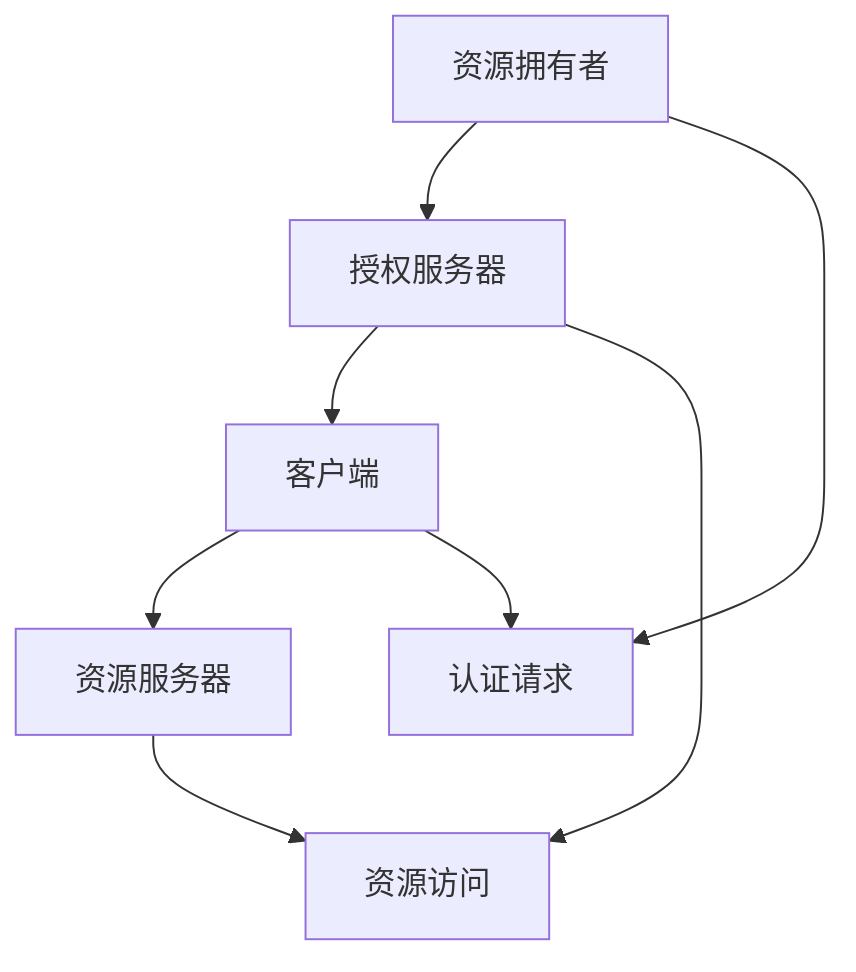

                 

# OAuth 2.0 的优点和实现

> 关键词：OAuth 2.0, 认证授权, 安全性, 可扩展性, RESTful API, 访问令牌, 角色管理

## 1. 背景介绍

### 1.1 问题由来

随着互联网和移动互联网的快速发展，Web和移动应用逐渐成为用户日常工作和生活中不可或缺的一部分。这些应用通常需要访问用户在其他服务提供商（如社交网络、邮件服务、云存储等）中的数据，以提供更加个性化的服务。

但这些数据往往高度敏感，如果直接将用户凭证（如用户名、密码）共享给每个应用，不仅增加了用户管理的负担，也存在严重的安全风险。传统的方式通常通过在应用中实现登录功能，让用户手动输入凭证，但这种方式容易出现凭证泄露、暴力破解等问题。

因此，需要一种安全、高效、可扩展的机制，在最小化用户管理负担的同时，确保用户数据的隐私和安全。OAuth 2.0就是这样一种机制，它通过授权码、令牌等方式，允许用户安全地授权第三方应用访问其在其他服务提供商中的数据。

### 1.2 问题核心关键点

OAuth 2.0的核心思想是：用户不直接将凭证共享给第三方应用，而是通过服务提供商作为中介，授权应用访问其数据。服务提供商充当"中间人"角色，验证应用的合法性，并根据用户的授权范围，生成访问令牌，允许应用访问用户数据。

OAuth 2.0的标准规范包括以下几个核心角色和组件：

- **资源拥有者（Resource Owner）**：即用户，其拥有需要授权的资源。
- **授权服务器（Authorization Server）**：服务提供商，负责处理授权请求和发放访问令牌。
- **客户端（Client）**：即第三方应用，需要访问用户数据的客户端应用。
- **资源服务器（Resource Server）**：用户数据的存储服务，必须支持OAuth 2.0认证授权机制。
- **访问令牌（Access Token）**：由授权服务器发放，允许客户端访问用户数据的令牌。
- **刷新令牌（Refresh Token）**：用于生成新的访问令牌，具有较长的有效期。
- **认证码（Authorization Code）**：用户授权给客户端应用后，授权服务器发放的认证码，用于后续的令牌获取。

这些角色和组件共同构成了OAuth 2.0的核心架构，用于处理认证授权请求和发放访问令牌。

### 1.3 问题研究意义

OAuth 2.0对于互联网和移动互联网应用的安全性和可扩展性具有重要意义：

1. **增强安全性**：通过授权机制，OAuth 2.0避免了直接共享凭证带来的安全风险，增强了用户数据的安全性。
2. **减少用户管理负担**：用户只需要一次授权，即可访问多个服务提供商，减少了凭证管理的复杂度。
3. **增强可扩展性**：OAuth 2.0的灵活设计使得其可以适应各种应用场景，支持多种授权模式和令牌类型，具有较强的可扩展性。
4. **促进用户数据共享**：OAuth 2.0机制使得用户数据可以安全地共享给第三方应用，促进了数据驱动的创新和应用发展。
5. **推动服务提供商的互操作性**：OAuth 2.0的标准化机制，使得不同服务提供商之间的数据共享和互操作性更加容易实现。

OAuth 2.0已经成为Web和移动互联网应用中最广泛采用的认证授权机制之一，对于构建安全的互联网生态具有重要意义。

## 2. 核心概念与联系

### 2.1 核心概念概述

OAuth 2.0的核心概念可以通过以下Mermaid流程图来展示：



这个流程图展示了OAuth 2.0的核心流程：

1. 资源拥有者（用户）发起认证请求，通过授权服务器进行授权。
2. 授权服务器验证客户端应用的合法性，发放认证码。
3. 客户端应用使用认证码，向授权服务器获取访问令牌。
4. 客户端应用使用访问令牌，向资源服务器访问用户数据。

### 2.2 概念间的关系

OAuth 2.0的核心概念之间存在着紧密的联系，形成了一个完整的认证授权机制。以下是各个核心概念的详细解释和它们之间的关系：

#### 2.2.1 授权流程

OAuth 2.0的授权流程包括以下几个步骤：

1. **认证请求**：资源拥有者发起认证请求，授权服务器验证用户身份。
2. **授权码获取**：授权服务器验证客户端应用的合法性，发放认证码。
3. **访问令牌获取**：客户端应用使用认证码，向授权服务器获取访问令牌。
4. **资源访问**：客户端应用使用访问令牌，向资源服务器访问用户数据。

每个步骤都依赖于其他步骤的结果，共同构成了完整的授权流程。

#### 2.2.2 授权模式

OAuth 2.0支持多种授权模式，包括授权码模式、隐式模式、密码模式、客户端凭证模式等。不同的授权模式适用于不同的应用场景，具有不同的优缺点。

- **授权码模式**：最常用的一种模式，适用于Web和移动应用。用户授权给客户端应用后，授权服务器发放认证码，客户端应用再使用认证码获取访问令牌。
- **隐式模式**：适用于移动应用和单页应用。用户授权给客户端应用后，授权服务器直接发放访问令牌，无需额外的认证码。
- **密码模式**：适用于桌面应用和设备管理。客户端应用通过用户名和密码向授权服务器进行认证，授权服务器发放访问令牌。
- **客户端凭证模式**：适用于服务到服务（S2S）的应用场景。客户端应用通过客户端凭证向授权服务器进行认证，授权服务器发放访问令牌。

#### 2.2.3 令牌类型

OAuth 2.0支持多种令牌类型，包括访问令牌、刷新令牌、授权码等。

- **访问令牌**：用于访问用户数据，有效期较短，每次请求都需要重新获取。
- **刷新令牌**：用于生成新的访问令牌，有效期较长，可以在失效后通过刷新令牌重新获取访问令牌。
- **授权码**：用于后续的令牌获取，有效期较短，每次请求都需要重新获取。

这些令牌类型的组合使用，使得OAuth 2.0机制能够适应各种应用场景和需求。

#### 2.2.4 角色管理

OAuth 2.0还支持角色管理，用于控制用户数据的访问权限。授权服务器可以根据用户的角色，决定其能够访问哪些资源。

- **角色**：定义用户的访问权限，如管理员、普通用户等。
- **角色映射**：将用户的角色映射到具体资源的操作权限上，如管理员可以读写所有资源，普通用户只能读取资源。

通过角色管理，OAuth 2.0机制能够更加灵活地控制用户数据的访问权限，增强系统的安全性。

## 3. 核心算法原理 & 具体操作步骤
### 3.1 算法原理概述

OAuth 2.0的核心算法原理是基于Token-based Authentication（基于Token的认证）的机制，主要通过访问令牌和刷新令牌来控制对用户数据的访问。其核心思想是通过授权服务器作为中介，控制客户端应用对用户数据的访问权限，确保数据的安全性和隐私性。

OAuth 2.0的认证授权流程可以概括为以下几个步骤：

1. **认证请求**：资源拥有者（用户）发起认证请求，授权服务器验证用户身份。
2. **授权码获取**：授权服务器验证客户端应用的合法性，发放认证码。
3. **访问令牌获取**：客户端应用使用认证码，向授权服务器获取访问令牌。
4. **资源访问**：客户端应用使用访问令牌，向资源服务器访问用户数据。

### 3.2 算法步骤详解

以下是OAuth 2.0认证授权的详细步骤：

1. **认证请求**：资源拥有者（用户）通过客户端应用发起认证请求，请求授权服务器验证其身份。
2. **授权码获取**：授权服务器验证客户端应用的合法性，验证通过后发放认证码（Code）。
3. **访问令牌获取**：客户端应用使用认证码，向授权服务器请求访问令牌（Access Token）。
4. **资源访问**：客户端应用使用访问令牌，向资源服务器访问用户数据。

具体步骤如下：

- **步骤1：认证请求**：
  - 用户通过客户端应用发起认证请求，请求URL包含客户端ID、重定向URL、作用域（Scope）等参数。
  - 授权服务器验证用户的合法性，验证通过后生成认证请求。

- **步骤2：授权码获取**：
  - 授权服务器向用户展示认证请求，用户确认授权。
  - 授权服务器验证客户端应用的合法性，验证通过后发放认证码（Code）。
  - 客户端应用使用认证码，向授权服务器请求访问令牌。

- **步骤3：访问令牌获取**：
  - 客户端应用将认证码（Code）提交给授权服务器，请求访问令牌（Access Token）。
  - 授权服务器验证认证码，验证通过后发放访问令牌（Access Token）和刷新令牌（Refresh Token）。

- **步骤4：资源访问**：
  - 客户端应用使用访问令牌（Access Token），向资源服务器访问用户数据。
  - 访问令牌有效期较短，每次请求都需要重新获取。
  - 刷新令牌有效期较长，可以在访问令牌失效后，通过刷新令牌重新获取访问令牌。

### 3.3 算法优缺点

OAuth 2.0作为一种基于Token的认证授权机制，具有以下优点：

1. **增强安全性**：通过授权机制，OAuth 2.0避免了直接共享凭证带来的安全风险，增强了用户数据的安全性。
2. **减少用户管理负担**：用户只需要一次授权，即可访问多个服务提供商，减少了凭证管理的复杂度。
3. **增强可扩展性**：OAuth 2.0的灵活设计使得其可以适应各种应用场景，支持多种授权模式和令牌类型，具有较强的可扩展性。
4. **促进用户数据共享**：OAuth 2.0机制使得用户数据可以安全地共享给第三方应用，促进了数据驱动的创新和应用发展。
5. **推动服务提供商的互操作性**：OAuth 2.0的标准化机制，使得不同服务提供商之间的数据共享和互操作性更加容易实现。

但OAuth 2.0也存在一些缺点：

1. **复杂性高**：OAuth 2.0机制相对复杂，需要同时处理认证请求、授权码、令牌等过程，增加了系统的复杂度。
2. **性能开销大**：OAuth 2.0的认证授权流程涉及到多个步骤和交互，增加了系统的性能开销。
3. **需要服务器支持**：OAuth 2.0机制需要授权服务器和资源服务器的支持，增加了系统的维护成本。

### 3.4 算法应用领域

OAuth 2.0机制广泛应用于Web和移动互联网应用中，包括：

- **社交网络**：如Facebook、Twitter等，允许用户授权第三方应用访问其社交数据。
- **云存储**：如Dropbox、Google Drive等，允许用户授权第三方应用访问其存储数据。
- **支付系统**：如PayPal、支付宝等，允许用户授权第三方应用访问其支付数据。
- **智能家居**：如Amazon Echo、Google Home等，允许用户授权第三方应用访问其智能设备。

这些应用场景中，用户数据高度敏感，直接共享凭证风险巨大，OAuth 2.0机制可以提供一种安全的、高效的认证授权方式。

## 4. 数学模型和公式 & 详细讲解  
### 4.1 数学模型构建

OAuth 2.0的认证授权机制可以通过数学模型来描述。假设客户端ID为client_id，客户端密钥为client_secret，用户ID为user_id，授权服务器ID为auth_server，资源服务器ID为resource_server。

令牌包括访问令牌（Access Token）和刷新令牌（Refresh Token），有效期分别为t_access和t_refresh，令牌发放后的时间分别为auth_time和issue_time。

### 4.2 公式推导过程

OAuth 2.0的认证授权过程可以通过以下公式来描述：

- **认证请求URL**：
  - `https://auth_server/auth/realm/user_id?client_id=client_id&redirect_uri=redirect_uri&scope=scope`
- **认证码获取**：
  - `https://auth_server/auth/code?code=code`
- **访问令牌获取**：
  - `https://auth_server/auth/token?code=code&grant_type=code&client_id=client_id&client_secret=client_secret&redirect_uri=redirect_uri`
- **资源访问**：
  - `https://resource_server/resource?access_token=access_token`

其中，认证请求URL、认证码获取、访问令牌获取和资源访问分别对应了OAuth 2.0的认证请求、授权码获取、访问令牌获取和资源访问四个步骤。

### 4.3 案例分析与讲解

以下是一个OAuth 2.0认证授权的案例分析：

1. **认证请求**：
   - 用户通过客户端应用发起认证请求，请求URL包含客户端ID、重定向URL、作用域（Scope）等参数。
   - 授权服务器验证用户的合法性，验证通过后生成认证请求。

2. **授权码获取**：
   - 授权服务器向用户展示认证请求，用户确认授权。
   - 授权服务器验证客户端应用的合法性，验证通过后发放认证码（Code）。
   - 客户端应用使用认证码，向授权服务器请求访问令牌。

3. **访问令牌获取**：
   - 客户端应用将认证码（Code）提交给授权服务器，请求访问令牌（Access Token）。
   - 授权服务器验证认证码，验证通过后发放访问令牌（Access Token）和刷新令牌（Refresh Token）。

4. **资源访问**：
   - 客户端应用使用访问令牌（Access Token），向资源服务器访问用户数据。
   - 访问令牌有效期较短，每次请求都需要重新获取。
   - 刷新令牌有效期较长，可以在访问令牌失效后，通过刷新令牌重新获取访问令牌。

## 5. 项目实践：代码实例和详细解释说明
### 5.1 开发环境搭建

OAuth 2.0的实践需要使用开源框架和工具进行实现。以下是使用Flask和Jwt实现的OAuth 2.0认证授权的开发环境搭建过程：

1. **安装Flask**：
   ```bash
   pip install flask
   ```

2. **安装Flask-JWT-Extended**：
   ```bash
   pip install flask-jwt-extended
   ```

3. **安装Flask-OAuthlib**：
   ```bash
   pip install Flask-OAuthlib
   ```

4. **安装Flask-OAuthlib-provider-OpenID-Connect**：
   ```bash
   pip install Flask-OAuthlib-provider-OpenID-Connect
   ```

5. **安装Flask-OAuthlib-provider-MySQL**：
   ```bash
   pip install Flask-OAuthlib-provider-MySQL
   ```

完成以上步骤后，即可在Python环境中进行OAuth 2.0认证授权的开发。

### 5.2 源代码详细实现

以下是使用Flask和Jwt实现的OAuth 2.0认证授权的Python代码实现：

```python
from flask import Flask, request
from flask_jwt_extended import JWTManager, create_access_token, get_jwt_identity, jwt_required, create_refresh_token, jwt_refresh_token_required
from flask_sqlalchemy import SQLAlchemy
from flask_oauthlib.provider import OAuth2Provider
from flask_oauthlib.provider import MySQLOAuth2Provider

app = Flask(__name__)
app.config['SQLALCHEMY_DATABASE_URI'] = 'sqlite:////tmp/test.db'
app.config['SECRET_KEY'] = 'secret'
app.config['JWT_SECRET_KEY'] = 'jwt_secret'

app.secret_key = app.config['JWT_SECRET_KEY']
app.config['JWT_ACCESS_TOKEN_EXPIRES'] = 3600
app.config['JWT_REFRESH_TOKEN_EXPIRES'] = 3600
app.config['JWT_PRIVATE_CLAIM'] = {'type': 'basic'}

db = SQLAlchemy(app)
jwt = JWTManager(app)
oauth = OAuth2Provider(app)

@app.route('/oauth/authorize', methods=['GET', 'POST'])
def authorize():
    username = request.args.get('username')
    password = request.args.get('password')
    user = User.query.filter_by(username=username).first()
    if user is None or not user.check_password(password):
        return jsonify({'message': 'Invalid username or password'}), 401
    auth_code = oauth.authorize(request)
    return jsonify({'auth_code': auth_code}), 200

@app.route('/oauth/token', methods=['POST'])
def token():
    auth_code = request.args.get('auth_code')
    refresh_token = create_refresh_token(identity=auth_code)
    access_token = create_access_token(identity=auth_code)
    return jsonify({'access_token': access_token, 'refresh_token': refresh_token}), 200

@app.route('/protected', methods=['GET'])
@jwt_required()
def protected():
    current_user = get_jwt_identity()
    return jsonify({'username': current_user}), 200

@app.route('/refresh-token', methods=['POST'])
@jwt_refresh_token_required
def refresh_token():
    refresh_token = request.args.get('refresh_token')
    new_access_token = create_access_token(identity=refresh_token)
    return jsonify({'access_token': new_access_token}), 200

if __name__ == '__main__':
    app.run(debug=True)
```

### 5.3 代码解读与分析

让我们再详细解读一下关键代码的实现细节：

**Flask和JWT的配置**：
- `app.config['SQLALCHEMY_DATABASE_URI']`：指定数据库连接字符串，这里使用SQLite数据库。
- `app.config['SECRET_KEY']`：指定Flask应用和JWT加密的密钥，这里使用`jwt_secret`。
- `app.secret_key`：设置Flask应用的密钥，这里使用`jwt_secret`。

**Flask-JWT-Extended的配置**：
- `app.config['JWT_ACCESS_TOKEN_EXPIRES']`：设置访问令牌的有效期，这里设置为3600秒。
- `app.config['JWT_REFRESH_TOKEN_EXPIRES']`：设置刷新令牌的有效期，这里设置为3600秒。
- `app.config['JWT_PRIVATE_CLAIM']`：设置JWT的私有声明，这里设置为`basic`。

**OAuth2Provider的实现**：
- `oauth.authorize(request)`：处理认证请求，返回认证码。
- `create_access_token(identity=auth_code)`：根据认证码发放访问令牌。
- `create_refresh_token(identity=auth_code)`：根据认证码发放刷新令牌。
- `create_access_token(identity=refresh_token)`：根据刷新令牌发放新的访问令牌。

**Flask的路由实现**：
- `/oauth/authorize`：处理认证请求，返回认证码。
- `/oauth/token`：处理令牌获取请求，返回访问令牌和刷新令牌。
- `/protected`：受保护的路由，需要访问令牌才能访问。
- `/refresh-token`：处理令牌刷新请求，返回新的访问令牌。

完成以上步骤后，即可在本地运行OAuth 2.0认证授权的Flask应用，进行实际测试。

### 5.4 运行结果展示

假设我们在本地运行OAuth 2.0认证授权的Flask应用，在访问`/protected`路由时，会返回以下JSON响应：

```json
{
  "username": "user1"
}
```

这表明用户已经成功通过OAuth 2.0认证授权，获得了访问令牌，可以访问受保护的资源。

## 6. 实际应用场景
### 6.1 智能客服系统

基于OAuth 2.0的认证授权机制，智能客服系统可以实现安全的用户数据访问和共享。用户登录智能客服系统后，可以选择授权第三方应用访问其聊天记录和用户画像。第三方应用通过OAuth 2.0机制获取访问令牌，即可访问用户数据，提供更加个性化的服务。

### 6.2 金融舆情监测

OAuth 2.0机制可以用于金融舆情监测系统的用户数据授权。用户在金融舆情监测系统注册后，可以选择授权第三方应用访问其财务数据和行为数据。第三方应用通过OAuth 2.0机制获取访问令牌，即可访问用户数据，分析用户行为和情绪，提供个性化的金融服务。

### 6.3 个性化推荐系统

OAuth 2.0机制可以用于个性化推荐系统的用户数据授权。用户在推荐系统注册后，可以选择授权第三方应用访问其行为数据和兴趣爱好数据。第三方应用通过OAuth 2.0机制获取访问令牌，即可访问用户数据，分析用户行为和兴趣爱好，提供个性化的推荐结果。

### 6.4 未来应用展望

随着OAuth 2.0机制的广泛应用，其在Web和移动互联网领域将发挥越来越重要的作用。未来，OAuth 2.0机制将不断优化和扩展，支持更多的授权模式和令牌类型，满足更多场景的需求。同时，OAuth 2.0机制的互操作性也将进一步增强，不同服务提供商之间的数据共享和互操作性更加容易实现。

此外，OAuth 2.0机制还将与其他身份认证和授权机制，如SAML、LDAP等，进一步融合，提供更加全面的用户身份管理解决方案。

总之，OAuth 2.0机制在未来将扮演越来越重要的角色，成为Web和移动互联网应用中不可或缺的身份认证和授权机制。

## 7. 工具和资源推荐
### 7.1 学习资源推荐

为了帮助开发者系统掌握OAuth 2.0的原理和实现，这里推荐一些优质的学习资源：

1. **OAuth 2.0官方文档**：OAuth 2.0的标准化文档，详细介绍了OAuth 2.0的各个组件和流程，是学习OAuth 2.0的必备资料。
2. **OAuth 2.0实战指南**：一个完整的OAuth 2.0实践教程，从原理到实现，全面介绍OAuth 2.0的各个环节。
3. **OAuth 2.0深入解析**：深入解析OAuth 2.0的核心算法和流程，提供丰富的案例分析和代码示例。
4. **OAuth 2.0与JWT的整合**：详细介绍OAuth 2.0和JWT的整合过程，提供实用的开发技巧和最佳实践。
5. **OAuth 2.0框架比较**：比较分析OAuth 2.0的各个框架和库，推荐最适合自己项目的工具。

通过对这些学习资源的学习实践，相信你一定能够快速掌握OAuth 2.0的精髓，并用于解决实际的认证授权问题。

### 7.2 开发工具推荐

OAuth 2.0的开发需要使用各种框架和工具。以下是几款常用的OAuth 2.0开发工具：

1. **Flask**：Python的轻量级Web框架，易于扩展和定制，适合开发OAuth 2.0认证授权系统。
2. **JWT**：用于生成和解析JWT令牌的工具，支持多种加密算法和私有声明。
3. **OAuthlib**：Python的OAuth 2.0框架，支持多种授权模式和令牌类型，易于集成和使用。
4. **Flask-JWT-Extended**：Flask应用的JWT扩展，提供了完整的JWT管理功能。
5. **Flask-OAuthlib-provider-MySQL**：Flask应用的OAuth 2.0提供商MySQL实现，支持MySQL数据库的用户管理。

合理利用这些工具，可以显著提升OAuth 2.0认证授权系统的开发效率，加快创新迭代的步伐。

### 7.3 相关论文推荐

OAuth 2.0的研究源于学界的持续研究。以下是几篇奠基性的相关论文，推荐阅读：

1. **OAuth 2.0协议规范**：OAuth 2.0的标准化协议规范，详细介绍了OAuth 2.0的各个组件和流程，是OAuth 2.0的核心文档。
2. **OAuth 2.0安全性分析**：分析OAuth 2.0的安全性漏洞和攻击方式，提供了实用的防护建议。
3. **OAuth 2.0性能优化**：讨论OAuth 2.0的性能瓶颈和优化方法，提供实用的开发技巧和最佳实践。
4. **OAuth 2.0扩展性分析**：分析OAuth 2.0的扩展性需求和实现方法，提供了灵活的设计方案。
5. **OAuth 2.0与JWT的整合**：详细探讨OAuth 2.0和JWT的整合过程，提供了实用的开发技巧和最佳实践。

这些论文代表了大规模身份认证和授权机制的研究进展，可以帮助研究者掌握前沿技术，提升实际应用能力。

除上述资源外，还有一些值得关注的前沿资源，帮助开发者紧跟OAuth 2.0机制的最新进展，例如：

1. **OAuth 2.0预印本**：人工智能领域最新研究成果的发布平台，包括大量尚未发表的前沿工作，学习前沿技术的必读资源。
2. **OAuth 2.0顶级会议**：OAuth 2.0的顶级会议，如IEEE、ACM等，可以聆听顶尖学者的分享，开拓视野。
3. **OAuth 2.0社区**：OAuth 2.0的开发者社区，交流经验、分享成果，提供持续的技术支持。
4. **OAuth 2.0开源项目**：在GitHub上Star、Fork数最多的OAuth 2.0相关项目，往往代表了该技术领域的发展趋势和最佳实践，值得去学习和贡献。

总之，OAuth 2.0机制的研究和实现需要开发者保持开放的心态和持续学习的意愿。多关注前沿资讯，多动手实践，多思考总结，必将收获满满的成长收益。

## 8. 总结：未来发展趋势与挑战
### 8.1 研究成果总结

OAuth 2.0作为一种基于Token的认证授权机制，在Web和移动互联网领域得到了广泛应用，成为许多应用中不可或缺的身份认证和授权方式。OAuth 2.0机制通过授权服务器作为中介，控制客户端应用对用户数据的访问

