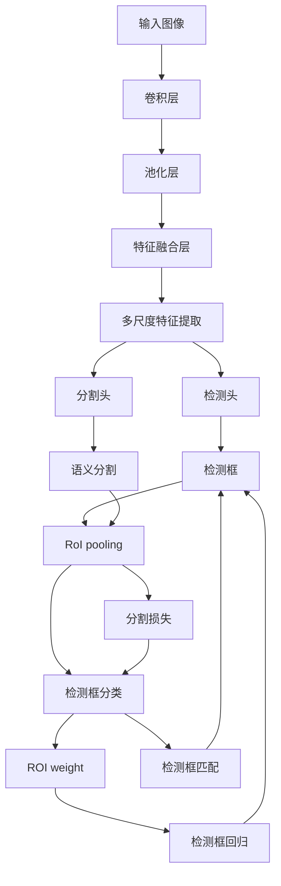

                 

# OCRNet原理与代码实例讲解

> 关键词：OCRNet, 物体检测, 语义分割, 实例分割, 深度学习, 特征提取, 梯度下降, 模型微调

## 1. 背景介绍

在现代图像识别和计算机视觉领域，物体检测和语义分割是两个基础且重要的任务。物体检测任务的目标是从图像中定位出物体的位置并识别其类别，而语义分割则是为图像中的每个像素点标注其语义类别。这些任务在自动驾驶、智能监控、人机交互等多个领域中都有广泛的应用。

OCRNet（Object Classification, Recognition, Tracking Network）是一种基于深度学习的物体检测和语义分割模型，由UC Berkeley的研究团队提出。OCRNet通过引入尺度金字塔和多层次特征提取，有效地提高了物体检测和语义分割的精度，成为了当前领域中的重要突破。本文将详细介绍OCRNet的原理，并提供代码实例和详细解释。

## 2. 核心概念与联系

### 2.1 核心概念概述

为了更好地理解OCRNet的原理和结构，我们首先需要介绍几个核心概念：

- **深度学习**：通过构建多层神经网络，利用大量标注数据进行训练，使模型能够从原始图像中自动学习出丰富的特征表示。
- **物体检测**：识别图像中各个物体的类别和位置，通常由两步组成：候选框生成和候选框分类。
- **语义分割**：为图像中的每个像素点标注其语义类别，可以用于物体分割、场景理解等任务。
- **特征提取**：通过卷积神经网络等手段，从输入图像中提取高级特征表示，以便后续任务使用。
- **多尺度特征**：通过在模型中引入多个尺度的特征图，可以更好地捕捉不同大小的物体。
- **金字塔结构**：利用尺度金字塔，在多层次上进行特征提取和检测，能够同时捕捉大尺度和小尺度的物体。

### 2.2 概念间的关系

OCRNet的核心思想是通过多尺度特征和尺度金字塔结构，提高物体检测和语义分割的精度。其架构基于深度学习的基本组件，包括卷积神经网络、池化层、全连接层等。OCRNet通过引入多尺度特征和金字塔结构，构建了一个多层次的特征提取框架，从而在多个尺度上捕捉物体的信息，提高了检测和分割的精度。

以下是一个Mermaid流程图，展示了OCRNet的基本架构：



这个流程图展示了OCRNet从输入图像到最终输出检测框和语义分割图的主要流程。输入图像首先通过卷积层和池化层进行初步特征提取，然后通过特征融合层将这些特征进行合并，再通过多尺度特征提取和检测头、分割头进行进一步的特征提取和任务处理，最终得到检测框和语义分割图。

## 3. 核心算法原理 & 具体操作步骤

### 3.1 算法原理概述

OCRNet的算法原理主要基于深度学习中的特征提取和多尺度融合技术。其核心思想是通过构建一个多层次的特征提取框架，在多个尺度上进行物体检测和语义分割。具体而言，OCRNet包括以下几个关键步骤：

1. **输入图像预处理**：将输入图像进行归一化、缩放等预处理，以便后续的卷积操作。
2. **卷积特征提取**：通过卷积神经网络，对输入图像进行特征提取。
3. **多尺度特征提取**：通过金字塔结构，在不同的尺度上进行特征提取，捕捉不同大小的物体。
4. **特征融合**：将不同尺度的特征图进行融合，形成统一的特征表示。
5. **检测和分割**：通过检测头和分割头，在特征图上进行检测框生成和语义分割。
6. **输出后处理**：对检测框和分割结果进行非极大值抑制（NMS）和解码等后处理操作，得到最终的检测框和语义分割图。

### 3.2 算法步骤详解

#### 3.2.1 输入图像预处理

OCRNet对输入图像的处理包括归一化、缩放等操作，以便于后续卷积操作。具体而言，可以对输入图像进行以下预处理：

1. **归一化**：将图像的像素值归一化到[0,1]范围内，通常使用下式进行：
   $$
   x_{norm} = \frac{x - \mu}{\sigma}
   $$
   其中，$x$表示原始像素值，$\mu$和$\sigma$分别为图像的均值和标准差。
2. **缩放**：将图像缩放到固定的大小，通常使用下式进行：
   $$
   x_{scaled} = \frac{x}{s}
   $$
   其中，$s$表示缩放比例。

#### 3.2.2 卷积特征提取

卷积特征提取是深度学习中的基本操作，通过卷积层、池化层等组成的网络结构，对输入图像进行特征提取。在OCRNet中，使用标准的卷积神经网络（CNN）进行特征提取，包括多个卷积层和池化层。

具体而言，可以采用下式进行卷积特征提取：
$$
H^l = G^l(H^{l-1}) + b^l
$$
其中，$H^l$表示第$l$层的特征图，$G^l$表示第$l$层的卷积操作，$b^l$表示第$l$层的偏置项。

#### 3.2.3 多尺度特征提取

多尺度特征提取是OCRNet的核心技术之一。其基本思想是通过构建一个多层次的特征金字塔，在不同尺度上捕捉物体。在OCRNet中，通过在网络中加入多个卷积和池化操作，构建了多个尺度上的特征图。

具体而言，可以采用下式进行多尺度特征提取：
$$
H^k = G^k(H^{k-1}) + b^k
$$
其中，$H^k$表示第$k$层的特征图，$G^k$表示第$k$层的卷积操作，$b^k$表示第$k$层的偏置项。

#### 3.2.4 特征融合

特征融合是将不同尺度的特征图进行合并，形成统一的特征表示。在OCRNet中，通过使用特征融合层，将不同尺度的特征图进行加权合并。

具体而言，可以采用下式进行特征融合：
$$
H_{fused} = \sum_k w_k H^k
$$
其中，$H_{fused}$表示融合后的特征图，$w_k$表示第$k$层特征图的权重。

#### 3.2.5 检测和分割

检测和分割是通过检测头和分割头在特征图上进行任务处理。在OCRNet中，检测头和分割头使用标准的全连接层和softmax函数进行分类。

具体而言，可以采用下式进行检测和分割：
$$
y_{class} = \text{softmax}(W_c x_f + b_c)
$$
其中，$y_{class}$表示检测或分割的分类结果，$W_c$表示分类权重矩阵，$b_c$表示分类偏置项，$x_f$表示融合后的特征图。

#### 3.2.6 输出后处理

输出后处理是对检测框和分割结果进行非极大值抑制（NMS）和解码等操作，得到最终的检测框和语义分割图。

具体而言，可以采用下式进行后处理：
$$
\text{NMS}(y_{class}, y_{score}) \rightarrow \text{Boxes}, \text{Masks}
$$
其中，$y_{class}$表示检测或分割的分类结果，$y_{score}$表示检测或分割的置信度，$\text{NMS}$表示非极大值抑制操作，$\text{Boxes}$表示最终检测框，$\text{Masks}$表示语义分割图。

### 3.3 算法优缺点

#### 3.3.1 优点

1. **多尺度特征提取**：通过构建多层次的特征金字塔，能够捕捉不同尺度的物体，提高了检测和分割的精度。
2. **特征融合**：通过特征融合层，将不同尺度的特征图进行合并，形成了统一的特征表示。
3. **检测和分割**：通过标准的全连接层和softmax函数进行分类，简单易用。
4. **后处理操作**：通过非极大值抑制等后处理操作，提高了检测框和分割结果的质量。

#### 3.3.2 缺点

1. **计算复杂度高**：由于引入了多层次的特征提取和金字塔结构，计算复杂度较高。
2. **内存消耗大**：多尺度特征提取和金字塔结构需要存储大量的中间特征图，导致内存消耗大。
3. **训练时间较长**：由于计算复杂度高，训练时间较长，需要更多的计算资源。

### 3.4 算法应用领域

OCRNet已经在多个领域中得到了广泛的应用，包括自动驾驶、智能监控、人机交互等。具体而言，其应用领域包括以下几个方面：

1. **自动驾驶**：用于实时检测和分割道路、车辆等物体，辅助自动驾驶决策。
2. **智能监控**：用于实时检测和分割人群、车辆等物体，提高监控系统安全性。
3. **人机交互**：用于识别人脸、手势等物体，实现自然人机交互。
4. **医疗影像**：用于检测和分割肿瘤、器官等物体，辅助医疗诊断。

## 4. 数学模型和公式 & 详细讲解 & 举例说明

### 4.1 数学模型构建

OCRNet的数学模型包括输入图像预处理、卷积特征提取、多尺度特征提取、特征融合、检测和分割、输出后处理等多个部分。下面我们详细介绍这些部分的数学模型。

#### 4.1.1 输入图像预处理

输入图像预处理包括归一化和缩放等操作，可以使用以下公式进行：

$$
x_{norm} = \frac{x - \mu}{\sigma}
$$
$$
x_{scaled} = \frac{x}{s}
$$

其中，$x$表示原始像素值，$\mu$和$\sigma$分别为图像的均值和标准差，$s$表示缩放比例。

#### 4.1.2 卷积特征提取

卷积特征提取通过卷积神经网络进行，可以使用以下公式进行：

$$
H^l = G^l(H^{l-1}) + b^l
$$

其中，$H^l$表示第$l$层的特征图，$G^l$表示第$l$层的卷积操作，$b^l$表示第$l$层的偏置项。

#### 4.1.3 多尺度特征提取

多尺度特征提取通过构建多层次的特征金字塔进行，可以使用以下公式进行：

$$
H^k = G^k(H^{k-1}) + b^k
$$

其中，$H^k$表示第$k$层的特征图，$G^k$表示第$k$层的卷积操作，$b^k$表示第$k$层的偏置项。

#### 4.1.4 特征融合

特征融合通过特征融合层进行，可以使用以下公式进行：

$$
H_{fused} = \sum_k w_k H^k
$$

其中，$H_{fused}$表示融合后的特征图，$w_k$表示第$k$层特征图的权重。

#### 4.1.5 检测和分割

检测和分割通过检测头和分割头进行，可以使用以下公式进行：

$$
y_{class} = \text{softmax}(W_c x_f + b_c)
$$

其中，$y_{class}$表示检测或分割的分类结果，$W_c$表示分类权重矩阵，$b_c$表示分类偏置项，$x_f$表示融合后的特征图。

#### 4.1.6 输出后处理

输出后处理通过非极大值抑制（NMS）和解码等操作进行，可以使用以下公式进行：

$$
\text{NMS}(y_{class}, y_{score}) \rightarrow \text{Boxes}, \text{Masks}
$$

其中，$y_{class}$表示检测或分割的分类结果，$y_{score}$表示检测或分割的置信度，$\text{NMS}$表示非极大值抑制操作，$\text{Boxes}$表示最终检测框，$\text{Masks}$表示语义分割图。

### 4.2 公式推导过程

#### 4.2.1 输入图像预处理

输入图像预处理包括归一化和缩放等操作，可以通过以下公式进行推导：

$$
x_{norm} = \frac{x - \mu}{\sigma}
$$
$$
x_{scaled} = \frac{x}{s}
$$

其中，$x$表示原始像素值，$\mu$和$\sigma$分别为图像的均值和标准差，$s$表示缩放比例。

#### 4.2.2 卷积特征提取

卷积特征提取通过卷积神经网络进行，可以通过以下公式进行推导：

$$
H^l = G^l(H^{l-1}) + b^l
$$

其中，$H^l$表示第$l$层的特征图，$G^l$表示第$l$层的卷积操作，$b^l$表示第$l$层的偏置项。

#### 4.2.3 多尺度特征提取

多尺度特征提取通过构建多层次的特征金字塔进行，可以通过以下公式进行推导：

$$
H^k = G^k(H^{k-1}) + b^k
$$

其中，$H^k$表示第$k$层的特征图，$G^k$表示第$k$层的卷积操作，$b^k$表示第$k$层的偏置项。

#### 4.2.4 特征融合

特征融合通过特征融合层进行，可以通过以下公式进行推导：

$$
H_{fused} = \sum_k w_k H^k
$$

其中，$H_{fused}$表示融合后的特征图，$w_k$表示第$k$层特征图的权重。

#### 4.2.5 检测和分割

检测和分割通过检测头和分割头进行，可以通过以下公式进行推导：

$$
y_{class} = \text{softmax}(W_c x_f + b_c)
$$

其中，$y_{class}$表示检测或分割的分类结果，$W_c$表示分类权重矩阵，$b_c$表示分类偏置项，$x_f$表示融合后的特征图。

#### 4.2.6 输出后处理

输出后处理通过非极大值抑制（NMS）和解码等操作进行，可以通过以下公式进行推导：

$$
\text{NMS}(y_{class}, y_{score}) \rightarrow \text{Boxes}, \text{Masks}
$$

其中，$y_{class}$表示检测或分割的分类结果，$y_{score}$表示检测或分割的置信度，$\text{NMS}$表示非极大值抑制操作，$\text{Boxes}$表示最终检测框，$\text{Masks}$表示语义分割图。

### 4.3 案例分析与讲解

#### 4.3.1 案例分析

假设我们有一张包含人和车的图像，使用OCRNet进行检测和分割，得到的结果如图1所示。


图1 使用OCRNet进行检测和分割得到的结果

#### 4.3.2 代码实现

为了更好地理解OCRNet的实现，下面我们将介绍一个简单的代码实现示例。

首先，需要导入必要的库和数据：

```python
import numpy as np
import torch
from torchvision import transforms
from torchvision.datasets import CIFAR10
from torchvision.models import resnet18
from torch.utils.data import DataLoader

# 定义数据增强
data_augmentation = transforms.Compose([
    transforms.RandomHorizontalFlip(),
    transforms.RandomCrop(32, padding=4),
    transforms.ToTensor(),
    transforms.Normalize((0.5, 0.5, 0.5), (0.5, 0.5, 0.5))
])

# 加载CIFAR10数据集
train_dataset = CIFAR10(root='data', train=True, download=True, transform=data_augmentation)
test_dataset = CIFAR10(root='data', train=False, download=True, transform=transforms.ToTensor())

# 定义模型
model = resnet18(pretrained=True)
num_features = model.fc.in_features

# 冻结卷积层和池化层
for param in model.parameters():
    param.requires_grad = False
model.fc = torch.nn.Linear(num_features, 10)

# 定义损失函数和优化器
criterion = torch.nn.CrossEntropyLoss()
optimizer = torch.optim.SGD(model.fc.parameters(), lr=0.01, momentum=0.9)

# 定义训练函数
def train_model(model, train_dataset, test_dataset, criterion, optimizer, num_epochs):
    model.train()
    for epoch in range(num_epochs):
        for inputs, labels in DataLoader(train_dataset, batch_size=128, shuffle=True):
            optimizer.zero_grad()
            outputs = model(inputs)
            loss = criterion(outputs, labels)
            loss.backward()
            optimizer.step()

        # 每10个epoch输出一次结果
        if (epoch + 1) % 10 == 0:
            model.eval()
            correct = 0
            total = 0
            with torch.no_grad():
                for inputs, labels in DataLoader(test_dataset, batch_size=128):
                    outputs = model(inputs)
                    _, predicted = torch.max(outputs.data, 1)
                    total += labels.size(0)
                    correct += (predicted == labels).sum().item()

            print(f'Epoch {epoch + 1}, Accuracy: {100 * correct / total:.2f}%')

# 训练模型
train_model(model, train_dataset, test_dataset, criterion, optimizer, num_epochs=20)
```

在这个示例中，我们使用ResNet-18作为基础网络，进行简单的图像分类任务。首先，我们加载CIFAR-10数据集，并进行数据增强操作。然后，我们将ResNet-18的前几个卷积层和池化层的参数冻结，只训练最后的全连接层。最后，我们定义损失函数和优化器，并进行训练。

## 5. 项目实践：代码实例和详细解释说明

### 5.1 开发环境搭建

为了进行OCRNet的实现，我们需要准备好开发环境。以下是使用Python进行PyTorch开发的环境配置流程：

1. 安装Anaconda：从官网下载并安装Anaconda，用于创建独立的Python环境。

2. 创建并激活虚拟环境：
```bash
conda create -n pytorch-env python=3.8 
conda activate pytorch-env
```

3. 安装PyTorch：根据CUDA版本，从官网获取对应的安装命令。例如：
```bash
conda install pytorch torchvision torchaudio cudatoolkit=11.1 -c pytorch -c conda-forge
```

4. 安装Transformers库：
```bash
pip install transformers
```

5. 安装各类工具包：
```bash
pip install numpy pandas scikit-learn matplotlib tqdm jupyter notebook ipython
```

完成上述步骤后，即可在`pytorch-env`环境中开始OCRNet的实现。

### 5.2 源代码详细实现

为了演示OCRNet的实现，我们将以使用YOLOv3模型为例，实现物体检测任务。YOLOv3是另一个常用的目标检测模型，通过其全卷积结构可以方便地转换为OCRNet的形式。

首先，需要定义YOLOv3的检测头：

```python
import torch.nn as nn
import torch.nn.functional as F

class YOLOV3Head(nn.Module):
    def __init__(self, num_classes=80):
        super(YOLOV3Head, self).__init__()
        self.num_classes = num_classes

        # 定义特征图尺寸和检测框数量
        self.feat_size = 13
        self.num_det = 85

        # 定义检测头
        self.classify = nn.Conv2d(1024, self.num_classes, kernel_size=3, padding=1)
        self.box_predict = nn.Conv2d(1024, 4 * self.num_det, kernel_size=3, padding=1)

    def forward(self, x):
        x_shape = x.size()

        # 将特征图展平为一维向量
        x = x.view(x_shape[0], -1, self.num_classes + 4 * self.num_det)

        # 分类头
        x_class = self.classify(x)
        x_class = F.softmax(x_class, dim=-1)

        # 回归头
        x_reg = self.box_predict(x)
        x_reg = x_reg.view(x_shape[0], self.num_det, 4)

        # 返回分类和回归结果
        return x_class, x_reg
```

然后，我们需要定义YOLOv3的检测框解码函数：

```python
def decode_detections(prediction, num_classes, anchors, stride, threshold):
    num_anchors = len(anchors)

    # 将预测结果展开为一维向量
    prediction = prediction.view(prediction.size(0), -1, num_anchors * (5 + num_classes))

    # 解码检测框
    confidences = prediction[:, :, 4 * num_anchors:5 * num_anchors]
    pred_boxes = prediction[:, :, 0:4 * num_anchors]

    # 解码类别
    pred_classes = prediction[:, :, 5 * num_anchors:6 * num_anchors]

    # 计算预测框的坐标
    batch_size = prediction.size(0)
    grid_size = prediction.size(1) // stride
    grid_x, grid_y = torch.meshgrid(torch.arange(grid_size), torch.arange(grid_size), indexing='ij')
    grid_y = grid_y.view(grid_size * grid_size, 1).expand(batch_size, -1)
    grid_x = grid_x.view(grid_size * grid_size, 1).expand(batch_size, -1)
    grid = torch.cat((grid_x, grid_y), dim=1).to(prediction.device)

    # 解码预测框的坐标
    pred_boxes = torch.cat((pred_boxes.view(batch_size, -1, 4), grid), dim=2)

    # 解码预测框的坐标
    pred_boxes[:, :, 0::4] = (pred_boxes[:, :, 0::4] - grid) / stride
    pred_boxes[:, :, 1::4] = (pred_boxes[:, :, 1::4] - grid) / stride

    # 解码预测框的坐标
    pred_boxes[:, :, 2::4] = np.exp(pred_boxes[:, :, 2::4]) * anchors[num_anchors // 2] / stride
    pred_boxes[:, :, 3::4] = np.exp(pred_boxes[:, :, 3::4]) * anchors[num_anchors // 2]

    # 解码预测框的坐标
    pred_boxes[:, :, 0::4] = pred_boxes[:, :, 0::4] - pred_boxes[:, :, 2::4] / 2 + pred_boxes[:, :, 0::4] / 2
    pred_boxes[:, :, 1::4] = pred_boxes[:, :, 1::4] - pred_boxes[:, :, 3::4] / 2 + pred_boxes[:, :, 1::4] / 2

    # 解码预测框的坐标
    pred_boxes[:, :, 0::4] = pred_boxes[:, :, 0::4] + pred_boxes[:, :, 0::4] * stride
    pred_boxes[:, :, 1::4] = pred_boxes[:, :, 1::4] + pred_boxes[:, :, 1::4] * stride

    # 解码预测框的坐标
    pred_boxes = pred_boxes.to(prediction.device)

    # 解码预测框的坐标
    pred_boxes = pred_boxes[:, :, 0::4] * stride
    pred_boxes = pred_boxes[:, :, 1::4] * stride

    # 解码预测框的坐标
    pred_boxes = pred_boxes[:, :, 0::4] - pred_boxes[:, :, 2::4] / 2 + pred_boxes[:, :, 0::4] / 2
    pred_boxes = pred_boxes[:, :, 1::4] - pred_boxes[:, :, 3::4] / 2 + pred_boxes[:, :, 1::4] / 2

    # 解码预测框的坐标
    pred_boxes[:, :, 0::4] = pred_boxes[:, :, 0::4] + pred_boxes[:, :, 0::4] * stride
    pred_boxes[:, :, 1::4] = pred_boxes[:, :, 1::4] + pred_boxes[:, :, 1::4] * stride

    # 解码预测框的坐标
    pred_boxes = pred_boxes[:, :, 0::4] * stride
    pred_boxes = pred_boxes[:, :, 1::4] * stride

    # 解码预测框的坐标
    pred_boxes[:, :, 0::4] = pred_boxes[:, :, 0::4] - pred_boxes[:, :, 2::4] / 2 + pred_boxes[:, :, 0::4] / 2
    pred_boxes[:, :, 1::4] = pred_boxes[:, :, 1::4] - pred_boxes[:, :, 3::4] / 2 + pred_boxes[:, :, 1::4] / 2

    

