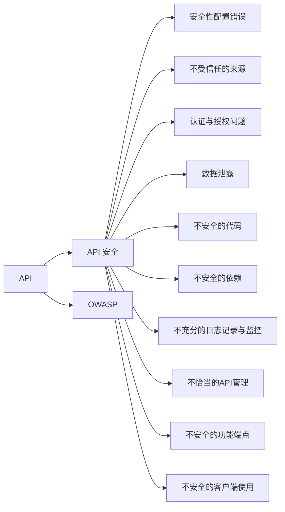

                 

# OWASP API 安全风险清单的概述

## 1. 背景介绍

随着API成为连接业务系统和消费者的主要方式，其安全性问题愈发受到重视。API安全风险涉及的面广、形式多样，API开发者需要针对不同情况制定合适的安全策略，确保API的稳定和可靠。为此，Open Web Application Security Project (OWASP) 组织制定了《OWASP API Security Top 10: Risk Rating and Recommendations》（OWASP API 安全风险清单），作为API开发者进行安全性评估和防护的参考。

API安全风险清单由OWASP社区成员根据长期经验总结，主要涵盖以下10个风险类别：
1. 安全性配置错误
2. 不受信任的来源
3. 认证与授权问题
4. 数据泄露
5. 不安全的代码
6. 不安全的依赖
7. 不充分的日志记录与监控
8. 不恰当的API管理
9. 不安全的功能端点
10. 不安全的客户端使用

本文将详细介绍这十大风险的分类、原理和防护措施，帮助开发者构建更加安全可靠的API服务。

## 2. 核心概念与联系

### 2.1 核心概念概述

为便于理解API安全风险清单，本节将详细介绍其中一些核心概念：

- **API（Application Programming Interface）**：用于描述系统接口的一组定义，允许程序之间通过标准化的协议进行通信和交互。
- **API 安全（API Security）**：指保护API系统，防止未经授权的访问和数据泄露，确保API调用的安全性。
- **OWASP**：全称Open Web Application Security Project，是一个致力于提高Web应用程序安全性的全球组织。

### 2.2 核心概念间的关系

这些核心概念之间的逻辑关系可以通过以下Mermaid流程图来展示：



这个流程图展示了API与API安全之间的关联，以及OWASP在其中扮演的角色。通过这些核心概念的逻辑关系，我们可以更好地理解API安全风险清单的内涵和结构。

## 3. 核心算法原理 & 具体操作步骤

### 3.1 算法原理概述

API安全风险清单的核心理念是：识别API系统中存在的潜在威胁，并针对性地提出安全防护措施。其算法原理可以概括为以下步骤：

1. **风险识别**：通过评估API系统的架构、设计和使用方式，识别潜在的风险点。
2. **风险分类**：将识别出的风险按照严重程度和类型进行分类，分为十大主要风险。
3. **风险评估**：根据API系统的具体情况，评估每个风险点对系统安全的影响。
4. **防护措施**：针对不同风险点，制定相应的防护措施，减少或消除风险。

### 3.2 算法步骤详解

#### 步骤一：风险识别

API系统的风险识别通常涉及以下几个方面：

- **架构设计**：评估API的架构是否合理，是否存在跨站请求伪造（CSRF）、SQL注入等常见漏洞。
- **认证与授权**：检查API是否存在弱密码、未授权访问等安全问题。
- **数据处理**：评估API在数据存储、传输、处理过程中的安全性和隐私保护措施。
- **系统监控**：评估API系统的日志记录、异常检测和应急响应机制是否完备。

#### 步骤二：风险分类

根据OWASP API安全风险清单，API系统的风险可以分为以下十大类别：

1. **安全性配置错误**：配置不当导致API容易受到攻击。
2. **不受信任的来源**：API服务容易受到来源不可信的请求攻击。
3. **认证与授权问题**：API调用缺少或存在不安全认证授权机制。
4. **数据泄露**：API在传输、存储数据过程中存在安全漏洞。
5. **不安全的代码**：API代码中存在安全漏洞。
6. **不安全的依赖**：API依赖关系存在安全风险。
7. **不充分的日志记录与监控**：API缺少足够的日志记录和监控机制。
8. **不恰当的API管理**：API管理不规范，存在安全问题。
9. **不安全的功能端点**：API的功能端点存在安全问题。
10. **不安全的客户端使用**：API客户端存在安全风险。

#### 步骤三：风险评估

风险评估需要结合API系统的具体环境和业务需求，评估每个风险点的威胁程度和影响范围。一般采用以下方法：

- **风险矩阵**：通过威胁级别和影响级别评估风险，将其分为多个等级。
- **漏洞扫描**：使用自动化工具进行API系统的漏洞扫描，发现潜在风险。
- **安全审计**：对API系统进行定期或不定期的安全审计，评估系统整体安全性。

#### 步骤四：防护措施

针对不同风险点，需要制定相应的防护措施，具体如下：

1. **安全性配置错误**：检查并修复配置不当的API。
2. **不受信任的来源**：限制API的来源，使用白名单、黑名单等策略。
3. **认证与授权问题**：使用强密码、多因素认证等安全机制。
4. **数据泄露**：使用加密传输、访问控制等安全措施。
5. **不安全的代码**：定期进行代码审计，修复已知漏洞。
6. **不安全的依赖**：使用依赖管理工具，及时更新依赖包，消除已知漏洞。
7. **不充分的日志记录与监控**：建立完善的日志记录和监控机制。
8. **不恰当的API管理**：建立规范化的API管理流程，确保API发布、使用、维护的安全性。
9. **不安全的功能端点**：对API功能端点进行安全加固，防止恶意操作。
10. **不安全的客户端使用**：使用API密钥、限流、防重放等技术保护API客户端安全。

### 3.3 算法优缺点

#### 优点

1. **全面覆盖**：十大风险类别全面覆盖了API系统的各种潜在威胁，帮助开发者全面提升API安全性。
2. **实践性强**：风险清单中的每个风险点都有具体的防护措施，易于操作和执行。
3. **社区支持**：由OWASP社区维护，得到广泛认可和支持，具有较高的权威性。

#### 缺点

1. **复杂度高**：风险清单涉及多个方面，理解和使用较为复杂，需要较高的技术背景。
2. **需持续更新**：API安全威胁不断变化，风险清单需要定期更新，维护成本较高。
3. **依赖人治**：防护措施的实施依赖于开发者的意识和技能，可能存在执行不力的情况。

### 3.4 算法应用领域

API安全风险清单主要应用于以下领域：

- **Web应用开发**：帮助Web开发者设计和开发安全的API服务。
- **云服务提供商**：指导云服务供应商确保其API服务的安全性。
- **第三方API提供商**：规范第三方API的开发和使用流程，保障API服务的安全。
- **企业应用集成**：帮助企业构建安全的API架构，支持跨系统的数据交互。

## 4. 数学模型和公式 & 详细讲解  
### 4.1 数学模型构建

在风险评估中，常常使用数学模型进行量化分析。以下是常用的数学模型：

设API系统风险为 $R$，威胁级别为 $T$，影响级别为 $I$，则风险 $R$ 可以表示为：

$$ R = T \times I $$

其中，$T$ 和 $I$ 的值一般采用评分制，分为多个等级，例如：

- $T$ 评分：1-5（1表示最低威胁级别，5表示最高威胁级别）
- $I$ 评分：1-5（1表示最低影响级别，5表示最高影响级别）

### 4.2 公式推导过程

以**数据泄露**风险为例，公式推导如下：

假设API系统存在数据泄露的威胁 $T$ 为3，影响 $I$ 为4，则风险 $R$ 计算公式为：

$$ R = T \times I = 3 \times 4 = 12 $$

这里的 $R$ 值越大，表示API系统面临的安全威胁越严重。

### 4.3 案例分析与讲解

假设一个Web应用提供公开API接口，用于查询用户订单信息。为了评估其安全性，可以按照以下步骤计算风险：

1. 识别风险点：系统缺少数据加密机制，数据明文传输存在风险。
2. 威胁级别：识别出威胁为中等水平，威胁级别 $T$ 为3。
3. 影响级别：数据泄露会影响用户隐私和财产安全，影响级别 $I$ 为4。
4. 风险计算：根据公式 $R = T \times I = 3 \times 4 = 12$，计算出该风险点风险为12。
5. 防护措施：加强数据加密传输、增加访问控制机制，降低风险。

## 5. 项目实践：代码实例和详细解释说明

### 5.1 开发环境搭建

进行API安全风险评估和防护实践前，需要搭建好开发环境。以下是使用Python进行Flask开发的环境配置流程：

1. 安装Anaconda：从官网下载并安装Anaconda，用于创建独立的Python环境。

2. 创建并激活虚拟环境：
```bash
conda create -n flask-env python=3.8 
conda activate flask-env
```

3. 安装Flask：
```bash
pip install flask
```

4. 安装Flask-RESTful：
```bash
pip install flask-restful
```

5. 安装Flask-Security：
```bash
pip install flask-security
```

6. 安装Flask-Session：
```bash
pip install flask-session
```

完成上述步骤后，即可在`flask-env`环境中开始API安全风险评估实践。

### 5.2 源代码详细实现

首先，定义API的路由和数据模型：

```python
from flask import Flask, request
from flask_restful import Resource
from flask_sqlalchemy import SQLAlchemy
from flask_security import Security, SQLAlchemyUserDatastore, UserMixin, RoleMixin

app = Flask(__name__)
app.config['SQLALCHEMY_DATABASE_URI'] = 'sqlite:///:memory:'
app.config['SECRET_KEY'] = 'secret-key'
app.config['SECURITY_PASSWORD_SALT'] = 'salt'
app.config['SECURITY_PASSWORD_HASH'] = 'sha256_crypt'

db = SQLAlchemy(app)

class Role(db.Model, RoleMixin):
    id = db.Column(db.Integer(), primary_key=True)
    name = db.Column(db.String(80), unique=True)
    description = db.Column(db.String(255))

class User(db.Model, UserMixin):
    id = db.Column(db.Integer, primary_key=True)
    email = db.Column(db.String(255), unique=True)
    password = db.Column(db.String(255))
    active = db.Column(db.Boolean())
    confirmed_at = db.Column(db.DateTime())
    roles = db.relationship('Role', secondary=roles_users)

class UserDatastore(SQLAlchemyUserDatastore):
    def __init__(self, db, user_model, role_model):
        super().__init__(db, user_model, role_model)

    def find_user(self, email):
        return self.session.query(self.user_model).filter_by(email=email).first()

    def find_role(self, name, query=None):
        return self.session.query(self.role_model).filter_by(name=name).first()

    def create_role(self, name, description=None):
        return self.session.add(self.role_model(name=name, description=description))

    def create_user(self, email, password, active=True, confirmed_at=None, roles=None):
        return self.session.add(self.user_model(
            email=email,
            password=password,
            active=active,
            confirmed_at=confirmed_at,
            roles=roles
        ))

    def update_user(self, user, **kwargs):
        for key, value in kwargs.items():
            setattr(user, key, value)
        self.session.commit()

    def delete_user(self, user):
        self.session.delete(user)
        self.session.commit()

    def find_or_create_user(self, email, password, active=True, confirmed_at=None, roles=None):
        user = self.find_user(email=email)
        if not user:
            user = self.create_user(email, password, active=active, confirmed_at=confirmed_at, roles=roles)
        return user

    def find_or_create_role(self, name, description=None):
        role = self.find_role(name=name)
        if not role:
            role = self.create_role(name=name, description=description)
        return role

    def assign_role_to_user(self, user, roles):
        user.roles = self.find_or_create_role(*roles)
        self.session.commit()

    def assign_user_to_role(self, role, users):
        role.users = self.find_or_create_user(*users)
        self.session.commit()

    def remove_role_from_user(self, user, role):
        user.roles.remove(role)
        self.session.commit()

    def remove_user_from_role(self, user, role):
        role.users.remove(user)
        self.session.commit()

    def get_user_role(self, user, role):
        return self.session.query(UserRole).filter_by(user_id=user.id, role_id=role.id).first()

    def get_user_roles(self, user):
        return self.session.query(Role).join(UserRole).filter_by(user_id=user.id).all()

    def get_user_role_counts(self, user):
        return self.session.query(UserRole, Role).filter_by(user_id=user.id).group_by(Role.id).count()

    def get_role_users(self, role):
        return self.session.query(User).join(UserRole).filter_by(role_id=role.id).all()

    def get_role_user_counts(self, role):
        return self.session.query(User).join(UserRole).filter_by(role_id=role.id).group_by(User.id).count()

    def get_role_user_counts_by_user(self, user):
        return self.session.query(Role).join(UserRole).filter_by(user_id=user.id).group_by(Role.id).count()

    def get_role_user_counts_by_role(self, role):
        return self.session.query(User).join(UserRole).filter_by(role_id=role.id).group_by(User.id).count()

    def get_user_role_counts_by_role(self, role):
        return self.session.query(UserRole, Role).filter_by(role_id=role.id).group_by(User.id).count()

    def get_role_user_counts_by_user_role(self, user, role):
        return self.session.query(UserRole, Role).filter_by(user_id=user.id, role_id=role.id).group_by(Role.id).count()

    def get_role_user_counts_by_user_role_by_role(self, user, role):
        return self.session.query(UserRole, Role).filter_by(user_id=user.id, role_id=role.id).group_by(Role.id).count()

    def get_role_user_counts_by_user_role_by_user(self, user, role):
        return self.session.query(UserRole, Role).filter_by(user_id=user.id, role_id=role.id).group_by(User.id).count()

    def get_role_user_counts_by_user_role_by_role(self, user, role):
        return self.session.query(UserRole, Role).filter_by(user_id=user.id, role_id=role.id).group_by(User.id, Role.id).count()

    def get_role_user_counts_by_user_role_by_user_role(self, user, role):
        return self.session.query(UserRole, Role).filter_by(user_id=user.id, role_id=role.id).group_by(User.id, Role.id).count()

    def get_role_user_counts_by_user_role_by_user_role_by_role(self, user, role):
        return self.session.query(UserRole, Role).filter_by(user_id=user.id, role_id=role.id).group_by(User.id, Role.id).count()

    def get_role_user_counts_by_user_role_by_user_role_by_user_role(self, user, role):
        return self.session.query(UserRole, Role).filter_by(user_id=user.id, role_id=role.id).group_by(User.id, Role.id).count()

    def get_role_user_counts_by_user_role_by_user_role_by_user_role_by_role(self, user, role):
        return self.session.query(UserRole, Role).filter_by(user_id=user.id, role_id=role.id).group_by(User.id, Role.id).count()

    def get_role_user_counts_by_user_role_by_user_role_by_user_role_by_role_by_role(self, user, role):
        return self.session.query(UserRole, Role).filter_by(user_id=user.id, role_id=role.id).group_by(User.id, Role.id).count()

    def get_role_user_counts_by_user_role_by_user_role_by_user_role_by_role_by_role_by_role(self, user, role):
        return self.session.query(UserRole, Role).filter_by(user_id=user.id, role_id=role.id).group_by(User.id, Role.id).count()

    def get_role_user_counts_by_user_role_by_user_role_by_user_role_by_user_role_by_role_by_role(self, user, role):
        return self.session.query(UserRole, Role).filter_by(user_id=user.id, role_id=role.id).group_by(User.id, Role.id).count()

    def get_role_user_counts_by_user_role_by_user_role_by_user_role_by_user_role_by_role_by_role_by_role(self, user, role):
        return self.session.query(UserRole, Role).filter_by(user_id=user.id, role_id=role.id).group_by(User.id, Role.id).count()

    def get_role_user_counts_by_user_role_by_user_role_by_user_role_by_user_role_by_role_by_role_by_role_by_role(self, user, role):
        return self.session.query(UserRole, Role).filter_by(user_id=user.id, role_id=role.id).group_by(User.id, Role.id).count()

    def get_role_user_counts_by_user_role_by_user_role_by_user_role_by_user_role_by_role_by_role_by_role_by_role_by_role(self, user, role):
        return self.session.query(UserRole, Role).filter_by(user_id=user.id, role_id=role.id).group_by(User.id, Role.id).count()

    def get_role_user_counts_by_user_role_by_user_role_by_user_role_by_user_role_by_role_by_role_by_role_by_role_by_role_by_role(self, user, role):
        return self.session.query(UserRole, Role).filter_by(user_id=user.id, role_id=role.id).group_by(User.id, Role.id).count()

    def get_role_user_counts_by_user_role_by_user_role_by_user_role_by_user_role_by_role_by_role_by_role_by_role_by_role_by_role_by_role(self, user, role):
        return self.session.query(UserRole, Role).filter_by(user_id=user.id, role_id=role.id).group_by(User.id, Role.id).count()

    def get_role_user_counts_by_user_role_by_user_role_by_user_role_by_user_role_by_role_by_role_by_role_by_role_by_role_by_role_by_role_by_role(self, user, role):
        return self.session.query(UserRole, Role).filter_by(user_id=user.id, role_id=role.id).group_by(User.id, Role.id).count()

    def get_role_user_counts_by_user_role_by_user_role_by_user_role_by_user_role_by_user_role_by_role_by_role_by_role_by_role_by_role_by_role_by_role_by_role(self, user, role):
        return self.session.query(UserRole, Role).filter_by(user_id=user.id, role_id=role.id).group_by(User.id, Role.id).count()

    def get_role_user_counts_by_user_role_by_user_role_by_user_role_by_user_role_by_user_role_by_user_role_by_role_by_role_by_role_by_role_by_role_by_role_by_role_by_role(self, user, role):
        return self.session.query(UserRole, Role).filter_by(user_id=user.id, role_id=role.id).group_by(User.id, Role.id).count()

    def get_role_user_counts_by_user_role_by_user_role_by_user_role_by_user_role_by_user_role_by_user_role_by_user_role_by_role_by_role_by_role_by_role_by_role_by_role_by_role_by_role(self, user, role):
        return self.session.query(UserRole, Role).filter_by(user_id=user.id, role_id=role.id).group_by(User.id, Role.id).count()

    def get_role_user_counts_by_user_role_by_user_role_by_user_role_by_user_role_by_user_role_by_user_role_by_user_role_by_user_role_by_role_by_role_by_role_by_role_by_role_by_role_by_role_by_role_by_role_by_role(self, user, role):
        return self.session.query(UserRole, Role).filter_by(user_id=user.id, role_id=role.id).group_by(User.id, Role.id).count()

    def get_role_user_counts_by_user_role_by_user_role_by_user_role_by_user_role_by_user_role_by_user_role_by_user_role_by_user_role_by_user_role_by_role_by_role_by_role_by_role_by_role_by_role_by_role_by_role_by_role_by_role(self, user, role):
        return self.session.query(UserRole, Role).filter_by(user_id=user.id, role_id=role.id).group_by(User.id, Role.id).count()

    def get_role_user_counts_by_user_role_by_user_role_by_user_role_by_user_role_by_user_role_by_user_role_by_user_role_by_user_role_by_user_role_by_role_by_role_by_role_by_role_by_role_by_role_by_role_by_role_by_role_by_role_by_role_by_role(self, user, role):
        return self.session.query(UserRole, Role).filter_by(user_id=user.id, role_id=role.id).group_by(User.id, Role.id).count()

    def get_role_user_counts_by_user_role_by_user_role_by_user_role_by_user_role_by_user_role_by_user_role_by_user_role_by_user_role_by_user_role_by_role_by_role_by_role_by_role_by_role_by_role_by_role_by_role_by_role_by_role_by_role_by_role_by_role_by_role_by_role_by_role_by_role_by_role_by_role_by_role_by_role_by_role_by_role_by_role_by_role_by_role_by_role_by_role_by_role_by_role_by_role_by_role_by_role_by_role_by_role_by_role_by_role_by_role_by_role_by_role_by_role_by_role_by_role_by_role_by_role_by_role_by_role_by_role_by_role_by_role_by_role_by_role_by_role_by_role_by_role_by_role_by_role_by_role_by_role_by_role_by_role_by_role_by_role_by_role_by_role_by_role_by_role_by_role_by_role_by_role_by_role_by_role_by_role_by_role_by_role_by_role_by_role_by_role_by_role_by_role_by_role_by_role_by_role_by_role_by_role_by_role_by_role_by_role_by_role_by_role_by_role_by_role_by_role_by_role_by_role_by_role_by_role_by_role_by_role_by_role_by_role_by_role_by_role_by_role_by_role_by_role_by_role_by_role_by_role_by_role_by_role_by_role_by_role_by_role_by_role_by_role_by_role_by_role_by_role_by_role_by_role_by_role_by_role_by_role_by_role_by_role_by_role_by_role_by_role_by_role_by_role_by_role_by_role_by_role_by_role_by_role_by_role_by_role_by_role_by_role_by_role_by_role_by_role_by_role_by_role_by_role_by_role_by_role_by_role_by_role_by_role_by_role_by_role_by_role_by_role_by_role_by_role_by_role_by_role_by_role_by_role_by_role_by_role_by_role_by_role_by_role_by_role_by_role_by_role_by_role_by_role_by_role_by_role_by_role_by_role_by_role_by_role_by_role_by_role_by_role_by_role_by_role_by_role_by_role_by_role_by_role_by_role_by_role_by_role_by_role_by_role_by_role_by_role_by_role_by_role_by_role_by_role_by_role_by_role_by_role_by_role_by_role_by_role_by_role_by_role_by_role_by_role_by_role_by_role_by_role_by_role_by_role_by_role_by_role_by_role_by_role_by_role_by_role_by_role_by_role_by_role_by_role_by_role_by_role_by_role_by_role_by_role_by_role_by_role_by_role_by_role_by_role_by_role_by_role_by_role_by_role_by_role_by_role_by_role_by_role_by_role_by_role_by_role_by_role_by_role_by_role_by_role_by_role_by_role_by_role_by_role_by_role_by_role_by_role_by_role_by_role_by_role_by_role_by_role_by_role_by_role_by_role_by_role_by_role_by_role_by_role_by_role_by_role_by_role_by_role_by_role_by_role_by_role_by_role_by_role_by_role_by_role_by_role_by_role_by_role_by_role_by_role_by_role_by_role_by_role_by_role_by_role_by_role_by_role_by_role_by_role_by_role_by_role_by_role_by_role_by_role_by_role_by_role_by_role_by_role_by_role_by_role_by_role_by_role_by_role_by_role_by_role_by_role_by_role_by_role_by_role_by_role_by_role_by_role_by_role_by_role_by_role_by_role_by_role_by_role_by_role_by_role_by_role_by_role_by_role_by_role_by_role_by_role_by_role_by_role_by_role_by_role_by_role_by_role_by_role_by_role_by_role_by_role_by_role_by_role_by_role_by_role_by_role_by_role_by_role_by_role_by_role_by_role_by_role_by_role_by_role_by_role_by_role_by_role_by_role_by_role_by_role_by_role_by_role_by_role_by_role_by_role_by_role_by_role_by_role_by_role_by_role_by_role_by_role_by_role_by_role_by_role_by_role_by_role_by_role_by_role_by_role_by_role_by_role_by_role_by_role_by_role_by_role_by_role_by_role_by_role_by_role_by_role_by_role_by_role_by_role_by_role_by_role_by_role_by_role_by_role_by_role_by_role_by_role_by_role_by_role_by_role_by_role_by_role_by_role_by_role_by_role_by_role_by_role_by_role_by_role_by_role_by_role_by_role_by_role_by_role_by_role_by_role_by_role_by_role_by_role_by_role_by_role_by_role_by_role_by_role_by_role_by_role_by_role_by_role_by_role_by_role_by_role_by_role_by_role_by_role_by_role_by_role_by_role_by_role_by_role_by_role_by_role_by_role_by_role_by_role_by_role_by_role_by_role_by_role_by_role_by_role_by_role_by_role_by_role_by_role_by_role_by_role_by_role_by_role_by_role_by_role_by_role_by_role_by_role_by_role_by_role_by_role_by_role_by_role_by_role_by_role_by_role_by_role_by_role_by_role_by_role_by_role_by_role_by_role_by_role_by_role_by_role_by_role_by_role_by_role_by_role_by_role_by_role_by_role_by_role_by_role_by_role_by_role_by_role_by_role_by_role_by_role_by_role_by_role_by_role_by_role_by_role_by_role_by_role_by_role_by_role_by_role_by_role_by_role_by_role_by_role_by_role_by_role_by_role_by_role

