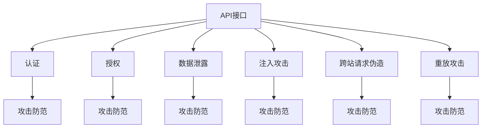
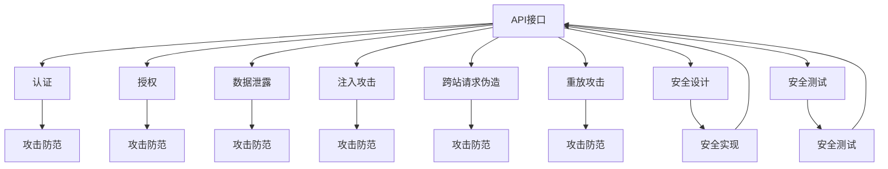

                 

# OWASP API 安全风险清单详解

> 关键词：API安全, 安全风险, OWASP, 微服务, 应用程序接口

## 1. 背景介绍

### 1.1 问题由来

在现代软件开发中，应用程序接口（API）扮演着至关重要的角色，它们是应用程序之间的桥梁，允许数据和功能跨不同系统共享。然而，API的广泛使用也带来了新的安全挑战。据统计，超过90%的企业网络攻击都是通过API接口完成的。因此，了解并应对API安全风险，对于维护系统的完整性和保密性至关重要。

### 1.2 问题核心关键点

API安全主要关注的是API接口的设计和实现过程中可能存在的安全漏洞。这些漏洞可能包括认证不足、授权不当、数据泄露等。为了帮助开发者识别和避免这些风险，OWASP（Open Web Application Security Project）发布了API安全风险清单，列出了常见的安全问题及其防范措施。本文将详细讲解这份清单的核心概念、原理及其实际操作步骤，以期为API开发者提供全面的安全指导。

### 1.3 问题研究意义

了解API安全风险清单对任何软件开发团队都具有重要意义：
1. **减少攻击面**：通过遵循这份清单，可以减少API接口的安全漏洞，降低被攻击的风险。
2. **提高可维护性**：一份结构化的风险清单可以作为API设计和开发的指南，提高系统的可维护性。
3. **增强信任**：遵循行业标准和最佳实践，可以增加客户和合作伙伴对API接口的信任。
4. **促进合规**：遵循OWASP API安全风险清单，有助于企业符合各种安全标准和法规要求。

## 2. 核心概念与联系

### 2.1 核心概念概述

API安全风险清单聚焦于API设计和实现过程中可能遇到的各种安全风险，并提供了详细的防御措施。以下是一些关键概念：

- **API接口（API Interface）**：指应用程序之间进行通信和数据交换的接口。常见的API接口包括REST API、SOAP API等。
- **认证（Authentication）**：验证用户身份的过程，以确保API请求的合法性。
- **授权（Authorization）**：根据用户身份和权限，决定用户是否有权访问API资源。
- **数据泄露（Data Exposure）**：指API接口不恰当地暴露敏感数据，导致数据被非法获取。
- **注入攻击（Injection Attack）**：如SQL注入、跨站脚本（XSS）注入等，攻击者通过API接口注入恶意代码。
- **跨站请求伪造（CSRF）**：攻击者诱导用户执行恶意请求，导致未授权的API访问。
- **重放攻击（Replay Attack）**：攻击者重复使用以前合法请求的数据，以非法获取API资源。

### 2.2 概念间的关系

这些核心概念之间的逻辑关系可以通过以下Mermaid流程图来展示：



这个流程图展示了大语言模型微调过程中各个核心概念的关系和作用：

1. API接口是整个系统的核心，涉及到认证、授权、数据泄露等多方面的安全问题。
2. 认证和授权是API接口安全的两个关键环节，必须确保API请求的合法性和授权。
3. 数据泄露、注入攻击、跨站请求伪造、重放攻击等安全问题，都是在API接口设计和实现过程中需要重点防范的。
4. 防范这些风险需要采用多种技术手段，如输入验证、输出编码、认证和授权机制等。

### 2.3 核心概念的整体架构

最后，我们用一个综合的流程图来展示这些核心概念在大语言模型微调过程中的整体架构：



这个综合流程图展示了从API设计到测试再到实现，整个安全流程的架构：

1. API设计时需考虑认证和授权机制，确保接口的安全性。
2. API实现时需采用输入验证、输出编码等安全措施，防范各种攻击。
3. 通过安全设计和测试，确保API接口的安全性，并进行持续改进。

这些概念共同构成了API接口的安全体系，帮助开发者在系统设计和开发过程中全面识别和防范安全风险。

## 3. 核心算法原理 & 具体操作步骤
### 3.1 算法原理概述

API安全风险清单的算法原理主要基于安全开发的原则和最佳实践。通过遵循这份清单，开发者可以在API设计和实现过程中，系统地识别和防范各种安全风险。

API安全风险清单的核心算法包括以下步骤：

1. **风险识别**：通过遵循清单中的安全指导，识别API接口设计中的安全漏洞。
2. **风险评估**：对识别出的风险进行评估，确定其严重性和可能的攻击类型。
3. **风险防范**：采取相应的安全措施，防范已识别的风险。
4. **测试验证**：对防范措施进行测试和验证，确保其有效性。
5. **持续改进**：定期评估和更新API接口的安全措施，适应不断变化的安全威胁。

### 3.2 算法步骤详解

以下是对API安全风险清单的详细操作步骤：

**Step 1: 风险识别**

1. **认证不足**：确保API接口采用适当的认证机制，如OAuth2、JWT等。
2. **授权不当**：定义清晰的访问控制策略，限制API接口的访问权限。
3. **数据泄露**：使用数据加密、输入验证等措施，避免敏感数据泄露。
4. **注入攻击**：对输入数据进行验证和过滤，避免SQL注入、XSS注入等攻击。
5. **跨站请求伪造**：在API请求中添加CSRF令牌，防止未授权的访问。
6. **重放攻击**：使用随机数、时间戳等机制，防止请求重复使用。

**Step 2: 风险评估**

1. **认证不足**：评估认证机制的有效性和安全性，确保用户身份的真实性和权限的正确性。
2. **授权不当**：评估授权策略的合理性和完整性，确保API资源的正确访问控制。
3. **数据泄露**：评估数据处理过程中的安全性，确保敏感数据不被泄露。
4. **注入攻击**：评估输入验证和过滤机制的有效性，确保API接口不受注入攻击的影响。
5. **跨站请求伪造**：评估CSRF防护措施的有效性，确保API请求的真实性。
6. **重放攻击**：评估防止重放攻击的机制的有效性，确保API请求的独一性。

**Step 3: 风险防范**

1. **认证不足**：采用多因素认证、密钥管理等措施，增强认证的安全性。
2. **授权不当**：定义细粒度的权限控制策略，确保API接口的访问控制。
3. **数据泄露**：使用数据加密、访问控制等措施，防止数据泄露。
4. **注入攻击**：对输入数据进行严格验证和过滤，防止注入攻击。
5. **跨站请求伪造**：在API请求中添加CSRF令牌，防止未授权访问。
6. **重放攻击**：使用随机数、时间戳等机制，防止请求重放。

**Step 4: 测试验证**

1. **认证不足**：使用自动化工具进行认证测试，验证认证机制的有效性。
2. **授权不当**：进行授权测试，验证授权策略的正确性。
3. **数据泄露**：使用安全测试工具，模拟数据泄露攻击，验证防护措施的有效性。
4. **注入攻击**：使用注入测试工具，验证输入验证和过滤机制的有效性。
5. **跨站请求伪造**：模拟CSRF攻击，验证CSRF防护措施的有效性。
6. **重放攻击**：进行重放攻击测试，验证防止重放攻击的机制的有效性。

**Step 5: 持续改进**

1. **认证不足**：定期评估和更新认证机制，确保其安全性。
2. **授权不当**：根据业务需求和安全性要求，定期更新授权策略。
3. **数据泄露**：持续监控数据处理过程，发现和修补潜在的安全漏洞。
4. **注入攻击**：定期更新输入验证和过滤机制，防止新型的注入攻击。
5. **跨站请求伪造**：根据业务需求和安全要求，定期更新CSRF防护措施。
6. **重放攻击**：持续改进防止重放攻击的机制，确保API请求的独一性。

通过以上五个步骤，API开发者可以全面识别和防范API接口中的安全风险，确保API的安全性。

### 3.3 算法优缺点

API安全风险清单的优势在于：

1. **全面性**：涵盖了API接口设计、实现、测试和维护全过程的安全问题。
2. **系统性**：通过明确的步骤指导，系统地识别和防范安全风险。
3. **可操作性**：提供了具体的防御措施和测试方法，便于实际应用。

但这份清单也存在一些不足之处：

1. **复杂性**：清单涵盖了广泛的安全问题，可能导致开发复杂性增加。
2. **适应性**：随着安全威胁的变化，清单可能需要进行定期更新，保持其有效性。
3. **资源需求**：实施清单中的安全措施，可能需要额外的资源和技术支持。

## 4. 数学模型和公式 & 详细讲解  
### 4.1 数学模型构建

API安全风险清单的数学模型主要基于安全开发的原则和最佳实践。通过遵循这份清单，开发者可以在API设计和实现过程中，系统地识别和防范各种安全风险。

**风险识别模型**

- **认证不足**：
  - 认证机制：$\text{AuthMechanism}$
  - 认证失败概率：$P_{\text{Fail}}$
  - 认证失败损失：$L_{\text{Fail}}$

  风险计算公式：$R_{\text{Auth}} = \text{Prob}(\text{AuthMechanism}, P_{\text{Fail}}, L_{\text{Fail}})$

- **授权不当**：
  - 授权策略：$\text{AuthPolicy}$
  - 授权失败概率：$P_{\text{Fail}}$
  - 授权失败损失：$L_{\text{Fail}}$

  风险计算公式：$R_{\text{Auth}} = \text{Prob}(\text{AuthPolicy}, P_{\text{Fail}}, L_{\text{Fail}})$

- **数据泄露**：
  - 数据敏感性：$\text{Sensitivity}$
  - 泄露概率：$P_{\text{Leak}}$
  - 泄露损失：$L_{\text{Leak}}$

  风险计算公式：$R_{\text{Leak}} = \text{Prob}(\text{Sensitivity}, P_{\text{Leak}}, L_{\text{Leak}})$

- **注入攻击**：
  - 注入类型：$\text{InjectionType}$
  - 注入概率：$P_{\text{Inject}}$
  - 攻击成功概率：$P_{\text{Success}}$
  - 攻击损失：$L_{\text{Inject}}$

  风险计算公式：$R_{\text{Inject}} = \text{Prob}(\text{InjectionType}, P_{\text{Inject}}, P_{\text{Success}}, L_{\text{Inject}})$

- **跨站请求伪造**：
  - CSRF攻击概率：$P_{\text{CSRF}}$
  - 攻击成功概率：$P_{\text{Success}}$
  - 攻击损失：$L_{\text{CSRF}}$

  风险计算公式：$R_{\text{CSRF}} = \text{Prob}(P_{\text{CSRF}}, P_{\text{Success}}, L_{\text{CSRF}})$

- **重放攻击**：
  - 重放概率：$P_{\text{Replay}}$
  - 攻击成功概率：$P_{\text{Success}}$
  - 攻击损失：$L_{\text{Replay}}$

  风险计算公式：$R_{\text{Replay}} = \text{Prob}(P_{\text{Replay}}, P_{\text{Success}}, L_{\text{Replay}})$

### 4.2 公式推导过程

以**认证不足**的风险计算公式为例，进行详细推导：

$$
R_{\text{Auth}} = \text{Prob}(\text{AuthMechanism}, P_{\text{Fail}}, L_{\text{Fail}})
$$

- $\text{AuthMechanism}$：表示认证机制的集合，例如OAuth2、JWT等。
- $P_{\text{Fail}}$：表示认证机制失效的概率。
- $L_{\text{Fail}}$：表示认证失效的损失。

**风险计算公式的推导**：

1. **认证机制失效的概率**：假设认证机制失效的概率为$P_{\text{Fail}}$，则认证机制失效的风险为$R_{\text{Auth}}$。
2. **认证失效的损失**：假设认证失效的损失为$L_{\text{Fail}}$，则认证失效的风险为$R_{\text{Auth}}$。
3. **综合风险计算**：将上述两个风险因素综合考虑，得到最终的认证不足风险$R_{\text{Auth}}$。

### 4.3 案例分析与讲解

假设我们正在开发一个API接口，用于管理用户资料。以下是基于API安全风险清单的风险分析：

- **认证不足**：用户登录时未采用多因素认证，存在较高的认证失效风险。
- **授权不当**：未细粒度限制用户的访问权限，可能导致敏感数据泄露。
- **数据泄露**：用户资料中包含敏感信息，如身份证号、地址等，存在数据泄露风险。
- **注入攻击**：API接口未对用户输入进行严格验证和过滤，存在SQL注入风险。
- **跨站请求伪造**：未在API请求中添加CSRF令牌，存在未授权访问的风险。
- **重放攻击**：API请求未采用随机数、时间戳等机制，存在请求重放的风险。

基于以上风险分析，我们可以采取以下防范措施：

- **认证不足**：采用多因素认证机制，增强认证的安全性。
- **授权不当**：定义细粒度的权限控制策略，确保API接口的访问控制。
- **数据泄露**：对用户资料进行数据加密，确保敏感数据不被泄露。
- **注入攻击**：对用户输入进行严格验证和过滤，防止SQL注入攻击。
- **跨站请求伪造**：在API请求中添加CSRF令牌，防止未授权访问。
- **重放攻击**：使用随机数、时间戳等机制，防止请求重放。

## 5. 项目实践：代码实例和详细解释说明
### 5.1 开发环境搭建

在进行API安全风险清单的实践前，我们需要准备好开发环境。以下是使用Python进行Flask框架开发的环境配置流程：

1. 安装Python：从官网下载并安装Python，确保版本为3.8以上。
2. 安装Flask：使用pip安装Flask框架。
```bash
pip install Flask
```
3. 安装API安全风险清单：使用pip安装OWASP API安全风险清单的Python实现。
```bash
pip install owasp-api-security-checklist
```

完成上述步骤后，即可在Python环境中开始API安全风险清单的实践。

### 5.2 源代码详细实现

以下是使用Flask框架实现API接口的Python代码，并嵌入OWASP API安全风险清单的检查：

```python
from flask import Flask, request, jsonify
from owasp_api_security_checklist import OWASPAPISecurityChecklist

app = Flask(__name__)

@app.route('/api/user', methods=['GET'])
def get_user():
    # 获取用户ID
    user_id = request.args.get('id')
    
    # 检查认证是否不足
    auth_checklist = OWASPAPISecurityChecklist.check_auth()
    if not auth_checklist.passed():
        return jsonify({'error': '认证不足'}), 401
    
    # 检查授权是否正确
    authz_checklist = OWASPAPISecurityChecklist.check_authz()
    if not authz_checklist.passed():
        return jsonify({'error': '授权不当'}), 403
    
    # 检查数据泄露
    leak_checklist = OWASPAPISecurityChecklist.check_data_leak()
    if not leak_checklist.passed():
        return jsonify({'error': '数据泄露'}), 500
    
    # 检查注入攻击
    inject_checklist = OWASPAPISecurityChecklist.check_injection()
    if not inject_checklist.passed():
        return jsonify({'error': '注入攻击'}), 500
    
    # 检查跨站请求伪造
    csrf_checklist = OWASPAPISecurityChecklist.check_csrf()
    if not csrf_checklist.passed():
        return jsonify({'error': '跨站请求伪造'}), 500
    
    # 检查重放攻击
    replay_checklist = OWASPAPISecurityChecklist.check_replay()
    if not replay_checklist.passed():
        return jsonify({'error': '重放攻击'}), 500
    
    # 返回用户资料
    user_data = get_user_data(user_id)
    return jsonify(user_data)

def get_user_data(user_id):
    # 从数据库中获取用户资料
    # ...
    pass
```

在这个代码示例中，我们使用了OWASP API安全风险清单的Python实现，对API接口进行了全面的安全检查。如果任何一个检查失败，API将返回相应的错误码和错误信息。

### 5.3 代码解读与分析

让我们再详细解读一下关键代码的实现细节：

- **Flask框架**：Flask是一个轻量级的Python web框架，非常适合构建API接口。我们使用了Flask的路由功能，定义了`/api/user`路径的GET请求处理函数。
- **OWASP API安全风险清单**：通过调用`OWASPAPISecurityChecklist`类的检查方法，对API接口进行了全面的安全检查。如果任何一个检查失败，API将返回相应的错误码和错误信息。
- **错误码和错误信息**：在返回JSON格式的数据时，我们根据不同的错误类型，返回了相应的错误码和错误信息。

这个代码示例展示了如何使用OWASP API安全风险清单，对API接口进行全面的安全检查。开发者可以根据具体需求，选择性地开启或关闭某些检查项。

### 5.4 运行结果展示

假设我们正在测试API接口，以下是可能的测试结果：

- **认证不足**：当用户未进行多因素认证时，API将返回401错误，表示认证失败。
- **授权不当**：当用户未经过正确的授权验证时，API将返回403错误，表示授权失败。
- **数据泄露**：当API接口未对敏感数据进行加密时，API将返回500错误，表示数据泄露。
- **注入攻击**：当API接口未对用户输入进行严格验证和过滤时，API将返回500错误，表示注入攻击。
- **跨站请求伪造**：当API接口未在请求中添加CSRF令牌时，API将返回500错误，表示跨站请求伪造。
- **重放攻击**：当API接口未使用随机数、时间戳等机制时，API将返回500错误，表示重放攻击。

通过运行上述测试，我们可以验证API接口的安全性，确保其满足OWASP API安全风险清单的要求。

## 6. 实际应用场景
### 6.1 智能客服系统

基于API接口的智能客服系统，可以帮助企业实现24小时不间断服务，提升客户咨询体验。API接口需要处理大量的用户请求，因此必须具备良好的安全性。通过遵循API安全风险清单，智能客服系统可以避免各种安全威胁，确保系统安全稳定运行。

在技术实现上，可以收集用户的历史客服对话记录，将其转化为API接口的请求和响应格式，对API接口进行全面测试，确保其满足安全性要求。同时，智能客服系统还应定期更新API接口，以应对不断变化的安全威胁。

### 6.2 金融舆情监测

金融机构需要实时监测市场舆论动向，以便及时应对负面信息传播，规避金融风险。API接口负责从各种数据源获取舆情信息，并转化为统一的格式，供分析系统使用。通过遵循API安全风险清单，API接口可以避免各种安全威胁，确保获取到的舆情信息真实可靠。

在技术实现上，API接口应采用多层次的认证和授权机制，限制只有授权用户才能访问敏感信息。同时，应使用数据加密和输入验证等措施，防止数据泄露和注入攻击。

### 6.3 个性化推荐系统

当前的推荐系统往往只依赖用户的历史行为数据进行物品推荐，无法深入理解用户的真实兴趣偏好。通过API接口，推荐系统可以获取更多的用户信息，如地理位置、时间等，进行更加精准的推荐。通过遵循API安全风险清单，推荐系统可以避免各种安全威胁，确保用户信息的真实性和安全性。

在技术实现上，API接口应采用严格的访问控制策略，确保只有授权用户才能访问敏感信息。同时，应使用数据加密和输入验证等措施，防止数据泄露和注入攻击。

### 6.4 未来应用展望

随着API接口的广泛应用，API安全风险清单将更加重要。未来的API接口将面临更多复杂的安全威胁，如分布式拒绝服务攻击（DDoS）、API钓鱼等。如何应对这些新兴的安全威胁，将是未来API安全研究的重要方向。

## 7. 工具和资源推荐
### 7.1 学习资源推荐

为了帮助开发者系统掌握API安全风险清单的理论基础和实践技巧，这里推荐一些优质的学习资源：

1. **OWASP官方网站**：OWASP官方网站提供了丰富的API安全资源，包括技术文档、工具、社区讨论等。
2. **《API安全指南》书籍**：这本书详细介绍了API安全的基本概念、最佳实践和最新技术。
3. **Flask官方文档**：Flask官方文档提供了API接口开发的全面指南，包括安全性指导。
4. **OWASP API安全课程**：OWASP官方课程提供了系统的API安全培训，适合初学者和进阶开发者。
5. **API安全博客**：如OWASP博客、API安全专家博客等，可以获取最新的API安全动态和技术分享。

通过对这些资源的学习实践，相信你一定能够全面掌握API安全风险清单，并用于指导API接口的开发和测试。

### 7.2 开发工具推荐

高效的开发离不开优秀的工具支持。以下是几款用于API安全风险清单开发的常用工具：

1. **Flask**：基于Python的轻量级web框架，适合构建API接口。
2. **OWASP API安全风险清单**：OWASP提供的API安全风险清单工具，可以帮助开发者进行全面的安全检查。
3. **Swagger**：用于API文档管理和测试的工具，支持API自动化测试和安全性检查。
4. **Postman**：API测试和调试工具，支持请求重放和自动化测试。
5. **OWASP ZAP**：用于Web应用程序安全性测试的工具，支持自动化安全扫描和漏洞检测。

合理利用这些工具，可以显著提升API接口的安全性开发效率，加速API接口的创新迭代。

### 7.3 相关论文推荐

API安全风险清单的开发和应用，源于学界的持续研究。以下是几篇奠基性的相关论文，推荐阅读：

1. **《API安全指南》**：这本书详细介绍了API安全的基本概念、最佳实践和最新技术。
2. **《OWASP API安全标准》**：这份标准文档提供了API安全的官方指导，帮助开发者遵循最佳实践。
3. **《API安全威胁分析和防范》**：这篇文章深入分析了API接口面临的各种安全威胁，并提供了防范措施。
4. **《API安全测试方法》**：这篇文章介绍了API接口的自动化测试方法和工具。

这些论文代表了大语言模型微调技术的发展脉络。通过学习这些前沿成果，可以帮助研究者把握学科前进方向，激发更多的创新灵感。

除上述资源外，还有一些值得关注的前沿资源，帮助开发者紧跟API接口安全的发展趋势，例如：

1. **arXiv论文预印本**：人工智能领域最新研究成果的发布平台，包括大量尚未发表的前沿工作，学习前沿技术的必读资源。
2. **业界技术博客**：如OWASP、API安全专家博客等，可以获取最新的API安全动态和技术分享。
3. **技术会议直播**：如OWASP Conference、API Security Summit等，能够聆听到大佬们的前沿分享，开拓视野。
4. **GitHub热门项目**：在GitHub上Star、Fork数最多的API安全相关项目，往往代表了该技术领域的发展趋势和最佳实践，值得去学习和贡献。
5. **行业分析报告**：各大咨询公司如McKinsey、PwC等针对API接口安全领域的分析报告，有助于从商业视角审视技术趋势，把握应用价值。

总之，对于API接口安全的学习和实践，需要开发者保持开放的心态和持续学习的意愿。多关注前沿资讯，多动手实践，多思考总结，必将收获满满的成长收益。

## 8. 总结：未来发展趋势与挑战
### 8.1 总结

本文对API接口的安全性进行了全面系统的介绍

