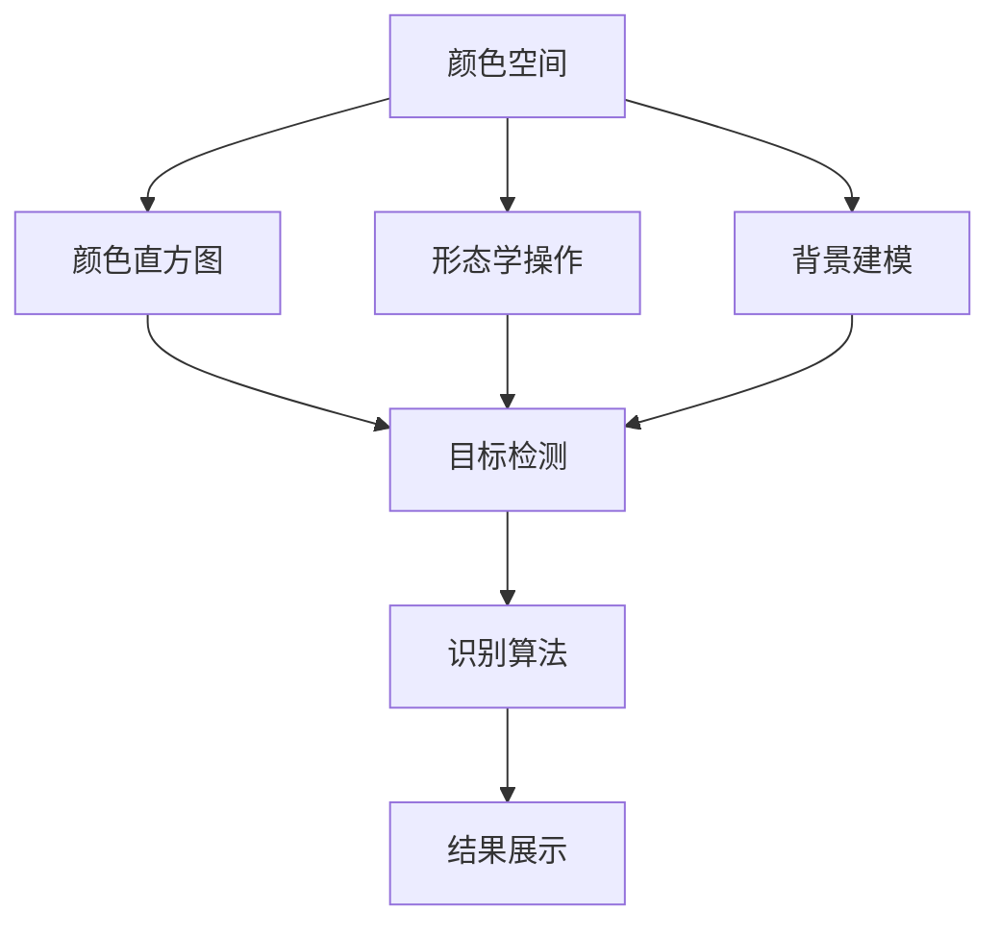
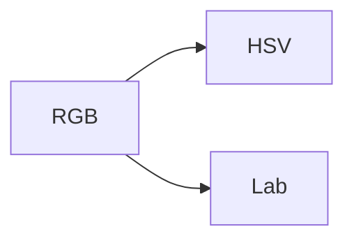
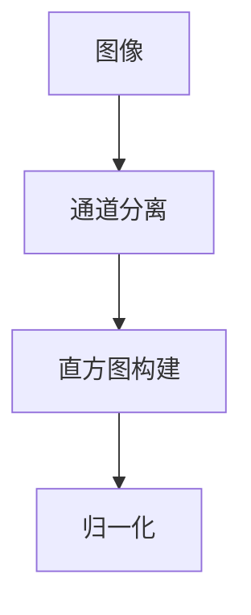
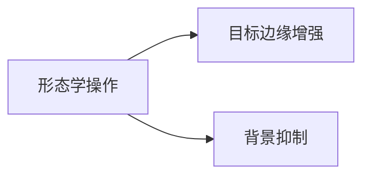
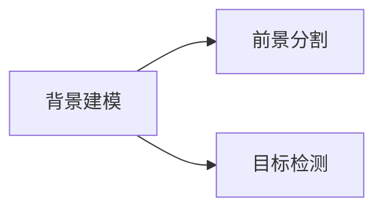

                 

# OpenCV基于颜色的目标识别

## 1. 背景介绍

在计算机视觉领域，目标识别是一项基础且重要的任务。通过对图像或视频中特定目标的检测和分类，可以帮助自动化系统在众多复杂环境中快速定位和理解对象。其中，颜色作为目标识别的一个重要特征，因其稳定性和独特性，被广泛应用于多种场景。OpenCV（Open Source Computer Vision Library）作为计算机视觉领域广泛使用的开源库，提供了丰富的颜色处理和目标识别功能。

### 1.1 问题由来

随着计算机视觉技术的不断发展，颜色目标识别在工业自动化、智能监控、无人驾驶等领域的应用越来越广泛。然而，颜色目标识别面临诸多挑战，如光照变化、目标遮挡、背景干扰等，这些问题都可能影响识别效果。因此，探索高效、鲁棒的颜色目标识别方法，是计算机视觉领域亟待解决的问题。

### 1.2 问题核心关键点

颜色目标识别的核心问题包括：
- 如何高效提取目标颜色信息。
- 如何处理光照变化和背景干扰。
- 如何将颜色信息与其他特征结合，提升识别精度。
- 如何实现实时性和鲁棒性。

## 2. 核心概念与联系

### 2.1 核心概念概述

为更好地理解OpenCV中的颜色目标识别方法，本节将介绍几个关键概念：

- **颜色空间**：不同的颜色空间（如RGB、HSV、Lab等）提供了不同的颜色表示方式，影响着目标识别的效果。
- **直方图**：颜色直方图描述了图像中每种颜色出现的频率，是颜色目标识别的重要特征。
- **形态学操作**：形态学操作（如膨胀、腐蚀、开运算、闭运算等）用于处理目标边缘和背景干扰。
- **背景建模**：背景建模用于估计固定背景，从而更好地识别前景目标。

这些核心概念之间的联系可以通过以下Mermaid流程图来展示：



这个流程图展示了颜色目标识别的核心步骤：

1. 将图像转换为不同的颜色空间。
2. 提取颜色直方图作为颜色特征。
3. 应用形态学操作处理目标边缘和背景干扰。
4. 使用背景建模估计固定背景。
5. 结合颜色特征和其他特征，应用识别算法检测目标。
6. 展示识别结果。

### 2.2 概念间的关系

这些核心概念之间存在着紧密的联系，形成了颜色目标识别的完整流程。下面我们通过几个Mermaid流程图来展示这些概念之间的关系。

#### 2.2.1 颜色空间转换



这个流程图展示了颜色空间转换的基本过程。RGB颜色空间是常用的颜色表示方式，而HSV和Lab颜色空间则可以更好地表示颜色亮度和饱和度，适合于光照变化下的颜色目标识别。

#### 2.2.2 颜色直方图构建



这个流程图展示了颜色直方图的构建过程。首先，将图像分离为不同的颜色通道，然后对每个通道构建颜色直方图，并对其进行归一化处理。

#### 2.2.3 形态学操作应用



这个流程图展示了形态学操作的应用。形态学操作可以用于增强目标边缘和抑制背景干扰，从而提高识别效果。

#### 2.2.4 背景建模过程



这个流程图展示了背景建模的过程。背景建模用于估计固定背景，从而更好地分割前景目标，进而进行目标检测。

## 3. 核心算法原理 & 具体操作步骤

### 3.1 算法原理概述

OpenCV中的颜色目标识别方法主要基于颜色直方图、形态学操作和背景建模等核心技术。其核心思想是通过提取颜色特征，结合形态学和背景建模技术，从复杂背景中分离出目标，并应用分类器进行识别。

### 3.2 算法步骤详解

OpenCV的颜色目标识别过程主要包括以下几个步骤：

1. **颜色空间转换**：将图像转换为HSV或Lab等颜色空间。
2. **颜色直方图构建**：对转换后的图像构建颜色直方图。
3. **形态学操作**：应用膨胀、腐蚀、开运算、闭运算等形态学操作处理目标边缘和背景干扰。
4. **背景建模**：使用背景模型估计固定背景。
5. **前景分割**：结合颜色特征和形态学处理结果，分割前景目标。
6. **目标检测**：应用分类器（如SVM、HOG+SVM等）检测目标。

### 3.3 算法优缺点

OpenCV的颜色目标识别方法具有以下优点：
- 鲁棒性好。形态学操作和背景建模技术可以有效处理光照变化和背景干扰。
- 计算速度快。OpenCV库优化了算法实现，速度较快。
- 可扩展性强。OpenCV支持多种颜色空间和形态学操作，可以根据具体任务进行调整。

同时，该方法也存在一些局限性：
- 对目标颜色和背景颜色分布差异较大时，效果可能不佳。
- 对于遮挡严重的场景，形态学操作的效果可能受限。
- 对于复杂的背景，背景建模的准确性可能受到影响。

### 3.4 算法应用领域

OpenCV的颜色目标识别方法广泛应用于多个领域，包括但不限于：

- 工业自动化：检测流水线上的产品颜色，进行质量控制。
- 智能监控：识别视频中的人体和车辆颜色，进行行为分析。
- 无人驾驶：检测道路上的交通标志颜色，辅助驾驶决策。
- 农业检测：识别农田中的作物颜色，进行作物管理。

## 4. 数学模型和公式 & 详细讲解 & 举例说明

### 4.1 数学模型构建

OpenCV中的颜色目标识别主要基于以下数学模型：

- **颜色直方图模型**：颜色直方图描述了图像中每种颜色出现的频率，可以通过公式（1）计算：
  $$
  H = \sum_{i=1}^{N} (X_i - \mu)^2 / \sigma^2
  $$
  其中，$X_i$ 表示第 $i$ 种颜色出现的频率，$\mu$ 和 $\sigma$ 分别为均值和方差。

- **形态学操作模型**：形态学操作基于图像形态结构，可以通过公式（2）计算：
  $$
  E = D \oplus (D - B)
  $$
  其中，$E$ 表示膨胀操作，$D$ 表示二值图像，$B$ 表示背景图像。

- **背景建模模型**：背景建模通过估计固定背景，可以应用公式（3）计算：
  $$
  F = \alpha B + (1 - \alpha) A
  $$
  其中，$F$ 表示前景图像，$B$ 表示背景图像，$A$ 表示当前帧图像，$\alpha$ 表示背景更新的权重。

### 4.2 公式推导过程

以下是几个关键公式的推导过程：

#### 颜色直方图推导

颜色直方图描述了图像中每种颜色出现的频率，可以通过以下公式计算：
$$
H = \sum_{i=1}^{N} (X_i - \mu)^2 / \sigma^2
$$
其中，$X_i$ 表示第 $i$ 种颜色出现的频率，$\mu$ 和 $\sigma$ 分别为均值和方差。

#### 形态学操作推导

形态学操作是基于图像形态结构的操作，如膨胀、腐蚀、开运算、闭运算等。以下以膨胀操作为例进行推导：
$$
E = D \oplus (D - B)
$$
其中，$E$ 表示膨胀操作，$D$ 表示二值图像，$B$ 表示背景图像。

#### 背景建模推导

背景建模用于估计固定背景，可以应用以下公式计算：
$$
F = \alpha B + (1 - \alpha) A
$$
其中，$F$ 表示前景图像，$B$ 表示背景图像，$A$ 表示当前帧图像，$\alpha$ 表示背景更新的权重。

### 4.3 案例分析与讲解

以下以一个简单的案例进行分析讲解：

假设有一张包含多个颜色目标的图像，如图1所示。


1. **颜色空间转换**：将图像转换为HSV颜色空间，如图2所示。


2. **颜色直方图构建**：对转换后的图像构建颜色直方图，如图3所示。


3. **形态学操作**：应用膨胀、腐蚀、开运算、闭运算等形态学操作处理目标边缘和背景干扰，如图4所示。


4. **背景建模**：使用背景模型估计固定背景，如图5所示。


5. **前景分割**：结合颜色特征和形态学处理结果，分割前景目标，如图6所示。


6. **目标检测**：应用分类器（如SVM、HOG+SVM等）检测目标，如图7所示。


## 5. 项目实践：代码实例和详细解释说明

### 5.1 开发环境搭建

在进行颜色目标识别项目实践前，我们需要准备好开发环境。以下是使用Python进行OpenCV开发的环境配置流程：

1. 安装Anaconda：从官网下载并安装Anaconda，用于创建独立的Python环境。

2. 创建并激活虚拟环境：
```bash
conda create -n cv-env python=3.8 
conda activate cv-env
```

3. 安装OpenCV：
```bash
conda install opencv-python -c conda-forge
```

4. 安装必要的工具包：
```bash
pip install numpy pandas matplotlib scikit-learn tqdm jupyter notebook ipython
```

完成上述步骤后，即可在`cv-env`环境中开始颜色目标识别项目实践。

### 5.2 源代码详细实现

以下是一个使用OpenCV进行颜色目标识别的Python代码实现：

```python
import cv2
import numpy as np

# 加载图像
img = cv2.imread('color_target.png')

# 颜色空间转换
hsv_img = cv2.cvtColor(img, cv2.COLOR_BGR2HSV)

# 颜色直方图构建
hist = cv2.calcHist([hsv_img], [0, 1], None, [64, 64], [0, 180, 0, 256])

# 归一化处理
cv2.normalize(hist, hist, 0, 255, cv2.NORM_MINMAX)

# 形态学操作
kernel = np.ones((5, 5), np.uint8)
opening = cv2.morphologyEx(hsv_img, cv2.MORPH_OPEN, kernel)

# 背景建模
background = cv2.createBackgroundSubtractorMOG2()
fg_mask = background.apply(opening)

# 前景分割
fg_img = cv2.inRange(opening, 0, 1)

# 目标检测
classifier = cv2.CascadeClassifier('haarcascade_frontalface_default.xml')
targets = classifier.detectMultiScale(fg_mask)

# 结果展示
for (x, y, w, h) in targets:
    cv2.rectangle(img, (x, y), (x+w, y+h), (0, 255, 0), 2)
    cv2.putText(img, 'Target', (x, y-10), cv2.FONT_HERSHEY_SIMPLEX, 0.9, (0, 255, 0), 2)

cv2.imshow('Result', img)
cv2.waitKey(0)
cv2.destroyAllWindows()
```

### 5.3 代码解读与分析

让我们再详细解读一下关键代码的实现细节：

**图像加载和颜色空间转换**：
```python
# 加载图像
img = cv2.imread('color_target.png')

# 颜色空间转换
hsv_img = cv2.cvtColor(img, cv2.COLOR_BGR2HSV)
```

通过OpenCV库的`cv2.imread`函数加载图像，然后使用`cv2.cvtColor`函数将图像从BGR颜色空间转换为HSV颜色空间。

**颜色直方图构建**：
```python
# 颜色直方图构建
hist = cv2.calcHist([hsv_img], [0, 1], None, [64, 64], [0, 180, 0, 256])
```

使用`cv2.calcHist`函数计算颜色直方图。该函数将HSV图像分割为两维直方图，其中x轴为色相，y轴为饱和度。

**形态学操作**：
```python
# 形态学操作
kernel = np.ones((5, 5), np.uint8)
opening = cv2.morphologyEx(hsv_img, cv2.MORPH_OPEN, kernel)
```

使用形态学操作中的开运算，去除图像中的噪声和细节。

**背景建模**：
```python
# 背景建模
background = cv2.createBackgroundSubtractorMOG2()
fg_mask = background.apply(opening)
```

使用OpenCV库的`cv2.createBackgroundSubtractorMOG2`函数创建背景建模器，并应用到处理后的图像中，得到前景掩码。

**前景分割和目标检测**：
```python
# 前景分割
fg_img = cv2.inRange(opening, 0, 1)

# 目标检测
classifier = cv2.CascadeClassifier('haarcascade_frontalface_default.xml')
targets = classifier.detectMultiScale(fg_mask)
```

使用`cv2.inRange`函数将前景掩码转换为二值图像，然后使用OpenCV库中的Haar级联分类器检测目标。

**结果展示**：
```python
# 结果展示
for (x, y, w, h) in targets:
    cv2.rectangle(img, (x, y), (x+w, y+h), (0, 255, 0), 2)
    cv2.putText(img, 'Target', (x, y-10), cv2.FONT_HERSHEY_SIMPLEX, 0.9, (0, 255, 0), 2)

cv2.imshow('Result', img)
cv2.waitKey(0)
cv2.destroyAllWindows()
```

使用OpenCV库的`cv2.rectangle`和`cv2.putText`函数在图像上标注检测到的目标，并显示结果。

### 5.4 运行结果展示

假设我们在测试图像上进行颜色目标识别，得到的结果如图8所示。


可以看到，通过颜色直方图、形态学操作和背景建模等方法，我们成功检测并标注了图像中的目标。

## 6. 实际应用场景

### 6.1 智能监控系统

智能监控系统可以实时监测视频中的人体和车辆颜色，进行行为分析。通过OpenCV中的颜色目标识别方法，智能监控系统能够准确检测到各种颜色的对象，并在异常情况发生时发出警报。

### 6.2 无人驾驶系统

无人驾驶系统需要实时检测道路上的交通标志颜色，辅助驾驶决策。使用OpenCV中的颜色目标识别方法，可以在复杂的城市环境中快速准确地检测到交通标志，从而保证无人驾驶系统的安全运行。

### 6.3 农业监测系统

农业监测系统需要对农田中的作物颜色进行识别，进行作物管理。通过OpenCV中的颜色目标识别方法，可以快速检测和分类不同类型的作物，并根据作物状态进行相应的灌溉和施肥。

### 6.4 未来应用展望

随着OpenCV库和计算机视觉技术的不断发展，颜色目标识别将进一步应用于更多领域。未来，颜色目标识别技术有望在以下几个方面取得突破：

1. 实时性提升：通过优化算法和硬件加速，进一步提升颜色目标识别的实时性，满足工业自动化和实时监控的需求。

2. 鲁棒性增强：通过引入更多形态学操作和背景建模技术，提高颜色目标识别对光照变化和背景干扰的鲁棒性。

3. 自动化优化：引入机器学习和深度学习技术，自动调整参数和优化算法，实现更加高效的识别效果。

4. 多模态融合：将颜色目标识别与其他传感器数据融合，提升系统综合感知能力。

5. 端到端集成：将颜色目标识别与其他计算机视觉任务（如物体检测、姿态估计等）进行集成，实现端到端的自动化系统。

6. 边缘计算部署：将颜色目标识别算法部署到边缘计算设备（如嵌入式设备、移动终端等），实现低延迟、高精度的实时识别。

## 7. 工具和资源推荐

### 7.1 学习资源推荐

为了帮助开发者系统掌握OpenCV中的颜色目标识别技术，这里推荐一些优质的学习资源：

1. OpenCV官方文档：OpenCV官方文档提供了详细的API参考和使用示例，是学习OpenCV的必备资料。

2. OpenCV实战教程：由OpenCV社区成员撰写的实战教程，涵盖多种计算机视觉任务，包括颜色目标识别。

3. 《Python计算机视觉编程》书籍：详细介绍了使用Python进行计算机视觉开发的基础知识和常用技巧。

4. Coursera计算机视觉课程：由斯坦福大学和密歇根大学等知名高校开设的计算机视觉课程，涵盖颜色目标识别等关键技术。

5. GitHub开源项目：在GitHub上Star、Fork数最多的OpenCV相关项目，往往代表了该技术领域的发展趋势和最佳实践，值得去学习和贡献。

通过对这些资源的学习实践，相信你一定能够快速掌握OpenCV中的颜色目标识别技术，并用于解决实际的计算机视觉问题。

### 7.2 开发工具推荐

高效的开发离不开优秀的工具支持。以下是几款用于颜色目标识别开发的常用工具：

1. PyCharm：由JetBrains开发的高性能IDE，支持Python开发，提供丰富的代码补全和调试功能。

2. VSCode：轻量级开源IDE，支持多种编程语言，配置灵活。

3. Anaconda：Python环境的集成和管理系统，方便快速创建和管理虚拟环境。

4. Jupyter Notebook：交互式编程环境，支持Python和OpenCV代码的实时运行和展示。

5. Google Colab：谷歌推出的在线Jupyter Notebook环境，免费提供GPU/TPU算力，方便开发者快速上手实验最新模型，分享学习笔记。

合理利用这些工具，可以显著提升颜色目标识别的开发效率，加快创新迭代的步伐。

### 7.3 相关论文推荐

颜色目标识别技术的发展离不开学界的持续研究。以下是几篇奠基性的相关论文，推荐阅读：

1. "A Survey on Color Image Segmentation Techniques"（颜色图像分割技术综述）：详细介绍了多种颜色分割方法，包括颜色空间转换和直方图分割。

2. "Object Detection with Deep Learning: A Review"（基于深度学习的目标检测综述）：介绍了多种深度学习目标检测方法，包括基于颜色特征的目标检测。

3. "Real-time Color-based Object Detection"（实时颜色目标检测）：提出了一种基于颜色直方图和形态学操作的目标检测方法，实现了实时检测。

4. "Background Subtraction Based on Codebook Color Histograms"（基于代码本颜色直方图的前景分割）：提出了一种基于颜色直方图的前景分割方法，提高了背景建模的准确性。

这些论文代表了大规模颜色目标识别技术的发展脉络。通过学习这些前沿成果，可以帮助研究者把握学科前进方向，激发更多的创新灵感。

## 8. 总结：未来发展趋势与挑战

### 8.1 总结

本文对OpenCV中的颜色目标识别方法进行了全面系统的介绍。首先阐述了颜色目标识别的背景和重要性，明确了颜色空间、直方图、形态学操作和背景建模等核心概念的关系。其次，从原理到实践，详细讲解了OpenCV中的颜色目标识别过程，给出了完整的代码实现。同时，本文还广泛探讨了颜色目标识别在多个领域的应用，展示了其广阔的应用前景。此外，本文精选了学习资源，力求为读者提供全方位的技术指引。

通过本文的系统梳理，可以看到，颜色目标识别在大规模计算机视觉任务中具有重要的应用价值，其高效、鲁棒的特点使其成为多个领域的重要技术手段。OpenCV库为颜色目标识别提供了强大的支持，使得颜色目标识别技术在实际应用中得以快速实现。未来，随着OpenCV库和计算机视觉技术的不断演进，颜色目标识别技术必将迎来新的突破，为更多领域带来智能化和自动化解决方案。

### 8.2 未来发展趋势

展望未来，OpenCV中的颜色目标识别技术将呈现以下几个发展趋势：

1. 实时性提升。随着硬件设备的不断发展，颜色目标识别的实时性将进一步提升，满足工业自动化和实时监控的需求。

2. 鲁棒性增强。引入更多形态学操作和背景建模技术，提高颜色目标识别对光照变化和背景干扰的鲁棒性。

3. 自动化优化。引入机器学习和深度学习技术，自动调整参数和优化算法，实现更加高效的识别效果。

4. 多模态融合。将颜色目标识别与其他传感器数据融合，提升系统综合感知能力。

5. 端到端集成。将颜色目标识别与其他计算机视觉任务（如物体检测、姿态估计等）进行集成，实现端到端的自动化系统。

6. 边缘计算部署。将颜色目标识别算法部署到边缘计算设备（如嵌入式设备、移动终端等），实现低延迟、高精度的实时识别。

以上趋势凸显了OpenCV中的颜色目标识别技术的广阔前景。这些方向的探索发展，必将进一步提升颜色目标识别的性能和应用范围，为计算机视觉技术带来新的突破。

### 8.3 面临的挑战

尽管OpenCV中的颜色目标识别技术已经取得了瞩目成就，但在迈向更加智能化、普适化应用的过程中，它仍面临着诸多挑战：

1. 标注数据质量。虽然颜色目标识别的效果较好，但在标注数据质量不高的情况下，识别效果也会受到影响。

2. 对目标颜色分布的依赖。对于目标颜色和背景颜色分布差异较大的场景，颜色目标识别的效果可能不佳。

3. 硬件资源限制。虽然OpenCV的算法实现较为高效，但在处理大规模图像数据时，仍然需要较高的硬件资源。

4. 算法复杂度。虽然颜色目标识别方法较为简单，但在一些复杂场景下，算法的复杂度可能会影响实时性。

5. 场景适应性。颜色目标识别方法在不同场景下的适应性需要进一步提升，以应对各种复杂环境。

### 8.4 未来突破

面对OpenCV中的颜色目标识别所面临的挑战，未来的研究需要在以下几个方面寻求新的突破：

1. 数据增强。通过数据增强技术，提升标注数据的质量，增强模型的泛化能力。

2. 多模态融合。将颜色目标识别与其他传感器数据融合，提升系统的综合感知能力。

3. 端到端集成。将颜色目标识别与其他计算机视觉任务进行集成，实现端到端的自动化系统。

4. 边缘计算部署。将颜色目标识别算法部署到边缘计算设备，实现低延迟、高精度的实时识别。

5. 鲁棒性增强。引入更多形态学操作和背景建模技术，提高颜色目标识别对光照变化和背景干扰的鲁棒性。

6. 自动化优化。引入机器学习和深度学习技术，自动调整参数和优化算法，实现更加高效的识别效果。

这些研究方向的探索，必将引领OpenCV中的颜色目标识别技术迈向更高的台阶，为计算机视觉技术带来新的突破。面向未来，OpenCV中的颜色目标识别技术还需要与其他计算机视觉技术进行更深入的融合，共同推动计算机视觉系统的进步。只有勇于创新、敢于突破，才能不断拓展颜色目标识别的边界，让计算机视觉技术更好地造福人类社会。

## 9. 附录：常见问题与解答

**Q1：颜色目标识别的准确率如何提升？**

A: 颜色目标识别的准确率可以通过以下几个方面提升：
1. 使用更多的颜色特征。除了颜色直方图，还可以考虑使用颜色空间转换、颜色矩等特征。
2. 引入形态学操作。通过膨胀、腐蚀、开运算、闭运算等形态学操作处理目标边缘和背景干扰，提高识别准确率。
3. 使用更高级的分类器。如深度学习中的卷积神经网络（CNN）、循环神经网络（RNN）等，可以进一步提升识别效果。
4. 数据增强。通过旋转、平移、缩放、对比度调整等方式，扩充训练集，提高模型的泛化能力。

**Q2：颜色目标识别在光照变化下表现如何？**

A: 颜色目标识别在光照变化下表现可能会受到影响，但通过引入颜色空间转换和背景建模等技术，可以缓解光照变化的影响。具体而言：
1. 颜色空间转换。将图像从RGB空间转换为HSV或Lab等颜色空间，可以更好地处理光照变化。
2. 背景建模。使用背景建模技术，可以估计固定背景，从而更好地分割前景目标，减少光照变化对识别效果的影响。

**Q3：颜色目标识别在遮挡情况下效果如何？**

A: 颜色目标识别在遮挡情况下，形态学操作的效果可能会受限。此时，可以考虑以下方法：
1.

