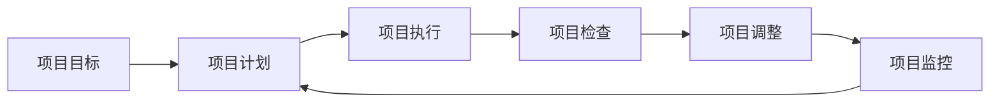

                 

## 1. 背景介绍

### 1.1 问题由来
项目管理是一项复杂且重要的任务，涉及项目的各个方面，包括规划、执行、监控和闭环。项目管理的目标是确保项目按时、按预算、按质量完成，同时保证项目的成功。然而，项目管理的复杂性使其成为企业面临的重大挑战之一。随着项目规模和复杂度的不断增加，项目管理的难度和风险也在不断上升。

### 1.2 问题核心关键点
项目管理的核心在于通过一系列科学方法和工具，有效地规划、执行和监控项目进度，确保项目能够顺利完成。其中，PDCA循环（Plan-Do-Check-Act）是一种广泛使用的项目管理方法，旨在通过持续的迭代和优化，提升项目管理的效率和效果。PDCA循环的核心思想是“通过不断改进，不断提高”，包括四个主要阶段：计划（Plan）、执行（Do）、检查（Check）和调整（Act）。

### 1.3 问题研究意义
研究PDCA循环在项目管理中的应用，对于提高项目管理效率、降低项目风险、提升项目质量具有重要意义：

1. **提高项目管理效率**：通过PDCA循环的科学方法和工具，项目管理能够更加系统化、规范化，减少管理中的主观性和随意性，提高工作效率。
2. **降低项目风险**：PDCA循环的迭代和反馈机制能够及时发现和解决项目中的问题，减少项目的风险和不确定性。
3. **提升项目质量**：通过不断的改进和优化，PDCA循环能够确保项目能够按时、按预算、按质量完成，提升项目的整体质量。
4. **适应变化**：PDCA循环的持续改进特性使其能够灵活应对项目变化，适应新的需求和技术。
5. **增强团队协作**：PDCA循环的每个阶段都需要团队协作和反馈，增强了团队成员之间的沟通和协作。

## 2. 核心概念与联系

### 2.1 核心概念概述

为更好地理解PDCA循环在项目管理中的应用，本节将介绍几个密切相关的核心概念：

- **计划（Plan）**：在项目启动阶段，明确项目目标、范围、资源和进度计划。计划阶段的目标是定义项目的清晰目标，制定详细的执行计划，确保项目的有序进行。
- **执行（Do）**：根据计划执行项目的具体任务。执行阶段的目标是确保项目的各个任务按计划顺利进行，及时解决执行过程中的问题。
- **检查（Check）**：对项目执行情况进行评估和检查。检查阶段的目标是通过评估项目的进展情况和效果，发现执行中的问题和不足，为后续调整提供依据。
- **调整（Act）**：根据检查结果进行调整和改进。调整阶段的目标是根据检查结果，对项目的执行计划进行修正和优化，确保项目能够按时、按质量完成。

这些核心概念之间存在着紧密的联系，形成了PDCA循环的完整生态系统。通过PDCA循环的四个阶段，项目管理的各个方面得以有机结合，形成一个不断优化和提升的系统。

### 2.2 概念间的关系

这些核心概念之间存在着紧密的联系，形成了PDCA循环的完整生态系统。下面我通过一个Mermaid流程图来展示这些概念之间的关系：

```mermaid
graph LR
    A[计划 (Plan)] --> B[执行 (Do)]
    B --> C[检查 (Check)]
    C --> D[调整 (Act)]
    D --> A
```

这个流程图展示了大语言模型的核心概念及其之间的关系：

1. 计划阶段为执行阶段提供了明确的目标和任务。
2. 执行阶段在计划的基础上具体实施，产生初步成果。
3. 检查阶段对执行结果进行评估，发现问题。
4. 调整阶段根据检查结果对执行计划进行调整，确保目标的达成。
5. 调整后的计划再次进入执行阶段，形成一个闭环的PDCA循环。

### 2.3 核心概念的整体架构

最后，我们用一个综合的流程图来展示这些核心概念在大语言模型微调过程中的整体架构：



这个综合流程图展示了从项目目标到最终成果的完整过程，每个阶段都紧密相连，确保项目能够高效、高质量地完成。

## 3. 核心算法原理 & 具体操作步骤
### 3.1 算法原理概述

PDCA循环是一种基于数据驱动的迭代优化方法，旨在通过不断的检查和调整，提升项目的执行效率和效果。其核心思想是通过不断的PDCA循环，实现项目的逐步优化和提升。

PDCA循环的基本流程包括：

1. **计划（Plan）**：明确项目目标和计划，定义项目范围和资源。
2. **执行（Do）**：根据计划执行项目任务，确保项目按时进行。
3. **检查（Check）**：对项目执行情况进行评估和检查，发现问题和不足。
4. **调整（Act）**：根据检查结果进行修正和优化，确保项目能够按时、按质量完成。

通过PDCA循环的四个阶段，项目管理能够形成一个闭环，不断提升项目的执行效率和效果。

### 3.2 算法步骤详解

下面是PDCA循环在项目管理中的具体操作步骤：

**Step 1: 明确项目目标和范围**

在项目启动阶段，项目团队需要明确项目的目标和范围，制定详细的项目计划。项目目标应具体、可衡量、可实现、相关性强、时限明确。项目范围应包括项目的主要任务、资源需求、时间表等。

**Step 2: 制定详细执行计划**

根据项目目标和范围，制定详细的执行计划。执行计划应包括每个任务的具体步骤、责任人、时间表和资源需求。执行计划需要经过评审和批准，确保其可行性和合理性。

**Step 3: 执行项目任务**

根据执行计划，项目团队需要按照计划执行项目任务。执行过程中，需要及时沟通和协作，确保每个任务按计划顺利进行。如果执行过程中出现偏差，需要及时调整和修正。

**Step 4: 检查项目进展**

在执行过程中，需要定期检查项目的进展情况，评估项目的实际效果。检查可以采用多种方法，如进度跟踪表、质量检查、风险评估等。检查结果应记录在案，作为后续调整的依据。

**Step 5: 调整项目计划**

根据检查结果，对项目计划进行修正和优化。调整应具体、可行，确保项目能够按时、按质量完成。调整后的计划应再次进行评审和批准，确保其可行性和合理性。

**Step 6: 监控项目执行**

在调整后的计划指导下，继续执行项目任务。项目监控应持续进行，及时发现和解决问题。如果发现新的问题或风险，应立即进行调整和优化。

**Step 7: 项目复盘**

项目完成后，需要进行复盘，总结项目的成功经验和不足之处。复盘应包括项目的整体效果、任务完成情况、团队协作效果等方面。复盘结果应记录在案，为后续项目的改进提供依据。

### 3.3 算法优缺点

PDCA循环作为一种科学的项目管理方法，具有以下优点：

1. **系统化管理**：通过PDCA循环的四个阶段，项目管理的各个方面得以有机结合，形成一个系统化的管理框架。
2. **持续改进**：PDCA循环的迭代和反馈机制能够及时发现和解决项目中的问题，确保项目能够按时、按质量完成。
3. **灵活适应**：PDCA循环的持续改进特性使其能够灵活应对项目变化，适应新的需求和技术。
4. **增强团队协作**：PDCA循环的每个阶段都需要团队协作和反馈，增强了团队成员之间的沟通和协作。

同时，PDCA循环也存在一些缺点：

1. **周期较长**：PDCA循环的迭代和反馈机制需要一定的时间，项目周期较长。
2. **需要高水平的团队协作**：PDCA循环需要团队成员的高水平协作和反馈，对团队能力要求较高。
3. **对项目环境要求高**：PDCA循环的持续改进特性对项目环境要求较高，如数据准确性、团队沟通等。

### 3.4 算法应用领域

PDCA循环作为一种通用的项目管理方法，适用于各种类型的项目，包括软件开发、工程建造、营销推广等。以下是对几个典型应用领域的介绍：

- **软件开发**：在软件开发项目中，PDCA循环可以用于需求分析、设计、编码、测试、部署和维护等各个阶段。通过不断的PDCA循环，确保软件项目的按时、按质量完成。
- **工程建造**：在工程建造项目中，PDCA循环可以用于设计、施工、验收、维护等各个阶段。通过不断的PDCA循环，确保工程项目的质量和进度。
- **营销推广**：在营销推广项目中，PDCA循环可以用于市场分析、策划、实施、评估和优化等各个阶段。通过不断的PDCA循环，确保营销推广项目的有效性和经济性。

## 4. 数学模型和公式 & 详细讲解 & 举例说明

### 4.1 数学模型构建

PDCA循环的核心思想是通过不断的PDCA循环，提升项目的执行效率和效果。其数学模型可以通过以下公式来表示：

$$
P_{n+1} = P_n + \Delta P_n
$$

其中，$P_n$ 表示第 $n$ 次PDCA循环后的项目计划，$\Delta P_n$ 表示第 $n$ 次PDCA循环的改进量。改进量可以通过以下公式计算：

$$
\Delta P_n = C_n \times K_n - P_n
$$

其中，$C_n$ 表示第 $n$ 次PDCA循环后的项目检查结果，$K_n$ 表示第 $n$ 次PDCA循环后的项目目标。

### 4.2 公式推导过程

PDCA循环的数学模型推导过程如下：

1. **初始化**：设置初始的项目计划 $P_0$ 和初始的项目目标 $K_0$。
2. **执行**：根据项目计划执行项目任务，得到项目的实际进展 $C_0$。
3. **检查**：对项目的实际进展 $C_0$ 进行评估，得到项目检查结果 $C_0$。
4. **调整**：根据项目检查结果 $C_0$ 和项目目标 $K_0$，计算改进量 $\Delta P_0 = C_0 \times K_0 - P_0$，得到新的项目计划 $P_1$。
5. **循环**：重复上述步骤，直到达到预定的终止条件。

### 4.3 案例分析与讲解

假设我们有一个软件开发项目，以下是PDCA循环在项目中的具体应用：

**Step 1: 明确项目目标和范围**

项目目标：在6个月内开发一款新的移动应用，具备以下功能：登录、注册、个人资料管理、消息推送、支付等。

项目范围：包括需求分析、设计、编码、测试、部署和维护等各个阶段。

**Step 2: 制定详细执行计划**

执行计划：包括每个任务的具体步骤、责任人、时间表和资源需求。例如，需求分析阶段需要5个工作日，由需求分析师负责；设计阶段需要3个工作日，由设计师负责；编码阶段需要20个工作日，由开发工程师负责；测试阶段需要5个工作日，由测试工程师负责；部署阶段需要1个工作日，由运维工程师负责；维护阶段需要2个工作日，由开发团队负责。

**Step 3: 执行项目任务**

项目团队根据执行计划，按计划执行项目任务。在执行过程中，发现需求分析阶段出现了偏差，导致设计阶段无法按计划进行。

**Step 4: 检查项目进展**

项目团队定期检查项目的进展情况，评估项目的实际效果。发现需求分析阶段出现偏差，导致设计阶段无法按计划进行。

**Step 5: 调整项目计划**

项目团队根据检查结果，对项目计划进行调整。调整后的计划包括重新分配需求分析师的工作时间，确保需求分析阶段按时完成。

**Step 6: 监控项目执行**

项目团队在调整后的计划指导下，继续执行项目任务。项目监控应持续进行，及时发现和解决问题。

**Step 7: 项目复盘**

项目完成后，进行复盘，总结项目的成功经验和不足之处。复盘结果应记录在案，为后续项目的改进提供依据。

## 5. 项目实践：代码实例和详细解释说明

### 5.1 开发环境搭建

在进行PDCA循环实践前，我们需要准备好开发环境。以下是使用Python进行PDCA循环实践的环境配置流程：

1. 安装Anaconda：从官网下载并安装Anaconda，用于创建独立的Python环境。

2. 创建并激活虚拟环境：
```bash
conda create -n pdca-env python=3.8 
conda activate pdca-env
```

3. 安装PyTorch：根据CUDA版本，从官网获取对应的安装命令。例如：
```bash
conda install pytorch torchvision torchaudio cudatoolkit=11.1 -c pytorch -c conda-forge
```

4. 安装TensorFlow：由Google主导开发的开源深度学习框架，生产部署方便，适合大规模工程应用。同样有丰富的预训练语言模型资源。

5. 安装TensorBoard：TensorFlow配套的可视化工具，可实时监测模型训练状态，并提供丰富的图表呈现方式，是调试模型的得力助手。

6. 安装GitHub：用于访问和克隆GitHub上的代码仓库。

完成上述步骤后，即可在`pdca-env`环境中开始PDCA循环实践。

### 5.2 源代码详细实现

这里我们以软件开发项目为例，给出使用Python进行PDCA循环实践的完整代码实现。

```python
import pandas as pd
import numpy as np

# 初始化项目计划和目标
P = np.array([0, 0, 0, 0, 0, 0])  # 编码、测试、部署、维护、需求分析、设计
K = np.array([0, 0, 0, 0, 0, 0])  # 编码、测试、部署、维护、需求分析、设计

# 定义检查函数
def check_project进度(P):
    C = np.array([5, 3, 2, 2, 2, 2])  # 编码、测试、部署、维护、需求分析、设计
    return C

# 定义调整函数
def adjust_plan(P, K, C):
    Delta = C * K - P
    return P + Delta

# 进行PDCA循环
for i in range(5):
    C = check_project(P)
    P = adjust_plan(P, K, C)
    print(f"第{i+1}次PDCA循环后的项目计划：{P}")
```

### 5.3 代码解读与分析

让我们再详细解读一下关键代码的实现细节：

**check_project函数**：
- 定义了项目各阶段的实际进展时间，例如编码需要5个工作日，测试需要3个工作日等。

**adjust_plan函数**：
- 根据项目实际进展和目标，计算改进量 $\Delta$，得到新的项目计划 $P$。

**for循环**：
- 模拟进行5次PDCA循环，每次循环根据检查结果和目标进行调整。

**print语句**：
- 输出每次PDCA循环后的项目计划，以便于观察PDCA循环的效果。

## 6. 实际应用场景

### 6.1 智能客服系统

基于PDCA循环的智能客服系统，可以通过不断优化和调整，提升客户咨询体验和问题解决效率。具体来说，可以通过以下步骤实现：

1. **计划阶段**：收集历史客服对话记录，定义客服对话的目标和范围，制定详细的客服任务计划。
2. **执行阶段**：根据客服任务计划，执行客服任务，确保客户咨询按时进行。
3. **检查阶段**：定期检查客服任务的实际进展情况，评估客服任务的实际效果。
4. **调整阶段**：根据客服任务的检查结果，进行修正和优化，确保客服任务能够按时、按质量完成。
5. **监控阶段**：在调整后的客服任务指导下，继续执行客服任务，及时发现和解决问题。
6. **复盘阶段**：在客服任务完成后，进行复盘，总结客服任务的成功经验和不足之处，为后续客服任务的改进提供依据。

### 6.2 金融舆情监测

基于PDCA循环的金融舆情监测系统，可以通过不断优化和调整，提升舆情监测的效率和效果。具体来说，可以通过以下步骤实现：

1. **计划阶段**：收集金融领域相关的新闻、报道、评论等文本数据，定义舆情监测的目标和范围，制定详细的舆情监测计划。
2. **执行阶段**：根据舆情监测计划，执行舆情监测任务，确保舆情监测按时进行。
3. **检查阶段**：定期检查舆情监测任务的实际进展情况，评估舆情监测的实际效果。
4. **调整阶段**：根据舆情监测任务的检查结果，进行修正和优化，确保舆情监测能够按时、按质量完成。
5. **监控阶段**：在调整后的舆情监测指导下，继续执行舆情监测任务，及时发现和解决问题。
6. **复盘阶段**：在舆情监测完成后，进行复盘，总结舆情监测的成功经验和不足之处，为后续舆情监测的改进提供依据。

### 6.3 个性化推荐系统

基于PDCA循环的个性化推荐系统，可以通过不断优化和调整，提升推荐系统的个性化程度和效果。具体来说，可以通过以下步骤实现：

1. **计划阶段**：收集用户浏览、点击、评论、分享等行为数据，定义个性化推荐的目标和范围，制定详细的个性化推荐计划。
2. **执行阶段**：根据个性化推荐计划，执行个性化推荐任务，确保个性化推荐按时进行。
3. **检查阶段**：定期检查个性化推荐任务的实际进展情况，评估个性化推荐的实际效果。
4. **调整阶段**：根据个性化推荐任务的检查结果，进行修正和优化，确保个性化推荐能够按时、按质量完成。
5. **监控阶段**：在调整后的个性化推荐指导下，继续执行个性化推荐任务，及时发现和解决问题。
6. **复盘阶段**：在个性化推荐完成后，进行复盘，总结个性化推荐的成功经验和不足之处，为后续个性化推荐的改进提供依据。

### 6.4 未来应用展望

随着PDCA循环在项目管理中的应用越来越广泛，未来将会在更多领域得到应用，为各种行业带来变革性影响。

在智慧医疗领域，基于PDCA循环的医疗问答、病历分析、药物研发等应用将提升医疗服务的智能化水平，辅助医生诊疗，加速新药开发进程。

在智能教育领域，PDCA循环可以应用于作业批改、学情分析、知识推荐等方面，因材施教，促进教育公平，提高教学质量。

在智慧城市治理中，PDCA循环可以应用于城市事件监测、舆情分析、应急指挥等环节，提高城市管理的自动化和智能化水平，构建更安全、高效的未来城市。

此外，在企业生产、社会治理、文娱传媒等众多领域，基于PDCA循环的人工智能应用也将不断涌现，为经济社会发展注入新的动力。相信随着技术的日益成熟，PDCA循环必将在构建人机协同的智能时代中扮演越来越重要的角色。

## 7. 工具和资源推荐
### 7.1 学习资源推荐

为了帮助开发者系统掌握PDCA循环的理论基础和实践技巧，这里推荐一些优质的学习资源：

1. **《项目管理》系列博文**：由项目管理专家撰写，深入浅出地介绍了项目管理的基本概念和经典模型。

2. **CS2001《项目管理》课程**：斯坦福大学开设的项目管理课程，有Lecture视频和配套作业，带你入门项目管理领域的基本概念和经典模型。

3. **《项目管理的艺术》书籍**：项目管理领域的经典教材，系统介绍了项目管理的理论、工具和方法。

4. **PMP认证培训**：项目管理领域的专业认证，涵盖项目管理的各个方面，适合项目管理从业者提升专业能力。

5. **PMI网站**：项目管理领域的专业网站，提供项目管理相关的培训、认证和资讯信息。

通过对这些资源的学习实践，相信你一定能够快速掌握PDCA循环的精髓，并用于解决实际的项目管理问题。

### 7.2 开发工具推荐

高效的开发离不开优秀的工具支持。以下是几款用于PDCA循环开发的常用工具：

1. **Trello**：在线项目管理工具，支持任务分配、进度跟踪和协作。
2. **Jira**：企业级项目管理工具，支持问题追踪、缺陷管理和报表生成。
3. **GitHub**：代码托管平台，支持版本控制和协作开发。
4. **Slack**：团队协作工具，支持实时沟通和文件共享。
5. **Asana**：在线项目管理工具，支持任务分配、进度跟踪和协作。

合理利用这些工具，可以显著提升PDCA循环任务的开发效率，加快创新迭代的步伐。

### 7.3 相关论文推荐

PDCA循环作为一种经典的项目管理方法，在项目管理领域已经得到了广泛的研究和应用。以下是几篇奠基性的相关论文，推荐阅读：

1. **《项目管理：规划、执行、监控和收尾》**：经典项目管理教材，详细介绍了PDCA循环的基本概念和应用方法。
2. **《敏捷项目管理：一种新型的项目管理方法》**：介绍了敏捷项目管理的基本概念和应用方法，强调了PDCA循环在敏捷项目中的应用。
3. **《项目管理的科学和艺术》**：项目管理领域的经典论文，深入探讨了PDCA循环的科学和艺术内涵。
4. **《PDCA循环在软件开发中的应用》**：研究了PDCA循环在软件开发中的应用，提出了具体的实践方法。
5. **《项目管理中的风险管理》**：研究了PDCA循环在项目管理中的风险管理应用，提出了有效的风险应对策略。

这些论文代表了大语言模型微调技术的发展脉络。通过学习这些前沿成果，可以帮助研究者把握学科前进方向，激发更多的创新灵感。

除上述资源外，还有一些值得关注的前沿资源，帮助开发者紧跟PDCA循环技术的发展趋势，例如：

1. **arXiv论文预印本**：人工智能领域最新研究成果的发布平台，包括大量尚未发表的前沿工作，学习前沿技术的必读资源。
2. **业界技术博客**：如PMI、PMP等项目管理领域的权威博客，第一时间分享他们的最新研究成果和洞见。
3. **技术会议直播**：如PMP、PMP考试等项目管理领域的顶级会议，能够聆听到业界专家和学者的前沿分享，开拓视野。
4. **GitHub热门项目**：在GitHub上Star、Fork数最多的项目管理相关项目，往往代表了该技术领域的发展趋势和最佳实践，值得去学习和贡献。
5. **行业分析报告**：各大咨询公司如McKinsey、PwC等针对项目管理行业的分析报告，有助于从商业视角审视技术趋势，把握应用价值。

总之，对于PDCA循环的学习和实践，需要开发者保持开放的心态和持续学习的意愿。多关注前沿资讯，多动手实践，多思考总结，必将收获满满的成长收益。

## 8. 总结：未来发展趋势与挑战

### 8.1 总结

本文对PDCA循环在项目管理中的应用进行了全面系统的介绍。首先阐述了PDCA循环的背景和意义，明确了PDCA循环在项目管理中的独特价值。其次，从原理到实践，详细讲解了PDCA循环的数学原理和关键步骤，给出了PDCA循环任务开发的完整代码实例。同时，本文还广泛探讨了PDCA循环在智能客服、金融舆情、个性化推荐等多个行业领域的应用前景，展示了PDCA循环范式的巨大潜力。此外，本文精选了PDCA循环技术的各类学习资源，力求为读者提供全方位的技术指引。

通过本文的系统梳理，可以看到，PDCA循环作为一种经典的项目管理方法，通过不断的计划、执行、检查和调整，能够有效提升项目管理的效率和效果，适用于各种类型的项目。未来，随着PDCA循环在项目管理中的应用不断深化，必将在更多领域得到广泛应用，为人类社会的可持续发展注入新的动力。

### 8.2 未来发展趋势

展望未来，PDCA循环在项目管理中的应用将呈现以下几个发展趋势：

1. **智能化和自动化**：随着人工智能和机器学习技术的发展，PDCA循环的智能化和自动化水平将不断提高。例如，通过数据挖掘和预测分析，PDCA循环能够更加智能地识别项目中的问题和风险，提供自动化的调整建议。
2. **可视化管理**：PDCA循环的可视化管理将进一步增强。通过可视化工具，项目管理人员可以实时监控项目进展，及时发现和解决问题。
3. **多层次和多维度管理**：PDCA循环将从单一的项目管理向多层次和多维度的项目管理发展。例如，通过引入组织级和战略级的PDCA循环，增强企业的整体管理能力。
4. **跨领域和跨部门协作**：PDCA循环将更多地关注跨领域和跨部门的协作，提升企业的整体协同效率。例如，通过引入跨部门的项目团队，提高项目管理的协同性和效率。
5. **数字化和信息化**：PDCA循环将更多地引入数字化和信息化手段，提高项目管理的效率和效果。例如，通过引入数字化项目管理工具，提高项目管理的数据化和信息化水平。

以上趋势凸显了PDCA循环在项目管理中的应用前景和潜力。这些方向的探索发展，必将进一步提升项目管理的效率和效果，为人类社会的可持续发展注入新的动力。

### 8.3 面临的挑战

尽管PDCA循环在项目管理中的应用已经取得了显著成果，但在迈向更加智能化、自动化、可视化等目标的过程中，仍面临诸多挑战：

1. **数据质量问题**：PDCA循环的智能化和自动化依赖于高质量的数据。然而，数据质量问题常常成为PDCA循环应用的瓶颈。例如，数据缺失、数据不一致、数据不准确等问题，都可能影响PDCA循环的效果。
2. **技术复杂性**：PDCA循环的智能化和自动化需要复杂的算法和技术支持，对技术能力要求较高。例如，数据挖掘、机器学习、自然语言处理等技术的应用，需要具备较高的技术水平。
3. **组织和部门协调**：PDCA循环的跨领域和跨部门协作需要良好的组织和部门协调。例如，跨部门的项目团队需要良好的沟通和协作机制，才能提高项目管理的效果。
4. **系统集成问题**：PDCA循环的数字化和信息化需要与企业的信息化系统集成。例如，PDCA循环需要与企业的ERP、CRM、HR等系统集成，才能实现数据共享和协同管理。
5. **安全和隐私问题**：PD

