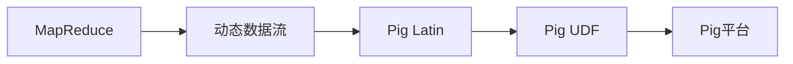

                 

# Pig大规模数据分析平台原理与代码实例讲解

> 关键词：Pig平台,大数据分析,MapReduce,编程语言,动态数据流

## 1. 背景介绍

### 1.1 问题由来
在大数据时代，海量数据的处理与分析成为了行业发展的核心竞争力。传统的数据处理方式面临着数据量爆炸、数据复杂度增加等挑战，迫切需要新的工具和框架来提升处理效率和数据分析的准确性。Pig是一种高级的数据流处理语言和平台，基于Hadoop生态，广泛应用于大规模数据分析场景，成为数据科学家和工程师的必备工具。

### 1.2 问题核心关键点
Pig平台的核心在于其提供的高级语言和丰富的库函数，可以轻松实现复杂的数据处理逻辑，并且支持动态数据流（Real-time Data Flow），适用于处理流式数据和实时数据处理。

Pig平台通过Pig Latin语法，使用类似于SQL的语句来描述数据流处理逻辑，与MapReduce模型结合，可以处理海量数据的并行处理和分布式计算。Pig平台的优势在于其灵活性、易用性和高效性，能够满足不同类型的数据处理需求。

### 1.3 问题研究意义
Pig平台的研究意义在于其对大数据时代数据处理和分析的重要作用，通过提供一种高级的、动态的数据流处理语言，帮助企业和研究机构在大数据时代能够高效、可靠地进行数据处理和分析，从而在市场竞争中占据优势。

## 2. 核心概念与联系

### 2.1 核心概念概述

为更好地理解Pig平台的原理与设计，我们首先介绍几个关键的核心概念：

- **Pig Latin**：Pig平台基于的高级数据流处理语言，类似于SQL，使用命令流的形式描述数据处理逻辑。

- **MapReduce**：Pig平台结合的分布式计算框架，用于处理大规模数据集的并行计算和分布式处理。

- **Pig数据流（Data Flow）**：Pig平台的核心概念，指的是动态的数据流处理机制，适用于处理流式数据和实时数据。

- **Pig UDF（User Defined Functions）**：用户自定义函数，允许用户在自己的需求上扩展Pig平台的函数库。

- **Pig动态数据流（Real-time Data Flow）**：Pig平台支持动态数据流的处理机制，能够处理实时数据，适用于需要实时数据分析的应用场景。

### 2.2 概念间的关系

这些核心概念之间存在着紧密的联系，构成了Pig平台的数据处理框架：

- **Pig Latin与MapReduce的结合**：Pig平台使用Pig Latin语言描述数据处理逻辑，然后通过MapReduce框架进行并行计算和分布式处理。

- **动态数据流与MapReduce的结合**：Pig平台的动态数据流机制，通过MapReduce的并行计算能力，支持大规模数据的实时处理和分析。

- **Pig UDF与Pig Latin的结合**：Pig UDF为用户自定义函数，扩展了Pig Latin语言的函数库，使Pig平台更加灵活和功能丰富。

- **动态数据流与Pig UDF的结合**：Pig平台的动态数据流支持，结合用户自定义函数，可以处理更复杂、更灵活的数据处理任务。

这些概念之间的逻辑关系可以通过以下Mermaid流程图来展示：



这个流程图展示了Pig平台的核心架构：MapReduce作为底层分布式计算框架，提供数据并行处理能力；动态数据流通过MapReduce实现，支持实时数据处理；Pig Latin作为高级语言，描述数据处理逻辑；Pig UDF扩展函数库，增加数据处理能力。

### 2.3 核心概念的整体架构

最后，我们用一个综合的流程图来展示这些核心概念在大数据处理中的整体架构：


这个综合流程图展示了Pig平台在大数据处理中的核心架构：大规模数据集通过MapReduce进行分布式计算，Pig Latin语言描述数据处理逻辑，用户自定义函数扩展Pig平台的函数库，动态数据流支持实时数据处理。

## 3. 核心算法原理 & 具体操作步骤

### 3.1 算法原理概述

Pig平台的算法原理基于MapReduce模型和动态数据流机制，通过将数据流分成多个小的数据块，并在多个节点上并行处理这些数据块，从而实现大规模数据的分布式处理和高效分析。

具体而言，Pig平台使用Pig Latin语言描述数据处理逻辑，将数据流分成多个小的数据块，并在多个节点上并行处理这些数据块。在处理过程中，Pig平台自动进行数据分片、并行处理和数据合并等操作，以优化数据处理效率。

### 3.2 算法步骤详解

Pig平台的数据处理流程一般包括以下几个关键步骤：

**Step 1: 数据读取**

在Pig Latin中，可以使用`load`和`store`函数来读取和存储数据。例如，可以使用`load 'datafile.txt'`读取文本文件，然后使用`store 'output.txt'`将结果存储到文本文件中。

**Step 2: 数据转换**

Pig Latin支持多种数据转换操作，如`group`、`filter`、`join`、`reduce`等。例如，可以使用`group data by field`对数据按字段进行分组，然后使用`filter`筛选出需要的数据。

**Step 3: 数据聚合**

Pig Latin支持数据聚合操作，如`group`、`groupBy`和`groupAll`等。例如，可以使用`group data by field`对数据按字段进行分组，然后使用`reduce`对每个组进行聚合操作。

**Step 4: 数据输出**

在Pig Latin中，可以使用`store`函数将处理结果存储到文件或数据库中。例如，可以使用`store result into 'output.txt'`将结果存储到文本文件中。

**Step 5: 数据优化**

Pig Latin支持数据优化操作，如`coalesce`、`cache`和`sort`等。例如，可以使用`coalesce`操作对数据进行合并，以优化数据流处理效率。

### 3.3 算法优缺点

Pig平台的优点在于其易用性和灵活性，能够处理大规模数据集和复杂的数据处理逻辑，并且支持动态数据流的处理。此外，Pig平台的性能也相对较高，能够处理海量数据的并行处理和分布式计算。

然而，Pig平台的缺点在于其学习曲线较陡，需要一定的编程经验和理解能力。此外，Pig平台的性能优化和调试相对复杂，需要具备一定的调试经验。

### 3.4 算法应用领域

Pig平台在大数据领域有着广泛的应用，适用于以下领域：

- **大规模数据分析**：适用于处理大规模数据集，进行数据统计、数据清洗和数据转换等操作。
- **实时数据分析**：适用于处理实时数据流，进行实时数据分析和实时处理。
- **大数据存储**：适用于大数据存储和数据备份，支持数据的持久化和分布式存储。
- **数据可视化**：支持数据可视化，生成图表和报告，帮助用户更好地理解数据。

## 4. 数学模型和公式 & 详细讲解  
### 4.1 数学模型构建

Pig平台的数据处理逻辑可以通过Pig Latin语言描述，并将其转换为MapReduce任务的逻辑。以下是一个简单的数据处理例子：

```
data = load 'data.txt';
filtered = filter data by field1 == 'value1';
result = group filtered by field2;
final_result = reduce result using 'sum' as (field3, 'sum');

store result into 'output.txt';
```

其中，`load`函数用于读取数据，`filter`函数用于过滤数据，`group`函数用于分组，`reduce`函数用于聚合操作。

### 4.2 公式推导过程

假设我们有一个数据集`data`，其中包含多个字段`field1`、`field2`和`field3`。以下是数据处理的数学模型构建：

1. 读取数据：

$$
data = load 'data.txt'
$$

2. 过滤数据：

$$
filtered = filter data by field1 == 'value1'
$$

3. 分组数据：

$$
result = group filtered by field2
$$

4. 聚合数据：

$$
final_result = reduce result using 'sum' as (field3, 'sum')
$$

其中，`reduce`函数对每个分组进行聚合操作，使用`sum`函数对`field3`进行求和。

### 4.3 案例分析与讲解

以下是一个具体的案例分析：

假设我们有一个数据集`orders`，其中包含订单信息，包括订单号、订单金额和订单日期。以下是订单金额统计的Pig Latin代码：

```
orders = load 'orders.txt';
result = group orders by 'date' using 'sum' as ('amount', 'sum');
store result into 'output.txt';
```

其中，`load`函数用于读取数据，`group`函数按日期分组，`reduce`函数使用`sum`函数对订单金额进行求和。最终将结果存储到`output.txt`文件中。

## 5. 项目实践：代码实例和详细解释说明

### 5.1 开发环境搭建

在进行Pig平台实践前，我们需要准备好开发环境。以下是使用Pig Latin进行开发的环境配置流程：

1. 安装Java环境：从官网下载安装JDK，并将其添加到系统路径。

2. 安装Pig平台：从官网下载安装Pig平台，并解压安装文件到指定目录。

3. 配置环境变量：配置Pig平台的环境变量，使其能够正确找到`pig`命令。

4. 测试环境配置：编写一个简单的Pig Latin脚本，测试环境配置是否正确。

完成上述步骤后，即可在Pig平台上开始开发实践。

### 5.2 源代码详细实现

这里我们以一个简单的数据转换为例，给出Pig Latin代码实现。

```
data = load 'data.txt';
filtered = filter data by field1 == 'value1';
result = group filtered by field2;
final_result = reduce result using 'sum' as (field3, 'sum');

store result into 'output.txt';
```

- `load 'data.txt'`：读取数据文件`data.txt`。
- `filter data by field1 == 'value1'`：过滤掉`field1`为`value1`的数据。
- `group filtered by field2`：按`field2`字段分组。
- `reduce result using 'sum' as (field3, 'sum')`：对每个分组的`field3`求和。
- `store result into 'output.txt'`：将结果存储到`output.txt`文件中。

### 5.3 代码解读与分析

让我们再详细解读一下关键代码的实现细节：

**load 'data.txt'**：读取数据文件`data.txt`。

**filter data by field1 == 'value1'**：过滤掉`field1`为`value1`的数据。

**group filtered by field2**：按`field2`字段分组。

**reduce result using 'sum' as (field3, 'sum')**：对每个分组的`field3`求和。

**store result into 'output.txt'**：将结果存储到`output.txt`文件中。

**5.4 运行结果展示**

假设我们有一个数据集`orders`，其中包含订单信息，包括订单号、订单金额和订单日期。以下是订单金额统计的Pig Latin代码：

```
orders = load 'orders.txt';
result = group orders by 'date' using 'sum' as ('amount', 'sum');
store result into 'output.txt';
```

运行上述代码后，将生成一个`output.txt`文件，其中包含按日期统计的订单金额信息。

## 6. 实际应用场景

### 6.1 金融数据分析

金融行业需要处理大量的交易数据和市场数据，进行数据分析和风险控制。Pig平台能够处理大规模数据集和实时数据流，适用于金融数据分析场景。

在金融数据分析中，Pig平台可以用于：

- **交易数据分析**：处理交易数据，生成交易报告和交易分析图表。
- **市场数据分析**：处理市场数据，生成市场趋势和市场分析报告。
- **风险控制**：进行风险分析和风险控制，生成风险预警报告。

### 6.2 电商数据分析

电商行业需要处理大量的交易数据和用户行为数据，进行数据分析和业务优化。Pig平台能够处理大规模数据集和实时数据流，适用于电商数据分析场景。

在电商数据分析中，Pig平台可以用于：

- **用户行为分析**：处理用户行为数据，生成用户行为报告和用户分析图表。
- **交易数据分析**：处理交易数据，生成交易报告和交易分析图表。
- **业务优化**：进行业务优化和业务分析，生成业务优化建议报告。

### 6.3 社交媒体数据分析

社交媒体行业需要处理大量的用户数据和内容数据，进行数据分析和内容推荐。Pig平台能够处理大规模数据集和实时数据流，适用于社交媒体数据分析场景。

在社交媒体数据分析中，Pig平台可以用于：

- **用户数据分析**：处理用户数据，生成用户分析报告和用户分析图表。
- **内容数据分析**：处理内容数据，生成内容分析报告和内容分析图表。
- **内容推荐**：进行内容推荐，生成内容推荐报告和内容推荐图表。

### 6.4 未来应用展望

随着Pig平台和Hadoop生态的不断发展，未来Pig平台将在更多领域得到应用，为各行各业带来变革性影响。

在智慧城市治理中，Pig平台可以用于：

- **城市事件监测**：处理城市事件数据，生成城市事件报告和城市事件分析图表。
- **舆情分析**：处理舆情数据，生成舆情分析报告和舆情分析图表。
- **应急指挥**：进行应急指挥和应急响应，生成应急指挥报告和应急指挥图表。

在医疗行业，Pig平台可以用于：

- **患者数据分析**：处理患者数据，生成患者分析报告和患者分析图表。
- **医疗事件分析**：处理医疗事件数据，生成医疗事件报告和医疗事件分析图表。
- **医疗决策支持**：进行医疗决策支持，生成医疗决策报告和医疗决策图表。

总之，Pig平台的应用前景广阔，将在更多领域得到应用，为各行各业带来变革性影响。相信随着Pig平台和Hadoop生态的不断发展，Pig平台必将在大数据时代发挥越来越重要的作用。

## 7. 工具和资源推荐

### 7.1 学习资源推荐

为了帮助开发者系统掌握Pig平台的数据处理逻辑，这里推荐一些优质的学习资源：

1. Pig平台官方文档：Pig平台官方提供的详细文档，包括Pig Latin语法、函数库、数据流操作等。

2. Pig平台教程：Pig平台社区提供的详细教程，包括Pig Latin语法、函数库、数据流操作等。

3. Pig平台实战案例：Pig平台社区提供的实际案例，涵盖金融、电商、社交媒体等多个领域的实际应用场景。

4. Pig平台书籍：Pig平台相关的技术书籍，包括《Pig Latin：Pig 平台指南》、《Pig平台编程实战》等。

通过对这些资源的学习实践，相信你一定能够快速掌握Pig平台的数据处理逻辑，并用于解决实际的业务问题。

### 7.2 开发工具推荐

高效的开发离不开优秀的工具支持。以下是几款用于Pig平台开发的常用工具：

1. Pig Latin：Pig平台的高级数据流处理语言，适用于描述数据处理逻辑。

2. Hadoop：Pig平台的底层分布式计算框架，适用于处理大规模数据集和分布式计算。

3. Pig UDF：Pig平台的用户自定义函数，适用于扩展Pig平台的函数库。

4. Hive：Hadoop的SQL查询引擎，适用于数据仓库和数据管理。

5. Cloudera Manager：Hadoop集群管理和监控工具，适用于Pig平台的集群管理和监控。

6. Jupyter Notebook：开源的交互式编程环境，适用于Pig平台的交互式开发和调试。

合理利用这些工具，可以显著提升Pig平台的数据处理开发效率，加快创新迭代的步伐。

### 7.3 相关论文推荐

Pig平台的研究意义在于其对大数据时代数据处理和分析的重要作用，通过提供一种高级的、动态的数据流处理语言，帮助企业和研究机构在大数据时代能够高效、可靠地进行数据处理和分析，从而在市场竞争中占据优势。以下是几篇奠基性的相关论文，推荐阅读：

1. Pig Latin：A Flexible Scripting Language for MapReduce：Pig平台的原始论文，介绍了Pig平台的语言设计和使用方式。

2. Pig：A Scripting Language for Big Data Stream Processing：Pig平台的设计原理和实现方式，涵盖了Pig平台的语言设计、数据流处理和分布式计算。

3. Pig Latin：A Flexible Scripting Language for MapReduce：Pig平台的语言设计和使用方式，涵盖了Pig平台的语言设计、数据流处理和分布式计算。

这些论文代表了大数据平台Pig的研究方向和发展脉络，通过学习这些前沿成果，可以帮助研究者把握学科前进方向，激发更多的创新灵感。

除上述资源外，还有一些值得关注的前沿资源，帮助开发者紧跟Pig平台和Hadoop生态的最新进展，例如：

1. arXiv论文预印本：人工智能领域最新研究成果的发布平台，包括大量尚未发表的前沿工作，学习前沿技术的必读资源。

2. 业界技术博客：如Cloudera、Hortonworks等顶尖实验室的官方博客，第一时间分享他们的最新研究成果和洞见。

3. 技术会议直播：如Hadoop大会、Big Data Conference等技术会议现场或在线直播，能够聆听到大佬们的前沿分享，开拓视野。

4. GitHub热门项目：在GitHub上Star、Fork数最多的Pig平台相关项目，往往代表了该技术领域的发展趋势和最佳实践，值得去学习和贡献。

5. 行业分析报告：各大咨询公司如McKinsey、PwC等针对大数据平台的分析报告，有助于从商业视角审视技术趋势，把握应用价值。

总之，对于Pig平台的数据处理逻辑的学习和实践，需要开发者保持开放的心态和持续学习的意愿。多关注前沿资讯，多动手实践，多思考总结，必将收获满满的成长收益。

## 8. 总结：未来发展趋势与挑战

### 8.1 总结

本文对Pig平台的数据处理逻辑进行了全面系统的介绍。首先阐述了Pig平台在处理大数据时代海量数据的重要作用，明确了Pig平台的语言设计和使用方式。其次，从原理到实践，详细讲解了Pig平台的数学模型和操作步骤，给出了Pig平台的代码实现和运行结果展示。同时，本文还广泛探讨了Pig平台在金融、电商、社交媒体等众多行业领域的应用前景，展示了Pig平台的应用潜力。

通过本文的系统梳理，可以看到，Pig平台在大数据时代的数据处理逻辑中扮演着重要的角色，通过提供一种高级的、动态的数据流处理语言，帮助企业和研究机构在大数据时代能够高效、可靠地进行数据处理和分析，从而在市场竞争中占据优势。

### 8.2 未来发展趋势

展望未来，Pig平台的数据处理逻辑将呈现以下几个发展趋势：

1. 平台化发展：Pig平台将与其他大数据平台（如Hadoop、Spark等）进一步集成，形成一体化的数据处理生态系统。

2. 实时化发展：Pig平台将支持更多实时数据流处理功能，适用于更多的实时数据应用场景。

3. 动态化发展：Pig平台将支持更多的动态数据流处理功能，能够处理更加灵活和复杂的数据处理任务。

4. 函数化发展：Pig平台将进一步扩展函数库，支持更多的用户自定义函数，使Pig平台更加灵活和强大。

5. 跨平台化发展：Pig平台将支持更多跨平台的数据处理任务，适用于更多的数据处理场景。

6. 标准化发展：Pig平台将进一步标准化，支持更多的数据格式和数据类型，提升数据处理的通用性。

以上趋势凸显了Pig平台在大数据处理领域的强大生命力，通过不断创新和优化，必将在大数据时代发挥越来越重要的作用。

### 8.3 面临的挑战

尽管Pig平台在大数据处理领域取得了显著成就，但在迈向更加智能化、普适化应用的过程中，它仍面临着诸多挑战：

1. 学习曲线陡峭：Pig平台的语言设计较为复杂，需要一定的编程经验和理解能力，对于初学者来说学习难度较大。

2. 性能优化复杂：Pig平台的性能优化和调试相对复杂，需要具备一定的调试经验和技术储备。

3. 生态系统依赖：Pig平台的强大功能依赖于Hadoop生态系统，一旦生态系统出现问题，将影响Pig平台的性能和使用。

4. 资源消耗大：Pig平台的运行需要占用大量计算资源和存储资源，对于小型数据处理任务来说，资源消耗较大。

5. 数据质量问题：Pig平台的数据处理逻辑需要输入高质量的数据，一旦输入数据存在问题，将影响处理结果的准确性。

6. 安全性问题：Pig平台的数据处理逻辑需要输入安全的数据，一旦输入数据存在安全漏洞，将影响处理结果的安全性。

### 8.4 研究展望

面对Pig平台和大数据处理面临的这些挑战，未来的研究需要在以下几个方面寻求新的突破：

1. 降低学习曲线：通过简化Pig平台的语言设计，提升语言的可读性和易用性，降低学习难度。

2. 优化性能和调试：通过优化Pig平台的性能和调试机制，提升Pig平台的运行效率和调试效率。

3. 加强跨平台支持：通过扩展Pig平台的跨平台支持能力，提升Pig平台的通用性和兼容性。

4. 降低资源消耗：通过优化Pig平台的资源消耗，提升Pig平台的资源利用率和运行效率。

5. 提高数据质量：通过引入数据质量检测和数据清洗技术，提升Pig平台输入数据的准确性和安全性。

6. 加强安全性保护：通过引入数据加密和安全审计技术，保护Pig平台输入数据的安全性和处理结果的安全性。

这些研究方向的探索，必将引领Pig平台和大数据处理技术的进一步发展，为构建智能化的数据处理系统铺平道路。面向未来，Pig平台和大数据处理技术还需要与其他人工智能技术进行更深入的融合，如深度学习、自然语言处理等，多路径协同发力，共同推动数据处理系统的进步。

总之，Pig平台在大数据时代的数据处理逻辑中扮演着重要的角色，通过不断创新和优化，必将在大数据时代发挥越来越重要的作用。只有勇于创新、敢于突破，才能不断拓展数据处理逻辑的边界，让数据处理系统更好地服务于社会发展和人类福祉。

## 9. 附录：常见问题与解答

**Q1：Pig平台适用于哪些数据处理场景？**

A: Pig平台适用于大规模数据集和实时数据流的处理场景，如金融数据分析、电商数据分析、社交媒体数据分析等。

**Q2：如何选择合适的Pig UDF？**

A: 选择合适的Pig UDF需要根据具体数据处理需求，考虑函数的功能和性能，如输入参数的数量、函数的执行效率等。

**Q3：Pig平台如何优化性能？**

A: 优化Pig平台性能可以通过以下方法：

1. 数据分片：将大规模数据集分为多个小数据片，进行并行处理，提升处理效率。
2. 数据缓存：对数据进行缓存，避免重复计算，提升处理效率。
3. 数据压缩：对数据进行压缩，减少数据量，提升处理效率。
4. 数据分区：对数据进行分区，提高查询效率。

**Q4：Pig平台如何进行跨平台数据处理？**

A: 进行跨平台数据处理可以通过以下方法：

1. 数据格式转换：将不同平台的数据格式转换为统一的格式，进行统一处理。
2. 数据同步：通过数据同步技术，将不同平台的数据同步到统一的存储系统中，进行统一处理。
3. 数据合并：将不同平台的数据合并，进行统一处理。

**Q5：Pig平台如何进行数据安全性保护？**

A: 进行数据安全性保护可以通过以下方法：

1. 数据加密：对数据进行加密处理，保护数据安全。
2. 访问控制：对数据进行访问控制，确保只有授权人员可以访问数据。
3. 安全审计：对数据访问进行安全审计，记录访问日志，发现异常行为。

这些方法可以帮助Pig平台在数据处理过程中，确保数据的安全性和隐私性。

---

作者：禅与计算机程序设计艺术 / Zen and the Art of Computer Programming

