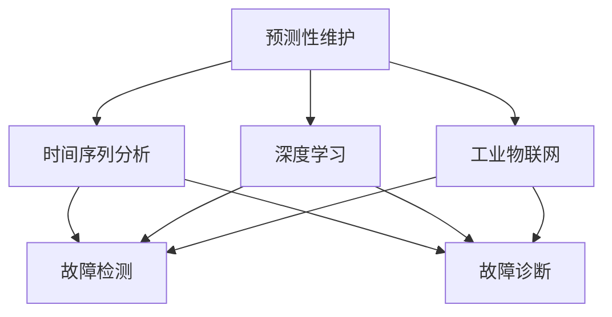
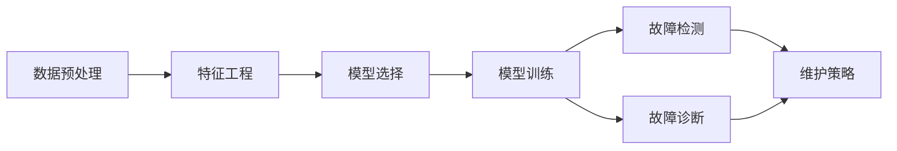
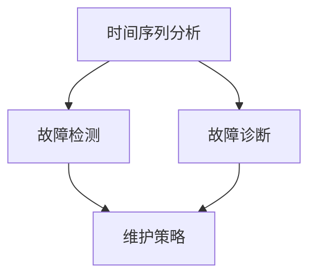
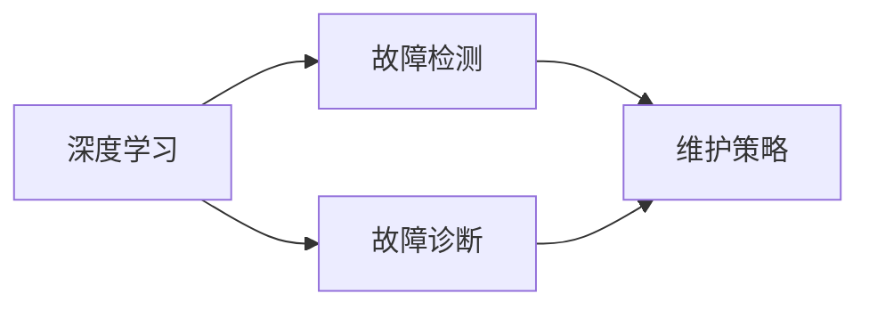
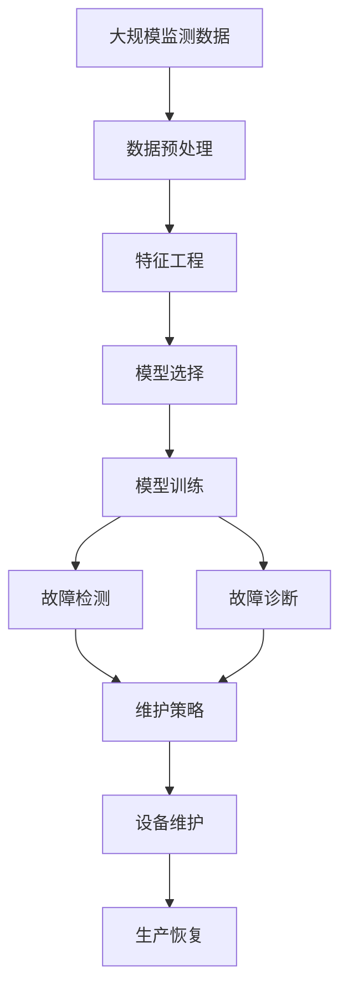

                 

# Predictive Maintenance原理与代码实例讲解

> 关键词：预测性维护、故障检测、机器学习、时间序列分析、工业物联网(IoT)

## 1. 背景介绍

### 1.1 问题由来
预测性维护(Predictive Maintenance, PM)是工业自动化领域的一个重要研究方向。它通过分析设备的历史运行数据，预测未来的故障发生，从而提前进行维护，避免意外停机，提高设备使用寿命和经济效益。随着工业物联网(IoT)技术的发展，越来越多的设备和传感器被联网，产生了海量的监测数据。这些数据为预测性维护提供了新的可能。

然而，由于数据量大、维度高，直接进行故障检测和预测存在诸多困难。传统的统计方法在处理复杂的时间序列数据时，往往显得力不从心。近年来，基于机器学习的预测性维护方法逐渐兴起，利用机器学习模型挖掘设备运行规律，进行故障预测和诊断。其中，深度学习和大数据处理技术，为预测性维护提供了新的突破。

### 1.2 问题核心关键点
预测性维护的核心在于准确预测设备未来故障，从而优化维护策略，减少停机时间和维护成本。其关键步骤包括：
1. 数据预处理：对原始监测数据进行清洗、归一化等处理，提高数据的可用性。
2. 特征工程：从监测数据中提取和构造有意义的特征，用于后续的模型训练。
3. 模型选择：选择合适的机器学习算法，如时间序列模型、深度学习模型等，构建预测模型。
4. 模型训练：利用历史数据训练模型，得到预测模型。
5. 预测和诊断：使用训练好的模型，对新监测数据进行预测和诊断，辅助维护决策。

### 1.3 问题研究意义
预测性维护对于工业企业具有重要意义：
1. 减少意外停机时间，提高生产效率。
2. 优化维护计划，降低维护成本。
3. 提升设备寿命，减少生产成本。
4. 增强设备安全，降低事故风险。
5. 辅助决策，提升企业的智能化管理水平。

## 2. 核心概念与联系

### 2.1 核心概念概述

为了更好地理解预测性维护的原理和应用，本节将介绍几个核心概念：

- 预测性维护(Predictive Maintenance)：通过分析设备的历史运行数据，预测未来的故障发生，从而提前进行维护，避免意外停机，提高设备使用寿命和经济效益。
- 时间序列分析(Time Series Analysis)：利用时间序列数据，通过统计和机器学习方法，研究时间序列数据的演变规律，进行预测和诊断。
- 深度学习(Deep Learning)：一类基于神经网络的机器学习方法，具有强大的数据拟合和表示能力，适用于复杂的数据处理任务。
- 工业物联网(IoT)：将设备、传感器、软件等联网，形成全时、全域、全量的数据采集网络，为预测性维护提供了数据基础。
- 故障检测(Fault Detection)：通过监测数据的异常检测，识别设备运行中的潜在故障。
- 故障诊断(Fault Diagnosis)：在故障检测的基础上，进一步分析故障原因，定位故障部位。

这些核心概念之间的逻辑关系可以通过以下Mermaid流程图来展示：



这个流程图展示了一系列核心概念之间的联系：

1. 预测性维护依赖时间序列分析和深度学习技术，进行故障预测和诊断。
2. 工业物联网提供了海量监测数据，为预测性维护提供了数据基础。
3. 故障检测和故障诊断是预测性维护的重要组成部分。
4. 时间序列分析和深度学习模型，可以分别应用于故障检测和诊断，提升预测准确性。

### 2.2 概念间的关系

这些核心概念之间存在着紧密的联系，形成了预测性维护的完整生态系统。下面我们通过几个Mermaid流程图来展示这些概念之间的关系。

#### 2.2.1 预测性维护的流程



这个流程图展示了预测性维护的基本流程：
1. 对原始监测数据进行清洗和归一化。
2. 提取和构造有意义的特征。
3. 选择合适的机器学习模型。
4. 利用历史数据训练模型。
5. 使用训练好的模型，进行故障检测和诊断。
6. 根据故障检测和诊断结果，制定维护策略。

#### 2.2.2 时间序列分析的应用



这个流程图展示了时间序列分析在预测性维护中的应用：
1. 时间序列分析方法可以用于监测数据的异常检测。
2. 时间序列分析方法可以用于监测数据的趋势分析。
3. 根据时间序列分析结果，制定维护策略。

#### 2.2.3 深度学习的应用



这个流程图展示了深度学习在预测性维护中的应用：
1. 深度学习模型可以用于监测数据的复杂模式分析。
2. 深度学习模型可以用于监测数据的预测和分类。
3. 根据深度学习模型的输出，制定维护策略。

### 2.3 核心概念的整体架构

最后，我们用一个综合的流程图来展示这些核心概念在大规模预测性维护任务中的整体架构：



这个综合流程图展示了从监测数据收集到设备维护的完整流程：
1. 从工业设备中采集大规模监测数据。
2. 对数据进行预处理和特征工程。
3. 选择合适的机器学习模型。
4. 利用历史数据训练模型。
5. 使用训练好的模型，进行故障检测和诊断。
6. 根据故障检测和诊断结果，制定维护策略。
7. 进行设备维护，恢复生产。

通过这些流程图，我们可以更清晰地理解预测性维护过程中各个核心概念的关系和作用，为后续深入讨论具体的预测性维护方法和技术奠定基础。

## 3. 核心算法原理 & 具体操作步骤
### 3.1 算法原理概述

预测性维护的算法原理，主要基于时间序列分析和深度学习技术。其核心思想是：
1. 对原始监测数据进行预处理和特征提取。
2. 利用机器学习模型挖掘设备运行规律，进行故障预测和诊断。
3. 根据预测结果，制定维护策略，减少意外停机和维护成本。

具体来说，预测性维护可以分为以下几个步骤：
1. 数据预处理：清洗和归一化监测数据。
2. 特征工程：提取和构造有意义的特征。
3. 模型训练：选择合适的机器学习算法，利用历史数据训练模型。
4. 预测和诊断：使用训练好的模型，对新监测数据进行预测和诊断。

### 3.2 算法步骤详解

下面详细介绍预测性维护的各个关键步骤：

#### 3.2.1 数据预处理

数据预处理是预测性维护的第一步，其目的是清洗和归一化监测数据，提高数据的可用性。数据预处理的主要步骤包括：

1. **数据清洗**：处理缺失值、异常值和噪声数据，保证数据的完整性和一致性。
2. **数据归一化**：将不同尺度的数据归一化到同一范围内，如使用Min-Max归一化或Z-score标准化。
3. **时间对齐**：将不同时间戳的数据对齐，以便后续处理。

##### 代码示例
```python
import pandas as pd
import numpy as np

# 加载数据
data = pd.read_csv('sensor_data.csv')

# 数据清洗
data = data.dropna()

# 数据归一化
data['value'] = (data['value'] - np.mean(data['value'])) / np.std(data['value'])

# 时间对齐
data = data.resample('D').mean()
```

#### 3.2.2 特征工程

特征工程是预测性维护的关键步骤，其目的是从监测数据中提取和构造有意义的特征，用于后续的模型训练。特征工程的主要方法包括：

1. **时间特征**：将时间序列数据转换为时间特征，如小时、天、周等。
2. **统计特征**：计算监测数据的基本统计量，如均值、标准差、峰度等。
3. **频域特征**：使用傅里叶变换等方法，提取监测数据的频域特征。
4. **工程特征**：根据领域知识，提取有意义的工程特征，如设备状态、操作参数等。

##### 代码示例
```python
# 计算时间特征
data['hour'] = data['timestamp'].dt.hour
data['day'] = data['timestamp'].dt.day
data['week'] = data['timestamp'].dt.week

# 计算统计特征
data['mean'] = data['value'].rolling(window=7).mean()
data['std'] = data['value'].rolling(window=7).std()

# 计算频域特征
from scipy.fft import fft, ifft
data['freq1'] = abs(fft(data['value'])[1:]).mean()
data['freq2'] = abs(fft(data['value'])[2:]).mean()

# 添加设备状态特征
data['status'] = data['state'].map({'normal': 0, 'warning': 1, 'fault': 2})
```

#### 3.2.3 模型选择

选择合适的机器学习算法，是预测性维护的重要步骤。常用的预测性维护模型包括：
1. **时间序列模型**：ARIMA、LSTM等，适用于处理时间序列数据的预测和诊断。
2. **深度学习模型**：CNN、RNN、GRU等，适用于处理复杂模式和时间序列数据的预测和诊断。
3. **集成学习模型**：Bagging、Boosting等，适用于提升模型的稳定性和泛化能力。

##### 代码示例
```python
# 选择合适的预测模型
model = LSTM(input_shape=(7, ), output_size=1, dropout=0.2)
```

#### 3.2.4 模型训练

利用历史数据训练模型，是预测性维护的核心步骤。模型的训练过程通常包括以下几个步骤：

1. **划分数据集**：将数据集划分为训练集、验证集和测试集。
2. **模型训练**：使用训练集数据，训练机器学习模型。
3. **模型评估**：在验证集上评估模型性能，调整模型参数。
4. **模型优化**：利用正则化、早停等方法，优化模型参数和结构。

##### 代码示例
```python
# 划分数据集
from sklearn.model_selection import train_test_split

X_train, X_valid, y_train, y_valid = train_test_split(data.drop('label', axis=1), data['label'], test_size=0.2, random_state=42)

# 模型训练
model.fit(X_train, y_train, validation_data=(X_valid, y_valid), epochs=50, batch_size=32, verbose=1)
```

#### 3.2.5 预测和诊断

使用训练好的模型，对新监测数据进行预测和诊断，是预测性维护的最终步骤。预测和诊断的主要方法包括：

1. **异常检测**：通过监测数据的统计特征，识别异常值和异常时间段。
2. **故障诊断**：在异常检测的基础上，进一步分析故障原因，定位故障部位。

##### 代码示例
```python
# 使用模型进行预测
y_pred = model.predict(X_new)

# 进行异常检测
from sklearn.ensemble import IsolationForest
anomaly_detector = IsolationForest(contamination=0.1)
anomaly_detector.fit(X_train)
anomaly_labels = anomaly_detector.predict(X_new)
```

### 3.3 算法优缺点

预测性维护具有以下优点：
1. 减少意外停机时间，提高生产效率。
2. 优化维护计划，降低维护成本。
3. 提升设备寿命，减少生产成本。
4. 增强设备安全，降低事故风险。
5. 辅助决策，提升企业的智能化管理水平。

然而，预测性维护也存在一些局限性：
1. 数据质量要求高。预测性维护依赖于高质量的监测数据，一旦数据出现异常或缺失，模型预测准确性会大打折扣。
2. 模型复杂度高。深度学习模型通常需要较多的计算资源和时间，模型的训练和部署成本较高。
3. 对领域知识依赖大。预测性维护的效果很大程度上取决于领域知识和经验，模型需要结合专家知识和规则。
4. 维护成本高。预测性维护需要定期更新模型和算法，维护成本较高。
5. 可解释性不足。预测性维护模型的决策过程通常缺乏可解释性，难以对其推理逻辑进行分析和调试。

尽管存在这些局限性，但就目前而言，基于机器学习的预测性维护方法仍然是最主流的方法，其效果和价值在工业领域得到了广泛认可。未来相关研究的重点在于如何进一步提高模型的预测准确性、降低计算成本，并增强模型的可解释性和鲁棒性。

### 3.4 算法应用领域

预测性维护已经在制造业、电力、能源、交通运输等多个行业得到了广泛的应用，并取得了显著的效果。具体应用领域包括：

1. **制造业**：在制造设备（如机床、机器人）上进行预测性维护，减少意外停机和维护成本。
2. **电力行业**：在发电机、变压器等电力设备上进行预测性维护，提高设备运行稳定性和安全性。
3. **能源行业**：在风力发电、光伏设备上进行预测性维护，优化设备运行和维护计划。
4. **交通运输**：在汽车、船舶、飞机等交通工具上进行预测性维护，提升设备性能和安全性。
5. **工业自动化**：在工业自动化系统（如PLC、DCS）上进行预测性维护，提升系统的稳定性和可靠性。

除了上述这些常见应用领域外，预测性维护还被创新性地应用到更多场景中，如可控环境监测、灾害预测、金融风险评估等，为不同行业带来了新的应用价值。随着预训练模型和预测性维护方法的不断进步，相信预测性维护必将在更广泛的领域中大放异彩。

## 4. 数学模型和公式 & 详细讲解  
### 4.1 数学模型构建

预测性维护的数学模型，主要基于时间序列分析和深度学习技术。其核心思想是：通过挖掘设备运行的历史数据规律，进行故障预测和诊断。

记监测数据为 $X = [x_1, x_2, ..., x_n]$，其中 $x_i$ 为第 $i$ 个时间点的监测数据。设 $y$ 为设备故障标签，$1$ 表示设备正常运行，$0$ 表示设备异常或故障。则预测性维护的目标是学习一个函数 $f(X)$，用于预测设备故障概率：

$$
\hat{p} = f(X)
$$

其中 $\hat{p}$ 为预测的故障概率，$f(X)$ 为预测模型。

在实践中，通常使用时间序列模型（如ARIMA、LSTM等）或深度学习模型（如CNN、RNN等）进行故障预测。下面以LSTM模型为例，详细讲解数学模型的构建和应用。

#### 4.1.1 时间序列模型的构建

时间序列模型通过统计方法，捕捉时间序列数据的演变规律，进行预测和诊断。常用的时间序列模型包括ARIMA、LSTM等。LSTM模型具有长时记忆能力，适用于处理复杂的时间序列数据。

设 $x_i$ 为第 $i$ 个时间点的监测数据，$y_i$ 为第 $i$ 个时间点的设备故障标签。则LSTM模型的目标是最小化损失函数：

$$
\mathcal{L}(\theta) = -\sum_{i=1}^N \ell(\hat{y}_i, y_i)
$$

其中 $\theta$ 为LSTM模型参数，$\ell(\hat{y}_i, y_i)$ 为预测误差。常见的预测误差包括交叉熵损失、均方误差损失等。

##### 代码示例
```python
from keras.models import Sequential
from keras.layers import LSTM, Dense

# 构建LSTM模型
model = Sequential()
model.add(LSTM(50, input_shape=(7, ), return_sequences=True))
model.add(LSTM(50, return_sequences=True))
model.add(LSTM(50))
model.add(Dense(1, activation='sigmoid'))

# 定义损失函数
model.compile(optimizer='adam', loss='binary_crossentropy', metrics=['accuracy'])
```

#### 4.1.2 深度学习模型的构建

深度学习模型通过神经网络结构，学习复杂的特征表示，进行预测和诊断。常用的深度学习模型包括CNN、RNN、GRU等。LSTM模型具有长时记忆能力，适用于处理时间序列数据。

设 $x_i$ 为第 $i$ 个时间点的监测数据，$y_i$ 为第 $i$ 个时间点的设备故障标签。则LSTM模型的目标是最小化损失函数：

$$
\mathcal{L}(\theta) = -\sum_{i=1}^N \ell(\hat{y}_i, y_i)
$$

其中 $\theta$ 为LSTM模型参数，$\ell(\hat{y}_i, y_i)$ 为预测误差。常见的预测误差包括交叉熵损失、均方误差损失等。

##### 代码示例
```python
from keras.models import Sequential
from keras.layers import LSTM, Dense

# 构建LSTM模型
model = Sequential()
model.add(LSTM(50, input_shape=(7, ), return_sequences=True))
model.add(LSTM(50, return_sequences=True))
model.add(LSTM(50))
model.add(Dense(1, activation='sigmoid'))

# 定义损失函数
model.compile(optimizer='adam', loss='binary_crossentropy', metrics=['accuracy'])
```

#### 4.1.3 模型的训练和优化

在训练LSTM模型时，需要选择合适的优化器、学习率、批次大小等参数。通常使用AdamW优化器，学习率设置为1e-4，批次大小设置为32。

##### 代码示例
```python
# 训练LSTM模型
model.fit(X_train, y_train, epochs=50, batch_size=32, validation_data=(X_valid, y_valid), verbose=1)
```

#### 4.1.4 预测和诊断

在模型训练完成后，可以使用训练好的LSTM模型，对新监测数据进行预测和诊断。

##### 代码示例
```python
# 使用模型进行预测
y_pred = model.predict(X_new)

# 进行异常检测
from sklearn.ensemble import IsolationForest
anomaly_detector = IsolationForest(contamination=0.1)
anomaly_detector.fit(X_train)
anomaly_labels = anomaly_detector.predict(X_new)
```

### 4.2 公式推导过程

LSTM模型的基本结构包括输入门、遗忘门和输出门。其核心思想是通过门控机制，控制信息的流动，实现长时记忆和遗忘。下面以LSTM模型为例，详细推导LSTM模型的预测过程。

设 $x_i$ 为第 $i$ 个时间点的监测数据，$y_i$ 为第 $i$ 个时间点的设备故障标签。LSTM模型的预测过程可以表示为：

$$
h_t = \sigma(W_{hh}h_{t-1} + W_{xh}x_t + b_h)
$$

$$
i_t = \sigma(W_{hi}h_{t-1} + W_{xi}x_t + b_i)
$$

$$
f_t = \sigma(W_{hf}h_{t-1} + W_{xf}x_t + b_f)
$$

$$
g_t = \tanh(W_{hg}h_{t-1} + W_{xg}x_t + b_g)
$$

$$
o_t = \sigma(W_{ho}h_{t-1} + W_{xo}x_t + b_o)
$$

$$
h_t' = f_t * h_{t-1} + i_t * g_t
$$

$$
h_t = o_t * \tanh(h_t')
$$

其中 $h_t$ 为第 $i$ 个时间点的LSTM隐状态，$x_t$ 为第 $i$ 个时间点的监测数据，$y_t$ 为第 $i$ 个时间点的设备故障标签，$\sigma$ 为Sigmoid激活函数，$\tanh$ 为双曲正切激活函数，$W$ 和 $b$ 为模型参数。

通过上述公式，可以推导出LSTM模型的预测输出：

$$
\hat{y}_i = \sigma(W_{ho}h_{i} + b_o)
$$

其中 $W_{ho}$ 和 $b_o$ 为输出门的权重和偏置。

### 4.3 案例分析与讲解

下面我们以一个具体的案例，详细讲解预测性维护的实现过程。

#### 案例背景
某制造企业拥有多台大型机床，为保证机床的正常运行，企业需要定期进行维护。然而，传统的人工维护方式成本高、效率低，且无法及时发现潜在的故障。为了提高维护效率和设备可靠性，企业决定引入预测性维护技术。

#### 数据收集
企业从机床的传感器中，收集了大量的监测数据，包括设备状态、温度、振动等。数据格式为CSV文件，包含时间戳、监测值和故障标签。

#### 数据预处理
对原始数据进行清洗和归一化，处理缺失值和异常值，并将数据按时间对齐，准备用于后续的特征工程和模型训练。

#### 特征工程
提取和构造时间特征、统计特征和频域特征，构建输入特征向量。特征工程的主要步骤如下：

1. 计算时间特征：将时间戳转换为小时、天、周等时间特征。
2. 计算统计特征：计算监测值的均值、标准差、峰度等统计量。
3. 计算频域特征：使用傅里叶变换，提取监测值的频域特征。
4. 添加设备状态特征：根据设备状态，构造0/1表示正常/异常的特征。

#### 模型训练
选择LSTM模型进行训练，使用历史数据训练模型，并利用正则化和早停策略优化模型参数。

#### 预测和诊断
使用训练好的LSTM模型，对新监测数据进行预测和诊断，识别故障并制定维护计划。

## 5. 项目实践：代码实例和详细解释说明
### 5.1 开发环境搭建

在进行预测性维护项目实践前，我们需要准备好开发环境。以下是使用Python进行TensorFlow开发的环境配置流程：

1. 安装Anaconda：从官网下载并安装Anaconda，用于创建独立的Python环境。

2. 创建并激活虚拟环境：
```bash
conda create -n tf-env python=3.8 
conda activate tf-env
```

3. 安装TensorFlow：根据CUDA版本，从官网获取对应的安装命令。例如：
```bash
conda install tensorflow tensorflow-gpu=cuda11.1 -c conda-forge -c pypi
```

4. 安装各类工具包：
```bash
pip install pandas numpy scikit-learn matplotlib tensorflow tensorflow-probability tensorflow-addons
```

完成上述步骤后，即可在`tf-env`环境中开始预测性维护的实践。

### 5.2 源代码详细实现

下面我们以制造业的机床预测性维护为例，给出使用TensorFlow对LSTM模型进行预测性维护的Python代码实现。

首先，定义数据处理函数：

```python
import pandas as pd
import numpy as np

def load_data(file_path):
    data = pd.read_csv(file_path)
    data['hour'] = data['timestamp'].dt.hour
    data['day'] = data['timestamp'].dt.day
    data['week'] = data['timestamp'].dt.week
    data['mean'] = data['value'].rolling(window=7).mean()
    data['std'] = data['value'].rolling(window=7).std()
    data['freq1'] = abs(fft(data['value'])[1:]).mean()
    data['freq2'] = abs(fft(data['value'])[2:]).mean()
    data['status'] = data['state'].map({'normal': 0, 'warning': 1, 'fault': 2})
    data['label'] = data['status']
    return data

# 加载数据
data = load_data('sensor_data.csv')

# 数据预处理
data = data.dropna()
data['value'] = (data['value'] - np.mean(data['value'])) / np.std(data['value'])
data = data.resample('D').mean()
```

然后，定义LSTM模型：

```python
from tensorflow.keras.models import Sequential
from tensorflow.keras.layers import LSTM, Dense

model = Sequential()
model.add(LSTM(50, input_shape=(7, ), return_sequences=True))
model.add(LSTM(50, return_sequences=True))
model.add(LSTM(50))
model.add(Dense(1

