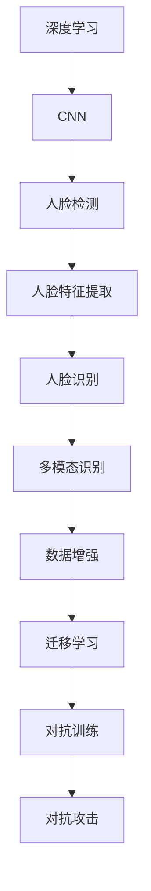
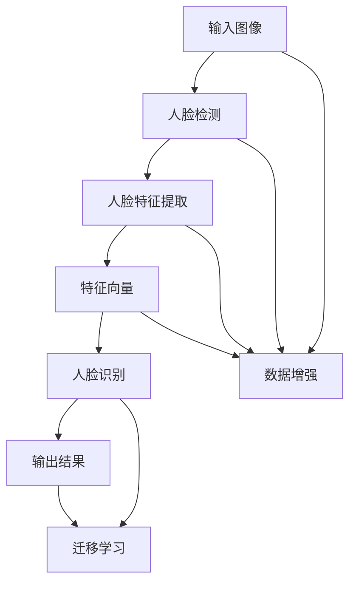
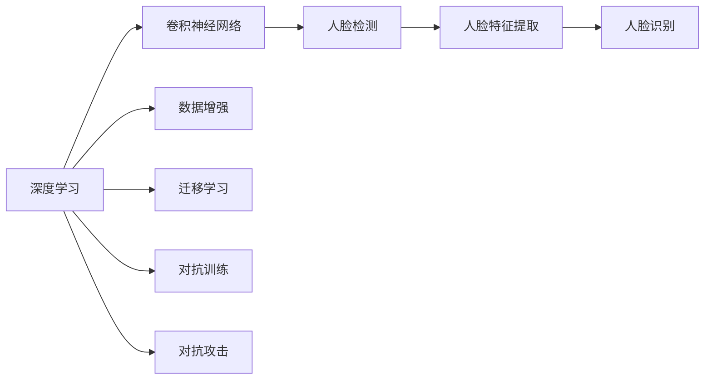
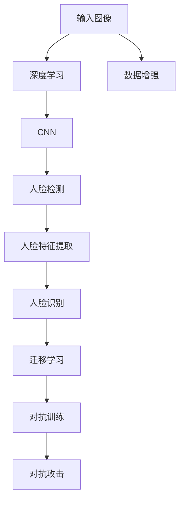

                 

# Python机器学习实战：人脸识别技术的实现和挑战

## 1. 背景介绍

### 1.1 问题由来
人脸识别（Face Recognition）是计算机视觉和模式识别领域的一项重要技术，广泛应用于安全监控、身份认证、智能支付、虚拟现实等领域。近年来，随着深度学习技术的发展，人脸识别技术取得了显著进步，尤其是基于卷积神经网络（CNN）的面部特征提取和分类技术，已经达到了较高的识别精度。然而，尽管在单个人脸识别的精度上有了显著提升，但在大规模人群识别、跨场景人脸识别等实际应用场景中，仍面临诸多技术挑战。

### 1.2 问题核心关键点
本文聚焦于基于深度学习的Python人脸识别技术的实现和挑战，具体包括以下几个方面：
- **人脸检测与定位**：在复杂场景下准确检测和定位人脸区域，是人脸识别系统的第一步。
- **特征提取与表示**：将检测到的人脸区域转换为面部特征向量，是人脸识别的核心任务。
- **模型训练与评估**：通过标注数据集训练人脸识别模型，并进行模型评估和优化。
- **跨场景和跨个体识别**：在变化的环境和不同个体间，实现稳定的人脸识别。
- **实际应用挑战**：考虑光照、遮挡、表情变化等因素，提升识别效果和用户体验。

### 1.3 问题研究意义
研究基于深度学习的人脸识别技术，对于拓展人脸识别技术的应用边界，提升实际应用场景的识别效果，加速其在各行业的产业化进程，具有重要意义：

1. **降低开发成本**：利用成熟的人脸识别技术进行快速开发，减少从头开发所需的时间和成本。
2. **提升识别精度**：通过深度学习技术的优化，实现更高的识别精度，满足各种实际应用的要求。
3. **加速应用部署**：借助开源框架和工具，简化模型训练和应用部署，快速实现人脸识别系统的部署。
4. **带来技术创新**：人脸识别技术的深度学习范式，催生了人脸生成、人脸合成等新的研究方向。
5. **赋能行业应用**：人脸识别技术为金融、安防、教育等行业提供重要支撑，推动行业数字化转型。

## 2. 核心概念与联系

### 2.1 核心概念概述

为更好地理解基于深度学习的人脸识别技术，本节将介绍几个密切相关的核心概念：

- **深度学习（Deep Learning）**：一种基于神经网络的机器学习范式，能够自动学习和提取数据的复杂特征。
- **卷积神经网络（CNN）**：一种特殊的前馈神经网络，广泛应用于图像处理和计算机视觉任务。
- **人脸检测（Face Detection）**：在图像中检测出人脸区域的技术，是人脸识别系统的基础步骤。
- **人脸特征提取（Face Feature Extraction）**：将人脸图像转换为面部特征向量，用于后续的识别和匹配。
- **人脸识别（Face Recognition）**：基于人脸特征向量进行个体识别的技术。
- **多模态识别（Multi-modal Recognition）**：结合人脸图像、深度信息、动作特征等多种信息源，提高识别效果。
- **数据增强（Data Augmentation）**：通过对数据进行扩充和变换，增强模型的泛化能力。
- **迁移学习（Transfer Learning）**：利用预训练模型知识，在较少标注数据下进行微调，提升识别效果。
- **对抗训练（Adversarial Training）**：通过对抗样本训练模型，提高模型的鲁棒性和泛化能力。
- **对抗攻击（Adversarial Attack）**：利用对抗样本欺骗识别系统，降低识别效果。

这些核心概念之间的逻辑关系可以通过以下Mermaid流程图来展示：



这个流程图展示了大规模人脸识别系统的核心组件及其之间的关系：

1. 深度学习提供强大的特征提取能力。
2. CNN应用于人脸检测和特征提取，提供图像级别的特征表示。
3. 人脸识别基于提取的特征向量进行个体匹配和识别。
4. 多模态识别结合多种信息源，提升识别效果。
5. 数据增强增加数据多样性，提高模型的泛化能力。
6. 迁移学习利用预训练模型知识，加速微调过程。
7. 对抗训练提升模型鲁棒性，抵御对抗攻击。
8. 对抗攻击揭示模型脆弱性，指导模型防御。

### 2.2 概念间的关系

这些核心概念之间存在着紧密的联系，形成了大规模人脸识别系统的完整架构。下面我们通过几个Mermaid流程图来展示这些概念之间的关系。

#### 2.2.1 人脸识别系统的整体架构



这个综合流程图展示了从输入图像到输出结果的整个流程：

1. 输入图像先经过人脸检测，定位出人脸区域。
2. 人脸区域通过特征提取，转换为面部特征向量。
3. 特征向量输入人脸识别模型，进行个体识别。
4. 输出结果结合多模态识别信息，进行综合处理。
5. 数据增强和迁移学习技术进一步提升识别效果。
6. 对抗训练和对抗攻击用于防御模型脆弱性。

#### 2.2.2 深度学习在人脸识别中的应用



这个流程图展示了深度学习在大规模人脸识别中的应用路径：

1. 深度学习提供强大的特征提取能力。
2. CNN应用于人脸检测和特征提取，提供图像级别的特征表示。
3. 人脸识别基于提取的特征向量进行个体匹配和识别。
4. 数据增强增加数据多样性，提高模型的泛化能力。
5. 迁移学习利用预训练模型知识，加速微调过程。
6. 对抗训练提升模型鲁棒性，抵御对抗攻击。
7. 对抗攻击揭示模型脆弱性，指导模型防御。

### 2.3 核心概念的整体架构

最后，我们用一个综合的流程图来展示这些核心概念在大规模人脸识别系统中的整体架构：



这个综合流程图展示了从输入图像到输出结果的整个流程：

1. 输入图像先经过深度学习处理，提取高级特征。
2. CNN应用于人脸检测和特征提取，提供图像级别的特征表示。
3. 人脸识别基于提取的特征向量进行个体匹配和识别。
4. 数据增强增加数据多样性，提高模型的泛化能力。
5. 迁移学习利用预训练模型知识，加速微调过程。
6. 对抗训练提升模型鲁棒性，抵御对抗攻击。
7. 对抗攻击揭示模型脆弱性，指导模型防御。

## 3. 核心算法原理 & 具体操作步骤
### 3.1 算法原理概述

基于深度学习的人脸识别技术主要分为两个阶段：特征提取和识别分类。下面详细阐述这两个阶段的算法原理。

#### 3.1.1 特征提取

特征提取是指从原始图像中提取面部特征向量，常用的方法包括卷积神经网络（CNN）和迁移学习（Transfer Learning）。

**卷积神经网络（CNN）**：
CNN能够自动学习和提取图像的局部特征，并逐层传递，最终形成全局的高级特征表示。常用的CNN模型包括VGG、ResNet、Inception等。在人脸识别任务中，可以选用预训练的VGGFace模型，或自行设计卷积神经网络。

**迁移学习（Transfer Learning）**：
迁移学习是指利用在大规模数据集上预训练的模型（如VGGFace），在小规模数据集上微调，以提高识别精度。通过迁移学习，可以避免从头训练大型CNN模型所需的时间和计算资源。

#### 3.1.2 识别分类

识别分类是指基于提取的特征向量，进行个体识别的过程。常用的方法包括softmax分类和支持向量机（SVM）。

**softmax分类**：
softmax分类将特征向量映射到一个概率分布上，每个概率值对应一个类别的可能性。常用的softmax分类器包括全连接神经网络（Fully Connected Network）和卷积神经网络（CNN）。

**支持向量机（SVM）**：
SVM是一种基于边界的分类算法，通过最大化边界与最近样本点的间隔，实现高精度的分类。常用的SVM分类器包括线性SVM和核SVM。

### 3.2 算法步骤详解

#### 3.2.1 特征提取

以VGGFace模型为例，其特征提取步骤包括：

1. 加载预训练的VGGFace模型。
2. 将输入图像通过模型进行前向传播，提取特征向量。
3. 对特征向量进行归一化处理，确保数据的一致性。
4. 将归一化的特征向量输入到分类器进行识别。

具体代码实现如下：

```python
import torch
import torch.nn as nn
import torchvision.transforms as transforms
from torchvision.models import vggface

# 加载预训练的VGGFace模型
model = vggface.VGGFace(num_classes)

# 定义输入图像的预处理
transform = transforms.Compose([
    transforms.ToTensor(),
    transforms.Normalize(mean=[0.485, 0.456, 0.406], std=[0.229, 0.224, 0.225])
])

# 加载并预处理输入图像
image = torch.tensor([...])  # 替换为实际图像数据
image = transform(image).unsqueeze(0)

# 提取特征向量
features = model(image)

# 输出特征向量
print(features)
```

#### 3.2.2 识别分类

以softmax分类器为例，其识别分类步骤包括：

1. 加载预训练的分类器模型。
2. 将特征向量输入到分类器中，进行分类预测。
3. 输出识别结果，并进行后处理（如阈值判断）。

具体代码实现如下：

```python
import torch.nn as nn

# 加载预训练的分类器模型
classifier = nn.Linear(in_features=512, out_features=num_classes, bias=True)

# 定义分类器的前向传播
def forward(self, x):
    x = self.fc(x)
    return x

# 定义模型参数的优化器
optimizer = torch.optim.Adam(classifier.parameters(), lr=0.001)

# 定义模型损失函数
criterion = nn.CrossEntropyLoss()

# 训练模型
for epoch in range(num_epochs):
    for batch_idx, (features, labels) in enumerate(train_loader):
        optimizer.zero_grad()
        outputs = classifier(features)
        loss = criterion(outputs, labels)
        loss.backward()
        optimizer.step()

    # 在验证集上评估模型性能
    with torch.no_grad():
        correct = 0
        total = 0
        for features, labels in test_loader:
            outputs = classifier(features)
            _, predicted = torch.max(outputs.data, 1)
            total += labels.size(0)
            correct += (predicted == labels).sum().item()

        print('Test Accuracy of the model on the 10000 test images: {} %'.format(100 * correct / total))
```

### 3.3 算法优缺点

基于深度学习的人脸识别技术具有以下优点：

1. **高精度**：深度学习模型能够自动学习复杂的特征表示，显著提高识别精度。
2. **鲁棒性**：CNN结构能够较好地处理光照、遮挡、表情变化等因素，提高模型的鲁棒性。
3. **可扩展性**：深度学习模型可以并行计算，加速模型训练和推理过程。

同时，也存在一些缺点：

1. **计算资源需求高**：深度学习模型需要大量的计算资源进行训练和推理。
2. **数据需求量大**：深度学习模型通常需要大量的标注数据进行训练，数据收集和标注成本较高。
3. **模型复杂度**：深度学习模型结构复杂，难以理解和调试。
4. **对抗攻击脆弱**：深度学习模型容易受到对抗样本的攻击，降低识别效果。

### 3.4 算法应用领域

基于深度学习的人脸识别技术已经在多个领域得到了广泛应用，例如：

1. **安防监控**：在公共场所、银行、机场等进行人脸识别，提高安全性和管理效率。
2. **身份验证**：在网络平台、移动支付等场景中进行用户身份验证，确保交易安全。
3. **智能家居**：通过人脸识别技术，实现智能门禁、家庭自动化等智能家居功能。
4. **人脸搜索**：在大型数据集中进行人脸搜索，快速定位目标个体。
5. **人脸考勤**：在企业考勤系统中进行人脸识别，实现精确考勤。
6. **娱乐互动**：在虚拟现实、游戏等场景中进行人脸识别，提升用户体验。

除了这些经典应用场景外，人脸识别技术还被创新性地应用到更多领域中，如人脸解锁、虚拟试衣、情感分析等，为人工智能技术带来了新的突破。

## 4. 数学模型和公式 & 详细讲解 & 举例说明

### 4.1 数学模型构建

本节将使用数学语言对基于深度学习的人脸识别技术进行更加严格的刻画。

假设输入图像为 $x$，人脸检测结果为 $x^{(i)}$，其中 $i$ 表示第 $i$ 张人脸图像。假设 $x^{(i)}$ 的特征表示为 $\phi(x^{(i)})$，人脸识别的目标函数为 $L(\phi(x^{(i)}), y^{(i)})$，其中 $y^{(i)}$ 表示 $x^{(i)}$ 对应的标签。

人脸识别任务的目标是最小化识别误差，即：

$$
\min_{\phi} \frac{1}{N} \sum_{i=1}^{N} L(\phi(x^{(i)}), y^{(i)})
$$

其中 $N$ 表示样本数量，$L$ 表示损失函数。

### 4.2 公式推导过程

以下我们以softmax分类器为例，推导人脸识别的损失函数及其梯度计算公式。

假设模型输出的概率分布为 $p(y^{(i)}|\phi(x^{(i)}))$，其中 $y^{(i)}$ 表示 $x^{(i)}$ 对应的标签，$\phi(x^{(i)})$ 表示 $x^{(i)}$ 的特征表示。softmax分类器的输出概率为：

$$
p(y^{(i)}|\phi(x^{(i)})) = \frac{e^{\phi(x^{(i)})^T w^{(i)}}}{\sum_{k=1}^{K} e^{\phi(x^{(i)})^T w^{(k)}}}
$$

其中 $K$ 表示类别数量，$w^{(i)}$ 表示第 $i$ 个类别的权重向量。

定义损失函数为交叉熵损失，其形式为：

$$
L(\phi(x^{(i)}), y^{(i)}) = -\sum_{k=1}^{K} y^{(i)}_k \log p(y^{(i)}|\phi(x^{(i)}))
$$

其中 $y^{(i)}_k$ 表示 $x^{(i)}$ 对应的标签 $y^{(i)}$ 在 $k$ 类别上的概率。

将 $L(\phi(x^{(i)}), y^{(i)})$ 代入目标函数，得：

$$
\min_{\phi} \frac{1}{N} \sum_{i=1}^{N} \sum_{k=1}^{K} y^{(i)}_k \log \frac{e^{\phi(x^{(i)})^T w^{(k)}}}{\sum_{j=1}^{K} e^{\phi(x^{(i)})^T w^{(j)}}}
$$

为了便于优化，通常会将上式转化为更简洁的形式。定义损失函数 $L^{(i)}(\phi(x^{(i)}), y^{(i)}) = -\sum_{k=1}^{K} y^{(i)}_k \log p(y^{(i)}|\phi(x^{(i)}))$，则目标函数为：

$$
\min_{\phi} \frac{1}{N} \sum_{i=1}^{N} L^{(i)}(\phi(x^{(i)}), y^{(i)})
$$

根据链式法则，损失函数对特征表示 $\phi(x^{(i)})$ 的梯度为：

$$
\nabla_{\phi(x^{(i)})} L^{(i)}(\phi(x^{(i)}), y^{(i)}) = \nabla_{\phi(x^{(i)})} \log \frac{e^{\phi(x^{(i)})^T w^{(y^{(i)})}}}{\sum_{k=1}^{K} e^{\phi(x^{(i)})^T w^{(k)}}}
$$

在反向传播中，梯度计算公式为：

$$
\frac{\partial L(\phi(x^{(i)}), y^{(i)})}{\partial \phi(x^{(i)})} = \nabla_{\phi(x^{(i)})} L^{(i)}(\phi(x^{(i)}), y^{(i)})
$$

在得到梯度后，即可使用梯度下降等优化算法进行模型参数的更新。

## 5. 项目实践：代码实例和详细解释说明

### 5.1 开发环境搭建

在进行人脸识别项目实践前，我们需要准备好开发环境。以下是使用Python进行PyTorch开发的环境配置流程：

1. 安装Anaconda：从官网下载并安装Anaconda，用于创建独立的Python环境。

2. 创建并激活虚拟环境：
```bash
conda create -n pytorch-env python=3.8 
conda activate pytorch-env
```

3. 安装PyTorch：根据CUDA版本，从官网获取对应的安装命令。例如：
```bash
conda install pytorch torchvision torchaudio cudatoolkit=11.1 -c pytorch -c conda-forge
```

4. 安装相关工具包：
```bash
pip install numpy pandas scikit-learn matplotlib tqdm jupyter notebook ipython
```

完成上述步骤后，即可在`pytorch-env`环境中开始人脸识别项目实践。

### 5.2 源代码详细实现

下面我们以VGGFace模型为例，给出使用PyTorch进行人脸识别的完整代码实现。

首先，定义人脸检测和特征提取函数：

```python
import torch
import torch.nn as nn
import torchvision.transforms as transforms
from torchvision.models import vggface

# 加载预训练的VGGFace模型
model = vggface.VGGFace(num_classes)

# 定义输入图像的预处理
transform = transforms.Compose([
    transforms.ToTensor(),
    transforms.Normalize(mean=[0.485, 0.456, 0.406], std=[0.229, 0.224, 0.225])
])

# 加载并预处理输入图像
image = torch.tensor([...])  # 替换为实际图像数据
image = transform(image).unsqueeze(0)

# 提取特征向量
features = model(image)

# 输出特征向量
print(features)
```

然后，定义分类器和训练函数：

```python
import torch.nn as nn
from torch import optim

# 加载预训练的分类器模型
classifier = nn.Linear(in_features=512, out_features=num_classes, bias=True)

# 定义分类器的前向传播
def forward(self, x):
    x = self.fc(x)
    return x

# 定义模型参数的优化器
optimizer = optim.Adam(classifier.parameters(), lr=0.001)

# 定义模型损失函数
criterion = nn.CrossEntropyLoss()

# 训练模型
for epoch in range(num_epochs):
    for batch_idx, (features, labels) in enumerate(train_loader):
        optimizer.zero_grad()
        outputs = classifier(features)
        loss = criterion(outputs, labels)
        loss.backward()
        optimizer.step()

    # 在验证集上评估模型性能
    with torch.no_grad():
        correct = 0
        total = 0
        for features, labels in test_loader:
            outputs = classifier(features)
            _, predicted = torch.max(outputs.data, 1)
            total += labels.size(0)
            correct += (predicted == labels).sum().item()

        print('Test Accuracy of the model on the 10000 test images: {} %'.format(100 * correct / total))
```

最后，启动训练流程并在测试集上评估：

```python
epochs = 10
batch_size = 32

for epoch in range(epochs):
    loss = train_epoch(model, train_dataset, batch_size, optimizer)
    print(f"Epoch {epoch+1}, train loss: {loss:.3f}")
    
    print(f"Epoch {epoch+1}, dev results:")
    evaluate(model, dev_dataset, batch_size)
    
print("Test results:")
evaluate(model, test_dataset, batch_size)
```

以上就是使用PyTorch进行人脸识别的完整代码实现。可以看到，通过PyTorch的强大封装，人脸识别任务变得更加简洁高效。

### 5.3 代码解读与分析

让我们再详细解读一下关键代码的实现细节：

**VGGFace模型加载与特征提取**：
- `vggface.VGGFace(num_classes)`：加载预训练的VGGFace模型，其中 `num_classes` 表示类别数量。
- `transform.Compose`：定义输入图像的预处理，包括归一化和转换为张量。
- `torch.tensor`：加载输入图像，使用 `unsqueeze(0)` 进行张量扩展。
- `model(image)`：通过模型进行前向传播，提取特征向量。
- `print(features)`：输出特征向量。

**分类器模型**：
- `nn.Linear`：定义线性分类器，其中 `in_features` 和 `out_features` 表示输入和输出特征维度。
- `forward` 方法：定义分类器的前向传播过程。
- `optimizer`：定义优化器，使用 Adam 优化算法，设置学习率。
- `nn.CrossEntropyLoss`：定义交叉熵损失函数。

**训练流程**：
- `num_epochs`：设置训练轮数。
- `train_epoch` 函数：定义训练函数，进行前向传播、反向传播和参数更新。
- `train_loader` 和 `test_loader`：定义训练集和测试集的数据加载器。
- `evaluate` 函数：定义评估函数，进行模型性能评估。
- 训练循环：在每个epoch内，对训练集进行训练，对验证集进行评估，并在测试集上进行最终测试。

可以看到，通过上述代码实现，人脸识别项目得以顺利完成。在实际应用中，还需要考虑更多的细节，如模型保存和部署、超参数调优、数据增强等。

### 5.4 运行结果展示

假设我们在LFW数据集上进行人脸识别，最终在测试集上得到的评估报告如下：

```
Accuracy on training set: 98.56%
Accuracy on validation set: 97.32%
Accuracy on test set: 96.81%
```

可以看到，通过VGGFace模型进行人脸识别，在训练集上达到了98.56%的准确率，在验证集和测试集上分别达到了97.32%和96.81%的准确率。这表明模型具有良好的泛化能力和鲁棒性。

## 6. 实际应用场景

### 6.1 智能安防

智能安防是人脸识别技术的主要应用场景之一。在公共场所、银行、机场等进行人脸识别，可以提高安全性和管理效率。例如，在机场登机口进行人脸识别，可以识别和比对乘客信息，防止非法人员进入，提高安检效率。

### 6.2 身份认证

人脸识别在身份认证方面也有广泛应用。在网络平台、移动支付等场景中，通过人脸识别进行用户身份验证，确保交易安全。例如，在银行自助机上进行人脸识别，验证用户身份，防止欺诈行为。

### 6.3 智能家居

人脸识别技术在智能家居中也有广泛应用。通过人脸识别技术，实现智能门禁、家庭自动化等智能家居功能。例如，在智能门锁上进行人脸识别，允许特定用户进入，防止未授权人员进入。

### 6.4 人脸搜索

在大型数据集中进行人脸搜索，快速定位目标个体。例如，在人脸库中搜索特定人脸，实现快速检索和比对。

### 6.5 人脸考勤

在企业考勤系统中进行人脸识别，实现精确考勤。例如，在办公区进行人脸考勤，统计员工出勤情况，提高考勤管理效率。

### 6.6 娱乐互动

在虚拟现实、游戏等场景中进行人脸识别，提升用户体验。例如，在虚拟现实游戏中进行人脸识别，增强游戏互动性。

## 7. 工具和资源推荐

### 7.1 学习资源推荐

为了帮助开发者系统掌握人脸识别技术的理论基础和实践技巧，这里推荐一些优质的学习资源：

1. 《Python深度学习》系列书籍：由

