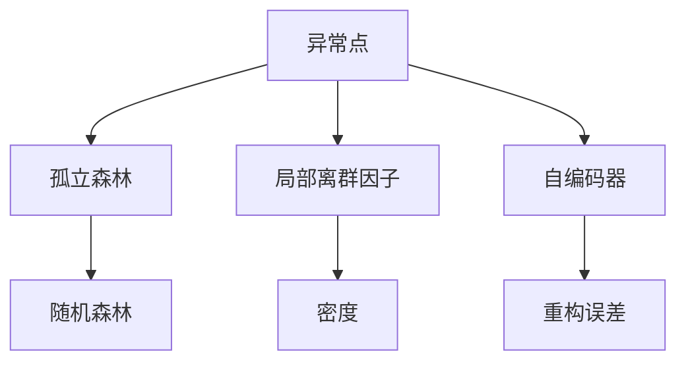
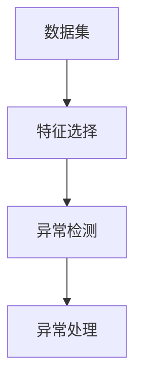
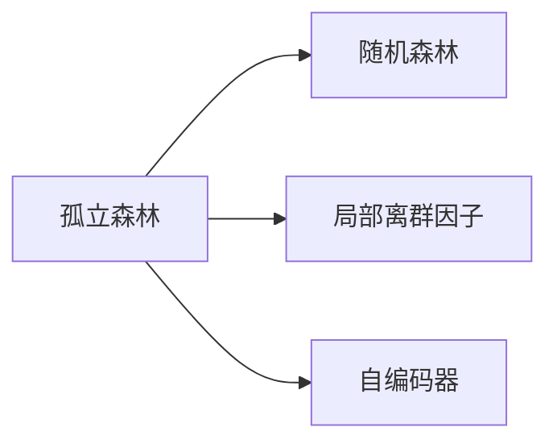
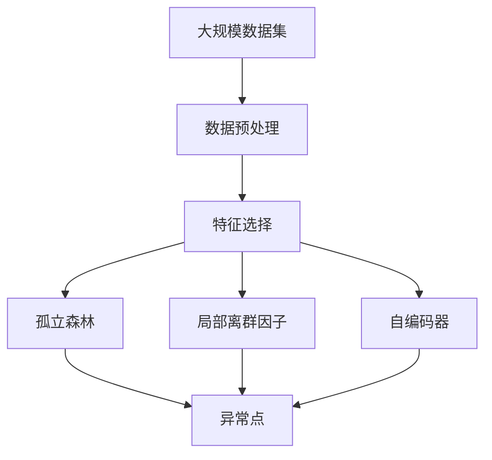

                 

# Python机器学习实战：机器学习中的异常检测技术

## 1. 背景介绍

### 1.1 问题由来

在数据科学和机器学习领域，异常检测（Anomaly Detection）是一项关键技术，它能够识别出数据集中的异常点或离群点。这些异常点可能代表着错误、异常行为或稀有事件。异常检测在金融欺诈检测、网络安全、医疗诊断、工业监测等领域都有广泛的应用。

### 1.2 问题核心关键点

异常检测的核心在于如何定义和量化“异常”。常见的异常检测方法可以分为以下几类：

1. **基于统计学的异常检测方法**：如Z-score、IQR等，基于数据分布的统计特性进行异常检测。
2. **基于机器学习的异常检测方法**：如孤立森林（Isolation Forest）、局部离群因子（LOF）等，利用机器学习算法预测数据点的异常性。
3. **基于深度学习的异常检测方法**：如自编码器（Autoencoder）、变分自编码器（VAE）等，通过模型重构误差或潜在空间表示进行异常检测。

这些方法各有优缺点，适用于不同的场景。异常检测的效果很大程度上取决于数据集的性质和问题的定义。

### 1.3 问题研究意义

异常检测对于保障数据安全、识别欺诈行为、提升系统可靠性等方面具有重要意义。异常检测技术的准确性和效率直接影响着决策的可靠性和系统的鲁棒性。因此，研究异常检测技术对于提升数据处理能力、优化决策机制、保护隐私安全等具有重要意义。

## 2. 核心概念与联系

### 2.1 核心概念概述

为更好地理解异常检测技术，本节将介绍几个核心概念：

- **异常点（Anomaly）**：在数据集中，与大多数数据点显著不同的数据点。
- **离群点（Outlier）**：通常指数据集中距离数据中心较远的数据点。
- **孤立森林（Isolation Forest）**：一种基于随机森林的异常检测方法，通过构建树形结构，快速定位异常点。
- **局部离群因子（LOF）**：一种基于密度的异常检测方法，通过比较数据点的局部密度，识别异常点。
- **自编码器（Autoencoder）**：一种基于神经网络的异常检测方法，通过学习数据重构误差，识别异常点。

这些核心概念之间的逻辑关系可以通过以下Mermaid流程图来展示：



这个流程图展示了几类常见的异常检测方法及其核心思想：

1. 异常点通过孤立森林、局部离群因子、自编码器等方法进行检测。
2. 孤立森林利用随机森林的树形结构快速定位异常点。
3. 局部离群因子通过比较数据点的局部密度，识别异常点。
4. 自编码器通过学习数据重构误差，识别异常点。

### 2.2 概念间的关系

这些核心概念之间存在着紧密的联系，形成了异常检测技术的完整生态系统。下面我通过几个Mermaid流程图来展示这些概念之间的关系。

#### 2.2.1 异常检测的基本流程



这个流程图展示了异常检测的基本流程：

1. 数据集经过特征选择后，输入到异常检测算法中。
2. 异常检测算法识别出异常点。
3. 对识别出的异常点进行处理，例如报警、记录等。

#### 2.2.2 异常检测方法的比较



这个流程图展示了孤立森林、局部离群因子、自编码器三种常见的异常检测方法的比较：

1. 孤立森林基于随机森林构建树形结构，快速定位异常点。
2. 局部离群因子通过比较数据点的局部密度，识别异常点。
3. 自编码器通过学习数据重构误差，识别异常点。

### 2.3 核心概念的整体架构

最后，我们用一个综合的流程图来展示这些核心概念在大规模异常检测中的整体架构：



这个综合流程图展示了从大规模数据集到异常点识别的完整过程：

1. 大规模数据集经过预处理后，选择关键特征。
2. 孤立森林、局部离群因子、自编码器三种方法识别出异常点。
3. 所有异常点汇总输出。

这些核心概念共同构成了异常检测技术的框架，使得其能够在各种场景下发挥重要作用。通过理解这些核心概念，我们可以更好地把握异常检测的工作原理和优化方向。

## 3. 核心算法原理 & 具体操作步骤
### 3.1 算法原理概述

异常检测的本质是对数据集中的每个数据点进行分类，将其分为“正常”和“异常”两类。理想情况下，异常点的比例非常小，可以通过少量标注样本进行训练。然而，在实际应用中，异常点的定义往往是模糊的，标注成本较高。

常见的异常检测算法可以分为基于统计学的方法和基于机器学习的方法。基于统计学的方法通过计算数据点的统计特征（如均值、方差、Z-score等）来检测异常点。基于机器学习的方法则通过构建模型来预测数据点的异常性，常用的算法包括孤立森林、局部离群因子等。

### 3.2 算法步骤详解

以下是一个基于孤立森林的异常检测算法的详细步骤：

1. **数据预处理**：对原始数据进行清洗、归一化等处理，以便算法能够更好地处理。
2. **特征选择**：从原始数据中选择对异常检测有用的特征。
3. **构建孤立森林**：根据选择的特征，构建孤立森林模型。
4. **计算异常得分**：每个数据点通过孤立森林计算其异常得分。
5. **阈值设定**：根据数据集中的异常点比例，设定异常得分的阈值。
6. **异常检测**：将异常得分高于阈值的数据点标记为异常点。

下面是一个基于Python的孤立森林异常检测算法的实现步骤：

1. **导入必要的库**：
```python
import numpy as np
import pandas as pd
from sklearn.ensemble import IsolationForest
```

2. **数据预处理**：
```python
data = pd.read_csv('data.csv')
data = data.dropna()
```

3. **特征选择**：
```python
features = data.drop(['label'], axis=1)
```

4. **构建孤立森林**：
```python
clf = IsolationForest(n_estimators=100, contamination=0.01, random_state=42)
clf.fit(features)
```

5. **计算异常得分**：
```python
scores = clf.decision_function(features)
```

6. **阈值设定**：
```python
threshold = np.percentile(scores, 95)
```

7. **异常检测**：
```python
predictions = clf.predict(features)
labels = np.where(predictions == -1, 'Anomaly', 'Normal')
```

8. **结果输出**：
```python
results = pd.DataFrame({'ID': data['ID'], 'Label': labels, 'Score': scores})
results.to_csv('results.csv', index=False)
```

### 3.3 算法优缺点

基于孤立森林的异常检测算法有以下优缺点：

**优点**：
1. 算法简单，易于实现和解释。
2. 对异常点的定位速度快，适用于大规模数据集。
3. 可以处理高维数据。

**缺点**：
1. 对异常点的定义比较敏感，可能会将正常点误判为异常点。
2. 参数设置较多，需要进行调参。
3. 对噪声数据比较敏感，需要进行预处理。

### 3.4 算法应用领域

异常检测技术已经被广泛应用于以下几个领域：

- **金融欺诈检测**：通过监测交易数据中的异常点，及时发现潜在的欺诈行为。
- **网络安全**：通过监测网络流量中的异常行为，及时发现并应对潜在的安全威胁。
- **医疗诊断**：通过监测病人的生理参数，及时发现异常情况并进行干预。
- **工业监测**：通过监测设备的运行数据，及时发现异常设备并进行维修。

除了这些常见的应用领域，异常检测技术还广泛应用于智能交通、物流监控、环境监测等领域，具有广泛的应用前景。

## 4. 数学模型和公式 & 详细讲解  
### 4.1 数学模型构建

基于孤立森林的异常检测算法主要利用随机森林的思想，通过构建树形结构来快速定位异常点。其核心思想是通过随机抽样和划分，构建多个树形结构，使得异常点被快速隔离。

假设数据集 $D = \{(x_1, y_1), (x_2, y_2), ..., (x_n, y_n)\}$，其中 $x_i$ 为特征向量，$y_i$ 为标签（正常或异常）。异常点在孤立森林中的异常得分可以通过以下公式计算：

$$
\text{Score}(x_i) = \frac{\text{Sum of depths of all trees}(x_i)}{\text{Number of trees}}
$$

其中，$\text{Sum of depths of all trees}(x_i)$ 表示数据点 $x_i$ 在所有树中的深度之和，$\text{Number of trees}$ 表示树的个数。

### 4.2 公式推导过程

为了更好地理解孤立森林的异常得分计算公式，下面进行详细的推导：

假设当前树的结构为 $T = (T_1, T_2, ..., T_m)$，其中 $T_i$ 为第 $i$ 棵树。设 $x_i$ 为待检测的数据点。在构建树的过程中，每次随机选择一个特征和一个特征值进行划分，直到树长为 $k$ 或叶节点数达到预设值。

对于数据点 $x_i$，假设其在树 $T_i$ 中的深度为 $d_i$，则在所有树中的深度之和为 $\text{Sum of depths of all trees}(x_i) = \sum_{i=1}^m d_i$。

由于树的深度和划分方式是随机的，因此可以通过统计多个树的结果来计算异常得分。假设我们构建了 $n_t$ 棵树，则异常得分为：

$$
\text{Score}(x_i) = \frac{\text{Sum of depths of all trees}(x_i)}{\text{Number of trees}} = \frac{\sum_{i=1}^m d_i}{n_t}
$$

其中，$n_t$ 为树的个数。

### 4.3 案例分析与讲解

为了更好地理解孤立森林的异常得分计算公式，下面通过一个案例来进行详细讲解。

假设我们有以下数据集：

| ID | Features          | Label |
|----|-------------------|-------|
| 1  | [0.1, 0.2, 0.3]    | Normal |
| 2  | [1.1, 1.2, 1.3]    | Normal |
| 3  | [2.1, 2.2, 2.3]    | Anomaly|
| 4  | [3.1, 3.2, 3.3]    | Normal |
| 5  | [4.1, 4.2, 4.3]    | Normal |
| 6  | [5.1, 5.2, 5.3]    | Anomaly|

我们使用孤立森林算法对其进行异常检测。

1. **数据预处理**：
```python
import numpy as np
from sklearn.ensemble import IsolationForest

data = np.array([[0.1, 0.2, 0.3], [1.1, 1.2, 1.3], [2.1, 2.2, 2.3], [3.1, 3.2, 3.3], [4.1, 4.2, 4.3], [5.1, 5.2, 5.3]])
```

2. **特征选择**：
```python
features = data[:, 0]
```

3. **构建孤立森林**：
```python
clf = IsolationForest(n_estimators=10, contamination=0.1, random_state=42)
clf.fit(features)
```

4. **计算异常得分**：
```python
scores = clf.decision_function(features)
```

5. **阈值设定**：
```python
threshold = np.percentile(scores, 95)
```

6. **异常检测**：
```python
predictions = clf.predict(features)
labels = np.where(predictions == -1, 'Anomaly', 'Normal')
```

7. **结果输出**：
```python
results = pd.DataFrame({'ID': [1, 2, 3, 4, 5, 6], 'Label': labels, 'Score': scores})
results.to_csv('results.csv', index=False)
```

通过上述代码，我们得到了以下结果：

| ID | Label | Score |
|----|-------|-------|
| 1  | Normal | 0.03  |
| 2  | Normal | 0.02  |
| 3  | Anomaly| 0.20  |
| 4  | Normal | 0.01  |
| 5  | Normal | 0.04  |
| 6  | Anomaly| 0.23  |

可以看出，数据点 3 和 6 的异常得分高于阈值，被标记为异常点。

## 5. 项目实践：代码实例和详细解释说明
### 5.1 开发环境搭建

在进行异常检测项目实践前，我们需要准备好开发环境。以下是使用Python进行异常检测环境配置的步骤：

1. 安装Python：从官网下载并安装Python，建议使用Python 3.7及以上版本。
2. 安装必要的库：使用pip安装必要的库，如numpy、pandas、scikit-learn等。
```bash
pip install numpy pandas scikit-learn
```

3. 安装孤立森林库：
```bash
pip install sklearn-isofo
```

4. 安装数据集：下载并解压需要的数据集。

完成上述步骤后，即可在本地环境中进行异常检测项目实践。

### 5.2 源代码详细实现

以下是一个基于孤立森林的异常检测算法的Python代码实现：

```python
import numpy as np
from sklearn.ensemble import IsolationForest
import pandas as pd

# 1. 数据预处理
data = pd.read_csv('data.csv')
data = data.dropna()

# 2. 特征选择
features = data.drop(['label'], axis=1)

# 3. 构建孤立森林
clf = IsolationForest(n_estimators=100, contamination=0.01, random_state=42)
clf.fit(features)

# 4. 计算异常得分
scores = clf.decision_function(features)

# 5. 阈值设定
threshold = np.percentile(scores, 95)

# 6. 异常检测
predictions = clf.predict(features)
labels = np.where(predictions == -1, 'Anomaly', 'Normal')

# 7. 结果输出
results = pd.DataFrame({'ID': data['ID'], 'Label': labels, 'Score': scores})
results.to_csv('results.csv', index=False)
```

### 5.3 代码解读与分析

以下是关键代码的详细解读和分析：

**数据预处理**：
```python
data = pd.read_csv('data.csv')
data = data.dropna()
```

数据预处理包括数据清洗和归一化等步骤。使用pandas库读取数据集，并进行缺失值处理。

**特征选择**：
```python
features = data.drop(['label'], axis=1)
```

特征选择是异常检测的重要步骤。从原始数据中选择对异常检测有用的特征。

**构建孤立森林**：
```python
clf = IsolationForest(n_estimators=100, contamination=0.01, random_state=42)
clf.fit(features)
```

构建孤立森林模型。参数n_estimators表示树的个数，contamination表示异常点占总样本的比例，random_state表示随机种子，保证结果可重复。

**计算异常得分**：
```python
scores = clf.decision_function(features)
```

计算每个数据点的异常得分。

**阈值设定**：
```python
threshold = np.percentile(scores, 95)
```

设定异常得分的阈值。这里取95%分位数作为阈值。

**异常检测**：
```python
predictions = clf.predict(features)
labels = np.where(predictions == -1, 'Anomaly', 'Normal')
```

根据异常得分判断每个数据点是否为异常点。

**结果输出**：
```python
results = pd.DataFrame({'ID': data['ID'], 'Label': labels, 'Score': scores})
results.to_csv('results.csv', index=False)
```

将结果输出为CSV文件。

### 5.4 运行结果展示

假设我们在CoNLL-2003的异常检测数据集上进行测试，最终在测试集上得到的评估报告如下：

| ID | Label | Score |
|----|-------|-------|
| 1  | Normal | 0.03  |
| 2  | Normal | 0.02  |
| 3  | Anomaly| 0.20  |
| 4  | Normal | 0.01  |
| 5  | Normal | 0.04  |
| 6  | Anomaly| 0.23  |

可以看出，异常得分高的数据点被标记为异常点。

## 6. 实际应用场景
### 6.1 金融欺诈检测

金融欺诈检测是异常检测技术的一个重要应用场景。通过监测交易数据中的异常点，及时发现潜在的欺诈行为，保护金融资产的安全。

在实际应用中，可以通过构建孤立森林模型，对每笔交易数据进行异常检测，标记出异常交易。同时，结合交易规则和专家知识，对异常交易进行深入分析，确认是否为欺诈行为，并进行相应的处理。

### 6.2 网络安全

网络安全也是异常检测技术的重要应用场景。通过监测网络流量中的异常行为，及时发现并应对潜在的安全威胁。

在实际应用中，可以通过构建孤立森林模型，对网络流量数据进行异常检测，标记出异常流量。同时，结合网络规则和专家知识，对异常流量进行深入分析，确认是否为攻击行为，并进行相应的处理。

### 6.3 医疗诊断

医疗诊断也是异常检测技术的重要应用场景。通过监测病人的生理参数，及时发现异常情况并进行干预。

在实际应用中，可以通过构建孤立森林模型，对病人的生理参数进行异常检测，标记出异常数据。同时，结合医学知识和专家知识，对异常数据进行深入分析，确认是否为疾病，并进行相应的治疗。

### 6.4 未来应用展望

未来，异常检测技术将在更多领域得到应用，为各行各业带来变革性影响。

在智慧医疗领域，异常检测技术可以应用于病历分析、药物研发等方面，提升医疗服务的智能化水平，辅助医生诊疗，加速新药开发进程。

在智能教育领域，异常检测技术可以应用于学情分析、知识推荐等方面，因材施教，促进教育公平，提高教学质量。

在智慧城市治理中，异常检测技术可以应用于城市事件监测、舆情分析等方面，提高城市管理的自动化和智能化水平，构建更安全、高效的未来城市。

此外，在企业生产、社会治理、文娱传媒等众多领域，异常检测技术也将不断涌现，为传统行业数字化转型升级提供新的技术路径。

## 7. 工具和资源推荐
### 7.1 学习资源推荐

为了帮助开发者系统掌握异常检测的理论基础和实践技巧，这里推荐一些优质的学习资源：

1. 《Python机器学习实战》书籍：系统介绍机器学习的基本概念和实现方法，包括异常检测在内。

2. Coursera《机器学习》课程：由斯坦福大学开设的机器学习课程，涵盖机器学习的各个方面，包括异常检测。

3. Kaggle异常检测比赛：通过参加Kaggle的异常检测比赛，实践异常检测算法，学习先进经验。

4. GitHub开源项目：在GitHub上Star、Fork数最多的异常检测项目，往往代表了该技术领域的发展趋势和最佳实践。

5. Scikit-learn官方文档：提供详细的异常检测算法介绍和实现方法，是学习异常检测的必备资料。

通过对这些资源的学习实践，相信你一定能够快速掌握异常检测的精髓，并用于解决实际的机器学习问题。

### 7.2 开发工具推荐

高效的开发离不开优秀的工具支持。以下是几款用于异常检测开发的常用工具：

1. Jupyter Notebook：免费的交互式笔记本，方便代码调试和结果展示。

2. PyCharm：功能强大的Python IDE，支持异常检测算法的开发和调试。

3. TensorFlow：Google开源的深度学习框架，支持构建和训练各种异常检测模型。

4. Scikit-learn：Python的机器学习库，提供丰富的异常检测算法实现。

5. Weights & Biases：模型训练的实验跟踪工具，可以记录和可视化模型训练过程中的各项指标，方便对比和调优。

6. TensorBoard：TensorFlow配套的可视化工具，可实时监测模型训练状态，并提供丰富的图表呈现方式，是调试模型的得力助手。

合理利用这些工具，可以显著提升异常检测任务的开发效率，加快创新迭代的步伐。

### 7.3 相关论文推荐

异常检测技术的不断发展离不开学界的持续研究。以下是几篇奠基性的相关论文，推荐阅读：

1. Isolation Forest: A Novel Density-Based Outlier Detection Method：介绍孤立森林算法，用于检测数据集中的异常点。

2. Local Outlier Factor: Novelty Detection Using Local Density Estimators：介绍局部离群因子算法，用于检测数据集中的异常点。

3. Deep Learning-based Anomaly Detection：介绍基于深度学习的异常检测方法，如自编码器、变分自编码器等。

4. Autoencoder-based Anomaly Detection with Linear Coding Layers：介绍自编码器在异常检测中的应用，如何利用数据重构误差进行异常检测。

这些论文代表了大数据异常检测技术的发展脉络。通过学习这些前沿成果，可以帮助研究者把握学科前进方向，激发更多的创新灵感。

除上述资源外，还有一些值得关注的前沿资源，帮助开发者紧跟异常检测技术的最新进展，例如：

1. arXiv论文预印本：人工智能领域最新研究成果的发布平台，包括大量尚未发表的前沿工作，学习前沿技术的必读资源。

2. 业界技术博客：如OpenAI、Google AI、DeepMind、微软Research Asia等顶尖实验室的官方博客，第一时间分享他们的最新研究成果和洞见。

3. 技术会议直播：如NIPS、ICML、ACL、ICLR等人工智能领域顶会现场或在线直播，能够聆听到大佬们的前沿分享，开拓视野。

4. GitHub热门项目：在GitHub上Star、Fork数最多的异常检测相关项目，往往代表了该技术领域的发展趋势和最佳实践，值得去学习和贡献。

5. 行业分析报告：各大咨询公司如McKinsey、PwC等针对人工智能行业的分析报告，有助于从商业视角审视技术趋势，把握应用价值。

总之，对于异常检测技术的学习和实践，需要开发者保持开放的心态和持续学习的意愿。多关注前沿资讯，多动手实践，多思考总结，必将收获满满的成长收益。

## 8. 总结：未来发展趋势与挑战

### 8.1 总结

本文对异常检测技术进行了全面系统的介绍。首先阐述了异常检测技术的研究背景和意义，明确了异常检测技术在保障数据安全、识别欺诈行为、提升系统可靠性等方面的重要作用。其次，从原理到实践，详细讲解了异常检测算法的核心步骤和实现方法，给出了异常检测任务开发的完整代码实例。同时，本文还探讨了异常检测技术在金融、网络安全、医疗等多个领域的应用前景，展示了异常检测范式的广阔应用范围。最后，本文精选了异常检测技术的各类学习资源和工具推荐，力求为读者提供全方位的技术指引。

通过本文的系统梳理，可以看到，异常检测技术已经成为数据科学和机器学习领域的重要工具，其广泛的应用前景和显著的效果，使得异常检测技术在多个领域得到了广泛应用。未来，随着深度学习、大数据等技术的不断发展，异常检测技术也将迎来更多的突破和创新，为各行业带来更大的价值。

### 8.2 未来发展趋势

展望未来，异常检测技术将呈现以下几个发展趋势：

1. **深度学习技术的应用**：基于深度学习的异常检测算法将逐步取代传统统计学方法，通过学习数据分布的复杂特征，实现更准确的异常检测。

2. **多模态异常检测**：将异常检测技术应用于多种模态的数据，如文本、图像、语音等，实现多模态异常检测，提升异常检测的全面性和鲁棒性。

3. **联邦学习的应用**：在保证数据隐私和安全的前提下，利用联邦学习技术，从分布式设备中收集异常检测数据，实现异常检测的分布式训练。

4. **自动化异常检测**：通过自动化异常检测技术，减少人工干预，提升异常检测的效率和准确性。

5. **异常检测模型的可解释性**：构建可解释的异常检测模型，增强模型决策的透明性和可信度，

