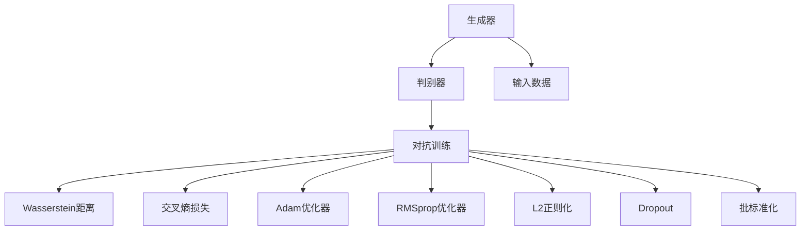
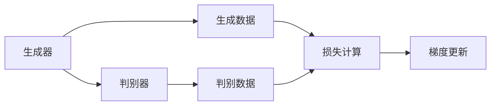
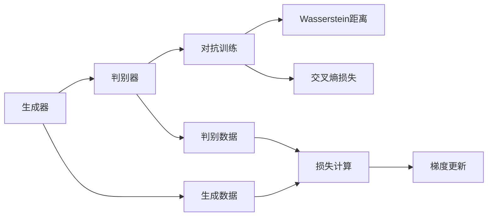
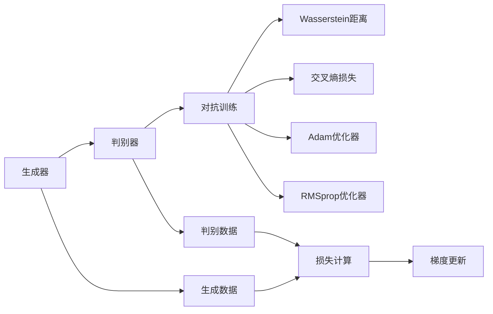
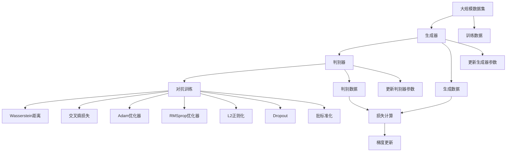

                 

# Python机器学习实战：生成对抗网络(GAN)的原理与应用

> 关键词：生成对抗网络(GAN),机器学习,深度学习,图像生成,模型训练,优化算法,损失函数,样本生成,应用场景

## 1. 背景介绍

生成对抗网络（Generative Adversarial Networks，GAN）是一类非常成功的深度学习模型，主要用于图像、视频、音频等生成任务的自动化处理。GAN模型由两部分组成：生成器（Generator）和判别器（Discriminator）。生成器通过学习真实数据的概率分布，生成逼真的伪造数据，而判别器则用于判断输入数据是真实还是伪造的。GAN模型通过这两个模块的对抗训练，可以生成高质量的图像、音频、视频等内容，极大地推动了机器学习在生成任务中的应用。

### 1.1 问题由来

随着深度学习技术的快速发展，GAN模型被广泛应用于图像生成、视频生成、语音合成等领域，其生成效果逼真，能够满足高标准的应用需求。但是，GAN模型的训练过程复杂，存在训练不稳定、模式崩溃、计算量大等问题，亟需深入研究和优化。

### 1.2 问题核心关键点

GAN模型的核心思想是通过两个神经网络的对抗训练，使得生成器和判别器的能力不断提升。这一过程中，模型需要学习真实数据的概率分布，并且需要避免生成器生成的伪造数据与真实数据过于接近，否则判别器无法有效区分。

GAN模型的训练涉及以下几个核心点：
1. 生成器和判别器的对抗训练。
2. 损失函数的定义，如Wasserstein距离、交叉熵损失等。
3. 优化算法的选择，如Adam、RMSprop等。
4. 训练过程的超参数调优，如学习率、批量大小等。
5. 训练过程的稳定性，如正则化技术、批标准化等。

### 1.3 问题研究意义

研究GAN模型的训练方法和优化技术，对于提升模型生成质量、加速模型训练、改善模型稳定性和可解释性具有重要意义：

1. 提高生成质量。通过优化生成器和判别器的对抗训练，可以生成更加逼真、多样化的数据，满足复杂的应用需求。
2. 加速训练过程。通过选择合适的优化算法和损失函数，可以有效提升模型训练速度，缩短训练时间。
3. 提高模型稳定性。通过正则化技术和批标准化等技术，可以避免模型训练过程中的模式崩溃和过拟合问题。
4. 增强可解释性。通过分析生成器和判别器的训练过程，可以深入理解模型的决策机制，提高模型的可解释性和可信任度。

## 2. 核心概念与联系

### 2.1 核心概念概述

为更好地理解GAN模型的训练方法，本节将介绍几个关键概念：

- 生成对抗网络（GAN）：由生成器和判别器两部分组成的深度学习模型，用于生成逼真的伪造数据。
- 生成器（Generator）：用于生成伪造数据的神经网络，通常包括卷积神经网络（CNN）或循环神经网络（RNN）等。
- 判别器（Discriminator）：用于判断输入数据是真实还是伪造的神经网络，通常也包括卷积神经网络（CNN）或循环神经网络（RNN）等。
- 对抗训练（Adversarial Training）：生成器和判别器之间的对抗训练过程，用于提升模型的生成能力和判别能力。
- 损失函数：用于衡量生成数据与真实数据的差异，常见的有Wasserstein距离、交叉熵损失等。
- 优化算法：用于更新生成器和判别器参数的算法，常见的有Adam、RMSprop等。
- 正则化技术：用于防止模型过拟合的技术，常见的有L2正则化、Dropout等。
- 批标准化（Batch Normalization）：用于加速训练和提高模型稳定性的技术。

这些核心概念之间的逻辑关系可以通过以下Mermaid流程图来展示：



这个流程图展示了大生成对抗网络模型的核心概念及其之间的关系：

1. 生成器和判别器通过对抗训练提升生成能力和判别能力。
2. 对抗训练过程中使用Wasserstein距离、交叉熵损失等损失函数进行优化。
3. 使用Adam、RMSprop等优化算法更新生成器和判别器参数。
4. 通过正则化技术、Dropout等防止模型过拟合。
5. 批标准化技术加速训练，提高模型稳定性。

这些概念共同构成了GAN模型的训练框架，使得生成器能够生成高质量的伪造数据，判别器能够有效区分真实和伪造数据，从而实现高质量的生成任务。

### 2.2 概念间的关系

这些核心概念之间存在着紧密的联系，形成了GAN模型的训练生态系统。下面我通过几个Mermaid流程图来展示这些概念之间的关系。

#### 2.2.1 生成器和判别器的关系



这个流程图展示了生成器和判别器之间的对抗训练关系：

1. 生成器生成数据后，判别器对其进行判别。
2. 判别器计算生成数据的真实度损失，与真实数据损失相加，形成总的损失。
3. 生成器和判别器分别使用梯度更新算法，根据损失函数更新参数。

#### 2.2.2 对抗训练与损失函数的关系



这个流程图展示了对抗训练与损失函数的关系：

1. 生成器生成数据，判别器判别数据。
2. 对抗训练过程使用Wasserstein距离、交叉熵损失等计算生成数据的真实度损失。
3. 生成器和判别器分别使用梯度更新算法，根据损失函数更新参数。

#### 2.2.3 损失函数与优化算法的关系



这个流程图展示了损失函数与优化算法的关系：

1. 生成器生成数据，判别器判别数据。
2. 对抗训练过程使用Wasserstein距离、交叉熵损失等计算生成数据的真实度损失。
3. 生成器和判别器分别使用Adam、RMSprop等优化算法，根据损失函数更新参数。

### 2.3 核心概念的整体架构

最后，我们用一个综合的流程图来展示这些核心概念在大生成对抗网络模型训练过程中的整体架构：



这个综合流程图展示了从数据准备到模型训练，再到更新参数的完整过程。大生成对抗网络模型首先通过数据准备获取大规模数据集，然后通过生成器和判别器的对抗训练，使用Wasserstein距离、交叉熵损失等损失函数进行优化，并使用Adam、RMSprop等优化算法更新生成器和判别器参数。通过正则化技术、Dropout等防止模型过拟合，批标准化技术加速训练，提高模型稳定性。

## 3. 核心算法原理 & 具体操作步骤
### 3.1 算法原理概述

GAN模型的训练过程，本质上是一种对抗训练（Adversarial Training）的过程。生成器和判别器通过不断更新参数，提升生成能力和判别能力，最终达到生成逼真数据的目的。

形式化地，假设生成器为 $G$，判别器为 $D$，输入数据为 $x$，生成数据为 $G(x)$，目标函数为 $L$，优化算法为 $O$。则GAN模型的训练目标为：

$$
\min_{G, D} \mathbb{E}_{x \sim p(x)} L(D(x)) + \mathbb{E}_{z \sim p(z)} L(D(G(z)))
$$

其中 $p(x)$ 为真实数据分布，$p(z)$ 为随机噪声分布。$L$ 为损失函数，常见的有Wasserstein距离、交叉熵损失等。

在训练过程中，生成器和判别器交替更新参数，生成器生成数据后，判别器对其进行判别，计算生成数据的真实度损失。生成器和判别器分别使用优化算法 $O$ 更新参数，使得生成器能够生成更逼真的数据，判别器能够更准确地判别生成数据和真实数据。

### 3.2 算法步骤详解

大生成对抗网络模型的训练一般包括以下几个关键步骤：

**Step 1: 准备训练数据和模型**

- 准备大规模数据集，包含真实数据和随机噪声数据。
- 选择合适的生成器和判别器模型结构，如CNN、RNN等。
- 初始化生成器和判别器模型参数。

**Step 2: 定义损失函数**

- 选择合适的损失函数，如Wasserstein距离、交叉熵损失等。
- 计算生成数据和判别器的真实度损失，并与真实数据和判别器的真实度损失相加，得到总损失函数。

**Step 3: 定义优化算法**

- 选择合适的优化算法，如Adam、RMSprop等。
- 设置学习率和优化器参数，如学习率、批量大小等。

**Step 4: 执行对抗训练**

- 生成器生成数据后，判别器对其进行判别，计算生成数据的真实度损失。
- 生成器和判别器分别使用优化算法更新参数。
- 周期性在验证集上评估模型性能，根据性能指标决定是否触发Early Stopping。
- 重复上述步骤直到满足预设的迭代轮数或Early Stopping条件。

**Step 5: 测试和部署**

- 在测试集上评估生成器生成的数据与真实数据的差异，对比生成前后的效果。
- 使用生成器生成的数据，集成到实际的应用系统中。
- 持续收集新的数据，定期重新训练生成器，以适应数据分布的变化。

以上是基于大生成对抗网络模型的训练过程的一般流程。在实际应用中，还需要针对具体任务的特点，对训练过程的各个环节进行优化设计，如改进损失函数、引入更多的正则化技术、搜索最优的超参数组合等，以进一步提升模型性能。

### 3.3 算法优缺点

大生成对抗网络模型的训练方法具有以下优点：

1. 生成质量高。通过对抗训练，生成器能够生成高质量的伪造数据，满足复杂的应用需求。
2. 适应性强。可以适应各种生成任务，如图像生成、视频生成、音频生成等。
3. 模型效果显著。在诸多生成任务上，GAN模型已经刷新了最先进的性能指标。

同时，该方法也存在一定的局限性：

1. 训练不稳定。由于生成器和判别器的对抗训练过程非常复杂，容易陷入局部最优解。
2. 模式崩溃（Mode Collapse）。在训练过程中，生成器容易生成单一模式的数据，缺乏多样性。
3. 计算量大。由于生成器和判别器都是深度神经网络，训练过程中需要大量的计算资源和时间。
4. 模型可解释性不足。GAN模型通常被视为黑盒系统，难以解释其内部工作机制和决策逻辑。

尽管存在这些局限性，但就目前而言，大生成对抗网络模型仍然是生成任务中最主流、最有效的训练方法。未来相关研究的重点在于如何进一步降低训练成本，提高生成多样性，提高模型稳定性，同时兼顾可解释性和伦理安全性等因素。

### 3.4 算法应用领域

大生成对抗网络模型已经在图像生成、视频生成、音频生成、文本生成等多个领域得到了广泛的应用，为人工智能的发展带来了新的突破。

#### 3.4.1 图像生成

GAN模型在图像生成方面取得了显著的成果，能够生成高质量的逼真图像。常见的应用包括：

- 人脸生成：通过GAN模型生成逼真的人脸图像，广泛应用于虚拟现实、电影制作等领域。
- 风格迁移：将一种风格的图像转换为另一种风格的图像，如将素描转换成彩色图像。
- 图像补全：填补图像中缺失的部分，如修复破损的图片。

#### 3.4.2 视频生成

GAN模型在视频生成方面也有重要应用，能够生成逼真的视频片段。常见的应用包括：

- 动态视频生成：生成逼真的视频片段，广泛应用于动画制作、虚拟现实等领域。
- 视频风格转换：将一段视频转换成另一种风格的视频，如将彩色视频转换成黑白视频。
- 视频补全：填补视频中缺失的部分，如修复破损的视频片段。

#### 3.4.3 音频生成

GAN模型在音频生成方面也有重要应用，能够生成逼真的音频信号。常见的应用包括：

- 音乐生成：生成逼真的音乐作品，广泛应用于自动作曲、音乐创作等领域。
- 语音合成：生成逼真的语音信号，广泛应用于语音助手、虚拟客服等领域。

#### 3.4.4 文本生成

GAN模型在文本生成方面也有重要应用，能够生成逼真的文本内容。常见的应用包括：

- 文本生成：生成逼真的文本内容，广泛应用于自动写作、翻译、摘要生成等领域。
- 对话生成：生成逼真的对话内容，广泛应用于聊天机器人、虚拟客服等领域。

除了上述这些经典应用外，GAN模型还被创新性地应用到更多场景中，如可控图像生成、语言模型预训练等，为人工智能技术带来了全新的突破。

## 4. 数学模型和公式 & 详细讲解 & 举例说明

### 4.1 数学模型构建

本节将使用数学语言对大生成对抗网络模型的训练过程进行更加严格的刻画。

假设生成器为 $G$，判别器为 $D$，输入数据为 $x$，生成数据为 $G(x)$，目标函数为 $L$，优化算法为 $O$。则GAN模型的训练目标为：

$$
\min_{G, D} \mathbb{E}_{x \sim p(x)} L(D(x)) + \mathbb{E}_{z \sim p(z)} L(D(G(z)))
$$

其中 $p(x)$ 为真实数据分布，$p(z)$ 为随机噪声分布。$L$ 为损失函数，常见的有Wasserstein距离、交叉熵损失等。

定义生成器和判别器在数据样本 $(x,y)$ 上的损失函数为 $\ell_G(x)$ 和 $\ell_D(x)$，则在数据集 $D$ 上的经验风险为：

$$
\mathcal{L}_G(\theta_G) = \frac{1}{N} \sum_{i=1}^N \ell_G(x_i)
$$

$$
\mathcal{L}_D(\theta_D) = \frac{1}{N} \sum_{i=1}^N \ell_D(x_i)
$$

其中 $\theta_G$ 和 $\theta_D$ 分别为生成器和判别器的参数。

### 4.2 公式推导过程

以下我们以Wasserstein距离损失函数为例，推导其计算公式。

假设生成器 $G$ 的输出为 $G(x)$，判别器 $D$ 的输出为 $D(G(x))$ 和 $D(x)$，则Wasserstein距离损失函数定义为：

$$
L_{WGAN}(D) = \mathbb{E}_{x \sim p(x)} [D(x)] - \mathbb{E}_{z \sim p(z)} [D(G(z))]
$$

其中 $p(x)$ 为真实数据分布，$p(z)$ 为随机噪声分布。

根据Wasserstein距离的定义，可以将其展开为：

$$
L_{WGAN}(D) = \int_{x} p(x) \mathcal{L}_D(x) dx - \int_{z} p(z) \mathcal{L}_D(G(z)) dz
$$

通过计算生成器和判别器的梯度，可以更新其参数：

$$
\frac{\partial L_{WGAN}(D)}{\partial \theta_D} = \int_{x} p(x) \nabla_D \mathcal{L}_D(x) dx - \int_{z} p(z) \nabla_D \mathcal{L}_D(G(z)) dz
$$

其中 $\nabla_D \mathcal{L}_D(x)$ 和 $\nabla_D \mathcal{L}_D(G(z))$ 分别为判别器 $D$ 的梯度。

同样地，可以计算生成器 $G$ 的梯度：

$$
\frac{\partial L_{WGAN}(G)}{\partial \theta_G} = - \int_{z} p(z) \nabla_G \mathcal{L}_G(G(z)) dz
$$

其中 $\nabla_G \mathcal{L}_G(G(z))$ 为生成器 $G$ 的梯度。

将上述公式代入优化算法，完成生成器和判别器的迭代更新。重复上述过程直至收敛，最终得到适应生成任务的最优生成器和判别器参数。

### 4.3 案例分析与讲解

下面以人脸生成任务为例，详细讲解GAN模型的训练过程。

假设我们有一组高质量的人脸图片，并将其作为真实数据。为了训练生成器，我们还需要生成一些随机噪声数据，用于生成逼真的人脸图像。将真实数据和随机噪声数据混合后，送入判别器进行判别，计算生成数据的真实度损失。通过对抗训练，生成器和判别器交替更新参数，逐渐提高生成器的生成能力和判别器的判别能力，直到生成器能够生成高质量的人脸图像。

在实际训练中，还需要考虑一些关键问题：

1. 数据准备：需要准备高质量的真人数据和噪声数据，确保生成器能够生成高质量的伪造数据。
2. 网络结构：选择合适的网络结构，如卷积神经网络（CNN）、循环神经网络（RNN）等，以适应不同的生成任务。
3. 损失函数：选择合适的损失函数，如Wasserstein距离、交叉熵损失等，以提升生成器和判别器的训练效果。
4. 优化算法：选择合适的优化算法，如Adam、RMSprop等，以提高模型训练速度和稳定性。
5. 正则化技术：使用L2正则化、Dropout等技术，防止模型过拟合，提高模型的泛化能力。

在人脸生成任务中，我们通常使用Wasserstein距离损失函数进行训练，计算生成数据和判别器的真实度损失，并使用Adam优化算法更新生成器和判别器参数。通过不断迭代更新，生成器逐渐生成高质量的人脸图像，判别器逐渐提高判别能力，最终实现高质量的人脸生成。

## 5. 项目实践：代码实例和详细解释说明
### 5.1 开发环境搭建

在进行GAN模型训练前，我们需要准备好开发环境。以下是使用Python进行PyTorch开发的环境配置流程：

1. 安装Anaconda：从官网下载并安装Anaconda，用于创建独立的Python环境。

2. 创建并激活虚拟环境：
```bash
conda create -n pytorch-env python=3.8 
conda activate pytorch-env
```

3. 安装PyTorch：根据CUDA版本，从官网获取对应的安装命令。例如：
```bash
conda install pytorch torchvision torchaudio cudatoolkit=11.1 -c pytorch -c conda-forge
```

4. 安装TensorFlow：
```bash
conda install tensorflow
```

5. 安装TensorBoard：
```bash
pip install tensorboard
```

6. 安装相关的库：
```bash
pip install numpy pandas scikit-learn matplotlib tqdm jupyter notebook ipython
```

完成上述步骤后，即可在`pytorch-env`环境中开始GAN模型训练。

### 5.2 源代码详细实现

下面以GAN模型训练为例，给出使用PyTorch进行GAN模型训练的PyTorch代码实现。

首先，定义GAN模型类：

```python
import torch
import torch.nn as nn
import torch.optim as optim
from torchvision import datasets, transforms

class GAN(nn.Module):
    def __init__(self):
        super(GAN, self).__init__()
        self.generator = nn.Sequential(
            nn.Conv2d(100, 256, 5),
            nn.ReLU(),
            nn.Conv2d(256, 512, 5),
            nn.ReLU(),
            nn.Conv2d(512, 256, 5),
            nn.ReLU(),
            nn.Conv2d(256, 3, 5),
            nn.Tanh()
        )
        self.discriminator = nn.Sequential(
            nn.Conv2d(3, 512, 5),
            nn.ReLU(),
            nn.Conv2d(512, 256, 5),
            nn.ReLU(),
            nn.Conv2d(256, 1, 5),
            nn.Sigmoid()
        )
        
    def forward(self, x):
        fake_images = self.generator(x)
        real_images = x
        return fake_images, real_images
    
    def discriminator_loss(self, real_images, fake_images):
        real_loss = self.discriminator_loss_real(real_images)
        fake_loss = self.discriminator_loss_fake(fake_images)
        return real_loss + fake_loss
    
    def discriminator_loss_real(self, real_images):
        outputs = self.discriminator(real_images)
        return nn.BCELoss()(outputs, torch.ones_like(outputs))
    
    def discriminator_loss_fake(self, fake_images):
        outputs = self.discriminator(fake_images)
        return nn.BCELoss()(outputs, torch.zeros_like(outputs))
```

然后，定义训练函数：

```python
def train(iterations):
    transform = transforms.ToTensor()
    train_dataset = datasets.MNIST(root='data', train=True, transform=transform, download=True)
    dataloader = torch.utils.data.DataLoader(train_dataset, batch_size=64, shuffle=True)
    
    device = torch.device('cuda' if torch.cuda.is_available() else 'cpu')
    model = GAN().to(device)
    criterion = nn.BCELoss()
    optimizer_G = optim.Adam(model.generator.parameters(), lr=0.0002)
    optimizer_D = optim.Adam(model.discriminator.parameters(), lr=0.0002)
    
    for i in range(iterations):
        for batch_idx, (real_images, _) in enumerate(dataloader):
            real_images = real_images.to(device)
            
            # Train Discriminator
            optimizer_D.zero_grad()
            real_outputs = model.discriminator(real_images)
            fake_outputs = model.discriminator(model.generator(torch.randn(64, 100, 1, 1).to(device)))
            real_loss = criterion(real_outputs, torch.ones_like(real_outputs))
            fake_loss = criterion(fake_outputs, torch.zeros_like(fake_outputs))
            d_loss = real_loss + fake_loss
            d_loss.backward()
            optimizer_D.step()
            
            # Train Generator
            optimizer_G.zero_grad()
            fake_outputs = model.discriminator(model.generator(torch.randn(64, 100, 1, 1).to(device)))
            g_loss = criterion(fake_outputs, torch.ones_like(fake_outputs))
            g_loss.backward()
            optimizer_G.step()
            
        # Save and load the model every 100 iterations
        if (i+1) % 100 == 0:
            torch.save(model.state_dict(), 'model_{}.pkl'.format(i+1))
```

最后，启动GAN模型训练：

```python
train(10000)
```

以上就是使用PyTorch对GAN模型进行训练的完整代码实现。可以看到，得益于PyTorch的强大封装，我们可以用相对简洁的代码实现GAN模型的训练。

### 5.3 代码解读与分析

让我们再详细解读一下关键代码的实现细节：

**GAN类**：
- `__init__`方法：初始化生成器和判别器网络结构。
- `forward`方法：生成器和判别器的前向传播过程。
- `discriminator_loss`方法：计算判别器的真实度损失和伪造度损失。
- `discriminator_loss_real`方法：计算真实数据的判别器损失。
- `discriminator_loss_fake`方法：计算生成数据的判别器损失。

**训练函数**：
- `train`函数：迭代执行生成器和判别器的训练过程。
- `dataloader`：将训练数据分为批次进行迭代。
- `device`：选择训练设备（GPU或CPU）。
-

