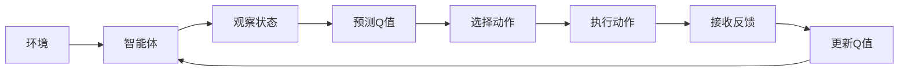
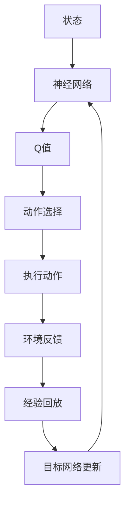

                 

# Python深度学习实践：深度Q网络（DQN）入门与实现

> 关键词：深度Q网络, 强化学习, Q-learning, Q-function, 目标网络, 经验回放, TensorFlow

## 1. 背景介绍

### 1.1 问题由来

在人工智能的范畴内，强化学习（Reinforcement Learning, RL）是一种重要的学习范式，它与传统的监督学习和无监督学习不同，它强调在特定环境下，通过与环境的交互，智能体（agent）能够学习到最优的策略（policy），以最大化预定义的奖励函数。强化学习的应用非常广泛，比如游戏AI、机器人控制、自动驾驶、经济市场模拟等。

在这一系列应用中，深度学习技术与强化学习的结合尤为引人注目。深度Q网络（Deep Q Network, DQN）是这一领域的里程碑，它将深度神经网络与Q-learning算法结合，以显著提高学习效率和策略性能。DQN应用广泛，从简单的游戏到复杂的机器人控制，再到经济市场模拟，它都在不断地创造新的突破。

### 1.2 问题核心关键点

在DQN中，目标是通过优化一个称为Q函数的函数，来指导智能体在特定环境下采取行动。Q函数表示在特定状态下采取某一动作的预期奖励。DQN使用深度神经网络来逼近Q函数，通过与环境交互，智能体可以不断地学习最优策略，最终实现特定目标的自动化。

DQN的核心流程包括：
- 观察环境状态。
- 从网络中预测Q值。
- 选取最优动作。
- 执行动作并接收环境反馈。
- 根据环境反馈更新Q函数。

在这一过程中，DQN使用经验回放（Experience Replay）和目标网络（Target Network）来稳定学习过程，并避免在更新Q函数时引入过多的噪声。

## 2. 核心概念与联系

### 2.1 核心概念概述

DQN的实现涉及到多个关键概念，下面是这些概念的概述：

- **Q-learning**：一种基于价值的强化学习算法，通过不断探索和利用来更新Q值，以最大化未来奖励的预期值。
- **Q-function**：在强化学习中，Q函数表示在特定状态下采取某一动作的预期奖励。
- **深度神经网络**：一种强大的学习模型，用于逼近复杂的非线性函数，在DQN中用于逼近Q函数。
- **经验回放**：一种技术，用于稳定Q函数的更新过程，通过将历史经验存储在一个缓冲区中，随机抽取一部分样本进行更新，减少更新过程中的方差。
- **目标网络**：在Q函数的更新过程中，用于稳定更新的另一种技术，通过在更新Q函数时，部分使用目标网络而不是主网络，来避免过度更新，增强模型稳定性。

### 2.2 概念间的关系

这些概念之间构成了DQN的基本框架，各概念之间的关系可以通过以下Mermaid流程图来展示：



这个流程图展示了大语言模型微调过程中各个概念的关系：

1. 智能体从环境中观察到状态。
2. 智能体通过预测Q值，选择动作。
3. 智能体执行动作，并从环境中接收反馈。
4. 智能体根据反馈更新Q值。
5. 智能体重新回到第一步，继续观察状态并做出决策。

### 2.3 核心概念的整体架构

最后，我们用一个综合的流程图来展示DQN的整体架构：



这个综合流程图展示了DQN的整体架构，从观察状态到选择动作，再到接收反馈和更新Q函数，各环节紧密相连，共同构成了一个完整的强化学习过程。

## 3. 核心算法原理 & 具体操作步骤
### 3.1 算法原理概述

深度Q网络（DQN）结合了深度神经网络和Q-learning算法，用于优化Q函数，从而使得智能体能够在特定环境中学习到最优策略。

DQN的训练目标是最小化状态-动作-奖励三元组（s, a, r）的Q值与真实Q值之间的差距，即：

$$
\min_{\theta} \sum_{(s, a, r) \in \mathcal{D}} \left[ Q(s, a; \theta) - (r + \gamma \max_{a'} Q(s', a'; \theta')) \right]^2
$$

其中，$\mathcal{D}$是经验回放缓冲区中的所有样本，$\theta$是神经网络参数，$\theta'$是目标网络参数，$\gamma$是折扣因子。

### 3.2 算法步骤详解

下面是DQN的具体实现步骤：

**Step 1: 准备环境与数据**

1. 搭建环境：使用Python的 Gym 库来模拟游戏环境，如Pong、CartPole等。
2. 准备数据：收集游戏环境中的状态和动作数据，并将其存入经验回放缓冲区。

**Step 2: 构建神经网络**

1. 搭建神经网络：使用TensorFlow或Keras等深度学习框架搭建神经网络。
2. 设置神经网络结构：如卷积层、全连接层等，其中输出层为一个全连接层，用于预测Q值。

**Step 3: 初始化网络**

1. 初始化神经网络参数：使用随机初始化或预训练参数。
2. 初始化目标网络参数：将目标网络参数初始化为与主网络相同的参数。

**Step 4: 训练DQN模型**

1. 观察环境状态：从经验回放缓冲区中随机抽取一个样本，获取当前状态。
2. 预测Q值：通过神经网络预测当前状态下的Q值。
3. 选择动作：选择Q值最大的动作。
4. 执行动作：执行选择的动作，并接收环境反馈。
5. 更新Q函数：根据环境反馈，更新神经网络参数。
6. 存储经验：将新的状态、动作、奖励存入经验回放缓冲区。
7. 定期更新目标网络：定期将目标网络参数更新为主网络的参数，以稳定Q函数的更新过程。

**Step 5: 评估模型**

1. 测试智能体：在测试环境中执行智能体，评估其性能。
2. 调整参数：根据测试结果调整神经网络结构和参数。

### 3.3 算法优缺点

DQN的优点包括：
1. 结合深度神经网络和Q-learning算法，能够处理复杂的非线性函数。
2. 使用经验回放和目标网络，能够稳定学习过程，避免过度更新。
3. 能够处理大规模数据集，适合复杂环境下的强化学习任务。

DQN的缺点包括：
1. 学习效率较低，需要大量训练时间。
2. 存在深度学习和强化学习的共性问题，如过拟合、数据分布不均等。
3. 需要大量的存储空间来存储经验回放缓冲区。

### 3.4 算法应用领域

DQN在强化学习中应用广泛，主要包括以下几个领域：

- **游戏AI**：用于训练游戏AI，使其能够在游戏中做出最优决策。
- **机器人控制**：用于训练机器人，使其能够在复杂环境中执行特定任务。
- **自动驾驶**：用于训练自动驾驶车辆，使其能够安全地行驶。
- **经济市场模拟**：用于训练经济模型，预测市场趋势。

## 4. 数学模型和公式 & 详细讲解 & 举例说明

### 4.1 数学模型构建

在DQN中，Q函数表示在特定状态下采取某一动作的预期奖励，形式化地表示为：

$$
Q(s, a; \theta) = \mathbb{E}\left[ \sum_{t=0}^{\infty} \gamma^t r_t \mid s_0, a_0, \theta \right]
$$

其中，$s$是状态，$a$是动作，$r_t$是时间$t$时的奖励，$\gamma$是折扣因子。

### 4.2 公式推导过程

假设我们有训练集$\mathcal{D}$，其中包含多个状态-动作-奖励三元组$(s_i, a_i, r_i)$。DQN的目标是最小化Q函数与实际Q值之间的差距，即：

$$
\min_{\theta} \sum_{i=1}^N \left[ Q(s_i, a_i; \theta) - (r_i + \gamma \max_{a'} Q(s_{i+1}, a'; \theta')) \right]^2
$$

其中，$N$是训练集的大小，$s_{i+1}$是执行动作$a_i$后的下一个状态，$a'$是下一个状态$s_{i+1}$对应的最优动作。

### 4.3 案例分析与讲解

假设我们有一个Pong游戏，其中状态$s$表示球的位置和球拍的位置，动作$a$表示球拍的移动方向（向上、向下、向左、向右），奖励$r$表示得分。

在DQN中，我们通过神经网络逼近Q函数，具体步骤如下：
1. 将状态$s$编码为向量，并输入神经网络。
2. 神经网络输出Q值，表示当前状态下每个动作的预期奖励。
3. 选择Q值最大的动作$a$。
4. 执行动作$a$，并接收奖励$r$和下一个状态$s'$。
5. 将新状态$s'$和动作$a'$存入经验回放缓冲区，计算新的Q值。
6. 使用经验回放和目标网络更新神经网络参数，以最小化Q函数与实际Q值之间的差距。

## 5. 项目实践：代码实例和详细解释说明
### 5.1 开发环境搭建

在进行DQN实践前，我们需要准备好开发环境。以下是使用Python进行TensorFlow开发的环境配置流程：

1. 安装Anaconda：从官网下载并安装Anaconda，用于创建独立的Python环境。

2. 创建并激活虚拟环境：
```bash
conda create -n dqn-env python=3.8 
conda activate dqn-env
```

3. 安装TensorFlow：根据CUDA版本，从官网获取对应的安装命令。例如：
```bash
conda install tensorflow -c tf -c conda-forge
```

4. 安装Pygame库：用于模拟游戏环境。
```bash
pip install pygame
```

5. 安装Numpy和Matplotlib库：用于数据处理和可视化。
```bash
pip install numpy matplotlib
```

完成上述步骤后，即可在`dqn-env`环境中开始DQN实践。

### 5.2 源代码详细实现

这里我们以Pong游戏为例，给出使用TensorFlow搭建DQN的Python代码实现。

```python
import numpy as np
import tensorflow as tf
import pygame
import random

# 定义参数
learning_rate = 0.001
batch_size = 32
num_episodes = 2000
max_steps_per_episode = 100
replay_memory_size = 100000
discount_factor = 0.9
target_update_frequency = 100

# 初始化Pygame环境
pygame.init()
screen_width, screen_height = 600, 600
screen = pygame.display.set_mode((screen_width, screen_height))
pygame.display.set_caption('DQN - Pong')

# 初始化游戏
game_over = False
state = get_state(screen)
state_size = get_state_size()

# 构建神经网络
model = build_model()

# 构建目标网络
target_model = build_model()
target_model.set_weights(model.get_weights())

# 定义经验回放缓冲区
replay_memory = []

# 定义优化器
optimizer = tf.train.AdamOptimizer(learning_rate)

# 训练DQN模型
for episode in range(num_episodes):
    state = get_state(screen)
    state = np.reshape(state, [1, state_size])

    for step in range(max_steps_per_episode):
        if game_over:
            state = get_state(screen)
            state = np.reshape(state, [1, state_size])

        # 选择动作
        q_values = model.predict(state)
        action = np.argmax(q_values)

        # 执行动作
        game_state, reward, game_over = game_step(action)
        new_state = get_state(screen)
        new_state = np.reshape(new_state, [1, state_size])

        # 存储经验
        replay_memory.append((state, action, reward, game_over, new_state))
        if len(replay_memory) > replay_memory_size:
            replay_memory.pop(0)

        # 训练DQN模型
        if step % target_update_frequency == 0:
            train(replay_memory, target_model)

        # 更新状态
        state = new_state

    # 更新目标网络
    target_model.set_weights(model.get_weights())

# 评估模型
test(replay_memory, target_model)

# 关闭Pygame环境
pygame.quit()
```

### 5.3 代码解读与分析

这里我们重点解读一下关键代码的实现细节：

**初始化Pygame环境**

```python
pygame.init()
screen_width, screen_height = 600, 600
screen = pygame.display.set_mode((screen_width, screen_height))
pygame.display.set_caption('DQN - Pong')
```

- `pygame.init()`：初始化Pygame库。
- `screen_width`和`screen_height`：设置游戏屏幕的宽度和高度。
- `screen`：创建游戏屏幕。
- `pygame.display.set_caption('DQN - Pong')`：设置游戏窗口的标题。

**训练DQN模型**

```python
for episode in range(num_episodes):
    state = get_state(screen)
    state = np.reshape(state, [1, state_size])

    for step in range(max_steps_per_episode):
        if game_over:
            state = get_state(screen)
            state = np.reshape(state, [1, state_size])

        # 选择动作
        q_values = model.predict(state)
        action = np.argmax(q_values)

        # 执行动作
        game_state, reward, game_over = game_step(action)
        new_state = get_state(screen)
        new_state = np.reshape(new_state, [1, state_size])

        # 存储经验
        replay_memory.append((state, action, reward, game_over, new_state))
        if len(replay_memory) > replay_memory_size:
            replay_memory.pop(0)

        # 训练DQN模型
        if step % target_update_frequency == 0:
            train(replay_memory, target_model)

        # 更新状态
        state = new_state

    # 更新目标网络
    target_model.set_weights(model.get_weights())
```

- `num_episodes`：训练轮数。
- `max_steps_per_episode`：每轮训练的最大步数。
- `replay_memory_size`：经验回放缓冲区的大小。
- `target_update_frequency`：目标网络更新的频率。
- `model.predict(state)`：预测当前状态下每个动作的Q值。
- `np.argmax(q_values)`：选择Q值最大的动作。
- `game_step(action)`：执行动作，并返回游戏状态、奖励和游戏是否结束。
- `train(replay_memory, target_model)`：根据经验回放缓冲区中的数据训练模型，并使用目标网络进行更新。
- `target_model.set_weights(model.get_weights())`：定期更新目标网络参数，以保持稳定。

**评估模型**

```python
test(replay_memory, target_model)
```

- `replay_memory`：经验回放缓冲区中的所有样本。
- `target_model`：目标网络，用于评估模型性能。
- `test(replay_memory, target_model)`：在测试环境中执行智能体，并评估其性能。

## 6. 实际应用场景

DQN在实际应用中广泛应用，主要包括以下几个场景：

- **游戏AI**：如AlphaGo、AlphaStar等，使用DQN训练AI在特定游戏中做出最优决策。
- **机器人控制**：如Carlotes等人开发的RoboArm项目，使用DQN训练机器人，使其能够执行复杂任务。
- **自动驾驶**：如DeepMind的 autonomous vehicle项目，使用DQN训练自动驾驶车辆，使其能够在复杂交通环境中安全行驶。
- **经济市场模拟**：如Google的Gemini项目，使用DQN训练经济模型，预测市场趋势。

## 7. 工具和资源推荐
### 7.1 学习资源推荐

为了帮助开发者系统掌握DQN的理论基础和实践技巧，这里推荐一些优质的学习资源：

1. DeepMind的AlphaGo论文和代码：展示了DQN在游戏AI中的成功应用。
2. Google的Gemini项目：展示了DQN在经济市场模拟中的应用。
3. OpenAI的DQN系列博文：深入浅出地介绍了DQN的基本原理和实现方法。
4. Coursera的强化学习课程：由斯坦福大学的Andrew Ng教授主讲，涵盖了强化学习的基本概念和经典算法。
5. TensorFlow官方文档：详细介绍了如何使用TensorFlow实现DQN。

### 7.2 开发工具推荐

高效的开发离不开优秀的工具支持。以下是几款用于DQN开发的常用工具：

1. TensorFlow：由Google主导开发的深度学习框架，生产部署方便，适合大规模工程应用。
2. PyTorch：基于Python的深度学习框架，灵活高效，适合快速迭代研究。
3. Pygame：用于游戏模拟的Python库，简单易用，适合DQN在具体游戏环境中的实现。
4. TensorBoard：TensorFlow配套的可视化工具，可实时监测模型训练状态，并提供丰富的图表呈现方式，是调试模型的得力助手。
5. Weights & Biases：模型训练的实验跟踪工具，可以记录和可视化模型训练过程中的各项指标，方便对比和调优。

### 7.3 相关论文推荐

DQN的发展离不开学界的持续研究。以下是几篇奠基性的相关论文，推荐阅读：

1. Human-level Control through Deep Reinforcement Learning：DeepMind发表的AlphaGo论文，展示了DQN在游戏AI中的成功应用。
2. Playing Atari with Deep Reinforcement Learning：DeepMind发表的AlphaStar论文，展示了DQN在游戏AI中的成功应用。
3. Human-level MuJoCo Control through Deep Reinforcement Learning：DeepMind发表的RoboArm论文，展示了DQN在机器人控制中的应用。
4. The Great Exploration vs Exploitation Trade-off：Academic的探讨强化学习中探索与利用的平衡问题，对DQN的实现有一定的参考价值。

这些论文代表了大语言模型微调技术的发展脉络。通过学习这些前沿成果，可以帮助研究者把握学科前进方向，激发更多的创新灵感。

除上述资源外，还有一些值得关注的前沿资源，帮助开发者紧跟DQN技术的最新进展，例如：

1. arXiv论文预印本：人工智能领域最新研究成果的发布平台，包括大量尚未发表的前沿工作，学习前沿技术的必读资源。
2. 业界技术博客：如Google AI、DeepMind、OpenAI等顶尖实验室的官方博客，第一时间分享他们的最新研究成果和洞见。
3. 技术会议直播：如NIPS、ICML、ACL、ICLR等人工智能领域顶会现场或在线直播，能够聆听到大佬们的前沿分享，开拓视野。
4. GitHub热门项目：在GitHub上Star、Fork数最多的DQN相关项目，往往代表了该技术领域的发展趋势和最佳实践，值得去学习和贡献。
5. 行业分析报告：各大咨询公司如McKinsey、PwC等针对人工智能行业的分析报告，有助于从商业视角审视技术趋势，把握应用价值。

## 8. 总结：未来发展趋势与挑战

### 8.1 总结

本文对基于深度神经网络的强化学习算法DQN进行了全面系统的介绍。首先阐述了DQN的背景和核心思想，明确了DQN在强化学习中的应用前景和重要性。其次，从原理到实践，详细讲解了DQN的数学模型和具体实现步骤，提供了完整的代码实例和详细解释。同时，本文还探讨了DQN在实际应用中的多种场景，展示了DQN的广泛应用价值。最后，本文推荐了一些学习资源、开发工具和相关论文，力求为读者提供全方位的技术指引。

通过本文的系统梳理，可以看到，DQN作为深度学习与强化学习结合的典范，已经在多个领域取得了显著的成果，其算法原理和实现方法对人工智能研究者和实践者具有重要的参考价值。

### 8.2 未来发展趋势

展望未来，DQN技术将呈现以下几个发展趋势：

1. 结合更先进的深度学习算法：如卷积神经网络、对抗神经网络等，进一步提高DQN的学习效率和泛化能力。
2. 引入多智能体学习：将DQN应用于多智能体系统中，解决复杂的协同决策问题。
3. 应用到更复杂的任务中：如自动驾驶、航空航天、医疗诊断等，DQN在这些领域的应用前景广阔。
4. 提升模型的可解释性：研究DQN模型的内部机制，提高其可解释性和可控性。
5. 结合其他强化学习算法：如策略梯度、Actor-Critic等，探索新的混合学习范式。

### 8.3 面临的挑战

尽管DQN在强化学习领域取得了诸多成就，但在实际应用中也面临一些挑战：

1. 计算资源消耗大：DQN需要大量的计算资源进行训练和推理，这对硬件设备的性能提出了较高的要求。
2. 学习效率较低：DQN在训练过程中，需要大量的样本和迭代次数，导致学习效率较低。
3. 策略不稳定：DQN在复杂环境中，可能出现过拟合和策略不稳定的问题。
4. 缺乏可解释性：DQN模型的决策过程难以解释，缺乏透明性。
5. 存在策略优化问题：DQN在训练过程中，可能陷入局部最优，无法找到全局最优策略。

### 8.4 研究展望

面对DQN面临的挑战，未来的研究需要在以下几个方面寻求新的突破：

1. 提升学习效率：通过引入更高效的优化算法和训练技巧，如Adam、RMSprop等，提高DQN的学习效率。
2. 提升策略稳定性：研究稳定性策略，如Dropout、L2正则等，解决策略不稳定的问题。
3. 增强可解释性：研究DQN模型的内部机制，提高其可解释性和可控性。
4. 引入多智能体学习：将DQN应用于多智能体系统中，解决复杂的协同决策问题。
5. 结合其他强化学习算法：如策略梯度、Actor-Critic等，探索新的混合学习范式。

这些研究方向的探索，必将引领DQN技术迈向更高的台阶，为强化学习领域带来更多的创新和突破。

## 9. 附录：常见问题与解答

**Q1：DQN在实际应用中，如何选择合适的动作？**

A: 在DQN中，动作的选取可以通过神经网络预测Q值，并选择Q值最大的动作。如果状态空间较大，可以考虑使用动作空间分层的方法，将动作空间划分为多个子空间，每个子空间内选择一个动作。

**Q2：如何提高DQN的学习效率？**

A: 提高DQN的学习效率可以从以下几个方面入手：
1. 使用更高效的优化算法，如Adam、RMSprop等。
2. 引入经验回放和目标网络，减少更新过程中的方差，提高模型稳定性。
3. 使用状态-动作-奖励的策略梯度方法，加速学习过程。
4. 引入多智能体学习，解决复杂的协同决策问题。

**Q3：如何评估DQN的性能？**

A: DQN的性能评估可以通过以下几个指标来衡量：
1. 游戏胜利率：在特定游戏中，智能体获胜的频率。
2. 奖励累计：在每轮训练中，智能体获得的总奖励。
3. 策略稳定性：智能体在训练过程中，策略是否稳定，是否存在过拟合。
4. 动作执行效率：智能体在每轮训练中，执行动作的速度。

**Q4：在实际应用中，如何优化DQN的资源消耗？**

A: 优化DQN的资源消耗可以从以下几个方面入手：
1. 使用更高效的神经网络结构，如卷积神经网络、对抗神经网络等，提高模型效率。
2. 使用混合精度训练、模型并行等技术，减少计算资源消耗。
3. 使用硬件加速，如GPU、TPU等，提高计算速度。
4. 使用数据压缩、稀疏化存储等技术，减少存储资源消耗。

**Q5：如何处理DQN中的策略优化问题？**

A: 处理DQN中的策略优化问题，可以从以下几个方面入手：
1. 使用更先进的优化算法，如Adam、RMSprop等。
2. 引入策略梯度方法，加速学习过程。
3. 使用多智能体学习，解决复杂的协同决策问题。
4. 引入强化学习的其他算法，如Actor-Critic等，提高模型性能。

这些常见问题的解答，将帮助开发者更好地理解和应用DQN技术，克服实际应用中的挑战。

---

作者：禅与计算机程序设计艺术 / Zen and the Art of Computer Programming

