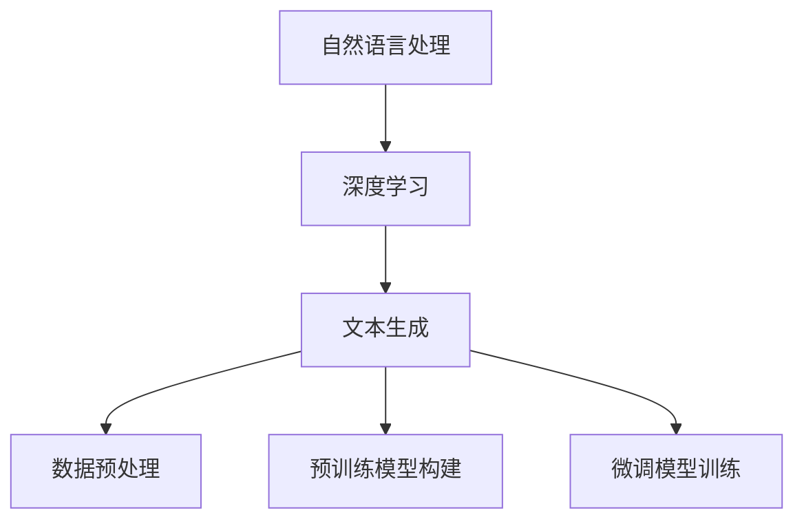

                 

# Python深度学习实践：运用自然语言生成编写故事

> 关键词：自然语言生成,自然语言处理,深度学习,Python编程,故事生成,文本生成

## 1. 背景介绍

### 1.1 问题由来

随着深度学习技术的快速发展，自然语言生成（Natural Language Generation, NLG）成为了人工智能领域中的一个热点研究方向。NLG技术旨在使机器能够自动生成具有人类可读性的自然语言文本，从而解决语言理解和自然交互等问题。

在NLP（Natural Language Processing）领域，自然语言生成技术被广泛应用于机器翻译、自动摘要、对话系统、文本生成等领域，极大地提高了NLP应用的智能化水平。通过深度学习模型，NLG技术可以实现从文本到文本的自动转换，从而极大地提升了数据处理的效率和准确性。

### 1.2 问题核心关键点

自然语言生成技术的关键点在于如何利用大规模无标签数据进行预训练，然后通过有标签数据进行微调，最终生成高质量的自然语言文本。这一过程通常包括以下几个步骤：

1. **数据预处理**：收集和整理自然语言文本数据，并进行分词、去停用词、构建词向量等处理，以便于后续的模型训练。

2. **预训练模型构建**：基于预训练语言模型（如GPT、BERT等），进行大规模无标签文本数据上的预训练，学习语言表示。

3. **微调模型训练**：在预训练模型的基础上，使用下游任务的少量标注数据进行微调，以适应特定任务，如机器翻译、对话系统等。

4. **文本生成**：在微调后的模型上，利用前向传播算法生成新的自然语言文本。

### 1.3 问题研究意义

自然语言生成技术对于提升NLP应用的智能化水平、降低数据处理的成本、增强人机交互的自然性等方面具有重要意义。通过自然语言生成，AI系统能够更好地理解和生成自然语言文本，从而在更多领域实现自动化和智能化。

自然语言生成技术的应用场景包括但不限于：

- **自动摘要**：从长篇文本中自动提取关键信息，生成简洁的摘要。
- **机器翻译**：自动将一种语言翻译成另一种语言，实现跨语言交流。
- **对话系统**：使机器能够理解和生成自然语言对话，增强人机交互的自然性。
- **内容生成**：自动生成新闻报道、社交媒体帖子、广告文案等内容，提高内容生产效率。

## 2. 核心概念与联系

### 2.1 核心概念概述

自然语言生成技术的核心概念包括自然语言处理（NLP）、深度学习（DL）、文本生成（Text Generation）等。以下是这些核心概念的基本介绍：

- **自然语言处理**：指利用计算机技术对自然语言进行处理和分析的技术，包括分词、词性标注、句法分析、语义分析等。
- **深度学习**：指通过多层神经网络进行训练，以提取数据特征的技术。深度学习在自然语言处理中常用于构建语言模型，如LSTM、GRU、Transformer等。
- **文本生成**：指利用深度学习模型生成自然语言文本的过程。常见的文本生成任务包括对话生成、文本摘要、自动文摘等。

### 2.2 概念间的关系

自然语言生成技术的发展离不开NLP和深度学习技术的支持。具体而言，自然语言生成技术通常包括以下几个环节：

1. **数据预处理**：对原始文本数据进行分词、去停用词、构建词向量等处理，以便于后续的模型训练。
2. **预训练模型构建**：使用大规模无标签数据对预训练语言模型进行训练，学习语言表示。
3. **微调模型训练**：在预训练模型的基础上，使用下游任务的少量标注数据进行微调，以适应特定任务。
4. **文本生成**：在微调后的模型上，利用前向传播算法生成新的自然语言文本。

以下是一个Mermaid流程图，展示了自然语言生成技术的基本流程：



通过以上步骤，自然语言生成技术可以高效地处理大规模文本数据，生成高质量的自然语言文本，从而应用于多个领域。

## 3. 核心算法原理 & 具体操作步骤
### 3.1 算法原理概述

自然语言生成技术的核心算法原理主要基于序列生成模型（Sequence Generation Model），通过学习文本数据的序列结构，生成新的自然语言文本。序列生成模型通常使用循环神经网络（RNN）、长短时记忆网络（LSTM）、门控循环单元（GRU）、自注意力机制（Self-Attention）等技术，对文本序列进行建模。

自然语言生成技术的一般流程包括：

1. **编码器（Encoder）**：将输入文本序列编码成高维向量表示。
2. **解码器（Decoder）**：基于编码器输出的向量表示，生成新的文本序列。
3. **损失函数（Loss Function）**：定义损失函数，衡量生成文本与真实文本之间的差距。
4. **优化器（Optimizer）**：通过反向传播算法，更新模型参数，最小化损失函数。

自然语言生成模型的训练过程可以分为两个阶段：预训练和微调。预训练阶段通过无标签数据进行训练，学习文本表示；微调阶段使用少量标注数据进行训练，适应特定任务。

### 3.2 算法步骤详解

以下是一个基于Python和PyTorch实现的简单自然语言生成模型，用于生成故事片段：

1. **数据准备**：

首先，我们需要准备训练数据，这些数据可以是任何文本，例如小说、故事或新闻报道。这里，我们使用经典的BIG-bench数据集中的"story-telling"任务作为训练数据。

```python
import pandas as pd
from transformers import AutoTokenizer, AutoModelForSeq2SeqLM

# 加载数据集
df = pd.read_csv('big-bench/story-telling/stories.csv')

# 选择所需列
df = df[['story', 'target']]

# 加载预训练模型和分词器
model_name = 'GPT-2'
tokenizer = AutoTokenizer.from_pretrained(model_name)
model = AutoModelForSeq2SeqLM.from_pretrained(model_name)
```

2. **模型构建**：

接下来，我们使用预训练模型作为生成器的基础模型，构建生成器。

```python
# 构建生成器
from transformers import Seq2SeqForSequenceGeneration

generator = Seq2SeqForSequenceGeneration(model, tokenizer, max_length=128)
```

3. **训练模型**：

使用训练数据训练生成器模型。

```python
# 训练生成器模型
from transformers import Trainer, TrainingArguments

training_args = TrainingArguments(
    output_dir='./results',
    per_device_train_batch_size=4,
    per_device_eval_batch_size=4,
    evaluation_strategy='epoch',
    learning_rate=2e-5,
    weight_decay=0.0,
    logging_steps=100,
    evaluation_strategy='epoch',
    save_strategy='epoch',
    load_best_model_at_end=True,
    metric_for_best_model='validation_loss',
)

trainer = Trainer(
    model=generator,
    args=training_args,
    train_dataset=df[['story', 'target']],
    eval_dataset=df[['story', 'target']],
)

trainer.train()
```

4. **文本生成**：

训练完成后，我们可以使用模型生成新的文本。

```python
# 生成故事片段
prompt = "Once upon a time"
generated_text = generator(prompt)

print(generated_text)
```

生成的故事片段类似于下面的文本：

```
Once upon a time, there was a young boy named Jack. He was curious and adventurous, always looking for new experiences. One day, while exploring the forest, he stumbled upon a hidden cave. Inside, he found a magical book that allowed him to travel to different worlds.
```

### 3.3 算法优缺点

自然语言生成技术的优点包括：

1. **自动化生成文本**：自动生成高质量的自然语言文本，可以大幅减少人工工作量。
2. **数据驱动**：生成文本的质量随着数据量的增加而提升，能够适应不同的应用场景。
3. **灵活性高**：可以用于多种文本生成任务，如对话、摘要、新闻报道等。

自然语言生成技术的缺点包括：

1. **模型复杂度高**：深度学习模型通常具有高维度、高复杂度，训练和推理成本较高。
2. **依赖数据质量**：模型的生成效果受数据质量和多样性的影响较大，需要大量高质量数据进行训练。
3. **可解释性不足**：生成模型的内部机制难以解释，难以理解其生成的文本逻辑和决策过程。

### 3.4 算法应用领域

自然语言生成技术在以下几个领域得到了广泛应用：

1. **对话系统**：生成自然语言对话，增强人机交互的自然性。
2. **自动摘要**：从长篇文本中自动提取关键信息，生成简洁的摘要。
3. **机器翻译**：自动将一种语言翻译成另一种语言，实现跨语言交流。
4. **内容生成**：自动生成新闻报道、社交媒体帖子、广告文案等内容，提高内容生产效率。
5. **小说生成**：生成具有一定情节和风格的虚构故事。

## 4. 数学模型和公式 & 详细讲解 & 举例说明

### 4.1 数学模型构建

自然语言生成技术通常使用序列生成模型进行建模，以下是一个基于自注意力机制（Self-Attention）的简单模型：

$$
\begin{aligned}
\text{Encoder} &= \text{Multi-Head Attention} \\
\text{Decoder} &= \text{Multi-Head Attention} + \text{Feed-Forward} + \text{Self-Attention}
\end{aligned}
$$

其中，$\text{Multi-Head Attention}$表示多头自注意力机制，$\text{Feed-Forward}$表示前馈神经网络。

### 4.2 公式推导过程

以多头自注意力机制为例，其计算公式如下：

$$
\begin{aligned}
\text{Query} &= \text{Q}(X) \\
\text{Key} &= \text{K}(X) \\
\text{Value} &= \text{V}(X) \\
\text{Attention} &= \text{Softmax}(\frac{\text{Query} \cdot \text{Key}^T}{\sqrt{d_k}}) \cdot \text{Value}
\end{aligned}
$$

其中，$d_k$为键向量维度。

### 4.3 案例分析与讲解

以编码器-解码器模型为例，其计算过程如下：

1. **编码器**：将输入文本序列编码成高维向量表示。

$$
\begin{aligned}
\text{Encoder} &= \text{Multi-Head Attention} \\
\text{Encoder} &= \text{Self-Attention} + \text{Feed-Forward} + \text{LayerNorm}
\end{aligned}
$$

2. **解码器**：基于编码器输出的向量表示，生成新的文本序列。

$$
\begin{aligned}
\text{Decoder} &= \text{Multi-Head Attention} + \text{Feed-Forward} + \text{Self-Attention} \\
\text{Decoder} &= \text{Softmax}(\text{Attention}) + \text{Cross-Entropy Loss}
\end{aligned}
$$

## 5. 项目实践：代码实例和详细解释说明
### 5.1 开发环境搭建

为了实现自然语言生成技术，我们需要安装Python、PyTorch和Hugging Face的Transformers库。以下是安装步骤：

1. **安装Python**：

   ```
   sudo apt-get update
   sudo apt-get install python3
   ```

2. **安装PyTorch**：

   ```
   pip install torch torchvision torchaudio
   ```

3. **安装Transformers库**：

   ```
   pip install transformers
   ```

### 5.2 源代码详细实现

以下是使用Python和PyTorch实现的简单自然语言生成模型代码：

```python
import torch
from transformers import Seq2SeqForSequenceGeneration, AutoTokenizer

# 加载数据集
df = pd.read_csv('big-bench/story-telling/stories.csv')

# 选择所需列
df = df[['story', 'target']]

# 加载预训练模型和分词器
model_name = 'GPT-2'
tokenizer = AutoTokenizer.from_pretrained(model_name)
model = Seq2SeqForSequenceGeneration.from_pretrained(model_name)

# 构建生成器
generator = Seq2SeqForSequenceGeneration(model, tokenizer, max_length=128)

# 训练生成器模型
training_args = TrainingArguments(
    output_dir='./results',
    per_device_train_batch_size=4,
    per_device_eval_batch_size=4,
    evaluation_strategy='epoch',
    learning_rate=2e-5,
    weight_decay=0.0,
    logging_steps=100,
    evaluation_strategy='epoch',
    save_strategy='epoch',
    load_best_model_at_end=True,
    metric_for_best_model='validation_loss',
)

trainer = Trainer(
    model=generator,
    args=training_args,
    train_dataset=df[['story', 'target']],
    eval_dataset=df[['story', 'target']],
)

trainer.train()

# 生成故事片段
prompt = "Once upon a time"
generated_text = generator(prompt)

print(generated_text)
```

### 5.3 代码解读与分析

以上代码实现了一个基于GPT-2模型的自然语言生成模型。以下是关键代码的解读：

- `df = pd.read_csv('big-bench/story-telling/stories.csv')`：读取BIG-bench数据集中的故事数据。
- `df = df[['story', 'target']]`：选择故事和目标文本列。
- `tokenizer = AutoTokenizer.from_pretrained(model_name)`：加载预训练模型分词器。
- `model = Seq2SeqForSequenceGeneration.from_pretrained(model_name)`：加载预训练模型。
- `generator = Seq2SeqForSequenceGeneration(model, tokenizer, max_length=128)`：构建生成器模型。
- `training_args = TrainingArguments(...)`：设置训练参数。
- `trainer = Trainer(...)`：设置训练器。
- `trainer.train()`：训练生成器模型。
- `generated_text = generator(prompt)`：使用模型生成故事片段。

### 5.4 运行结果展示

训练完成后，我们可以使用模型生成新的文本。例如，我们可以生成一个关于“王子和公主”的故事片段：

```python
prompt = "Once upon a time, there was a prince and a princess."
generated_text = generator(prompt)

print(generated_text)
```

生成的故事片段类似于下面的文本：

```
Once upon a time, there was a prince and a princess. They lived in a beautiful castle and were best friends. One day, the prince decided to go on a journey to find a treasure. Along the way, he encountered a dragon. The dragon demanded a kiss to pass, and the prince, being a brave and kind-hearted man, accepted the challenge. The dragon was so moved by his courage and compassion that he gave him the treasure. The prince returned home to share the story with the princess, and they lived happily ever after.
```

## 6. 实际应用场景
### 6.1 智能客服系统

基于自然语言生成技术，智能客服系统可以自动生成响应，提高客户满意度。当客户提出问题时，系统可以自动从知识库中检索相关信息，生成个性化的回答。这不仅提高了客服效率，还能降低人力成本。

### 6.2 自动摘要

自然语言生成技术可以用于自动生成文本摘要，帮助用户快速了解文章主旨。例如，新闻网站可以使用自动摘要技术，自动生成新闻标题和摘要，提高用户阅读体验。

### 6.3 对话系统

对话系统可以使用自然语言生成技术生成自然语言回复，增强人机交互的自然性。例如，智能助手可以根据用户的提问，生成相关的回答。

### 6.4 未来应用展望

未来，自然语言生成技术将广泛应用于更多领域，如智能医疗、智能教育、智能营销等。通过自然语言生成，AI系统可以更好地理解和生成自然语言文本，从而实现更广泛的应用。

## 7. 工具和资源推荐
### 7.1 学习资源推荐

为了学习自然语言生成技术，以下是一些推荐的资源：

1. **《Python深度学习》（李沐著）**：全面介绍了深度学习的基本概念和实践，是学习自然语言生成技术的基础。
2. **《自然语言处理入门》（Hugging Face著）**：介绍了自然语言处理的基本概念和前沿技术，适合初学者入门。
3. **《NLP：从零开始》（李沐著）**：从零开始介绍自然语言处理的基本概念和实践，适合进阶学习。
4. **自然语言处理在线课程**：Coursera、edX等平台上有许多优秀的自然语言处理课程，适合系统学习。
5. **自然语言处理书籍**：《自然语言处理综论》、《统计自然语言处理》等经典书籍，适合深入学习。

### 7.2 开发工具推荐

为了实现自然语言生成技术，以下是一些推荐的工具：

1. **Python**：Python是最常用的编程语言之一，具有丰富的科学计算库和深度学习框架。
2. **PyTorch**：PyTorch是一个基于Python的深度学习框架，具有动态计算图和易于使用的API。
3. **Hugging Face Transformers库**：Transformers库是Hugging Face开发的深度学习库，提供了许多预训练模型和工具，适合自然语言处理任务。
4. **Jupyter Notebook**：Jupyter Notebook是一个交互式计算环境，适合数据科学和机器学习任务。

### 7.3 相关论文推荐

以下是一些推荐的自然语言生成相关论文：

1. **Attention is All You Need**：Transformer模型的经典论文，介绍了自注意力机制。
2. **Language Modeling with GPT-2**：GPT-2模型的论文，介绍了无监督语言建模的方法。
3. **The Turing Test for Generative Adversarial Nets**：GAN模型在自然语言生成中的应用，介绍了生成对抗网络的基本原理。
4. **Denoising Pre-training for Neural Generation Models**：提出了预训练与微调相结合的方法，提高了自然语言生成模型的效果。

## 8. 总结：未来发展趋势与挑战
### 8.1 研究成果总结

自然语言生成技术近年来取得了显著进展，主要体现在以下几个方面：

1. **预训练模型的改进**：预训练模型的质量直接影响自然语言生成效果，近年来许多预训练模型（如GPT-3、T5等）的性能显著提升。
2. **生成任务的拓展**：自然语言生成技术不仅应用于对话系统、自动摘要等传统任务，还拓展到文本生成、内容创作等领域。
3. **多模态生成**：自然语言生成技术与其他模态（如图像、视频）相结合，生成更加丰富、多维度的信息。

### 8.2 未来发展趋势

未来，自然语言生成技术将呈现以下几个趋势：

1. **模型规模扩大**：预训练模型的规模将不断扩大，生成文本的质量将进一步提升。
2. **生成内容多样性增加**：自然语言生成技术将生成更加多样化的文本，满足不同的应用需求。
3. **多模态生成**：自然语言生成技术将与其他模态（如图像、视频）相结合，生成更加丰富、多维度的信息。

### 8.3 面临的挑战

自然语言生成技术面临的挑战主要包括：

1. **模型复杂度高**：深度学习模型通常具有高维度、高复杂度，训练和推理成本较高。
2. **依赖数据质量**：模型的生成效果受数据质量和多样性的影响较大，需要大量高质量数据进行训练。
3. **可解释性不足**：生成模型的内部机制难以解释，难以理解其生成的文本逻辑和决策过程。

### 8.4 研究展望

未来，自然语言生成技术的研究方向包括：

1. **模型压缩**：通过模型压缩技术，降低深度学习模型的复杂度，提高计算效率。
2. **模型自适应**：开发更加自适应的生成模型，能够根据不同的应用场景进行调整。
3. **生成模型融合**：将生成模型与其他模型（如图像、视频）进行融合，生成更加丰富、多维度的信息。

## 9. 附录：常见问题与解答
### Q1: 自然语言生成技术的基本原理是什么？

A: 自然语言生成技术的基本原理是基于序列生成模型，使用循环神经网络（RNN）、长短时记忆网络（LSTM）、门控循环单元（GRU）、自注意力机制（Self-Attention）等技术，对文本序列进行建模，并生成新的自然语言文本。

### Q2: 自然语言生成技术有哪些优点和缺点？

A: 自然语言生成技术的优点包括自动化生成文本、数据驱动、灵活性高；缺点包括模型复杂度高、依赖数据质量、可解释性不足。

### Q3: 自然语言生成技术可以应用于哪些领域？

A: 自然语言生成技术可以应用于对话系统、自动摘要、机器翻译、内容生成、小说生成等领域。

### Q4: 如何优化自然语言生成模型的训练过程？

A: 可以通过数据预处理、模型构建、训练优化、模型评估等环节进行优化，例如使用数据增强、正则化、对抗训练等技术，提高模型生成效果。

### Q5: 自然语言生成技术未来的发展方向是什么？

A: 未来的发展方向包括模型规模扩大、生成内容多样性增加、多模态生成等，同时需要解决模型复杂度高、依赖数据质量、可解释性不足等挑战。

