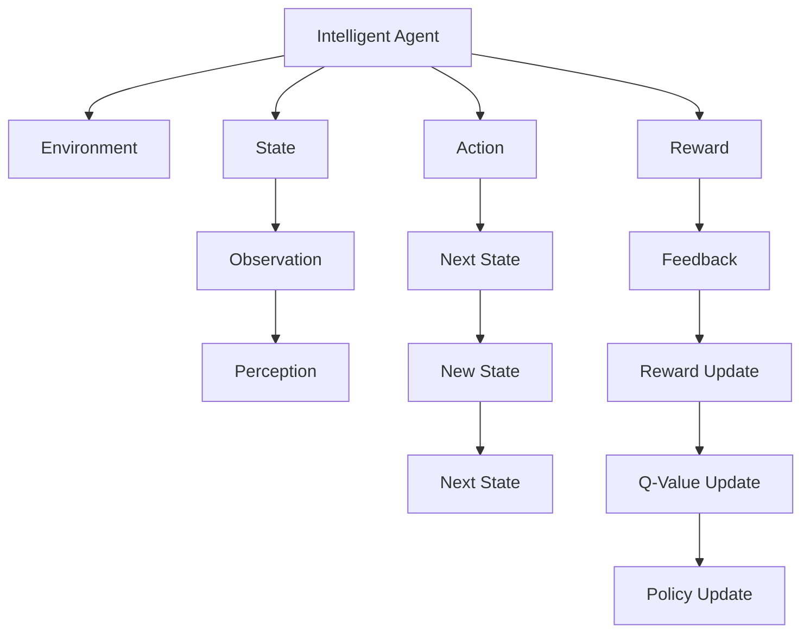

                 

# Q-Learning原理与代码实例讲解

## 1. 背景介绍

### 1.1 问题由来

Q-Learning是强化学习(Reinforcement Learning, RL)领域一种经典的学习算法，用于解决智能体(Agent)在与环境交互过程中，学习最优策略的问题。在计算机科学、运筹学、控制理论、经济学等多个学科中，Q-Learning算法都得到了广泛应用。

在计算机科学中，Q-Learning算法被用来优化机器学习模型、推荐系统、游戏AI等。例如，在游戏AI中，Q-Learning用于训练玩家自动生成决策，提升游戏策略水平。在机器学习中，Q-Learning被用来优化推荐系统，提升用户体验和收益。

### 1.2 问题核心关键点

Q-Learning算法基于序列决策理论，通过在不断交互的环境中学习，智能体可以逐步调整其决策策略，从而达到最优状态。Q-Learning的核心在于：
1. **策略-值函数估计**：通过Q值函数($Q$-value)来估计在当前状态下采取某种行动的长期奖励。
2. **策略优化**：通过优化Q值函数，指导智能体采取最优行动策略。

Q-Learning的优缺点如下：
- **优点**：
  - 不需要模型假设，可以处理复杂的决策问题。
  - 不需要手标注数据，只需在环境中收集样本数据。
  - 适用于离散和连续空间，能够处理多维输入和输出。
- **缺点**：
  - 收敛速度慢，需要大量的探索和交互。
  - 状态空间巨大时，学习效率低。
  - 可能陷入局部最优，收敛性不稳定。

### 1.3 问题研究意义

Q-Learning算法在多个领域都具有重要的研究价值和应用潜力：

1. **自动化控制**：在自动控制系统中，Q-Learning算法被用来优化机器人、无人机、自动驾驶等复杂系统中的决策行为，提升系统的稳定性和鲁棒性。
2. **游戏AI**：在游戏AI领域，Q-Learning被用来训练玩家自动生成决策，提升游戏策略水平。例如，AlphaGo和Dota 2的AI选手都是通过Q-Learning算法训练出来的。
3. **推荐系统**：在推荐系统中，Q-Learning被用来优化用户行为预测和推荐决策，提升推荐效果和用户满意度。
4. **金融工程**：在金融工程中，Q-Learning被用来优化投资策略和风险管理，提升金融产品的收益和稳定性。
5. **自然语言处理**：在自然语言处理中，Q-Learning被用来优化语言模型和对话系统，提升自然语言理解和生成能力。

## 2. 核心概念与联系

### 2.1 核心概念概述

为更好地理解Q-Learning算法，本节将介绍几个密切相关的核心概念：

- **智能体(Agent)**：Q-Learning算法中的决策主体，可以是机器人、游戏AI、推荐系统等。
- **环境(Environment)**：智能体所处的交互环境，例如游戏世界、电商网站等。
- **状态(State)**：智能体在环境中感知到的当前状态，可以是游戏状态、商品信息等。
- **动作(Action)**：智能体在当前状态下可以采取的行动，可以是游戏操作、商品推荐等。
- **奖励(Reward)**：智能体在采取某个行动后获得的即时奖励，可以是游戏得分、推荐点击率等。
- **策略(Policy)**：智能体采取行动的策略，可以是贪心策略、随机策略、ε-贪心策略等。

这些概念之间存在着紧密的联系，形成了Q-Learning算法的完整生态系统。

### 2.2 概念间的关系

这些核心概念之间可以通过以下Mermaid流程图来展示：



这个流程图展示了Q-Learning算法的核心概念及其之间的关系：

1. 智能体在环境中感知状态（F）。
2. 智能体选择行动（D）。
3. 智能体获得即时奖励（E）。
4. 环境返回下一状态（G）。
5. 智能体根据奖励更新Q值（M）。
6. 智能体根据Q值更新策略（N）。
7. 智能体继续选择行动，进入下一轮循环。

通过这些流程图，我们可以更清晰地理解Q-Learning算法的学习过程。

## 3. 核心算法原理 & 具体操作步骤

### 3.1 算法原理概述

Q-Learning算法通过不断更新状态-动作对的Q值，指导智能体选择最优行动。具体而言，Q值函数($Q$-value)是一个映射，将当前状态(state)和动作(action)映射到相应的长期奖励期望值($R$)。Q值函数的更新公式如下：

$$Q(s, a) = Q(s, a) + \alpha [r + \gamma \max Q(s', a')] - Q(s, a)$$

其中，$s$ 表示当前状态，$a$ 表示采取的行动，$s'$ 表示执行行动后达到的下一个状态，$a'$ 表示在该状态下采取的行动，$r$ 表示即时奖励，$\alpha$ 表示学习率，$\gamma$ 表示折扣因子。

算法的核心步骤为：
1. 初始化Q值函数，将状态-动作对的Q值初始化为0。
2. 在每个时间步，智能体根据策略选择一个行动，执行该行动并观察环境反馈。
3. 根据当前状态和采取的行动计算Q值，并更新Q值函数。
4. 根据更新后的Q值函数，智能体重新计算策略，选择最优行动。

### 3.2 算法步骤详解

以下是Q-Learning算法的详细步骤：

1. **初始化**：
   - 初始化Q值函数，将状态-动作对的Q值初始化为0。
   - 设置学习率$\alpha$和折扣因子$\gamma$，通常在0.1到0.9之间。
   - 定义策略$\epsilon$-greedy，选择一个随机数$\epsilon$，以$\epsilon$的概率选择随机行动，以$1-\epsilon$的概率选择贪心行动。

2. **交互过程**：
   - 在每个时间步，智能体根据策略$\epsilon$-greedy选择一个行动。
   - 执行该行动，观察环境反馈，记录即时奖励$r$和下一个状态$s'$。
   - 根据当前状态$s$、采取的行动$a$和即时奖励$r$计算Q值$Q(s, a)$。
   - 根据下一个状态$s'$和策略$\epsilon$-greedy计算最优行动$a'$。
   - 更新Q值函数$Q(s, a)$。

3. **更新策略**：
   - 根据更新后的Q值函数，重新计算策略。
   - 重复执行2和3，直到达到终止条件（例如达到预设的迭代次数、环境无奖励）。

### 3.3 算法优缺点

Q-Learning算法的优点在于：
- 不需要模型假设，可以处理复杂的决策问题。
- 不需要手标注数据，只需在环境中收集样本数据。
- 适用于离散和连续空间，能够处理多维输入和输出。

Q-Learning算法的缺点在于：
- 收敛速度慢，需要大量的探索和交互。
- 状态空间巨大时，学习效率低。
- 可能陷入局部最优，收敛性不稳定。

### 3.4 算法应用领域

Q-Learning算法广泛应用于自动化控制、游戏AI、推荐系统、金融工程、自然语言处理等多个领域：

- **自动化控制**：在自动控制系统中，Q-Learning用于优化机器人、无人机、自动驾驶等复杂系统中的决策行为，提升系统的稳定性和鲁棒性。
- **游戏AI**：在游戏AI领域，Q-Learning用于训练玩家自动生成决策，提升游戏策略水平。例如，AlphaGo和Dota 2的AI选手都是通过Q-Learning算法训练出来的。
- **推荐系统**：在推荐系统中，Q-Learning用于优化用户行为预测和推荐决策，提升推荐效果和用户满意度。
- **金融工程**：在金融工程中，Q-Learning用于优化投资策略和风险管理，提升金融产品的收益和稳定性。
- **自然语言处理**：在自然语言处理中，Q-Learning用于优化语言模型和对话系统，提升自然语言理解和生成能力。

## 4. 数学模型和公式 & 详细讲解  
### 4.1 数学模型构建

本节将使用数学语言对Q-Learning算法进行更加严格的刻画。

假设智能体在时间步$t$处于状态$s$，采取行动$a$，获得即时奖励$r$，并转移到下一个状态$s'$。状态-动作对的Q值定义为：

$$Q(s, a) = E[\sum_{t'} r_t' + \gamma Q(s', a')]$$

其中，$s'$是执行行动后达到的下一个状态，$a'$是在该状态下采取的行动，$t'$表示后续的时间步，$\gamma$是折扣因子，$E$表示期望值。

Q值函数的更新公式为：

$$Q(s, a) = Q(s, a) + \alpha [r + \gamma \max Q(s', a')] - Q(s, a)$$

其中，$r$表示即时奖励，$\alpha$表示学习率，$\gamma$表示折扣因子，$\max Q(s', a')$表示在下一个状态$s'$下选择最优行动$a'$的Q值。

### 4.2 公式推导过程

以下我们推导Q值函数的更新公式及其推导过程。

假设智能体在时间步$t$处于状态$s$，采取行动$a$，获得即时奖励$r$，并转移到下一个状态$s'$。状态-动作对的Q值定义为：

$$Q(s, a) = E[\sum_{t'} r_t' + \gamma Q(s', a')]$$

将其展开，得：

$$Q(s, a) = r + \gamma E[Q(s', a')]$$

根据Q值函数的定义，将其代入状态-动作对的Q值定义中，得：

$$Q(s, a) = r + \gamma \max Q(s', a')$$

由此可得Q值函数的更新公式：

$$Q(s, a) = Q(s, a) + \alpha [r + \gamma \max Q(s', a')] - Q(s, a)$$

这个公式展示了Q值函数在每个时间步的更新过程。

### 4.3 案例分析与讲解

以下我们通过一个简单的案例来进一步说明Q-Learning算法的应用。

假设有一个智能体在一个网格世界中移动，网格中有两个状态$s_1$和$s_2$，智能体可以选择向上或向右移动。智能体的目标是从$s_1$移动到$s_2$，并最大化获得的奖励。

智能体在每个时间步选择一个动作，并根据动作得到即时奖励。如果智能体到达$s_2$，则获得$10$奖励。如果智能体到达边界或另一个障碍，则获得$-1$奖励。智能体的行动空间是$\{向上, 向右\}$。

我们定义状态-动作对的Q值如下：

$$Q(s_1, 向上) = Q(s_1, 向上) + 0.1 \times (10 + \gamma \max Q(s_2, 向上) - Q(s_1, 向上))$$
$$Q(s_1, 向右) = Q(s_1, 向右) + 0.1 \times (10 + \gamma \max Q(s_2, 向右) - Q(s_1, 向右))$$
$$Q(s_2, 向上) = Q(s_2, 向上) + 0.1 \times (-1 + \gamma \max Q(s_1, 向上) - Q(s_2, 向上))$$
$$Q(s_2, 向右) = Q(s_2, 向右) + 0.1 \times (-1 + \gamma \max Q(s_1, 向右) - Q(s_2, 向右))$$

其中，$\gamma = 0.9$，$\alpha = 0.1$。

在初始状态下，智能体在$s_1$，并根据策略$\epsilon$-greedy选择一个动作。假设$\epsilon = 0.5$，智能体以50%的概率选择向上移动，50%的概率选择向右移动。

假设在时间步$t$，智能体处于$s_1$，采取了向上移动的行动，观察到即时奖励$r = -1$，并转移到状态$s_2$。智能体在$s_2$的状态-动作对的Q值更新如下：

$$Q(s_2, 向上) = Q(s_2, 向上) + 0.1 \times (-1 + \gamma \max Q(s_1, 向上) - Q(s_2, 向上))$$
$$Q(s_2, 向上) = Q(s_2, 向上) + 0.1 \times (-1 + 0.9 \max Q(s_1, 向上) - Q(s_2, 向上))$$

假设$Q(s_1, 向上) = 1$，智能体继续执行向下移动的行动，观察到即时奖励$r = -1$，并转移到状态$s_1$。智能体在$s_1$的状态-动作对的Q值更新如下：

$$Q(s_1, 向上) = Q(s_1, 向上) + 0.1 \times (-1 + \gamma \max Q(s_2, 向上) - Q(s_1, 向上))$$
$$Q(s_1, 向上) = Q(s_1, 向上) + 0.1 \times (-1 + 0.9 \max Q(s_2, 向上) - Q(s_1, 向上))$$

通过不断迭代更新Q值函数，智能体可以逐步学习最优策略，并最大化其获得的奖励。

## 5. 项目实践：代码实例和详细解释说明

### 5.1 开发环境搭建

在进行Q-Learning算法实践前，我们需要准备好开发环境。以下是使用Python进行Q-Learning开发的Python环境配置流程：

1. 安装Anaconda：从官网下载并安装Anaconda，用于创建独立的Python环境。

2. 创建并激活虚拟环境：
```bash
conda create -n pyrl-env python=3.8 
conda activate pyrl-env
```

3. 安装相关的Python库：
```bash
pip install numpy matplotlib scikit-learn gym gym-wrappers-balloon numpy
```

4. 安装Q-Learning相关的库：
```bash
pip install gym gym-wrappers-flatmax numpy
```

完成上述步骤后，即可在`pyrl-env`环境中开始Q-Learning算法实践。

### 5.2 源代码详细实现

以下是一个简单的Q-Learning算法实现示例，用于在CartPole环境中进行训练。

```python
import gym
import numpy as np
import matplotlib.pyplot as plt

# 创建CartPole环境
env = gym.make('CartPole-v0')

# 定义Q值函数
def q_learning(env, num_episodes=1000, learning_rate=0.1, discount_factor=0.9, exploration_rate=1.0):
    q_table = np.zeros([env.observation_space.n, env.action_space.n])

    for episode in range(num_episodes):
        state = env.reset()
        done = False
        total_reward = 0

        while not done:
            if np.random.rand() < exploration_rate:
                action = env.action_space.sample()
            else:
                action = np.argmax(q_table[state])

            next_state, reward, done, _ = env.step(action)
            total_reward += reward
            q_table[state, action] += learning_rate * (reward + discount_factor * np.max(q_table[next_state]) - q_table[state, action])
            state = next_state

        print('Episode:', episode, 'Total reward:', total_reward)

    return q_table

# 运行Q-Learning算法
q_table = q_learning(env, num_episodes=1000, learning_rate=0.1, discount_factor=0.9, exploration_rate=0.1)

# 绘制Q值函数
plt.plot(q_table[:, 0], label='Action 0')
plt.plot(q_table[:, 1], label='Action 1')
plt.legend()
plt.show()
```

在这个示例中，我们使用CartPole环境进行Q-Learning算法的训练。Q值函数初始化为0，在每个时间步，智能体根据策略选择行动，并根据状态和即时奖励更新Q值函数。

### 5.3 代码解读与分析

让我们再详细解读一下关键代码的实现细节：

**Q-learning函数**：
- 在每个时间步，智能体根据策略$\epsilon$-greedy选择一个行动。
- 执行该行动，观察环境反馈，记录即时奖励$r$和下一个状态$s'$。
- 根据当前状态$s$、采取的行动$a$和即时奖励$r$计算Q值$Q(s, a)$。
- 根据下一个状态$s'$和策略$\epsilon$-greedy计算最优行动$a'$。
- 更新Q值函数$Q(s, a)$。

**CartPole环境**：
- 使用gym库创建CartPole环境，用于测试Q-Learning算法。
- 在每个时间步，智能体在状态空间中随机选择一个行动。
- 执行该行动，观察环境反馈，记录即时奖励$r$和下一个状态$s'$。
- 根据当前状态$s$、采取的行动$a$和即时奖励$r$计算Q值$Q(s, a)$。
- 根据下一个状态$s'$和策略$\epsilon$-greedy计算最优行动$a'$。
- 更新Q值函数$Q(s, a)$。

**绘制Q值函数**：
- 绘制Q值函数，展示智能体在不同状态下的Q值。
- 通过观察Q值函数的演变，可以了解智能体是如何逐步学习最优策略的。

**运行结果展示**：
- 运行Q-Learning算法，并在每个时间步记录总奖励。
- 通过观察总奖励的变化趋势，可以了解Q-Learning算法在测试环境中的性能表现。

可以看到，通过Q-Learning算法，智能体可以逐步学习最优策略，并最大化其获得的奖励。在实际应用中，Q-Learning算法还可以结合更复杂的决策空间和更复杂的奖励函数，以应对更加复杂的问题。

## 6. 实际应用场景
### 6.1 自动化控制

Q-Learning算法在自动化控制领域有广泛应用，可以优化机器人、无人机、自动驾驶等复杂系统中的决策行为，提升系统的稳定性和鲁棒性。

在机器人控制中，Q-Learning用于优化机器人的路径规划和动作选择，提升机器人的导航能力和避障能力。例如，可以使用Q-Learning算法训练机器人学习在复杂环境中的运动策略。

在自动驾驶中，Q-Learning用于优化车辆的路径规划和决策行为，提升车辆的行驶安全和稳定性。例如，可以使用Q-Learning算法训练车辆学习在多车流中安全行驶的策略。

### 6.2 游戏AI

Q-Learning算法在游戏AI领域有广泛应用，可以训练玩家自动生成决策，提升游戏策略水平。

在电子游戏中，Q-Learning用于训练玩家自动生成决策，提升游戏策略水平。例如，可以使用Q-Learning算法训练游戏AI学习在复杂游戏场景中的策略，提升游戏AI的决策能力和生存能力。

### 6.3 推荐系统

Q-Learning算法在推荐系统中也有广泛应用，可以优化用户行为预测和推荐决策，提升推荐效果和用户满意度。

在推荐系统中，Q-Learning用于优化用户行为预测和推荐决策，提升推荐效果和用户满意度。例如，可以使用Q-Learning算法训练推荐系统学习在复杂用户行为数据中的推荐策略，提升推荐系统的推荐质量和用户满意度。

### 6.4 未来应用展望

Q-Learning算法的未来发展方向如下：

1. **多智能体Q-Learning**：将Q-Learning算法扩展到多智能体系统，优化多个智能体之间的协同决策，提升系统的协作能力和鲁棒性。
2. **深度强化学习**：结合深度学习技术，优化Q-Learning算法的决策过程，提升决策能力和学习效率。
3. **元强化学习**：使用元强化学习方法，优化Q-Learning算法的学习过程，提升学习效率和泛化能力。
4. **分布式Q-Learning**：将Q-Learning算法扩展到分布式环境中，优化大规模系统的协同决策，提升系统的可扩展性和鲁棒性。
5. **混合学习**：结合其他强化学习算法，如蒙特卡罗树搜索、策略梯度等，优化Q-Learning算法的学习过程，提升学习效率和决策能力。

总之，Q-Learning算法具有广泛的应用前景，将在多个领域中发挥重要作用。

## 7. 工具和资源推荐
### 7.1 学习资源推荐

为了帮助开发者系统掌握Q-Learning算法的理论基础和实践技巧，这里推荐一些优质的学习资源：

1. 《Reinforcement Learning: An Introduction》书籍：这是强化学习领域的经典教材，涵盖了Q-Learning算法的基本概念和应用。

2. 《Deep Reinforcement Learning with Python》书籍：该书介绍了深度强化学习算法的基本原理和实践技巧，包括Q-Learning算法在内。

3. Coursera《Reinforcement Learning》课程：斯坦福大学开设的强化学习课程，系统讲解了Q-Learning算法的基本原理和应用。

4. Udacity《Reinforcement Learning》纳米学位：提供了一系列的强化学习项目，包括Q-Learning算法的实践应用。

5. DeepMind官方博客：DeepMind是强化学习领域的领军企业，其官方博客经常发布最新的研究成果和应用案例，值得关注。

### 7.2 开发工具推荐

Q-Learning算法的开发通常使用Python进行。以下是几款常用的Python开发工具：

1. Anaconda：用于创建和管理Python环境，支持高效的虚拟环境管理和依赖管理。

2. Jupyter Notebook：用于编写和运行Python代码，支持代码的高效运行和交互式调试。

3. PyTorch：用于深度学习开发的Python库，提供了丰富的优化器和神经网络模块。

4. TensorFlow：用于深度学习开发的Python库，支持大规模分布式计算和GPU加速。

5. OpenAI Gym：用于测试和训练强化学习算法的Python库，支持多种环境和算法。

### 7.3 相关论文推荐

Q-Learning算法的发展源于学界的持续研究。以下是几篇奠基性的相关论文，推荐阅读：

1. "Q-Learning"论文：由Watkins等人于1992年发表，介绍了Q-Learning算法的基本原理和应用。

2. "Deep Q-Networks"论文：由Mnih等人于2013年发表，介绍了深度Q-Learning算法的基本原理和应用。

3. "Trust Region Policy Optimization"论文：由Schmidhuber等人于2015年发表，介绍了信任区域策略优化算法的应用。

4. "Soft-Q-Learning"论文：由Arul等人在2015年发表，介绍了软Q-Learning算法的基本原理和应用。

5. "DQN"论文：由Mnih等人于2013年发表，介绍了深度Q-Networks算法的应用。

这些论文代表了大语言模型微调技术的发展脉络。通过学习这些前沿成果，可以帮助研究者把握学科前进方向，激发更多的创新灵感。

## 8. 总结：未来发展趋势与挑战

### 8.1 总结

本文对Q-Learning算法进行了全面系统的介绍。首先阐述了Q-Learning算法的研究背景和意义，明确了Q-Learning算法在自动化控制、游戏AI、推荐系统等多个领域的应用价值。其次，从原理到实践，详细讲解了Q-Learning算法的数学模型和核心步骤，给出了Q-Learning算法完整的代码实现示例。同时，本文还探讨了Q-Learning算法的未来发展方向和面临的挑战，为未来的研究提供了参考。

通过本文的系统梳理，可以看到，Q-Learning算法在自动化控制、游戏AI、推荐系统等领域具有重要的应用价值，能够显著提升系统的决策能力和学习效率。未来，Q-Learning算法还将不断演进，结合深度学习、元强化学习等技术，进一步提升智能体的决策能力和学习效率。

### 8.2 未来发展趋势

Q-Learning算法的未来发展方向如下：

1. **多智能体Q-Learning**：将Q-Learning算法扩展到多智能体系统，优化多个智能体之间的协同决策，提升系统的协作能力和鲁棒性。
2. **深度强化学习**：结合深度学习技术，优化Q-Learning算法的决策过程，提升决策能力和学习效率。
3. **元强化学习**：使用元强化学习方法，优化Q-Learning算法的学习过程，提升学习效率和泛化能力。
4. **分布式Q-Learning**：将Q-Learning算法扩展到分布式环境中，优化大规模系统的协同决策，提升系统的可扩展性和鲁棒性。
5. **混合学习**：结合其他强化学习算法，如蒙特卡罗树搜索、策略梯度等，优化Q-Learning算法的学习过程，提升学习效率和决策能力。

### 8.3 面临的挑战

Q-Learning算法在应用过程中，仍然面临诸多挑战：

1. **探索与利用冲突**：Q-Learning算法在开始阶段需要大量的探索行动，但探索行动带来的奖励往往较低，导致智能体在初期表现不佳。
2. **维度灾难**：状态空间和动作空间较大时，Q-Learning算法的学习效率较低。
3. **Q值函数逼近问题**：Q-Learning算法需要估计Q值函数，但估计精度受限于样本数量和模型复杂度。
4. **学习效率问题**：Q-Learning算法需要大量的交互数据和计算资源，学习效率较低。
5. **稳定性问题**：Q-Learning算法在面对复杂的决策空间

