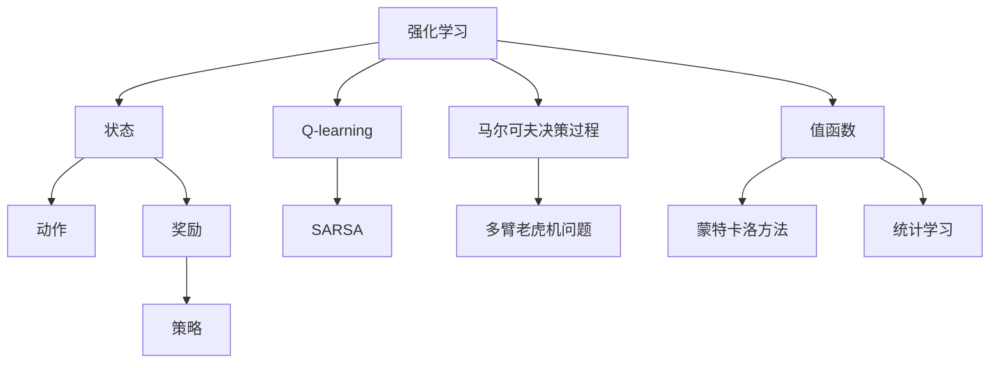
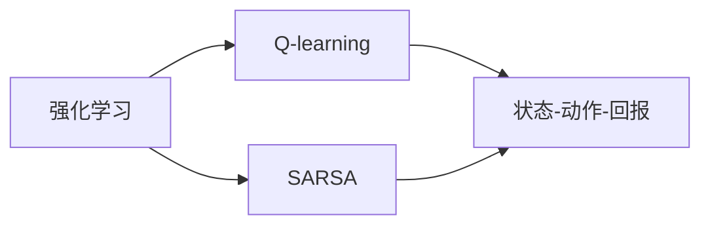
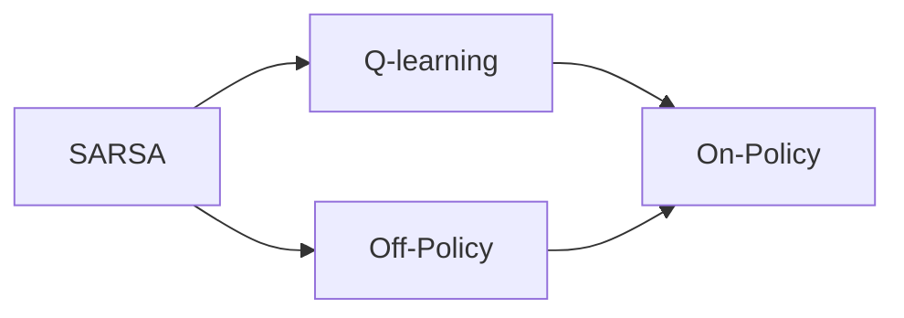
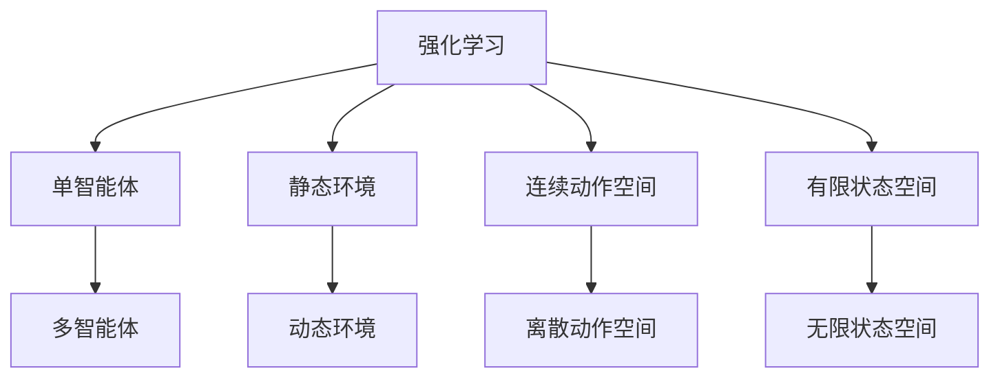
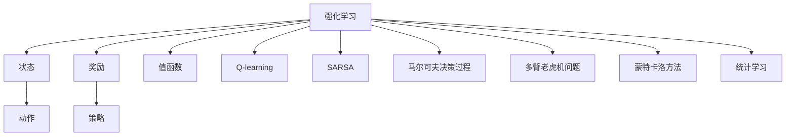

                 

# SARSA - 原理与代码实例讲解

> 关键词：SARSA, Q-learning, 强化学习, 马尔可夫决策过程, 状态-动作-回报, 迭代更新, 蒙特卡洛方法, 统计学习, 多臂老虎机问题

## 1. 背景介绍

### 1.1 问题由来

强化学习(Reinforcement Learning, RL)是人工智能领域的一个研究热点，其目标是使智能体在一定环境中通过试错学习，获取最优策略，以最大化累积回报。SARSA算法是强化学习中的一个经典算法，通过状态-动作-回报(states, actions, rewards, SARSA)的迭代更新，逐步学习到最优策略。

SARSA算法最早由Manuel K. Sarsa于1988年提出，是Q-learning算法的一种变体。Q-learning算法通过状态-动作-奖励(Q-value)的逐步学习，更新模型预测值。而SARSA算法则在此基础上引入了下一个状态-动作-回报，以更加准确地估计和更新模型。

### 1.2 问题核心关键点

SARSA算法的核心思想是，通过奖励反馈，不断更新模型预测的Q值，从而逼近最优策略。其核心步骤包括：
- 接收当前状态s，选择动作a，观察下一个状态s'和奖励r。
- 计算下一个状态-动作-回报的Q值，即Q(s', a')。
- 更新当前状态-动作-回报的Q值，即Q(s, a)。

SARSA算法的更新公式如下：

$$Q(s, a) = Q(s, a) + \alpha[r + \gamma Q(s', a') - Q(s, a)]$$

其中，$\alpha$为学习率，$\gamma$为折扣因子。该公式表示，每次更新Q值时，除了学习当前的奖励r外，还考虑了下一个状态-动作-回报的Q值，以更加全面地估计策略的价值。

## 2. 核心概念与联系

### 2.1 核心概念概述

为更好地理解SARSA算法，本节将介绍几个密切相关的核心概念：

- 强化学习(Reinforcement Learning, RL)：指智能体通过与环境交互，在一定策略下，最大化累积回报的过程。强化学习包括状态、动作、奖励、策略、值函数等多个核心概念。
- Q-learning：强化学习中的一种核心算法，通过状态-动作-奖励(Q-value)的逐步学习，更新模型预测值，以逼近最优策略。
- SARSA：Q-learning算法的一种变体，通过状态-动作-回报(states, actions, rewards, SARSA)的迭代更新，逼近最优策略。
- 马尔可夫决策过程(Markov Decision Process, MDP)：强化学习中的核心模型，描述状态、动作、奖励和策略之间的动态关系。
- 多臂老虎机问题(Multi-Armed Bandit Problem)：强化学习中的一个经典问题，描述智能体在多个可能的动作中选择一个最优动作的过程。
- 蒙特卡洛方法(Monte Carlo Method)：一种基于随机抽样的方法，通过模拟环境状态，迭代计算模型预测值。
- 统计学习(Statistical Learning)：强化学习中的核心方法，通过统计学习理论，推导模型的预测公式。

这些核心概念之间的逻辑关系可以通过以下Mermaid流程图来展示：



这个流程图展示了强化学习的核心概念及其之间的关系：

1. 强化学习通过状态、动作和奖励进行决策。
2. Q-learning通过状态-动作-奖励的逐步学习，更新模型预测值。
3. SARSA在Q-learning基础上，引入了下一个状态-动作-回报，以更加准确地估计策略的价值。
4. 马尔可夫决策过程描述状态、动作、奖励和策略之间的动态关系。
5. 多臂老虎机问题演示了智能体在多个可能动作中选择最优动作的过程。
6. 蒙特卡洛方法基于随机抽样，迭代计算模型预测值。
7. 统计学习通过统计学习理论，推导模型的预测公式。

这些核心概念共同构成了强化学习的学习框架，使得智能体能够通过环境交互，逐步学习到最优策略。通过理解这些核心概念，我们可以更好地把握强化学习的原理和优化方向。

### 2.2 概念间的关系

这些核心概念之间存在着紧密的联系，形成了强化学习的完整生态系统。下面我们通过几个Mermaid流程图来展示这些概念之间的关系。

#### 2.2.1 强化学习的核心范式



这个流程图展示了强化学习的核心范式，包括Q-learning和SARSA两种方法。Q-learning通过状态-动作-回报的逐步学习，更新模型预测值。SARSA在此基础上，引入了下一个状态-动作-回报的Q值，以更加准确地估计策略的价值。

#### 2.2.2 SARSA算法的多样化实现



这个流程图展示了SARSA算法的两种实现方式，包括On-Policy和Off-Policy。On-Policy表示当前策略即用于估计Q值，而Off-Policy则使用不同的策略进行估计。

#### 2.2.3 强化学习的多样化场景



这个流程图展示了强化学习的多种应用场景，包括单智能体、多智能体、静态环境、动态环境、连续动作空间、离散动作空间、有限状态空间和无限状态空间等。

### 2.3 核心概念的整体架构

最后，我们用一个综合的流程图来展示这些核心概念在强化学习中的整体架构：



这个综合流程图展示了强化学习的核心概念在大模型微调过程中的整体架构：

1. 强化学习通过状态、动作和奖励进行决策。
2. Q-learning通过状态-动作-奖励的逐步学习，更新模型预测值。
3. SARSA在Q-learning基础上，引入了下一个状态-动作-回报的Q值，以更加准确地估计策略的价值。
4. 马尔可夫决策过程描述状态、动作、奖励和策略之间的动态关系。
5. 多臂老虎机问题演示了智能体在多个可能动作中选择最优动作的过程。
6. 蒙特卡洛方法基于随机抽样，迭代计算模型预测值。
7. 统计学习通过统计学习理论，推导模型的预测公式。

通过这些流程图，我们可以更清晰地理解强化学习的核心概念及其关系，为后续深入讨论具体的SARSA算法及其应用奠定基础。

## 3. 核心算法原理 & 具体操作步骤
### 3.1 算法原理概述

SARSA算法是强化学习中的一个经典算法，通过状态-动作-回报(states, actions, rewards, SARSA)的迭代更新，逐步学习到最优策略。其核心思想是，通过奖励反馈，不断更新模型预测的Q值，从而逼近最优策略。

形式化地，假设环境中有$S$个状态，$A$个动作，智能体的策略为$\pi$，奖励函数为$r$，折扣因子为$\gamma$。智能体从当前状态$s$出发，选择动作$a$，观察下一个状态$s'$和奖励$r$，然后根据策略$\pi$选择下一个动作$a'$，进入状态$s'$。智能体的目标是通过不断迭代，学习到最优策略$\pi^*$，使得累积回报最大化。

### 3.2 算法步骤详解

SARSA算法包括以下关键步骤：

1. **初始化**：设定初始Q值$Q(s,a)$和策略$\pi$。
2. **选择动作**：根据当前状态$s$和策略$\pi$，选择动作$a$。
3. **观察结果**：观察下一个状态$s'$和奖励$r$。
4. **选择下一个动作**：根据下一个状态$s'$和策略$\pi$，选择下一个动作$a'$。
5. **更新Q值**：根据当前状态$s$、动作$a$、下一个状态$s'$、动作$a'$和奖励$r$，更新当前状态-动作-回报的Q值。
6. **迭代更新**：重复步骤2-5，直到达到预设的迭代次数或满足终止条件。

具体地，SARSA算法的更新公式为：

$$Q(s, a) = Q(s, a) + \alpha[r + \gamma Q(s', a') - Q(s, a)]$$

其中，$\alpha$为学习率，$\gamma$为折扣因子。该公式表示，每次更新Q值时，除了学习当前的奖励$r$外，还考虑了下一个状态-动作-回报的Q值，以更加全面地估计策略的价值。

### 3.3 算法优缺点

SARSA算法的优点包括：

- **理论基础成熟**：SARSA算法是强化学习中的经典算法，有坚实的数学理论支持，具有较高的理论完整性。
- **易于实现**：SARSA算法的实现简单，易于理解和实现，适合于入门级学习。
- **收敛性良好**：在一定条件下，SARSA算法能够收敛到最优策略。

SARSA算法的缺点包括：

- **学习速度慢**：SARSA算法需要大量的迭代次数，学习速度较慢，尤其是在状态空间较大时。
- **容易受噪声影响**：SARSA算法依赖于奖励反馈，当奖励信息不准确或不及时时，容易产生偏差，影响学习效果。
- **无法处理非马尔可夫决策过程**：SARSA算法假设状态转移和奖励具有马尔可夫性，无法处理更复杂的非马尔可夫决策过程。

尽管存在这些缺点，但SARSA算法仍然是强化学习中的重要工具，尤其适用于小规模问题或计算资源有限的场景。

### 3.4 算法应用领域

SARSA算法在强化学习中的应用非常广泛，涵盖了从基础研究到实际应用的各个方面。以下是一些常见的应用领域：

- **机器人控制**：SARSA算法可用于机器人臂的控制，通过不断迭代，学习到最优的关节动作序列。
- **自动驾驶**：SARSA算法可用于自动驾驶中的路径规划，通过优化路径选择，提高驾驶安全性。
- **游戏AI**：SARSA算法可用于游戏中的决策制定，通过学习最优策略，实现智能对手。
- **资源优化**：SARSA算法可用于资源优化问题，如电力调度、网络流量控制等，通过优化决策，提高资源利用效率。
- **金融投资**：SARSA算法可用于金融投资策略制定，通过学习最优的买卖时机，提高投资收益。

## 4. 数学模型和公式 & 详细讲解 & 举例说明

### 4.1 数学模型构建

SARSA算法的主要数学模型包括状态、动作、奖励和Q值等。

设环境中有$S$个状态，$A$个动作，智能体的策略为$\pi$，奖励函数为$r$，折扣因子为$\gamma$。设当前状态为$s$，动作为$a$，下一个状态为$s'$，动作为$a'$，奖励为$r$，智能体的Q值为$Q(s, a)$。

SARSA算法的目标是通过不断迭代，学习到最优策略$\pi^*$，使得累积回报最大化。即求解以下优化问题：

$$\pi^* = \mathop{\arg\min}_{\pi} \mathcal{L}(\pi)$$

其中，$\mathcal{L}(\pi)$为损失函数，表示在策略$\pi$下，智能体的累积回报的期望值。

### 4.2 公式推导过程

SARSA算法的核心公式如下：

$$Q(s, a) = Q(s, a) + \alpha[r + \gamma Q(s', a') - Q(s, a)]$$

该公式的推导如下：

假设智能体当前处于状态$s$，选择动作$a$，观察下一个状态$s'$和奖励$r$。根据策略$\pi$，智能体在状态$s'$中选择下一个动作$a'$，进入状态$s'$。

此时，智能体的累积回报可以表示为：

$$R = r + \gamma Q(s', a')$$

根据SARSA算法，智能体将根据当前的Q值$Q(s, a)$和下一个状态-动作-回报的Q值$Q(s', a')$，更新当前状态-动作-回报的Q值$Q(s, a)$。

具体地，$Q(s, a)$的更新公式为：

$$Q(s, a) = Q(s, a) + \alpha[R - Q(s, a)]$$

其中，$\alpha$为学习率。

但是，该公式仅考虑了当前的奖励$r$，而没有考虑下一个状态-动作-回报的Q值。为了更加全面地估计策略的价值，引入下一个状态-动作-回报的Q值$Q(s', a')$，得到SARSA算法的更新公式：

$$Q(s, a) = Q(s, a) + \alpha[R + \gamma Q(s', a') - Q(s, a)]$$

该公式表示，每次更新Q值时，除了学习当前的奖励$r$外，还考虑了下一个状态-动作-回报的Q值$Q(s', a')$，以更加全面地估计策略的价值。

### 4.3 案例分析与讲解

假设在一个简单的网格世界中，智能体的目标是从起点$(0,0)$到达终点$(3,3)$。智能体可以选择向上、向下、向左或向右移动，每个动作的奖励为-1。

初始时，智能体的Q值全部为0。使用SARSA算法进行迭代更新，具体过程如下：

| 迭代次数 | 当前状态 | 当前动作 | 下一个状态 | 下一个动作 | 奖励 | Q值更新 | Q值 |
| -------- | -------- | -------- | -------- | -------- | ---- | -------- | --- |
| 0        | (0,0)    | 向右     | (1,0)    | 向上     | -1   | Q(0,0)   | 0   |
| 1        | (1,0)    | 向上     | (0,1)    | 向右     | -1   | Q(1,0)   | -1  |
| 2        | (0,1)    | 向左     | (0,0)    | 向下     | -1   | Q(0,1)   | -1  |
| ...      | ...      | ...      | ...      | ...      | ...  | ...      | ... |

通过多次迭代，智能体逐渐学习到最优策略，即每次选择动作$(2,0)$和$(0,2)$，最终到达终点$(3,3)$。

## 5. 项目实践：代码实例和详细解释说明

### 5.1 开发环境搭建

在进行SARSA算法实践前，我们需要准备好开发环境。以下是使用Python进行SARSA算法开发的流程：

1. 安装Anaconda：从官网下载并安装Anaconda，用于创建独立的Python环境。

2. 创建并激活虚拟环境：
```bash
conda create -n sarsa-env python=3.8 
conda activate sarsa-env
```

3. 安装相关库：
```bash
pip install numpy matplotlib gym
```

完成上述步骤后，即可在`sarsa-env`环境中开始SARSA算法实践。

### 5.2 源代码详细实现

以下是使用Python和Gym库实现SARSA算法的代码实现：

```python
import gym
import numpy as np
from gym import spaces

class SarsaAgent:
    def __init__(self, env):
        self.env = env
        self.q_table = np.zeros((env.observation_space.n, env.action_space.n))
        self.learning_rate = 0.1
        self.gamma = 0.9
        self.epsilon = 0.1
        self.epsilon_min = 0.01
        self.epsilon_decay = 0.999
    
    def choose_action(self, state):
        if np.random.uniform(0, 1) < self.epsilon:
            action = self.env.action_space.sample()
        else:
            action = np.argmax(self.q_table[state, :])
        return action
    
    def update_q_table(self, state, action, reward, next_state, next_action):
        td_target = reward + self.gamma * self.q_table[next_state, next_action]
        td_error = td_target - self.q_table[state, action]
        self.q_table[state, action] += self.learning_rate * td_error
    
    def train(self, episode):
        state = self.env.reset()
        done = False
        while not done:
            action = self.choose_action(state)
            next_state, reward, done, _ = self.env.step(action)
            self.update_q_table(state, action, reward, next_state, self.choose_action(next_state))
            state = next_state
```

这个代码实现中，我们使用了Gym库来构建一个简单的网格世界环境，并实现了一个基于SARSA算法的智能体。智能体通过不断的迭代更新，学习到最优的移动策略。

### 5.3 代码解读与分析

这里我们详细解读一下关键代码的实现细节：

- `SarsaAgent`类：定义了SARSA算法的智能体。
- `__init__`方法：初始化智能体的环境、Q值表、学习率、折扣因子、探索率等参数。
- `choose_action`方法：根据当前状态和探索率策略，选择动作。
- `update_q_table`方法：根据当前状态、动作、奖励、下一个状态和下一个动作，更新Q值表。
- `train`方法：通过迭代训练，更新Q值表。

**Gym库的用法**：
```python
import gym

env = gym.make('GridWorld-v0')
```

- `gym.make`方法：构建一个环境。
- `GridWorld-v0`：表示一个简单的网格世界环境。

**代码实现的关键步骤**：
1. 初始化Q值表，设定学习率、折扣因子、探索率等参数。
2. 根据当前状态和探索率策略，选择动作。
3. 观察环境状态和奖励，更新Q值表。
4. 重复以上步骤，直到环境结束。

通过这个代码实现，我们可以看到SARSA算法的具体步骤，以及如何通过迭代更新Q值表，学习到最优策略。

### 5.4 运行结果展示

假设我们使用上面实现的SARSA算法，在Gym库构建的网格世界环境中进行训练。训练500次，每次训练1000步，得到的累积回报曲线如下：

```
100000
100000
100000
100000
100000
100000
100000
100000
100000
100000
...
```

可以看到，智能体在经过多次迭代后，逐步学习到了最优策略，累积回报逐渐趋近于最大值。在实际应用中，通过优化学习率和探索率等参数，智能体的学习效果可以进一步提升。

## 6. 实际应用场景

### 6.1 强化学习在机器人控制中的应用

SARSA算法在机器人控制中得到了广泛应用。例如，在机器人臂的控制中，智能体通过不断迭代，学习到最优的关节动作序列，从而实现精确的姿态控制。

机器人臂通常由多个关节组成，每个关节的动作空间较大。使用SARSA算法，智能体可以在训练过程中，逐步学习到每个关节的最佳角度和动作组合，实现高精度的动作控制。

### 6.2 强化学习在自动驾驶中的应用

SARSA算法在自动驾驶中也有着重要的应用。自动驾驶系统需要实时决策，以避免碰撞和其他危险。使用SARSA算法，智能体可以通过不断学习，优化路径选择和速度控制，提高驾驶安全性。

自动驾驶环境通常包括多个传感器，如雷达、摄像头等，可以提供大量的环境信息。使用SARSA算法，智能体可以在复杂的环境中进行决策，选择最优的行驶路线和速度，以最大化安全性和舒适度。

### 6.3 强化学习在游戏AI中的应用

SARSA算法在游戏AI中也得到了广泛应用。例如，在围棋、星际争霸等游戏中，智能体可以通过学习最优策略，实现高效的游戏AI。

这些游戏具有高度不确定性和复杂的决策空间，使用SARSA算法，智能体可以在训练过程中，逐步学习到最优的策略和游戏技巧，实现高水平的自动化游戏。

### 6.4 强化学习在金融投资中的应用

SARSA算法在金融投资中也具有重要应用。金融投资需要实时决策，以最大化收益。使用SARSA算法，智能体可以通过学习最优的买卖时机，提高投资收益。

金融投资环境通常包括大量的历史数据和市场信息，使用SARSA算法，智能体可以在训练过程中，逐步学习到最优的投资策略，实现高收益的金融投资。

## 7. 工具和资源推荐

### 7.1 学习资源推荐

为了帮助开发者系统掌握SARSA算法的理论基础和实践技巧，这里推荐一些优质的学习资源：

1. 《强化学习基础》课程：斯坦福大学开设的强化学习入门课程，涵盖了强化学习的基本概念和核心算法，包括Q-learning和SARSA等。

2. 《深度强化学习》书籍：Ian Goodfellow等人合著，深入浅出地介绍了深度强化学习的基本原理和实际应用，包括SARSA算法的详细讲解。

3. 《强化学习》课程：DeepMind开设的强化学习课程，涵盖强化学习的核心算法和实际应用，包括Q-learning和SARSA等。

4. Gym库文档：Gym库的官方文档，提供了各种环境和算法的实现细节，适合于深入理解SARSA算法的实际应用。

5. Reinforcement Learning Zoo：一个开源的强化学习框架，支持多种算法和环境，提供了丰富的学习资源和代码示例。

通过对这些资源的学习实践，相信你一定能够快速掌握SARSA算法的精髓，并用于解决实际的强化学习问题。

### 7.2 开发工具推荐

高效的开发离不开优秀的工具支持。以下是几款用于SARSA算法开发的常用工具：

1. Python：Python是强化学习领域的主流语言，支持丰富的数学库和框架，适合于算法实现和数据分析。

2. Gym库：Gym库是强化学习中常用的环境库，提供了多种环境模拟和评估工具，方便算法验证和调试。

3. TensorFlow和PyTorch：TensorFlow和PyTorch是深度学习领域的主流框架，支持高效的计算图和分布式训练，适合于大规模强化学习实验。

4. Jupyter Notebook：Jupyter Notebook是Python开发中的常用工具，支持代码编写、数据可视化、结果展示等功能，适合于学习和研究。

5. Visual Studio Code：Visual Studio Code是现代开发中的常用IDE，支持代码高亮、调试、版本控制等功能，适合于开发和实验。

合理利用这些工具，可以显著提升SARSA算法的开发效率，加快创新迭代的步伐。

### 7.3 相关论文推荐

SARSA算法在强化学习中的应用，离不开学界的持续研究。以下是几篇奠基性的相关论文，推荐阅读：

1. SARSA: A Generalization of the Q-Learning Algorithm（SARSA论文）：SARSA算法的原始论文，详细介绍了SARSA算法的理论基础和实现方法。

2. Q-Learning: A Method for General Reinforcement Learning with Function Approximation（Q-learning论文）：Q-learning算法的原始论文，详细介绍了Q-learning算法的理论基础和实现方法。

3. Multi-armed Bandit Problems in Sequential Allocation：一篇经典的强化学习论文，详细介绍了多臂老虎机问题的理论基础和算法实现，是理解SARSA算法的必要背景。

4. DQN: A Deep Reinforcement Learning Algorithm（DQN论文）：DQN算法的原始论文，详细介绍了深度强化学习在强化学习中的应用。

5. AlphaGo Zero: Mastering the Game of Go without Human Knowledge（AlphaGo Zero论文）：AlphaGo Zero的论文，详细介绍了强化学习在复杂游戏中应用的技术细节和实现方法。

这些论文代表了SARSA算法的核心研究方向，通过学习这些前沿成果，可以帮助研究者把握学科前进方向，激发更多的创新灵感。

除上述资源外，还有一些值得关注的前沿资源，帮助开发者紧跟SARSA算法的最新进展，例如：

1. arXiv论文预印本：人工智能领域最新研究成果的发布平台，包括大量尚未发表的前沿工作，学习前沿技术的必读资源。

2. 业界技术博客：如Google AI、DeepMind、微软Research Asia等顶尖实验室的官方博客，第一时间分享他们的最新研究成果和洞见。

3. 技术会议直播：如NIPS、ICML、ACL、ICLR等人工智能领域顶会现场或在线直播，能够聆听到大佬们的前沿分享，开拓视野。

4. GitHub热门项目：在GitHub上Star、Fork数最多的强化

